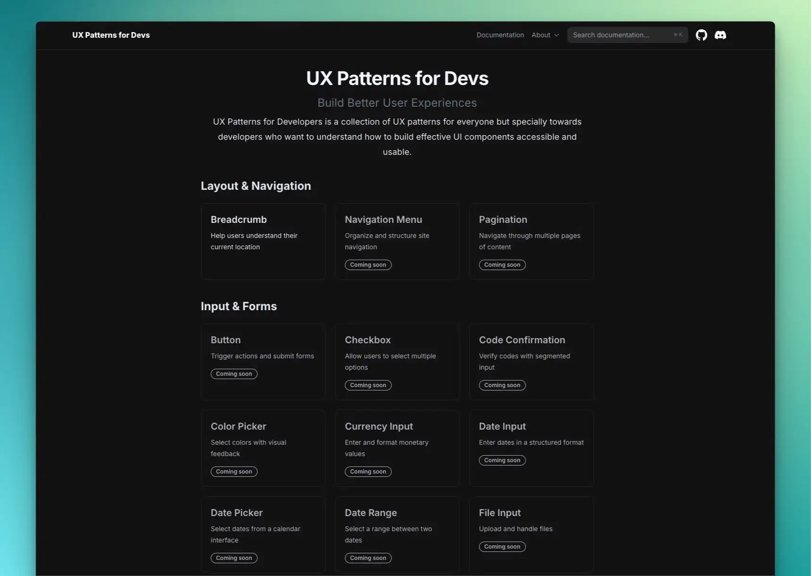

# UX Patterns for Devs

UX Patterns for Developers is a free collection of UX patterns towards developers who want to understand how to build effective UI components accessible and usable.



> [!NOTE]
> This project is a work in progress. New content and updates should be expected regularly.

## 🧩 Patterns

This is an non-exhaustive list of available and incoming patterns.

### Navigation

- [Breadcrumbs](https://uxpatterns.dev/en/patterns/navigation/breadcrumb)
- Navigation Menu (coming soon)
- Pagination (coming soon)

### Input & Forms

- [Button](https://uxpatterns.dev/en/patterns/forms/button)
- Checkbox (coming soon)
- Code Confirmation (coming soon)
- Color Picker (coming soon)
- Currency Input (coming soon)
- Date Input (coming soon)
- Date Picker (coming soon)
- Date Range (coming soon)
- File Input (coming soon)
- Form Validation (coming soon)
- Multi-select Input (coming soon)
- Password (coming soon)
- Phone Number (coming soon)
- Radio (coming soon)
- Search Input (coming soon)
- Selection Input (coming soon)
- Slider (coming soon)
- Text Field (coming soon)
- Time Input (coming soon)
- Toggle (coming soon)

### Content Management

- Accordion (coming soon)
- Carousel (coming soon)
- Drag and Drop (coming soon)
- Modal (coming soon)
- Tooltip (coming soon)

### User Feedback

- Empty States (coming soon)
- Loading Indicator (coming soon)
- Notifications (coming soon)
- Progress Indicator (coming soon)

## Getting Started

To start the project locally, run:

```bash
pnpm run dev
```

### Generate new pattern

This command will generate a new pattern template. Simply specify the language, the category and the name of the pattern starting with a capital letter.

```bash
pnpm run generate
```

## ✨ Contributors

You are welcome to contribute to this project! Please read the [CONTRIBUTING.md](https://github.com/thedaviddias/ux-patterns-for-developers/blob/main/.github/CONTRIBUTING.md).

<!-- ALL-CONTRIBUTORS-LIST:START - Do not remove or modify this section -->
<!-- prettier-ignore-start -->
<!-- markdownlint-disable -->

<!-- markdownlint-restore -->
<!-- prettier-ignore-end -->

<!-- ALL-CONTRIBUTORS-LIST:END -->

## License

MIT © [David Dias](https://github.com/thedaviddias)
