## When to use Different Types of Text Fields?

```mermaid
graph TD
  A[Do users need to enter freeform text?] -->|Yes| B[Does it require a single line?]
  B -->|Yes| C[Use Standard Text Field `<input type="text">`]
  B -->|No| D[Use Textarea `<textarea>` for multi-line input]

  A -->|No| E[Is the input structured or formatted?]
  E -->|Yes| F[Use Specific Input Type]
  E -->|No| C[Use Standard Text Field `<input type="text">`]
```

| Feature                         | Standard Text Field (`<input type="text">`) | Email Field (`<input type="email">`) | Password Field (`<input type="password">`) | Search Field (`<input type="search">`) | Telephone Field (`<input type="tel">`) | Number Field (`<input type="number">`) |
| ------------------------------- | ------------------------------------------- | ------------------------------------ | ------------------------------------------ | -------------------------------------- | -------------------------------------- | -------------------------------------- |
| **Use Case**                    | General text input                          | Email addresses                      | Password entry                             | Search queries                         | Phone numbers                          | Numeric inputs                         |
| **Supports Auto-Validation?**   | ❌ No                                       | ✅ Yes (valid email format)          | ❌ No                                      | ❌ No                                  | ❌ No                                  | ✅ Yes (only numeric input allowed)    |
| **Supports Autofill?**          | ✅ Yes                                      | ✅ Yes                               | ✅ Yes                                     | ✅ Yes                                 | ✅ Yes                                 | ✅ Yes                                 |
| **Masking Support?**            | ❌ No                                       | ❌ No                                | ✅ Yes (hides input characters)            | ❌ No                                  | ❌ No                                  | ❌ No                                  |
| **Allows Non-Standard Input?**  | ✅ Yes                                      | ❌ No (only valid email formats)     | ✅ Yes (hidden input)                      | ✅ Yes (optimized for search)          | ✅ Yes (any phone number format)       | ❌ No (only numbers allowed)           |
| **Special Keyboard on Mobile?** | ❌ No                                       | ✅ Yes (`@` and `.com` on keyboards) | ✅ Yes (secure keyboard)                   | ✅ Yes (optimized for searches)        | ✅ Yes (numeric keyboard)              | ✅ Yes (numeric keyboard)              |
| **Supports Pattern Matching?**  | ✅ Yes                                      | ✅ Yes                               | ❌ No                                      | ✅ Yes                                 | ✅ Yes                                 | ✅ Yes                                 |
| **Best For**                    | General-purpose text input                  | Emails                               | Secure password entry                      | Search bars                            | Phone number input                     | Numeric-only input                     |
