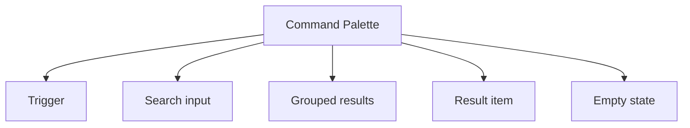

import { GuidesBanner } from "@/components/guides-banner";

## Overview

A **Command Palette** pattern helps teams create a reliable way to find and run commands, destinations, and recent items from a single keyboard-first surface. It is most useful when teams need editor and workspace commands.

Compared with adjacent patterns, this pattern should reduce friction without hiding the state, rules, or recovery paths people need to keep moving.

<BuildEffort
  level="high"
  description="Requires coordinated state, async data, and strong accessibility coverage across the full command palette experience."
/>

<GuidesBanner
  title="Command Palette vs Search Field?"
  description="Compare a power-user launcher with visible search"
  guidePath="/pattern-guide/search-field-vs-command-palette"
/>

## Use Cases

### When to use:

- Editor and workspace commands
- Settings and preference shortcuts
- Object or [page navigation](/glossary/pagination) for power users
### When not to use:

- Use a simpler visible navigation or single-page flow when the product surface is still small.
- Avoid advanced interaction patterns if the team cannot support their state complexity well.
- Do not introduce hidden power-user behavior before the plain path is already strong.

### Common scenarios and examples

- Editor and workspace commands where users need a clear, repeatable interface model.
- Settings and preference shortcuts where users need a clear, repeatable interface model.
- Object or page navigation for power users where users need a clear, repeatable interface model.

<PatternComparison
  current="Command Palette"
  title="Choose visible search vs a power-user launcher"
  description="Command palette is for action-heavy products and keyboard-first speed. Compare it with simpler, more visible surfaces before you add a hidden expert layer."
  alternatives={[
  {
    "name": "Search Field",
    "path": "/patterns/forms/search-field",
    "when": "users are mainly retrieving content or filtering data and the control should stay visible",
    "pros": [
      "Easy to discover",
      "Works for broad audiences",
      "Better for simpler surfaces"
    ],
    "cons": [
      "Less suited to action-heavy workflows",
      "Slower for expert users"
    ]
  },
  {
    "name": "Navigation Menu",
    "path": "/patterns/navigation/navigation-menu",
    "when": "users browse a stable set of destinations and do not need to type to get around",
    "pros": [
      "Fully visible information architecture",
      "Great for novice users",
      "No hidden shortcuts to learn"
    ],
    "cons": [
      "Breaks down as the action space grows",
      "Less efficient for expert users"
    ]
  }
]}
/>

## Benefits

- Clarifies how command palette should behave before implementation details begin to sprawl.
- Creates a reusable interaction model for teams who need to find and run commands, destinations, and recent items from a single keyboard-first surface.
- Makes accessibility, edge cases, and recovery paths part of the design instead of post-launch cleanup.
- Gives product, design, and engineering a shared language for evaluating trade-offs.

## Drawbacks

- The pattern introduces more state and edge cases than its static mockups suggest.
- It requires coordination between content, interaction, and accessibility choices.
- Teams often underestimate how much polish is needed for non-happy states.
- Responsive behavior usually needs explicit planning rather than minor CSS tweaks.

## Anatomy



### Component Structure

1. **Trigger**

- Opens the palette from a keyboard shortcut or visible button.

2. **Search input**

- Captures the query and keeps focus anchored in the palette.

3. **Grouped results**

- Separates commands, pages, or recent items into understandable buckets.

4. **Result item**

- Presents the label, hint text, and optional shortcut for each action.

5. **Empty state**

- Explains what to do when the query matches nothing.

#### Summary of Components

| Component | Required? | Purpose |
| --- | --- | --- |
| Trigger | ✅ Yes | Opens the palette from a keyboard shortcut or visible button. |
| Search input | ✅ Yes | Captures the query and keeps focus anchored in the palette. |
| Grouped results | ✅ Yes | Separates commands, pages, or recent items into understandable buckets. |
| Result item | ✅ Yes | Presents the label, hint text, and optional shortcut for each action. |
| Empty state | ❌ No | Explains what to do when the query matches nothing. |

## Variations

### Universal launcher

Mixes navigation, creation, and settings actions in one palette.

**When to use:** Use when the product has many destinations and power-user commands.

### Contextual palette

Shows only actions related to the current object or page.

**When to use:** Use when the product already has a separate global search experience.

### Recent-first palette

Promotes recent commands and workspaces before long-tail search matches.

**When to use:** Use when repeat use and speed matter more than exhaustive discovery.

## Best Practices

### Content

**Do's ✅**

- State the job of the pattern clearly before layering on visual complexity.
- Keep labels, controls, and outcomes in the same mental group.
- Use supporting text to reduce ambiguity, not to restate the obvious.

**Don'ts ❌**

- Do not force users to infer system state from decoration alone.
- Do not add extra interaction steps without a clear benefit.
- Do not assume the design works equally well for novice and expert users.

### Accessibility

**Do's ✅**

- Verify that command palette can be completed using keyboard alone.
- Keep focus order logical when the pattern opens, updates, or reveals additional UI.
- Preserve a visible focus state that is still readable at high zoom.
- Use semantic elements first, then add ARIA only where semantics alone are not enough.
- Announce state changes such as errors, loading, or completion in the right place and with the right politeness.

**Don'ts ❌**

- Do not remove focus styles without a visible replacement.
- Do not depend on placeholder or helper text that disappears before the user can act on it.
- Do not assume pointer, touch, and assistive technologies will all interact with the pattern the same way.

### Visual Design

**Do's ✅**

- Preserve a clear hierarchy between primary content, secondary metadata, and controls.
- Use visual rhythm to make the pattern easier to scan.
- Treat hover, focus, and active states as part of the design system.

**Don'ts ❌**

- Do not overload the default view with secondary options.
- Do not use visual emphasis without meaning behind it.
- Do not let state changes shift unrelated content unexpectedly.

### Layout & Positioning

**Do's ✅**

- Keep the pattern stable across common breakpoints.
- Preserve proximity between cause and effect.
- Plan empty, loading, and error states in the same container.

**Don'ts ❌**

- Do not let layout rearrangements hide the current state.
- Do not depend on fixed heights when content length is variable.
- Do not design only for the most ideal dataset or [viewport](/glossary/viewport).
## State Management

- Keep the canonical state small and derivable so advanced UI behaviors do not fork into several contradictory versions.
- Persist enough context that users can leave and return without feeling like the system forgot their progress or place.
- Treat URL state, stored preferences, and in-memory interaction state separately so restoration rules stay clear.

## Implementation Checklist

- [ ] Define the canonical state model before implementation starts.
- [ ] Specify empty, loading, and failure states alongside the default interaction.
- [ ] Test the full pattern with keyboard-only use before polishing advanced visuals.
- [ ] Document how the pattern behaves on narrow screens and with reduced motion enabled.

## Common Mistakes & Anti-Patterns 🚫

### **Designing only the happy path**

**The Problem:**
The pattern feels polished until loading, empty, and failure states appear.

**How to Fix It?**
Specify the full lifecycle alongside the default state so implementation does not improvise later.

---

### **Letting interaction and content drift apart**

**The Problem:**
Users work harder when controls, status, and supporting information feel disconnected.

**How to Fix It?**
Keep the information architecture of the pattern close to the interaction model.

---

### **Treating accessibility as a final pass**

**The Problem:**
Keyboard, announcement, and reading-order issues become expensive once the interaction is already fixed.

**How to Fix It?**
Bake semantics, focus behavior, and announcements into the first implementation.

## Examples

### Live Preview

<Playground patternType="advanced" pattern="command-palette" example="basic" presentation="hidden-code" />

### Basic Implementation

```html
<div class="demo-shell card palette">
  <p class="muted">Press <kbd>⌘</kbd> + <kbd>K</kbd> in many apps to open a command palette.</p>
  <input id="palette-input" type="search" placeholder="Search commands" />
  <ul id="palette-list">
    <li>Open settings</li>
    <li>Create workspace</li>
    <li>Invite teammate</li>
    <li>Search patterns</li>
  </ul>
</div>
```

### What this example demonstrates

- A clear baseline implementation of command palette that can be reviewed without framework-specific noise.
- Visible state, spacing, and content hierarchy that mirror the implementation guidance above.
- A small enough surface to copy into a design review or prototype before scaling the pattern up.

### Implementation Notes

- Start with [semantic HTML](/glossary/semantic-html) and only add JavaScript where the interaction truly requires it.
- Keep styling tokens and spacing consistent with adjacent controls or layouts.
- If the live implementation introduces async behavior, mirror those states in the code example rather than documenting them only in prose.
## Accessibility

### Keyboard Interaction

- [ ] Verify that command palette can be completed using keyboard alone.
- [ ] Keep focus order logical when the pattern opens, updates, or reveals additional UI.
- [ ] Preserve a visible focus state that is still readable at high zoom.

### Screen Reader Support

- [ ] Use semantic elements first, then add ARIA only where semantics alone are not enough.
- [ ] Announce state changes such as errors, loading, or completion in the right place and with the right politeness.
- [ ] Connect labels, hints, and status text with `aria-describedby` or structural headings when useful.

### Visual Accessibility

- [ ] Do not rely on color alone to convey severity, completion, or selection state.
- [ ] Test the pattern at 200% zoom and with reduced motion enabled.
- [ ] Ensure [touch targets](/glossary/touch-targets) remain comfortable on mobile and coarse pointers.
## Testing Guidelines

### Functional Testing

- [ ] Verify the default, loading, error, and success states for command palette.
- [ ] Test the primary action and the obvious recovery action in the same run.
- [ ] Confirm that state survives refresh, navigation, or retry in the way users would expect.

### Accessibility Testing

- [ ] Run keyboard-only checks and at least one [screen reader](/glossary/screen-reader) pass on the final implementation.
- [ ] Validate headings, labels, and announcement behavior with real content rather than lorem ipsum.
- [ ] Check color contrast and focus visibility in both default and stressed states.
### Edge Cases

- [ ] Test empty, long, duplicated, and unexpectedly formatted content.
- [ ] Check behavior on narrow screens, zoomed layouts, and slower networks.
- [ ] Verify that optimistic or asynchronous states reconcile correctly after a failure.

## Frequently Asked Questions

<FaqStructuredData
  items={[
  {
    "question": "When should I choose Command Palette instead of Search Field?",
    "answer": "Choose command palette when the job depends on find and run commands, destinations, and recent items from a single keyboard-first surface. If the team only needs a lighter interaction with fewer states, Search Field will usually be easier to ship and maintain."
  },
  {
    "question": "What is the biggest implementation risk with Command Palette?",
    "answer": "The biggest risk is usually not the default visual state. It is the combination of state management, accessibility, and recovery behavior once loading, errors, or narrow screens enter the picture."
  },
  {
    "question": "How do I know whether command palette is working well?",
    "answer": "Watch whether users can complete the intended job without pausing to decode the interface, whether state changes feel trustworthy, and whether edge cases behave as intentionally as the happy path."
  }
]}
/>

## Related Patterns

<RelatedPatternsCard
  patterns={[
    {
      title: "Search Field",
      path: "/patterns/forms/search-field",
      description: "Search through content efficiently",
    },
    {
      title: "Modal",
      path: "/patterns/content-management/modal",
      description: "Display focused content or actions",
    },
    {
      title: "Navigation Menu",
      path: "/patterns/navigation/navigation-menu",
      description: "Organize and structure site navigation",
    },
  ]}
/>

## Resources

### References

- [WCAG 2.2](https://www.w3.org/TR/WCAG22/) - Accessibility baseline for keyboard support, focus management, and readable state changes.
- [WAI-ARIA Authoring Practices](https://www.w3.org/WAI/ARIA/apg/) - Reference patterns for keyboard behavior, semantics, and assistive technology support.

### Guides

- [WAI Fly-out Menus Tutorial](https://www.w3.org/WAI/tutorials/menus/flyout/) - Guidance for hover intent, disclosure timing, and focus handling in nested navigation.
- [MDN WAI-ARIA basics](https://developer.mozilla.org/en-US/docs/Learn_web_development/Core/Accessibility/WAI-ARIA_basics) - Guidance on when to rely on native HTML and when to introduce ARIA roles and states.

### Articles

- [Nielsen Norman Group: Writing links](https://www.nngroup.com/articles/writing-links/) - How link text influences comprehension, scanning, and navigation confidence.
- [Nielsen Norman Group: Tabs used right](https://www.nngroup.com/articles/tabs-used-right/) - Guidance for grouping content, labeling, and avoiding hidden complexity.

### NPM Packages

- [`cmdk`](https://www.npmjs.com/package/cmdk) - Command menu primitives for palettes, pickers, and searchable lists.
- [`kbar`](https://www.npmjs.com/package/kbar) - Action-command layer for searchable app navigation and power-user workflows.
- [`@radix-ui/react-dialog`](https://www.npmjs.com/package/%40radix-ui%2Freact-dialog) - Dialog primitive for modals, sheet-style overlays, and focus management.
