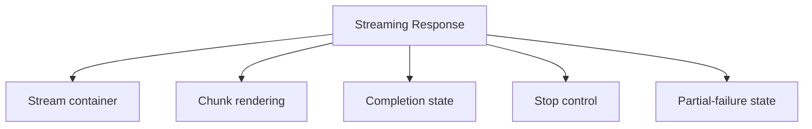

## Overview

A **Streaming Response** pattern helps teams create a reliable way to render AI output progressively so users can begin reading or acting before the full response is complete. It is most useful when teams need chat and assistant answers.

Compared with adjacent patterns, this pattern should reduce friction without hiding the state, rules, or recovery paths people need to keep moving.

<BuildEffort
  level="high"
  description="Requires coordinated state, async data, and strong accessibility coverage across the full streaming response experience."
/>

## Use Cases

### When to use:

- Chat and assistant answers
- Structured AI output that unfolds over time
- Long responses where immediate reading matters

### When not to use:

- Avoid adding AI-specific UI when a standard non-AI workflow would be clearer and more reliable.
- Do not expose advanced controls unless users can actually benefit from them.
- Do not hide model uncertainty behind polished visuals alone.

### Common scenarios and examples

- Chat and assistant answers where users need a clear, repeatable interface model.
- Structured AI output that unfolds over time where users need a clear, repeatable interface model.
- Long responses where immediate reading matters where users need a clear, repeatable interface model.

<PatternComparison
  alternatives={[
  {
    "name": "AI Loading States",
    "path": "/patterns/ai-intelligence/ai-loading-states",
    "when": "users need ai loading states instead of streaming response as the primary interaction",
    "pros": [
      "Clearer fit for its own job",
      "Lower ambiguity about the expected interaction"
    ],
    "cons": [
      "Less specialized for streaming response",
      "Different states and recovery paths to teach"
    ]
  },
  {
    "name": "AI Chat Interface",
    "path": "/patterns/ai-intelligence/ai-chat",
    "when": "users need ai chat interface instead of streaming response as the primary interaction",
    "pros": [
      "Clearer fit for its own job",
      "Lower ambiguity about the expected interaction"
    ],
    "cons": [
      "Less specialized for streaming response",
      "Different states and recovery paths to teach"
    ]
  },
  {
    "name": "Context Window",
    "path": "/patterns/ai-intelligence/context-window",
    "when": "users need context window instead of streaming response as the primary interaction",
    "pros": [
      "Clearer fit for its own job",
      "Lower ambiguity about the expected interaction"
    ],
    "cons": [
      "Less specialized for streaming response",
      "Different states and recovery paths to teach"
    ]
  }
]}
/>

## Benefits

- Clarifies how streaming response should behave before implementation details begin to sprawl.
- Creates a reusable interaction model for teams who need to render AI output progressively so users can begin reading or acting before the full response is complete.
- Makes accessibility, edge cases, and recovery paths part of the design instead of post-launch cleanup.
- Gives product, design, and engineering a shared language for evaluating trade-offs.

## Drawbacks

- It depends on variable model latency, output quality, and provider behavior.
- Trust drops quickly when limits, confidence, or recovery paths are hidden.
- State transitions are harder to design because the system can stream, retry, or partially fail.
- Cost and token usage become a real product constraint, not just an implementation detail.

## Anatomy



### Component Structure

1. **Stream container**

- Keeps partial output readable as it grows.

2. **Chunk rendering**

- Appends tokens, sections, or tool results in a stable order.

3. **Completion state**

- Signals when the stream is done or interrupted.

4. **Stop control**

- Lets users halt generation when it is no longer useful.

5. **Partial-failure state**

- Explains if streaming stops early or content is truncated.

#### Summary of Components

| Component | Required? | Purpose |
| --- | --- | --- |
| Stream container | ✅ Yes | Keeps partial output readable as it grows. |
| Chunk rendering | ✅ Yes | Appends tokens, sections, or tool results in a stable order. |
| Completion state | ✅ Yes | Signals when the stream is done or interrupted. |
| Stop control | ❌ No | Lets users halt generation when it is no longer useful. |
| Partial-failure state | ❌ No | Explains if streaming stops early or content is truncated. |

## Variations

### Token streaming

Appends small pieces continuously.

**When to use:** Use when immediacy matters most and content is conversational.

### Section streaming

Reveals complete paragraphs, cards, or blocks at a time.

**When to use:** Use when readability is more important than raw speed.

### Hybrid streaming

Shows quick early progress, then stabilizes into larger chunks.

**When to use:** Use when the response contains mixed narrative and structured content.

## Best Practices

### Content

**Do's ✅**

- Explain what the AI is doing and what users can still control.
- Use plain-language labels for models, actions, and limits.
- Show enough provenance, status, or history for the AI output to feel reviewable.

**Don'ts ❌**

- Do not present speculative output as guaranteed fact.
- Do not hide model changes, truncation, or tool usage when they change the result.
- Do not collapse all failures into a single generic error message.

### Accessibility

**Do's ✅**

- Verify that streaming response can be completed using keyboard alone.
- Keep focus order logical when the pattern opens, updates, or reveals additional UI.
- Preserve a visible focus state that is still readable at high zoom.
- Use semantic elements first, then add ARIA only where semantics alone are not enough.
- Announce state changes such as errors, loading, or completion in the right place and with the right politeness.

**Don'ts ❌**

- Do not remove focus styles without a visible replacement.
- Do not depend on placeholder or helper text that disappears before the user can act on it.
- Do not assume pointer, touch, and assistive technologies will all interact with the pattern the same way.

### Visual Design

**Do's ✅**

- Separate system status from generated content visually.
- Keep request, streaming, and completion states recognizable at a glance.
- Use subtle motion to show progress without distracting from reading.

**Don'ts ❌**

- Do not animate every token or status chip if it harms readability.
- Do not make AI controls compete with the response itself.
- Do not overload the first screen with advanced options users rarely need.

### Layout & Positioning

**Do's ✅**

- Keep prompt entry, result review, and follow-up actions logically grouped.
- Preserve enough history for people to understand why the current state exists.
- Make retries and alternate paths easy to find.

**Don'ts ❌**

- Do not let key controls move around as streaming content grows.
- Do not push critical notices below a long AI response.
- Do not assume a single-column desktop layout will translate to mobile unmodified.

## State Management

- Model the request lifecycle explicitly: idle, validating, sending, streaming, complete, interrupted, and failed.
- Preserve the prompt, settings, and visible system state when users retry or branch from the current result.
- If the interface supports multiple turns or tools, decide which state is local to the current turn and which belongs to the broader conversation.

## Error Handling

- Differentiate provider errors, policy blocks, context limits, and user-correctable input issues.
- Preserve enough context after a failure that users can retry without losing work.
- Offer a next best action such as retry, shorten input, switch model, or continue manually.

## API Integration

- Treat model responses as asynchronous and occasionally partial; the UI should remain coherent if chunks arrive late or out of order.
- Debounce or batch requests when the pattern updates live from typing or repeated toggles.
- Keep provider-specific identifiers and jargon out of the primary user-facing copy unless they materially change behavior.

## Performance

- Budget for network latency, token usage, and client-side rendering of long responses together, not as separate concerns.
- Stream or chunk content when it improves time-to-first-value, but stabilize layout so reading does not become jittery.
- Track expensive states such as long prompts, model changes, and retries so you can tune the experience with evidence.

## Common Mistakes & Anti-Patterns 🚫

### **Hiding the system state**

**The Problem:**
Users cannot tell whether the model is waiting, streaming, retrying, or done.

**How to Fix It?**
Expose clear request lifecycle states and keep them visible near the content they affect.

---

### **Treating failures like standard form errors**

**The Problem:**
AI failures include safety blocks, context limits, model availability, and partial output, not just a failed request.

**How to Fix It?**
Differentiate failure modes and give recovery actions that match each one.

---

### **Ignoring token and latency budgets**

**The Problem:**
The experience feels unpredictable when responses get slower, shorter, or more expensive without explanation.

**How to Fix It?**
Design token, latency, and provider constraints into the interface from the beginning.

## Examples

### Basic Implementation

```html
<div class="demo-shell card generic-card"><h2>Streaming Response</h2><p class="muted">Basic demo placeholder for real-time ai response streaming.</p></div>
```

### What this example demonstrates

- A clear baseline implementation of streaming response that can be reviewed without framework-specific noise.
- Visible state, spacing, and content hierarchy that mirror the implementation guidance above.
- A small enough surface to copy into a design review or prototype before scaling the pattern up.

### Implementation Notes

- Start with semantic HTML and only add JavaScript where the interaction truly requires it.
- Keep styling tokens and spacing consistent with adjacent controls or layouts.
- If the live implementation introduces async behavior, mirror those states in the code example rather than documenting them only in prose.

## Accessibility

### Keyboard Interaction

- [ ] Verify that streaming response can be completed using keyboard alone.
- [ ] Keep focus order logical when the pattern opens, updates, or reveals additional UI.
- [ ] Preserve a visible focus state that is still readable at high zoom.

### Screen Reader Support

- [ ] Use semantic elements first, then add ARIA only where semantics alone are not enough.
- [ ] Announce state changes such as errors, loading, or completion in the right place and with the right politeness.
- [ ] Connect labels, hints, and status text with `aria-describedby` or structural headings when useful.

### Visual Accessibility

- [ ] Do not rely on color alone to convey severity, completion, or selection state.
- [ ] Test the pattern at 200% zoom and with reduced motion enabled.
- [ ] Ensure touch targets remain comfortable on mobile and coarse pointers.

## Testing Guidelines

### Functional Testing

- [ ] Verify the default, loading, error, and success states for streaming response.
- [ ] Test the primary action and the obvious recovery action in the same run.
- [ ] Confirm that state survives refresh, navigation, or retry in the way users would expect.

### Accessibility Testing

- [ ] Run keyboard-only checks and at least one screen reader pass on the final implementation.
- [ ] Validate headings, labels, and announcement behavior with real content rather than lorem ipsum.
- [ ] Check color contrast and focus visibility in both default and stressed states.

### Edge Cases

- [ ] Test empty, long, duplicated, and unexpectedly formatted content.
- [ ] Check behavior on narrow screens, zoomed layouts, and slower networks.
- [ ] Verify that optimistic or asynchronous states reconcile correctly after a failure.

## Frequently Asked Questions

<FaqStructuredData
  items={[
  {
    "question": "When should I choose Streaming Response instead of AI Loading States?",
    "answer": "Choose streaming response when the job depends on render AI output progressively so users can begin reading or acting before the full response is complete. If the team only needs a lighter interaction with fewer states, AI Loading States will usually be easier to ship and maintain."
  },
  {
    "question": "What is the biggest implementation risk with Streaming Response?",
    "answer": "The biggest risk is usually not the default visual state. It is the combination of state management, accessibility, and recovery behavior once loading, errors, or narrow screens enter the picture."
  },
  {
    "question": "How do I know whether streaming response is working well?",
    "answer": "Watch whether users can complete the intended job without pausing to decode the interface, whether state changes feel trustworthy, and whether edge cases behave as intentionally as the happy path."
  }
]}
/>

## Related Patterns

<RelatedPatternsCard
  patterns={[
    {
      title: "AI Loading States",
      path: "/patterns/ai-intelligence/ai-loading-states",
      description: "Loading states for AI operations",
    },
    {
      title: "AI Chat Interface",
      path: "/patterns/ai-intelligence/ai-chat",
      description: "Conversational AI chat interfaces",
    },
    {
      title: "Context Window",
      path: "/patterns/ai-intelligence/context-window",
      description: "Managing AI conversation context",
    },
  ]}
/>

## Resources

### References

- [WCAG 2.2](https://www.w3.org/TR/WCAG22/) - Accessibility baseline for keyboard support, focus management, and readable state changes.
- [MDN ARIA live regions](https://developer.mozilla.org/docs/Web/Accessibility/ARIA/Guides/Live_regions) - How to announce streaming text, status updates, and non-modal feedback to screen readers.

### Guides

- [People + AI Guidebook](https://pair.withgoogle.com/guidebook-v2/) - A practical framework for building AI-assisted interfaces with transparency and user control.

### Articles

- [Microsoft Human-AI Interaction Guidelines](https://www.microsoft.com/en-us/research/project/guidelines-for-human-ai-interaction/) - Research-backed recommendations for AI feedback, confidence, intervention, and recovery.

### NPM Packages

- [`ai`](https://www.npmjs.com/package/ai) - Vercel AI SDK primitives for chat, streaming UI, tools, and model integrations.
- [`react-markdown`](https://www.npmjs.com/package/react-markdown) - Render markdown-rich responses, citations, and structured assistant output.
- [`swr`](https://www.npmjs.com/package/swr) - Lightweight remote-state hooks for optimistic feedback and periodic updates.
