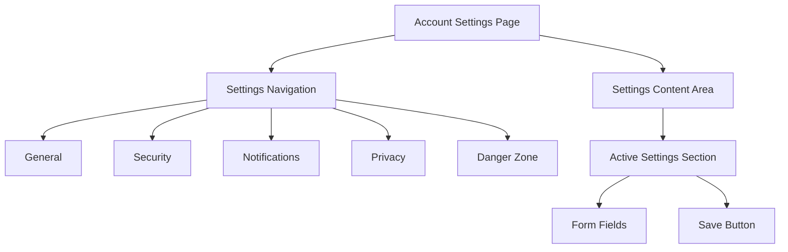

<PatternPreview />

## Overview

**Account Settings** is the centralized interface where authenticated users manage their account configuration, security preferences, notification settings, and personal data. It serves as the control center for everything related to the user's relationship with the application.

A well-organized settings page groups related options logically, confirms destructive actions, and provides clear feedback when changes are saved — all while keeping sensitive operations behind re-authentication.

<BuildEffort
  level="medium"
  description="Requires multiple form sections with independent save actions, re-authentication for sensitive changes (email, password, 2FA), confirmation dialogs for destructive actions (delete account), and responsive layout for many setting groups."
/>

## Use Cases

### When to use:

Use **Account Settings** to **give users control over their account configuration, security, and preferences**.

**Common scenarios include:**

- Changing account email or password
- Managing notification preferences (email, push, in-app)
- Configuring privacy and data sharing settings
- Setting up or managing [two-factor authentication](/patterns/authentication/two-factor)
- Managing connected applications and [social login](/patterns/authentication/social-login) providers
- Deleting or deactivating an account

### When not to use:

- Public-facing profile display (use [User Profile](/patterns/authentication/user-profile) instead)
- Application-level settings that affect all users (use an admin panel)
- First-time onboarding configuration (use an onboarding wizard)
- Content or project settings specific to a workspace (use project settings)

### Common scenarios and examples

- Changing email address with re-authentication and verification
- Updating the account password (current password required)
- Toggling notification channels (email, SMS, push)
- Enabling or disabling two-factor authentication
- Downloading personal data (GDPR data export)
- Deleting the account with confirmation and grace period

<PatternComparison
  current="Account Settings"
  alternatives={[
    {
      name: "User Profile",
      path: "/patterns/authentication/user-profile",
      when: "displaying user information publicly or editing profile details like name and avatar",
      pros: ["Public-facing", "Display-oriented", "Social context"],
      cons: ["Not for security settings", "Not for notifications"]
    },
    {
      name: "Two-Factor Authentication",
      path: "/patterns/authentication/two-factor",
      when: "setting up or managing the second authentication factor",
      pros: ["Focused security flow", "Step-by-step setup"],
      cons: ["Single concern only", "Needs to live within broader settings"]
    },
    {
      name: "Password Reset",
      path: "/patterns/authentication/password-reset",
      when: "the user has forgotten their password and needs recovery",
      pros: ["Self-service recovery", "No current password needed"],
      cons: ["Only for forgotten passwords", "Not for proactive changes"]
    }
  ]}
/>

## Benefits

- Centralizes all account management in one discoverable location
- Gives users control over their data, privacy, and security
- Reduces support requests by enabling self-service account management
- Supports regulatory compliance (GDPR data export, account deletion)
- Builds trust by being transparent about what users can configure

## Drawbacks

- **Information overload** – Too many settings on one page overwhelm users
- **Sensitive operations risk** – Changing email or password without re-authentication is a security hole
- **Destructive action danger** – Account deletion without adequate confirmation can't be undone
- **Stale save states** – Users may not realize their changes haven't been saved
- **Navigation complexity** – Many settings groups need clear organization to remain usable

## Anatomy



### Component Structure

1. **Settings Navigation**

- Vertical sidebar or horizontal tabs listing settings categories
- Highlights the active section
- May be a simple anchor-link list on mobile

2. **General Settings**

- Display name, email, language, timezone
- Email change requires re-authentication and re-verification
- Basic profile information editable inline

3. **Security Settings**

- Password change (requires current password)
- Two-factor authentication setup and management
- Active sessions list with logout option
- Connected applications and social accounts

4. **Notification Settings**

- Toggles for email, push, and in-app notifications
- Grouped by notification type (marketing, security, product updates)
- Frequency options (immediate, daily digest, weekly)

5. **Privacy Settings**

- Data sharing preferences
- Profile visibility controls (public, private, team-only)
- Cookie and tracking preferences

6. **Danger Zone**

- Account deactivation and deletion
- Visually distinct (red border or background) to signal irreversibility
- Requires confirmation dialog and possibly re-authentication

7. **Save Mechanism**

- Per-section save buttons (not a single global save)
- Shows success/error feedback after saving
- Disables the save button when no changes have been made

#### Summary of Components

| Component            | Required? | Purpose                                                      |
| -------------------- | --------- | ------------------------------------------------------------ |
| Settings Navigation  | ✅ Yes    | Organizes settings into discoverable categories.             |
| General Settings     | ✅ Yes    | Email, name, language, and basic account info.               |
| Security Settings    | ✅ Yes    | Password, 2FA, sessions, and connected accounts.             |
| Notification Settings| ❌ No     | Controls for notification channels and frequency.            |
| Privacy Settings     | ❌ No     | Data sharing and visibility preferences.                     |
| Danger Zone          | ✅ Yes    | Account deletion and deactivation actions.                   |
| Save Mechanism       | ✅ Yes    | Per-section save with feedback.                              |

## Variations

### 1. Tabbed Settings
Horizontal tabs or vertical sidebar switching between settings sections on the same page.

**When to use:** Most applications — clean separation of sections without page reloads.

### 2. Single Long Page
All settings sections stacked vertically on one scrollable page with anchor navigation.

**When to use:** Applications with fewer settings categories (3-4 groups).

### 3. Modal-Based Settings
Settings open in a modal dialog overlaying the main application.

**When to use:** Simple applications or when settings are rarely accessed.

### 4. Multi-Page Settings
Each settings category is a separate page with its own URL.

**When to use:** Complex applications with many settings that benefit from deep linking and URL bookmarking.

### 5. Wizard-Based Settings
A guided step-by-step flow for initial configuration or comprehensive review.

**When to use:** First-time setup or annual security review flows.

## Examples

### Basic HTML Implementation

```html
<div class="settings-layout">
  <nav class="settings-nav" aria-label="Account settings">
    <ul>
      <li><a href="#general" aria-current="true">General</a></li>
      <li><a href="#security">Security</a></li>
      <li><a href="#notifications">Notifications</a></li>
      <li><a href="#danger">Danger zone</a></li>
    </ul>
  </nav>

  <main class="settings-content">
    <section id="general" class="settings-section">
      <h2>General</h2>

      <form class="settings-form" data-section="general">
        <div class="form-field">
          <label for="display-name">Display name</label>
          <input type="text" id="display-name" name="name" value="Jane Doe" autocomplete="name" />
        </div>

        <div class="form-field">
          <label for="email">Email address</label>
          <input type="email" id="email" name="email" value="jane@example.com" autocomplete="email" />
          <p class="field-hint">Changing your email requires verification.</p>
        </div>

        <div class="form-field">
          <label for="language">Language</label>
          <select id="language" name="language">
            <option value="en" selected>English</option>
            <option value="fr">Français</option>
            <option value="es">Español</option>
          </select>
        </div>

        <div class="form-actions">
          <button type="submit" class="save-btn" disabled>Save changes</button>
          <span class="save-status" role="status" aria-live="polite"></span>
        </div>
      </form>
    </section>

    <section id="security" class="settings-section">
      <h2>Security</h2>

      <div class="settings-item">
        <div class="settings-item-info">
          <h3>Password</h3>
          <p>Last changed 3 months ago</p>
        </div>
        <button type="button" class="action-btn">Change password</button>
      </div>

      <div class="settings-item">
        <div class="settings-item-info">
          <h3>Two-factor authentication</h3>
          <p class="status-badge enabled">Enabled</p>
        </div>
        <button type="button" class="action-btn">Manage</button>
      </div>
    </section>

    <section id="danger" class="settings-section danger-zone">
      <h2>Danger zone</h2>
      <div class="settings-item">
        <div class="settings-item-info">
          <h3>Delete account</h3>
          <p>Permanently delete your account and all associated data.</p>
        </div>
        <button type="button" class="danger-btn">Delete account</button>
      </div>
    </section>
  </main>
</div>
```

### React Implementation

```jsx
import { useState, useCallback } from 'react';

function SettingsSection({ title, children, onSave, isSaving }) {
  const [hasChanges, setHasChanges] = useState(false);
  const [saveStatus, setSaveStatus] = useState(null);

  const handleSave = useCallback(async (e) => {
    e.preventDefault();
    const formData = new FormData(e.target);
    try {
      await onSave(Object.fromEntries(formData));
      setSaveStatus('saved');
      setHasChanges(false);
      setTimeout(() => setSaveStatus(null), 3000);
    } catch {
      setSaveStatus('error');
    }
  }, [onSave]);

  return (
    <section className="settings-section">
      <h2>{title}</h2>
      <form onSubmit={handleSave} onChange={() => setHasChanges(true)}>
        {children}
        <div className="form-actions">
          <button type="submit" className="save-btn" disabled={!hasChanges || isSaving}>
            {isSaving ? 'Saving…' : 'Save changes'}
          </button>
          {saveStatus === 'saved' && (
            <span className="save-status success" role="status">Changes saved</span>
          )}
          {saveStatus === 'error' && (
            <span className="save-status error" role="status">Failed to save. Try again.</span>
          )}
        </div>
      </form>
    </section>
  );
}

function DangerZone({ onDelete }) {
  const [showConfirm, setShowConfirm] = useState(false);

  return (
    <section className="settings-section danger-zone">
      <h2>Danger zone</h2>
      <div className="settings-item">
        <div>
          <h3>Delete account</h3>
          <p>Permanently delete your account and all associated data.</p>
        </div>
        {showConfirm ? (
          <div className="confirm-actions">
            <p><strong>Are you sure? This cannot be undone.</strong></p>
            <button className="danger-btn" onClick={onDelete}>Yes, delete my account</button>
            <button className="cancel-btn" onClick={() => setShowConfirm(false)}>Cancel</button>
          </div>
        ) : (
          <button className="danger-btn" onClick={() => setShowConfirm(true)}>
            Delete account
          </button>
        )}
      </div>
    </section>
  );
}
```

### CSS Styling

```css
.settings-layout {
  display: grid;
  grid-template-columns: 14rem 1fr;
  gap: 2rem;
  max-width: 56rem;
  margin: 2rem auto;
  padding: 0 1rem;
}

.settings-nav ul {
  list-style: none;
  padding: 0;
  margin: 0;
  position: sticky;
  top: 5rem;
}

.settings-nav a {
  display: block;
  padding: 0.5rem 0.75rem;
  border-radius: 0.375rem;
  text-decoration: none;
  color: #374151;
  font-size: 0.875rem;
}

.settings-nav a:hover { background: #f3f4f6; }
.settings-nav a[aria-current="true"] { background: #dbeafe; color: #1d4ed8; font-weight: 500; }
.settings-nav a:focus-visible { outline: 2px solid #2563eb; outline-offset: 2px; }

.settings-section {
  padding-bottom: 2rem;
  border-bottom: 1px solid #e5e7eb;
  margin-bottom: 2rem;
}

.settings-section h2 {
  font-size: 1.25rem;
  font-weight: 600;
  margin: 0 0 1.25rem;
}

.settings-item {
  display: flex;
  justify-content: space-between;
  align-items: center;
  padding: 1rem 0;
  border-top: 1px solid #f3f4f6;
}

.settings-item h3 { font-size: 0.9375rem; font-weight: 500; margin: 0; }
.settings-item p { font-size: 0.8125rem; color: #6b7280; margin: 0.25rem 0 0; }

.status-badge {
  display: inline-block;
  padding: 0.125rem 0.5rem;
  border-radius: 9999px;
  font-size: 0.75rem;
  font-weight: 500;
}

.status-badge.enabled { background: #dcfce7; color: #166534; }
.status-badge.disabled { background: #fee2e2; color: #991b1b; }

.form-actions {
  display: flex;
  align-items: center;
  gap: 1rem;
  margin-top: 1.5rem;
}

.save-btn {
  padding: 0.625rem 1.25rem;
  background: #2563eb;
  color: #fff;
  border: none;
  border-radius: 0.5rem;
  font-size: 0.875rem;
  font-weight: 500;
  cursor: pointer;
}

.save-btn:hover:not(:disabled) { background: #1d4ed8; }
.save-btn:disabled { opacity: 0.5; cursor: not-allowed; }
.save-btn:focus-visible { outline: 2px solid #2563eb; outline-offset: 2px; }

.save-status {
  font-size: 0.8125rem;
  font-weight: 500;
}

.save-status.success { color: #16a34a; }
.save-status.error { color: #dc2626; }

.action-btn {
  padding: 0.5rem 1rem;
  border: 1px solid #d1d5db;
  border-radius: 0.375rem;
  background: #fff;
  font-size: 0.8125rem;
  cursor: pointer;
}

.action-btn:hover { background: #f9fafb; }

.danger-zone { border: 1px solid #fca5a5; border-radius: 0.5rem; padding: 1.5rem; }
.danger-zone h2 { color: #dc2626; }

.danger-btn {
  padding: 0.5rem 1rem;
  border: 1px solid #dc2626;
  border-radius: 0.375rem;
  background: #fff;
  color: #dc2626;
  font-size: 0.8125rem;
  font-weight: 500;
  cursor: pointer;
}

.danger-btn:hover { background: #fef2f2; }
.danger-btn:focus-visible { outline: 2px solid #dc2626; outline-offset: 2px; }

@media (max-width: 768px) {
  .settings-layout { grid-template-columns: 1fr; }
  .settings-nav ul { display: flex; gap: 0.25rem; overflow-x: auto; position: static; }
}
```

## Best Practices

### Content

**Do's ✅**

- Group related settings into clear categories (General, Security, Notifications)
- Show the current value for each setting before editing
- Provide descriptive hints for sensitive changes ("Changing your email requires verification")
- Use section-specific save buttons rather than a single global save

**Don'ts ❌**

- Don't put all settings in a single unsorted list
- Don't use technical jargon for setting labels
- Don't make destructive actions look like regular settings — isolate them in a "Danger zone"

### Accessibility

**Do's ✅**

- Use proper heading hierarchy (h2 for sections, h3 for items)
- Associate all form fields with labels
- Announce save status with `aria-live="polite"` on the status element
- Ensure the settings navigation is a `<nav>` with `aria-label`
- Use `aria-current` on the active navigation item

**Don'ts ❌**

- Don't rely on color alone for status indicators (enabled/disabled)
- Don't auto-save without confirmation for destructive changes
- Don't use modals for every setting change — inline editing is faster

### Visual Design

**Do's ✅**

- Use a consistent card or section style across all settings groups
- Visually separate the danger zone with a distinct border or background
- Show clear feedback when settings are saved (success message, disabled save button)
- Use toggle switches for binary on/off settings

**Don'ts ❌**

- Don't crowd too many settings into a single view
- Don't hide important security settings behind multiple navigation levels

### Mobile & Touch Considerations

**Do's ✅**

- Stack the settings navigation horizontally or collapse it on mobile
- Ensure all toggle switches and buttons have 44×44px minimum touch targets
- Keep forms short enough to avoid excessive scrolling per section

**Don'ts ❌**

- Don't use a fixed sidebar that takes too much space on narrow screens
- Don't use hover-only interactions for settings toggles

### Layout & Positioning

**Do's ✅**

- Use a sidebar + content layout on desktop (14rem sidebar + flexible content)
- Make the sidebar sticky so it stays visible while scrolling through long settings
- Position save buttons at the bottom of each section

**Don'ts ❌**

- Don't put save buttons in the header or sidebar — keep them contextual to each section
- Don't change the layout between settings sections

## Common Mistakes & Anti-Patterns 🚫

### Global Save Button for All Settings
**The Problem:**
A single "Save all" button at the bottom of the page means users must scroll to save, and it's unclear which changes will be applied.

**How to Fix It:**
Use per-section save buttons. Each section saves independently with its own feedback message.

---

### No Re-Authentication for Sensitive Changes
**The Problem:**
Users can change their email, password, or disable 2FA without proving their identity again, allowing attackers with session access to take over the account.

**How to Fix It:**
Require the current password (or 2FA code) before allowing changes to email, password, security settings, or account deletion.

---

### No Confirmation for Account Deletion
**The Problem:**
A single click on "Delete account" permanently destroys the account without warning.

**How to Fix It:**
Use a multi-step confirmation: first click reveals a warning, second click confirms. Consider requiring the user to type "DELETE" or their email. Offer a grace period for recovery.

---

### Unsaved Changes Lost on Navigation
**The Problem:**
Users make changes in one section, navigate to another, and lose their unsaved work without warning.

**How to Fix It:**
Track dirty state per section. Show a "You have unsaved changes" warning before navigating away. Use `beforeunload` event for page-level protection.

---

### No Save Feedback
**The Problem:**
Users click "Save" and nothing visually changes, leaving them unsure if the save succeeded.

**How to Fix It:**
Show a temporary success message ("Changes saved") with `role="status"` for screen readers. Disable the save button after saving until new changes are made.

## Security Considerations

### Re-Authentication

- **Email changes** — Require current password before allowing email change; verify new email
- **Password changes** — Require current password before setting a new one
- **2FA changes** — Require current password or 2FA code before modifying 2FA settings
- **Account deletion** — Require password and confirmation before processing

### Session Management

- **Active sessions** — Show a list of active sessions with device info and location
- **Session revocation** — Allow users to log out of individual sessions or all sessions
- **Session timeout** — Re-authenticate for sensitive settings after a period of inactivity

### Data Protection

- **GDPR compliance** — Provide data export and deletion capabilities
- **Audit log** — Record all settings changes for security review
- **Rate limiting** — Limit sensitive operations (email change, password change) to prevent abuse

## Micro-Interactions & Animations

### Save Success Feedback
- **Effect:** "Changes saved" message fades in with a checkmark, then fades out after 3 seconds
- **Timing:** 200ms fade-in, 3s display, 200ms fade-out
- **Trigger:** Successful save API response
- **Implementation:** CSS opacity transition with JavaScript timeout

### Toggle Switch Animation
- **Effect:** Toggle thumb slides with a smooth ease and background color transitions
- **Timing:** 200ms ease
- **Trigger:** Toggle click/tap
- **Implementation:** CSS transition on `transform` and `background-color`

### Danger Zone Confirmation
- **Effect:** Delete button expands to reveal confirmation text and confirm/cancel buttons
- **Timing:** 200ms height/opacity transition
- **Trigger:** First click on the delete button
- **Implementation:** CSS max-height transition with state management

### Dirty State Indicator
- **Effect:** Save button transitions from disabled (gray) to enabled (blue) when changes are detected
- **Timing:** 150ms color transition
- **Trigger:** Any form field value change
- **Implementation:** CSS transition on `background-color` and `opacity`

## Tracking

### Key Events to Track

| **Event Name** | **Description** | **Why Track It?** |
| --- | --- | --- |
| `settings.page_viewed` | User visits the settings page | Measure settings page discovery |
| `settings.section_viewed` | User navigates to a specific section | Track which settings users access |
| `settings.saved` | User saves changes in a section | Measure save frequency |
| `settings.password_changed` | User changes their password | Track security behavior |
| `settings.2fa_toggled` | User enables or disables 2FA | Monitor security adoption |
| `settings.account_deleted` | User deletes their account | Track churn reasons |
| `settings.data_exported` | User requests data export | Monitor GDPR compliance usage |

### Event Payload Structure

```json
{
  "event": "settings.saved",
  "properties": {
    "section": "general",
    "fields_changed": ["display_name", "language"],
    "device_type": "desktop",
    "time_on_page_ms": 45000
  }
}
```

### Key Metrics to Analyze

- **Settings Visit Rate:** How often users access account settings
- **Section Popularity:** Which settings categories are visited most
- **Save Success Rate:** How often save attempts succeed vs. fail
- **2FA Adoption Rate:** Percentage of users with 2FA enabled via settings
- **Account Deletion Rate:** How often users delete their accounts (churn signal)

## Localization

```json
{
  "account_settings": {
    "page_title": "Account settings",
    "sections": {
      "general": "General",
      "security": "Security",
      "notifications": "Notifications",
      "privacy": "Privacy",
      "danger_zone": "Danger zone"
    },
    "actions": {
      "save": "Save changes",
      "saving": "Saving…",
      "saved": "Changes saved",
      "save_error": "Failed to save. Try again.",
      "cancel": "Cancel",
      "change": "Change",
      "manage": "Manage"
    },
    "danger": {
      "delete_heading": "Delete account",
      "delete_description": "Permanently delete your account and all associated data.",
      "delete_confirm": "Are you sure? This cannot be undone.",
      "delete_button": "Delete account",
      "confirm_button": "Yes, delete my account"
    }
  }
}
```

### RTL (Right-to-Left) Considerations

- Flip the sidebar + content grid layout
- Align labels and inputs to the right
- Mirror toggle switch direction and save button positioning

### Cultural Considerations

- **Data deletion:** GDPR (EU), CCPA (California), LGPD (Brazil) each have specific deletion requirements
- **Language selection:** Show native language names ("Français" not "French")
- **Timezone:** Auto-detect and offer manual override

## Performance

### Target Metrics

- **Settings page load:** < 200ms for the full page with all sections
- **Save operation:** < 500ms round-trip
- **Toggle response:** < 50ms visual feedback
- **Section navigation:** < 50ms for tab/scroll transitions

### Optimization Strategies

**Lazy Load Settings Sections**
```jsx
const SecuritySettings = lazy(() => import('./SecuritySettings'));
```

**Optimistic Updates**
```javascript
// Show success immediately, revert on error
setSaveStatus('saved');
try { await api.save(data); } catch { setSaveStatus('error'); rollback(); }
```

**Debounce Auto-Save (Optional)**
```javascript
const debouncedSave = useMemo(
  () => debounce((data) => api.save(data), 1000),
  []
);
```

## Testing Guidelines

### Functional Testing

**Should ✓**

- [ ] Save changes per section with appropriate feedback
- [ ] Require re-authentication for email and password changes
- [ ] Require multi-step confirmation for account deletion
- [ ] Warn about unsaved changes before navigating away
- [ ] Disable save button when no changes have been made
- [ ] Handle save failures with a clear error message

### Accessibility Testing

**Should ✓**

- [ ] Settings navigation uses `<nav>` with `aria-label`
- [ ] Active section has `aria-current` indicator
- [ ] Save status uses `role="status"` with `aria-live="polite"`
- [ ] All form fields have associated labels
- [ ] Focus management works correctly between sections
- [ ] Danger zone actions have clear, descriptive labels

### Security Testing

**Should ✓**

- [ ] Re-authentication required for sensitive changes
- [ ] Account deletion requires confirmation and is logged
- [ ] Session list accurately reflects active sessions
- [ ] Rate limiting prevents abuse of sensitive endpoints
- [ ] CSRF tokens protect all form submissions

### Visual Testing

**Should ✓**

- [ ] Settings layout is responsive across viewport sizes
- [ ] Save feedback is clearly visible
- [ ] Danger zone is visually distinct
- [ ] Toggle switches reflect current state accurately
- [ ] Active navigation item is highlighted

## Browser Support

<BrowserSupport features={["html.elements.form", "css.properties.display.grid", "api.Window.beforeunload"]} />

## SEO Considerations

- **Noindex all settings pages** — Account settings are behind authentication and should not be indexed
- **No crawlable value** — Settings pages contain personal data and configuration, not public content

## Design Tokens

```json
{
  "$schema": "https://design-tokens.org/schema.json",
  "accountSettings": {
    "layout": {
      "sidebarWidth": { "value": "14rem", "type": "dimension" },
      "contentMaxWidth": { "value": "42rem", "type": "dimension" },
      "gap": { "value": "2rem", "type": "dimension" }
    },
    "section": {
      "borderColor": { "value": "{color.gray.200}", "type": "color" },
      "headingSize": { "value": "1.25rem", "type": "fontSizes" },
      "paddingBottom": { "value": "2rem", "type": "dimension" }
    },
    "dangerZone": {
      "borderColor": { "value": "{color.red.300}", "type": "color" },
      "headingColor": { "value": "{color.red.600}", "type": "color" },
      "buttonBorderColor": { "value": "{color.red.600}", "type": "color" },
      "buttonColor": { "value": "{color.red.600}", "type": "color" },
      "hoverBackground": { "value": "{color.red.50}", "type": "color" }
    },
    "saveButton": {
      "background": { "value": "{color.blue.600}", "type": "color" },
      "disabledOpacity": { "value": "0.5", "type": "opacity" }
    },
    "statusBadge": {
      "enabled": {
        "background": { "value": "{color.green.100}", "type": "color" },
        "color": { "value": "{color.green.800}", "type": "color" }
      },
      "disabled": {
        "background": { "value": "{color.red.100}", "type": "color" },
        "color": { "value": "{color.red.800}", "type": "color" }
      }
    }
  }
}
```

## FAQ

<FaqStructuredData
  items={[
    {
      question: "What should be included in account settings?",
      answer:
        "Account settings should include general information (name, email, language), security settings (password, 2FA, active sessions), notification preferences, privacy controls, and a clearly separated danger zone for account deletion. Group related settings into logical categories.",
    },
    {
      question: "Should account settings use a global save or per-section save?",
      answer:
        "Use per-section save buttons. A global save button at the bottom of the page is confusing because users can't see which changes will be applied. Per-section saves provide clearer feedback and prevent accidental changes to unrelated settings.",
    },
    {
      question: "When should account settings require re-authentication?",
      answer:
        "Require re-authentication (current password or 2FA code) for any security-sensitive changes: email address, password, two-factor authentication setup, connected accounts, and account deletion. This prevents attackers with session access from taking over the account.",
    },
    {
      question: "How should account deletion be handled?",
      answer:
        "Account deletion should require multi-step confirmation: a warning about data loss, re-authentication, and possibly typing 'DELETE' or the account email. Offer a grace period (14-30 days) during which the account can be recovered before permanent deletion.",
    },
    {
      question: "How do I handle unsaved changes in account settings?",
      answer:
        "Track whether any form values have changed (dirty state). Show a warning before the user navigates away from unsaved changes. Use the browser's beforeunload event as a fallback. Disable the save button when no changes have been made.",
    },
  ]}
/>

## Related Patterns

<RelatedPatternsCard category="authentication" />

## Resources

### Libraries & Frameworks

#### React Components
- [shadcn/ui Settings](https://ui.shadcn.com/examples/forms) – Form components for settings pages
- [React Hook Form](https://react-hook-form.com/) – Form state management and validation

### Articles

- [Settings Design Patterns](https://www.nngroup.com/articles/settings-design/) by Nielsen Norman Group
- [Account Settings UX](https://www.smashingmagazine.com/2019/02/user-preferences-settings-design/) by Smashing Magazine

### Design Systems

- [GitHub Settings](https://github.com/settings/profile) – Tabbed account settings reference
- [Stripe Dashboard Settings](https://dashboard.stripe.com/settings) – Clean settings organization
