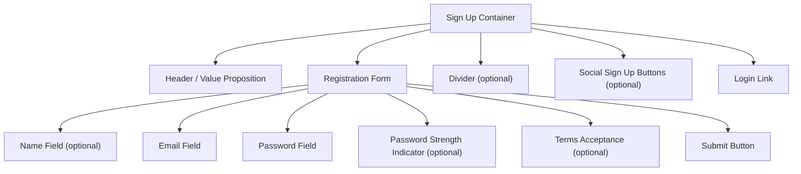

## Overview

**Sign Up Flow** is the registration process through which new users create an account. It collects the minimum required information (typically name, email, and password), validates inputs, and onboards users into the application.

The best sign-up flows minimize friction by asking for only what's essential, providing real-time validation, and offering alternative registration methods like social login to reduce abandonment.

<BuildEffort
  level="medium"
  description="Requires multi-field form validation, password strength indication, email verification flow, terms acceptance, and integration with authentication backend. Social signup options and progressive profiling add complexity."
/>

## Use Cases

### When to use:

Use **Sign Up Flow** to **create new user accounts and collect the minimum information needed to get started**.

**Common scenarios include:**

- Web applications requiring user accounts for personalized features
- E-commerce platforms where accounts enable order tracking and wishlists
- SaaS products gating features behind registered accounts
- Community platforms where identity is needed for participation
- Subscription services requiring billing and profile information

### When not to use:

- Content that should be freely accessible without registration
- One-time transactions where guest checkout suffices
- Internal tools where accounts are provisioned by administrators
- Situations where a login wall would drive users away (consider delayed registration)

### Common scenarios and examples

- Email + password registration on a SaaS platform
- Social signup (Google, GitHub) with optional profile completion
- Multi-step registration with progressive profiling
- Invitation-only signup with a pre-filled email
- Enterprise signup with company domain verification

<PatternComparison
  current="Sign Up Flow"
  alternatives={[
    {
      name: "Login Form",
      path: "/patterns/authentication/login",
      when: "the user already has an account and needs to authenticate",
      pros: ["Fewer fields", "Faster for returning users"],
      cons: ["Cannot create new accounts", "No onboarding opportunity"]
    },
    {
      name: "Social Login",
      path: "/patterns/authentication/social-login",
      when: "users prefer registering via existing provider accounts",
      pros: ["Minimal fields", "Verified email", "Instant registration"],
      cons: ["Provider dependency", "Limited data collection"]
    },
    {
      name: "Account Settings",
      path: "/patterns/authentication/account-settings",
      when: "users need to update profile information after initial registration",
      pros: ["Editable at any time", "No registration pressure"],
      cons: ["Requires existing account", "Post-signup only"]
    }
  ]}
/>

## Benefits

- Creates a direct relationship between the user and the application
- Enables personalized experiences based on collected user data
- Provides an onboarding opportunity to guide new users
- Supports conversion tracking from visitor to registered user
- Allows progressive profiling — collect more data over time

## Drawbacks

- **Abandonment risk** – Every additional field increases the chance users leave
- **Email verification overhead** – Confirming email adds an extra step and potential drop-off
- **Password creation friction** – Complex requirements frustrate users and increase form errors
- **Privacy concerns** – Users hesitate to share personal information
- **Duplicate accounts** – Users may forget they already have an account and create another
- **Mobile input difficulty** – Long forms with password requirements are painful on mobile keyboards

## Anatomy



### Component Structure

1. **Sign Up Container**

- Wraps the entire registration interface
- Includes a value proposition or heading that motivates registration
- May include a split-screen layout with benefits on one side

2. **Name Field (Optional)**

- Collects the user's display name
- Can be split into first/last or use a single full name field
- Uses `autocomplete="name"` for autofill

3. **Email Field**

- The primary identifier for the account
- Validates format in real-time
- Uses `autocomplete="email"` and `type="email"`

4. **Password Field**

- Creates the account password with a show/hide toggle
- Uses `autocomplete="new-password"` to signal account creation
- Displays requirements inline

5. **Password Strength Indicator (Optional)**

- Visual meter showing password strength (weak, fair, strong)
- Updates in real-time as the user types
- Helps users create stronger passwords without complex requirements

6. **Terms Acceptance (Optional)**

- Checkbox or inline text for terms of service and privacy policy
- Required for legal compliance in many jurisdictions
- Links to full terms documents

7. **Submit Button**

- Triggers account creation
- Shows loading state during the registration request
- Clear label: "Create account" or "Sign up"

8. **Social Sign Up Buttons (Optional)**

- Alternative registration via third-party providers
- Reduces form fields to near-zero
- Separated with a divider ("or sign up with")

9. **Login Link**

- Directs existing users to the [login form](/patterns/authentication/login)
- Positioned below the form

#### Summary of Components

| Component              | Required? | Purpose                                                      |
| ---------------------- | --------- | ------------------------------------------------------------ |
| Sign Up Container      | ✅ Yes    | Wraps the registration interface with layout and messaging.  |
| Name Field             | ❌ No     | Collects the user's display name.                            |
| Email Field            | ✅ Yes    | Primary identifier for account creation.                     |
| Password Field         | ✅ Yes    | Creates the account password.                                |
| Password Strength      | ❌ No     | Visual feedback on password quality.                         |
| Terms Acceptance       | ❌ No     | Legal compliance for terms and privacy.                      |
| Submit Button          | ✅ Yes    | Triggers account creation.                                   |
| Social Sign Up         | ❌ No     | Alternative registration via third-party providers.          |
| Login Link             | ✅ Yes    | Directs existing users to login.                             |

## Variations

### 1. Single-Step Registration
All fields on one page — email, password, and optional name.

**When to use:** Most applications where minimal information is needed to get started.

### 2. Multi-Step Registration
Breaks registration into multiple screens (credentials, profile, preferences).

**When to use:** When you need more information upfront but want to reduce perceived form complexity.

### 3. Social-First Registration
Social login buttons are the primary option with email registration as secondary.

**When to use:** Consumer apps where users have strong social provider preferences (Google, Apple).

### 4. Invitation-Only Registration
Signup requires an invitation link or code, with email pre-filled.

**When to use:** Beta launches, internal tools, or exclusive communities.

### 5. Progressive Profiling
Minimal information at signup (just email), with profile completion prompted later.

**When to use:** When reducing initial friction is more important than collecting data upfront.

### 6. Enterprise Registration
Includes company domain, team size, and role selection alongside personal credentials.

**When to use:** B2B SaaS products where organizational context is needed for account setup.

## Examples

### Live Preview

<Playground patternType="authentication" pattern="signup" example="basic" presentation="hidden-code" />

### Basic HTML Implementation

```html
<div class="signup-container">
  <h1>Create your account</h1>
  <p>Start your free trial. No credit card required.</p>

  <form action="/api/auth/register" method="POST" novalidate>
    <div class="form-field">
      <label for="name">Full name</label>
      <input
        type="text"
        id="name"
        name="name"
        autocomplete="name"
        aria-describedby="name-error"
      />
      <span id="name-error" class="field-error" role="alert" hidden></span>
    </div>

    <div class="form-field">
      <label for="email">Email address</label>
      <input
        type="email"
        id="email"
        name="email"
        autocomplete="email"
        required
        aria-describedby="email-error"
      />
      <span id="email-error" class="field-error" role="alert" hidden></span>
    </div>

    <div class="form-field">
      <label for="password">Password</label>
      <input
        type="password"
        id="password"
        name="password"
        autocomplete="new-password"
        required
        minlength="8"
        aria-describedby="password-hint password-error"
      />
      <div id="password-hint" class="password-requirements">
        At least 8 characters
      </div>
      <div class="password-strength" role="progressbar" aria-valuenow="0" aria-valuemin="0" aria-valuemax="4" aria-label="Password strength">
        <div class="strength-bar"></div>
      </div>
      <span id="password-error" class="field-error" role="alert" hidden></span>
    </div>

    <div class="form-field terms">
      <label>
        <input type="checkbox" name="terms" required />
        I agree to the <a href="/terms" target="_blank">Terms of Service</a> and
        <a href="/privacy" target="_blank">Privacy Policy</a>
      </label>
    </div>

    <button type="submit" class="signup-btn">Create account</button>
  </form>

  <div class="divider"><span>or sign up with</span></div>

  <div class="social-buttons">
    <button type="button" class="social-btn">Google</button>
    <button type="button" class="social-btn">GitHub</button>
  </div>

  <p class="login-link">
    Already have an account? <a href="/login">Sign in</a>
  </p>
</div>
```

### React Implementation

```jsx
import { useState, useMemo } from 'react';

function getPasswordStrength(password) {
  let score = 0;
  if (password.length >= 8) score++;
  if (password.length >= 12) score++;
  if (/[A-Z]/.test(password) && /[a-z]/.test(password)) score++;
  if (/\d/.test(password)) score++;
  if (/[^A-Za-z0-9]/.test(password)) score++;
  return Math.min(score, 4);
}

const strengthLabels = ['', 'Weak', 'Fair', 'Good', 'Strong'];

function SignUpForm({ onSubmit, isLoading }) {
  const [form, setForm] = useState({ name: '', email: '', password: '', terms: false });
  const [errors, setErrors] = useState({});

  const strength = useMemo(() => getPasswordStrength(form.password), [form.password]);

  const update = (field, value) => setForm(prev => ({ ...prev, [field]: value }));

  const validate = () => {
    const e = {};
    if (!form.email) e.email = 'Email is required';
    else if (!/\S+@\S+\.\S+/.test(form.email)) e.email = 'Enter a valid email address';
    if (!form.password) e.password = 'Password is required';
    else if (form.password.length < 8) e.password = 'Password must be at least 8 characters';
    if (!form.terms) e.terms = 'You must agree to the terms';
    setErrors(e);
    return Object.keys(e).length === 0;
  };

  const handleSubmit = (e) => {
    e.preventDefault();
    if (validate()) onSubmit(form);
  };

  return (
    <div className="signup-container">
      <h1>Create your account</h1>
      <p>Start your free trial. No credit card required.</p>

      <form onSubmit={handleSubmit} noValidate>
        <div className="form-field">
          <label htmlFor="name">Full name</label>
          <input
            type="text"
            id="name"
            value={form.name}
            onChange={(e) => update('name', e.target.value)}
            autoComplete="name"
          />
        </div>

        <div className="form-field">
          <label htmlFor="email">Email address</label>
          <input
            type="email"
            id="email"
            value={form.email}
            onChange={(e) => update('email', e.target.value)}
            autoComplete="email"
            aria-invalid={!!errors.email}
            aria-describedby={errors.email ? 'email-error' : undefined}
          />
          {errors.email && (
            <span id="email-error" className="field-error" role="alert">{errors.email}</span>
          )}
        </div>

        <div className="form-field">
          <label htmlFor="password">Password</label>
          <input
            type="password"
            id="password"
            value={form.password}
            onChange={(e) => update('password', e.target.value)}
            autoComplete="new-password"
            minLength={8}
            aria-invalid={!!errors.password}
            aria-describedby="password-hint"
          />
          <div id="password-hint" className="password-requirements">
            At least 8 characters
          </div>
          {form.password && (
            <div className="password-strength">
              <div
                className={`strength-bar strength-${strength}`}
                role="progressbar"
                aria-valuenow={strength}
                aria-valuemin={0}
                aria-valuemax={4}
                aria-label={`Password strength: ${strengthLabels[strength]}`}
              />
              <span className="strength-label">{strengthLabels[strength]}</span>
            </div>
          )}
          {errors.password && (
            <span className="field-error" role="alert">{errors.password}</span>
          )}
        </div>

        <div className="form-field terms">
          <label>
            <input
              type="checkbox"
              checked={form.terms}
              onChange={(e) => update('terms', e.target.checked)}
            />
            I agree to the <a href="/terms">Terms of Service</a> and{' '}
            <a href="/privacy">Privacy Policy</a>
          </label>
          {errors.terms && (
            <span className="field-error" role="alert">{errors.terms}</span>
          )}
        </div>

        <button type="submit" className="signup-btn" disabled={isLoading}>
          {isLoading ? 'Creating account…' : 'Create account'}
        </button>
      </form>

      <p className="login-link">
        Already have an account? <a href="/login">Sign in</a>
      </p>
    </div>
  );
}
```

### CSS Styling

```css
.signup-container {
  max-width: 24rem;
  margin: 3rem auto;
  padding: 2rem;
  background: #fff;
  border: 1px solid #e5e7eb;
  border-radius: 0.75rem;
  box-shadow: 0 1px 3px rgba(0, 0, 0, 0.06);
}

.password-requirements {
  font-size: 0.8125rem;
  color: #6b7280;
  margin-top: 0.375rem;
}

.password-strength {
  display: flex;
  align-items: center;
  gap: 0.5rem;
  margin-top: 0.5rem;
}

.strength-bar {
  flex: 1;
  height: 4px;
  background: #e5e7eb;
  border-radius: 2px;
  position: relative;
  overflow: hidden;
}

.strength-bar::after {
  content: '';
  position: absolute;
  top: 0;
  left: 0;
  height: 100%;
  border-radius: 2px;
  transition: width 200ms ease, background-color 200ms ease;
}

.strength-1::after { width: 25%; background: #ef4444; }
.strength-2::after { width: 50%; background: #f59e0b; }
.strength-3::after { width: 75%; background: #3b82f6; }
.strength-4::after { width: 100%; background: #22c55e; }

.strength-label {
  font-size: 0.75rem;
  font-weight: 500;
  min-width: 3rem;
}

.terms {
  font-size: 0.8125rem;
}

.terms label {
  display: flex;
  align-items: flex-start;
  gap: 0.5rem;
  cursor: pointer;
}

.terms a {
  color: #2563eb;
  text-decoration: underline;
}

.signup-btn {
  width: 100%;
  padding: 0.75rem;
  background: #2563eb;
  color: #fff;
  border: none;
  border-radius: 0.5rem;
  font-size: 1rem;
  font-weight: 500;
  cursor: pointer;
  margin-top: 0.5rem;
}

.signup-btn:hover:not(:disabled) { background: #1d4ed8; }
.signup-btn:disabled { opacity: 0.6; cursor: not-allowed; }
.signup-btn:focus-visible { outline: 2px solid #2563eb; outline-offset: 2px; }
```

## Best Practices

### Content

**Do's ✅**

- Lead with a clear value proposition ("Start your free trial", "Join 10,000+ developers")
- Ask for only the minimum information needed to create an account
- Label the submit button with a specific action ("Create account" not "Submit")
- Show password requirements before the user starts typing, not just after errors

**Don'ts ❌**

- Don't ask for information you don't need at signup (collect it later via progressive profiling)
- Don't require both first name and last name — a single "Full name" or "Display name" field reduces friction
- Don't use the word "Register" — "Sign up" or "Create account" is friendlier
- Don't make password requirements a wall of text — use a visual strength meter

### Accessibility

**Do's ✅**

- Associate all fields with `<label>` elements
- Use `autocomplete="new-password"` on the password field to signal account creation
- Announce validation errors with `role="alert"` and `aria-describedby`
- Provide accessible password strength information via `role="progressbar"` with `aria-label`
- Ensure terms links open in a way that doesn't lose form data

**Don'ts ❌**

- Don't rely on color alone for password strength indication — pair with text labels
- Don't auto-submit the form when the last field is filled
- Don't use CAPTCHAs that are inaccessible to screen reader users (use invisible reCAPTCHA or hCaptcha)

### Visual Design

**Do's ✅**

- Keep the form visually clean with adequate spacing between fields
- Use a password strength meter with both color and text labels
- Show inline validation as users complete each field (on blur)
- Visually separate social signup from email registration

**Don'ts ❌**

- Don't show too many social providers — 2-3 is sufficient
- Don't make the form feel like a bureaucratic process — keep it lightweight
- Don't use bright red error states until the user has interacted with the field

### Mobile & Touch Considerations

**Do's ✅**

- Use `inputmode="email"` for the email keyboard layout on mobile
- Ensure the form fits within a single screen on mobile (minimize scrolling)
- Make touch targets at least 44×44px for checkboxes and buttons
- Test with mobile password managers and autofill

**Don'ts ❌**

- Don't use multi-column form layouts on mobile
- Don't require complex passwords that are painful to type on mobile keyboards
- Don't open terms links in the same window if it loses form state

### Layout & Positioning

**Do's ✅**

- Center the form with a constrained width (24rem/384px max)
- Place the login link prominently for users who already have an account
- Position social signup either above or below the email form with a clear divider

**Don'ts ❌**

- Don't hide the signup form behind a modal or popover — use a dedicated page
- Don't place marketing content above the form that pushes it below the fold

## Common Mistakes & Anti-Patterns 🚫

### Asking for Too Much Information
**The Problem:**
Requiring phone number, company name, job title, address, and other fields at signup creates a wall of inputs that drives users away.

**How to Fix It:**
Ask for only email and password at signup. Collect additional information through progressive profiling after the user is onboarded.

---

### No Email Verification
**The Problem:**
Allowing users to sign up with any email without verification leads to fake accounts, spam, and account recovery issues.

**How to Fix It:**
Send a verification email immediately after signup. Allow limited access until the email is confirmed. Use a clear verification prompt.

---

### Overly Complex Password Requirements
**The Problem:**
Requiring uppercase, lowercase, number, special character, minimum 12 characters, and no dictionary words frustrates users and doesn't proportionally improve security.

**How to Fix It:**
Use a minimum length (8-12 characters) and a strength meter that encourages strong passwords without rigid rules. Consider supporting passkeys as an alternative.

---

### No Duplicate Account Detection
**The Problem:**
Users create a new account when they already have one, leading to confusion and lost data.

**How to Fix It:**
Check if the email already exists and show a helpful message: "An account with this email already exists. Would you like to sign in instead?"

---

### Terms Checkbox Without Links
**The Problem:**
Requiring users to accept terms without providing readable links to the ac
import { Playground } from "@/components/playground";tual documents.

**How to Fix It:**
Include inline links to Terms of Service and Privacy Policy that open in a new tab without losing form state.

---

### No Loading State on Submit
**The Problem:**
Users click "Create account" and nothing happens visually, leading to repeated clicks and potential duplicate submissions.

**How to Fix It:**
Disable the button and show a loading state ("Creating account…") immediately on submission.

## Security Considerations

### Input Validation

- **Email validation** — Verify format client-side and confirm deliverability server-side
- **Password hashing** — Hash with bcrypt, scrypt, or Argon2 before storing
- **Input sanitization** — Prevent XSS and SQL injection via all form fields
- **Rate limiting** — Limit signup attempts per IP to prevent abuse

### Email Verification

- **Verification tokens** — Generate unique, time-limited tokens (24-48 hours)
- **One-time use** — Invalidate tokens after first use
- **Resend mechanism** — Allow users to resend the verification email with rate limiting
- **Graceful degradation** — Allow limited access before verification

### Bot Prevention

- **Invisible CAPTCHA** — Use reCAPTCHA v3 or hCaptcha's invisible mode
- **Honeypot fields** — Add hidden fields that bots fill out but humans don't
- **Time-based detection** — Flag forms submitted faster than humanly possible

### Data Protection

- **HTTPS only** — Never transmit registration data over unencrypted connections
- **Minimal data collection** — Only collect what's necessary for the service
- **GDPR compliance** — Record consent timestamp for terms acceptance
- **Data encryption** — Encrypt sensitive fields at rest

## Micro-Interactions & Animations

### Password Strength Meter
- **Effect:** Progress bar fills and changes color as password strength increases
- **Timing:** Real-time updates on each keystroke
- **Trigger:** Password input change
- **Implementation:** JavaScript strength calculation with CSS width/color transitions

### Inline Field Validation
- **Effect:** Checkmark appears for valid fields, error message for invalid ones
- **Timing:** 300ms debounce after typing stops
- **Trigger:** Field blur or typing pause
- **Implementation:** CSS transition on border-color with icon animation

### Submit Button Loading
- **Effect:** Button text changes to "Creating account…" with a spinner
- **Timing:** Immediate on form submission
- **Trigger:** Form submit event
- **Implementation:** Disable button, swap text content, show CSS spinner

### Success State
- **Effect:** Form transitions to a success message ("Check your email for verification")
- **Timing:** Smooth crossfade over 300ms
- **Trigger:** Successful server response
- **Implementation:** CSS opacity/height transitions between form and success message

## Tracking

### Key Events to Track

| **Event Name** | **Description** | **Why Track It?** |
| --- | --- | --- |
| `signup.page_viewed` | User views the signup page | Measure funnel entry |
| `signup.form_started` | User begins filling out the form | Track intent vs. completion |
| `signup.attempted` | User submits the signup form | Track registration attempts |
| `signup.succeeded` | Account is successfully created | Measure conversion rate |
| `signup.failed` | Registration fails (validation, server error) | Identify failure patterns |
| `signup.social_clicked` | User clicks a social signup button | Track social vs. email preference |
| `signup.email_verified` | User confirms their email address | Track verification completion |

### Event Payload Structure

```json
{
  "event": "signup.succeeded",
  "properties": {
    "method": "email_password",
    "has_name": true,
    "referral_source": "pricing_page",
    "time_to_complete_ms": 45000,
    "device_type": "desktop",
    "social_providers_shown": ["google", "github"]
  }
}
```

### Key Metrics to Analyze

- **Signup Conversion Rate:** Percentage of page views that result in successful registration
- **Form Abandonment Rate:** Where in the form users drop off
- **Social vs. Email Split:** Registration method preference
- **Time to Complete:** Average time from first field interaction to submission
- **Email Verification Rate:** Percentage of users who confirm their email
- **Field Error Rate:** Which fields cause the most validation errors

### Insights & Optimization Based on Tracking

- 📉 **High Abandonment at Password Field?**
  → Password requirements may be too strict. Simplify requirements or add a strength meter.

- 🔗 **High Social Signup Clicks but Low Conversion?**
  → OAuth consent screen or redirect flow may have issues. Audit the social signup chain.

- ⏱️ **Long Time to Complete?**
  → Too many fields or confusing labels. Reduce fields to the absolute minimum.

- 📧 **Low Email Verification Rate?**
  → Verification email may land in spam. Check deliverability and simplify the verification step.

- 🔁 **High "Already Has Account" Rate?**
  → Users forget they registered. Add a clear "Already have an account?" link and duplicate detection.

## Localization

```json
{
  "signup": {
    "heading": "Create your account",
    "subheading": "Start your free trial. No credit card required.",
    "fields": {
      "name_label": "Full name",
      "email_label": "Email address",
      "password_label": "Password"
    },
    "password_strength": {
      "weak": "Weak",
      "fair": "Fair",
      "good": "Good",
      "strong": "Strong",
      "hint": "At least 8 characters"
    },
    "terms": {
      "text": "I agree to the {terms_link} and {privacy_link}",
      "terms_link_text": "Terms of Service",
      "privacy_link_text": "Privacy Policy"
    },
    "actions": {
      "submit": "Create account",
      "submitting": "Creating account…",
      "login_prompt": "Already have an account?",
      "login_link": "Sign in"
    },
    "divider": "or sign up with",
    "errors": {
      "email_required": "Email is required",
      "email_invalid": "Enter a valid email address",
      "email_taken": "An account with this email already exists",
      "password_required": "Password is required",
      "password_too_short": "Password must be at least 8 characters",
      "terms_required": "You must agree to the terms"
    },
    "verification": {
      "heading": "Check your email",
      "message": "We sent a verification link to {email}",
      "resend": "Resend verification email"
    }
  }
}
```

### RTL (Right-to-Left) Considerations

- Mirror form layout and label alignment for RTL languages
- Flip checkbox + terms text order
- Reverse social button icon positions

### Cultural Considerations

- **Name fields:** Some cultures use single names; don't force first/last split
- **Social providers:** Vary by region (WeChat, LINE, VKontakte)
- **Terms compliance:** GDPR in EU, CCPA in California, LGPD in Brazil — adapt consent language
- **Phone vs. email:** Some markets prefer phone-based registration

## Performance

### Target Metrics

- **Form render:** < 100ms for the complete signup form
- **Validation response:** < 100ms for inline field validation
- **Password strength calculation:** < 16ms per keystroke
- **Registration request:** < 1500ms (show loading immediately)
- **Verification email:** Sent within 30 seconds of registration

### Optimization Strategies

**Debounce Inline Validation**
```javascript
let timeout;
emailInput.addEventListener('input', () => {
  clearTimeout(timeout);
  timeout = setTimeout(validateEmail, 300);
});
```

**Client-Side Password Strength (No Network)**
```javascript
// Run strength calculation entirely client-side — no API calls
const strength = getPasswordStrength(password);
```

**Lazy Load Social SDKs**
```javascript
const observer = new IntersectionObserver((entries) => {
  if (entries[0].isIntersecting) loadSocialSDKs();
});
observer.observe(socialSection);
```

## Testing Guidelines

### Functional Testing

**Should ✓**

- [ ] Successfully create an account with valid inputs
- [ ] Show validation errors for empty required fields
- [ ] Detect and warn about duplicate email addresses
- [ ] Display password strength meter accurately
- [ ] Submit the form on Enter key press
- [ ] Navigate to the login page when clicking the link
- [ ] Send a verification email after successful registration
- [ ] Show a loading state during form submission

### Accessibility Testing

**Should ✓**

- [ ] All fields have associated `<label>` elements
- [ ] Errors use `role="alert"` and `aria-describedby`
- [ ] Password strength uses `role="progressbar"` with `aria-label`
- [ ] Terms links are accessible and don't lose form state
- [ ] Form is fully operable via keyboard
- [ ] Focus indicators are visible on all interactive elements

### Security Testing

**Should ✓**

- [ ] Passwords are hashed before storage (never plaintext)
- [ ] Email verification tokens are unique and time-limited
- [ ] Rate limiting prevents mass signup attempts
- [ ] CSRF protection is in place
- [ ] Input sanitization prevents XSS and injection

### Visual Testing

**Should ✓**

- [ ] Form renders correctly across viewport sizes
- [ ] Password strength meter shows correct colors and labels
- [ ] Error states are visually clear
- [ ] Loading state is visible on the submit button
- [ ] Verification success screen displays correctly

## Browser Support

<BrowserSupport features={["html.elements.form", "html.elements.input.type_email", "html.elements.input.autocomplete"]} />

## SEO Considerations

- **Signup pages should generally be noindexed** — Use `<meta name="robots" content="noindex">` unless signup discovery is important for growth
- **Landing page SEO** — If signup is the goal of a landing page, optimize the landing page for search, not the signup form itself
- **Social proof in meta tags** — Include user count or social proof in the meta description for landing pages that lead to signup

## Design Tokens

```json
{
  "$schema": "https://design-tokens.org/schema.json",
  "signupForm": {
    "container": {
      "maxWidth": { "value": "24rem", "type": "dimension" },
      "padding": { "value": "2rem", "type": "dimension" },
      "borderRadius": { "value": "{radius.lg}", "type": "dimension" },
      "background": { "value": "{color.white}", "type": "color" }
    },
    "strengthMeter": {
      "height": { "value": "4px", "type": "dimension" },
      "borderRadius": { "value": "2px", "type": "dimension" },
      "colors": {
        "empty": { "value": "{color.gray.200}", "type": "color" },
        "weak": { "value": "{color.red.500}", "type": "color" },
        "fair": { "value": "{color.amber.500}", "type": "color" },
        "good": { "value": "{color.blue.500}", "type": "color" },
        "strong": { "value": "{color.green.500}", "type": "color" }
      }
    },
    "submitButton": {
      "background": { "value": "{color.blue.600}", "type": "color" },
      "hoverBackground": { "value": "{color.blue.700}", "type": "color" },
      "color": { "value": "{color.white}", "type": "color" },
      "borderRadius": { "value": "{radius.md}", "type": "dimension" },
      "paddingY": { "value": "0.75rem", "type": "dimension" }
    }
  }
}
```

## FAQ

<FaqStructuredData
  items={[
    {
      question: "What information should a sign-up form collect?",
      answer:
        "A sign-up form should collect only the minimum information needed: typically an email address and password. Additional data like name, phone, and preferences can be collected later through progressive profiling to reduce initial friction and abandonment.",
    },
    {
      question: "How do I reduce sign-up form abandonment?",
      answer:
        "Reduce fields to the absolute minimum, use social login options for one-click registration, show a password strength meter instead of rigid requirements, provide clear inline validation, and display a compelling value proposition that motivates completion.",
    },
    {
      question: "Should I require email verification?",
      answer:
        "Yes. Email verification confirms the user owns the email address, prevents fake accounts, and enables account recovery. Allow limited access before verification to avoid blocking users, and send the verification email within seconds of registration.",
    },
    {
      question: "How should I handle password requirements?",
      answer:
        "Use a minimum length (8-12 characters) paired with a visual strength meter. Avoid rigid rules like 'must include uppercase, lowercase, number, and symbol' which frustrate users. Encourage longer passphrases over complex short passwords.",
    },
    {
      question: "What is progressive profiling?",
      answer:
        "Progressive profiling collects user information gradually over time rather than all at once during sign-up. After creating an account with just email and password, users are prompted to add their name, preferences, and other details during onboarding or when they first use features that need that data.",
    },
  ]}
/>

## Related Patterns

<RelatedPatternsCard category="authentication" />

## Resources

### Libraries & Frameworks

#### React Components
- [React Hook Form](https://react-hook-form.com/) – Performant form handling with validation
- [Zod](https://zod.dev/) – TypeScript-first schema validation
- [Clerk Sign Up](https://clerk.com/docs/components/authentication/sign-up) – Pre-built registration components

#### Vanilla JavaScript
- [zxcvbn](https://github.com/dropbox/zxcvbn) – Realistic password strength estimation by Dropbox

### Articles

- [How to Design Sign Up Experiences](https://www.nngroup.com/articles/checklist-registration-pages/) by Nielsen Norman Group
- [Best Practices for Form Design](https://uxdesign.cc/design-better-forms-96fadca0f49c) by Andrew Coyle
- [The UX of Sign-Up Forms](https://www.smashingmagazine.com/2023/02/guide-accessible-form-validation/) by Smashing Magazine
