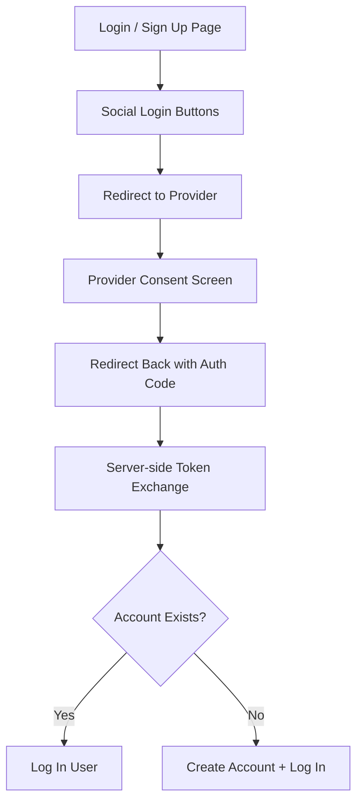

import { Playground } from "@/components/playground";

## Overview

**Social Login** allows users to authenticate using their existing accounts with third-party identity providers like Google, Apple, GitHub, or Facebook. Instead of creating a new username and password, users authorize the application to receive their profile information from a trusted provider via OAuth 2.0 or OpenID Connect.

Social login reduces registration friction dramatically — turning a multi-field form into a single-click action — while providing the application with a verified email address and basic profile data.

<BuildEffort
  level="medium"
  description="Requires OAuth 2.0 / OpenID Connect integration with one or more providers, redirect flow handling, account linking logic for users who sign up with email then try social login (or vice versa), and provider-specific button branding requirements."
/>

## Use Cases

### When to use:

Use **Social Login** to **reduce sign-up and login friction by leveraging users' existing accounts with trusted providers**.

**Common scenarios include:**

- Consumer web applications where speed of registration matters
- Developer tools where GitHub authentication is natural
- Mobile apps where Google or Apple sign-in follows platform conventions
- E-commerce sites reducing checkout friction for guest users
- Community platforms where social identity adds credibility

### When not to use:

- Enterprise or B2B applications where corporate SSO (SAML) is the norm
- Highly regulated industries (healthcare, finance) where provider dependency is a risk
- Applications requiring identity verification beyond what providers offer
- Offline-first applications where OAuth redirects are impractical
- When your user base has strong privacy concerns about third-party data sharing

### Common scenarios and examples

- "Continue with Google" on a SaaS application login page
- "Sign in with Apple" on an iOS app following App Store requirements
- "Sign in with GitHub" on a developer tool or documentation platform
- Combined login/signup page with social buttons above the email form
- Account linking flow when a social login email matches an existing email account

<PatternComparison
  current="Social Login"
  alternatives={[
    {
      name: "Login Form",
      path: "/patterns/authentication/login",
      when: "users should authenticate with email and password",
      pros: ["No provider dependency", "Full control over the flow", "Works offline"],
      cons: ["Password fatigue", "Higher friction", "Password security burden"]
    },
    {
      name: "Sign Up Flow",
      path: "/patterns/authentication/signup",
      when: "collecting more user data during registration is needed",
      pros: ["More data collection", "Custom onboarding", "No provider dependency"],
      cons: ["More form fields", "Higher abandonment", "Email verification needed"]
    },
    {
      name: "Two-Factor Authentication",
      path: "/patterns/authentication/two-factor",
      when: "additional verification beyond the initial authentication",
      pros: ["Stronger security", "Works with any login method"],
      cons: ["Extra step", "Device dependency"]
    }
  ]}
/>

## Benefits

- Dramatically reduces sign-up friction — one click vs. filling out a form
- Provides a verified email address from the provider
- No password to create, remember, or manage
- Pre-filled profile data (name, avatar) improves initial experience
- Reduces the burden of password security on the application

## Drawbacks

- **Provider dependency** – If a provider has an outage, users can't log in
- **Privacy concerns** – Users may be uncomfortable sharing data with third parties
- **Account linking complexity** – Users who sign up with email and later try social login (or vice versa) need account merging logic
- **Branding requirements** – Providers like Google and Apple have strict button design guidelines
- **Limited to provider availability** – Not all providers are available in all regions
- **Scope creep** – Requesting too many permissions (contacts, posts) erodes user trust

## Anatomy



### Component Structure

1. **Social Login Buttons**

- Provider-branded buttons (Google, Apple, GitHub, etc.)
- Each follows the provider's branding guidelines
- Clear labels: "Continue with Google" (not just "Google")

2. **Divider**

- Visual separator between social login and email-based authentication
- Uses text like "or" or "or continue with email"
- Clarifies that both options are available

3. **Provider Redirect**

- Clicking a button redirects the user to the provider's authorization page
- The redirect URL includes the application's client ID, requested scopes, and a state parameter
- Invisible to the user except for the page transition

4. **Provider Consent Screen**

- The provider asks the user to grant the application access to their profile
- Shows what data will be shared (email, name, profile picture)
- Managed entirely by the provider

5. **Callback Handling**

- The provider redirects back to the application with an authorization code
- The server exchanges the code for an access token and user profile
- Handles error states (user denied, invalid code, expired state)

6. **Account Linking (Optional)**

- Detects if the provider email matches an existing account
- Prompts the user to link accounts or offers automatic linking
- Prevents duplicate accounts from the same person

#### Summary of Components

| Component           | Required? | Purpose                                                      |
| ------------------- | --------- | ------------------------------------------------------------ |
| Social Login Buttons| ✅ Yes    | Provider-branded buttons initiating the OAuth flow.          |
| Divider             | ❌ No     | Separates social login from email-based authentication.      |
| Provider Redirect   | ✅ Yes    | Sends the user to the provider's authorization page.         |
| Consent Screen      | ✅ Yes    | Provider-managed screen for user authorization.              |
| Callback Handling   | ✅ Yes    | Processes the provider's response and authenticates the user.|
| Account Linking     | ❌ No     | Merges social and email-based accounts when emails match.    |

## Variations

### 1. Social-First Layout
Social login buttons are the primary option, prominently placed above or instead of an email form.

**When to use:** Consumer apps where most users have social accounts with supported providers.

### 2. Social as Alternative
Social buttons appear below the email form with a divider, as a secondary option.

**When to use:** Applications where email login is the default but social is offered for convenience.

### 3. Single Provider
Only one social provider is offered (e.g., "Sign in with Apple" on iOS apps).

**When to use:** Platform-specific apps or when the audience strongly aligns with one provider.

### 4. Provider Selection Page
A dedicated screen listing all available providers before showing any form.

**When to use:** Applications supporting many providers (5+) where a clean layout is needed.

### 5. Account Linking Flow
Prompts users to link a social account to an existing email-based account.

**When to use:** When a user signs in with a social provider whose email matches an existing account.

## Examples

### Live Preview

<Playground patternType="authentication" pattern="social-login" example="basic" presentation="hidden-code" />

### Basic HTML Implementation

```html
<div class="auth-container">
  <h1>Sign in</h1>

  <div class="social-login">
    <button type="button" class="social-btn google" onclick="loginWith('google')">
      <svg class="social-icon" aria-hidden="true"><!-- Google icon --></svg>
      Continue with Google
    </button>

    <button type="button" class="social-btn apple" onclick="loginWith('apple')">
      <svg class="social-icon" aria-hidden="true"><!-- Apple icon --></svg>
      Continue with Apple
    </button>

    <button type="button" class="social-btn github" onclick="loginWith('github')">
      <svg class="social-icon" aria-hidden="true"><!-- GitHub icon --></svg>
      Continue with GitHub
    </button>
  </div>

  <div class="divider"><span>or continue with email</span></div>

  <form action="/api/auth/login" method="POST">
    <!-- Email login form -->
  </form>
</div>

<script>
  function loginWith(provider) {
    const state = crypto.randomUUID();
    sessionStorage.setItem('oauth_state', state);

    const params = new URLSearchParams({
      client_id: CLIENT_IDS[provider],
      redirect_uri: `${window.location.origin}/api/auth/${provider}/callback`,
      response_type: 'code',
      scope: SCOPES[provider],
      state: state
    });

    window.location.href = `${AUTH_URLS[provider]}?${params}`;
  }
</script>
```

### React Implementation

```jsx
function SocialLoginButtons({ providers, onError }) {
  const [loading, setLoading] = useState(null);

  const handleLogin = async (provider) => {
    setLoading(provider);
    try {
      const state = crypto.randomUUID();
      sessionStorage.setItem('oauth_state', state);

      const params = new URLSearchParams({
        client_id: provider.clientId,
        redirect_uri: `${window.location.origin}/api/auth/${provider.id}/callback`,
        response_type: 'code',
        scope: provider.scopes,
        state,
      });

      window.location.href = `${provider.authUrl}?${params}`;
    } catch (err) {
      setLoading(null);
      onError?.(err);
    }
  };

  return (
    <div className="social-login">
      {providers.map((provider) => (
        <button
          key={provider.id}
          type="button"
          className={`social-btn ${provider.id}`}
          onClick={() => handleLogin(provider)}
          disabled={loading !== null}
          aria-busy={loading === provider.id}
        >
          <span className="social-icon" aria-hidden="true">
            {provider.icon}
          </span>
          {loading === provider.id
            ? `Connecting to ${provider.name}…`
            : `Continue with ${provider.name}`}
        </button>
      ))}
    </div>
  );
}
```

### CSS Styling

```css
.social-login {
  display: flex;
  flex-direction: column;
  gap: 0.75rem;
}

.social-btn {
  display: flex;
  align-items: center;
  justify-content: center;
  gap: 0.75rem;
  width: 100%;
  padding: 0.75rem 1rem;
  border: 1px solid #d1d5db;
  border-radius: 0.5rem;
  background: #fff;
  font-size: 0.9375rem;
  font-weight: 500;
  cursor: pointer;
  transition: background-color 150ms ease, border-color 150ms ease;
}

.social-btn:hover:not(:disabled) {
  background: #f9fafb;
  border-color: #9ca3af;
}

.social-btn:focus-visible {
  outline: 2px solid #2563eb;
  outline-offset: 2px;
}

.social-btn:disabled {
  opacity: 0.6;
  cursor: not-allowed;
}

.social-icon {
  width: 1.25rem;
  height: 1.25rem;
  flex-shrink: 0;
}

/* Provider-specific branding */
.social-btn.google {
  color: #1f2937;
}

.social-btn.apple {
  background: #000;
  color: #fff;
  border-color: #000;
}

.social-btn.apple:hover:not(:disabled) {
  background: #1a1a1a;
}

.social-btn.github {
  background: #24292e;
  color: #fff;
  border-color: #24292e;
}

.social-btn.github:hover:not(:disabled) {
  background: #2f363d;
}

.divider {
  display: flex;
  align-items: center;
  margin: 1.5rem 0;
  color: #9ca3af;
  font-size: 0.8125rem;
}

.divider::before,
.divider::after {
  content: '';
  flex: 1;
  height: 1px;
  background: #e5e7eb;
}

.divider span {
  padding: 0 0.75rem;
}

@media (prefers-reduced-motion: reduce) {
  .social-btn { transition: none; }
}
```

## Best Practices

### Content

**Do's ✅**

- Use "Continue with [Provider]" rather than "Sign in with [Provider]" to work for both login and signup
- Show only 2-4 providers — too many choices cause decision paralysis
- Order providers by popularity in your user base
- Include a clear divider if offering both social and email options

**Don'ts ❌**

- Don't use generic labels like "Social Login" or just the provider name without a verb
- Don't request more OAuth scopes than necessary (email and profile are usually sufficient)
- Don't show providers that are unavailable in the user's region

### Accessibility

**Do's ✅**

- Ensure social buttons are focusable and activatable with Enter/Space
- Include the provider name in the button text for screen readers (not just an icon)
- Show loading state with `aria-busy="true"` during the redirect
- Announce errors if the OAuth flow fails (popup blocked, provider error)

**Don'ts ❌**

- Don't use icon-only social buttons without accessible text
- Don't open the OAuth flow in a popup that may be blocked by browsers
- Don't rely on color alone to distinguish provider buttons

### Visual Design

**Do's ✅**

- Follow each provider's official branding guidelines for button design
- Use official provider logos/icons and approved colors
- Maintain consistent button sizing across all providers
- Make social buttons full-width in a stacked layout

**Don'ts ❌**

- Don't customize provider button colors in ways that violate branding guidelines
- Don't mix icon-only and text buttons in the same group
- Don't make social buttons look significantly different from the rest of the UI

### Mobile & Touch Considerations

**Do's ✅**

- Ensure touch targets are at least 44×44px for all buttons
- Use full-page redirect instead of popup OAuth on mobile
- Test deep linking back to the app from the provider's consent screen
- Support "Sign in with Apple" when required by Apple for iOS apps

**Don'ts ❌**

- Don't use popup OAuth flows on mobile — they break frequently
- Don't require multiple taps to reach the social login option

### Layout & Positioning

**Do's ✅**

- Place social login options prominently — above the email form if they are primary
- Use a clear visual divider between social and email authentication
- Stack buttons vertically for consistent layout across viewports

**Don'ts ❌**

- Don't place social login buttons horizontally in a row — they become too small
- Don't bury social options at the bottom of a long form

## Common Mistakes & Anti-Patterns 🚫

### Requesting Excessive Permissions
**The Problem:**
Asking for access to contacts, posts, or other unrelated data during login scares users away from granting consent.

**How to Fix It:**
Request only the minimum scopes needed: `email`, `profile`, and `openid`. Request additional permissions incrementally when the user triggers a feature that needs them.

---

### No Account Linking
**The Problem:**
A user signs up with email, then later tries "Continue with Google" using the same email. The system creates a duplicate account.

**How to Fix It:**
Check if the social provider's email matches an existing account. Prompt the user to link accounts or automatically link if the email is verified by both sides.

---

### Popup OAuth Flow
**The Problem:**
Opening the OAuth flow in a popup window gets blocked by browsers or breaks on mobile, leaving users stuck.

**How to Fix It:**
Use full-page redirect OAuth flow. It works consistently across all browsers and devices.

---

### Missing State Parameter
**The Problem:**
Not including a `state` parameter in the OAuth request makes the flow vulnerable to CSRF attacks.

**How to Fix It:**
Generate a random `state` value, store it in session storage, and validate it when the provider redirects back.

---

### No Fallback When Provider Is Down
**The Problem:**
If Google or GitHub has an outage, users who only have a social account can't log in.

**How to Fix It:**
Always offer email-based login as a fallback. Encourage users to set a password even if they signed up via social login.

---

### Violating Provider Branding Guidelines
**The Problem:**
Using custom colors, modified logos, or non-standard button text violates provider brand guidelines, which can result in API access being revoked.

**How to Fix It:**
Follow each provider's official brand guidelines: [Google](https://developers.google.com/identity/branding-guidelines), [Apple](https://developer.apple.com/design/human-interface-guidelines/sign-in-with-apple), [GitHub](https://github.com/logos).

## Security Considerations

### OAuth Security

- **State parameter** — Always include and validate a `state` parameter to prevent CSRF
- **PKCE** — Use Proof Key for Code Exchange for public clients (SPAs, mobile apps)
- **Server-side token exchange** — Exchange the auth code for tokens on the server, never in the browser
- **Token storage** — Store access/refresh tokens server-side in encrypted session storage

### Account Linking Security

- **Email verification** — Only auto-link accounts when the provider confirms the email is verified
- **Explicit consent** — When in doubt, ask the user to confirm account linking
- **Audit trail** — Log all account linking events for security review

### Provider Security

- **Validate ID tokens** — Verify the JWT signature and claims from the provider
- **Check audience** — Ensure the token's `aud` claim matches your client ID
- **Token expiry** — Respect token expiration times; refresh proactively

## Micro-Interactions & Animations

### Button Loading State
- **Effect:** Button text changes to "Connecting to [Provider]…" and shows a spinner
- **Timing:** Immediate on click, until redirect completes
- **Trigger:** Social button click
- **Implementation:** Set loading state, disable other buttons, show spinner

### Redirect Indicator
- **Effect:** Full-page loading overlay or progress bar during OAuth redirect
- **Timing:** Shows during the redirect pause before leaving the page
- **Trigger:** OAuth redirect initiation
- **Implementation:** CSS overlay with animation before `window.location` change

### Account Linking Prompt
- **Effect:** Modal or inline prompt asking user to confirm account linking
- **Timing:** 300ms fade-in after detecting email match
- **Trigger:** OAuth callback with matching email
- **Implementation:** React modal with fade transition

## Tracking

### Key Events to Track

| **Event Name** | **Description** | **Why Track It?** |
| --- | --- | --- |
| `social_login.button_clicked` | User clicks a social login button | Measure provider preference |
| `social_login.redirect_started` | OAuth redirect is initiated | Track flow entry |
| `social_login.succeeded` | User successfully authenticates via provider | Measure conversion |
| `social_login.failed` | OAuth flow fails (denied, error, popup blocked) | Identify failure patterns |
| `social_login.account_linked` | Social account is linked to existing account | Track account merging |
| `social_login.account_created` | New account created via social login | Measure social signup rate |

### Event Payload Structure

```json
{
  "event": "social_login.succeeded",
  "properties": {
    "provider": "google",
    "is_new_account": false,
    "account_linked": false,
    "time_to_complete_ms": 8000,
    "device_type": "desktop",
    "page_type": "login"
  }
}
```

### Key Metrics to Analyze

- **Provider Preference:** Click distribution across providers
- **Social vs. Email Split:** Registration and login method preference
- **Conversion Rate per Provider:** Success rate for each provider's OAuth flow
- **Account Linking Rate:** How often social login triggers account merging
- **Failure Rate:** How often the OAuth flow fails and why

## Localization

```json
{
  "social_login": {
    "buttons": {
      "continue_with": "Continue with {provider}",
      "connecting": "Connecting to {provider}…"
    },
    "divider": "or continue with email",
    "account_linking": {
      "heading": "Account already exists",
      "message": "An account with {email} already exists. Would you like to link your {provider} account?",
      "confirm": "Link accounts",
      "cancel": "Use a different method"
    },
    "errors": {
      "popup_blocked": "Popup was blocked. Please allow popups and try again.",
      "provider_error": "Could not connect to {provider}. Please try again.",
      "consent_denied": "You denied access. Please try again if this was a mistake."
    }
  }
}
```

### RTL (Right-to-Left) Considerations

- Flip icon + text order in social buttons (icon on the right)
- Mirror divider layout
- Align account linking modal text to the right

### Cultural Considerations

- **Regional providers:** WeChat (China), LINE (Japan/Taiwan), VKontakte (Russia), Kakao (South Korea)
- **Privacy sensitivity:** European users may be more cautious about social login due to GDPR awareness
- **Apple requirements:** iOS apps using third-party social login must also offer "Sign in with Apple"

## Performance

### Target Metrics

- **Button render:** < 50ms for all social buttons
- **Redirect initiation:** < 100ms from click to navigation start
- **Callback processing:** < 500ms server-side token exchange
- **Total flow time:** < 10 seconds (user's time, mostly on provider's consent screen)

### Optimization Strategies

**No SDK Dependency for Basic OAuth**
```javascript
// Use simple redirect — no heavy SDKs needed
window.location.href = `${authUrl}?${params}`;
```

**Prefetch Provider Auth Pages**
```html
<link rel="dns-prefetch" href="https://accounts.google.com" />
<link rel="dns-prefetch" href="https://github.com/login" />
```

**Lazy Load Provider Icons**
```css
.social-icon { background-image: url('...'); }
```

## Testing Guidelines

### Functional Testing

**Should ✓**

- [ ] Redirect to the correct provider authorization URL
- [ ] Include state parameter in the redirect
- [ ] Handle successful callback and authenticate the user
- [ ] Handle denied consent gracefully with error message
- [ ] Create a new account when the email is new
- [ ] Link accounts when the email matches an existing account
- [ ] Work with multiple providers independently

### Accessibility Testing

**Should ✓**

- [ ] All buttons have descriptive text (not icon-only)
- [ ] Buttons are focusable and activatable via keyboard
- [ ] Loading state is announced with `aria-busy`
- [ ] Error messages are announced to screen readers
- [ ] Account linking prompt is keyboard navigable

### Security Testing

**Should ✓**

- [ ] State parameter is generated and validated
- [ ] PKCE is used for public clients
- [ ] Token exchange happens server-side
- [ ] ID tokens are validated (signature, audience, expiry)
- [ ] Only verified emails trigger auto-account-linking

### Visual Testing

**Should ✓**

- [ ] Buttons follow provider branding guidelines
- [ ] Loading states display correctly
- [ ] Buttons are consistently sized across viewports
- [ ] Divider renders cleanly between social and email options

## Browser Support

<BrowserSupport features={["api.crypto.randomUUID", "api.Window.sessionStorage", "api.Window.location"]} />

## SEO Considerations

- **No direct SEO impact** — Social login pages are typically noindexed
- **Social signals** — Social login doesn't affect social signals or page ranking
- **User retention** — Faster login via social providers may improve engagement metrics

## Design Tokens

```json
{
  "$schema": "https://design-tokens.org/schema.json",
  "socialLogin": {
    "button": {
      "paddingY": { "value": "0.75rem", "type": "dimension" },
      "paddingX": { "value": "1rem", "type": "dimension" },
      "borderRadius": { "value": "{radius.md}", "type": "dimension" },
      "fontSize": { "value": "0.9375rem", "type": "fontSizes" },
      "fontWeight": { "value": "500", "type": "fontWeights" },
      "gap": { "value": "0.75rem", "type": "dimension" },
      "iconSize": { "value": "1.25rem", "type": "dimension" }
    },
    "providers": {
      "google": {
        "background": { "value": "#fff", "type": "color" },
        "color": { "value": "#1f2937", "type": "color" },
        "borderColor": { "value": "{color.gray.300}", "type": "color" }
      },
      "apple": {
        "background": { "value": "#000", "type": "color" },
        "color": { "value": "#fff", "type": "color" }
      },
      "github": {
        "background": { "value": "#24292e", "type": "color" },
        "color": { "value": "#fff", "type": "color" }
      }
    },
    "divider": {
      "color": { "value": "{color.gray.400}", "type": "color" },
      "lineColor": { "value": "{color.gray.200}", "type": "color" },
      "fontSize": { "value": "0.8125rem", "type": "fontSizes" }
    }
  }
}
```

## FAQ

<FaqStructuredData
  items={[
    {
      question: "What is social login?",
      answer:
        "Social login allows users to authenticate using their existing accounts with third-party providers like Google, Apple, or GitHub via OAuth 2.0. Instead of creating a new password, users authorize the app to receive their profile information from the provider.",
    },
    {
      question: "Which social login providers should I offer?",
      answer:
        "Offer 2-4 providers based on your user base. Google is the most universal. GitHub is essential for developer tools. Apple is required for iOS apps that offer other social login. Facebook and Microsoft are common for consumer and enterprise apps respectively.",
    },
    {
      question: "How do I handle account linking with social login?",
      answer:
        "When a social login returns an email that matches an existing account, prompt the user to link accounts or auto-link if the email is verified by both the provider and your system. Always log the linking event and notify the user.",
    },
    {
      question: "Should I use popup or redirect for the OAuth flow?",
      answer:
        "Use full-page redirect. Popups are frequently blocked by browsers, break on mobile devices, and create poor user experiences. Redirect flows work consistently across all platforms and browsers.",
    },
    {
      question: "What permissions (scopes) should I request?",
      answer:
        "Request only the minimum needed: email, profile (name, avatar), and openid. Never request access to contacts, posts, or other sensitive data during login. Request additional permissions later when the user triggers a feature that needs them.",
    },
  ]}
/>

## Related Patterns

<RelatedPatternsCard category="authentication" />

## Resources

### Libraries & Frameworks

#### React / Next.js
- [NextAuth.js](https://next-auth.js.org/) – Authentication with built-in provider support
- [Clerk](https://clerk.com/) – Drop-in social login components
- [Auth0 React SDK](https://auth0.com/docs/libraries/auth0-react) – Universal login with social providers

#### Node.js
- [Passport.js](http://www.passportjs.org/) – Modular authentication middleware with provider strategies

### Articles

- [Social Login Buttons Aren't Worth It](https://www.nngroup.com/articles/social-login/) by Nielsen Norman Group
- [Sign in with Apple Guidelines](https://developer.apple.com/sign-in-with-apple/get-started/) by Apple
- [Google Sign-In Branding Guidelines](https://developers.google.com/identity/branding-guidelines) by Google
- [OAuth 2.0 for Browser-Based Apps](https://datatracker.ietf.org/doc/html/draft-ietf-oauth-browser-based-apps) by IETF
