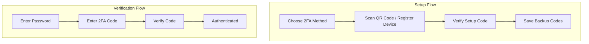

## Overview

**Two-Factor Authentication (2FA)** adds a second verification step after the user enters their password, requiring proof of something they have (a phone, security key, or authenticator app) in addition to something they know (their password). This dramatically reduces the risk of unauthorized access from stolen credentials.

The 2FA pattern covers both the **setup flow** (enrolling a second factor) and the **verification flow** (entering a code or using a device during login).

<BuildEffort
  level="high"
  description="Requires TOTP secret generation, QR code rendering, code verification logic, SMS delivery integration, WebAuthn for security keys, backup code generation, and recovery flows. Both setup and verification UIs need careful error handling and accessibility."
/>

## Use Cases

### When to use:

Use **Two-Factor Authentication** to **protect accounts with an additional verification layer beyond username and password**.

**Common scenarios include:**

- Financial applications, banking, and payment platforms
- Email services and communication platforms
- Admin dashboards and privileged user accounts
- Healthcare and legal applications with sensitive data
- Developer platforms with access to infrastructure and code repositories

### When not to use:

- Low-risk applications where the cost of 2FA outweighs the security benefit
- Applications targeting users with limited technical proficiency (consider risk-based auth instead)
- When the friction of 2FA would significantly reduce adoption of a consumer product (make it optional)
- Kiosk or shared-device environments where device-based factors are impractical

### Common scenarios and examples

- Setting up an authenticator app (Google Authenticator, Authy) during account creation
- Entering a 6-digit TOTP code after password on login
- Receiving an SMS code to a registered phone number
- Tapping a hardware security key (YubiKey) during login
- Entering a backup code when the primary device is unavailable

<PatternComparison
  current="Two-Factor Authentication"
  alternatives={[
    {
      name: "Login Form",
      path: "/patterns/authentication/login",
      when: "basic password authentication is sufficient for the security level",
      pros: ["Simpler flow", "No extra device needed", "Lower friction"],
      cons: ["Vulnerable to credential theft", "No second verification layer"]
    },
    {
      name: "Social Login",
      path: "/patterns/authentication/social-login",
      when: "delegating authentication to a trusted provider",
      pros: ["Provider handles security", "May include provider's own 2FA"],
      cons: ["Provider dependency", "No control over security level"]
    },
    {
      name: "Password Reset",
      path: "/patterns/authentication/password-reset",
      when: "recovering access to an account",
      pros: ["Self-service recovery", "Familiar pattern"],
      cons: ["Can bypass 2FA if not secured", "Email-dependent"]
    }
  ]}
/>

## Benefits

- Dramatically reduces the risk of account compromise from stolen passwords
- Protects against phishing, credential stuffing, and brute force attacks
- Provides compliance with security standards (SOC 2, HIPAA, PCI DSS)
- Multiple factor types (TOTP, SMS, security keys) accommodate different users
- Builds user trust in the platform's security

## Drawbacks

- **Added friction** – Every login requires an extra step, which can frustrate users
- **Device dependency** – Losing the authenticator device locks users out
- **Recovery complexity** – Backup codes and recovery flows add implementation and UX overhead
- **SMS vulnerabilities** – SMS-based 2FA is susceptible to SIM swapping and interception
- **Setup abandonment** – Users may skip optional 2FA setup or abandon if it's too complex
- **Accessibility challenges** – QR codes, time-limited codes, and hardware keys need accessible alternatives

## Anatomy



### Component Structure

1. **Method Selection (Setup)**

- Presents available 2FA methods (Authenticator app, SMS, Security key)
- Explains each method's trade-offs
- Allows the user to choose their preferred method

2. **QR Code / Registration (Setup)**

- For TOTP: displays a QR code the user scans with their authenticator app
- For SMS: collects and verifies a phone number
- For Security keys: initiates WebAuthn registration
- Includes a manual entry option for the TOTP secret key

3. **Verification Code Input (Setup + Login)**

- A 6-digit code entry field for TOTP or SMS codes
- Auto-submits when all digits are entered (optional)
- Includes a countdown timer for SMS resend

4. **Backup Codes (Setup)**

- Displays a set of one-time recovery codes (typically 8-10)
- Provides download and copy options
- Warns users to store them securely

5. **Recovery Flow**

- Allows users to authenticate with backup codes if the primary device is lost
- Provides a path to disable 2FA and set up a new method
- May require identity verification via email or support

#### Summary of Components

| Component            | Required? | Purpose                                                      |
| -------------------- | --------- | ------------------------------------------------------------ |
| Method Selection     | ✅ Yes    | Lets users choose their preferred 2FA method.                |
| QR Code / Registration| ✅ Yes   | Enrolls the user's device for the chosen method.             |
| Verification Input   | ✅ Yes    | Collects the 6-digit code during setup and login.            |
| Backup Codes         | ✅ Yes    | Provides recovery codes for lost device scenarios.           |
| Recovery Flow        | ✅ Yes    | Allows access when the primary 2FA device is unavailable.    |

## Variations

### 1. TOTP (Authenticator App)
Time-based one-time passwords generated by apps like Google Authenticator, Authy, or 1Password.

**When to use:** The recommended default for most applications — secure, no cost per verification, works offline.

### 2. SMS / Phone Verification
A one-time code sent via SMS to the user's registered phone number.

**When to use:** When users are less technical or don't have authenticator apps. Less secure than TOTP due to SIM swap vulnerabilities.

### 3. Hardware Security Key (WebAuthn)
Physical keys like YubiKey that provide phishing-resistant authentication via the WebAuthn protocol.

**When to use:** High-security environments, enterprise accounts, or users who want the strongest available protection.

### 4. Push Notification
A push notification sent to a trusted mobile app that the user approves or denies.

**When to use:** Applications with their own mobile app where a tap-to-approve flow improves UX.

### 5. Email Code
A one-time code sent to the user's email address.

**When to use:** As a fallback when other methods are unavailable. Less secure since email can be compromised.

## Examples

### Live Preview

<Playground patternType="authentication" pattern="two-factor" example="basic" presentation="hidden-code" />

### TOTP Setup HTML

```html
<div class="tfa-setup">
  <h2>Set up authenticator app</h2>
  <p>Scan this QR code with your authenticator app (Google Authenticator, Authy, 1Password).</p>

  <div class="qr-code-container">
    
  </div>

  <details class="manual-entry">
    <summary>Can't scan? Enter the code manually</summary>
    <code class="secret-key">JBSW Y3DP EHPK 3PXP</code>
    <button type="button" class="copy-btn" aria-label="Copy secret key">Copy</button>
  </details>

  <form action="/api/auth/2fa/verify-setup" method="POST">
    <label for="totp-code">Enter the 6-digit code from your app</label>
    <div class="code-input-group">
      <input
        type="text"
        id="totp-code"
        name="code"
        inputmode="numeric"
        pattern="[0-9]{6}"
        maxlength="6"
        autocomplete="one-time-code"
        required
        aria-describedby="code-error"
      />
      <span id="code-error" class="field-error" role="alert" hidden></span>
    </div>
    <button type="submit" class="verify-btn">Verify and enable</button>
  </form>
</div>
```

### Login Verification HTML

```html
<div class="tfa-verify">
  <h2>Two-factor authentication</h2>
  <p>Enter the 6-digit code from your authenticator app.</p>

  <form action="/api/auth/2fa/verify" method="POST">
    <div class="code-input-group">
      <input
        type="text"
        id="login-code"
        name="code"
        inputmode="numeric"
        pattern="[0-9]{6}"
        maxlength="6"
        autocomplete="one-time-code"
        autofocus
        required
        aria-label="Authentication code"
        aria-describedby="code-help code-error"
      />
      <span id="code-error" class="field-error" role="alert" hidden></span>
    </div>

    <p id="code-help" class="code-hint">
      Open your authenticator app to view your code.
    </p>

    <button type="submit" class="verify-btn">Verify</button>
  </form>

  <a href="/login/recovery" class="recovery-link">Use a backup code</a>
</div>
```

## Best Practices

### Content

**Do's ✅**

- Explain each 2FA method clearly during setup ("Authenticator app generates codes even offline")
- Show a manual entry option for the TOTP secret when QR scanning fails
- Label the code input field clearly ("Enter the 6-digit code from your app")
- Display backup codes prominently with download/copy options

**Don'ts ❌**

- Don't use jargon ("TOTP", "HMAC") in user-facing text — say "authenticator app" instead
- Don't auto-delete backup codes after showing them once — let users revisit them in settings
- Don't mix up "verification code" and "backup code" in the UI — they serve different purposes

### Accessibility

**Do's ✅**

- Use `inputmode="numeric"` on the code input for the numeric keyboard on mobile
- Use `autocomplete="one-time-code"` so browsers and password managers can autofill SMS codes
- Provide `alt` text for the QR code image describing its purpose
- Announce errors with `role="alert"` when an invalid code is entered
- Provide a text-based alternative to the QR code (manual entry of the secret key)

**Don'ts ❌**

- Don't make the QR code the only way to set up TOTP — always offer manual entry
- Don't use time pressure that penalizes users who need more time to enter codes
- Don't rely on color alone for success/error feedback on code entry

### Visual Design

**Do's ✅**

- Center the QR code prominently during TOTP setup
- Use a monospace font for the code input to align digits evenly
- Increase the font size for the code input (1.5rem+) for easy reading
- Show a clear distinction between the setup flow and the verification flow

**Don'ts ❌**

- Don't make the QR code too small to scan (minimum 200×200px)
- Don't crowd the verification screen with distracting elements
- Don't style backup codes in a way that makes them hard to copy

### Mobile & Touch Considerations

**Do's ✅**

- Auto-focus the code input field on the verification screen
- Support `autocomplete="one-time-code"` for SMS autofill on iOS and Android
- Make the QR code large enough to scan easily on mobile
- Ensure the code input is centered and easy to tap on small screens

**Don'ts ❌**

- Don't require the user to type the TOTP secret manually when a QR scan would work
- Don't use a code input that's too narrow for 6 digits plus letter-spacing

### Layout & Positioning

**Do's ✅**

- Center the 2FA forms with a constrained width (24rem)
- Place "Use a backup code" link below the verification form
- Group setup steps into a clear, linear flow

**Don'ts ❌**

- Don't show the QR code and the code verification on different pages (keep them together)
- Don't hide the backup codes behind multiple clicks

## Common Mistakes & Anti-Patterns 🚫

### No Backup Code Recovery
**The Problem:**
Users who lose their authenticator device have no way to access their account.

**How to Fix It:**
Generate 8-10 one-time backup codes during 2FA setup. Clearly prompt users to save them. Provide a backup code entry option on the verification screen.

---

### SMS as the Only 2FA Method
**The Problem:**
SMS codes are vulnerable to SIM swapping, SS7 interception, and delivery delays.

**How to Fix It:**
Offer TOTP (authenticator app) as the primary method. Use SMS only as a fallback. Consider supporting security keys for high-security accounts.

---

### Time-Skew Rejection
**The Problem:**
TOTP codes are rejected because the user's device clock is slightly out of sync with the server.

**How to Fix It:**
Accept codes from the current time window plus one window before and after (±30 seconds). This is standard TOTP tolerance.

---

### No QR Code Alternative
**The Problem:**
The QR code is the only way to set up the authenticator app. Users who can't scan (accessibility, broken camera) are stuck.

**How to Fix It:**
Always provide a text-based manual entry option showing the TOTP secret key with a copy button.

---

### Backup Codes Shown Once and Lost
**The Problem:**
Backup codes are shown only during setup and can never be viewed again. Users who didn't save them are locked out.

**How to Fix It:**
Allow users to view their remaining backup codes in [account settings](/patterns/authentication/account-settings) (after re-authentication). Provide a "regenerate codes" option.

## Security Considerations

### TOTP Security

- **Secret storage** — Store the TOTP secret encrypted at rest on the server
- **Time tolerance** — Accept codes within ±30 seconds to handle clock skew
- **Replay prevention** — Track and reject recently used codes within the time window
- **Secret length** — Use at least 160-bit secrets for adequate entropy

### SMS Security

- **SIM swap risk** — SMS is vulnerable to SIM swapping; offer it only as a secondary option
- **Delivery reliability** — SMS delivery varies by carrier and region; implement retry logic
- **Rate limiting** — Limit SMS sends to prevent abuse and cost overruns

### WebAuthn / Security Keys

- **Phishing resistance** — Security keys bind to the origin, preventing phishing
- **Resident keys** — Support discoverable credentials for passwordless flows
- **Attestation** — Verify the key's attestation for high-security environments

### Backup Codes

- **Hash storage** — Store only hashed versions of backup codes
- **One-time use** — Invalidate each code after use
- **Regeneration** — Allow users to generate a fresh set (invalidating old codes)
- **Count tracking** — Show users how many backup codes remain

## Micro-Interactions & Animations

### Code Input Auto-Advance
- **Effect:** Focus automatically advances to submission when 6 digits are entered
- **Timing:** Immediate on 6th digit
- **Trigger:** Input event detecting 6 characters
- **Implementation:** JavaScript event handler on input change

### QR Code Loading
- **Effect:** Skeleton placeholder shown while QR code image loads
- **Timing:** Replaced when image loads
- **Trigger:** Image load event
- **Implementation:** CSS skeleton animation with onLoad swap

### Verification Success
- **Effect:** Code input border turns green, checkmark appears briefly before redirect
- **Timing:** 500ms success state, then redirect
- **Trigger:** Server confirms valid code
- **Implementation:** CSS class toggle with setTimeout for redirect

### Error Shake
- **Effect:** Code input shakes horizontally when an invalid code is entered
- **Timing:** 300ms shake animation
- **Trigger:** Server rejects the code
- **Implementation:** CSS keyframe shake animation on the input

### Backup Code Copy
- **Effect:** "Copied" tooltip appears briefly when backup codes are copied
- **Timing:** 1.5s tooltip display
- **Trigger:** Copy button click
- **Implementation:** Clipboard API with temporary tooltip state

## Tracking

### Key Events to Track

| **Event Name** | **Description** | **Why Track It?** |
| --- | --- | --- |
| `2fa.setup_started` | User begins 2FA setup | Track setup funnel |
| `2fa.setup_completed` | User successfully enables 2FA | Measure setup completion rate |
| `2fa.setup_abandoned` | User exits setup without completing | Identify setup friction |
| `2fa.verify_attempted` | User submits a verification code | Track login verification attempts |
| `2fa.verify_succeeded` | Verification code is correct | Measure success rate |
| `2fa.verify_failed` | Verification code is incorrect | Identify code entry issues |
| `2fa.backup_code_used` | User authenticates with a backup code | Track device loss frequency |
| `2fa.disabled` | User disables 2FA | Monitor opt-out reasons |

### Event Payload Structure

```json
{
  "event": "2fa.verify_attempted",
  "properties": {
    "method": "totp",
    "attempt_number": 1,
    "time_since_login_ms": 12000,
    "device_type": "mobile",
    "autofill_used": false
  }
}
```

### Key Metrics to Analyze

- **2FA Adoption Rate:** Percentage of users with 2FA enabled
- **Setup Completion Rate:** Percentage of users who finish the setup flow
- **Verification Success Rate:** First-attempt success rate for code entry
- **Backup Code Usage Rate:** How often backup codes are used (indicates device loss)
- **Method Distribution:** Preference across TOTP, SMS, and security keys

## Localization

```json
{
  "two_factor": {
    "setup": {
      "heading": "Set up two-factor authentication",
      "method_totp": "Authenticator app",
      "method_sms": "Text message (SMS)",
      "method_key": "Security key",
      "qr_instruction": "Scan this QR code with your authenticator app",
      "manual_entry": "Can't scan? Enter the code manually",
      "verify_instruction": "Enter the 6-digit code from your app",
      "submit": "Verify and enable",
      "backup_heading": "Save your backup codes",
      "backup_instruction": "Store these codes somewhere safe. Each can only be used once."
    },
    "verify": {
      "heading": "Two-factor authentication",
      "instruction": "Enter the 6-digit code from your authenticator app.",
      "submit": "Verify",
      "recovery_link": "Use a backup code",
      "hint": "Open your authenticator app to view your code."
    },
    "errors": {
      "invalid_code": "Invalid code. Please try again.",
      "expired_code": "Code expired. Use the current code from your app.",
      "too_many_attempts": "Too many attempts. Please wait {seconds} seconds."
    }
  }
}
```

### RTL (Right-to-Left) Considerations

- Mirror layout alignment for code input and buttons
- Ensure the QR code remains centered (it's not directional)
- Flip the manual entry section's text alignment

### Cultural Considerations

- **SMS reliability:** Some regions have poor SMS delivery; prioritize authenticator app support
- **Device ownership:** In shared-device environments, device-based 2FA may be impractical
- **Technical literacy:** Provide clear, simple instructions for authenticator app setup

## Performance

### Target Metrics

- **QR code generation:** < 200ms server-side
- **Code verification:** < 300ms server-side
- **SMS delivery:** < 10 seconds
- **Code input response:** < 50ms keystroke-to-display
- **Auto-submit:** < 100ms from 6th digit to submission

### Optimization Strategies

**Client-Side QR Code Generation**
```javascript
import QRCode from 'qrcode';
const qrDataUrl = await QRCode.toDataURL(totpUri);
```

**Debounce SMS Resend**
```javascript
const [resendCooldown, setResendCooldown] = useState(0);
// Start 60s countdown after sending
```

**Preload Verification Page**
```html
<link rel="prefetch" href="/login/2fa" />
```

## Testing Guidelines

### Functional Testing

**Should ✓**

- [ ] Generate a valid QR code for TOTP setup
- [ ] Accept valid TOTP codes within the time window
- [ ] Reject invalid or expired codes
- [ ] Accept backup codes as an alternative
- [ ] Invalidate backup codes after use
- [ ] Handle clock skew (±30 seconds tolerance)
- [ ] Rate limit code verification attempts
- [ ] Successfully complete the setup flow end-to-end

### Accessibility Testing

**Should ✓**

- [ ] Code input has `inputmode="numeric"` and `autocomplete="one-time-code"`
- [ ] QR code has descriptive `alt` text
- [ ] Manual entry alternative is available for the TOTP secret
- [ ] Errors use `role="alert"` for [screen reader](/glossary/screen-reader) announcement
- [ ] All interactive elements are keyboard accessible
- [ ] Backup codes can be copied via keyboard
### Security Testing

**Should ✓**

- [ ] TOTP secrets are encrypted at rest
- [ ] Codes cannot be reused within the same time window
- [ ] Rate limiting activates after failed attempts
- [ ] Backup codes are hashed in the database
- [ ] WebAuthn state parameter prevents replay attacks
- [ ] 2FA cannot be disabled without re-authentication

### Visual Testing

**Should ✓**

- [ ] QR code is at least 200×200px and scannable
- [ ] Code input is large and easy to read
- [ ] Error and success states are visually clear
- [ ] Backup codes are formatted for easy reading and copying

## SEO Considerations

- **Noindex 2FA pages** — Two-factor verification screens should not be indexed
- **No crawlable content** — These pages are behind authentication and not relevant to SEO
- **No effect on site ranking** — 2FA is a security feature with no search engine impact

## Design Tokens

```json
{
  "$schema": "https://design-tokens.org/schema.json",
  "twoFactor": {
    "container": {
      "maxWidth": { "value": "24rem", "type": "dimension" },
      "padding": { "value": "2rem", "type": "dimension" },
      "borderRadius": { "value": "{radius.lg}", "type": "dimension" }
    },
    "qrCode": {
      "size": { "value": "12rem", "type": "dimension" },
      "padding": { "value": "1.5rem", "type": "dimension" },
      "borderColor": { "value": "{color.gray.200}", "type": "color" }
    },
    "codeInput": {
      "fontSize": { "value": "1.5rem", "type": "fontSizes" },
      "letterSpacing": { "value": "0.5em", "type": "dimension" },
      "borderWidth": { "value": "2px", "type": "dimension" },
      "borderColor": {
        "default": { "value": "{color.gray.300}", "type": "color" },
        "focus": { "value": "{color.blue.600}", "type": "color" },
        "error": { "value": "{color.red.600}", "type": "color" },
        "success": { "value": "{color.green.500}", "type": "color" }
      }
    },
    "backupCode": {
      "fontFamily": { "value": "monospace", "type": "fontFamilies" },
      "fontSize": { "value": "0.9375rem", "type": "fontSizes" },
      "background": { "value": "{color.gray.100}", "type": "color" }
    }
  }
}
```

## FAQ

<FaqStructuredData
  items={[
    {
      question: "What is two-factor authentication (2FA)?",
      answer:
        "Two-factor authentication adds a second verification step during login beyond your password. After entering your password, you provide a code from an authenticator app, an SMS message, or a hardware security key. This protects your account even if your password is stolen.",
    },
    {
      question: "Which 2FA method is most secure?",
      answer:
        "Hardware security keys (like YubiKey via WebAuthn) are the most secure because they're phishing-resistant. Authenticator apps (TOTP) are the next best option. SMS-based 2FA is the least secure due to SIM swap vulnerabilities but is better than no 2FA.",
    },
    {
      question: "What are backup codes and why do I need them?",
      answer:
        "Backup codes are one-time use codes generated during 2FA setup. If you lose your authenticator device, you can use a backup code to log in. Store them in a secure location like a password manager. Each code can only be used once.",
    },
    {
      question: "What happens if I lose my authenticator device?",
      answer:
        "Use one of your backup codes to log in. Once logged in, disable the old 2FA setup and configure a new device. If you don't have backup codes, contact support for identity verification and account recovery.",
    },
    {
      question: "Should 2FA be mandatory or optional?",
      answer:
        "For high-security applications (banking, admin access), make 2FA mandatory. For consumer applications, offer it as a recommended option during onboarding or after a security event. Mandatory 2FA reduces risk but increases friction.",
    },
  ]}
/>

## Related Patterns

<RelatedPatternsCard category="authentication" />

## Resources

### References

- [WCAG 2.2](https://www.w3.org/TR/WCAG22/) - Accessibility baseline for keyboard support, focus management, and readable state changes.
- [WAI Forms Tips and Tricks](https://www.w3.org/WAI/tutorials/forms/tips/) - Practical guidance for formatting, grouping, timing, and forgiving user input rules.

### Guides

- [WAI Forms Tutorial](https://www.w3.org/WAI/tutorials/forms/) - Accessible labels, instructions, validation, and grouping for forms and input controls.
- [WAI Forms Tips and Tricks](https://www.w3.org/WAI/tutorials/forms/tips/) - Practical guidance for formatting, grouping, timing, and forgiving user input rules.

### Articles

- [Nielsen Norman Group: Login walls](https://www.nngroup.com/articles/login-walls/) - When forced authentication harms discovery and conversion in account flows.
- [Microsoft Human-AI Interaction Guidelines](https://www.microsoft.com/en-us/research/project/guidelines-for-human-ai-interaction/) - Research-backed recommendations for AI feedback, confidence, intervention, and recovery.

### NPM Packages

- [`input-otp`](https://www.npmjs.com/package/input-otp) - Accessible one-time-code inputs with segmented cells and paste handling.
- [`@simplewebauthn/browser`](https://www.npmjs.com/package/%40simplewebauthn%2Fbrowser) - Passkey and WebAuthn browser primitives for MFA and passwordless flows.
- [`otplib`](https://www.npmjs.com/package/otplib) - TOTP/HOTP helpers for two-factor enrollment and code verification flows.
