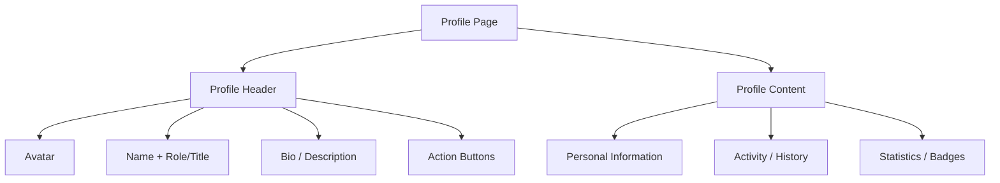

## Overview

**User Profile** is the interface that displays a user's identity, activity, and public or personal information. Profiles serve as both an identity card (how others see the user) and a self-management tool (how the user views and edits their own data).

A well-designed profile balances information density with visual clarity, supports both viewing and editing modes, and respects privacy by giving users control over what information is visible to others.

<BuildEffort
  level="medium"
  description="Requires avatar upload with cropping, editable form fields with inline or modal editing, role-based visibility controls (public vs. private), and responsive layout. Integration with authentication and storage backends adds complexity."
/>

## Use Cases

### When to use:

Use **User Profile** to **display and manage user identity, activity, and personal information**.

**Common scenarios include:**

- Displaying a user's public profile on community or social platforms
- Showing the authenticated user's own profile with edit capabilities
- Team member profiles in collaboration tools
- Author profiles on content platforms (blogs, documentation)
- Contributor profiles on open-source or marketplace platforms

### When not to use:

- Account security settings (use [Account Settings](/patterns/authentication/account-settings))
- Application-level configuration unrelated to the user (use app settings)
- Contact cards in a directory where interaction isn't needed (use a simple card component)
- User management admin panels (use a data table or admin interface)

### Common scenarios and examples

- GitHub-style profile with avatar, bio, activity graph, and repositories
- LinkedIn-style professional profile with experience, skills, and connections
- Forum user profile showing posts, reputation, and badges
- SaaS team member profile showing role, department, and contact info
- E-commerce customer profile with order history and saved addresses

<PatternComparison
  current="User Profile"
  alternatives={[
    {
      name: "Account Settings",
      path: "/patterns/authentication/account-settings",
      when: "managing security, notifications, and account configuration",
      pros: ["Security-focused", "Organized by category", "Handles sensitive changes"],
      cons: ["Not display-oriented", "Not for public viewing"]
    },
    {
      name: "Sign Up Flow",
      path: "/patterns/authentication/signup",
      when: "collecting initial user information during registration",
      pros: ["Captures data at the right time", "Part of onboarding"],
      cons: ["One-time flow", "Limited fields"]
    },
    {
      name: "Login Form",
      path: "/patterns/authentication/login",
      when: "authenticating user identity, not displaying it",
      pros: ["Identity verification", "Session creation"],
      cons: ["No profile display", "No editing capability"]
    }
  ]}
/>

## Benefits

- Provides a clear, centralized view of user identity and activity
- Enables social features through visible profiles (following, messaging, reputation)
- Builds trust on marketplaces and communities by showing identity and history
- Supports personalization and self-expression through avatars and bios
- Creates a natural place for users to manage their displayed information

## Drawbacks

- **Privacy risks** – Exposing too much information by default can endanger users
- **Avatar upload complexity** – Image upload, cropping, resizing, and storage require significant effort
- **Edit mode friction** – Switching between view and edit modes needs careful UX
- **Empty state challenge** – New profiles look sparse and uninviting without content
- **Responsive layout difficulty** – Complex profiles with many sections need careful mobile adaptation
- **Data freshness** – Profile information can become stale if users don't update it

## Anatomy



### Component Structure

1. **Profile Header**

- The prominent top section with avatar, name, role, and bio
- Often includes a cover image or banner
- Contains action buttons (Edit Profile, Follow, Message)

2. **Avatar**

- The user's profile picture, displayed as a circular or rounded image
- Supports upload, crop, and a fallback (initials or default icon)
- Typical sizes: 80-128px for profile pages, 32-48px for compact views

3. **Name and Role**

- Display name prominently with role, title, or username below
- May include verification badges or status indicators
- Linked to the user's public profile URL

4. **Bio / Description**

- A short text describing the user (1-3 sentences)
- May include links, location, and join date
- Editable directly on the profile or via a modal

5. **Action Buttons**

- For own profile: "Edit profile" button
- For others' profiles: "Follow", "Message", "Connect" buttons
- Contextual based on the viewer's relationship to the profile owner

6. **Personal Information**

- Structured data: email (if public), location, website, social links
- Displayed in a key-value layout
- Respects privacy settings (some fields may be hidden)

7. **Activity / History**

- Recent actions, posts, contributions, or orders
- May use a timeline, card grid, or list format
- Supports pagination or "load more" for long histories

8. **Statistics / Badges**

- Numerical stats: posts, followers, contributions, reputation
- Achievement badges or verification marks
- Displayed as compact metrics in the header or a dedicated section

#### Summary of Components

| Component          | Required? | Purpose                                                      |
| ------------------ | --------- | ------------------------------------------------------------ |
| Profile Header     | ✅ Yes    | Prominent identity section with avatar, name, and bio.       |
| Avatar             | ✅ Yes    | Visual representation of the user.                           |
| Name and Role      | ✅ Yes    | Primary identification text.                                 |
| Bio / Description  | ❌ No     | Short self-description or tagline.                           |
| Action Buttons     | ✅ Yes    | Contextual actions (edit, follow, message).                  |
| Personal Information| ❌ No    | Structured profile data (location, links, email).            |
| Activity / History | ❌ No     | Recent actions or contributions.                             |
| Statistics / Badges| ❌ No     | Numerical metrics and achievements.                          |

## Variations

### 1. Public Profile Page
A full-page profile visible to other users, emphasizing the user's public identity and contributions.

**When to use:** Social platforms, communities, marketplaces, and open-source contributor pages.

### 2. Profile Card (Compact)
A condensed profile view showing avatar, name, and a few key details in a card format.

**When to use:** User lists, team pages, comment sections, and hover cards on @mentions.

### 3. Editable Profile
The user's own profile with inline editing or an edit mode that allows updating all fields.

**When to use:** Any authenticated user viewing their own profile.

### 4. Professional Profile
A detailed profile with experience, skills, education, and endorsements.

**When to use:** Professional networking, job boards, and B2B platforms.

### 5. Minimal Profile
An avatar and name with minimal additional information.

**When to use:** Chat applications, gaming platforms, and contexts where minimal identity is needed.

### 6. Profile with Tabs
A profile page with tabbed content sections (Posts, Repositories, Activity, Settings).

**When to use:** Platforms where users have multiple content types associated with their profile.

## Examples

### Live Preview

<Playground patternType="authentication" pattern="user-profile" example="basic" presentation="hidden-code" />

### Basic HTML Implementation

```html
<div class="profile-page">
  <div class="profile-header">
    <div class="avatar-container">
      
    </div>

    <div class="profile-identity">
      <h1 class="profile-name">Jane Doe</h1>
      <p class="profile-role">Senior Frontend Engineer</p>
      <p class="profile-bio">
        Building accessible web experiences. Open source contributor.
        Based in San Francisco.
      </p>
      <div class="profile-meta">
        <span>📍 San Francisco, CA</span>
        <a href="https://janedoe.dev">janedoe.dev</a>
        <span>Joined March 2022</span>
      </div>
    </div>

    <div class="profile-actions">
      <button type="button" class="edit-btn">Edit profile</button>
    </div>
  </div>

  <div class="profile-stats">
    <div class="stat">
      <span class="stat-value">142</span>
      <span class="stat-label">Posts</span>
    </div>
    <div class="stat">
      <span class="stat-value">1.2k</span>
      <span class="stat-label">Followers</span>
    </div>
    <div class="stat">
      <span class="stat-value">89</span>
      <span class="stat-label">Following</span>
    </div>
  </div>

  <div class="profile-content">
    <h2>Recent Activity</h2>
    <ul class="activity-list">
      <li class="activity-item">
        <span class="activity-icon" aria-hidden="true">📝</span>
        <div>
          <p>Published <a href="/posts/accessibility-guide">Accessibility Guide for Developers</a></p>
          <time datetime="2026-03-10">2 days ago</time>
        </div>
      </li>
    </ul>
  </div>
</div>
```

## Best Practices

### Content

**Do's ✅**

- Display the user's name prominently as the page heading (h1)
- Show an empty state with prompts for new profiles ("Add a bio to tell others about yourself")
- Format large numbers in a readable way (1.2k instead of 1,234)
- Include join date to establish credibility and history

**Don'ts ❌**

- Don't display email addresses publicly by default — let users opt in
- Don't show empty sections — hide them until data exists
- Don't truncate bios without a "Show more" option

### Accessibility

**Do's ✅**

- Use `alt` text on avatar images that includes the user's name
- Use proper heading hierarchy (h1 for name, h2 for sections)
- Make all action buttons keyboard accessible with visible focus indicators
- Use `<time>` elements with `datetime` attributes for dates
- Ensure the edit mode provides clear form labels

**Don'ts ❌**

- Don't use the avatar as the sole identifier — always include the text name
- Don't make profile stats interactive (clickable) without clear affordance
- Don't auto-play media on profile pages

### Visual Design

**Do's ✅**

- Use a circular or rounded-square avatar for consistent visual identity
- Create a clear visual hierarchy: avatar and name first, details second
- Distinguish between the user's own profile (edit capabilities) and others' profiles (follow/message)
- Show a default avatar (initials or generic icon) when no image is uploaded

**Don'ts ❌**

- Don't make the avatar too small to recognize on the profile page (minimum 80px)
- Don't use a cluttered layout with too many elements competing for attention
- Don't mix different avatar shapes across the application

### Mobile & Touch Considerations

**Do's ✅**

- Stack the profile header vertically on mobile (avatar above name and bio)
- Make action buttons full-width on mobile for easy tapping
- Ensure touch targets are at least 44×44px for all interactive elements
- Use a compact layout for stats that fits within the mobile viewport

**Don'ts ❌**

- Don't show a cover image that pushes the profile content below the fold
- Don't require horizontal scrolling for profile metadata

### Layout & Positioning

**Do's ✅**

- Center the profile page content with a max-width (42-48rem)
- Place the avatar, name, and actions together in the header for immediate identity
- Separate profile sections with borders or spacing for scannability

**Don'ts ❌**

- Don't place the edit button far from the information it edits
- Don't use a multi-column layout that makes scanning the profile non-linear

## Common Mistakes & Anti-Patterns 🚫

### No Default Avatar
**The Problem:**
Users without a profile picture see a broken image or empty space, making the profile look broken.

**How to Fix It:**
Show a fallback: initials-based avatar (first and last initials with a background color) or a generic silhouette icon.

---

### No Empty State for New Profiles
**The Problem:**
A new user's profile page shows blank sections with no guidance on what to add.

**How to Fix It:**
Show prompts for empty fields: "Add a bio to introduce yourself", "Upload a profile picture". These disappear once the user fills in the data.

---

### Edit Mode That Reloads the Page
**The Problem:**
Clicking "Edit profile" navigates to a separate page, losing the user's context and requiring a page load.

**How to Fix It:**
Use inline editing (click to edit fields in place) or a modal overlay. Keep the edit experience on the same page as the view.

---

### Public Email by Default
**The Problem:**
The user's email address is displayed publicly on their profile without their consent.

**How to Fix It:**
Make email visibility opt-in. Default to hidden and let users choose to display it in their privacy settings.

---

### Avatar Upload Without Crop
**The Problem:**
Users upload a large photo 
import { Playground } from "@/components/playground";and it gets auto-cropped awkwardly, cutting off faces or important parts.

**How to Fix It:**
Provide a crop tool after upload that lets users position and resize the image within the circular/square frame before saving.

---

### Stats That Aren't Clickable
**The Problem:**
Profile stats (posts, followers, following) look interactive but don't link to relevant content.

**How to Fix It:**
Make stats clickable when there's a meaningful destination (list of followers, list of posts). If not interactive, don't style them with interactive affordances.

## Security Considerations

### Privacy Controls

- **Visibility settings** — Let users control what's public, private, or visible to specific groups
- **Email visibility** — Never expose email by default; make it opt-in
- **Location precision** — Allow city-level instead of exact location sharing
- **Activity visibility** — Let users hide their activity feed from public view

### Avatar Upload Security

- **File validation** — Validate file type, size (max 5MB), and dimensions server-side
- **Virus scanning** — Scan uploaded files for malware
- **Image processing** — Strip EXIF metadata (may contain GPS coordinates) and re-encode the image
- **Storage** — Serve avatars from a CDN with proper cache headers

### Profile Data Protection

- **Rate limiting** — Prevent scraping of profile data
- **Data minimization** — Only collect and display information users explicitly provide
- **GDPR compliance** — Support data export and deletion requests

## Micro-Interactions & Animations

### Avatar Upload Preview
- **Effect:** New avatar appears immediately with a fade transition before server confirmation
- **Timing:** Instant preview (optimistic), 200ms fade
- **Trigger:** File selection or crop confirmation
- **Implementation:** `FileReader.readAsDataURL` for instant preview, CSS opacity transition

### Inline Edit Toggle
- **Effect:** Text fields transform into editable inputs with a smooth border appearance
- **Timing:** 150ms border and background transition
- **Trigger:** Click on editable text or "Edit" button
- **Implementation:** CSS transitions on border and background with content-editable or input swap

### Follow Button State
- **Effect:** Button transitions between "Follow" (outlined) and "Following" (filled) states
- **Timing:** 200ms ease
- **Trigger:** Button click
- **Implementation:** CSS class toggle with background-color and border transitions

### Stat Counter Animation
- **Effect:** Numbers count up from 0 to their actual value when the profile loads
- **Timing:** 500ms ease-out
- **Trigger:** Profile page mount / scroll into view
- **Implementation:** `requestAnimationFrame` counter with easing function

## Tracking

### Key Events to Track

| **Event Name** | **Description** | **Why Track It?** |
| --- | --- | --- |
| `profile.viewed` | User views a profile page | Measure profile engagement |
| `profile.edited` | User edits their own profile | Track profile completion |
| `profile.avatar_uploaded` | User uploads a new avatar | Measure avatar adoption |
| `profile.followed` | User follows another user | Track social engagement |
| `profile.messaged` | User sends a message from a profile | Measure communication engagement |
| `profile.link_clicked` | User clicks a link on a profile (website, social) | Track outbound engagement |

### Event Payload Structure

```json
{
  "event": "profile.viewed",
  "properties": {
    "profile_user_id": "user_123",
    "is_own_profile": false,
    "viewer_user_id": "user_456",
    "profile_completeness": 0.8,
    "has_avatar": true,
    "has_bio": true,
    "device_type": "desktop"
  }
}
```

### Key Metrics to Analyze

- **Profile Completeness:** Average percentage of filled profile fields
- **Avatar Upload Rate:** Percentage of users with a custom avatar
- **Profile View Rate:** How often profiles are viewed by other users
- **Edit Frequency:** How often users update their profiles
- **Follow-Through Rate:** Percentage of profile views that lead to follow/message actions

## Localization

```json
{
  "user_profile": {
    "actions": {
      "edit_profile": "Edit profile",
      "done_editing": "Done editing",
      "follow": "Follow",
      "following": "Following",
      "message": "Message",
      "upload_avatar": "Change profile picture"
    },
    "fields": {
      "name": "Name",
      "bio": "Bio",
      "location": "Location",
      "website": "Website",
      "joined": "Joined {date}"
    },
    "empty_states": {
      "no_bio": "Add a bio to tell others about yourself.",
      "no_activity": "No recent activity yet.",
      "no_avatar": "Upload a profile picture"
    },
    "stats": {
      "posts": "Posts",
      "followers": "Followers",
      "following": "Following"
    }
  }
}
```

### RTL (Right-to-Left) Considerations

- Mirror the profile header layout (avatar on the right)
- Align name, bio, and metadata to the right
- Flip action button positions
- Reverse stat counter order

### Cultural Considerations

- **Name display:** Some cultures use family name first (East Asian naming conventions)
- **Avatar expectations:** Some cultures have sensitivities around profile photos
- **Bio length:** Longer bios may be expected in some professional cultures
- **Stats prominence:** Some cultures view displaying follower counts differently

## Performance

### Target Metrics

- **Profile page load:** < 500ms with avatar and content
- **Avatar image:** < 100KB optimized (serve multiple sizes)
- **Edit mode toggle:** < 50ms response
- **Activity feed:** Lazy-load items beyond the first 10
- **Avatar upload:** < 2s for upload + processing + preview

### Optimization Strategies

**Responsive Avatar Sizes**
```html

```

**Lazy Load Activity Feed**
```jsx
const [visibleItems, setVisibleItems] = useState(10);
// Load more on scroll or button click
```

**Optimistic Avatar Preview**
```javascript
const reader = new FileReader();
reader.onload = (e) => setPreviewUrl(e.target.result);
reader.readAsDataURL(file);
```

## Testing Guidelines

### Functional Testing

**Should ✓**

- [ ] Display correct user information (name, bio, avatar, stats)
- [ ] Show edit capabilities on the user's own profile
- [ ] Show follow/message buttons on other users' profiles
- [ ] Handle avatar upload with preview and save
- [ ] Handle profile edits with save and cancel
- [ ] Show appropriate empty states for new profiles
- [ ] Display activity feed with correct chronological order

### Accessibility Testing

**Should ✓**

- [ ] Avatar has descriptive `alt` text including the user's name
- [ ] Page uses proper heading hierarchy (h1 for name)
- [ ] All action buttons are keyboard accessible
- [ ] Edit mode provides proper form labels
- [ ] Dates use `<time>` elements with `datetime` attributes
- [ ] Focus indicators are visible on all interactive elements

### Security Testing

**Should ✓**

- [ ] Private fields are not exposed in the HTML source
- [ ] Avatar uploads are validated for type and size
- [ ] EXIF metadata is stripped from uploaded images
- [ ] Profile editing requires authentication
- [ ] Privacy settings are enforced server-side

### Visual Testing

**Should ✓**

- [ ] Profile renders correctly across viewport sizes
- [ ] Default avatar displays when no image is set
- [ ] Edit mode is visually distinct from view mode
- [ ] Stats are formatted correctly (1.2k, 3.5M)
- [ ] Action buttons reflect the correct state (Follow/Following)

## SEO Considerations

- **Public profiles should be indexable** — Unlike settings pages, public profiles are often valuable for SEO
- **Canonical URLs** — Set a canonical URL for each profile (e.g., `/u/janedoe`)
- **Structured data** — Use `Person` schema markup for public profiles
- **Meta tags** — Include the user's name and bio in `<title>` and `<meta description>`
- **OpenGraph tags** — Include avatar and name for social sharing previews
- **Noindex private profiles** — Profiles set to private should not be indexed

## Design Tokens

```json
{
  "$schema": "https://design-tokens.org/schema.json",
  "userProfile": {
    "avatar": {
      "size": {
        "large": { "value": "6rem", "type": "dimension" },
        "medium": { "value": "3rem", "type": "dimension" },
        "small": { "value": "2rem", "type": "dimension" }
      },
      "borderRadius": { "value": "50%", "type": "dimension" },
      "borderColor": { "value": "{color.gray.200}", "type": "color" },
      "borderWidth": { "value": "3px", "type": "dimension" }
    },
    "name": {
      "fontSize": { "value": "1.5rem", "type": "fontSizes" },
      "fontWeight": { "value": "700", "type": "fontWeights" },
      "color": { "value": "{color.gray.900}", "type": "color" }
    },
    "role": {
      "fontSize": { "value": "0.9375rem", "type": "fontSizes" },
      "color": { "value": "{color.gray.500}", "type": "color" }
    },
    "bio": {
      "fontSize": { "value": "0.9375rem", "type": "fontSizes" },
      "color": { "value": "{color.gray.700}", "type": "color" },
      "lineHeight": { "value": "1.5", "type": "number" }
    },
    "stat": {
      "valueSize": { "value": "1.25rem", "type": "fontSizes" },
      "valueWeight": { "value": "700", "type": "fontWeights" },
      "labelSize": { "value": "0.8125rem", "type": "fontSizes" },
      "labelColor": { "value": "{color.gray.500}", "type": "color" }
    },
    "actions": {
      "followBackground": { "value": "{color.blue.600}", "type": "color" },
      "followColor": { "value": "{color.white}", "type": "color" },
      "editBorderColor": { "value": "{color.gray.300}", "type": "color" }
    }
  }
}
```

## FAQ

<FaqStructuredData
  items={[
    {
      question: "What is a user profile pattern?",
      answer:
        "A user profile is an interface that displays a user's identity, personal information, activity, and public data. It serves as both a presentation layer (how others see the user) and a management tool (how the user views and edits their own information).",
    },
    {
      question: "What is the difference between a user profile and account settings?",
      answer:
        "A user profile displays identity and public information (avatar, name, bio, activity). Account settings manage security and configuration (password, email, 2FA, notifications, privacy). They are separate interfaces with different purposes.",
    },
    {
      question: "How should I handle avatar uploads?",
      answer:
        "Provide an upload button that accepts common image formats (JPEG, PNG, WebP). After upload, offer a crop tool for the user to position the image. Show an instant preview using FileReader before server upload. Strip EXIF metadata server-side and serve optimized, resized versions.",
    },
    {
      question: "How do I handle empty profiles for new users?",
      answer:
        "Show friendly prompts for empty fields: 'Add a bio to tell others about yourself' or 'Upload a profile picture'. Use a default avatar with the user's initials. Hide sections entirely until they have content rather than showing empty lists.",
    },
    {
      question: "Should user profiles be public by default?",
      answer:
        "It depends on the platform. For social and community platforms, default to public with opt-out. For enterprise and privacy-sensitive applications, default to private with opt-in. Always give users clear controls over what's visible to others.",
    },
  ]}
/>

## Related Patterns

<RelatedPatternsCard category="authentication" />

## Resources

### References

- [WCAG 2.2](https://www.w3.org/TR/WCAG22/) - Accessibility baseline for keyboard support, focus management, and readable state changes.
- [WAI Forms Tips and Tricks](https://www.w3.org/WAI/tutorials/forms/tips/) - Practical guidance for formatting, grouping, timing, and forgiving user input rules.

### Guides

- [WAI Forms Tutorial](https://www.w3.org/WAI/tutorials/forms/) - Accessible labels, instructions, validation, and grouping for forms and input controls.

### Articles

- [Nielsen Norman Group: Login walls](https://www.nngroup.com/articles/login-walls/) - When forced authentication harms discovery and conversion in account flows.
- [Smashing Magazine: Checklist for cards](https://www.smashingmagazine.com/2020/08/checklist-cards-release/) - A practical review of content hierarchy, action density, and card sizing.

### NPM Packages

- [`react-hook-form`](https://www.npmjs.com/package/react-hook-form) - Low-friction form state and validation wiring for complex input flows.
- [`zod`](https://www.npmjs.com/package/zod) - Schema validation for typed parsing, normalization, and field-level error handling.
- [`react-easy-crop`](https://www.npmjs.com/package/react-easy-crop) - Image cropping primitives for avatar and profile-photo editing flows.
