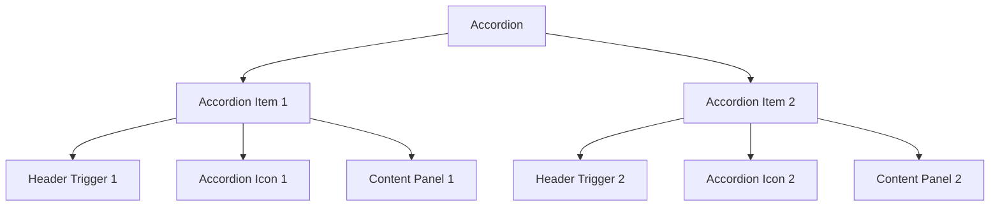
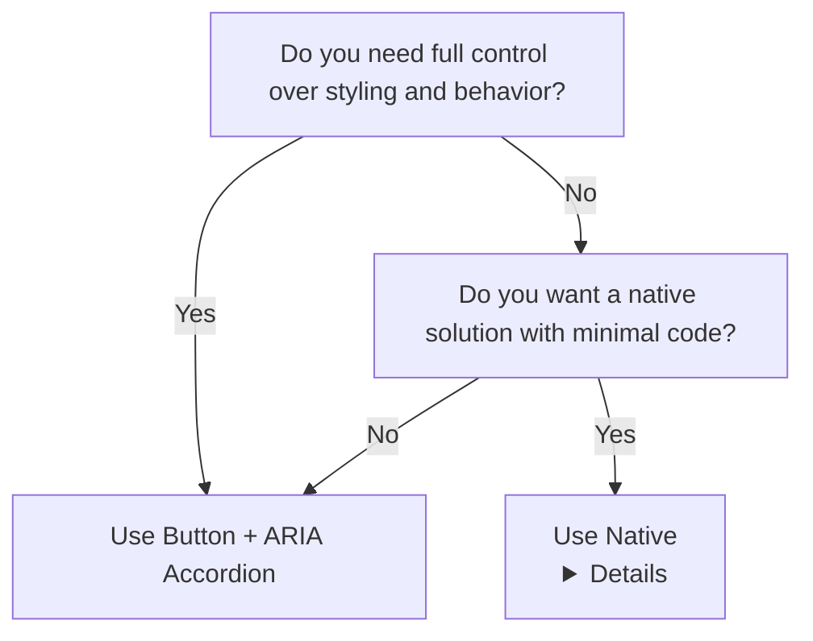

**_(Also called collapsible panels)_**

<PatternStats
  popularity="high"
/>

## Overview

An **accordion** consists of vertically stacked headers that expand or collapse to reveal or hide related content. Accordions conserve screen space by displaying content in a structured, interactive way.

Accordions work well for **FAQs, settings panels, and structured content** where users access multiple sections without scrolling through everything.

<BuildEffort
  level="medium"
  description="Requires expand/collapse logic, proper ARIA attributes (`aria-expanded`), and smooth content visibility toggling."
/>

## Use Cases

### When to use:

Use accordions to present **structured content benefiting from progressive disclosure**.

**Common use cases include:**

- **FAQs (Frequently Asked Questions)** – Users find answers quickly
- **Settings and Preferences** – Options organize into collapsible categories
- **Product Details or Features** – Users expand sections they're interested in
- **Documentation or Guides** – Step-by-step content stays organized
- **Navigation and Filtering** – Sidebars use them for hierarchical content

### When not to use:

- **All content needs simultaneous visibility** (comparison tables)
- **Content is too short**—collapsing small text reduces usability
- **Frequent section switching needed**—tabs work better
- **Multiple sections need simultaneous viewing** (Terms and Conditions)—try popovers, modals, or side panels
- **Deep nesting of multiple levels**—structured outlines or table of contents work better

<PatternComparison
  current="Accordion"
  alternatives={[
    {
      name: "Tabs",
      path: "/patterns/navigation/tabs",
      when: "content sections are mutually exclusive and users switch frequently",
      pros: ["Quick switching", "Clear active state", "Horizontal layout"],
      cons: ["Limited to few sections", "Takes horizontal space", "Not for many items"]
    },
    {
      name: "Modal",
      path: "/patterns/content-management/modal",
      when: "content needs focused attention without page context",
      pros: ["Full focus", "Clear action path", "Overlay isolation"],
      cons: ["Blocks main content", "No multi-tasking", "Disruptive"]
    },
    {
      name: "Disclosure",
      path: "/patterns/content-management/disclosure",
      when: "single expandable section without multiple panels",
      pros: ["Simpler pattern", "Less complex", "Single focus"],
      cons: ["Only one section", "Not for groups", "Limited use case"]
    }
  ]}
/>

## Benefits

- **Saves space** showing only relevant content when needed
- **Better readability** with reduced visual clutter
- **Enhanced usability** through grouped related content
- **Optimized mobile experiences** with minimal scroll length

## Drawbacks

- **Hides content by default** – extra interaction needed for information access
- **Harder content scanning** – especially with multiple collapsed sections
- **Not suitable for all content** – particularly when users need multiple sections visible
- **Accessibility issues** – without correct ARIA role implementation
- **Excessive nesting** – creates poor user experience

## Anatomy



### Component Structure

1. **Accordion Container**

- Wraps all accordion items
- Handles state management (open/close behavior)
- Provides appropriate aria-label for screen readers

2. **Accordion Item**

- Single collapsible section with header (trigger) and content panel

3. **Accordion Header (Trigger)**

- Clickable element expanding/collapsing associated content
- Must be button element for accessibility
- Contains aria-expanded="true|false" indicating state

4. **Accordion Icon**

- Visual cue showing accordion state (collapsed or expanded)
- Common examples: chevron icons (▼/▲), plus/minus (+/−)
- Rotates or changes appearance when toggled
- Visually distinguishable and large enough for touch interaction

5. **Accordion Content Panel**

- Collapsible section appearing when triggered
- Associates with header via aria-controls and aria-labelledby
- Uses aria-hidden="true|false" indicating visibility to screen readers

#### Summary of Components

| Component     | Required? | Purpose                                          |
| ------------- | --------- | ------------------------------------------------ |
| Container     | ✅ Yes    | Wraps all accordion items together.              |
| Item          | ✅ Yes    | Represents an individual expandable section.     |
| Trigger       | ✅ Yes    | Toggles the visibility of the accordion content. |
| Icon          | ✅ Yes    | Indicates open/closed state (e.g., chevron).     |
| Content Panel | ✅ Yes    | Holds the content that expands/collapses.        |

## Examples

### Method 1: Using `<button>` and aria-expanded (ARIA Approach and Recommended)**

```html
<section class="accordion">
  <h2 class="accordion-title">Frequently Asked Questions</h2>

  <div class="accordion-item">
    <h3 id="accordion1-heading">What is an accordion?</h3>
    <button
      class="accordion-trigger"
      aria-expanded="false"
      aria-controls="panel1"
      aria-labelledby="accordion1-heading"
    >
      <span class="accordion-icon" aria-hidden="true">▼</span>
    </button>
    <section
      id="panel1"
      role="region"
      aria-labelledby="accordion1-heading"
      class="accordion-content"
      hidden
    >
      <p>
        An accordion is a UI pattern that expands and collapses content
        sections.
      </p>
    </section>
  </div>

  <div class="accordion-item">
    <h3 id="accordion2heading">When should I use an accordion?</h3>
    <button
      class="accordion-trigger"
      aria-expanded="false"
      aria-controls="panel2"
      aria-labelledby="accordion2-heading"
    >
      <span class="accordion-icon" aria-hidden="true">▼</span>
    </button>
    <section
      id="panel2"
      role="region"
      aria-labelledby="accordion2-heading"
      class="accordion-content"
      hidden
    >
      <p>
        Use an accordion when you want to organize content into collapsible
        sections.
      </p>
    </section>
  </div>
</section>

<script>
  document.querySelectorAll(".accordion-trigger").forEach((button) => {
    button.addEventListener("click", function () {
      const expanded = this.getAttribute("aria-expanded") === "true";
      this.setAttribute("aria-expanded", !expanded);
      this.nextElementSibling.hidden = expanded;

      // Toggle icon direction
      const icon = this.querySelector(".accordion-icon");
      icon.textContent = expanded ? "▼" : "▲";
    });
  });
</script>

<style>
  .accordion {
    border: 1px solid #ccc;
    border-radius: 5px;
    max-width: 600px;
  }

  .accordion-item {
    border-bottom: 1px solid #ddd;
  }

  .accordion-trigger {
    width: 100%;
    background: none;
    border: none;
    text-align: left;
    font-size: 1rem;
    padding: 1rem;
    display: flex;
    justify-content: space-between;
    align-items: center;
    cursor: pointer;
  }

  .accordion-content {
    padding: 1rem;
    display: none;
  }

  .accordion-trigger[aria-expanded="true"] + .accordion-content {
    display: block;
  }

  .accordion-icon {
    transition: transform 0.2s ease-in-out;
  }

  .accordion-trigger[aria-expanded="true"] .accordion-icon {
    transform: rotate(180deg);
  }
</style>
```

**Pros ✅**

- Full styling flexibility—no browser-imposed limitations.
- Explicit aria-expanded handling—better screen reader support.
- More customization options—e.g., "only one section open at a time" behavior.

**Cons ❌**

- Requires JavaScript to toggle states.
- More implementation complexity compared to `<details>`.

### Method 2: Using `<details>` and `<summary>` (Native Approach)**

This approach leverages **native browser behavior** without requiring JavaScript.

```html
<section class="accordion">
  <h2>Frequently Asked Questions</h2>

  <details>
    <summary id="accordion1">What is an accordion?</summary>
    <div id="panel1">
      <p>
        An accordion is a UI component that allows users to expand and collapse
        sections of content.
      </p>
    </div>
  </details>

  <details>
    <summary id="accordion2">How does it improve user experience?</summary>
    <div id="panel2">
      <p>
        Accordions help reduce clutter and make information easier to digest,
        enhancing the overall user experience.
      </p>
    </div>
  </details>
</section>

<style>
  details {
    border: 1px solid #ddd;
    padding: 0.75rem;
    margin-bottom: 0.5rem;
    border-radius: 5px;
  }

  summary {
    font-weight: bold;
    cursor: pointer;
  }

  details[open] summary {
    color: #007acc;
  }
</style>
```

**Pros ✅**

- No JavaScript required—fully functional with just HTML & CSS.
- Keyboard accessible by default—users can navigate with Tab and toggle with Enter.
- Simpler implementation with native support.

**Cons ❌**

- Limited styling control—some browsers restrict `<summary>` styling.
- No aria-expanded state by default—some screen readers may not properly announce expansion.
- All items can be expanded at once—doesn't support "only one section open" behavior.

### When to use a tabbed carousel vs grouped carousel?

Use the **decision tree** below to determine the right method:



## Best Practices

### Content & Usability

**Do's ✅**

- **Keep headers clear and concise**—they should describe the content inside.
- **Use progressive disclosure**—prioritize showing only essential information first.
- **Ensure logical grouping**—group related items under the same accordion.
- **Maintain consistent styling**—avoid varying sizes or colors for different headers.

**Don'ts ❌**

- **Don't overload sections**—too much content defeats the purpose of an accordion.
- **Avoid unnecessary animations**—fast, smooth transitions improve usability.
- **Don't use accordions for essential content**—ensure users can still access key information easily.

### Default Open Behavior

**Do's ✅**

- **Decide based on user expectations**—if the first section contains critical information, it may be beneficial to start expanded.
- **Keep the first accordion open** in **FAQs, tutorials, or onboarding flows** where users need immediate guidance.
- **Ensure consistency**—if one accordion is open by default, follow the same pattern across the UI.
- **Provide a clear visual indicator** when an accordion is expanded to avoid confusion.

**Don'ts ❌**

- **Don't force the first section open if the content is non-essential**—let users decide what they need.
- **Avoid inconsistent behavior**—mixing some open and some closed sections can be confusing.
- **Don't prevent users from collapsing the first accordion**—they should be able to close it if they want.

### Icon Placement & Behavior

#### Placement**

**Do's ✅**

- **Place the icon at the beginning of the header** for better usability, especially for users relying on screen magnification.
- **Ensure the icon remains visually distinguishable**—it should not blend into the text.
- **Make sure the icon is keyboard accessible** and updates its state (`aria-expanded`).
- **Test different placements** in usability studies to determine what works best for your audience.

**Don'ts ❌**

- **Avoid placing the icon too far from the trigger text**—users may not associate them.
- **Don't rely solely on the icon** to indicate expansion—ensure there is a visual or textual cue as well.
- **Avoid animations that make the icon movement too subtle**—it should clearly show state changes.

#### Behavior**

**Do's ✅**

- **Use an intuitive icon** (e.g., `+` → `−`, or chevron pointing up/down).
- **Ensure the icon changes state** when the accordion is expanded or collapsed.
- **Animate icon transitions smoothly** (e.g., rotate chevron instead of abruptly changing it).
- **Make the icon large enough** to be tappable on mobile devices.

**Don'ts ❌**

- **Don't rely only on the icon** to indicate expansion—also update `aria-expanded` and visually differentiate expanded sections.
- **Avoid using icons that do not clearly indicate** expansion and collapse states.
- **Don't use overly complex animations** that slow down interactions.

### Accessibility

**Do's ✅**

- **Use semantic HTML**—accordion triggers should be `button` elements.
- **Implement `aria-expanded`** to indicate open/closed states.
- **Ensure focus management**—moving between sections should be intuitive.
- **Support keyboard navigation**—allow arrow keys for cycling and `Enter` or `Space` to toggle.

**Don'ts ❌**

- **Don't trap focus** inside an expanded panel.
- **Avoid using `display: none;` on content**—instead, use `visibility` or `aria-hidden` for screen readers.

### Layout & Design

**Do's ✅**

- **Ensure clear distinctions** between expanded and collapsed states.
- **Provide smooth animations** (e.g., height transitions) to improve the user experience.
- **Use appropriate spacing** between items to avoid visual clutter.
- **Align icons and headers consistently** to maintain a structured appearance.

**Don'ts ❌**

- **Don't make accordions too small or too large**—users should easily scan headers.
- **Avoid inconsistent alignment**—headers, icons, and content should be visually aligned.
- **Don't place icons too far from the header text**, making it difficult to associate them with the toggle action.

## Tracking

Tracking accordion interactions helps measure user engagement, assess whether users find the hidden content valuable, and determine if sections should be expanded by default. By analyzing user behavior, we can optimize when and how accordions are used.

### Key Tracking Points

Each accordion interaction provides valuable insights into user behavior. Below are the key events that should be tracked:

| **Event Name**           | **Description**                                                       | **Why Track It?**                                          |
| ------------------------ | --------------------------------------------------------------------- | ---------------------------------------------------------- |
| `accordion.view`         | When the accordion component enters the [viewport](/glossary/viewport).                     | Determines visibility and content discovery.               |
| `accordion.expand`       | When a user expands an accordion section.                             | Measures engagement and demand for additional information. |
| `accordion.collapse`     | When a user collapses an accordion section.                           | Helps analyze whether users return to a condensed view.    |
| `accordion.auto_expand`  | When a section expands automatically (e.g., pre-expanded by default). | Determines if auto-expansion leads to better engagement.   |
| `accordion.read_time`    | The time a user spends with the expanded content visible.             | Helps measure content consumption.                         |
| `accordion.all_expand`   | When a user expands **all** sections at once (if supported).          | Indicates if users prefer all content visible upfront.     |
| `accordion.all_collapse` | When a user collapses **all** sections at once.                       | Tracks behavior when content is condensed back.            |

### Event Payload Structure

To ensure consistent tracking, here’s a recommended event format:

```json
{
  "event": "accordion.expand",
  "properties": {
    "accordion_id": "faq_section",
    "section_label": "Shipping Policies",
    "interaction_type": "click", // or "keyboard"
    "read_time": 5.7 // in seconds (only tracked on collapse)
  }
}
```

### Key Metrics to Analyze

Once tracking is in place, the following metrics provide actionable insights:

- **Expand Rate** → Percentage of users who expand at least one section.
- **Collapse Rate** → Percentage of users who collapse a section after expanding it.
- **Average Read Time** → How long users keep an expanded section open.
- **Auto-Expand vs. Manual Expand Rate** → Helps assess whether users prefer content pre-expanded or manually triggered.
- **Multi-Expand Rate** → Percentage of users expanding multiple sections in a session.

### Insights & Optimization Based on Tracking

By analyzing tracking data, we can optimize the accordion experience:

- 🚨 **Low Expand Rate?**
  → Users may not notice the accordion sections or find them unnecessary.
  **Optimization:** Improve section titles for clarity, make expansion triggers more prominent, or test making key sections pre-expanded.

- ⏳ **Short Read Time After Expand?**
  → Users may not be engaging with the expanded content.
  **Optimization:** Ensure content is concise, scannable, and well-structured. Test alternative formats such as inline content or tabs.

- 🔄 **High Collapse Rate?**
  → Users might be overwhelmed by too much content or prefer a more condensed view.
  **Optimization:** Reduce section length, highlight key takeaways in the collapsed state, or introduce progressive disclosure.

- 🔁 **High Multi-Expand Rate?**
  → Users frequently expand multiple sections, which may indicate that all content is relevant.
  **Optimization:** Consider whether an **accordion** is the right UI choice, or if a fully expanded layout would improve readability.

- ⚙️ **Auto-Expand Not Leading to Higher Engagement?**
  → Automatically expanded sections may be ignored.
  **Optimization:** A/B test auto-expanded vs. manually triggered content to determine user preference.

By continuously monitoring these metrics, we can refine accordion usability, ensuring users efficiently access necessary information while avoiding unnecessary interactions.

## Accessibility

### Method 1: Using `<button>` and aria-expanded (ARIA Approach and Recommended)**

```html
<section class="accordion">
  <h2 class="accordion-title">Frequently Asked Questions</h2>

  <div class="accordion-item">
    <h3 id="accordion1-heading">What is an accordion?</h3>
    <button
      class="accordion-trigger"
      aria-expanded="false"
      aria-controls="panel1"
      aria-labelledby="accordion1-heading"
    >
      <span class="accordion-icon" aria-hidden="true">▼</span>
    </button>
    <section
      id="panel1"
      role="region"
      aria-labelledby="accordion1-heading"
      class="accordion-content"
      hidden
    >
      <p>
        An accordion is a UI pattern that expands and collapses content
        sections.
      </p>
    </section>
  </div>

  <div class="accordion-item">
    <h3 id="accordion2heading">When should I use an accordion?</h3>
    <button
      class="accordion-trigger"
      aria-expanded="false"
      aria-controls="panel2"
      aria-labelledby="accordion2-heading"
    >
      <span class="accordion-icon" aria-hidden="true">▼</span>
    </button>
    <section
      id="panel2"
      role="region"
      aria-labelledby="accordion2-heading"
      class="accordion-content"
      hidden
    >
      <p>
        Use an accordion when you want to organize content into collapsible
        sections.
      </p>
    </section>
  </div>
</section>

<script>
  document.querySelectorAll(".accordion-trigger").forEach((button) => {
    button.addEventListener("click", function () {
      const expanded = this.getAttribute("aria-expanded") === "true";
      this.setAttribute("aria-expanded", !expanded);
      this.nextElementSibling.hidden = expanded;

      // Toggle icon direction
      const icon = this.querySelector(".accordion-icon");
      icon.textContent = expanded ? "▼" : "▲";
    });
  });
</script>

<style>
  .accordion {
    border: 1px solid #ccc;
    border-radius: 5px;
    max-width: 600px;
  }

  .accordion-item {
    border-bottom: 1px solid #ddd;
  }

  .accordion-trigger {
    width: 100%;
    background: none;
    border: none;
    text-align: left;
    font-size: 1rem;
    padding: 1rem;
    display: flex;
    justify-content: space-between;
    align-items: center;
    cursor: pointer;
  }

  .accordion-content {
    padding: 1rem;
    display: none;
  }

  .accordion-trigger[aria-expanded="true"] + .accordion-content {
    display: block;
  }

  .accordion-icon {
    transition: transform 0.2s ease-in-out;
  }

  .accordion-trigger[aria-expanded="true"] .accordion-icon {
    transform: rotate(180deg);
  }
</style>
```

**Pros ✅**

- Full styling flexibility—no browser-imposed limitations.
- Explicit aria-expanded handling—better screen reader support.
- More customization options—e.g., "only one section open at a time" behavior.

**Cons ❌**

- Requires JavaScript to toggle states.
- More implementation complexity compared to `<details>`.

### Method 2: Using `<details>` and `<summary>` (Native Approach)**

This approach leverages **native browser behavior** without requiring JavaScript.

```html
<section class="accordion">
  <h2>Frequently Asked Questions</h2>

  <details>
    <summary id="accordion1">What is an accordion?</summary>
    <div id="panel1">
      <p>
        An accordion is a UI component that allows users to expand and collapse
        sections of content.
      </p>
    </div>
  </details>

  <details>
    <summary id="accordion2">How does it improve user experience?</summary>
    <div id="panel2">
      <p>
        Accordions help reduce clutter and make information easier to digest,
        enhancing the overall user experience.
      </p>
    </div>
  </details>
</section>

<style>
  details {
    border: 1px solid #ddd;
    padding: 0.75rem;
    margin-bottom: 0.5rem;
    border-radius: 5px;
  }

  summary {
    font-weight: bold;
    cursor: pointer;
  }

  details[open] summary {
    color: #007acc;
  }
</style>
```

**Pros ✅**

- No JavaScript required—fully functional with just HTML & CSS.
- Keyboard accessible by default—users can navigate with Tab and toggle with Enter.
- Simpler implementation with native support.

**Cons ❌**

- Limited styling control—some browsers restrict `<summary>` styling.
- No aria-expanded state by default—some screen readers may not properly announce expansion.
- All items can be expanded at once—doesn't support "only one section open" behavior.

### When to use a tabbed carousel vs grouped carousel?

Use the **decision tree** below to determine the right method:


For a detailed breakdown of feature differences, refer to the table below:

| Feature                                     | `<details>` Accordion                          | `<button>` + ARIA Accordion                                  |
| ------------------------------------------- | ---------------------------------------------- | ------------------------------------------------------------ |
| **Requires JavaScript?**                    | ❌ No                                          | ✅ Yes (for toggling state and enforcing behavior)           |
| **Supports full styling?**                  | ❌ Limited (some browser-imposed restrictions) | ✅ Yes (full control over appearance)                        |
| **Explicit screen reader support?**         | ❌ No (`aria-expanded` missing by default)     | ✅ Yes (`aria-expanded`, `aria-controls`, `aria-labelledby`) |
| **Supports keeping only one section open?** | ❌ No                                          | ✅ Yes (requires JavaScript)                                 |
| **Keyboard accessibility?**                 | ✅ Built-in (natively accessible)              | ✅ Requires explicit keyboard handling                       |
| **Best for**                                | Simple FAQs or basic collapsible sections      | Custom-designed accordions with more control over behavior   |

## Accessibility

### Keyboard Interaction Pattern

The following table outlines the standard keyboard interactions for accordion components. These interactions ensure that users can navigate and operate accordions effectively using only a keyboard.

| Key                   | Action                                                                                                  |
| --------------------- | ------------------------------------------------------------------------------------------------------- |
| Enter or Space        | • Expand a collapsed panel; collapse all others<br/>• Collapse an expanded panel                        |
| Tab                   | Move focus to the next focusable item in the tab sequence. Focus will progress into an accordion panel. |
| Shift + Tab           | Move focus to the previous focusable item in the tab sequence                                           |
| Down Arrow (Optional) | Move focus to the next accordion header                                                                 |
| Up Arrow (Optional)   | Move focus to the previous accordion header                                                             |
| Home (Optional)       | Move focus to the first accordion header                                                                |
| End (Optional)        | Move focus to the last accordion header                                                                 |

> **Note**: Keys marked as optional may be omitted in some accordion implementations. The example in this documentation implements all optional keys for enhanced accessibility.

## Testing Guidelines

### Functional Testing

**Should ✓**

- [ ] Ensure each accordion section **expands and collapses correctly** when clicked.
- [ ] Verify that only **one section opens at a time**, if the accordion is set to single expansion mode.
- [ ] Confirm that the **content remains readable** and does not overlap when expanded.
- [ ] Ensure that **expanded sections persist when navigating back** (if applicable).
- [ ] Validate that accordion headers **do not shift layout unexpectedly** when toggled.

### Icon Behavior Testing

**Should ✓**

- [ ] Verify that the **accordion icon changes state** when toggling (`+` → `−` or chevron direction flips).
- [ ] Ensure the **icon animation is smooth** and not visually jarring.
- [ ] Confirm that **screen readers announce the icon state correctly** (`aria-expanded` updates accordingly).
- [ ] Ensure the icon is **visually clear and distinguishable** at different sizes and contrast levels.

### Accessibility Testing

**Should ✓**

- [ ] Verify that **screen readers announce expanded and collapsed states** correctly (`aria-expanded` updates).
- [ ] Ensure **keyboard accessibility**—users can navigate with `Tab`, toggle with `Enter`/`Space`, and move between headers using `Arrow Keys`.
- [ ] Check that the **accordion content remains accessible** even when collapsed (`aria-hidden` is handled properly).
- [ ] Test with **reduced motion preferences** to ensure animations do not interfere with usability.
- [ ] Confirm that **accordion icons are not the only indicator** of expansion state—there should be text changes or ARIA attributes as well.

### Visual Testing

**Should ✓**

- [ ] Validate that the **accordion headers are visually distinct** in both collapsed and expanded states.
- [ ] Ensure smooth and **non-jarring animations** when expanding or collapsing.
- [ ] Verify that **content does not clip or overlap** when expanded on different screen sizes.
- [ ] Check **responsive behavior** to ensure the accordion adapts well across breakpoints.
- [ ] Ensure **icon alignment is consistent** across all accordion headers.

### Performance Testing

**Should ✓**

- [ ] Ensure that **accordion interactions are smooth** and do not introduce lag.
- [ ] Confirm that excessive DOM updates **do not slow down rendering**.
- [ ] Verify that accordions **do not cause unnecessary reflows** when toggled.
- [ ] Test large datasets inside the accordion to ensure **acceptable performance**.

## [Design Tokens](/glossary/design-tokens)

These [design tokens](/glossary/design-tokens) follow the [Design Tokens Format](https://design-tokens.github.io/community-group/format/) specification and can be used with various token transformation tools to generate platform-specific variables.

### Accordion Tokens in DTF Format

```json
{
  "$schema": "https://design-tokens.org/schema.json",
  "accordion": {
    "header": {
      "fontWeight": { "value": "bold", "type": "fontWeight" },
      "fontSize": { "value": "1rem", "type": "dimension" },
      "padding": { "value": "1rem", "type": "dimension" },
      "background": { "value": "{color.gray.100}", "type": "color" },
      "textColor": { "value": "{color.gray.900}", "type": "color" }
    },
    "icon": {
      "size": { "value": "1.2rem", "type": "dimension" },
      "color": { "value": "{color.gray.600}", "type": "color" },
      "transition": {
        "duration": { "value": "250ms", "type": "duration" },
        "timingFunction": { "value": "ease-in-out", "type": "cubicBezier" }
      }
    },
    "content": {
      "padding": { "value": "1rem", "type": "dimension" },
      "background": { "value": "{color.white}", "type": "color" },
      "textColor": { "value": "{color.gray.800}", "type": "color" },
      "lineHeight": { "value": "1.6", "type": "dimension" }
    },
    "border": {
      "width": { "value": "1px", "type": "dimension" },
      "color": { "value": "{color.gray.300}", "type": "color" },
      "radius": { "value": "6px", "type": "borderRadius" }
    },
    "transition": {
      "duration": { "value": "300ms", "type": "duration" },
      "timingFunction": { "value": "ease-in-out", "type": "cubicBezier" }
    }
  }
}
```

## Frequently Asked Questions

<FaqStructuredData
  items={[
    {
      question: "What is an accordion in UI design?",
      answer:
        "An accordion is a graphical control element comprising a vertically stacked list of items, such as labels or thumbnails. Each item can be expanded or collapsed to reveal the content associated with that item.",
    },
    {
      question: "When should I use an accordion?",
      answer:
        "Accordions are useful when you need to present information in a limited space and allow users to choose which sections to expand for more details. They are commonly used for FAQs, menus, and content-heavy pages.",
    },
    {
      question: "How can I make an accordion accessible?",
      answer:
        "To ensure accessibility, use semantic HTML elements like <button> for the accordion headers, manage focus states, and implement ARIA attributes such as aria-expanded to indicate the state of each section.",
    },
    {
      question: "What are the best practices for designing an accordion?",
      answer:
        "Best practices include keeping headers clear and concise, ensuring only one section is expanded at a time if appropriate, providing visual indicators for expandable sections, and maintaining consistent styling throughout the accordion.",
    },
    {
      question: "Can accordions improve page performance?",
      answer:
        "Yes, by collapsing sections of content, accordions can reduce the amount of information displayed at once, leading to faster initial page load times and a cleaner user experience.",
    },
  ]}
/>

## Related Patterns

<RelatedPatternsCard category="content-management" />

## Resources

### Articles

- [Accordions on Desktop: When and How to Use - Nielsen Norman Group](https://www.nngroup.com/articles/accordions-on-desktop/)
- [Accordion Icons: Which Signifiers Work Best? - Nielsen Norman Group](https://www.nngroup.com/articles/accordion-icons/)

### Documentation

-[Accordion Pattern | WAI](https://www.w3.org/WAI/ARIA/apg/patterns/accordion/)

### Libraries

- [Accordion - Origin UI](https://originui.com/accordion)
