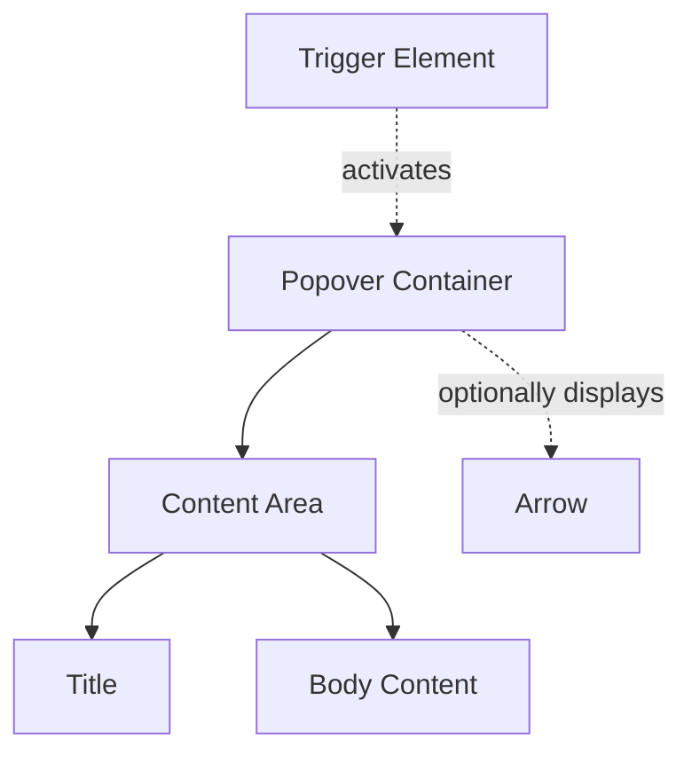
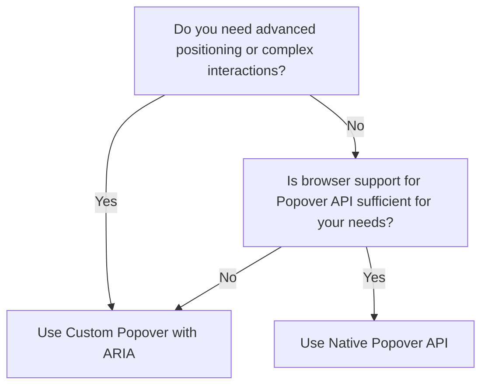

import { GuidesBanner } from "@/components/guides-banner";

## Overview

**Popovers** overlay the main content to give users additional information or actions.

Popovers display contextual content while keeping the surrounding page visible.

Unlike modals blocking page interaction, popovers deliver contextual help or shortcuts while the main interface stays visible and interactive.

<BuildEffort
  level="medium"
  description="Requires positioning logic, dismissal handling, focus management, and ARIA attributes (`aria-haspopup`, `aria-expanded`)."
/>

<GuidesBanner
  title="Popover vs Modal vs Drawer?"
  description="Compare all overlay patterns to make the right choice"
  guidePath="/pattern-guide/modal-vs-popover-guide"
/>

## Use Cases

### When to use:

Use popovers for context-specific information or quick actions that complement the main view without needing full user focus.

**Common scenarios include:**

- Contextual help needs additional details about data fields
- Quick actions or shortcuts like editing options or extra buttons
- Compact toolbars or menus with filters or settings appearing on demand
- Preview or supplementary info shows image or text previews on hover/focus

### When not to use:

- Critical information must stay persistently visible
- Large forms or complex interactions work better as modals
- Context needs full-page takeover for clarity

{/* Temporarily hidden - Kit and Gallery access */}
{/* <GalleryBanner
  title="View Popover Examples"
  description="Discover what to do (and avoid) from real implementations"
  galleryPath="https://gallery.uxpatterns.dev/web/feedback/popover"
/> */}

## Benefits

- Better user focus with context-specific content
- Main interface stays uncluttered
- Secondary actions become discoverable without navigation

## Drawbacks

- **Needs precise interaction** – difficult for some users
- **Obstructs other content** – harder page interaction
- **Accessibility issues** – without proper keyboard navigation and focus management
- **Positioning problems** – popover appears off-screen
- **Accidental dismissal** – frustrates users needing the information again

## Anatomy



### Component Structure

1. **Trigger Element**

- Interactive element (button, icon, text) activating the popover
- Handles **accessibility attributes** like `aria-haspopup` and `aria-expanded`
- Must be **focusable** with keyboard navigation support

2. **Popover Container**

- Root element wrapping popover content
- Controls **positioning relative to trigger element**
- Manages **visibility and accessibility**

3. **Arrow (Optional)**

- **Visual indicator** pointing to trigger element
- Shows relationship between **popover and trigger**
- Adjusts **based on position** (top, bottom, left, right)

4. **Content Area**

- Holds all **popover content**
- Usually has **title, body content, and interactive elements**

5. **Title (Optional)**

- **Brief heading or label** for popover content
- Users understand **context at a glance**

6. **Body Content**

- **Main popover content**
- Includes **text, links, or simple interactive elements**

7. **Close Button (Optional)**

- Users **dismiss popover manually**
- Needs **keyboard accessibility** and proper labeling
- Helps users who **prefer to close the popover without clicking outside**.

8. **Dismiss Behavior**

- The popover should close when the user:
  - Clicks **outside** of the popover.
  - Presses **Esc** on the keyboard.
  - Navigates away using the **Tab key** (if focus moves outside the popover).
- Ensures **smooth UX and proper accessibility handling**.

#### Summary of Components

| Component         | Required? | Purpose                                                    |
| ----------------- | --------- | ---------------------------------------------------------- |
| Trigger Element   | ✅ Yes    | The element that activates the popover.                    |
| Popover Container | ✅ Yes    | Contains the content of the popover.                       |
| Arrow             | ❌ No     | Visually connects the popover to the trigger.              |
| Title             | ❌ No     | Provides a heading for the popover content.                |
| Body Content      | ✅ Yes    | The main content of the popover.                           |
| Close Button      | ❌ No     | Allows users to manually dismiss the popover.              |
| Dismiss Behavior  | ✅ Yes    | Defines how the popover closes (Esc, click outside, etc.). |

## Best Practices

### Content

**Do's ✅**

- Keep content concise and focused.
- Ensure critical actions are easily accessible.
- Use clear labels for any interactive elements.

**Don'ts ❌**

- Avoid overloading with too much information.
- Don't include critical navigation or forms better suited for a modal.
- Do not expect users to scroll through extensive content.

### Accessibility

**Do's ✅**

- Ensure the popover is keyboard navigable (e.g., support Tab and Esc keys).
- Use appropriate ARIA attributes like `aria-haspopup` and `aria-expanded`.
- Manage focus: move focus into the popover when opened and return it when closed.

**Don'ts ❌**

- Rely solely on hover for activation, as it may be inaccessible on touch devices.
- Omit a clear focus indication for interactive elements within the popover.

### Visual Design

**Do's ✅**

- Clearly differentiate the popover from the background with contrasting colors.
- Use subtle shadows and transitions for a smooth appearance.
- Provide a clear pointer or arrow to associate with the trigger element.

**Don'ts ❌**

- Use excessive animations that can distract or slow down the interaction.
- Create styling that blends too closely with the underlying page.

### Layout & Positioning

**Do's ✅**

- Position the popover close to its trigger for clear visual association.
- Ensure the popover does not obscure important page content.
- Consider responsive adjustments to maintain usability on all devices.

**Don'ts ❌**

- Allow the popover to display off-screen; always adjust its placement.
- Fix its position in a way that it overlaps essential navigation elements.

## Code Examples

### Method 1: Custom Popover Implementation

```html
<!-- Trigger Button -->
<button id="popoverTrigger" aria-haspopup="true" aria-expanded="false">
  Open Popover
</button>

<!-- Popover -->
<div
  id="customPopover"
  class="popover"
  role="dialog"
  aria-labelledby="popoverTitle"
  hidden
>
  <div class="popover-content">
    <button type="button" class="popover-close" aria-label="Close popover">
      &times;
    </button>

    <h3 id="popoverTitle">Popover Title</h3>
    <p>Popover content goes here...</p>

    <div class="popover-actions">
      <button type="button" class="button-primary">Action</button>
    </div>
  </div>
</div>

<script>
  const trigger = document.getElementById("popoverTrigger");
  const popover = document.getElementById("customPopover");

  trigger.addEventListener("click", () => {
    const expanded = trigger.getAttribute("aria-expanded") === "true";
    trigger.setAttribute("aria-expanded", !expanded);
    popover.hidden = expanded;
  });
</script>
```

**Pros ✅**

- **Full styling control**—can be completely customized with CSS.
- **Supports advanced positioning and animations**.
- **Can include complex interactions and behaviors**.
- **Compatible with all browsers**, including older versions.

**Cons ❌**

- **Requires JavaScript**—needs scripting for open/close behavior and positioning.
- **Manual accessibility management**—requires careful implementation of ARIA attributes and keyboard interactions.
- **Positioning challenges**—may require additional libraries or complex logic for proper placement.
- **No built-in light dismiss**—must be implemented manually.

### Method 2: Native Popover API

```html
<!-- Trigger Button -->
<button popovertarget="nativePopover">Open Popover</button>

<!-- Native Popover -->
<div id="nativePopover" popover>
  <h3>Popover Title</h3>
  <p>Popover content goes here...</p>
  <button popovertarget="nativePopover" popovertargetaction="hide">
    Close
  </button>
</div>
```

**Pros ✅**

- **Built-in popover behavior**—handles showing/hiding automatically.
- **Light dismiss support**—closes when clicking outside by default.
- **Keyboard accessible by default**—supports `Escape` key to close.
- **Simpler implementation**—requires minimal JavaScript.
- **Stacking context management**—handles z-index automatically.

**Cons ❌**

- **Limited browser support**—not available in all browsers yet.
- **Less control over positioning**—limited options for custom placement.
- **Styling restrictions**—some default styles may be harder to override.
- **Less flexibility for complex behaviors**—may require additional scripting for advanced use cases.

### When to use Native Popover API vs Custom Popover?



For a detailed breakdown of feature differences, refer to the table below:

| Feature                   | Native Popover API                          | Custom Popover with ARIA                            |
| ------------------------- | ------------------------------------------- | --------------------------------------------------- |
| **Requires JavaScript?**  | ❌ No (for basic behavior)                  | ✅ Yes (for positioning and interactions)           |
| **Full styling control?** | ❌ Limited (some default styles)            | ✅ Yes (complete control over appearance)           |
| **Positioning options?**  | ❌ Limited (uses default positioning)       | ✅ Flexible (can use custom positioning logic)      |
| **Light dismiss?**        | ✅ Built-in                                 | ❌ Must be implemented manually                     |
| **Browser support?**      | ❌ Limited (newer browsers only)            | ✅ Works in all browsers with JS support            |
| **Accessibility?**        | ✅ Good (but may need enhancements)         | ✅ Can be fully accessible (requires careful impl.) |
| **Complex interactions?** | ❌ Limited (may need additional JS)         | ✅ Supports complex custom behaviors                |
| **Best for**              | Simple popovers with modern browser support | Custom popovers with specific design requirements   |

## Accessibility

### ARIA Attributes

**Required ARIA attributes:**

- `aria-haspopup="true"` on the trigger element.
- `aria-expanded` on the trigger element to reflect open/closed state.
- `role="dialog"` (or `role="menu"` if used as a menu) on the popover container.
- Ensure focus management so that keyboard users receive context.

### Keyboard Interaction Pattern

The following table outlines the standard keyboard interactions for popover components.

| Key | Action                                                    |
| --- | --------------------------------------------------------- |
| Tab | Navigate between focusable items within the popover       |
| Esc | Close the popover and return focus to the trigger element |

## SEO

- Ensure the popover content is not critical for SEO or provide alternate ways for search engines to access the content.
- Use descriptive hidden text if necessary so screen readers can still announce key information.

## Testing Guidelines

### Functional Testing

**Should ✓**

- [ ] Verify that clicking the trigger displays the popover.
- [ ] Ensure that keyboard navigation (Tab, Esc) behaves as expected.
- [ ] Confirm ARIA attributes update correctly when toggling the popover.
- [ ] Ensure focus handling moves into and out of the popover appropriately.

### Accessibility Testing

**Should ✓**

- [ ] Validate that screen reader users are notified when the popover is opened.
- [ ] Test that focus is not lost when navigating through popover content.
- [ ] Ensure the popover closes with the Esc key and returns focus to the trigger.

### Visual Testing

**Should ✓**

- [ ] Confirm that the popover appears near the trigger and does not obscure other critical information.
- [ ] Validate that styling and animations are smooth and non-distracting.
- [ ] Check that the popover remains fully visible on different screen sizes.

### Performance Testing

**Should ✓**

- [ ] Ensure that opening and closing the popover does not induce performance lags.
- [ ] Verify that the dynamic positioning adapts swiftly as the viewport changes.

## Design Tokens

These design tokens follow the [Design Tokens Format](https://design-tokens.github.io/community-group/format/) specification and can be used with various token transformation tools to generate platform-specific variables.

### Popover Tokens in DTF Format

```json
{
  "$schema": "https://design-tokens.org/schema.json",
  "popover": {
    "container": {
      "background": { "value": "{color.white}", "type": "color" },
      "border": { "value": "1px solid {color.gray.300}", "type": "border" },
      "shadow": { "value": "0px 4px 16px rgba(0, 0, 0, 0.1)", "type": "boxShadow" },
      "padding": { "value": "1rem", "type": "dimension" }
    },
    "arrow": {
      "size": { "value": "0.5rem", "type": "dimension" },
      "color": { "value": "{color.white}", "type": "color" }
    },
    "transition": {
      "duration": { "value": "200ms", "type": "duration" },
      "timingFunction": { "value": "ease-in-out", "type": "cubicBezier" }
    }
  }
}
```

{/* Temporarily hidden - Kit and Gallery access */}
{/* <GalleryBanner
  title="Ready to see it in action?"
  description="Discover what to do (and avoid) from real implementations"
  galleryPath="https://gallery.uxpatterns.dev/web/feedback/popover"
/> */}

## Related Patterns

Consider these related patterns when implementing popovers:

- [Modal](/patterns/content-management/modal) - Used for critical interactions requiring full focus.
- [Tooltip](/patterns/content-management/tooltip) - Similar in providing contextual information but less interactive.
- [Selection Input / Dropdown](/patterns/forms/selection-input) - Best for more complex navigation menus.

## Frequently Asked Questions

<FaqStructuredData
  items={[
    {
      question: "What is a popover in web design?",
      answer:
        "A popover is a small overlay that provides additional information or options related to a specific element on a webpage. It appears upon user interaction, such as a click or hover, and can contain text, images, or interactive elements.",
    },
    {
      question: "When should I use a popover?",
      answer:
        "Popovers are ideal for displaying non-critical, contextual information or controls without navigating away from the current page. Common use cases include providing explanations for form fields, offering additional details for UI elements, or presenting settings and options.",
    },
    {
      question: "How can I make a popover accessible?",
      answer:
        "To ensure accessibility, use focusable trigger elements like buttons, manage ARIA attributes such as `aria-haspopup` and `aria-expanded`, and support keyboard interactions. Ensure the popover content is accessible to screen readers and that focus management is handled appropriately.",
    },
    {
      question: "What are the benefits of using popovers?",
      answer:
        "Popovers enhance user experience by providing relevant information or controls in context, reducing the need for page navigation. They help keep interfaces clean and intuitive by revealing additional content only when needed.",
    },
    {
      question: "What are common mistakes to avoid when implementing popovers?",
      answer:
        "Avoid overloading popovers with essential information or complex interactions, as they are meant for supplementary content. Ensure that popovers do not obscure important UI elements and that they are properly dismissed to prevent clutter. Additionally, always consider accessibility to ensure all users can interact with popovers effectively.",
    },
  ]}
/>

## Resources

### Articles

### Documentation

[popover | MDN](https://developer.mozilla.org/en-US/docs/Web/HTML/Global_attributes/popover)

### Libraries

- [Popover - shadcn/ui](https://ui.shadcn.com/docs/components/popover)
