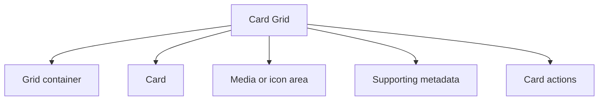

## Overview

A **Card Grid** pattern helps teams create a reliable way to show many items in a visual browseable grid without losing the metadata needed for quick evaluation. It is most useful when teams need content libraries and resources.

Compared with adjacent patterns, this pattern should reduce friction without hiding the state, rules, or recovery paths people need to keep moving.

<BuildEffort
  level="medium"
  description="Requires structured state, keyboard handling, and resilient feedback for display content in a responsive card layout."
/>

## Use Cases

### When to use:

- Content libraries and resources
- Catalog browsing
- Dashboard modules or boards

### When not to use:

- Use a simpler view when users only need one or two values and not the full layout.
- Avoid this pattern when the task is creation or editing rather than interpretation.
- Do not force the same view onto mobile if another representation would be clearer.

### Common scenarios and examples

- Content libraries and resources where users need a clear, repeatable interface model.
- Catalog browsing where users need a clear, repeatable interface model.
- Dashboard modules or boards where users need a clear, repeatable interface model.

<PatternComparison
  alternatives={[
  {
    "name": "List View",
    "path": "/patterns/data-display/list-view",
    "when": "users need list view instead of card grid as the primary interaction",
    "pros": [
      "Clearer fit for its own job",
      "Lower ambiguity about the expected interaction"
    ],
    "cons": [
      "Less specialized for card grid",
      "Different states and recovery paths to teach"
    ]
  },
  {
    "name": "Data Table",
    "path": "/patterns/data-display/table",
    "when": "users need data table instead of card grid as the primary interaction",
    "pros": [
      "Clearer fit for its own job",
      "Lower ambiguity about the expected interaction"
    ],
    "cons": [
      "Less specialized for card grid",
      "Different states and recovery paths to teach"
    ]
  },
  {
    "name": "Product Card",
    "path": "/patterns/e-commerce/product-card",
    "when": "users need product card instead of card grid as the primary interaction",
    "pros": [
      "Clearer fit for its own job",
      "Lower ambiguity about the expected interaction"
    ],
    "cons": [
      "Less specialized for card grid",
      "Different states and recovery paths to teach"
    ]
  }
]}
/>

## Benefits

- Clarifies how card grid should behave before implementation details begin to sprawl.
- Creates a reusable interaction model for teams who need to show many items in a visual browseable grid without losing the metadata needed for quick evaluation.
- Makes accessibility, edge cases, and recovery paths part of the design instead of post-launch cleanup.
- Gives product, design, and engineering a shared language for evaluating trade-offs.

## Drawbacks

- It can become visually dense or noisy when too much state is shown at once.
- Responsive behavior usually needs a deliberate mobile fallback, not just smaller text.
- Loading, empty, and error states are just as important as the happy path.
- Performance work becomes visible quickly when the dataset or layout grows.

## Anatomy



### Component Structure

1. **Grid container**

- Controls density, columns, and responsive behavior.

2. **Card**

- Wraps the item summary and any actions.

3. **Media or icon area**

- Provides a recognizable visual anchor.

4. **Supporting metadata**

- Shows status, category, price, or other secondary details.

5. **Card actions**

- Offer open, save, or quick actions without overwhelming the card.

#### Summary of Components

| Component | Required? | Purpose |
| --- | --- | --- |
| Grid container | ✅ Yes | Controls density, columns, and responsive behavior. |
| Card | ✅ Yes | Wraps the item summary and any actions. |
| Media or icon area | ❌ No | Provides a recognizable visual anchor. |
| Supporting metadata | ✅ Yes | Shows status, category, price, or other secondary details. |
| Card actions | ❌ No | Offer open, save, or quick actions without overwhelming the card. |

## Variations

### Editorial card grid

Highlights images, titles, and short descriptions.

**When to use:** Use for content libraries and galleries.

### Operational card grid

Uses badges and compact stats for fast scanning.

**When to use:** Use for admin and analytics surfaces.

### Commerce card grid

Puts pricing and key status near the image.

**When to use:** Use for shopping and catalog browsing.

## Examples

### Live Preview

<Playground patternType="data-display" pattern="card-grid" example="basic" presentation="hidden-code" />

### Basic Implementation

```html
<div class="demo-shell grid">
  <article class="card tile">
    <div class="thumb">📚</div>
    <h3>Documentation patterns</h3>
    <p class="muted">Browse reference pages grouped by product workflow.</p>
  </article>
  <article class="card tile">
    <div class="thumb">🧭</div>
    <h3>Navigation examples</h3>
    <p class="muted">Compare pagination, tabs, and structured menus.</p>
  </article>
  <article class="card tile">
    <div class="thumb">🧪</div>
    <h3>Sandbox snippets</h3>
    <p class="muted">Inspect small implementation demos without leaving the page.</p>
  </article>
</div>
```

### What this example demonstrates

- A clear baseline implementation of card grid that can be reviewed without framework-specific noise.
- Visible state, spacing, and content hierarchy that mirror the implementation guidance above.
- A small enough surface to copy into a design review or prototype before scaling the pattern up.

### Implementation Notes

- Start with semantic HTML and only add JavaScript where the interaction truly requires it.
- Keep styling tokens and spacing consistent with adjacent controls or layouts.
- If the live implementation introduces async behavior, mirror those states in the code example rather than documenting them only in prose.

## Best Practices

### Content

**Do's ✅**

- Start with the questions users need answered before choosing the layout.
- Use labels, legends, and headings that explain why the data matters.
- Keep supporting metadata close to the item, card, chart, or row it describes.

**Don'ts ❌**

- Do not assume everyone already understands the metric, status, or sorting rule.
- Do not rely on truncation to hide critical context.
- Do not bury key actions where they only appear on hover.

### Accessibility

**Do's ✅**

- Verify that card grid can be completed using keyboard alone.
- Keep focus order logical when the pattern opens, updates, or reveals additional UI.
- Preserve a visible focus state that is still readable at high zoom.
- Use semantic elements first, then add ARIA only where semantics alone are not enough.
- Announce state changes such as errors, loading, or completion in the right place and with the right politeness.

**Don'ts ❌**

- Do not remove focus styles without a visible replacement.
- Do not depend on placeholder or helper text that disappears before the user can act on it.
- Do not assume pointer, touch, and assistive technologies will all interact with the pattern the same way.

### Visual Design

**Do's ✅**

- Use hierarchy to separate primary values from supporting context.
- Reserve space for loading and empty states to avoid layout jumps.
- Design density levels intentionally for desktop and mobile.

**Don'ts ❌**

- Do not use decorative chrome that competes with the data itself.
- Do not make all rows, cards, or panels look equally important when priorities differ.
- Do not overload a single view with every possible control.

### Layout & Positioning

**Do's ✅**

- Preserve scannability as the viewport shrinks.
- Keep filters, summaries, and data visibly connected.
- Choose stable ordering and grouping rules so users can build muscle memory.

**Don'ts ❌**

- Do not let controls jump around between breakpoints.
- Do not hide essential data behind horizontal scrolling without a fallback.
- Do not treat empty or zero states as an afterthought.

## Common Mistakes & Anti-Patterns 🚫

### **Choosing the layout before the task**

**The Problem:**
Teams often pick a visually familiar pattern before confirming whether users need comparison, exploration, or scanning.

**How to Fix It?**
Start from the user task, then map the layout to comparison, chronology, hierarchy, or overview needs.

---

### **Ignoring non-happy states**

**The Problem:**
A polished default view still feels broken when loading, empty, and error states are inconsistent.

**How to Fix It?**
Design the data lifecycle up front, including empty, partial, stale, and failed results.

---

### **Shipping a desktop-only density model**

**The Problem:**
Large tables, dense dashboards, and heavy cards collapse quickly on small screens.

**How to Fix It?**
Define a mobile strategy such as stacked cards, progressive disclosure, or alternate summaries before implementation.

## Data Flow

- Start by defining the source of truth for the dataset, then map how filters, sorting, and view state transform that dataset before render.
- Keep loading, empty, and partial states in the same data flow model as the populated state so the view does not need separate ad hoc logic.
- When the pattern supports drilling into detail, keep the transition between overview and detail explicit so users understand what changed.

## Performance

- Measure the cost of rendering the default view before adding richer adornments such as nested actions, charts, or inline filters.
- Use pagination, windowing, or progressive disclosure when the layout would otherwise render too many items at once.
- Stabilize heights and placeholder geometry so loading and data refresh states do not cause large layout shifts.

## Usability Considerations

- Test whether people can answer the intended question in under a few seconds; if not, the layout may be too dense or too vague.
- Make sort, filter, and grouping rules visible whenever they change the order or subset of data.
- Give users a clear path back to a simpler or more detailed view when one layout cannot answer every question.

## Accessibility

### Keyboard Interaction

- [ ] Verify that card grid can be completed using keyboard alone.
- [ ] Keep focus order logical when the pattern opens, updates, or reveals additional UI.
- [ ] Preserve a visible focus state that is still readable at high zoom.

### Screen Reader Support

- [ ] Use semantic elements first, then add ARIA only where semantics alone are not enough.
- [ ] Announce state changes such as errors, loading, or completion in the right place and with the right politeness.
- [ ] Connect labels, hints, and status text with `aria-describedby` or structural headings when useful.

### Visual Accessibility

- [ ] Do not rely on color alone to convey severity, completion, or selection state.
- [ ] Test the pattern at 200% zoom and with reduced motion enabled.
- [ ] Ensure touch targets remain comfortable on mobile and coarse pointers.

## Testing Guidelines

### Functional Testing

- [ ] Verify the default, loading, error, and success states for card grid.
- [ ] Test the primary action and the obvious recovery action in the same run.
- [ ] Confirm that state survives refresh, navigation, or retry in the way users would expect.

### Accessibility Testing

- [ ] Run keyboard-only checks and at least one screen reader pass on the final implementation.
- [ ] Validate headings, labels, and announcement behavior with real content rather than lorem ipsum.
- [ ] Check color contrast and focus visibility in both default and stressed states.

### Edge Cases

- [ ] Test empty, long, duplicated, and unexpectedly formatted content.
- [ ] Check behavior on narrow screens, zoomed layouts, and slower networks.
- [ ] Verify that optimistic or asynchronous states reconcile correctly after a failure.

## Frequently Asked Questions

<FaqStructuredData
  items={[
  {
    "question": "When should I choose Card Grid instead of List View?",
    "answer": "Choose card grid when the job depends on show many items in a visual browseable grid without losing the metadata needed for quick evaluation. If the team only needs a lighter interaction with fewer states, List View will usually be easier to ship and maintain."
  },
  {
    "question": "What is the biggest implementation risk with Card Grid?",
    "answer": "The biggest risk is usually not the default visual state. It is the combination of state management, accessibility, and recovery behavior once loading, errors, or narrow screens enter the picture."
  },
  {
    "question": "How do I know whether card grid is working well?",
    "answer": "Watch whether users can complete the intended job without pausing to decode the interface, whether state changes feel trustworthy, and whether edge cases behave as intentionally as the happy path."
  }
]}
/>

## Related Patterns

<RelatedPatternsCard
  patterns={[
    {
      title: "List View",
      path: "/patterns/data-display/list-view",
      description: "Display data in vertical lists",
    },
    {
      title: "Data Table",
      path: "/patterns/data-display/table",
      description: "Display structured data in rows and columns",
    },
    {
      title: "Product Card",
      path: "/patterns/e-commerce/product-card",
      description: "Product display cards for e-commerce",
    },
  ]}
/>

## Resources

### References

- [WCAG 2.2](https://www.w3.org/TR/WCAG22/) - Accessibility baseline for keyboard support, focus management, and readable state changes.
- [WAI-ARIA Authoring Practices](https://www.w3.org/WAI/ARIA/apg/) - Reference patterns for keyboard behavior, semantics, and assistive technology support.

### Guides

- [web.dev: Rendering on the Web](https://web.dev/articles/rendering-on-the-web) - Rendering tradeoffs for data-rich pages, dashboards, and result-heavy views.

### Articles

- [Stephanie Walter: Designing complex data tables](https://stephaniewalter.design/blog/essential-resources-design-complex-data-tables/) - Design considerations for dense tables, column behavior, and analytical workflows.
- [Smashing Magazine: Checklist for cards](https://www.smashingmagazine.com/2020/08/checklist-cards-release/) - A practical review of content hierarchy, action density, and card sizing.

### NPM Packages

- [`react-virtuoso`](https://www.npmjs.com/package/react-virtuoso) - Virtualized list and table components for large feeds and long result sets.
- [`masonic`](https://www.npmjs.com/package/masonic) - Virtualized masonry grid for card-dense layouts and galleries.
- [`@tanstack/react-virtual`](https://www.npmjs.com/package/%40tanstack%2Freact-virtual) - Virtualization primitives for large lists, tables, and feeds.
