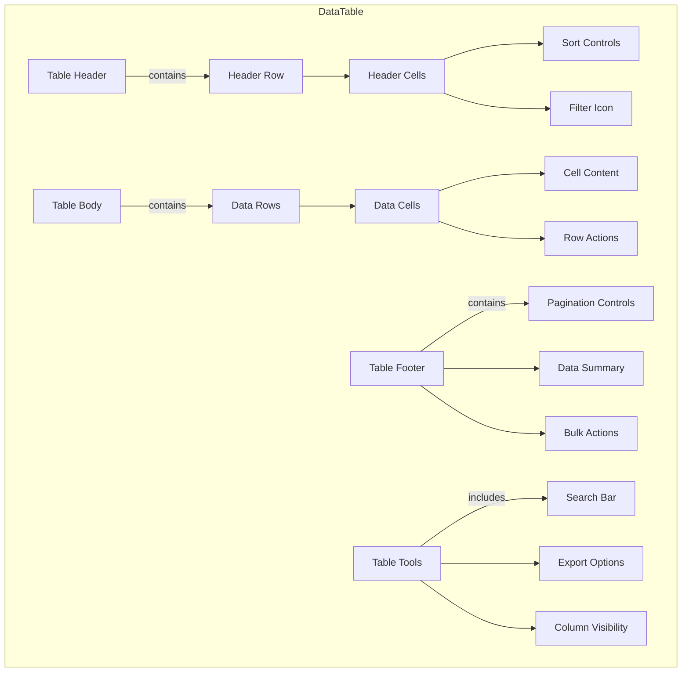
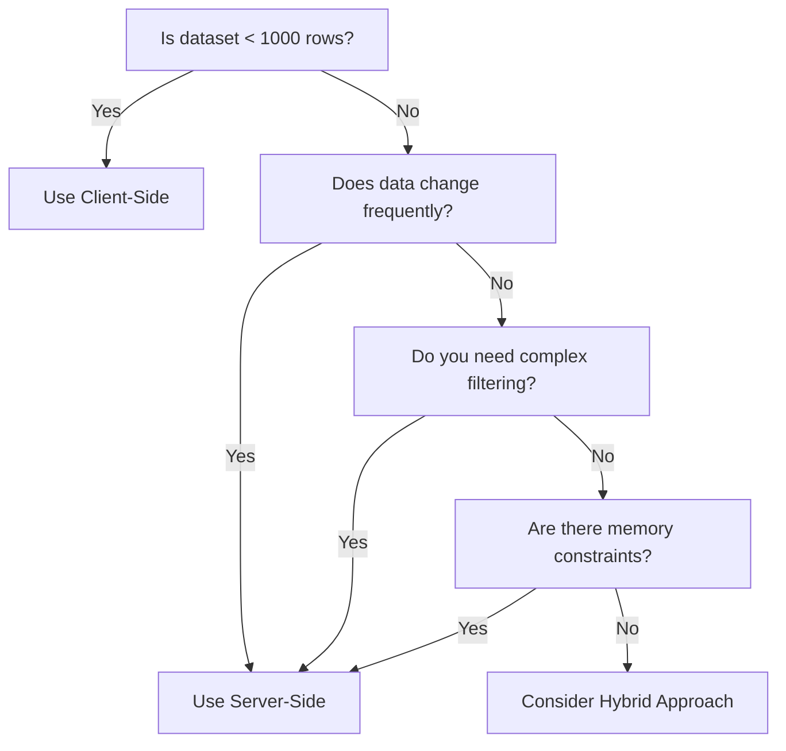

import { Playground } from "@/components/playground";

**_(Also called data grids)_**

<PatternStats
  popularity="high"
/>

<PatternPreview />

## Overview

**Data Tables** are structured components that display information in rows and columns, enabling users to scan, compare, analyze, and interact with large datasets efficiently.

<BuildEffort
  level="high"
  description="Complex component requiring sorting, filtering, pagination, responsive design, and accessibility considerations. May need virtual scrolling for large datasets."
/>

## Use Cases

### When to use:

- To display structured, tabular data with multiple properties
- When users need to compare data across multiple items
- To enable sorting, filtering, and searching of datasets
- For displaying financial data, inventory, user lists, or analytics
- When data relationships are best understood in a grid format
- To support bulk actions on multiple items
- For export-ready data presentation

### When not to use:

- For simple lists with minimal properties (use [List View](/patterns/data-display/list-view) instead)
- When data has complex hierarchical relationships (consider [Tree View](/patterns/data-display/tree-view))
- For content-heavy items (use [Card Grid](/patterns/data-display/card-grid) or detailed views)
- On small mobile screens without responsive alternatives
- When real-time updates are critical (consider live data streams)
- For unstructured or narrative content (use [Expandable Text](/patterns/content-management/expandable-text))

### Common scenarios and examples

- **Admin dashboards**: User management, content moderation, system logs
- **E-commerce**: Product inventory, order management, customer data
- **Analytics**: Metrics, reports, performance data
- **Financial**: Transactions, invoices, accounting records
- **Project management**: Task lists, resource allocation, timelines
- **CRM systems**: Contact lists, sales pipelines, support tickets

<PatternComparison
  current="Data Table"
  alternatives={[
    {
      name: "Card Grid",
      path: "/patterns/data-display/card-grid",
      when: "visual content is more important than data comparison",
      pros: ["Visual appeal", "Better for images", "Mobile friendly"],
      cons: ["Hard to compare", "Less data density", "No sorting"]
    },
    {
      name: "List View",
      path: "/patterns/data-display/list-view",
      when: "displaying simple items with few properties",
      pros: ["Simpler layout", "Easy scanning", "Mobile optimized"],
      cons: ["Limited properties", "No column comparison", "Less structured"]
    },
    {
      name: "Dashboard",
      path: "/patterns/data-display/dashboard",
      when: "showing data overview with multiple visualizations",
      pros: ["Visual insights", "Multiple views", "High-level overview"],
      cons: ["Not for details", "Complex to build", "Takes more space"]
    }
  ]}
/>

## Benefits

- Enables efficient scanning and comparison of large datasets
- Supports powerful sorting and filtering for data exploration
- Facilitates bulk operations and batch processing
- Provides familiar spreadsheet-like interface users understand
- Optimizes screen real estate for data-dense applications
- Supports data export and integration with other tools

## Drawbacks

- **Performance challenges** – Large datasets require virtualization and optimization
- **Mobile limitations** – Tables don't scale well to small screens without alternatives
- **Complexity overhead** – Advanced features increase development and maintenance costs
- **Accessibility concerns** – Complex tables need careful ARIA implementation
- **Cognitive load** – Too many columns or rows can overwhelm users
- **Limited visual hierarchy** – Harder to emphasize important information than cards

## Anatomy



### Component Structure

1. **Table Header**
   - Column headers with labels
   - Sort indicators and controls
   - Filter buttons or [Filter Panel](/patterns/data-display/filter-panel) integration
   - Column resize handles
   - Select all [Checkbox](/patterns/forms/checkbox) for bulk operations

2. **Table Body**
   - Data rows with alternating backgrounds
   - Data cells with appropriate formatting
   - Row selection [Checkboxes](/patterns/forms/checkbox)
   - Inline editing controls
   - Row action buttons (edit, delete, view)
   - Expandable row details with [Accordion](/patterns/content-management/accordion) pattern

3. **Table Footer**
   - [Pagination](/patterns/navigation/pagination) controls (page numbers, items per page)
   - Data summary (total items, selected count)
   - Bulk action buttons
   - Export options

4. **Table Tools**
   - Global [Search Field](/patterns/forms/search-field)
   - Column visibility toggles
   - Density controls (compact, normal, comfortable)
   - Export formats (CSV, Excel, PDF)
   - View switcher (table, [Card Grid](/patterns/data-display/card-grid), [List View](/patterns/data-display/list-view))

#### Summary of Components

| Component              | Required? | Purpose                                                     |
| ---------------------- | --------- | ----------------------------------------------------------- |
| Container              | ✅ Yes    | Wraps the entire table component and its controls.         |
| Table Header           | ✅ Yes    | Contains column headers and labels.                        |
| Table Body             | ✅ Yes    | Displays the actual data rows.                             |
| Header Cells           | ✅ Yes    | Individual column headers with labels.                     |
| Data Cells             | ✅ Yes    | Individual cells containing data values.                   |
| Sort Controls          | ❌ No     | Allows sorting data by column values.                      |
| Filter Controls        | ❌ No     | Enables filtering data based on criteria.                  |
| Pagination             | ❌ No     | Navigates through pages of data.                           |
| Search Bar             | ❌ No     | Provides global search across all data.                    |
| Row Selection          | ❌ No     | Checkboxes for selecting individual or multiple rows.      |
| Bulk Actions           | ❌ No     | Actions that can be applied to selected rows.              |
| Export Options         | ❌ No     | Downloads data in various formats (CSV, Excel, PDF).       |
| Column Visibility      | ❌ No     | Toggles to show/hide specific columns.                     |
| Loading Indicator      | ✅ Yes    | Shows data is being fetched or processed.                  |
| Empty State            | ✅ Yes    | Displays when no data is available.                        |

## Variations

### Basic Table
Simple table with static data, no interactive features.

### Sortable Table
Columns can be sorted ascending/descending by clicking headers.

### Filterable Table
Advanced filtering per column or global filters.

### Paginated Table
Large datasets split across multiple pages.

### Virtual Scrolling Table
Renders only visible rows for performance with massive datasets.

### Responsive Table
Adapts to mobile with horizontal scroll, stacked cards, or priority columns.

### Editable Table
Inline editing capabilities for cell values.

### Expandable Rows
Rows can expand to show additional details.

### Fixed Header/Columns
Headers and/or first columns remain visible during scrolling.

### Grouped Rows
Data grouped by categories with collapsible sections.

## Examples

### Interactive Demo

<Playground patternType="data-display" pattern="table" example="basic" />

### Sortable Table Demo

<Playground patternType="data-display" pattern="table" example="sortable" />

### Filterable Table Demo

<Playground patternType="data-display" pattern="table" example="filterable" />

### Paginated Table Demo

<Playground patternType="data-display" pattern="table" example="paginated" />

### Basic Implementation

```html
<table class="data-table">
  <caption>User Account Information</caption>
  <thead>
    <tr>
      <th scope="col">Name</th>
      <th scope="col">Email</th>
      <th scope="col">Role</th>
      <th scope="col">Status</th>
      <th scope="col">Actions</th>
    </tr>
  </thead>
  <tbody>
    <tr>
      <th scope="row">Jane Smith</th>
      <td>jane@example.com</td>
      <td>Admin</td>
      <td>
        <span class="badge badge-success">Active</span>
      </td>
      <td>
        <button type="button" aria-label="Edit Jane Smith">Edit</button>
        <button type="button" aria-label="Delete Jane Smith">Delete</button>
      </td>
    </tr>
    <tr>
      <th scope="row">John Doe</th>
      <td>john@example.com</td>
      <td>Editor</td>
      <td>
        <span class="badge badge-warning">Pending</span>
      </td>
      <td>
        <button type="button" aria-label="Edit John Doe">Edit</button>
        <button type="button" aria-label="Delete John Doe">Delete</button>
      </td>
    </tr>
  </tbody>
</table>
```

### Responsive Table with Horizontal Scroll

```html
<div class="table-container" role="region" aria-label="User data" tabindex="0">
  <table class="responsive-table">
    <thead>
      <tr>
        <th scope="col" class="sticky-column">Name</th>
        <th scope="col">Email</th>
        <th scope="col">Department</th>
        <th scope="col">Location</th>
        <th scope="col">Start Date</th>
        <th scope="col">Salary</th>
        <th scope="col">Status</th>
      </tr>
    </thead>
    <tbody>
      <tr>
        <th scope="row" class="sticky-column">Alice Johnson</th>
        <td>alice@company.com</td>
        <td>Engineering</td>
        <td>New York</td>
        <td>2023-01-15</td>
        <td>$95,000</td>
        <td>Active</td>
      </tr>
    </tbody>
  </table>
</div>

<style>
.table-container {
  overflow-x: auto;
  max-width: 100%;
}

.responsive-table {
  min-width: 800px;
}

.sticky-column {
  position: sticky;
  left: 0;
  background: white;
  z-index: 1;
}
</style>
```

## Best Practices

### Content & Headers

**Do's ✅**

- Use **clear, descriptive column headers** that explain the data
- **Keep headers concise** (1-3 words when possible)
- Use **consistent date/time formats** (e.g., "Jan 15, 2024" or "2024-01-15")
- Format **numbers consistently** with appropriate decimals and separators
- **Include units in headers** when applicable (e.g., "Price (USD)")
- Provide helpful **[Empty States](/patterns/user-feedback/empty-states)** with clear actions

```html
<!-- Good: Clear headers with units -->
<th>Order Date</th>
<th>Amount (USD)</th>
<th>Status</th>
```

**Don'ts ❌**

- **Don't use technical database field names** as headers
- Don't **mix date formats** within the same table
- **Don't show raw timestamps** without formatting
- Don't **leave empty cells** without explanation
- **Don't use abbreviations** without tooltips

```html
<!-- Bad: Technical field names -->
<th>created_at</th>
<th>order_amt</th>
<th>is_active</th>
```

### Visual Design

**Do's ✅**

- Use **zebra striping** (alternating row colors) for easier scanning
- **Align text left, numbers right**, headers match cell alignment
- **Highlight rows on hover** with subtle background change
- Use **adequate padding** (minimum 8px) for readability
- **Size columns based on content width**
- Show **5-7 columns initially**, hide less important ones
- Use **consistent icon placement** (start or end of cell)
- Add **[Tooltips](/patterns/content-management/tooltip)** for truncated content

```css
/* Good: Proper alignment and striping */
.table tbody tr:nth-child(odd) {
  background-color: #f9fafb;
}
.table td.numeric {
  text-align: right;
}
```

**Don'ts ❌**

- **Don't use more than 10 columns** without column visibility controls
- Don't make **all columns equal width** regardless of content
- **Don't use low contrast colors** that fail WCAG standards
- **Don't center-align text** in data cells
- Don't **remove all borders** making rows hard to distinguish

```css
/* Bad: Poor readability choices */
.table td {
  text-align: center; /* Hard to scan */
  padding: 2px; /* Too cramped */
  color: #ccc; /* Low contrast */
}
```

### Interaction & Behavior

**Do's ✅**

- Make **column headers clickable for sorting** with clear indicators
- **Show sort direction** with intuitive icons (▲▼)
- Support **keyboard navigation** (Tab, Arrow keys, Enter)
- Enable **multi-select** with Shift+Click and Ctrl/Cmd+Click
- **Persist user preferences** (sort, filter, columns) in localStorage
- Provide **immediate visual feedback** for actions
- Include **undo for bulk destructive actions**
- Show **[Notifications](/patterns/user-feedback/notification)** for completed operations

```jsx
// Good: Clear sort indicator
<th onClick={handleSort} className="sortable">
  Name {sortField === 'name' && (sortDir === 'asc' ? '▲' : '▼')}
</th>
```

**Don'ts ❌**

- **Don't sort without visual indication** of current sort state
- Don't perform actions without **confirmation [Modal](/patterns/content-management/modal)** for destructive operations
- **Don't reset filters/sort** when paginating
- **Don't disable keyboard navigation**
- Don't **auto-refresh data** without warning users

```jsx
// Bad: No sort indication
<th onClick={handleSort}>Name</th>
```

### Mobile & Responsive

**Do's ✅**

- Provide **mobile-specific views** (cards, key-value pairs)
- Use **horizontal scroll with frozen first column** for essential data
- **Convert to stacked cards** on small screens
- **Prioritize most important columns** on mobile
- Make **touch targets at least 44x44px**
- Consider **accordion pattern** for row details

```jsx
// Good: Mobile card view using Card Grid pattern
<div className="md:hidden">
  {data.map(item => (
    <Card key={item.id}>
      <h3>{item.name}</h3>
      <dl>
        <dt>Email</dt><dd>{item.email}</dd>
        <dt>Status</dt><dd>{item.status}</dd>
      </dl>
    </Card>
  ))}
</div>
```

**Don'ts ❌**

- **Don't force desktop table on mobile** without alternatives
- Don't use **tiny fonts** to fit more columns
- **Don't hide essential actions** in mobile view
- Don't require **horizontal scrolling for critical data**
- **Don't use hover-only interactions** on touch devices

### Performance

**Do's ✅**

- Implement **virtual scrolling** for 100+ rows
- Use **pagination or lazy loading** for large datasets
- **Debounce search/filter inputs** (300ms delay)
- **Memoize expensive computations**
- Show **[Skeleton](/patterns/user-feedback/skeleton) loading states** during data fetch
- **Cache sorted/filtered results**

```jsx
// Good: Debounced search
const debouncedSearch = useMemo(
  () => debounce(handleSearch, 300),
  []
);
```

**Don'ts ❌**

- **Don't render thousands of DOM nodes** at once
- Don't **re-sort/filter on every keystroke**
- **Don't fetch all data upfront** for large datasets
- Don't **block UI** during sort/filter operations
- **Don't re-render entire table** for single cell updates

```jsx
// Bad: No debouncing
<input onChange={(e) => filterData(e.target.value)} />
```

### Accessibility

**Do's ✅**

- Use **semantic HTML table elements**
- Include **caption or aria-label** for table purpose
- Add **scope attributes** to headers
- Provide **aria-sort** on sortable columns
- **Announce changes** to screen readers
- Support **full keyboard navigation**
- **Maintain focus** after actions

```html
<!-- Good: Accessible table -->
<table aria-label="User accounts">
  <caption class="sr-only">List of user accounts with status</caption>
  <thead>
    <tr>
      <th scope="col" aria-sort="ascending">Name</th>
      <th scope="col">Email</th>
    </tr>
  </thead>
</table>
```

**Don'ts ❌**

- **Don't use divs** to create table-like layouts
- Don't **omit header associations** for complex tables
- **Don't rely only on color** for status indication
- **Don't trap keyboard focus**
- Don't **hide important information** from screen readers

```html
<!-- Bad: Div-based table -->
<div class="table">
  <div class="row">
    <div class="cell">Name</div>
  </div>
</div>
```

## Common Mistakes & Anti-Patterns 🚫

### Rendering All Rows at Once
**The Problem:**
Loading thousands of DOM nodes simultaneously causes severe performance issues, slow scrolling, and can freeze the browser entirely.

**How to Fix It?** Implement **virtual scrolling** to render only visible rows. Use libraries like [TanStack Virtual](https://tanstack.com/virtual/) or build custom virtualization that maintains smooth 60 FPS scrolling even with 10,000+ rows.

---

### No Mobile Alternative
**The Problem:**
Forcing users to horizontally scroll through a desktop table on mobile devices creates a frustrating experience and makes data comparison nearly impossible.

**How to Fix It?** Provide **mobile-specific views** like [Card Grid](/patterns/data-display/card-grid) layouts or stacked key-value pairs. Consider using a sticky first column for essential data when horizontal scrolling is necessary.

---

### Feature Overload
**The Problem:**
Showing all available features (filters, exports, column toggles) at once overwhelms users and clutters the interface, especially for simple data browsing tasks.

**How to Fix It?** Use **progressive disclosure** to hide advanced features initially. Start with essential controls (search, sort) and reveal complex features through settings menus or "Advanced" buttons.

---

### Missing Empty States
**The Problem:**
Displaying a blank table when no data matches filters or searches leaves users confused about whether something is broken or if they need to take action.

**How to Fix It?** Always include clear **[Empty States](/patterns/user-feedback/empty-states)** with helpful messages and actionable next steps like "Clear filters", "Add first item", or "Try different search terms".

---

### Poor Accessibility Structure
**The Problem:**
Using divs instead of semantic table elements or omitting proper ARIA attributes makes tables incomprehensible to screen reader users.

**How to Fix It?** Use semantic HTML (`<table>`, `<thead>`, `<tbody>`), add **scope attributes** to headers, provide **ARIA labels** for the table and controls, and announce state changes (sorting, filtering) to assistive technologies.

## Micro-Interactions & Animations

For a data table component, implement these specific animations to enhance user experience while maintaining performance:

- **Row Hover Animation:**

  - **Effect:** Apply a subtle background color change when hovering over rows to indicate interactivity.
  - **Timing:** Instant on hover (no delay) with a 150ms transition for smooth color change.

- **Sort Indicator Animation:**

  - **Effect:** Animate the sort arrow rotation when changing sort direction (180° flip for ascending/descending).
  - **Timing:** Use a 200ms transition with ease-in-out timing for natural movement.

- **Selection Animation:**

  - **Effect:** When selecting rows, animate a subtle scale on the checkbox (0.95× to 1×) and background color transition.
  - **Timing:** Keep the animation brief (150ms) to provide immediate feedback.

- **Loading States:**

  - **Effect:** Use skeleton screens with a shimmer effect moving from left to right during data loading.
  - **Timing:** The shimmer should complete a cycle every 1.5 seconds for a calm loading experience.

- **Filter/Search Feedback:**

  - **Effect:** Fade out filtered rows with opacity transition and collapse their height smoothly.
  - **Timing:** Use 200ms for opacity fade and 300ms for height collapse to maintain visual continuity.

- **Pagination Transition:**

  - **Effect:** Fade out old data (opacity 1 to 0) then fade in new data (opacity 0 to 1) when changing pages.
  - **Timing:** 150ms fade out, 150ms fade in with a slight 50ms gap between for clarity.

- **Cell Edit Animation:**

  - **Effect:** Highlight the cell border with a pulse effect when entering edit mode.
  - **Timing:** 300ms pulse animation to draw attention without being disruptive.

- **Reduced Motion Considerations:**
  - **Implementation:** Detect user preferences via `prefers-reduced-motion` media query and disable or significantly reduce all animations accordingly to ensure accessibility.

## Tracking

Tracking data table interactions helps measure engagement, identify usability issues, and optimize data presentation. By capturing key user actions, we can analyze how effectively users find, understand, and interact with tabular data.

### Key Tracking Points

Each table interaction provides valuable insights into user behavior. Below are the key events that should be tracked:

| **Event Name**             | **Description**                                      | **Why Track It?**                                            |
| -------------------------- | ---------------------------------------------------- | ------------------------------------------------------------ |
| `table.view`               | When the table first enters the viewport.           | Helps determine if users see the table data.                |
| `table.sort`               | When a user sorts by a column.                      | Measures which columns are most important for analysis.     |
| `table.filter`             | When a user applies filters.                        | Shows how users narrow down data to find what they need.    |
| `table.search`             | When a user performs a search.                      | Indicates what specific data users are looking for.         |
| `table.pagination`         | When a user navigates pages.                        | Measures engagement with data beyond the first page.        |
| `table.row_select`         | When a user selects one or more rows.               | Tracks which data points are most relevant.                 |
| `table.bulk_action`        | When a user performs bulk operations.               | Shows how users manipulate multiple data items.             |
| `table.export`             | When a user exports data.                           | Indicates need for offline analysis or sharing.             |
| `table.column_toggle`      | When a user shows/hides columns.                    | Reveals which columns are essential vs. optional.           |
| `table.cell_click`         | When a user clicks on a cell or row action.         | Measures interaction with specific data points.             |

### Event Payload Structure

To ensure consistent tracking, here's a recommended event format:

```json
{
  "event": "table.sort",
  "properties": {
    "table_id": "users_list",
    "column": "last_login",
    "direction": "desc",
    "total_rows": 250,
    "visible_rows": 25,
    "page": 1
  }
}
```

### Key Metrics to Analyze

Once tracking is in place, the following metrics provide actionable insights:

- **Engagement Rate** → Percentage of users who interact with table controls.
- **Sort Usage** → Most frequently sorted columns reveal primary data priorities.
- **Filter Depth** → Average number of filters applied shows data complexity needs.
- **Page Depth** → How many pages users typically view before finding what they need.
- **Export Rate** → Frequency of exports indicates need for external analysis.
- **Search Success Rate** → Whether searches lead to row selections or actions.
- **Column Customization** → Which columns users consistently hide or show.

### Insights & Optimization Based on Tracking

By analyzing tracking data, we can optimize the table experience:

- 📊 **Frequently Sorted Columns?**
  → Consider making these columns the default sort order or placing them prominently.

- 🔍 **Heavy Filter Usage?**
  → Users struggle to find data. Consider adding preset filter combinations or saved views.

- 📉 **Low Page 2+ Views?**
  → First page might show irrelevant data. Optimize default sorting or increase items per page.

- 💾 **High Export Rate?**
  → Users need features the table doesn't provide. Consider adding more in-table analysis tools.

- 🔎 **Repeated Failed Searches?**
  → Search might not index all necessary fields or users need fuzzy matching.

- 👁️ **Consistent Column Hiding?**
  → Some columns might be unnecessary by default. Consider progressive disclosure or user preferences.

- ⚡ **Quick Row Selections After Sort?**
  → Current default sort might not match user needs. Analyze and adjust defaults.

By continuously monitoring these metrics, we can refine the table's effectiveness and improve data discovery and analysis workflows.

## Localization

The data table component contains numerous interactive elements that require localization. This includes visible labels for controls, headers, and actions, as well as ARIA labels for screen readers. The following JSON structure provides a comprehensive set of strings that should be translated for each supported language.

Note that for right-to-left (RTL) languages, you may need to adjust column order, text alignment, and control positions accordingly.

```json
{
  "table": {
    "search": {
      "placeholder": "Search...",
      "aria_label": "Search table data",
      "clear": "Clear search"
    },
    "sort": {
      "ascending": "Sort ascending",
      "descending": "Sort descending",
      "aria_label_asc": "Sort {column} in ascending order",
      "aria_label_desc": "Sort {column} in descending order",
      "remove": "Remove sort"
    },
    "filter": {
      "label": "Filter",
      "aria_label": "Filter table data",
      "clear_all": "Clear all filters",
      "apply": "Apply filters",
      "no_results": "No results match your filters"
    },
    "pagination": {
      "previous": "Previous",
      "next": "Next",
      "page": "Page {current} of {total}",
      "aria_label": "Table pagination",
      "go_to_page": "Go to page {page}",
      "items_per_page": "Items per page",
      "showing": "Showing {start} to {end} of {total} items"
    },
    "selection": {
      "select_all": "Select all",
      "select_row": "Select row",
      "selected_count": "{count} rows selected",
      "clear_selection": "Clear selection"
    },
    "actions": {
      "edit": "Edit",
      "delete": "Delete",
      "view": "View details",
      "export": "Export",
      "bulk_actions": "Bulk actions",
      "more_actions": "More actions"
    },
    "columns": {
      "show_columns": "Show columns",
      "hide_column": "Hide {column}",
      "show_column": "Show {column}",
      "reset_columns": "Reset to default"
    },
    "empty_state": {
      "no_data": "No data available",
      "no_results": "No results found",
      "try_different_search": "Try a different search term",
      "clear_filters": "Clear filters to see all data"
    },
    "loading": {
      "loading_data": "Loading data...",
      "refreshing": "Refreshing..."
    },
    "export": {
      "export_csv": "Export as CSV",
      "export_excel": "Export as Excel",
      "export_pdf": "Export as PDF",
      "export_selected": "Export selected rows",
      "export_all": "Export all data"
    },
    "accessibility": {
      "table_caption": "Data table with {rows} rows and {columns} columns",
      "sortable_column": "{column} column, sortable",
      "sorted_ascending": "{column}, sorted ascending",
      "sorted_descending": "{column}, sorted descending",
      "row_expanded": "Row expanded",
      "row_collapsed": "Row collapsed"
    }
  }
}
```

## Accessibility

When to use client-side vs server-side sorting and filtering?

**Use Client-Side When:**

- ✅ **You have fewer than 1,000 rows** – Client-side operations are instant and provide better UX for small datasets.
- ✅ **Users need rapid, interactive filtering** – Instant feedback without network delays enhances the experience.
- ✅ **The full dataset is already loaded** – If all data is present, server trips add unnecessary latency.
- ✅ **You want offline functionality** – Client-side operations work without network connectivity.
- ✅ **Complex multi-column sorting is required** – Easier to implement sophisticated sort logic locally.

Example Use Cases for Client-Side:

- Admin dashboards with < 500 records
- Settings or configuration tables
- Static reference data tables
- Local data management interfaces

**Use Server-Side When:**

- ✅ **Dataset exceeds 1,000 rows** – Large datasets require server pagination to maintain performance.
- ✅ **Data changes frequently** – Real-time data needs fresh server queries to stay current.
- ✅ **Complex filtering logic is needed** – Database queries are more efficient for complex operations.
- ✅ **Memory constraints exist** – Mobile devices or low-spec machines can't handle large datasets.
- ✅ **Security requires data filtering** – Some rows shouldn't be sent to certain users.

Example Use Cases for Server-Side:

- User management systems with thousands of accounts
- Transaction logs and audit trails
- Product catalogs with extensive inventory
- Analytics dashboards with aggregated data

Use the **decision tree** below to determine the right approach:



For a **detailed breakdown** of feature differences, refer to the table below:

| Feature                | Client-Side                                    | Server-Side                                       |
| ---------------------- | ---------------------------------------------- | ------------------------------------------------- |
| **Performance**        | Instant for small datasets                    | Consistent regardless of size                    |
| **Initial Load**       | Slower (loads all data)                       | Faster (loads only visible page)                 |
| **Interactivity**      | Immediate feedback                            | Network latency on each operation                |
| **Offline Support**    | Full functionality offline                    | Requires connection for operations               |
| **Memory Usage**       | High for large datasets                       | Low, only current page in memory                 |
| **Implementation**     | Simpler, all logic in frontend                | Complex, requires backend API                    |

### ARIA Attributes

This section outlines the **required ARIA attributes** for data tables, ensuring they are fully accessible to screen reader users and keyboard navigators.

---

### General Table ARIA Attributes

- **Table container**:

  - Use semantic `<table>` element
  - `aria-label` or `aria-labelledby` for table description
  - `aria-rowcount` for total rows (when using virtual scrolling)
  - `aria-colcount` for total columns (if some are hidden)

- **Table caption**:

  - `<caption>` element or `aria-describedby`
  - Can be visually hidden with `.sr-only` class

- **Column headers**:

  - `scope="col"` for column headers
  - `aria-sort="ascending|descending|none"` for sortable columns
  - Clear, descriptive text content

- **Row headers** (when applicable):

  - `scope="row"` for row header cells
  - Use `<th>` instead of `<td>` for row headers

---

### ARIA Attributes for Interactive Tables

- **Sortable columns**:

  ```html
  <th scope="col" aria-sort="ascending">
    <button aria-label="Name, sorted ascending. Click to sort descending">
      Name <span aria-hidden="true">↑</span>
    </button>
  </th>
  ```

- **Selectable rows**:

  ```html
  <tr aria-selected="true" aria-rowindex="5">
    <td>
      <input type="checkbox"
             aria-label="Select row 5, John Doe"
             checked>
    </td>
    <!-- row content -->
  </tr>
  ```

- **Expandable rows**:

  ```html
  <tr>
    <td>
      <button aria-expanded="false"
              aria-controls="details-row-5"
              aria-label="Expand details for John Doe">
        <span aria-hidden="true">▶</span>
      </button>
    </td>
  </tr>
  <tr id="details-row-5" hidden>
    <!-- expanded content -->
  </tr>
  ```

- **Editable cells**:

  ```html
  <td>
    <button aria-label="Edit email for John Doe">
      john@example.com
    </button>
  </td>
  ```

### Focus Management

1. **Focus Order**

The focus order should follow this logical sequence:

- Global search/filter controls
- Table toolbar actions (export, column visibility)
- Select all checkbox (if present)
- Column header sort buttons
- Table body interactive elements (row by row, left to right)
- Pagination controls

This order ensures users can control table behavior before navigating through data.

2. **Focus Restoration**

Focus must be properly managed during table interactions:

- After sorting: Keep focus on the sort button that was activated
- After filtering: Keep focus on the filter control
- After pagination: Move focus to the first data row or table caption
- After row deletion: Move focus to the next row or previous if last
- After inline editing: Return focus to the edit trigger
- After modal close: Return focus to the element that opened it

3. **Focus States**

- All interactive elements must have visible focus indicators (minimum 3:1 contrast)
- Focus indicators should be consistent across all table controls
- Focus should not be lost when table data updates
- Avoid automatic focus moves unless necessary for user flow

### Keyboard Navigation

The table must be fully operable with keyboard. Here's the expected keyboard behavior:

| Key               | Purpose                                                  |
| ----------------- | -------------------------------------------------------- |
| Tab               | Navigate through interactive elements                    |
| Shift + Tab       | Navigate backwards through interactive elements          |
| Arrow Keys        | Navigate between cells (when in grid mode)               |
| Enter             | Activate buttons, submit edits, follow links             |
| Space             | Toggle checkboxes, activate buttons                      |
| Escape            | Cancel edit mode, close dropdowns                        |
| Home              | Jump to first cell in row                                |
| End               | Jump to last cell in row                                 |
| Ctrl + Home       | Jump to first row                                        |
| Ctrl + End        | Jump to last row                                          |
| Page Up           | Navigate to previous page (paginated tables)             |
| Page Down         | Navigate to next page (paginated tables)                 |
| Ctrl/Cmd + A      | Select all rows (when selection is enabled)              |
| F2 (Optional)     | Enter edit mode for focused cell                         |

> Note: Arrow key navigation between cells is optional and should be implemented only when the table functions as an interactive grid. For read-only tables, Tab navigation through interactive elements is sufficient.

## Testing Guidelines

### Functional Testing

**Should ✓**

- [ ] Display data in rows and columns with proper alignment
- [ ] Sort columns when clicking on sortable headers
- [ ] Filter data based on search input and filter controls
- [ ] Select individual rows and handle bulk selection
- [ ] Navigate through pages or load more data on scroll
- [ ] Export data to various formats (CSV, Excel, PDF)
- [ ] Edit cells inline when in edit mode
- [ ] Handle empty states with appropriate messaging

### Accessibility Testing

**Should ✓**

- [ ] Provide proper table semantics with `<table>`, `<thead>`, `<tbody>` elements
- [ ] Include `scope` attributes on all header cells
- [ ] Support keyboard navigation through cells and rows
- [ ] Announce sort direction changes to screen readers
- [ ] Maintain focus position during data updates
- [ ] Provide ARIA labels for the table and complex controls
- [ ] Support screen reader table navigation shortcuts
- [ ] Communicate row selection states to assistive technologies

### Visual Testing

**Should ✓**

- [ ] Maintain consistent column widths during sorting/filtering
- [ ] Display sort indicators clearly on active columns
- [ ] Show loading states during data fetching
- [ ] Handle text truncation with ellipsis or wrapping appropriately
- [ ] Provide visual feedback for row hover and selection states
- [ ] Adapt layout responsively for mobile viewports
- [ ] Display sticky headers when scrolling
- [ ] Render alternating row colors for better readability

### Performance Testing

**Should ✓**

- [ ] Render initial data within 300ms
- [ ] Implement virtual scrolling for datasets over 100 rows
- [ ] Debounce search and filter inputs
- [ ] Lazy load data for infinite scroll implementations
- [ ] Optimize re-renders when sorting or filtering
- [ ] Handle large datasets (10,000+ rows) without freezing
- [ ] Maintain 60 FPS scrolling performance
- [ ] Cache sorted/filtered results when appropriate

### Mobile Testing

**Should ✓**

- [ ] Provide alternative mobile view (cards or key-value pairs)
- [ ] Support horizontal scrolling with sticky first column
- [ ] Ensure touch targets are at least 44x44px
- [ ] Handle swipe gestures for navigation
- [ ] Optimize for portrait and landscape orientations
- [ ] Load data progressively on slower connections
- [ ] Provide mobile-specific filtering interfaces

## Usability Testing Insights

Research shows that users:
- Expect column headers to be clickable for sorting (85% of users)
- Look for search/filter options in top-right corner (73% of users)
- Prefer pagination over infinite scroll for data tables (67% of users)
- Want to customize visible columns (61% of users)
- Expect Excel-like keyboard navigation (58% of users)

## Browser Support

<BrowserSupport features={["html.elements.table", "api.HTMLTableElement", "css.properties.position.sticky"]} />

## SEO Considerations

- Use semantic HTML table elements for crawlability
- Provide table captions and summaries
- Include schema.org markup for structured data
- Ensure content is accessible without JavaScript
- Use descriptive column headers for context

## Performance Metrics

Target performance metrics for data tables:
- **Initial render**: < 300ms for first 50 rows
- **Sort operation**: < 100ms for 1000 rows
- **Filter application**: < 200ms with debouncing
- **Scroll performance**: 60 FPS with virtual scrolling
- **Memory usage**: < 50MB for 10,000 rows

## Design Tokens (DTF)

```json
{
  "table": {
    "header": {
      "background": "{colors.gray.100}",
      "text": "{colors.gray.900}",
      "borderBottom": "2px solid {colors.gray.300}",
      "height": "48px"
    },
    "row": {
      "background": "{colors.white}",
      "backgroundAlt": "{colors.gray.50}",
      "backgroundHover": "{colors.blue.50}",
      "backgroundSelected": "{colors.blue.100}",
      "borderBottom": "1px solid {colors.gray.200}",
      "minHeight": "48px"
    },
    "cell": {
      "padding": "{spacing.3} {spacing.4}",
      "fontSize": "{fontSize.sm}",
      "color": "{colors.gray.900}"
    },
    "footer": {
      "background": "{colors.gray.50}",
      "borderTop": "1px solid {colors.gray.300}",
      "height": "56px"
    }
  }
}
```

## FAQ

<FaqStructuredData
  items={[
    {
      question: "When should I use pagination vs infinite scroll in data tables?",
      answer: "Use pagination for data tables where users need to reference specific pages, compare data across pages, or when dealing with large datasets where position matters. Infinite scroll works better for feeds or timelines but not for analytical data tables."
    },
    {
      question: "How many rows should I display per page?",
      answer: "Default to 25-50 rows per page, with options for 10, 25, 50, and 100. Research shows 25 rows is optimal for most use cases, balancing data density with page performance."
    },
    {
      question: "Should I use client-side or server-side sorting and filtering?",
      answer: "Use client-side for datasets under 1,000 rows for better performance and UX. Use server-side for larger datasets to reduce initial load time and memory usage."
    },
    {
      question: "How do I make data tables accessible?",
      answer: "Use semantic HTML table elements, provide ARIA labels for the table and headers, implement keyboard navigation, announce changes to screen readers, and ensure sufficient color contrast."
    },
    {
      question: "What's the best mobile alternative to data tables?",
      answer: "Convert rows to cards on mobile, showing only key fields with expandable details. Alternatively, use horizontal scrolling with frozen first column, or provide a mobile-specific list view."
    }
  ]}
/>

## Related Patterns

<RelatedPatternsCard category="data-display" />

## Resources

### Libraries & Frameworks

#### React Components
- [TanStack Table](https://tanstack.com/table/) – Headless UI for complete control
- [AG Grid](https://www.ag-grid.com/) – Enterprise-grade features
- [MUI DataGrid](https://mui.com/x/react-data-grid/) – Material Design implementation

#### Vue Components
- [Vue Good Table](https://github.com/xaksis/vue-good-table) – Simple and clean
- [Vueye Table](https://github.com/boussadjra/vueye-table) – Advanced features

#### Vanilla JavaScript
- [DataTables](https://datatables.net/) – jQuery-based, feature-rich
- [Tabulator](https://tabulator.info/) – No dependencies, modern
- [Grid.js](https://gridjs.io/) – Lightweight, simple API

### Articles & Guides
- [Design Better Data Tables](https://medium.com/nextux/design-better-data-tables-4ecc99d23356) - Comprehensive guide to data table design
- [Enterprise UX: Essential Resources to Design Complex Data Tables](https://stephaniewalter.design/blog/essential-resources-design-complex-data-tables/) - Enterprise-focused table design
- [Data Table Design Patterns](https://pencilandpaper.io/articles/ux-pattern-analysis-enterprise-data-tables/) - Analysis of enterprise data table patterns

### Tools & Libraries
- [TanStack Table](https://tanstack.com/table/) - Headless UI for building powerful tables
- [TanStack Virtual](https://tanstack.com/virtual/) - Headless UI for Virtualizing Large Element Lists
- [AG Grid](https://www.ag-grid.com/) - Enterprise-grade data grid
- [DataTables](https://datatables.net/) - Feature-rich jQuery plugin
- [Grid.js](https://gridjs.io/) - Advanced table plugin in TypeScript

### Accessibility Resources
- [ARIA Table Properties](https://www.w3.org/WAI/ARIA/apg/patterns/table/) - W3C ARIA authoring practices
- [Inclusive Components: Data Tables](https://inclusive-components.design/data-tables/) - Heydon Pickering's guide

### Performance & Optimization
- [Virtual Scrolling Explained](https://blog.logrocket.com/virtual-scrolling-core-principles-and-basic-implementation-in-react/) - React virtual scrolling
- [Optimizing Large Lists](https://web.dev/articles/virtualize-long-lists-react-window) - Google's performance guide
