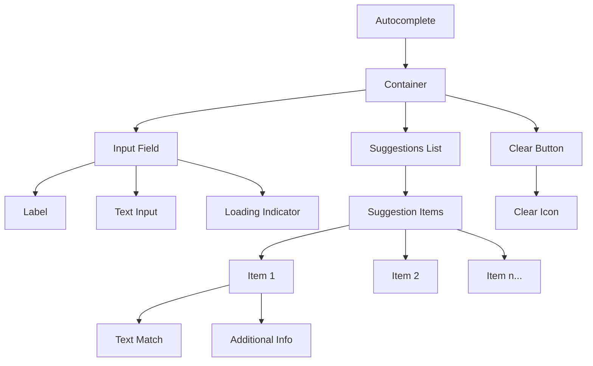

**_(Also called Autosuggest)_**

<PatternStats
  popularity="high"
/>

<PatternPreview />

## Overview

**Autocomplete** helps users quickly find and select values from predefined options as they type.

Autocomplete combines [text input](/patterns/forms/text-field) flexibility with dropdown-style selection, providing real-time suggestions matching user input. This pattern reduces errors, speeds data entry, and improves form completion.

<BuildEffort
  level="medium"
  description="Requires live filtering, real-time suggestion updates, keyboard navigation, and screen reader compatibility using ARIA attributes."
/>

## Use Cases

### When to use:

- Users select from large sets of predefined options (country selection, airport codes)
- Users need faster option selection than scrolling through long dropdowns
- Reducing errors by guiding users to valid input options
- Input has finite, known valid responses
- Combining free text input with suggestion functionality

### When not to use:

- Fewer than 10 options exist (use standard dropdown/select instead)
- Users enter completely free-form text without restrictions
- All options need simultaneous visibility for comparison
- Network latency significantly delays suggestion results
- Input field requires exact, verbatim text entry (passwords)

### Common scenarios and examples

- **Product search** in e-commerce catalogs
- **City name entry** for travel or weather applications
- **User or contact lookup** in messaging or collaboration tools

<PatternComparison
  current="Autocomplete"
  alternatives={[
    {
      name: "Text Field",
      path: "/patterns/forms/text-field",
      when: "users need complete freedom in their input without suggestions",
      pros: ["Simple implementation", "No constraints", "Works offline"],
      cons: ["No guidance", "More typing errors", "Slower input"]
    },
    {
      name: "Multi-Select",
      path: "/patterns/forms/multi-select-input",
      when: "users need to select multiple items from a predefined list",
      pros: ["Multiple selections", "Clear options", "Visual feedback"],
      cons: ["Takes more space", "Not for single selection", "Complex for many options"]
    },
    {
      name: "Date Picker",
      path: "/patterns/forms/date-picker",
      when: "users need to select dates with calendar visualization",
      pros: ["Visual calendar", "Date validation", "Range selection"],
      cons: ["Only for dates", "More complex UI", "Mobile space issues"]
    }
  ]}
/>

## Benefits

- **Faster data entry** through real-time option narrowing
- **Less user frustration** with guided valid options
- **Fewer mistakes** and typos using confirmed suggestions from lists

## Drawbacks

- **Accessibility challenges** – Needs proper ARIA attributes (`aria-expanded`, `aria-controls`, `aria-activedescendant`) for screen readers
- **Keyboard navigation complexity** – Users navigate suggestions with arrow keys and select with Enter
- **Performance issues** – Dynamic suggestion fetching introduces lag without debouncing and caching
- **User overwhelm** – Too many suggestions or unclear results create cognitive overload
- **Implementation effort** – Must handle filtering logic and suggestion visibility management

## Anatomy

### Component Structure



1. **Container**

- Wraps entire autocomplete area including input and dropdown
- Handles positioning, sizing, and floating layers for suggestions

2. **Input**

- Text field for user queries
- Gives real-time updates and triggers suggestion fetching

3. **Label**

- Optional label describing input purpose
- Clarifies for screen readers and provides visible context

4. **Clear Button**

- Quick input field clearing
- Usually shows as "X" or "✕" icon

## Best Practices

### Content

**Do's ✅**

- Provide a descriptive label that indicates the purpose of the Autocomplete field
- Use placeholder text to show example input (e.g., "Start typing a country...")

**Don'ts ❌**

- Don't rely on placeholder text as a replacement for a label
- Don't make your suggestions so vague that it's unclear what the user is selecting

### Accessibility

**Do's ✅**

- Use `aria-controls`, `aria-autocomplete`, and other relevant ARIA attributes to help screen readers
- Include a visually hidden label or descriptive text if you rely on an icon-only clear button
- Add a debounce delay to the input field to avoid triggering a fetch request too often

**Don'ts ❌**

- Don't remove focus outlines without providing alternative focus indicators
- Don't assume all users can use a mouse; ensure keyboard navigation works properly

### Visual Design

**Do's ✅**

- Keep the suggestion list clearly delineated, with sufficient contrast and spacing
- Highlight hovered or focused suggestion items with a distinct visual state

**Don'ts ❌**

- Don't display an overly large list of suggestions (limit it to a reasonable number), use a scroll bar to allow users to scroll through the list.
- Don't create a cluttered or confusing interface by mixing too many design elements

### Layout & Positioning

**Do's ✅**

- Position the dropdown list immediately below the input field
- Ensure suggestions list appears in front of other page elements when open

**Don'ts ❌**

- Don't hide the list behind overlays or modals
- Don't move the dropdown to a completely different area away from the input

## Code Examples

### Basic Implementation

```html
<!-- Basic Autocomplete Markup -->
<div>
  <label for="autocompleteInput">Search for an option</label>
  <input
    type="text"
    id="autocompleteInput"
    name="autocompleteInput"
    aria-autocomplete="list"
    aria-controls="suggestions-list"
    autocomplete="off"
    placeholder="Type to search..."
  />
  <button type="button" aria-label="Clear input">✕</button>
  <ul id="suggestions-list" role="listbox">
    <!-- Dynamically generated suggestions go here -->
  </ul>
</div>
```

## Design Tokens

These [design tokens](/glossary/design-tokens) follow the [Design Tokens Format](https://design-tokens.github.io/community-group/format/) specification and can be used with various token transformation tools to generate platform-specific variables.

### Autocomplete Tokens in DTF Format

```json
{
  "$schema": "https://design-tokens.org/schema.json",
  "Autocomplete": {
    "container": {
      "borderRadius": {
        "value": "0.25rem",
        "type": "dimension"
      },
      "background": {
        "value": "{color.white}",
        "type": "color"
      }
    },
    "input": {
      "fontSize": {
        "value": "1rem",
        "type": "dimension"
      },
      "padding": {
        "value": "0.5rem",
        "type": "dimension"
      }
    },
    "suggestionsList": {
      "maxHeight": {
        "value": "200px",
        "type": "dimension"
      },
      "background": {
        "value": "{color.gray.50}",
        "type": "color"
      },
      "itemHoverBg": {
        "value": "{color.gray.100}",
        "type": "color"
      }
    }
  }
}
```

## Frequently Asked Questions

<FaqStructuredData
  items={[
    {
      question: "What is autocomplete in web design?",
      answer:
        "Autocomplete is a user interface feature that predicts and displays suggestions as a user types into an input field, helping them complete their input more efficiently.",
    },
    {
      question: "When should I use autocomplete?",
      answer:
        "Autocomplete is beneficial when users need to input data that can be predicted or matched from a known set of options, such as search queries, addresses, or product names.",
    },
    {
      question: "How can I make an autocomplete feature accessible?",
      answer:
        "Ensure the input field is focusable and supports keyboard navigation. Use ARIA roles and properties like `aria-autocomplete` and `aria-expanded` to convey the state to assistive technologies.",
    },
    {
      question: "What are the benefits of using autocomplete?",
      answer:
        "Autocomplete enhances user experience by reducing typing effort, minimizing errors, and providing faster access to relevant information.",
    },
    {
      question:
        "What are common mistakes to avoid when implementing autocomplete?",
      answer:
        "Avoid overwhelming users with too many suggestions, neglecting accessibility considerations, and providing irrelevant or poorly ranked suggestions.",
    },
  ]}
/>

## Related Patterns

<RelatedPatternsCard category="forms" />

## Resources

### Articles

- [9 UX Best Practice Design Patterns for Autocomplete Suggestions](https://baymard.com/blog/autocomplete-design) by Baymard Institute
- [Best Practices: Designing autosuggest experiences](https://uxmag.com/articles/best-practices-designing-autosuggest-experiences)

## Documentation

- [WAI-ARIA: Combobox Pattern](https://www.w3.org/WAI/ARIA/apg/patterns/combobox/)
