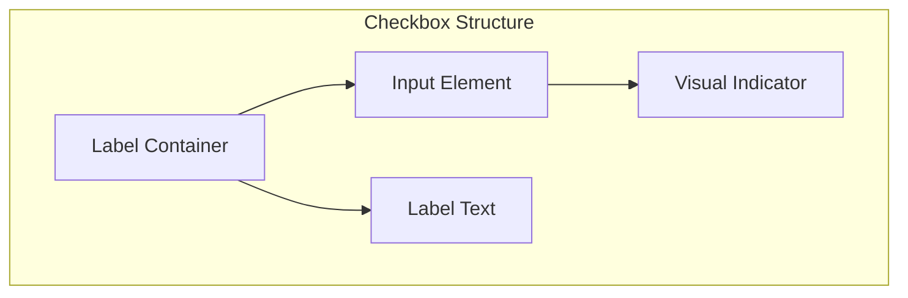

import { Playground } from "@/components/playground";
import { GuidesBanner } from "@/components/guides-banner";

**_(Also called tick box, selection box)_**

<PatternStats
  popularity="high"
/>

## Overview

A **checkbox** is a form control that allows users to select one or more options from a set of choices. Unlike radio buttons, checkboxes enable **multiple selections** and can be used independently or as part of a group.

Checkboxes are essential for forms, settings panels, and any interface where users need to make multiple selections or toggle individual options on and off.

<BuildEffort
  level="low"
  description="Native HTML input with optional styling enhancements. Requires proper labeling, keyboard navigation, and ARIA attributes for accessibility."
/>

<GuidesBanner
  title="Checkbox vs Radio vs Dropdown?"
  description="Compare selection patterns to make the right choice"
  guidePath="/pattern-guide/input-selection-guide"
/>

## Use Cases

### When to use:

Use checkboxes when you need users to make **multiple selections** from a set of options.

**Common scenarios include:**

- **Form preferences** – Newsletter subscriptions, communication preferences, terms acceptance
- **Filter selections** – Product categories, price ranges, features in e-commerce
- **Settings toggles** – Privacy options, notification preferences, feature enablement
- **Multi-select lists** – Adding items to cart, selecting files for upload, choosing recipients
- **Agreement checkboxes** – Terms of service, privacy policy, age verification
- **Feature selection** – Choosing add-ons, selecting services, picking options

### When not to use:

- **For single selections** – Use [radio buttons](/patterns/forms/radio) instead
- **For binary on/off states** – Use [toggle switches](/patterns/forms/toggle) for settings
- **When space is limited** – Consider [dropdowns](/patterns/forms/selection-input) for many options
- **For immediate actions** – Use [buttons](/patterns/forms/button) for instant responses
- **When options are mutually exclusive** – Radio buttons are more appropriate

<PatternComparison
  current="Checkbox"
  alternatives={[
    {
      name: "Radio Button",
      path: "/patterns/forms/radio",
      when: "only one option can be selected",
      pros: ["Clear single selection", "Mutually exclusive", "Less cognitive load"],
      cons: ["No multiple selection", "More space needed", "Not for independent options"]
    },
    {
      name: "Toggle Switch",
      path: "/patterns/forms/toggle",
      when: "binary on/off states or settings",
      pros: ["Clear state indication", "Immediate feedback", "Space efficient"],
      cons: ["Only binary states", "Not for multiple options", "Different mental model"]
    },
    {
      name: "Multi-select Dropdown",
      path: "/patterns/forms/multi-select-input",
      when: "many options with limited space",
      pros: ["Space efficient", "Searchable", "Handles large lists"],
      cons: ["Hidden options", "More complex interaction", "Less discoverable"]
    }
  ]}
/>

## Benefits

- **Enables multiple selections** from a set of options without restrictions
- **Provides clear visual feedback** with checked/unchecked states
- **Supports independent selections** where each option can be chosen separately
- **Familiar interaction pattern** that users understand intuitively
- **Accessible by default** with proper HTML implementation and keyboard support
- **Flexible grouping** allows for both individual and grouped checkbox behaviors

## Drawbacks

- **Can become overwhelming** with too many options (consider [pagination](/patterns/navigation/pagination) or grouping)
- **Takes more vertical space** compared to dropdown alternatives
- **Requires scrolling** for long lists of options
- **May cause decision fatigue** when presented with too many choices
- **Can be accidentally unchecked** if not properly designed with confirmation

## Anatomy



### Component Structure

1. **Input Element**
   - Native HTML `<input type="checkbox">` element
   - Handles the actual form data and state
   - Should have unique `id` and `name` attributes
   - Requires proper `value` attribute for form submission

2. **Visual Indicator**
   - Custom styled checkbox appearance (replaces browser default)
   - Shows checked, unchecked, and indeterminate states
   - Should maintain sufficient contrast and touch target size
   - Includes focus and hover states for better UX

3. **Label Element**
   - Associated with the input via `for` attribute or wrapping
   - Provides accessible text description
   - Should be descriptive and action-oriented
   - Can include additional context or help text

4. **Container (Optional)**
   - Groups related checkboxes together
   - Provides consistent spacing and alignment
   - Can include fieldset/legend for form organization
   - Handles layout and responsive behavior

#### Summary of Components

| Component       | Required? | Purpose                         | Notes                |
| --------------- | --------- | ------------------------------- | -------------------- |
| Input Element   | Yes       | Core functionality and data     | Native HTML input    |
| Visual Indicator| Yes       | User-visible checkbox appearance| Custom styled        |
| Label           | Yes       | Accessible text description     | Must be associated   |
| Container       | No        | Groups and layouts checkboxes   | Improves organization|

## Best Practices

### Content
**Do's ✅**
- **Use clear, descriptive labels** that explain what the checkbox does
- **Group related options** logically with proper headings or sections
- **Provide helpful context** when the purpose isn't immediately clear
- **Use consistent terminology** across all checkbox labels in a form

**Don'ts ❌**
- **Don't use vague labels** like "Yes" or "No" without context
- **Avoid technical jargon** that users might not understand
- **Don't make labels too long** - keep them concise but descriptive
- **Avoid negative phrasing** that can confuse users

### Accessibility
**Do's ✅**
- **Associate labels properly** using `for` attribute or wrapping
- **Provide keyboard navigation** support (Tab, Space, Enter)
- **Use proper ARIA attributes** like `aria-describedby` for additional context
- **Ensure sufficient color contrast** for all states (checked, unchecked, focus)
- **Support screen readers** with proper semantic markup

**Don'ts ❌**
- **Don't rely solely on color** to indicate state changes
- **Avoid removing focus indicators** without providing alternatives
- **Don't use checkboxes for actions** - use buttons instead
- **Avoid auto-checking** without user consent

### Visual Design
**Do's ✅**
- **Maintain consistent sizing** across all checkboxes (minimum 44x44px touch target)
- **Use clear visual hierarchy** with proper spacing between options
- **Provide immediate visual feedback** for all interaction states
- **Ensure the design scales** properly on different screen sizes
- **Use appropriate visual weight** that matches the importance of the option

**Don'ts ❌**
- **Don't make checkboxes too small** for touch interaction
- **Avoid inconsistent styling** across different checkbox groups
- **Don't use confusing icons** that don't clearly indicate selection state
- **Avoid poor contrast** that makes states hard to distinguish

### Layout & Positioning
**Do's ✅**
- **Align checkboxes consistently** (usually left-aligned with labels)
- **Provide adequate spacing** between options for easy selection
- **Group related options** visually with spacing or containers
- **Ensure responsive behavior** on mobile devices
- **Maintain logical tab order** for keyboard navigation

**Don'ts ❌**
- **Don't crowd options** too close together
- **Avoid inconsistent alignment** that creates visual confusion
- **Don't break the layout** on smaller screens
- **Avoid placing checkboxes** where they might be accidentally triggered

## Checkbox Variations

### Standard Checkbox
Basic checkbox for individual selections with clear labels and proper spacing.

### Grouped Checkboxes
Multiple related options grouped together with a common heading or fieldset.

### Indeterminate Checkbox
Shows a third state (partially selected) for parent checkboxes that control child options.

### Inline Checkboxes
Compact checkboxes arranged horizontally for space-constrained layouts.

### Toggle Checkboxes
Checkboxes styled to look like toggle switches while maintaining checkbox behavior.

## Examples

### Interactive Demo

<Playground
  patternType="forms"
  pattern="checkbox"
  example="basic"
  height="600px"
/>

This example demonstrates:
- Multiple checkbox selections
- Proper labeling and accessibility
- Different states (checked, unchecked, disabled)
- Grouped and individual checkbox behaviors
- Keyboard navigation support

### Advanced Demo

<Playground
  patternType="forms"
  pattern="checkbox"
  example="advanced"
  height="700px"
/>

This advanced example shows:
- Indeterminate state handling
- Dynamic checkbox groups
- Form validation with checkboxes
- Custom styling and animations

### Basic Implementation

```html
<!-- Basic checkbox with label -->
<div class="checkbox-container">
  <input type="checkbox" id="newsletter" name="preferences" value="newsletter">
  <label for="newsletter">Subscribe to newsletter</label>
</div>

<!-- Grouped checkboxes with fieldset -->
<fieldset>
  <legend>Communication Preferences</legend>
  <div class="checkbox-group">
    <input type="checkbox" id="email" name="communication" value="email">
    <label for="email">Email notifications</label>

    <input type="checkbox" id="sms" name="communication" value="sms">
    <label for="sms">SMS notifications</label>

    <input type="checkbox" id="push" name="communication" value="push">
    <label for="push">Push notifications</label>
  </div>
</fieldset>
```

## Common Mistakes & Anti-Patterns 🚫

### **Using Checkboxes for Single Selection**
**The Problem:**
Using checkboxes when only one option should be selectable confuses users about the interaction model.

**How to Fix It?**
Use radio buttons for mutually exclusive options, checkboxes only for multiple selections.

---

### **Poor Label Association**
**The Problem:**
Checkboxes without proper labels are inaccessible and confusing for users.

**How to Fix It?**
Always associate labels using `for` attribute or wrap the input in a label element.

---

### **Inconsistent Grouping**
**The Problem:**
Related checkboxes scattered without visual grouping makes the form hard to understand.

**How to Fix It?**
Group related options using fieldsets, containers, or visual spacing to show relationships.

---

### **Too Many Options**
**The Problem:**
Presenting 20+ checkbox options at once overwhelms users and causes decision fatigue.

**How to Fix It?**
Limit to 7-10 options, use progressive disclosure, or consider alternative patterns like multi-select dropdowns.

---

### **Missing Indeterminate State**
**The Problem:**
Parent checkboxes that control child options don't show partial selection state.

**How to Fix It?**
Implement indeterminate state for parent checkboxes using `indeterminate` property and proper styling.

---

### **Inadequate Touch Targets**
**The Problem:**
Checkboxes smaller than 44x44px are difficult to tap on mobile devices.

**How to Fix It?**
Ensure minimum touch target size and consider expanding the clickable area beyond the visual checkbox.

## Performance

### Performance Metrics

**Target Metrics:**
- **Render Time**: < 16ms for checkbox state changes
- **Bundle Size**: < 2KB for basic checkbox implementation
- **Memory Usage**: Minimal impact for standard checkbox groups
- **Accessibility**: 100% keyboard navigable, screen reader compatible

**Optimization Strategies:**
- **Event Delegation**: Use single event listener for checkbox groups
- **Lazy Rendering**: Only render visible checkboxes in long lists
- **Debounced Updates**: Prevent excessive re-renders during rapid selection
- **Virtual Scrolling**: For very large checkbox lists (100+ items)

**Mobile Performance:**
- **Touch Optimization**: 44x44px minimum touch targets
- **Reduced Motion**: Respect `prefers-reduced-motion` for animations
- **Progressive Enhancement**: Core functionality works without JavaScript

## Tracking

Tracking checkbox interactions helps measure their effectiveness, determine whether users find them useful, and identify potential usability issues. By analyzing checkbox engagement, we can assess whether checkboxes enhance form completion or if users find them confusing.

### Key Tracking Points

Each checkbox interaction provides valuable insights into user behavior. Below are the key events that should be tracked:

| **Event Name**             | **Description**                                                       | **Why Track It?**                                   |
| -------------------------- | --------------------------------------------------------------------- | --------------------------------------------------- |
| `checkbox.select`          | When a user selects a checkbox option.                                | Determines which options are most popular.          |
| `checkbox.deselect`        | When a user unchecks a previously selected checkbox.                  | Helps identify confusing or unnecessary options.    |
| `checkbox.group_complete`  | When a user completes a checkbox group (selects required options).    | Measures form completion rates.                     |
| `checkbox.validation_error`| When a user submits a form with missing required checkboxes.          | Identifies validation issues and UX problems.       |
| `checkbox.abandon`         | When a user leaves a form without completing checkbox sections.       | Tracks where users drop off in multi-step forms.    |
| `checkbox.interaction_time`| The time a user spends on checkbox sections before proceeding.        | Helps determine if checkbox groups are too complex. |

### Event Payload Structure

To ensure consistent tracking, here's a recommended event format:

```json
{
  "event": "checkbox.select",
  "properties": {
    "checkbox_id": "newsletter_subscription",
    "checkbox_group": "communication_preferences",
    "form_id": "user_registration",
    "interaction_time": 1.2 // in seconds
  }
}
```

### Key Metrics to Analyze

Once tracking is in place, the following metrics provide actionable insights:

- Checkbox Selection Rate → Percentage of users who select each checkbox option.
- Group Completion Rate → Percentage of users who complete checkbox groups.
- Validation Error Rate → Frequency of required checkbox validation failures.
- Abandonment Rate → Where users stop in forms with checkbox sections.
- Average Interaction Time → How long users spend on checkbox groups.

### Insights & Optimization Based on Tracking

By analyzing tracking data, we can optimize checkbox behavior:

- 🚨 **Low Selection Rates?**
  → Users might not understand the checkbox options or find them unnecessary.
  **Optimization:** Improve label clarity, add helpful descriptions, or remove unused options.

- ⏳ **High Abandonment Rate?**
  → Checkbox groups might be overwhelming or confusing users.
  **Optimization:** Simplify options, use progressive disclosure, or break large groups into smaller sections.

- 📉 **High Validation Error Rate?**
  → Required checkboxes might not be clearly indicated or users don't understand requirements.
  **Optimization:** Improve required field indicators, add clearer instructions, or reconsider which fields are truly required.

- 🎯 **Long Interaction Times?**
  → Checkbox groups might be too complex or have too many options.
  **Optimization:** Reduce the number of options, improve grouping, or add search/filter functionality.

- 🔄 **Frequent Deselection?**
  → Users might be selecting options by mistake or changing their minds.
  **Optimization:** Improve option clarity, add confirmation for important selections, or provide better default states.

By continuously monitoring these metrics, we can refine checkbox usability and ensure they provide **real value** rather than unnecessary friction.

## Localization

### Text Direction (RTL/LTR)
- **Layout Mirroring**: Flip checkbox alignment for RTL languages
- **Label Positioning**: Adjust label placement based on language direction
- **Group Alignment**: Ensure checkbox groups align properly in RTL layouts

### Content Considerations
- **Text Expansion**: Allow 30-50% extra space for translations
- **Character Sets**: Support Unicode for all languages
- **Font Selection**: Use system fonts that support target languages

### Dynamic Content
- **Number Formatting**: Respect locale-specific number formats
- **Date/Time**: Use locale-appropriate date formatting
- **Currency**: Display currency symbols correctly by locale

## Accessibility

### ARIA Attributes

**Required ARIA attributes:**
- `aria-describedby`: Link to additional help text
- `aria-required`: For required checkbox fields
- `aria-invalid`: When validation fails
- `aria-expanded`: For collapsible checkbox groups

### Keyboard Interaction Pattern

The following table outlines the standard keyboard interactions for checkbox components.

| Key           | Action                                                                |
| ------------- | --------------------------------------------------------------------- |
| Tab           | Move focus to next interactive element                               |
| Shift + Tab   | Move focus to previous interactive element                           |
| Space         | Toggle checkbox state (checked/unchecked)                            |
| Enter         | Toggle checkbox state (alternative to Space)                         |
| Arrow Keys    | Navigate between grouped checkboxes (if implemented)                 |

### Screen Reader Support

- **State Announcement**: Screen readers announce "checked" or "unchecked"
- **Group Context**: Use fieldsets and legends for grouped checkboxes
- **Additional Context**: Provide `aria-describedby` for complex options
- **Error States**: Announce validation errors clearly

## SEO Considerations

- **Form Structure**: Use semantic HTML with proper form elements
- **Label Content**: Include relevant keywords in checkbox labels
- **Schema Markup**: Use structured data for form elements when appropriate
- **Progressive Enhancement**: Ensure core functionality works without JavaScript

## Testing Guidelines

### Functional Testing

**Should ✓**

- [ ] Checkboxes **toggle correctly on click, tap, and keyboard interaction**.
- [ ] Multiple selections work as expected **without interfering with each other**.
- [ ] Form submission **includes all selected checkbox values** in the correct format.
- [ ] Validation works properly for **required checkbox groups**.
- [ ] Disabled state **prevents all interaction** and is visually distinct.
- [ ] Indeterminate state **displays correctly** for parent checkboxes.
- [ ] Checkbox groups **maintain proper state consistency**.
- [ ] Custom styling **doesn't break core functionality**.

### Accessibility Testing

**Should ✓**

- [ ] Ensure checkboxes are **keyboard accessible** (Space key toggles state).
- [ ] Verify that checkboxes are **announced by screen readers** with current state.
- [ ] Confirm `aria-describedby` **correctly links labels to checkboxes**.
- [ ] Check that checkbox groups have **proper fieldset and legend structure**.
- [ ] Ensure **sufficient color contrast** between checkbox elements and background.
- [ ] Test with screen readers (NVDA, JAWS, VoiceOver) for **proper announcements**.
- [ ] Validate that **focus indicators are clearly visible**.
- [ ] Test with voice control software for **proper activation**.

### Visual Testing

**Should ✓**

- [ ] Confirm checkbox labels are **legible across all screen sizes**.
- [ ] Validate **proper spacing and alignment** of checkbox groups.
- [ ] Test checkbox animations for **smooth state transitions**.
- [ ] Ensure checkboxes **do not overlap or interfere with other elements**.
- [ ] Verify checkboxes **align properly with their labels**.
- [ ] Test custom styling **maintains visual consistency** across browsers.
- [ ] Validate **touch target sizes meet minimum requirements** (44x44px).

### Performance Testing

**Should ✓**

- [ ] Measure checkbox interaction performance to **avoid jank or slow responses**.
- [ ] Ensure large checkbox groups **render efficiently** without performance degradation.
- [ ] Optimize checkbox animations to **use efficient CSS properties**.
- [ ] Test for **efficient event handling** in checkbox groups with many items.
- [ ] Validate that **form submission performance** isn't impacted by checkbox count.

### Cross-Browser Testing

**Should ✓**

- [ ] Test checkbox functionality **across all supported browsers**.
- [ ] Verify custom styling **renders consistently** across different browsers.
- [ ] Ensure **keyboard navigation works** in all target browsers.
- [ ] Test **touch interactions** on mobile devices and tablets.
- [ ] Validate **screen reader compatibility** across different assistive technologies.

## Browser Support

<BrowserSupport
  features={[
    "html.forms.checkbox",
    "css.selectors.checked",
    "css.properties.appearance"
  ]}
/>

**Polyfills Required:**
- Custom styling for older browsers
- Indeterminate state support for IE
- Focus management for complex interactions

## Design Tokens

These design tokens follow the [Design Tokens Format](https://design-tokens.github.io/community-group/format/) specification and can be used with various token transformation tools to generate platform-specific variables.

```json
{
  "$schema": "https://design-tokens.org/schema.json",
  "checkbox": {
    "size": { "value": "18px", "type": "dimension" },
    "borderRadius": { "value": "2px", "type": "borderRadius" },
    "borderWidth": { "value": "2px", "type": "dimension" },
    "colors": {
      "border": { "value": "{color.gray.400}", "type": "color" },
      "borderChecked": { "value": "{color.primary.500}", "type": "color" },
      "background": { "value": "{color.white}", "type": "color" },
      "backgroundChecked": { "value": "{color.primary.500}", "type": "color" },
      "checkmark": { "value": "{color.white}", "type": "color" }
    },
    "spacing": {
      "labelGap": { "value": "8px", "type": "dimension" },
      "groupGap": { "value": "12px", "type": "dimension" }
    },
    "states": {
      "focus": {
        "outlineWidth": { "value": "2px", "type": "dimension" },
        "outlineColor": { "value": "{color.primary.500}", "type": "color" }
      },
      "disabled": {
        "opacity": { "value": "0.5", "type": "number" }
      }
    }
  }
}
```

## Frequently Asked Questions

<FaqStructuredData
  items={[
    {
      question: "When should I use checkboxes vs radio buttons?",
      answer: "Use checkboxes when users can select multiple options from a set. Use radio buttons when only one option can be selected from a group of mutually exclusive choices.",
    },
    {
      question: "How do I make checkboxes accessible?",
      answer: "Ensure proper label association using the 'for' attribute or by wrapping the input in a label element. Provide keyboard navigation support and use appropriate ARIA attributes for complex scenarios.",
    },
    {
      question: "What's the difference between checkboxes and toggle switches?",
      answer: "Checkboxes are for selecting options from a list, while toggle switches are for binary on/off states or settings. Toggle switches provide immediate feedback and are better for settings panels.",
    },
    {
      question: "How many checkboxes should I show at once?",
      answer: "Limit to 7-10 options to avoid overwhelming users. For more options, consider grouping, progressive disclosure, or alternative patterns like multi-select dropdowns.",
    },
    {
      question: "Should I pre-select any checkboxes?",
      answer: "Only pre-select options when you're confident most users want them selected. Always allow users to easily change pre-selected options and be transparent about what's selected by default.",
    },
  ]}
/>

## Related Patterns

<RelatedPatternsCard
  patterns={[
    {
      title: "Radio Button",
      path: "/patterns/forms/radio",
      description: "Use for single selection from multiple options",
    },
    {
      title: "Toggle Switch",
      path: "/patterns/forms/toggle",
      description: "Use for binary on/off states with immediate effect",
    },
    {
      title: "Multi-Select",
      path: "/patterns/forms/multi-select-input",
      description: "Use when space is limited and many options need to be presented",
    },
    {
      title: "Form Validation",
      path: "/patterns/forms/form-validation",
      description: "Use to ensure checkbox selections meet requirements",
    },
  ]}
/>

## Resources

### Libraries & Frameworks

#### React Components
- [React Hook Form](https://react-hook-form.com/) – Performant forms with easy validation
- [Formik](https://formik.org/) – Popular form library with checkbox support

#### Vue Components
- [Vue Formulate](https://vueformulate.com/) – Form builder with checkbox components
- [VeeValidate](https://vee-validate.logaretm.com/) – Validation library for Vue forms

#### Vanilla JavaScript
- [Choices.js](https://github.com/Choices-js/Choices) – Lightweight select/multi-select library

### Articles

- [Checkboxes vs. Radio Buttons](https://www.nngroup.com/articles/checkboxes-vs-radio-buttons/) by Nielsen Norman Group
- [Designing Efficient Web Forms: On Structure, Inputs, Labels And Actions](https://www.smashingmagazine.com/2017/06/designing-efficient-web-forms/) by Smashing Magazine

### Documentation

- [MDN Checkbox Input](https://developer.mozilla.org/en-US/docs/Web/HTML/Element/input/checkbox)
