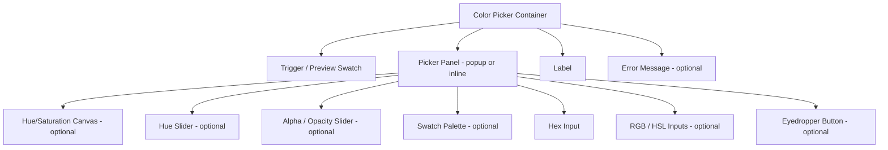

## Overview

A **Color Picker** is a form input component that allows users to select a color value through visual interaction. It may be implemented as a native browser control (`<input type="color">`), a custom swatch palette, a hex/RGB/HSL text input, a gradient spectrum canvas, or an eyedropper tool — or any combination of these.

Color pickers are used wherever users need to choose or define colors: theme customization, design tools, annotation systems, data visualization category assignment, and product personalization.

<BuildEffort
  level="high"
  description="Full custom implementation requires canvas-based hue/saturation pickers, hex/RGB parsing, eyedropper API integration, and accessible keyboard navigation through swatches."
/>

## Use Cases

### When to use:

- **Theme and brand customization** – Let users choose accent colors for their dashboard or profile.
- **Design and creative tools** – Drawing apps, slide editors, diagramming tools.
- **Data visualization** – Assigning colors to categories in charts.
- **Product configuration** – Choosing product color variants before purchase.
- **Annotation and markup** – Highlight or pen color selection in document editors.

### When not to use:

- **When colors are fixed options** – Use a swatch selector or radio buttons with color swatches instead.
- **When the exact color value doesn't matter to the user** – A simpler categorical selector ("Red", "Blue", "Green") reduces cognitive load.
- **In mobile-primary, simple forms** – Native `<input type="color">` may be sufficient; avoid heavy custom UIs on small screens.
- **When accessibility is paramount** – Custom color pickers require significant a11y investment; evaluate whether simpler alternatives meet the need.

<PatternComparison
  current="Color Picker"
  alternatives={[
    {
      name: "Swatch Selector",
      path: "/patterns/forms/selection-input",
      when: "colors are predefined from a fixed palette",
      pros: ["Simple", "Fast selection", "Brand-consistent", "Accessible"],
      cons: ["No custom colors", "Limited variety", "Requires predefined values"]
    },
    {
      name: "Text Field",
      path: "/patterns/forms/text-field",
      when: "users enter exact hex or RGB values directly",
      pros: ["Precise input", "Simple implementation", "Keyboard-friendly"],
      cons: ["No visual feedback", "Requires color knowledge", "Error-prone entry"]
    },
    {
      name: "Dropdown / Select",
      path: "/patterns/forms/selection-input",
      when: "choosing from a small named set of colors (< 10 options)",
      pros: ["Accessible by default", "Simple", "Named options are clear"],
      cons: ["No visual preview in most implementations", "Not for large palettes"]
    }
  ]}
/>

## Benefits

- **Visual feedback** – Users see the color they're selecting in real time.
- **Precise control** – Hex/RGB/HSL inputs allow exact color specification.
- **Flexible input methods** – Supports swatches, spectrum, and direct value entry.
- **Native browser option** – `<input type="color">` provides a zero-JS baseline.
- **Eyedropper integration** – Modern browsers support the EyeDropper API for picking screen colors.

## Drawbacks

- **Complex implementation** – Full custom pickers require canvas rendering and color math.
- **Accessibility challenges** – Color-blind users may struggle; screen readers need descriptive labels.
- **Mobile UX tradeoffs** – Fine-grained pickers are difficult to use on small touch screens.
- **Color space confusion** – Users may not understand hex vs RGB vs HSL notation.
- **Browser inconsistency** – Native `<input type="color">` varies widely across browsers.

## Anatomy



### Component Structure

1. **Container**

   - Wraps the trigger and popup/panel.
   - Manages open/closed state and positions the panel.

2. **Label**

   - Describes what the color value represents (e.g., "Accent color", "Background").
   - Associated with the hidden/text input via `for`.

3. **Trigger / Preview Swatch**

   - A colored button showing the currently selected color.
   - Opens the picker panel on click.
   - Must be keyboard-focusable and operable via `Enter`/`Space`.

4. **Picker Panel (popup or inline)**

   - Contains the color selection controls.
   - As a popup, should use `role="dialog"` with a descriptive `aria-label`.

5. **Hue/Saturation Canvas (optional)**

   - A 2D canvas for selecting saturation (X axis) and lightness/value (Y axis).
   - Requires mouse/touch drag and keyboard arrow-key navigation.

6. **Hue Slider (optional)**

   - A horizontal or circular slider to select the base hue (0–360°).

7. **Alpha Slider (optional)**

   - Controls opacity (0–100%).
   - Often displayed over a checkerboard pattern to indicate transparency.

8. **Swatch Palette (optional)**

   - A grid of predefined colors for quick selection.
   - Most common implementation; accessible with arrow-key grid navigation.

9. **Hex/RGB/HSL Input**

   - Text input for direct value entry.
   - Should update the picker visually when values change.

10. **Eyedropper Button (optional)**
    - Invokes the EyeDropper API to pick any color from the screen.
    - Should be hidden/disabled on unsupported browsers.

#### Summary of Components

| Component            | Required? | Purpose                                       |
| -------------------- | --------- | --------------------------------------------- |
| Label                | ✅ Yes    | Identifies the color control purpose          |
| Trigger/Swatch       | ✅ Yes    | Shows current color and opens picker          |
| Hex Input            | ✅ Yes    | Allows precise color entry and display        |
| Swatch Palette       | ❌ No     | Quick selection from predefined colors        |
| Hue/Saturation Canvas| ❌ No     | Full spectrum color selection                 |
| Alpha Slider         | ❌ No     | Opacity control                               |
| Eyedropper Button    | ❌ No     | Screen color sampling                         |

## Variations

### Native Color Input

Simplest implementation using the browser's built-in color picker.

```html
<div class="color-picker">
  <label for="brand-color">Brand Color</label>
  <input
    type="color"
    id="brand-color"
    name="brand-color"
    value="#3b82f6"
    aria-describedby="brand-color-help"
  />
  <p id="brand-color-help" class="color-picker__help">
    Selected: <span id="brand-color-value">#3b82f6</span>
  </p>
</div>

<script>
  const input = document.getElementById('brand-color');
  const valueDisplay = document.getElementById('brand-color-value');
  input.addEventListener('input', () => {
    valueDisplay.textContent = input.value;
  });
</script>
```

### Swatch Palette

Grid of predefined colors for quick brand-consistent selection.

```html
<div class="color-picker">
  <label id="palette-label">Choose a highlight color</label>
  <div
    class="color-picker__swatches"
    role="radiogroup"
    aria-labelledby="palette-label"
  >
    <label class="color-picker__swatch-label">
      <input type="radio" name="highlight" value="#ef4444" class="sr-only" />
      <span
        class="color-picker__swatch"
        style="background-color: #ef4444"
        aria-label="Red"
      ></span>
    </label>
    <label class="color-picker__swatch-label">
      <input type="radio" name="highlight" value="#3b82f6" class="sr-only" />
      <span
        class="color-picker__swatch"
        style="background-color: #3b82f6"
        aria-label="Blue"
      ></span>
    </label>
    <label class="color-picker__swatch-label">
      <input type="radio" name="highlight" value="#22c55e" class="sr-only" />
      <span
        class="color-picker__swatch"
        style="background-color: #22c55e"
        aria-label="Green"
      ></span>
    </label>
  </div>
</div>
```

### With Hex Input

Swatch palette combined with a hex text input for custom colors.

```html
<div class="color-picker">
  <label for="custom-color">Custom color</label>
  <div class="color-picker__row">
    <button
      type="button"
      class="color-picker__trigger"
      style="background-color: #3b82f6"
      aria-label="Open color picker. Current color: #3b82f6"
      aria-haspopup="dialog"
    ></button>
    <input
      type="text"
      id="custom-color"
      class="color-picker__hex-input"
      value="#3b82f6"
      pattern="^#[0-9A-Fa-f]{6}$"
      maxlength="7"
      aria-label="Hex color value"
      spellcheck="false"
      autocomplete="off"
    />
  </div>
</div>
```

### With Eyedropper

Advanced version with screen color sampling on supported browsers.

```html
<div class="color-picker">
  <label for="sampled-color">Page color</label>
  <div class="color-picker__row">
    <input type="text" id="sampled-color" value="#3b82f6" class="color-picker__hex-input" />
    <button
      type="button"
      id="eyedropper-btn"
      class="color-picker__eyedropper"
      aria-label="Pick a color from the screen"
    >
      <!-- eyedropper icon -->
    </button>
  </div>
</div>

<script>
  const btn = document.getElementById('eyedropper-btn');
  const input = document.getElementById('sampled-color');

  if (!('EyeDropper' in window)) {
    btn.hidden = true;
  }

  btn.addEventListener('click', async () => {
    try {
      const eyeDropper = new EyeDropper();
      const result = await eyeDropper.open();
      input.value = result.sRGBHex;
      input.dispatchEvent(new Event('input'));
    } catch (err) {
      // User cancelled or API unavailable
    }
  });
</script>
```

### Full Spectrum Picker

Complete hue/saturation/lightness canvas-based picker (typically implemented via library).

```html
<div class="color-picker" id="full-picker">
  <label id="full-picker-label">Theme color</label>
  <button
    type="button"
    class="color-picker__trigger"
    aria-haspopup="dialog"
    aria-label="Open color picker"
    style="background-color: hsl(217, 91%, 60%)"
  ></button>
  <div
    class="color-picker__panel"
    role="dialog"
    aria-modal="true"
    aria-labelledby="full-picker-label"
    hidden
  >
    <canvas class="color-picker__spectrum" width="200" height="150" aria-hidden="true"></canvas>
    <input type="range" class="color-picker__hue-slider" min="0" max="360" aria-label="Hue" />
    <input type="range" class="color-picker__alpha-slider" min="0" max="100" aria-label="Opacity" />
    <div class="color-picker__inputs">
      <input type="text" class="color-picker__hex" aria-label="Hex value" maxlength="7" />
    </div>
  </div>
</div>
```

## Best Practices

### Content & Usability

**Do's ✅**

- Always display the **current color value** (hex code or name) next to or below the swatch trigger.
- Update the swatch **in real time** as the user adjusts the picker controls.
- For swatch palettes, provide **named color labels** (e.g., "Ocean Blue") not just hex codes.
- Support direct **hex input** so power users can paste exact values.
- Provide a **"Reset to default"** option when a color change is reversible.
- Validate hex input: show an inline error for malformed values like `#GGHHII`.

**Don'ts ❌**

- Don't open the full spectrum picker by default if users only need to choose from a small palette.
- Don't show raw HSL or RGBA values by default for non-technical audiences.
- Don't prevent opacity (alpha) changes if the context supports transparent colors.
- Don't close the picker when the user clicks inside an embedded text input.

---

### Accessibility

**Do's ✅**

- Name each swatch with a descriptive `aria-label` that includes the color name or hex value.
- Use `role="radiogroup"` for swatch palettes and `role="radio"` for individual swatches.
- Navigate swatch grids with `Arrow` keys (roving tabindex pattern).
- When the picker panel is a popup, use `role="dialog"` with `aria-modal="true"` and trap focus.
- Announce the selected color via `aria-live="polite"` when it changes.
- Provide a visible focus indicator on the trigger button and all interactive controls.

**Don'ts ❌**

- Don't convey color information using color alone — always include the hex/name in text.
- Don't make canvas-only pickers the only input method; always provide a text input fallback.
- Don't suppress keyboard focus inside the picker panel.

---

### Visual Design

**Do's ✅**

- Show a **checkerboard background** behind transparent/alpha colors.
- Use a **clear selected indicator** on swatches (ring, checkmark, or border).
- Maintain **4.5:1 contrast** between the swatch label/hex text and background.
- Size swatches at least **32×32px** for comfortable clicking, **44×44px** for touch targets.

**Don'ts ❌**

- Don't use very thin borders as the only selected indicator on swatches.
- Avoid a completely white or completely transparent trigger swatch with no visible border.
- Don't remove focus rings from picker controls.

---

### Layout & Positioning

**Do's ✅**

- Position the picker panel using smart positioning (flip above if below overflows viewport).
- Keep the panel compact on mobile — a full-width bottom sheet works well.
- Close the panel when focus leaves the component entirely.

**Don'ts ❌**

- Don't let the panel overflow the viewport without scrolling.
- Don't place the panel far from its trigger.

## Common Mistakes & Anti-Patterns 🚫

### Relying Solely on Canvas for Color Selection

**The Problem:**
A canvas-only hue/saturation picker is completely inaccessible to keyboard and screen reader users.

**How to Fix It?** Always pair canvas controls with equivalent `range` inputs or text inputs.

```html
<!-- Good: keyboard-accessible hue control alongside canvas -->
<input
  type="range"
  min="0"
  max="360"
  value="217"
  aria-label="Hue"
  class="color-picker__hue-slider"
/>
```

---

### Not Displaying the Selected Color Value

**The Problem:**
Showing only a colored swatch without a hex/name label forces users to remember what they chose and breaks copy-paste workflows.

**How to Fix It?** Always display the current value as text.

```html
<!-- Good -->
<button class="color-picker__trigger" style="background: #3b82f6" aria-label="Current color: #3b82f6">
</button>
<output class="color-picker__value" aria-live="polite">#3b82f6</output>
```

---

### Not Handling Partial Hex Input

**The Problem:**
Validating hex input on every keystroke while the user is typing causes premature error messages (e.g., error shown for `#3b8` which is just incomplete).

**How to Fix It?** Validate only on blur or when the input matches the expected length.

```javascript
hexInput.addEventListener('blur', () => {
  const isValid = /^#[0-9A-Fa-f]{6}$/.test(hexInput.value);
  hexInput.setAttribute('aria-invalid', String(!isValid));
});
```

---

### Opening the Spectrum Picker for Simple Palette Choices

**The Problem:**
If users only need to choose from 8 brand colors, launching a full color wheel is overwhelming and adds unnecessary complexity.

**How to Fix It?** Use a swatch palette for constrained options and reserve the full spectrum picker for freeform color selection.

## Accessibility

### Keyboard Interaction Pattern

| **Key**              | **Action**                                                          |
| -------------------- | ------------------------------------------------------------------- |
| `Enter` / `Space`    | Opens or closes the color picker panel when on the trigger          |
| `Tab`                | Moves focus through picker controls in order                        |
| `Shift + Tab`        | Moves focus in reverse through picker controls                      |
| `Arrow Keys`         | Navigates through swatch grid (roving tabindex)                     |
| `Arrow Keys`         | Adjusts hue/saturation slider values by 1 step                     |
| `Home` / `End`       | Jumps to first/last swatch in a palette row                         |
| `Escape`             | Closes the picker panel and returns focus to the trigger            |

## Micro-Interactions & Animations

### Swatch Hover & Selection
- **Effect:** Scale up (1.0 → 1.15) on hover; ring indicator on selected swatch
- **Timing:** 120ms ease-out for hover scale

```css
.color-picker__swatch {
  transition: transform 120ms ease-out;
  border-radius: 4px;
  width: 32px;
  height: 32px;
}

.color-picker__swatch:hover {
  transform: scale(1.15);
}

.color-picker__swatch--selected {
  outline: 3px solid currentColor;
  outline-offset: 2px;
}
```

### Panel Open Animation
- **Effect:** Fade in + scale from 0.95 → 1.0 from the trigger origin
- **Timing:** 150ms ease-out

```css
@keyframes picker-open {
  from { opacity: 0; transform: scale(0.95); }
  to { opacity: 1; transform: scale(1); }
}

.color-picker__panel[aria-hidden="false"] {
  animation: picker-open 150ms ease-out;
}
```

### Real-time Preview Update
- **Effect:** Smooth background-color transition on the trigger swatch as hue/hex changes
- **Timing:** 100ms ease-in-out

```css
.color-picker__trigger {
  transition: background-color 100ms ease-in-out;
}
```

### Focus Ring on Canvas Controls
- **Effect:** Visible focus ring on range sliders using accent-color
- **Timing:** Immediate (no transition needed)

## Tracking

### Key Tracking Points

| **Event Name**                  | **Description**                                          | **Why Track It?**                                      |
| ------------------------------- | -------------------------------------------------------- | ------------------------------------------------------ |
| `color_picker.opened`           | User opens the picker panel                              | Measures engagement with the control                   |
| `color_picker.swatch_selected`  | User selects a predefined swatch                         | Identifies popular color choices                       |
| `color_picker.hex_entered`      | User types a hex value directly                          | Signals power users and custom color needs             |
| `color_picker.eyedropper_used`  | User activates the eyedropper tool                       | Measures eyedropper feature adoption                   |
| `color_picker.changed`          | Color value changes (debounced)                          | Tracks final color selection                           |
| `color_picker.reset`            | User resets to default color                             | Measures discoverability of reset feature              |

### Event Payload Structure

```json
{
  "event": "color_picker.changed",
  "properties": {
    "input_method": "swatch",
    "color_hex": "#3b82f6",
    "color_name": "Blue",
    "has_alpha": false,
    "picker_type": "swatch_palette",
    "field_id": "brand_accent_color"
  }
}
```

### Key Metrics to Analyze

- **Most Selected Colors** → Which colors users gravitate toward
- **Custom vs Preset Usage** → Ratio of hex entry vs swatch selection
- **Eyedropper Adoption** → How many users discover and use the eyedropper
- **Picker Abandonment** → How often users open but don't confirm a color

## Localization

```json
{
  "color_picker": {
    "label": "Select a color",
    "current_color": "Current color: {color}",
    "hex_input_label": "Hex color value",
    "hue_label": "Hue",
    "saturation_label": "Saturation",
    "lightness_label": "Lightness",
    "opacity_label": "Opacity: {value}%",
    "eyedropper_label": "Pick color from screen",
    "eyedropper_unsupported": "Eyedropper not supported in this browser",
    "swatch_label": "{name} ({hex})",
    "open": "Open color picker",
    "close": "Close color picker",
    "reset": "Reset to default",
    "errors": {
      "invalid_hex": "Please enter a valid hex color (e.g., #3b82f6)"
    }
  }
}
```

### RTL Language Support

```css
[dir="rtl"] .color-picker__row {
  flex-direction: row-reverse;
}

[dir="rtl"] .color-picker__panel {
  right: auto;
  left: 0;
}
```

## Performance Metrics

- **Panel open time**: < 100ms from click to visible
- **Swatch render**: < 16ms for palette of up to 64 swatches
- **Hex parsing**: < 1ms per keystroke
- **Canvas redraw**: < 16ms per frame during drag on spectrum
- **Memory usage**: < 10KB for swatch palette; < 50KB for full canvas picker

## Testing Guidelines

### Functional Testing

**Should ✓**

- [ ] Selecting a swatch updates the trigger color and the hex input simultaneously.
- [ ] Typing a valid hex code updates the swatch preview in real time.
- [ ] Typing an invalid hex shows an error message on blur.
- [ ] The eyedropper button is hidden on unsupported browsers.
- [ ] Resetting the value restores the default color.
- [ ] The panel closes when `Escape` is pressed.

---

### Accessibility Testing

**Should ✓**

- [ ] Screen reader announces swatch names and hex values.
- [ ] The picker panel has `role="dialog"` with an accessible name.
- [ ] Swatch grid is navigable with arrow keys.
- [ ] Focus returns to the trigger button when the panel closes.
- [ ] The selected color is announced via `aria-live`.
- [ ] All range sliders have descriptive `aria-label` attributes.

---

### Performance Testing

**Should ✓**

- [ ] Palette of 50+ swatches renders without visible layout delay.
- [ ] Canvas picker does not cause jank during mouse drag.
- [ ] Hex input debounce prevents excessive re-renders.

---

### Security Testing

**Should ✓**

- [ ] Hex input sanitizes entered values before applying to the DOM (prevent CSS injection via `style` attribute).
- [ ] Eyedropper usage does not expose sensitive screen content to untrusted origins.

---

### Mobile & Touch Testing

**Should ✓**

- [ ] Swatches meet minimum 44×44px touch target size.
- [ ] The picker panel is usable on screens as narrow as 320px.
- [ ] Touch drag on hue/saturation canvas works accurately.
- [ ] The panel opens as a bottom sheet on mobile rather than a floating popup.

---

### Error Handling & Edge Cases

**Should ✓**

- [ ] Empty hex input does not crash the component.
- [ ] Three-character shorthand hex (`#rgb`) is expanded to six characters.
- [ ] Fully transparent color (alpha = 0) is handled and displayed correctly.
- [ ] Browser without EyeDropper API renders gracefully without the eyedropper button.

## Frequently Asked Questions

<FaqStructuredData
  items={[
    {
      question: "Should I use `<input type='color'>` or build a custom color picker?",
      answer:
        "Use the native `<input type='color'>` when you need a quick, zero-dependency implementation and don't require brand consistency across browsers. Build a custom picker when you need a specific set of swatches, hex input, opacity control, or consistent cross-browser UI.",
    },
    {
      question: "How do I make a color picker accessible?",
      answer:
        "Always provide text labels alongside visual colors. Use `role='radiogroup'` for swatch palettes with `aria-label` on each swatch. When using a popup panel, apply `role='dialog'` with focus trapping. Ensure all sliders have descriptive labels and that color changes are announced with `aria-live`.",
    },
    {
      question: "How do I handle the EyeDropper API across browsers?",
      answer:
        "Check for `'EyeDropper' in window` before showing the eyedropper button. Wrap the `eyeDropper.open()` call in a try/catch to handle user cancellation gracefully. Provide a graceful fallback (hide the button) for unsupported browsers like Firefox.",
    },
    {
      question: "What color format should I store — hex, RGB, or HSL?",
      answer:
        "Hex (#rrggbb) is the most portable and widely expected format for web colors. Use it as the canonical storage format. Convert to RGB or HSL for display or calculation purposes within the component. If alpha is needed, use 8-digit hex (#rrggbbaa) or rgba().",
    },
    {
      question: "How do I validate a hex color value entered by the user?",
      answer:
        "Use the regex `/^#[0-9A-Fa-f]{6}$/` for standard 6-digit hex. Expand 3-digit shorthand (`#rgb`) to 6 digits before validation. Validate on blur rather than on every keystroke to avoid premature error messages during typing.",
    },
  ]}
/>

## Related Patterns

<RelatedPatternsCard category="forms" />

## Resources

### Libraries

- [React Colorful](https://github.com/omgovich/react-colorful) - Tiny, accessible color picker for React
- [Pickr](https://simonwillis.github.io/pickr/) - Flat, simple, hackable color picker
- [vanilla-picker](https://vanilla-picker.js.org/) - Zero-dependency color picker
- [TinyColor](https://github.com/bgrins/TinyColor) - Color manipulation utility library

### Design Systems

- [Radix UI](https://www.radix-ui.com/) - Accessible component primitives including custom inputs
- [Mantine ColorInput](https://mantine.dev/core/color-input/) - Full-featured color input for React
- [Spectrum (Adobe)](https://spectrum.adobe.com/page/color-picker/) - Adobe's color picker design guidelines

### Articles & Guides

- [Building an Accessible Color Picker](https://www.smashingmagazine.com/2021/02/building-accessible-color-picker/) - Smashing Magazine guide
- [EyeDropper API](https://developer.chrome.com/docs/capabilities/web-apis/eyedropper) - Chrome Developers reference
- [Color Accessibility](https://webaim.org/articles/contrast/) - WebAIM contrast checker guide
- [CSS Color Values](https://developer.mozilla.org/en-US/docs/Web/CSS/color_value) - MDN reference for color formats

### Tools & Utilities

- [Contrast Checker](https://webaim.org/resources/contrastchecker/) - WCAG contrast validation
- [Coolors](https://coolors.co/) - Color palette generator
- [MDN `<input type="color">`](https://developer.mozilla.org/en-US/docs/Web/HTML/Element/input/color) - Native color input reference
