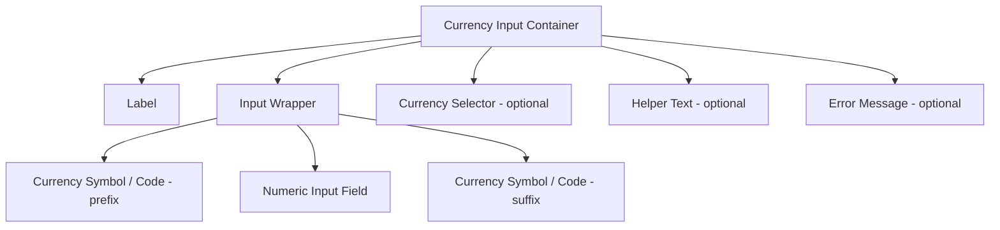

import { Playground } from "@/components/playground";


## Overview

A **Currency Input** is a specialized numeric form field for entering monetary values. It combines the raw numeric input behavior of a number field with locale-aware formatting, currency symbol display, and financial validation constraints.

Unlike a generic number input, a currency input formats the value as the user types (e.g., displaying `$1,299.99` instead of `1299.99`), handles decimal precision based on the currency (USD uses 2 decimal places, JPY uses 0), and positions the currency symbol or code according to locale conventions.

<BuildEffort
  level="medium"
  description="Requires Intl.NumberFormat for locale-aware formatting, decimal/thousand separator handling, and optional currency selector integration."
/>

## Use Cases

### When to use:

- **E-commerce checkout** – Cart totals, discount codes, coupon amounts.
- **Banking and finance forms** – Transfer amounts, deposit values, loan applications.
- **Expense reporting** – Reimbursement amounts with currency context.
- **Subscription and pricing configuration** – Plan pricing in admin interfaces.
- **Budget and forecasting tools** – Financial planning inputs.

### When not to use:

- **Displaying prices (read-only)** – Use formatted text, not an input.
- **Quantities without monetary meaning** – Use a number input instead.
- **Very large or very small scientific values** – Use a standard number input with appropriate notation.
- **When the currency is irrelevant** – A plain number input is simpler.

<PatternComparison
  current="Currency Input"
  alternatives={[
    {
      name: "Text Field",
      path: "/patterns/forms/text-field",
      when: "entering financial values without formatting requirements",
      pros: ["Simple implementation", "No formatting complexity"],
      cons: ["No locale-aware formatting", "No currency symbol", "Prone to format errors"]
    },
    {
      name: "Number Input",
      path: "/patterns/forms/text-field",
      when: "entering numeric quantities without monetary context",
      pros: ["Built-in numeric validation", "Simple implementation"],
      cons: ["No currency formatting", "No locale support", "Shows spinners"]
    },
    {
      name: "Slider Input",
      path: "/patterns/forms/text-field",
      when: "selecting a value within a known bounded range (e.g., budget up to $500)",
      pros: ["Visual range feedback", "Prevents out-of-range input"],
      cons: ["Imprecise for exact values", "Not suitable for open-ended amounts"]
    }
  ]}
/>

## Benefits

- **Reduced user errors** – Auto-formatting prevents ambiguous separators (is `1.000` one thousand or one?).
- **Locale-appropriate display** – Shows `€1.299,99` vs `$1,299.99` based on user's region.
- **Correct decimal handling** – Enforces currency-specific decimal places (JPY has 0, KWD has 3).
- **Currency symbol positioning** – Prefix (USD: `$`) vs suffix (SEK: `kr`) handled automatically.
- **Accessible numeric keyboard** – Triggers the right keypad on mobile.

## Drawbacks

- **Formatting complexity** – Stripping formatting before submission requires careful parsing.
- **Locale configuration required** – Must know the user's locale and chosen currency.
- **IME/composition issues** – Formatting while typing can disrupt non-Latin input methods.
- **Library dependency** – Proper implementation typically requires `Intl.NumberFormat` or a dedicated library.

## Internationalization

### Internationalization Beyond Localization

- **Currency Formatting** → Adapt for region-specific formats (e.g., `$1,299.99 USD` vs. `1.299,99 € EUR`).
- **Decimal separator** → Period (`.`) in en-US; comma (`,`) in de-DE, fr-FR, pt-BR.
- **Thousands separator** → Comma (`,`) in en-US; period (`.`) in de-DE; space (` `) in fr-FR.
- **Symbol position** → Prefix: USD `$100`, GBP `£100`; suffix: SEK `100 kr`, PLN `100 zł`.
- **Currency codes** → Some locales display ISO codes (`USD`, `EUR`) rather than symbols.

## Anatomy



### Component Structure

1. **Container**

   - Wraps all elements; manages layout direction (LTR/RTL).

2. **Label**

   - Descriptive: "Amount", "Transfer amount", "Discount value".
   - Associated via `for` attribute.

3. **Currency Symbol / Code (Prefix or Suffix)**

   - Positioned based on locale (prefix for USD, GBP; suffix for SEK, PLN).
   - `aria-hidden="true"` — the input's `aria-label` should include the currency.

4. **Numeric Input Field**

   - `type="text"` with `inputmode="decimal"` for mobile decimal keypad.
   - Stores the raw unformatted value internally; displays the formatted value.
   - `autocomplete="transaction-amount"` for payment context.

5. **Currency Selector (optional)**

   - Dropdown to change the active currency (e.g., USD, EUR, GBP).
   - Updates symbol position and decimal rules when currency changes.

6. **Helper Text (optional)**

   - Context like "Enter amount in US dollars" or minimum/maximum ranges.

7. **Error Message (optional)**

   - Validation messages: "Amount must be greater than $0", "Maximum transfer is $10,000".

#### Summary of Components

| Component            | Required? | Purpose                                          |
| -------------------- | --------- | ------------------------------------------------ |
| Label                | ✅ Yes    | Identifies the monetary field                    |
| Numeric Input        | ✅ Yes    | Raw value entry                                  |
| Currency Symbol/Code | ✅ Yes    | Visual currency context                          |
| Currency Selector    | ❌ No     | Multi-currency support                           |
| Helper Text          | ❌ No     | Guidance on expected amount or range             |
| Error Message        | ❌ No     | Validation feedback                              |

## Variations

### Simple USD Input

Basic currency field with a prefix symbol.

<Playground patternType="forms" pattern="currency-input" example="basic" presentation="hidden-code" />

```html
<div class="currency-input">
  <label for="amount">Amount</label>
  <div class="currency-input__wrapper">
    <span class="currency-input__symbol" aria-hidden="true">$</span>
    <input
      type="text"
      id="amount"
      name="amount"
      inputmode="decimal"
      placeholder="0.00"
      autocomplete="transaction-amount"
      aria-label="Amount in US dollars"
      class="currency-input__field"
    />
  </div>
</div>
```

### With Currency Selector

Multi-currency input allowing users to choose their currency.

```html
<div class="currency-input">
  <label for="transfer-amount">Transfer amount</label>
  <div class="currency-input__wrapper">
    <select
      class="currency-input__selector"
      id="currency-select"
      aria-label="Select currency"
    >
      <option value="USD">$ USD</option>
      <option value="EUR">€ EUR</option>
      <option value="GBP">£ GBP</option>
      <option value="SEK">SEK</option>
    </select>
    <input
      type="text"
      id="transfer-amount"
      inputmode="decimal"
      placeholder="0.00"
      aria-label="Transfer amount"
      class="currency-input__field"
    />
  </div>
  <p class="currency-input__help" id="transfer-help">
    Exchange rate: 1 USD = 0.92 EUR
  </p>
</div>
```

### With Min/Max Validation

```html
<div class="currency-input">
  <label for="donation">Donation amount</label>
  <div class="currency-input__wrapper">
    <span class="currency-input__symbol" aria-hidden="true">$</span>
    <input
      type="text"
      id="donation"
      inputmode="decimal"
      min="1"
      max="10000"
      placeholder="10.00"
      aria-label="Donation amount in USD, minimum $1, maximum $10,000"
      aria-describedby="donation-help"
      class="currency-input__field"
    />
  </div>
  <p id="donation-help" class="currency-input__help">Minimum $1.00 · Maximum $10,000.00</p>
</div>
```

### Read-Only Display Mode

```html
<div class="currency-input currency-input--readonly">
  <span class="currency-input__label">Order total</span>
  <output class="currency-input__display" aria-label="Order total: $1,299.99">
    $1,299.99
  </output>
</div>
```

### Suffix Currency (European Locale)

```html
<div class="currency-input currency-input--suffix" lang="de">
  <label for="betrag">Betrag</label>
  <div class="currency-input__wrapper">
    <input
      type="text"
      id="betrag"
      inputmode="decimal"
      placeholder="0,00"
      aria-label="Betrag in Euro"
      class="currency-input__field"
    />
    <span class="currency-input__symbol" aria-hidden="true">€</span>
  </div>
</div>
```

## Best Practices

### Content & Usability

**Do's ✅**

- Store the raw numeric value internally; only show the formatted version to users.
- Use `inputmode="decimal"` to show a decimal-capable keyboard on mobile.
- Format on blur rather than on every keystroke to avoid disrupting input mid-entry.
- Clearly show the currency code or symbol so users know which currency they're entering.
- Provide a minimum value indicator when zero or negative amounts are invalid.
- Strip non-numeric characters before parsing the value on form submission.
- Allow users to type decimal values naturally without forcing a specific format during entry.

**Don'ts ❌**

- Don't use `<input type="number">` — it shows browser steppers, rejects comma separators used in some locales, and has inconsistent decimal behavior.
- Don't reformat the value while the user is actively typing — format on blur.
- Don't silently accept values outside allowed ranges; show validation feedback.
- Don't discard the currency context when the field is read by a screen reader.
- Don't use a fixed decimal separator — detect locale and use the appropriate one.

---

### Accessibility

**Do's ✅**

- Include the currency in the `aria-label` (e.g., `aria-label="Amount in US dollars"`).
- Mark the currency symbol `aria-hidden="true"` to prevent double-reading.
- Use `aria-describedby` to connect to helper text showing min/max values.
- Use `aria-invalid="true"` and `aria-errormessage` for validation errors.
- Announce formatted value changes via `aria-live="polite"` when reformatting on blur.

**Don'ts ❌**

- Don't rely solely on color to indicate invalid state.
- Don't provide only the symbol without a full currency label for screen readers.

---

### Visual Design

**Do's ✅**

- Align numeric values to the **right** within the input (standard financial convention).
- Use a monospace or tabular-figures font for better number alignment in tables.
- Visually distinguish the currency symbol from the editable number (slight gray vs black).
- Show validation state (green border / red border) consistently with other form inputs.

**Don'ts ❌**

- Don't right-align in RTL interfaces — follow locale conventions for numeric alignment.
- Avoid too many decimal places in the formatted display (stick to the currency's standard).

---

### Layout & Positioning

**Do's ✅**

- Keep currency symbol and input on the same visual baseline.
- Position the currency selector to the left of the amount field (common convention).
- For forms with multiple currency fields, align all decimal separators vertically.

**Don'ts ❌**

- Don't stack the currency symbol above or below the input; keep it inline.

## Common Mistakes & Anti-Patterns 🚫

### Using `type="number"` for Currency

**The Problem:**
`<input type="number">` shows browser spinner arrows, rejects thousands separators (commas), and handles decimals inconsistently across browsers and locales.

```html
<!-- Bad -->
<input type="number" step="0.01" min="0" />
```

**How to Fix It?** Use `type="text"` with `inputmode="decimal"`.

```html
<!-- Good -->
<input type="text" inputmode="decimal" pattern="[0-9]*[.,]?[0-9]{0,2}" />
```

---

### Formatting While User Is Typing

**The Problem:**
Reformatting the value on `input` events moves the cursor unexpectedly, especially when adding thousands separators mid-entry.

**How to Fix It?** Format only on `blur`; show raw decimal input during typing.

```javascript
input.addEventListener('blur', () => {
  const raw = parseFloat(input.value.replace(/[^0-9.-]/g, ''));
  if (!isNaN(raw)) {
    input.value = new Intl.NumberFormat('en-US', {
      style: 'currency',
      currency: 'USD',
    }).format(raw);
  }
});

input.addEventListener('focus', () => {
  // Strip formatting for editing
  input.value = input.value.replace(/[^0-9.]/g, '');
});
```

---

### Submitting Formatted Value to Server

**The Problem:**
Sending `"$1,299.99"` to a backend that expects `1299.99` (or `129999` as integer cents) causes parse errors or incorrect amounts.

**How to Fix It?** Use a hidden input for the raw value, or strip formatting before submission.

```html
<input type="text" id="amount-display" value="$1,299.99" />
<input type="hidden" id="amount-raw" name="amount" value="1299.99" />
```

```javascript
form.addEventListener('submit', () => {
  const raw = parseFloat(displayInput.value.replace(/[^0-9.]/g, ''));
  hiddenInput.value = raw.toFixed(2);
});
```

---

### Hardcoding US Number Formatting

**The Problem:**
Using `toLocaleString()` without a locale argument produces different results in different browser environments, causing inconsistent formatting.

**How to Fix It?** Always pass an explicit locale and currency to `Intl.NumberFormat`.

```javascript
// Bad - inconsistent across environments
amount.toLocaleString();

// Good - explicit and consistent
new Intl.NumberFormat('de-DE', { style: 'currency', currency: 'EUR' }).format(amount);
```

## Accessibility

### Keyboard Interaction Pattern

| **Key**              | **Action**                                              |
| -------------------- | ------------------------------------------------------- |
| `Tab`                | Moves focus to the currency input                       |
| `Shift + Tab`        | Moves focus to the previous element                     |
| `0–9`                | Enters numeric digits                                   |
| `.` or `,`           | Enters decimal separator (locale-dependent)             |
| `Backspace`          | Removes the last character                              |
| `Delete`             | Removes the character after the cursor                  |
| `Arrow Left/Right`   | Moves cursor within the input                           |
| `Home` / `End`       | Jumps to the start or end of the value                  |

## Micro-Interactions & Animations

### Format-on-Blur Transition
- **Effect:** Smooth transition from raw digits to formatted currency on blur
- **Timing:** No animation needed — the formatting change happens instantly; a brief 200ms opacity dip (0.7 → 1.0) softens the jump

```css
.currency-input__field {
  transition: opacity 200ms ease-in-out;
}

.currency-input__field--formatting {
  opacity: 0.7;
}
```

### Invalid Amount Highlight
- **Effect:** Red border pulses briefly when a value is out of range
- **Timing:** 300ms pulse animation

```css
@keyframes invalid-pulse {
  0%, 100% { border-color: #ef4444; }
  50% { border-color: #fca5a5; }
}

.currency-input--invalid .currency-input__field {
  animation: invalid-pulse 300ms ease-in-out;
}
```

### Currency Swap Transition
- **Effect:** Symbol fades out and new symbol fades in when currency selector changes
- **Timing:** 150ms ease-in-out

```css
.currency-input__symbol {
  transition: opacity 150ms ease-in-out;
}
```

### Focus Ring Enhancement
- **Effect:** Subtle glow matching the currency accent color on focus

```css
.currency-input__field:focus {
  outline: none;
  border-color: #3b82f6;
  box-shadow: 0 0 0 3px rgba(59, 130, 246, 0.1);
}
```

## Tracking

### Key Tracking Points

| **Event Name**                   | **Description**                                          | **Why Track It?**                                          |
| -------------------------------- | -------------------------------------------------------- | ---------------------------------------------------------- |
| `currency_input.focused`         | User focuses on the currency field                       | Measures engagement with financial input                   |
| `currency_input.changed`         | Value changes (on blur)                                  | Tracks amount entry                                        |
| `currency_input.currency_changed`| User changes currency in selector                        | Measures multi-currency usage                              |
| `currency_input.validation_error`| Amount fails validation                                  | Identifies common input mistakes                           |
| `currency_input.cleared`         | User clears the amount                                   | Signals hesitation or reconsideration                      |

### Event Payload Structure

```json
{
  "event": "currency_input.changed",
  "properties": {
    "field_id": "transfer_amount",
    "raw_value": 1299.99,
    "currency": "USD",
    "locale": "en-US",
    "formatted_value": "$1,299.99",
    "form_id": "checkout"
  }
}
```

### Key Metrics to Analyze

- **Average Entry Amount** → Typical values entered in each field
- **Currency Distribution** → Which currencies users select most
- **Validation Error Rate** → How often amounts fail constraints
- **Edit Rate** → How often users correct amounts before submitting

## Localization

```json
{
  "currency_input": {
    "label": "Amount",
    "placeholder_usd": "0.00",
    "placeholder_jpy": "0",
    "aria_label": "Amount in {currency}",
    "select_currency": "Select currency",
    "exchange_rate": "1 {from} = {rate} {to}",
    "errors": {
      "required": "Please enter an amount",
      "invalid": "Please enter a valid amount",
      "too_small": "Minimum amount is {min}",
      "too_large": "Maximum amount is {max}",
      "negative": "Amount cannot be negative"
    },
    "helper": {
      "min_max": "Minimum {min} · Maximum {max}"
    }
  }
}
```

### Locale-Specific Formatting Examples

| Locale  | Currency | Format          | Decimal | Thousands |
| ------- | -------- | --------------- | ------- | --------- |
| en-US   | USD      | $1,299.99       | `.`     | `,`       |
| de-DE   | EUR      | 1.299,99 €      | `,`     | `.`       |
| fr-FR   | EUR      | 1 299,99 €      | `,`     | ` `       |
| ja-JP   | JPY      | ¥1,300          | N/A     | `,`       |
| ar-SA   | SAR      | ١٬٢٩٩٫٩٩ ر.س  | `٫`    | `٬`       |
| pt-BR   | BRL      | R$ 1.299,99     | `,`     | `.`       |

### RTL Language Support

```css
[dir="rtl"] .currency-input__wrapper {
  flex-direction: row-reverse;
}

[dir="rtl"] .currency-input__field {
  text-align: right;
}

/* Symbol on the left in RTL (e.g., Arabic Riyal ر.س suffix becomes prefix in RTL layout) */
[dir="rtl"] .currency-input__symbol--suffix {
  order: -1;
}
```

## Performance Metrics

- **Initial render**: < 80ms for currency input appearance
- **Format-on-blur**: < 16ms for value formatting
- **Currency selector change**: < 50ms to update symbol and placeholder
- **Validation feedback**: < 150ms after blur
- **Memory usage**: < 5KB per currency input instance

## Testing Guidelines

### Functional Testing

**Should ✓**

- [ ] Typing digits works correctly in numeric mode.
- [ ] Value formats correctly on blur (e.g., `1299.99` → `$1,299.99`).
- [ ] Decimal separator works per locale (period in en-US, comma in de-DE).
- [ ] Minimum and maximum constraints are enforced and show appropriate errors.
- [ ] Changing currency updates the symbol, position, and decimal rules.
- [ ] Submitting the form sends the raw numeric value, not the formatted string.

---

### Accessibility Testing

**Should ✓**

- [ ] Screen reader announces the currency in the field label.
- [ ] Currency symbol is `aria-hidden="true"`.
- [ ] Validation errors are announced via `aria-live`.
- [ ] The field has `aria-describedby` linked to helper text.
- [ ] Tab order is logical: label → input → currency selector (or vice versa).

---

### Performance Testing

**Should ✓**

- [ ] Format-on-blur completes within a single frame (16ms).
- [ ] No layout shift when error messages appear.
- [ ] Currency selector change does not cause a full component re-render.

---

### Security Testing

**Should ✓**

- [ ] Raw value is validated server-side; client-side formatting is presentation-only.
- [ ] Maximum amount is enforced server-side to prevent manipulation.
- [ ] Negative amounts are rejected if not permitted.
- [ ] Very large values (overflow) are handled gracefully.

---

### Mobile & Touch Testing

**Should ✓**

- [ ] Decimal keypad (`inputmode="decimal"`) appears on mobile.
- [ ] Thousands separators do not prevent correct input on international keyboards.
- [ ] The field is usable when the virtual keyboard is visible.

---

### Edge Cases

**Should ✓**

- [ ] Zero is handled correctly (not shown as `-0` or blank).
- [ ] Pasting a formatted string (`$1,299.99`) strips formatting and parses correctly.
- [ ] Currencies with 0 decimal places (JPY) do not accept decimal input.
- [ ] Currencies with 3 decimal places (KWD) allow the correct number of decimals.
- [ ] Very small amounts (e.g., `$0.01`) are not rounded to zero.

<ChecklistDownload patternSlug="currency-input" />

## Frequently Asked Questions

<FaqStructuredData
  items={[
    {
      question: "Why should I use `type='text'` instead of `type='number'` for currency inputs?",
      answer:
        "The `type='number'` input rejects commas used as thousands separators in many locales, shows browser spinner arrows inappropriate for currency, and has inconsistent decimal handling. Using `type='text'` with `inputmode='decimal'` gives mobile users the right keyboard while avoiding these issues.",
    },
    {
      question: "How do I format currency values correctly for different locales?",
      answer:
        "Use the built-in `Intl.NumberFormat` API with explicit locale and currency options: `new Intl.NumberFormat('de-DE', { style: 'currency', currency: 'EUR' }).format(amount)`. Always pass an explicit locale rather than relying on the browser default to ensure consistent formatting across environments.",
    },
    {
      question: "Should I format the currency value while the user is typing?",
      answer:
        "No. Formatting while typing moves the cursor unpredictably, especially when inserting thousands separators. Instead, allow raw numeric input during typing and apply formatting when the field loses focus (on `blur`).",
    },
    {
      question: "How do I submit the correct numeric value to my server?",
      answer:
        "Strip all formatting characters before submission. Use a hidden input field to store the parsed numeric value, or strip and parse the displayed value in a form submit handler. Never send the user-visible formatted string directly to the server.",
    },
    {
      question: "How should I handle currencies with different decimal places like JPY or KWD?",
      answer:
        "Use the `minimumFractionDigits` and `maximumFractionDigits` from `Intl.NumberFormat` for the selected currency. For JPY, these are both 0; for KWD, both are 3. Adjust the input's `step` and validation accordingly, and update these when the user changes currencies.",
    },
  ]}
/>

## Related Patterns

<RelatedPatternsCard category="forms" />

## Resources

### Libraries

- [React Currency Input Field](https://github.com/cchanxzy/react-currency-input-field) - React component with locale support
- [AutoNumeric](https://autonumeric.org/) - Automatic number & currency formatting
- [Cleave.js](https://nosir.github.io/cleave.js/) - Input format as you type
- [currency.js](https://currency.js.org/) - Simple, safe currency parsing and formatting

### Design Systems

- [Material Design Text Fields](https://material.io/components/text-fields) - Prefix/suffix field pattern
- [Carbon Design System](https://carbondesignsystem.com/components/number-input/usage) - IBM numeric input guidelines
- [Polaris (Shopify)](https://polaris.shopify.com/components/text-field) - E-commerce input patterns

### Articles & Guides

- [Intl.NumberFormat](https://developer.mozilla.org/en-US/docs/Web/JavaScript/Reference/Global_Objects/Intl/NumberFormat) - MDN locale-aware number formatting
- [Designing Currency Inputs](https://uxplanet.org/designing-perfect-text-field-clarity-accessibility-and-user-experience-6e7dd80e68c8) - UX considerations
- [Form Design: Best Practices](https://www.smashingmagazine.com/2011/11/extensive-guide-to-web-form-usability/) - Smashing Magazine form guide

### Tools & Utilities

- [Intl Explorer](https://www.intl-explorer.com/) - Interactive Intl API explorer
- [Currency Codes](https://www.iso.org/iso-4217-currency-codes.html) - ISO 4217 currency reference
