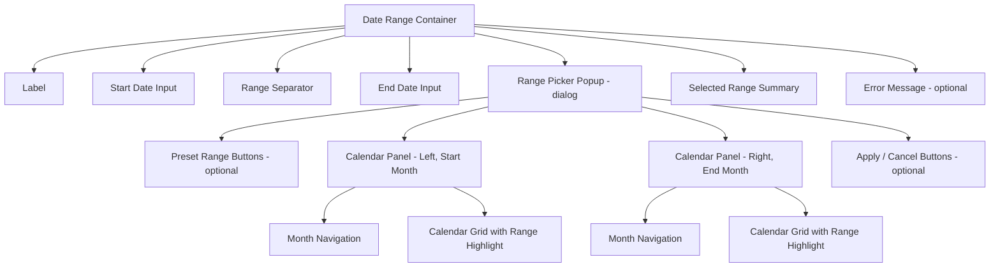

import { Playground } from "@/components/playground";

## Overview

A **Date Range** component allows users to select both a **start date** and an **end date**, defining a continuous period of time. It extends the [Date Picker](/patterns/forms/date-picker) pattern by introducing range visualization — highlighting the days between the two selected dates — and range-specific validation (end date must be after start date, minimum/maximum range length).

Date Range is commonly implemented as either a **dual input pair** (two separate date fields with connected validation) or a **single calendar panel/dual-panel UI** with visual range highlighting as the user selects.

<BuildEffort
  level="high"
  description="Requires range visualization logic, hover preview of potential ranges, validation that end > start, minimum/maximum range enforcement, and accessible announcement of both selected dates."
/>

## Use Cases

### When to use:

- **Hotel/travel booking** – Check-in and check-out date selection.
- **Event duration** – Start and end dates for an event or campaign.
- **Reporting periods** – Date filters for analytics dashboards ("Last 7 days", custom range).
- **Rental and reservation systems** – Car rental, equipment rental periods.
- **Leave and time-off requests** – Vacation date selection with minimum/maximum days.

### When not to use:

- **Single date selection** – Use a [Date Picker](/patterns/forms/date-picker).
- **Open-ended filters** – "From date only" or "To date only" — use two independent date inputs.
- **Very long date ranges** – Multi-year ranges are better served by month/year selectors.
- **When start and end can be the same day** – Clarify this explicitly in UX copy.

<PatternComparison
  current="Date Range"
  alternatives={[
    {
      name: "Date Picker",
      path: "/patterns/forms/date-picker",
      when: "only a single date needs to be selected",
      pros: ["Simpler interaction", "Single selection", "Smaller UI footprint"],
      cons: ["Can't select ranges", "No range validation"]
    },
    {
      name: "Two Date Inputs",
      path: "/patterns/forms/date-input",
      when: "start and end dates are logically separate and not visually related",
      pros: ["Simple", "Independent validation", "Compact"],
      cons: ["No range visualization", "No calendar context", "Manual range validation needed"]
    },
    {
      name: "Preset Selector",
      path: "/patterns/forms/selection-input",
      when: "users choose from fixed ranges (Today, Last 7 days, This month, This quarter)",
      pros: ["Fast selection", "No calendar needed", "No format confusion"],
      cons: ["No custom ranges", "Limited to predefined options"]
    }
  ]}
/>

## Benefits

- **Visual range clarity** – Highlighted range makes it immediately clear which period is selected.
- **Range validation** – Prevents end-before-start selections automatically.
- **Preset ranges** – Common ranges (last 7 days, this month) can be offered as shortcuts.
- **Hover preview** – Shows a potential range as the user moves to select the end date.
- **Contextual navigation** – Calendar context shows surrounding dates and day-of-week.

## Drawbacks

- **Complex implementation** – Range state, hover preview, and dual-calendar layout are non-trivial.
- **Large UI footprint** – Dual-panel calendars require significant horizontal space.
- **Accessibility complexity** – Announcing range state changes to screen readers requires careful design.
- **Mobile challenges** – Dual-panel calendars don't fit on small screens without significant adaptation.
- **User confusion** – Multi-step selection (click start, then click end) may not be obvious.

## Anatomy



### Component Structure

1. **Container**

   - Wraps start input, separator, end input, and popup.
   - Manages selection state (selecting start, selecting end, range complete).

2. **Start Date Input**

   - Shows selected start date; opens picker focused on start date selection.
   - `aria-label="Start date"` or contextual label ("Check-in date").

3. **Range Separator**

   - Visual element (arrow `→` or dash `—`) between the two inputs.
   - `aria-hidden="true"` — semantic separation handled by labels.

4. **End Date Input**

   - Shows selected end date; opens picker focused on end date selection.
   - `aria-label="End date"` or contextual label ("Check-out date").

5. **Picker Popup (`role="dialog"`)**

   - Contains one or two calendar panels.
   - Header with preset range options (optional).
   - Footer with Apply/Cancel on confirm-required implementations.

6. **Dual Calendar Panels**

   - Left panel: shows start month; right panel: shows next month.
   - Days in the range highlighted; range start and end have distinct styles.
   - Hover preview highlights potential range before end date is confirmed.

7. **Preset Range Buttons**

   - "Today", "Yesterday", "Last 7 days", "Last 30 days", "This month", "Custom".
   - Each applies the corresponding range immediately.

8. **Range Summary**

   - Accessible text: "Selected: March 12, 2026 to March 19, 2026 (7 nights)".
   - Announced via `aria-live` when range changes.

#### Summary of Components

| Component            | Required? | Purpose                                               |
| -------------------- | --------- | ----------------------------------------------------- |
| Start Date Input     | ✅ Yes    | Entry point for start date                            |
| End Date Input       | ✅ Yes    | Entry point for end date                              |
| Calendar Popup       | ✅ Yes    | Visual date range selection                           |
| Range Highlight      | ✅ Yes    | Visual indicator of selected period                   |
| Preset Ranges        | ❌ No     | Quick selection shortcuts                             |
| Hover Preview        | ❌ No     | Shows potential range before confirmation             |
| Apply/Cancel Footer  | ❌ No     | Requires explicit confirmation before applying        |

## Variations

### Dual Input with Popup

Standard date range with two labeled inputs that trigger a dual-panel calendar.

<Playground patternType="forms" pattern="date-range" example="basic" presentation="hidden-code" />

```html
<div class="date-range" aria-describedby="date-range-summary">
  <div class="date-range__inputs">
    <div class="date-range__field">
      <label for="checkin-date">Check-in</label>
      <input
        type="text"
        id="checkin-date"
        class="date-range__input"
        placeholder="MM/DD/YYYY"
        readonly
        aria-haspopup="dialog"
        aria-expanded="false"
      />
    </div>
    <span class="date-range__separator" aria-hidden="true">→</span>
    <div class="date-range__field">
      <label for="checkout-date">Check-out</label>
      <input
        type="text"
        id="checkout-date"
        class="date-range__input"
        placeholder="MM/DD/YYYY"
        readonly
        aria-haspopup="dialog"
        aria-expanded="false"
      />
    </div>
  </div>

  <div
    class="date-range__popup"
    role="dialog"
    aria-modal="true"
    aria-label="Select check-in and check-out dates"
    hidden
  >
    <!-- Dual calendar panels -->
  </div>

  <output
    id="date-range-summary"
    class="date-range__summary sr-only"
    aria-live="polite"
  >
    No dates selected.
  </output>
</div>
```

### With Preset Range Buttons

Analytics-style date range with preset shortcuts.

```html
<div class="date-range">
  <div class="date-range__presets" role="group" aria-label="Preset date ranges">
    <button type="button" class="date-range__preset" data-range="today">Today</button>
    <button type="button" class="date-range__preset" data-range="yesterday">Yesterday</button>
    <button type="button" class="date-range__preset" data-range="7d">Last 7 days</button>
    <button type="button" class="date-range__preset" data-range="30d">Last 30 days</button>
    <button type="button" class="date-range__preset" data-range="month">This month</button>
    <button type="button" class="date-range__preset" data-range="quarter">This quarter</button>
  </div>
  <div class="date-range__custom">
    <!-- Start/end inputs and popup for custom range -->
  </div>
</div>
```

### Single-Panel Range Selection

Compact variant using one calendar where users click start then end date.

```html
<div class="date-range date-range--single-panel">
  <div class="date-range__inputs">
    <!-- Condensed input row -->
    <input type="text" placeholder="Start date" readonly aria-label="Range start date" />
    <span aria-hidden="true">—</span>
    <input type="text" placeholder="End date" readonly aria-label="Range end date" />
  </div>

  <div class="date-range__popup" role="dialog" aria-modal="true" aria-label="Select date range" hidden>
    <div class="calendar">
      <!-- Single calendar; first click = start, second click = end -->
    </div>
    <p class="date-range__instruction" aria-live="polite">
      Click a start date, then click an end date.
    </p>
  </div>
</div>
```

### With Minimum Range Constraint

For rental systems requiring a minimum booking period.

```html
<div class="date-range" data-min-days="2" data-max-days="30">
  <label id="rental-range-label">Rental period (minimum 2 nights)</label>
  <div class="date-range__inputs" aria-labelledby="rental-range-label">
    <input type="text" placeholder="Pick-up date" aria-label="Rental start date" readonly />
    <span aria-hidden="true">→</span>
    <input type="text" placeholder="Return date" aria-label="Rental end date" readonly />
  </div>
  <p class="date-range__help" aria-live="polite" id="range-constraint-msg">
    Minimum rental: 2 nights · Maximum: 30 nights
  </p>
</div>
```

## Best Practices

### Content & Usability

**Do's ✅**

- Show the **number of days/nights** in the selection as users choose dates ("5 nights selected").
- Offer **preset ranges** for analytics and reporting contexts to speed up common selections.
- Allow users to click the **start date field** to edit only the start date without resetting the end.
- Provide clear **visual feedback** showing the selection in progress (e.g., "Now select end date").
- Highlight the **range in the calendar** as the user hovers over potential end dates.
- Show a **range summary** (start date to end date, N days) below or beside the inputs.
- Allow typing directly in both date inputs as an alternative to calendar selection.

**Don'ts ❌**

- Don't reset both dates when the user selects a new start date — the end date often stays valid.
- Don't require an explicit "Apply" button for simple range selections (auto-apply on end date select).
- Don't prevent selection of the same start and end date if single-day ranges are valid.
- Don't allow the end date to precede the start date — handle this gracefully with an error message.
- Don't show a dual-panel calendar on mobile — use a single panel with month navigation instead.

---

### Accessibility

**Do's ✅**

- Announce the selected range via `aria-live="polite"`: "March 12 to March 19, 7 nights selected."
- Use distinct `aria-label` values for start and end inputs that include their role.
- Mark range-start, range-end, and in-range day cells with descriptive [aria attributes](/glossary/aria-attributes).
- Announce hover-preview range changes to assistive technology users via a polite live region.
- Announce errors (end before start, range too short/long) via `aria-live="assertive"`.
- Allow keyboard users to set the range by navigating the calendar grid.
**Don'ts ❌**

- Don't use color alone to indicate range start, range end, and in-range cells.
- Don't leave [screen reader](/glossary/screen-reader) users without feedback about which selection step they're on.
- Don't trap users in an unusable state if they select an invalid range.
---

### Visual Design

**Do's ✅**

- Use a **continuous highlight color** across all in-range days.
- Use **rounded caps** (half-circle) on the range start and end cells.
- Keep the range highlight **lighter** than the selection circles for visual hierarchy.
- Show the **range end as same-styled as range start** (symmetrical caps).
- Visually communicate the selection step: "Select start date" vs "Select end date" instruction text.

**Don'ts ❌**

- Don't use the same visual style for "today", "range start", and "range end".
- Don't show an asymmetric range highlight (open end on range start, closed cap on end).
- Avoid very saturated range highlight colors that reduce readability of day numbers.

---

### Layout & Positioning

**Do's ✅**

- Show dual calendar panels side by side on desktop (left: start month, right: next month).
- Collapse to a single panel on screens narrower than 640px.
- Position the popup below the inputs, aligned to the left edge.
- Use a bottom sheet on mobile.

**Don'ts ❌**

- Don't force the dual panel to fit on a 320px screen — collapse gracefully.
- Don't show months out of chronological order (left must be before right).

## Common Mistakes & Anti-Patterns 🚫

### Resetting End Date When Start Date Changes

**The Problem:**
When users adjust the start date (e.g., from March 12 to March 15), automatically clearing the end date frustrates users who just want to shift the range by a few days.

**How to Fix It?** If the new start date is before the existing end date, keep the end date. Only clear it if the new start date is after the end date.

```javascript
function onStartDateChange(newStart) {
  if (endDate && newStart < endDate) {
    // Keep end date — range is still valid
  } else {
    setEndDate(null); // Only clear if invalid
  }
  setStartDate(newStart);
}
```

---

### No In-Progress Visual Feedback

**The Problem:**
After the user clicks a start date, the calendar appears unchanged — there's no indication that the system is waiting for an end date selection.

**How to Fix It?** Show instructional text and a hover-preview of the potential range.

```javascript
calendar.addEventListener('mouseover', (e) => {
  if (selectingEndDate && e.target.matches('.calendar__day-btn')) {
    const hoverDate = getDateFromCell(e.target);
    if (hoverDate > startDate) {
      highlightRange(startDate, hoverDate, 'preview');
    }
  }
});
```

---

### Ignoring Minimum/Maximum Range Constraints

**The Problem:**
Rental and booking systems often have minimum stays. Not enforcing these visually (by disabling cells within the minimum range of the start date) allows users to select invalid ranges.

**How to Fix It?** After start date selection, disable all cells within the minimum range.

```javascript
function getDisabledDatesForEndSelection(startDate, minDays) {
  const disabled = [];
  for (let i = 1; i < minDays; i++) {
    const d = new Date(startDate);
    d.setDate(d.getDate() + i);
    disabled.push(d);
  }
  return disabled;
}
```

---

### Showing Only One Calendar Panel on Desktop

**The Problem:**
A single calendar panel for a date range picker forces users to navigate months to see both the start and end of their selected range, which is confusing.

**How to Fix It?** Show two calendar panels on desktop. The left panel shows the month containing the start date; the right panel shows the following month.

## Accessibility

### Keyboard Interaction Pattern

| **Key**                | **Action**                                                               |
| ---------------------- | ------------------------------------------------------------------------ |
| `Tab`                  | Moves between start input, end input, and calendar trigger               |
| `Enter` / `Space`      | Opens the picker when on an input or trigger; confirms hovered date      |
| `Arrow Right`          | Moves focus to the next day in the calendar                              |
| `Arrow Left`           | Moves focus to the previous day                                          |
| `Arrow Down`           | Moves focus to the same day next week                                    |
| `Arrow Up`             | Moves focus to the same day previous week                                |
| `Page Up`              | Navigates to the previous month                                          |
| `Page Down`            | Navigates to the next month                                              |
| `Home`                 | Moves to the first day of the current week                               |
| `End`                  | Moves to the last day of the current week                                |
| `Escape`               | Closes the picker; if end date was being selected, cancels the selection |

## Micro-Interactions & Animations

### Range Highlight Hover Preview
- **Effect:** Days between start date and hovered date fill with a light background
- **Timing:** Immediate on mouseover (no delay)

```css
.calendar__day-btn--in-range-preview {
  background-color: #eff6ff;
  border-radius: 0;
}

.calendar__day-btn--range-start,
.calendar__day-btn--range-end {
  background-color: #3b82f6;
  color: white;
  border-radius: 50%;
}
```

### Range Commit Animation
- **Effect:** Confirmed range cells transition from preview color to confirmed range color
- **Timing:** 200ms ease-in-out

```css
.calendar__day-btn--in-range {
  background-color: #dbeafe;
  border-radius: 0;
  transition: background-color 200ms ease-in-out;
}
```

### Preset Button Selection
- **Effect:** Selected preset gets a filled background; others reset
- **Timing:** 100ms ease-out

```css
.date-range__preset {
  transition: background-color 100ms ease-out, color 100ms ease-out;
}

.date-range__preset--active {
  background-color: #3b82f6;
  color: white;
}
```

### Input Update After Selection
- **Effect:** Brief highlight flash on both date inputs when range is confirmed
- **Timing:** 300ms ease-out highlight, no animation on the text value itself

## Tracking

### Key Tracking Points

| **Event Name**                    | **Description**                                         | **Why Track It?**                                     |
| --------------------------------- | ------------------------------------------------------- | ----------------------------------------------------- |
| `date_range.start_selected`       | User selects the start date                             | Identifies most common start date patterns            |
| `date_range.end_selected`         | User selects the end date (range complete)              | Measures range completion rate                        |
| `date_range.preset_selected`      | User selects a preset range                             | Measures preset vs custom range preference            |
| `date_range.range_too_short`      | Selected range violates minimum constraint              | Highlights UX issues with minimum range rules         |
| `date_range.range_reset`          | User clears or resets the range                         | Signals reconsideration in booking/filter flows       |
| `date_range.abandoned`            | Picker closed without selecting a complete range        | Measures picker abandonment                           |

### Event Payload Structure

```json
{
  "event": "date_range.end_selected",
  "properties": {
    "field_id": "booking_range",
    "start_date": "2026-03-15",
    "end_date": "2026-03-19",
    "range_days": 4,
    "selection_method": "calendar_click",
    "preset_used": false,
    "months_navigated": 0
  }
}
```

### Key Metrics to Analyze

- **Average Range Length** → Typical booking or filter periods
- **Preset vs Custom Ratio** → How often users use presets vs custom ranges
- **Abandonment Rate** → How often users open but don't complete a range
- **Range Validity Error Rate** → How often users attempt invalid ranges
- **Most Common Start Days** → Day-of-week patterns in start date selection

## Localization

```json
{
  "date_range": {
    "start_label": "Start date",
    "end_label": "End date",
    "placeholder_start": "MM/DD/YYYY",
    "placeholder_end": "MM/DD/YYYY",
    "separator": "to",
    "nights": "{count} night | {count} nights",
    "days": "{count} day | {count} days",
    "range_summary": "{start} to {end}, {count} nights",
    "presets": {
      "today": "Today",
      "yesterday": "Yesterday",
      "last_7_days": "Last 7 days",
      "last_30_days": "Last 30 days",
      "this_month": "This month",
      "last_month": "Last month",
      "this_quarter": "This quarter",
      "custom": "Custom range"
    },
    "instructions": {
      "select_start": "Select a start date",
      "select_end": "Now select an end date"
    },
    "errors": {
      "end_before_start": "End date must be after start date",
      "range_too_short": "Minimum {min} nights required",
      "range_too_long": "Maximum {max} nights allowed",
      "required_start": "Please select a start date",
      "required_end": "Please select an end date"
    },
    "apply": "Apply",
    "cancel": "Cancel",
    "clear": "Clear dates"
  }
}
```

### RTL Language Support

```css
[dir="rtl"] .date-range__inputs {
  flex-direction: row-reverse;
}

[dir="rtl"] .date-range__separator {
  transform: scaleX(-1); /* Flip arrow direction */
}

[dir="rtl"] .date-range__popup {
  right: 0;
  left: auto;
}
```

## Performance Metrics

- **Picker open time**: < 150ms for dual-panel calendar
- **Hover preview**: < 16ms per frame during hover
- **Range commit (end date selection)**: < 50ms to update UI
- **Preset range selection**: < 30ms to apply dates
- **Memory usage**: < 30KB for dual-panel date range picker

## Testing Guidelines

### Functional Testing

**Should ✓**

- [ ] Selecting a start date puts the picker in "select end date" mode.
- [ ] Selecting an end date after the start date completes the range.
- [ ] Range highlight appears between start and end dates.
- [ ] Hover preview shows potential range as user moves over dates.
- [ ] Minimum range constraint prevents selecting too-short ranges.
- [ ] Maximum range constraint prevents selecting too-long ranges.
- [ ] Preset buttons apply correct ranges immediately.
- [ ] Clear button resets both start and end dates.

---

### Accessibility Testing

**Should ✓**

- [ ] Range selection progress is announced via `aria-live`.
- [ ] Selected range summary is announced when range is complete.
- [ ] Both calendar panels are keyboard-navigable.
- [ ] Arrow key navigation works across the range of dates.
- [ ] Error messages for invalid ranges are announced via `aria-live="assertive"`.
- [ ] Focus returns to the trigger when picker closes.
- [ ] In-range cells convey their state (not just color) to screen readers.

---

### Performance Testing

**Should ✓**

- [ ] Hover preview renders within 16ms (one frame).
- [ ] Dual-panel calendar opens within 150ms.
- [ ] Month navigation is smooth at 60fps.
- [ ] No layout shifts when the range summary updates.

---

### Mobile & Touch Testing

**Should ✓**

- [ ] Dual panel collapses to single panel on screens < 640px.
- [ ] [Touch targets](/glossary/touch-targets) are at least 44×44px for day cells.
- [ ] A bottom sheet is used on mobile rather than a floating overlay.
- [ ] Tap-to-select-start and tap-to-select-end works correctly on touch.
---

### Edge Cases

**Should ✓**

- [ ] Single-day range (same start and end date) is handled if permitted.
- [ ] Start date of a month to end date of the next month spans both panels correctly.
- [ ] Leap year February 29 is selectable in range.
- [ ] Range crossing a year boundary (Dec 28 – Jan 5) works correctly.
- [ ] Preset "This month" on the last day of the month produces a 1-day range if allowed.

<ChecklistDownload patternSlug="date-range" />

## Frequently Asked Questions

<FaqStructuredData
  items={[
    {
      question: "Should I use a single calendar panel or dual calendar panels for date range selection?",
      answer:
        "Use dual panels on desktop to show both the start and end month simultaneously, reducing navigation. Use a single panel on mobile or when horizontal space is limited. Single-panel pickers require more month navigation to select ranges that span across months.",
    },
    {
      question: "How do I handle the case where the user selects an end date before the start date?",
      answer:
        "The most forgiving approach is to swap the dates automatically (treating the earlier selection as the start and the later as the end). An alternative is to clear the end date and prompt the user to reselect. Always announce the error or swap via aria-live so keyboard and screen reader users are informed.",
    },
    {
      question: "What is the best way to implement preset date ranges?",
      answer:
        "Render preset options as a group of buttons above or beside the calendar, using `role='group'` with `aria-label='Preset date ranges'`. Each button should apply the range immediately when clicked and update both the calendar grid and the text inputs. Track which presets users select most to optimize the list.",
    },
    {
      question: "How do I show range progress — which date are we selecting next?",
      answer:
        "Use an instructional text element with `aria-live='polite'` that reads 'Select a start date' when nothing is selected, and 'Start date selected: March 12. Now select an end date.' after the first click. This guides both sighted and screen reader users through the two-step selection.",
    },
    {
      question: "How should a date range picker behave on mobile?",
      answer:
        "Use a full-width bottom sheet or modal on mobile. Show a single calendar panel rather than dual panels. Ensure day cells are at least 44×44px. Consider using native `<input type='date'>` inputs for start and end dates on mobile as a lighter alternative to a custom range picker.",
    },
  ]}
/>

## Related Patterns

<RelatedPatternsCard category="forms" />

## Resources

### References

- [WCAG 2.2](https://www.w3.org/TR/WCAG22/) - Accessibility baseline for keyboard support, focus management, and readable state changes.
- [MDN date input](https://developer.mozilla.org/en-US/docs/Web/HTML/Element/input/date) - Native date input support, parsing, and constraint behavior.

### Guides

- [Nielsen Norman Group: Date-input usability](https://www.nngroup.com/articles/date-input/) - Research on segmented date fields, formatting, and calendar picker tradeoffs.

### Articles

- [Nielsen Norman Group: Date-input usability](https://www.nngroup.com/articles/date-input/) - Research on segmented date fields, formatting, and calendar picker tradeoffs.

### NPM Packages

- [`react-day-picker`](https://www.npmjs.com/package/react-day-picker) - Calendar and date-range primitives for custom date pickers.
- [`date-fns`](https://www.npmjs.com/package/date-fns) - Date parsing, formatting, and range math for calendars and schedule interfaces.
- [`@internationalized/date`](https://www.npmjs.com/package/%40internationalized%2Fdate) - Locale-aware date calculations used in robust date/time selection UIs.
