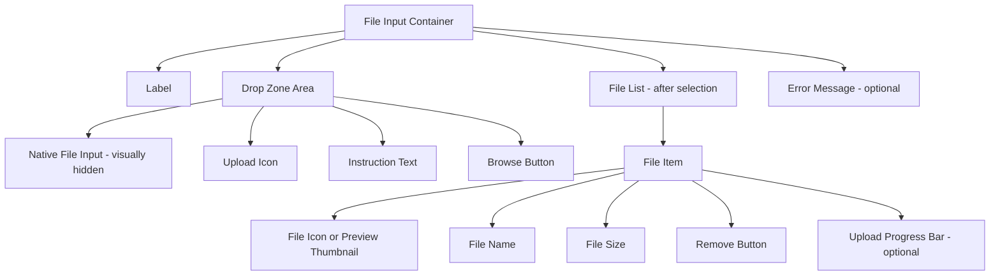

import { Playground } from "@/components/playground";


## Overview

A **File Input** is a form component that allows users to select one or more files from their device's file system and upload them to a server. It ranges from the native `<input type="file">` control to enhanced drop zones with drag-and-drop, file previews, upload progress indicators, and validation feedback.

File inputs appear in document management, profile photo upload, e-commerce product imagery, form attachment flows, and media-rich applications.

<BuildEffort
  level="medium"
  description="Native file input is low effort. Drag-and-drop zone, file previews, progress indicators, and multi-file management require custom JavaScript and careful accessibility attention."
/>

## Use Cases

### When to use:

- **Profile and avatar upload** – Users select a photo for their account.
- **Document submission** – Forms that require attached PDFs, contracts, or ID documents.
- **Media uploads** – Images or videos for social media, e-commerce listings, or galleries.
- **Bulk import** – CSV or JSON files for data import workflows.
- **Email attachments** – Web mail applications.

### When not to use:

- **Camera capture on mobile** – Use `<input type="file" capture="environment">` or `capture="user"` to open the camera directly.
- **Cloud file selection** – Google Drive or Dropbox pickers require their own SDKs.
- **Very large files** – Consider chunked upload APIs rather than a standard form file input.
- **Real-time streaming content** – Not appropriate for live audio/video streams.

<PatternComparison
  current="File Input"
  alternatives={[
    {
      name: "Camera Capture Input",
      path: "/patterns/forms/text-field",
      when: "user should take a new photo rather than select an existing file",
      pros: ["Direct camera access", "No file browsing needed"],
      cons: ["Mobile-only", "No existing file selection"]
    },
    {
      name: "URL Input",
      path: "/patterns/forms/text-field",
      when: "users can link to an existing online resource instead of uploading",
      pros: ["No upload needed", "Instant", "No file size limit"],
      cons: ["Requires user to have a public URL", "External dependency", "No preview of private files"]
    },
    {
      name: "Paste / Clipboard",
      path: "/patterns/forms/text-field",
      when: "users frequently paste screenshots or copied images",
      pros: ["Fast for screenshots", "No file picker needed"],
      cons: ["Limited to clipboard content", "Browser support varies"]
    }
  ]}
/>

## Benefits

- **Standard browser control** – Native file selection dialog is familiar to all users.
- **No upload required** – Client-side preview is possible before upload.
- **Multiple file support** – `multiple` attribute allows batch selection.
- **Accept filter** – `accept` attribute restricts selectable file types.
- **Drag-and-drop enhancement** – Can be enhanced with a drop zone for desktop power users.

## Drawbacks

- **Limited native styling** – `<input type="file">` is notoriously difficult to style consistently.
- **No upload progress** – Native input shows no upload progress; requires XHR/fetch with progress events.
- **No client-side validation preview** – Must implement custom JS for file size/type checks before upload.
- **Mobile UX varies** – Camera vs file picker behavior differs across iOS and Android.
- **Large file risks** – No built-in chunking; large files can fail mid-upload.

## Anatomy



### Component Structure

1. **Container**

   - Wraps all file input elements.
   - Manages drag-over and drop states.

2. **Label**

   - Describes what files are expected: "Upload profile photo", "Attach documents".

3. **Drop Zone**

   - A visually distinct area (dashed border) that accepts drag-and-drop file drops.
   - Contains or wraps the native `<input type="file">` (visually hidden but keyboard accessible).

4. **Native File Input (`<input type="file">`)**

   - The actual browser file picker; visually hidden but functional.
   - `accept` attribute restricts file types.
   - `multiple` attribute enables multi-file selection.
   - Triggered by clicking the drop zone or the styled browse button.

5. **Instruction Text**

   - "Drag and drop files here, or click to browse"
   - Includes accepted file types and size limits.

6. **Browse Button**

   - Visible, styled button that triggers the native file picker.
   - `aria-label="Choose files to upload"` or contextual label.

7. **File List**

   - Appears after files are selected; shows each file with name, size, and remove option.
   - For images: shows a thumbnail preview.

8. **Upload Progress Bar (optional)**

   - `role="progressbar"` with `aria-valuenow`, `aria-valuemin`, `aria-valuemax`, `aria-label`.
   - Updates as upload progresses.

9. **Error Message**

   - File type rejected, file too large, upload failed.
   - Uses `aria-live="polite"` for dynamic announcements.

#### Summary of Components

| Component         | Required? | Purpose                                              |
| ----------------- | --------- | ---------------------------------------------------- |
| Label             | ✅ Yes    | Names the upload field                               |
| Native File Input | ✅ Yes    | Actual file selection mechanism                      |
| Instruction Text  | ✅ Yes    | Communicates constraints and interaction             |
| File List         | ✅ Yes    | Shows selected/uploaded files                        |
| Drop Zone         | ❌ No     | Drag-and-drop enhancement                            |
| Upload Progress   | ❌ No     | Visual feedback during upload                        |
| File Preview      | ❌ No     | Thumbnail for image uploads                          |

## Variations

### Simple File Input

Basic styled file input with a custom browse button.

<Playground patternType="forms" pattern="file-input" example="basic" presentation="hidden-code" />

```html
<div class="file-input">
  <label for="document-upload">Upload document</label>
  <div class="file-input__wrapper">
    <input
      type="file"
      id="document-upload"
      name="document"
      accept=".pdf,.doc,.docx"
      class="file-input__native"
      aria-describedby="doc-help"
    />
    <button
      type="button"
      class="file-input__btn"
      onclick="document.getElementById('document-upload').click()"
    >
      Choose file
    </button>
    <span class="file-input__filename" aria-live="polite">No file chosen</span>
  </div>
  <p id="doc-help" class="file-input__help">Accepted: PDF, DOC, DOCX · Max 10 MB</p>
</div>
```

### Drag-and-Drop Zone

Enhanced drop zone with drag-and-drop support.

```html
<div class="file-input">
  <label id="dropzone-label">Upload files</label>
  <div
    class="file-input__dropzone"
    role="button"
    tabindex="0"
    aria-labelledby="dropzone-label"
    aria-describedby="dropzone-help"
    aria-haspopup="false"
    data-dragging="false"
  >
    <input
      type="file"
      id="file-upload"
      name="files[]"
      multiple
      accept="image/*,.pdf"
      class="file-input__native"
      tabindex="-1"
      aria-hidden="true"
    />
    <div class="file-input__dropzone-content" aria-hidden="true">
      <!-- Upload icon -->
      <svg class="file-input__icon" aria-hidden="true"><!-- ... --></svg>
      <p class="file-input__instruction">
        Drag and drop files here, or
        <span class="file-input__browse-link">browse</span>
      </p>
    </div>
  </div>
  <p id="dropzone-help" class="file-input__help">
    Images or PDFs · Max 5 MB per file · Up to 10 files
  </p>
</div>

<script>
  const dropzone = document.querySelector('.file-input__dropzone');
  const input = document.getElementById('file-upload');

  // Click/keyboard triggers native input
  dropzone.addEventListener('click', () => input.click());
  dropzone.addEventListener('keydown', (e) => {
    if (e.key === 'Enter' || e.key === ' ') {
      e.preventDefault();
      input.click();
    }
  });

  // Drag-and-drop events
  dropzone.addEventListener('dragover', (e) => {
    e.preventDefault();
    dropzone.dataset.dragging = 'true';
  });

  dropzone.addEventListener('dragleave', () => {
    dropzone.dataset.dragging = 'false';
  });

  dropzone.addEventListener('drop', (e) => {
    e.preventDefault();
    dropzone.dataset.dragging = 'false';
    handleFiles(e.dataTransfer.files);
  });

  input.addEventListener('change', () => handleFiles(input.files));
</script>
```

### Multiple File Upload with List

```html
<div class="file-input">
  <label for="multi-upload">Upload images</label>
  <input
    type="file"
    id="multi-upload"
    multiple
    accept="image/*"
    aria-describedby="multi-help"
    class="file-input__native"
  />
  <p id="multi-help" class="file-input__help">JPEG, PNG, WebP · Max 5 MB each · Up to 10 files</p>

  <ul class="file-input__list" aria-label="Selected files" aria-live="polite">
    <!-- Dynamically added file items -->
    <li class="file-input__item">
      
      <div class="file-input__info">
        <span class="file-input__name">photo.jpg</span>
        <span class="file-input__size">2.4 MB</span>
      </div>
      <button
        type="button"
        class="file-input__remove"
        aria-label="Remove photo.jpg"
      >
        &times;
      </button>
    </li>
  </ul>
</div>
```

### With Upload Progress

```html
<div class="file-input__item file-input__item--uploading">
  <div class="file-input__info">
    <span class="file-input__name">contract.pdf</span>
    <span class="file-input__size">1.2 MB</span>
  </div>
  <div
    class="file-input__progress-wrapper"
    role="progressbar"
    aria-valuenow="65"
    aria-valuemin="0"
    aria-valuemax="100"
    aria-label="Uploading contract.pdf: 65%"
  >
    <div class="file-input__progress-bar" style="width: 65%"></div>
  </div>
  <span class="file-input__progress-text" aria-live="polite">65%</span>
</div>
```

### Image-Only with Preview

```html
<div class="file-input file-input--image">
  <label for="avatar-upload">Profile photo</label>
  <div class="file-input__preview-container">
    
    <button
      type="button"
      class="file-input__change-btn"
      aria-label="Change profile photo"
      onclick="document.getElementById('avatar-upload').click()"
    >
      Change photo
    </button>
  </div>
  <input
    type="file"
    id="avatar-upload"
    accept="image/jpeg,image/png,image/webp"
    class="file-input__native"
    aria-describedby="avatar-help"
  />
  <p id="avatar-help" class="file-input__help">JPEG, PNG, or WebP · Minimum 200×200px · Max 5 MB</p>
</div>
```

## Best Practices

### Content & Usability

**Do's ✅**

- Always show accepted file types and maximum size limits in the helper text.
- Display a file list after selection showing file names, sizes, and remove buttons.
- Provide image previews when images are the expected file type.
- Show upload progress for any upload that takes more than 1 second.
- Allow removing individual files from a multi-file selection before uploading.
- Validate file type and size **client-side** before upload to give instant feedback.
- Support drag-and-drop as an enhancement, not as the only upload method.

**Don'ts ❌**

- Don't hide the file name after selection — always show what was chosen.
- Don't start uploading automatically the moment a file is selected; allow users to review and confirm.
- Don't block the upload if JS is disabled — the native `<input type="file">` should still work.
- Don't accept files silently that exceed size limits — inform users immediately.
- Don't use `type="button"` that only works via drag-drop; always provide a click-to-browse fallback.

---

### Accessibility

**Do's ✅**

- Use a visible `<label>` associated with the file input via `for`.
- Make the drop zone operable via keyboard (`Enter`/`Space` to open the file dialog).
- Announce selected file names via `aria-live="polite"` after selection.
- Use `role="progressbar"` with `aria-valuenow`, `aria-valuemin`, `aria-valuemax`, and `aria-label` for progress.
- Announce upload completion and errors via `aria-live`.
- Include the `aria-label` "Remove [filename]" on each remove button for screen readers.

**Don'ts ❌**

- Don't use only drag-and-drop without a keyboard-accessible alternative.
- Don't rely on a button that's visually disconnected from the file input without keyboard support.
- Don't announce file selection progress too frequently — debounce live region updates.

---

### Visual Design

**Do's ✅**

- Use a **dashed border** on the drop zone to communicate droppability.
- Change drop zone appearance (highlighted border, background) during active drag.
- Use file type icons to differentiate PDF, image, and document files in the file list.
- Show a **success state** (green checkmark) after successful upload.
- Show an **error state** (red icon) for failed uploads with a retry option.

**Don'ts ❌**

- Don't make the drop zone the only interactive element — include a visible button.
- Don't use very low contrast on the dashed border (it needs to be visible).
- Avoid making the drop zone tiny — at least 200×100px for comfortable drop area.

---

### Layout & Positioning

**Do's ✅**

- Place the file list below the drop zone, not beside it.
- Show constraints (file types, size limits) directly below the input or inside the drop zone.
- For avatar/image upload, show the current image alongside the upload controls.

**Don'ts ❌**

- Don't place remove buttons far from their corresponding file items.
- Don't collapse the file list into a count only — show individual file names.

## Common Mistakes & Anti-Patterns 🚫

### Client-Side Validation Only

**The Problem:**
Validating file type by extension only on the client allows users (or malicious actors) to rename files and bypass restrictions.

**How to Fix It?** Validate both client-side (for UX) and server-side (for security).

```javascript
// Client-side check (UX only)
function isValidFileType(file, accept) {
  return accept.split(',').some(type => {
    type = type.trim();
    if (type.startsWith('.')) return file.name.endsWith(type);
    if (type.endsWith('/*')) return file.type.startsWith(type.slice(0, -1));
    return file.type === type;
  });
}
```

```python
# Server-side check (security-critical) — Python example
import magic  # python-magic library
allowed_types = ['image/jpeg', 'image/png', 'application/pdf']
mime_type = magic.from_buffer(file_bytes, mime=True)
if mime_type not in allowed_types:
    raise ValueError("Invalid file type")
```

---

### No Upload Feedback for Large Files

**The Problem:**
Users submit a form, see nothing happen for 30 seconds, and assume it is broken. They click submit again, causing duplicate uploads.

**How to Fix It?** Always show upload progress for uploads that will take more than 1 second.

```javascript
const xhr = new XMLHttpRequest();
xhr.upload.addEventListener('progress', (e) => {
  if (e.lengthComputable) {
    const percent = Math.round((e.loaded / e.total) * 100);
    progressBar.setAttribute('aria-valuenow', percent);
    progressBar.style.width = `${percent}%`;
    progressText.textContent = `${percent}%`;
  }
});
```

---

### Not Handling Drop Zone Keyboard Access

**The Problem:**
A drop zone implemented as a `<div>` is not keyboard-accessible, excluding users who cannot use a mouse.

**How to Fix It?** Make the drop zone keyboard operable.

```html
<!-- Good: keyboard-accessible drop zone -->
<div
  class="file-input__dropzone"
  role="button"
  tabindex="0"
  aria-label="Upload files. Press Enter or Space to open file browser."
>
  <!-- ... -->
</div>
```

```javascript
dropzone.addEventListener('keydown', (e) => {
  if (e.key === 'Enter' || e.key === ' ') {
    e.preventDefault();
    fileInput.click();
  }
});
```

---

### Losing Selected Files on Form Validation Failure

**The Problem:**
When a form with a file input fails server-side validation (e.g., a required text field), the file input resets and users must re-select their files.

**How to Fix It?** Store uploaded files server-side on selection (not on submit) using AJAX upload, then reference them by temporary ID. On re-submission, the file is already uploaded.

## Accessibility

### Keyboard Interaction Pattern

| **Key**              | **Action**                                                        |
| -------------------- | ----------------------------------------------------------------- |
| `Tab`                | Moves focus to the file input or drop zone                        |
| `Enter` / `Space`    | Opens the native file browser dialog                              |
| `Tab` (in file list) | Moves focus to the next file item's remove button                 |
| `Enter` / `Space`    | Activates the focused remove button                               |
| `Delete`             | Removes focused file from the selection list (where implemented)  |
| `Escape`             | Cancels an in-progress drag-and-drop operation                    |

## Micro-Interactions & Animations

### Drop Zone Drag-Over State
- **Effect:** Border changes to solid, background lightens, and an "upload here" visual appears
- **Timing:** Immediate (no animation delay)

```css
.file-input__dropzone {
  border: 2px dashed #d1d5db;
  transition: border-color 150ms ease-out, background-color 150ms ease-out;
}

.file-input__dropzone[data-dragging="true"] {
  border-color: #3b82f6;
  background-color: #eff6ff;
}
```

### File Added to List Animation
- **Effect:** New file item slides down and fades in from the top
- **Timing:** 200ms ease-out

```css
@keyframes file-item-enter {
  from { opacity: 0; transform: translateY(-8px); }
  to { opacity: 1; transform: translateY(0); }
}

.file-input__item--new {
  animation: file-item-enter 200ms ease-out;
}
```

### Upload Progress Bar
- **Effect:** Progress bar fills smoothly with `transition: width 200ms ease-in-out`
- **Timing:** 200ms per increment update

```css
.file-input__progress-bar {
  height: 4px;
  background-color: #3b82f6;
  border-radius: 2px;
  transition: width 200ms ease-in-out;
}
```

### Upload Success State
- **Effect:** Progress bar turns green and a checkmark appears; 300ms transition
- **Timing:** 300ms ease-out after upload completion

```css
.file-input__item--success .file-input__progress-bar {
  background-color: #22c55e;
  transition: background-color 300ms ease-out;
}
```

## Tracking

### Key Tracking Points

| **Event Name**                     | **Description**                                            | **Why Track It?**                                       |
| ---------------------------------- | ---------------------------------------------------------- | ------------------------------------------------------- |
| `file_input.files_selected`        | User selects one or more files                             | Measures engagement with upload flow                    |
| `file_input.file_dropped`          | User drops files onto the drop zone                        | Measures drag-and-drop adoption                         |
| `file_input.file_rejected`         | File rejected due to type or size                          | Identifies constraint issues and user confusion         |
| `file_input.upload_started`        | File upload begins                                         | Start of upload funnel                                  |
| `file_input.upload_completed`      | File upload completes successfully                         | Measures upload success rate                            |
| `file_input.upload_failed`         | Upload fails due to network or server error                | Identifies reliability issues                           |
| `file_input.file_removed`          | User removes a selected file before upload                 | Measures reconsideration in file selection              |

### Event Payload Structure

```json
{
  "event": "file_input.upload_completed",
  "properties": {
    "field_id": "document_upload",
    "file_count": 1,
    "file_type": "application/pdf",
    "file_size_bytes": 1258291,
    "upload_duration_ms": 2340,
    "selection_method": "browse",
    "form_id": "onboarding_docs"
  }
}
```

### Key Metrics to Analyze

- **Upload Success Rate** → Percentage of initiated uploads that complete
- **Rejection Rate** → How often files are rejected (type/size violations)
- **Browse vs Drop Rate** → Adoption of drag-and-drop vs click-to-browse
- **Upload Duration** → Average and 95th percentile upload times
- **Retry Rate** → How often users retry after upload failure

## Localization

```json
{
  "file_input": {
    "label": "Upload files",
    "instruction": "Drag and drop files here, or {browse}",
    "browse_link": "browse",
    "accepted_types": "Accepted: {types}",
    "max_size": "Max size: {size}",
    "max_files": "Up to {count} files",
    "selected": "{count} file selected | {count} files selected",
    "no_file": "No file chosen",
    "upload_progress": "Uploading {filename}: {percent}%",
    "upload_complete": "{filename} uploaded successfully",
    "remove": "Remove {filename}",
    "errors": {
      "file_too_large": "{filename} exceeds the maximum size of {max}",
      "invalid_type": "{filename} is not an accepted file type",
      "too_many_files": "Maximum {max} files allowed. {count} files were ignored.",
      "upload_failed": "{filename} failed to upload. Please try again.",
      "network_error": "Upload failed due to a network error. Please check your connection."
    }
  }
}
```

### RTL Language Support

```css
[dir="rtl"] .file-input__item {
  flex-direction: row-reverse;
}

[dir="rtl"] .file-input__remove {
  margin-left: 0;
  margin-right: auto;
}
```

## Performance Metrics

- **File selection dialog open**: < 100ms from click to dialog appearance
- **File preview generation**: < 200ms for image thumbnails (up to 5 MB)
- **Client-side validation**: < 50ms per file
- **Progress bar update**: < 16ms per frame (smooth animation)
- **Memory usage**: < 50KB per file input component; image preview memory managed with `URL.revokeObjectURL()`

## Testing Guidelines

### Functional Testing

**Should ✓**

- [ ] Clicking "browse" opens the native file picker dialog.
- [ ] Dropping files onto the drop zone adds them to the file list.
- [ ] Files exceeding the size limit are rejected with an error message.
- [ ] Files with disallowed types are rejected with an error message.
- [ ] More than the maximum number of files are rejected gracefully.
- [ ] Removing a file from the list updates the upload queue.
- [ ] Upload progress bar updates correctly and shows 100% on completion.

---

### Accessibility Testing

**Should ✓**

- [ ] Screen reader announces file name after selection via `aria-live`.
- [ ] Drop zone is operable via keyboard (`Enter`/`Space`).
- [ ] Remove buttons have `aria-label="Remove [filename]"`.
- [ ] Progress bar has correct ARIA attributes (`role="progressbar"`, `aria-valuenow`).
- [ ] Error messages are announced via `aria-live="polite"` or `aria-live="assertive"`.
- [ ] Focus is managed correctly after removing a file item.

---

### Performance Testing

**Should ✓**

- [ ] Image preview generation does not block the UI for files up to 10 MB.
- [ ] Memory is released (`URL.revokeObjectURL`) after preview images are shown.
- [ ] Multiple file selections (10+ files) do not cause UI jank.
- [ ] Upload progress updates smoothly at 60fps.

---

### Security Testing

**Should ✓**

- [ ] File type validation is performed server-side based on MIME type (not extension only).
- [ ] Uploaded files are scanned for malware before serving to other users.
- [ ] File names are sanitized before storage to prevent path traversal.
- [ ] Maximum file size is enforced server-side.
- [ ] Upload URLs are protected with authentication.

---

### Mobile & Touch Testing

**Should ✓**

- [ ] File picker opens the correct source (camera, gallery, files) based on `accept` attribute.
- [ ] Touch targets for remove buttons are at least 44×44px.
- [ ] Drag-and-drop is gracefully skipped on mobile (where it's not natively supported).
- [ ] File upload works correctly on iOS Safari and Android Chrome.

---

### Edge Cases

**Should ✓**

- [ ] Selecting zero files (canceling the dialog) does not clear previously selected files.
- [ ] Re-selecting the same file after removing it works correctly.
- [ ] Network interruption during upload shows an error with a retry option.
- [ ] Uploading a zero-byte file shows an appropriate error.
- [ ] Filenames with special characters or Unicode are displayed correctly.

<ChecklistDownload patternSlug="file-input" />

## Frequently Asked Questions

<FaqStructuredData
  items={[
    {
      question: "How do I style the native file input to match my design system?",
      answer:
        "The most reliable approach is to visually hide the native input with `opacity: 0; position: absolute;` (not `display: none`, which breaks keyboard access) and create a custom-styled button or drop zone that programmatically triggers the input via `.click()`. Keep the native input in the DOM and accessible by keyboard.",
    },
    {
      question: "How do I implement drag-and-drop file upload?",
      answer:
        "Listen for `dragover` (call `e.preventDefault()` to enable drop), `dragleave`, and `drop` events on your drop zone element. On `drop`, access the files via `e.dataTransfer.files` and pass them to the same handler you use for the native input's `change` event. Always provide a click-to-browse fallback.",
    },
    {
      question: "Should I validate file type by extension or MIME type?",
      answer:
        "Use both. The `accept` attribute uses extensions and MIME types for the file picker filter. Client-side, check `file.type` (MIME type). Server-side, read the file's magic bytes using a library like `python-magic` or `file-type` (Node.js) — never trust the extension or the MIME type claimed by the client alone.",
    },
    {
      question: "How do I show upload progress?",
      answer:
        "Use `XMLHttpRequest` with `xhr.upload.addEventListener('progress', handler)` or the Fetch API with a `ReadableStream`. Update a `role='progressbar'` element's `aria-valuenow` and `style.width` on each progress event. For Fetch, the ReadableStream approach is more complex; many teams continue to use XHR specifically for progress tracking.",
    },
    {
      question: "What happens when a user submits a form and validation fails — does the file input reset?",
      answer:
        "Yes, browser security restrictions prevent pre-populating a file input's value after page reload or form reset. To solve this, upload files immediately on selection (AJAX upload) and store a reference (temporary token or ID) in a hidden input. On form resubmission, the file is already on the server and referenced by the hidden token.",
    },
  ]}
/>

## Related Patterns

<RelatedPatternsCard category="forms" />

## Resources

### Libraries

- [Dropzone.js](https://www.dropzone.dev/) - Popular drag-and-drop upload library
- [Uppy](https://uppy.io/) - Modular file uploader with cloud picker support
- [FilePond](https://pqina.nl/filepond/) - Smooth, accessible file upload component
- [React Dropzone](https://react-dropzone.js.org/) - React hook and component for drag-and-drop

### Design Systems

- [Material Design File Upload](https://material.io/components/file-upload) - Google's file upload guidelines
- [Carbon Design System File Uploader](https://carbondesignsystem.com/components/file-uploader/usage) - IBM file upload component
- [Atlassian Design System](https://atlassian.design/components/file-upload/usage) - Jira/Confluence upload patterns

### Articles & Guides

- [Accessible File Upload](https://www.smashingmagazine.com/2018/09/importance-manual-accessibility-testing/) - Accessibility considerations
- [Drag and Drop API](https://developer.mozilla.org/en-US/docs/Web/API/HTML_Drag_and_Drop_API) - MDN reference
- [File API](https://developer.mozilla.org/en-US/docs/Web/API/File_API) - Browser File API reference
- [XHR Upload Progress](https://developer.mozilla.org/en-US/docs/Web/API/XMLHttpRequest/upload) - Progress event reference

### Tools & Utilities

- [file-type](https://github.com/sindresorhus/file-type) - Detect file type by magic bytes (Node.js)
- [browser-image-compression](https://github.com/Donaldcwl/browser-image-compression) - Client-side image compression before upload
- [Accessibility Checker](https://wave.webaim.org/) - Test file input accessibility
