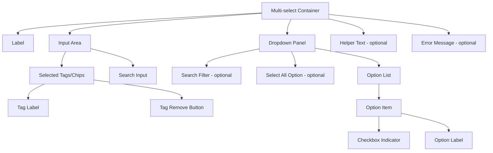

import { Playground } from "@/components/playground";

## Overview

A **Multi-select Input** is a form component that allows users to select multiple items from a predefined set of options. It differs from an autocomplete (which suggests options for freeform entry) by working with a **bounded, known list of options** — users can only select what exists in the list.

The most common visual implementation is a **tag/chip-based selector**: selected items appear as removable tags inside the input field, and remaining options are shown in a dropdown. Additional patterns include checkbox lists, dual listboxes, and native `<select multiple>`.

<BuildEffort
  level="medium"
  description="Tag-based multi-select requires dropdown management, chip rendering, keyboard navigation (Space to select, Backspace to remove last tag), search/filter within options, and select-all behavior."
/>

## Use Cases

### When to use:

- **Category and tag assignment** – Assigning tags, labels, or categories to content.
- **Permissions and role management** – Selecting multiple roles for a user.
- **Filter panels** – Letting users apply multiple filters simultaneously.
- **Recipient selection** – Choosing multiple email recipients from a contact list.
- **Feature selection** – Configuring which features/modules to enable.

### When not to use:

- **Freeform text with suggestions** – Use [Autocomplete](/patterns/forms/autocomplete) instead.
- **Single selection from a small list** – Use a [Select/Dropdown](/patterns/forms/selection-input) or [Radio](/patterns/forms/radio) group.
- **Binary choices** – Use [Checkboxes](/patterns/forms/checkbox).
- **Very large option sets (> 1000 items)** – Use a virtualized list or search-first approach.

<PatternComparison
  current="Multi-select Input"
  alternatives={[
    {
      name: "Checkbox List",
      path: "/patterns/forms/checkbox",
      when: "the number of options is small (< 10) and all should be visible at once",
      pros: ["All options visible", "Native accessible", "No dropdown needed"],
      cons: ["Space-intensive", "Poor for many options", "No tag visualization"]
    },
    {
      name: "Autocomplete",
      path: "/patterns/forms/autocomplete",
      when: "users need to search through a large dataset and can also create new values",
      pros: ["Handles large datasets", "Supports freeform entry", "Fuzzy search"],
      cons: ["Open-ended — options aren't bounded", "More complex", "Can suggest wrong items"]
    },
    {
      name: "Native Select Multiple",
      path: "/patterns/forms/selection-input",
      when: "simplicity is critical and the number of items is small",
      pros: ["Zero implementation cost", "Accessible by default"],
      cons: ["Notoriously bad UX", "Non-intuitive Ctrl+click", "Inconsistent styling"]
    }
  ]}
/>

## Benefits

- **Visual selection summary** – Tags/chips show all selected items at a glance.
- **Easy deselection** – Users can remove individual items without reopening the dropdown.
- **Search/filter** – Inline search reduces time to find options in large lists.
- **Select All** – Users can select all options with one action.
- **Keyboard-first** – Full keyboard navigation supports power users.

## Drawbacks

- **Complex implementation** – Tag management, dropdown positioning, keyboard events, and ARIA all require careful coordination.
- **Limited space** – Many selected items can overflow the input, requiring line-wrapping or a count badge.
- **Discoverability** – Users may not realize they can select multiple items without a clear affordance.
- **Mobile UX** – Small tags are difficult to remove on touch screens; dropdown behavior differs from desktop.

## Anatomy



### Component Structure

1. **Container**

   - Manages focus, open/close state, and dropdown positioning.
   - `role="combobox"` with `aria-expanded` and `aria-haspopup="listbox"`.

2. **Label**

   - Describes the purpose: "Tags", "Assign roles", "Select skills".
   - Associated with the trigger/input via `for`.

3. **Input Area (Tag Container + Text Input)**

   - Displays selected items as tags.
   - Contains an inline text input for filtering options.
   - Clicking anywhere in the area focuses the text input and opens the dropdown.

4. **Tag/Chip**

   - Represents each selected item visually.
   - Contains the item label and a remove (×) button.
   - Remove button: `aria-label="Remove [item name]"`.

5. **Dropdown Panel (`role="listbox"`)**

   - Opens below (or above) the input area.
   - Contains the list of available options.
   - `aria-multiselectable="true"`.

6. **Option Item (`role="option"`)**

   - Each selectable item in the dropdown.
   - `aria-selected="true"` for already-selected items.
   - Often includes a checkbox indicator for visual clarity.

7. **Select All Option (optional)**

   - First item in the list: "Select all" or "Select all (N)".
   - `aria-selected` reflects the aggregate state.

8. **Helper Text / Error Message**

   - Optional guidance or validation feedback.

#### Summary of Components

| Component         | Required? | Purpose                                            |
| ----------------- | --------- | -------------------------------------------------- |
| Label             | ✅ Yes    | Names the multi-select component                   |
| Tag Container     | ✅ Yes    | Shows selected items as removable tags             |
| Text Input        | ✅ Yes    | Filters options and receives keyboard input        |
| Dropdown Panel    | ✅ Yes    | Shows available options                            |
| Option Items      | ✅ Yes    | Selectable options list                            |
| Select All        | ❌ No     | Quick select/deselect all                          |
| Search Input      | ❌ No     | Filter options in large lists                      |

## Variations

### Basic Multi-select with Tags

Standard implementation with tag-based visual selection.

<Playground patternType="forms" pattern="multi-select-input" example="basic" presentation="hidden-code" />

```html
<div class="multi-select" id="skills-select">
  <label id="skills-label" for="skills-input">Skills</label>
  <div
    class="multi-select__input-area"
    role="combobox"
    aria-expanded="false"
    aria-haspopup="listbox"
    aria-labelledby="skills-label"
    aria-owns="skills-listbox"
  >
    <!-- Selected tags rendered here -->
    <span class="multi-select__tag">
      <span class="multi-select__tag-label">React</span>
      <button
        type="button"
        class="multi-select__tag-remove"
        aria-label="Remove React"
      >&times;</button>
    </span>

    <input
      type="text"
      id="skills-input"
      class="multi-select__search"
      placeholder="Add skills..."
      autocomplete="off"
      aria-autocomplete="list"
      aria-controls="skills-listbox"
      aria-activedescendant=""
    />
  </div>

  <ul
    id="skills-listbox"
    class="multi-select__dropdown"
    role="listbox"
    aria-multiselectable="true"
    aria-label="Skills options"
    hidden
  >
    <li
      id="skill-react"
      role="option"
      aria-selected="true"
      class="multi-select__option multi-select__option--selected"
    >
      <span class="multi-select__checkbox" aria-hidden="true">✓</span>
      React
    </li>
    <li
      id="skill-typescript"
      role="option"
      aria-selected="false"
      class="multi-select__option"
    >
      <span class="multi-select__checkbox" aria-hidden="true"></span>
      TypeScript
    </li>
    <!-- More options -->
  </ul>
</div>
```

### With Select All

```html
<ul id="tags-listbox" role="listbox" aria-multiselectable="true" aria-label="Tag options" hidden>
  <li
    id="select-all"
    role="option"
    aria-selected="false"
    class="multi-select__option multi-select__option--select-all"
  >
    <span class="multi-select__checkbox" aria-hidden="true"></span>
    Select all (12)
  </li>
  <li role="separator" aria-hidden="true" class="multi-select__divider"></li>
  <!-- Individual options -->
</ul>
```

### Checkbox List (Inline Variant)

For smaller option sets where all options should always be visible.

```html
<fieldset class="multi-select multi-select--checkbox">
  <legend>Notification preferences</legend>
  <div class="multi-select__checkbox-list">
    <label class="multi-select__checkbox-item">
      <input type="checkbox" name="notifications[]" value="email" checked />
      <span>Email notifications</span>
    </label>
    <label class="multi-select__checkbox-item">
      <input type="checkbox" name="notifications[]" value="sms" />
      <span>SMS notifications</span>
    </label>
    <label class="multi-select__checkbox-item">
      <input type="checkbox" name="notifications[]" value="push" />
      <span>Push notifications</span>
    </label>
  </div>
</fieldset>
```

### With Count Badge (Many Selections)

When many items are selected, show a count badge instead of overflowing tags.

```html
<div class="multi-select__input-area">
  <!-- First 2 tags shown inline -->
  <span class="multi-select__tag">React <button aria-label="Remove React">&times;</button></span>
  <span class="multi-select__tag">TypeScript <button aria-label="Remove TypeScript">&times;</button></span>
  <!-- Overflow count -->
  <span
    class="multi-select__overflow-badge"
    aria-label="3 more selected: Vue, Angular, Svelte"
  >+3 more</span>
  <input type="text" class="multi-select__search" placeholder="Search..." />
</div>
```

### With Custom Tag Rendering

For selections that include additional metadata (e.g., avatars for user selection).

```html
<div class="multi-select__input-area">
  <span class="multi-select__tag multi-select__tag--user">
    
    <span class="multi-select__tag-label">Jane Doe</span>
    <button type="button" class="multi-select__tag-remove" aria-label="Remove Jane Doe">&times;</button>
  </span>
</div>
```

## Best Practices

### Content & Usability

**Do's ✅**

- Display selected items as removable tags inside the input for visual clarity.
- Offer search/filter when the option list exceeds 10 items.
- Provide a "Select all" option when users commonly need all options.
- Show the count of selected items when many are selected (e.g., "5 selected").
- Remove a tag immediately when the user clicks its × button without a confirmation step.
- Allow `Backspace` to remove the last tag when the search input is empty.
- Highlight the active/focused option in the dropdown.
- Close the dropdown when a user clicks outside the component or presses `Escape`.

**Don'ts ❌**

- Don't use `<select multiple>` — the Ctrl+click interaction is unintuitive and inaccessible.
- Don't remove the search input for lists over 10 items.
- Don't prevent users from deselecting a "required" minimum number without a helpful error message.
- Don't close the dropdown after each selection — keep it open for multi-selection efficiency.
- Don't show all selected tags inline if there are more than 5 — use an overflow badge.

---

### Accessibility

**Do's ✅**

- Use `role="combobox"` on the input container with `aria-expanded`, `aria-haspopup="listbox"`, and `aria-controls` pointing to the listbox.
- Use `role="listbox"` with `aria-multiselectable="true"` on the dropdown.
- Use `role="option"` with `aria-selected="true/false"` on each item.
- Set `aria-activedescendant` to the ID of the currently focused option.
- Give each tag remove button a unique `aria-label="Remove [item name]"`.
- Announce the count of selected items via `aria-live="polite"` when it changes.
- Announce when all items are selected / deselected.

**Don'ts ❌**

- Don't use `aria-hidden` on the selected tags — they need to be readable by screen readers.
- Don't omit `aria-selected` on options — it is required for the listbox pattern.
- Don't rely on visual-only checkboxes inside options without an `aria-selected` state.

---

### Visual Design

**Do's ✅**

- Style tags with sufficient contrast and a clear × remove target (min 24×24px).
- Use a subtle checkbox or checkmark inside each option for visual confirmation of selected state.
- Differentiate the "selected" state in the dropdown (checkmark, filled checkbox, bold text).
- Use a consistent color between the tags and the highlighted option in the dropdown.

**Don'ts ❌**

- Don't make remove buttons in tags too small to click or tap accurately.
- Don't use color alone to indicate selected vs unselected options.
- Avoid excessive visual weight on individual tags — they should feel lightweight.

---

### Layout & Positioning

**Do's ✅**

- Allow the tag container to grow vertically as more items are selected (wrap tags to new lines).
- Position the dropdown directly below the input area, aligned to its left edge.
- Use smart positioning: flip dropdown above the input if it would overflow below the viewport.
- On mobile, use a bottom sheet or modal for the option list.

**Don'ts ❌**

- Don't let the tag container grow unboundedly without a max height and scroll.
- Don't show the dropdown horizontally — it should always be a vertical list.

## Common Mistakes & Anti-Patterns 🚫

### Using `<select multiple>`

**The Problem:**
Native `<select multiple>` requires Ctrl+Click (or Cmd+Click) to select multiple items, which is an unintuitive interaction that most users are unaware of.

```html
<!-- Bad: Requires Ctrl+click — users don't know this -->
<select multiple name="skills[]">
  <option>React</option>
  <option>TypeScript</option>
</select>
```

**How to Fix It?** Use a custom multi-select component with checkboxes or a tag-based UI.

---

### Closing the Dropdown After Each Selection

**The Problem:**
If the dropdown closes every time the user selects an option, they must reopen it for each additional selection — significantly slowing down multi-item workflows.

**How to Fix It?** Keep the dropdown open after selection; close only on `Escape` or external click.

```javascript
option.addEventListener('click', (e) => {
  e.stopPropagation(); // Prevent close-on-outside-click from triggering
  toggleOptionSelection(option);
  updateTags();
  searchInput.focus(); // Keep focus in the input
  // DO NOT close the dropdown here
});
```

---

### Not Handling Backspace for Tag Removal

**The Problem:**
Users expect `Backspace` in an empty search input to remove the last selected tag. Omitting this makes the component feel incomplete and forces mouse usage.

**How to Fix It?** Listen for `keydown` on the search input.

```javascript
searchInput.addEventListener('keydown', (e) => {
  if (e.key === 'Backspace' && searchInput.value === '') {
    const lastTag = getLastSelectedItem();
    if (lastTag) {
      removeSelection(lastTag);
    }
  }
});
```

---

### Missing `aria-activedescendant` During Keyboard Navigation

**The Problem:**
Without `aria-activedescendant` pointing to the currently focused option, screen readers cannot announce which option the user is navigating to.

**How to Fix It?** Update `aria-activedescendant` on the combobox input whenever the focused option changes.

```javascript
function focusOption(optionElement) {
  options.forEach(opt => opt.classList.remove('multi-select__option--focused'));
  optionElement.classList.add('multi-select__option--focused');
  searchInput.setAttribute('aria-activedescendant', optionElement.id);
}
```

## Accessibility

### Keyboard Interaction Pattern

| **Key**              | **Action**                                                              |
| -------------------- | ----------------------------------------------------------------------- |
| `Tab`                | Moves focus to the multi-select input; `Shift+Tab` moves backward       |
| `Down Arrow`         | Opens the dropdown; moves focus down through options                    |
| `Up Arrow`           | Moves focus up through options                                          |
| `Enter`              | Selects / deselects the focused option                                  |
| `Space`              | Selects / deselects the focused option (same as Enter in listbox)       |
| `Escape`             | Closes the dropdown without changing selection                          |
| `Backspace`          | When search input is empty, removes the last selected tag               |
| `Home`               | Moves focus to the first option in the dropdown                         |
| `End`                | Moves focus to the last option in the dropdown                          |
| `Ctrl + A`           | Selects all options (if Select All is implemented)                      |
| `Delete`             | Removes the focused tag (when focus is on a tag's remove button)        |

## Micro-Interactions & Animations

### Tag Addition Animation
- **Effect:** New tag appears with a scale-in animation from 0.85 → 1.0
- **Timing:** 150ms ease-out

```css
@keyframes tag-appear {
  from { opacity: 0; transform: scale(0.85); }
  to { opacity: 1; transform: scale(1); }
}

.multi-select__tag--new {
  animation: tag-appear 150ms ease-out;
}
```

### Tag Removal Animation
- **Effect:** Tag shrinks and fades out before being removed from the DOM
- **Timing:** 100ms ease-in

```css
@keyframes tag-disappear {
  to { opacity: 0; transform: scale(0.85); width: 0; padding: 0; margin: 0; }
}

.multi-select__tag--removing {
  animation: tag-disappear 100ms ease-in forwards;
}
```

### Dropdown Open/Close
- **Effect:** Dropdown slides down 6px and fades in; reverse on close
- **Timing:** 150ms ease-out open

```css
@keyframes dropdown-open {
  from { opacity: 0; transform: translateY(-4px); }
  to { opacity: 1; transform: translateY(0); }
}

.multi-select__dropdown:not([hidden]) {
  animation: dropdown-open 150ms ease-out;
}
```

### Option Hover State
- **Effect:** Smooth background-color transition on option hover
- **Timing:** 80ms ease-out

```css
.multi-select__option {
  transition: background-color 80ms ease-out;
}

.multi-select__option:hover,
.multi-select__option--focused {
  background-color: #eff6ff;
}
```

## Tracking

### Key Tracking Points

| **Event Name**                      | **Description**                                           | **Why Track It?**                                        |
| ----------------------------------- | --------------------------------------------------------- | -------------------------------------------------------- |
| `multi_select.opened`               | Dropdown opened                                           | Measures engagement with the component                   |
| `multi_select.option_selected`      | User selects an option                                    | Tracks selection behavior                                |
| `multi_select.option_deselected`    | User deselects an option                                  | Tracks correction behavior                               |
| `multi_select.tag_removed`          | User removes a tag via the × button or Backspace          | Measures correction after selection                      |
| `multi_select.select_all_used`      | User uses "Select All"                                    | Measures adoption of bulk selection shortcut             |
| `multi_select.search_used`          | User types in the search filter                           | Measures usage of search/filter functionality            |
| `multi_select.closed_empty`         | Dropdown closed without any selection                     | Measures abandonment within the component                |

### Event Payload Structure

```json
{
  "event": "multi_select.option_selected",
  "properties": {
    "field_id": "user_skills",
    "option_value": "typescript",
    "option_label": "TypeScript",
    "selected_count": 3,
    "selection_method": "keyboard",
    "search_query": "type"
  }
}
```

### Key Metrics to Analyze

- **Average Selection Count** → How many items users typically select
- **Search Usage Rate** → How often users type to filter options
- **Select All Usage** → Adoption of bulk selection shortcut
- **Backspace Tag Removal Rate** → Keyboard-native user ratio
- **Dropdown Abandonment Rate** → Opened but nothing selected

## Localization

```json
{
  "multi_select": {
    "placeholder": "Select {label}...",
    "search_placeholder": "Search options...",
    "no_options": "No options found",
    "no_results": "No results for \"{query}\"",
    "select_all": "Select all ({count})",
    "deselect_all": "Deselect all",
    "selected_count": "{count} selected",
    "overflow_badge": "+{count} more",
    "overflow_aria": "+{count} more selected: {names}",
    "tag_remove": "Remove {name}",
    "clear_all": "Clear all selections",
    "loading": "Loading options...",
    "errors": {
      "required": "Please select at least one option",
      "min_selections": "Please select at least {min} options",
      "max_selections": "You can select up to {max} options"
    }
  }
}
```

### RTL Language Support

```css
[dir="rtl"] .multi-select__input-area {
  flex-direction: row-reverse;
  flex-wrap: wrap-reverse;
}

[dir="rtl"] .multi-select__tag {
  flex-direction: row-reverse;
}

[dir="rtl"] .multi-select__dropdown {
  right: 0;
  left: auto;
}
```

## Performance Metrics

- **Dropdown open time**: < 100ms
- **Option filtering (search)**: < 50ms for lists up to 1000 items
- **Tag addition rendering**: < 16ms (one frame)
- **Select All operation**: < 50ms for 100 items
- **Memory per instance**: < 15KB for component; virtualize options list for > 500 items

## Testing Guidelines

### Functional Testing

**Should ✓**

- [ ] Clicking an option adds it to the tag list and marks it selected in the dropdown.
- [ ] Clicking a selected option deselects it and removes its tag.
- [ ] The × button on a tag removes that item from the selection.
- [ ] Backspace in an empty search input removes the last tag.
- [ ] Select All selects all options; a second click deselects all.
- [ ] The search input filters available options in real time.
- [ ] Pressing Escape closes the dropdown without changing selection.
- [ ] Clicking outside the component closes the dropdown.

---

### Accessibility Testing

**Should ✓**

- [ ] Screen reader announces each option as selected/deselected when toggled.
- [ ] `aria-activedescendant` updates as keyboard focus moves through options.
- [ ] Tags have an announced remove button ("Remove [name]").
- [ ] `aria-live` region announces the total count when it changes.
- [ ] The dropdown has `role="listbox"` with `aria-multiselectable="true"`.
- [ ] All options have `role="option"` with `aria-selected="true/false"`.
- [ ] Component is navigable with keyboard only (no mouse required).

---

### Performance Testing

**Should ✓**

- [ ] Searching through 200+ options responds in under 50ms.
- [ ] Tag animations run at 60fps.
- [ ] No layout shift when the tag container grows to multiple lines.
- [ ] Components with 50+ selected tags render without degraded performance.

---

### Security Testing

**Should ✓**

- [ ] Option values are sanitized before rendering as tag labels (prevent XSS).
- [ ] Server-side validation enforces minimum and maximum selection counts.
- [ ] Submitting manipulated option values server-side is handled gracefully.

---

### Mobile & Touch Testing

**Should ✓**

- [ ] Tag remove buttons are at least 44×44px on mobile.
- [ ] The dropdown or bottom sheet is usable on screens as narrow as 320px.
- [ ] Touch scrolling within the dropdown list works correctly.
- [ ] Search input on mobile opens the keyboard and filters options.

---

### Edge Cases

**Should ✓**

- [ ] Typing in search when all options are already selected shows "All options selected".
- [ ] Removing all tags one by one leaves the component in a valid empty state.
- [ ] Options with very long labels truncate gracefully in tags and dropdown.
- [ ] Options with special characters (HTML entities) render correctly.
- [ ] Maximum selection limit prevents selecting beyond the allowed count with a clear message.

<ChecklistDownload patternSlug="multi-select-input" />

## Frequently Asked Questions

<FaqStructuredData
  items={[
    {
      question: "What is the difference between a multi-select and an autocomplete?",
      answer:
        "A multi-select works with a bounded, predefined list of options — users can only select from what exists. An autocomplete suggests options from a dataset as the user types and may also allow creating new values. Use multi-select when the option list is fixed and known; use autocomplete when users need to search a large dataset or enter freeform values.",
    },
    {
      question: "Should I use checkboxes or tags for multi-select?",
      answer:
        "Use a tag-based UI when you want to show selected items compactly inside the input field and allow inline removal. Use a checkbox list when the number of options is small (< 10) and all options should always be visible without a dropdown. For reporting filters and analytics dashboards, tags with a dropdown are typically preferred.",
    },
    {
      question: "How do I implement keyboard navigation for a custom multi-select?",
      answer:
        "Follow the ARIA Combobox pattern: `role='combobox'` on the input with `aria-haspopup='listbox'` and `aria-expanded`. Use `role='listbox'` on the dropdown with `aria-multiselectable='true'`, and `role='option'` on each item with `aria-selected`. Handle Arrow keys to navigate, Enter/Space to toggle, Escape to close, and Backspace to remove the last tag when the input is empty.",
    },
    {
      question: "How do I handle a very large list of options (500+)?",
      answer:
        "Always provide a search/filter input. Implement virtual rendering (render only visible options in the DOM) to maintain performance. Consider lazy-loading options from an API as the user types rather than loading all options upfront. Limit the maximum visible options in the dropdown to 8–10 and allow scrolling within the list.",
    },
    {
      question: "How should a multi-select behave when the form has a minimum selection requirement?",
      answer:
        "Allow the user to deselect items freely, but show a validation error when the form is submitted with fewer than the required minimum. Do not prevent removal of items in real-time as it blocks correction workflows. Announce the minimum requirement in the helper text (e.g., 'Select at least 2 skills') and show it as an error on submit.",
    },
  ]}
/>

## Related Patterns

<RelatedPatternsCard category="forms" />

## Resources

### References

- [WCAG 2.2](https://www.w3.org/TR/WCAG22/) - Accessibility baseline for keyboard support, focus management, and readable state changes.
- [MDN select element](https://developer.mozilla.org/en-US/docs/Web/HTML/Reference/Elements/select) - Native selection control behavior, labels, and grouped options.

### Guides

- [Chrome Developers: customizable select](https://developer.chrome.com/blog/rfc-customizable-select) - Current platform direction for improving flexible, accessible select experiences.

### Articles

- [Adrian Roselli: Under-engineered multi-selects](https://adrianroselli.com/2022/05/under-engineered-multi-selects.html) - Implementation guidance for selection UIs that stay usable with keyboard and assistive tech.
- [Baymard: Multi-select listbox usability](https://baymard.com/blog/multi-select-listbox) - Research on discoverability and interaction cost in multi-select controls.

### NPM Packages

- [`react-select`](https://www.npmjs.com/package/react-select) - Flexible combobox and async selection building blocks.
- [`downshift`](https://www.npmjs.com/package/downshift) - Headless combobox, autocomplete, and selection primitives.
- [`react-aria-components`](https://www.npmjs.com/package/react-aria-components) - Headless accessible components covering many form and overlay patterns.
