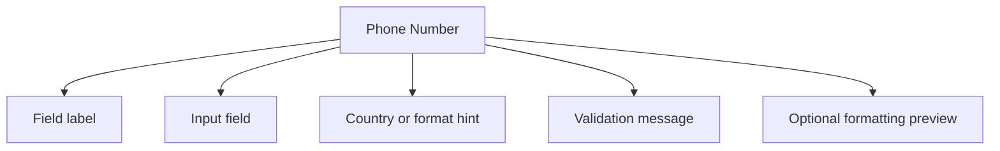

## Overview

A **Phone Number** pattern helps teams create a reliable way to collect telephone numbers in a format that is easy to enter, easy to review, and realistic for international use. It is most useful when teams need contact and delivery forms.

Compared with adjacent patterns, this pattern should reduce friction without hiding the state, rules, or recovery paths people need to keep moving.

<BuildEffort
  level="medium"
  description="Requires structured state, keyboard handling, and resilient feedback for format and validate phone numbers."
/>

## Use Cases

### When to use:

- Contact and delivery forms
- Verification and MFA setup
- Support or profile forms with international audiences

### When not to use:

- Use a simpler native control when the value is binary, tiny, or fully constrained.
- Avoid custom behavior when a native browser input already solves the main job well.
- Do not add extra formatting or validation if the product does not benefit from it.

### Common scenarios and examples

- Contact and delivery forms where users need a clear, repeatable interface model.
- Verification and MFA setup where users need a clear, repeatable interface model.
- Support or profile forms with international audiences where users need a clear, repeatable interface model.

<PatternComparison
  alternatives={[
  {
    "name": "Text Field",
    "path": "/patterns/forms/text-field",
    "when": "users need text field instead of phone number as the primary interaction",
    "pros": [
      "Clearer fit for its own job",
      "Lower ambiguity about the expected interaction"
    ],
    "cons": [
      "Less specialized for phone number",
      "Different states and recovery paths to teach"
    ]
  },
  {
    "name": "Selection Input",
    "path": "/patterns/forms/selection-input",
    "when": "users need selection input instead of phone number as the primary interaction",
    "pros": [
      "Clearer fit for its own job",
      "Lower ambiguity about the expected interaction"
    ],
    "cons": [
      "Less specialized for phone number",
      "Different states and recovery paths to teach"
    ]
  },
  {
    "name": "Form Validation",
    "path": "/patterns/forms/form-validation",
    "when": "users need form validation instead of phone number as the primary interaction",
    "pros": [
      "Clearer fit for its own job",
      "Lower ambiguity about the expected interaction"
    ],
    "cons": [
      "Less specialized for phone number",
      "Different states and recovery paths to teach"
    ]
  }
]}
/>

## Benefits

- Clarifies how phone number should behave before implementation details begin to sprawl.
- Creates a reusable interaction model for teams who need to collect telephone numbers in a format that is easy to enter, easy to review, and realistic for international use.
- Makes accessibility, edge cases, and recovery paths part of the design instead of post-launch cleanup.
- Gives product, design, and engineering a shared language for evaluating trade-offs.

## Drawbacks

- It introduces more states to design and test than a plain text field.
- Validation timing can feel noisy when the pattern reacts too early.
- Mobile input modes and autofill behavior often need explicit tuning.
- If labels, hints, and errors drift apart, completion rates drop quickly.

## Anatomy



### Component Structure

1. **Field label**

- Explains whether the number is for mobile, work, or verification.

2. **Input field**

- Captures the number with the right input mode.

3. **Country or format hint**

- Clarifies how the number should be interpreted.

4. **Validation message**

- Explains whether the number is incomplete or invalid.

5. **Optional formatting preview**

- Shows the normalized version before submission.

#### Summary of Components

| Component | Required? | Purpose |
| --- | --- | --- |
| Field label | ✅ Yes | Explains whether the number is for mobile, work, or verification. |
| Input field | ✅ Yes | Captures the number with the right input mode. |
| Country or format hint | ❌ No | Clarifies how the number should be interpreted. |
| Validation message | ✅ Yes | Explains whether the number is incomplete or invalid. |
| Optional formatting preview | ❌ No | Shows the normalized version before submission. |

## Variations

### Local-only phone field

Assumes one national format.

**When to use:** Use when the audience is clearly bound to a single country.

### International phone field

Pairs the number with country context.

**When to use:** Use when users come from several regions.

### Verification phone field

Adds confirmation and resend flows after entry.

**When to use:** Use when the number drives MFA or delivery updates.

## Examples

### Live Preview

<Playground patternType="forms" pattern="phone-number" example="basic" presentation="hidden-code" />

### Basic Implementation

```html
<div class="demo-shell">
  <div class="card form-card">
    <label for="demo-input">Mobile number</label>
    <input id="demo-input" type="tel" placeholder="+1 (555) 123-4567" />
    <p class="helper">Include the country code when numbers may come from different regions.</p>
    
  </div>
</div>
```

### What this example demonstrates

- A clear baseline implementation of phone number that can be reviewed without framework-specific noise.
- Visible state, spacing, and content hierarchy that mirror the implementation guidance above.
- A small enough surface to copy into a design review or prototype before scaling the pattern up.

### Implementation Notes

- Start with [semantic HTML](/glossary/semantic-html) and only add JavaScript where the interaction truly requires it.
- Keep styling tokens and spacing consistent with adjacent controls or layouts.
- If the live implementation introduces async behavior, mirror those states in the code example rather than documenting them only in prose.
## Best Practices

### Content

**Do's ✅**

- Lead with a clear label that tells users exactly what belongs in the field.
- Keep helper text short and move edge-case guidance into secondary copy.
- Use examples only when they remove real ambiguity for the person typing.

**Don'ts ❌**

- Do not rely on placeholder text as the only instruction.
- Do not stack multiple competing messages above and below the control.
- Do not hide required constraints until after submission if they are easy to explain upfront.

### Accessibility

**Do's ✅**

- Verify that phone number can be completed using keyboard alone.
- Keep focus order logical when the pattern opens, updates, or reveals additional UI.
- Preserve a visible focus state that is still readable at high zoom.
- Use semantic elements first, then add ARIA only where semantics alone are not enough.
- Announce state changes such as errors, loading, or completion in the right place and with the right politeness.

**Don'ts ❌**

- Do not remove focus styles without a visible replacement.
- Do not depend on placeholder or helper text that disappears before the user can act on it.
- Do not assume pointer, touch, and assistive technologies will all interact with the pattern the same way.

### Visual Design

**Do's ✅**

- Keep spacing consistent between label, control, helper text, and validation.
- Reserve space for error states so the layout does not jump.
- Use state colors as reinforcement, not as the only cue.

**Don'ts ❌**

- Do not use tiny hit targets for touch devices.
- Do not depend on subtle borders that disappear in low-contrast environments.
- Do not overload the field chrome with too many icons or badges.

### Layout & Positioning

**Do's ✅**

- Align the control with the rest of the form so users can scan vertically.
- Support narrow mobile widths before adding side-by-side layouts.
- Keep primary actions close enough that users understand which field set they submit.

**Don'ts ❌**

- Do not move validation messages far from the field that caused them.
- Do not switch label position between breakpoints without a strong reason.
- Do not collapse key guidance into tooltips that are hard to revisit.

## Common Mistakes & Anti-Patterns 🚫

### **Using the wrong validation moment**

**The Problem:**
Immediate validation on partial input makes the pattern feel punitive and noisy.

**How to Fix It?**
Wait until the user has enough information in the field, then validate on blur, pause, or submit depending on the risk of the rule.

---

### **Separating labels, hints, and errors**

**The Problem:**
People cannot tell which message belongs to which control when the copy is visually detached.

**How to Fix It?**
Keep labels, helper text, and validation messages tightly grouped and connected with `aria-describedby` where appropriate.

---

### **Forgetting touch and autofill behavior**

**The Problem:**
Desktop-only styling hides the fact that mobile keyboards, autofill, and paste flows behave differently.

**How to Fix It?**
Test the control with autofill, paste, zoom, and on-screen keyboards before calling the pattern complete.

## Accessibility

### Keyboard Interaction

- [ ] Verify that phone number can be completed using keyboard alone.
- [ ] Keep focus order logical when the pattern opens, updates, or reveals additional UI.
- [ ] Preserve a visible focus state that is still readable at high zoom.

### Screen Reader Support

- [ ] Use semantic elements first, then add ARIA only where semantics alone are not enough.
- [ ] Announce state changes such as errors, loading, or completion in the right place and with the right politeness.
- [ ] Connect labels, hints, and status text with `aria-describedby` or structural headings when useful.

### Visual Accessibility

- [ ] Do not rely on color alone to convey severity, completion, or selection state.
- [ ] Test the pattern at 200% zoom and with reduced motion enabled.
- [ ] Ensure [touch targets](/glossary/touch-targets) remain comfortable on mobile and coarse pointers.
## Validation Rules

### What to validate

- Validate the value against the rules users can act on inside phone number.
- Check required, format, and boundary constraints separately so messages stay specific.
- Run server-side validation again for any rule that affects security, billing, or data integrity.

### When to validate

- Prefer quiet validation while the user is still composing, then stronger validation on blur or submit.
- Avoid showing an error before the user has entered enough characters to satisfy the rule fairly.
- Keep successful states subtle so the field does not become visually noisy.

## Error Handling

- Preserve the entered value after an error so people can correct rather than retype.
- Explain the next step in the error copy instead of only naming the rule that failed.
- If a server-side rule fails after submit, return focus to the first affected control and summarize the issue near the action area.

## Testing Guidelines

### Functional Testing

- [ ] Verify the default, loading, error, and success states for phone number.
- [ ] Test the primary action and the obvious recovery action in the same run.
- [ ] Confirm that state survives refresh, navigation, or retry in the way users would expect.

### Accessibility Testing

- [ ] Run keyboard-only checks and at least one [screen reader](/glossary/screen-reader) pass on the final implementation.
- [ ] Validate headings, labels, and announcement behavior with real content rather than lorem ipsum.
- [ ] Check color contrast and focus visibility in both default and stressed states.
### Edge Cases

- [ ] Test empty, long, duplicated, and unexpectedly formatted content.
- [ ] Check behavior on narrow screens, zoomed layouts, and slower networks.
- [ ] Verify that optimistic or asynchronous states reconcile correctly after a failure.

## Design Tokens

These [design tokens](/glossary/design-tokens) provide a starting point for implementing phone number in a systemized UI layer.

```json
{
  "$schema": "https://design-tokens.org/schema.json",
  "phoneNumber": {
    "container": {
      "gap": {
        "value": "0.75rem",
        "type": "dimension"
      }
    },
    "label": {
      "color": {
        "value": "{color.gray.900}",
        "type": "color"
      },
      "fontWeight": {
        "value": "600",
        "type": "number"
      }
    },
    "control": {
      "borderRadius": {
        "value": "0.75rem",
        "type": "dimension"
      },
      "borderColor": {
        "value": "{color.gray.300}",
        "type": "color"
      },
      "paddingInline": {
        "value": "0.875rem",
        "type": "dimension"
      },
      "paddingBlock": {
        "value": "0.75rem",
        "type": "dimension"
      }
    },
    "helperText": {
      "color": {
        "value": "{color.gray.600}",
        "type": "color"
      },
      "fontSize": {
        "value": "0.875rem",
        "type": "dimension"
      }
    },
    "validation": {
      "successColor": {
        "value": "{color.green.700}",
        "type": "color"
      },
      "errorColor": {
        "value": "{color.red.700}",
        "type": "color"
      },
      "warningColor": {
        "value": "{color.amber.700}",
        "type": "color"
      }
    }
  }
}
```

## Frequently Asked Questions

<FaqStructuredData
  items={[
  {
    "question": "When should I choose Phone Number instead of Text Field?",
    "answer": "Choose phone number when the job depends on collect telephone numbers in a format that is easy to enter, easy to review, and realistic for international use. If the team only needs a lighter interaction with fewer states, Text Field will usually be easier to ship and maintain."
  },
  {
    "question": "What is the biggest implementation risk with Phone Number?",
    "answer": "The biggest risk is usually not the default visual state. It is the combination of state management, accessibility, and recovery behavior once loading, errors, or narrow screens enter the picture."
  },
  {
    "question": "How do I know whether phone number is working well?",
    "answer": "Watch whether users can complete the intended job without pausing to decode the interface, whether state changes feel trustworthy, and whether edge cases behave as intentionally as the happy path."
  }
]}
/>

## Related Patterns

<RelatedPatternsCard
  patterns={[
    {
      title: "Text Field",
      path: "/patterns/forms/text-field",
      description: "Enter and edit text content",
    },
    {
      title: "Selection Input",
      path: "/patterns/forms/selection-input",
      description: "Choose from predefined options",
    },
    {
      title: "Form Validation",
      path: "/patterns/forms/form-validation",
      description: "Validate and provide feedback",
    },
  ]}
/>

## Resources

### References

- [WCAG 2.2](https://www.w3.org/TR/WCAG22/) - Accessibility baseline for keyboard support, focus management, and readable state changes.
- [MDN telephone input](https://developer.mozilla.org/en-US/docs/Web/HTML/Element/input/tel) - Expected input behavior and mobile keyboard affordances for phone number entry.

### Guides

- [WAI Forms Tips and Tricks](https://www.w3.org/WAI/tutorials/forms/tips/) - Practical guidance for formatting, grouping, timing, and forgiving user input rules.

### Articles

- [Smashing Magazine: Designing efficient web forms](https://www.smashingmagazine.com/2017/06/designing-efficient-web-forms/) - Field-level usability guidance for labels, grouping, defaults, and submission flows.

### NPM Packages

- [`libphonenumber-js`](https://www.npmjs.com/package/libphonenumber-js) - Phone parsing, formatting, and validation based on international numbering plans.
- [`react-phone-number-input`](https://www.npmjs.com/package/react-phone-number-input) - Phone input component with country selection and formatting.
- [`react-imask`](https://www.npmjs.com/package/react-imask) - Structured masking for currency, phone, date, and segmented time inputs.
