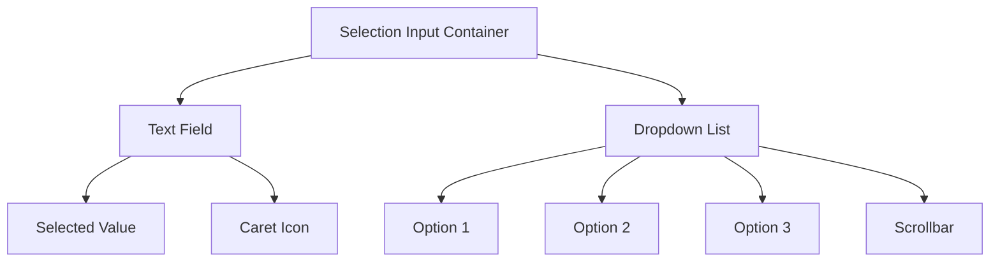

**_(Also called dropdown, select)_**

## Overview

A **selection input** is a form control that allows users to choose one option from a predefined list of options.

The selected option is typically displayed in a single-line text field, with the list of options hidden until the user interacts with the control.

## Use Cases

### When to use:

- When users need to select a single option from a list of predefined choices
- When the list of options is relatively short (less than 10-15 items)
- When screen space is limited, and displaying all options at once is not feasible
- When the selected option doesn't need to be visible at all times

### When not to use:

- When users need to select multiple options (use checkboxes or a [multi-select](/patterns/forms/multi-select-input) instead)
- When the list of options is very long (consider using an [autocomplete](/patterns/forms/autocomplete) or a typeahead)
- When users need to input free-form text (use a regular text input instead)
- When the options are complex or require additional information or visual aids

### Common scenarios and examples

- Selecting a country from a list of all countries
- Choosing a preferred language from a list of supported languages
- Selecting a payment method during checkout
- Choosing a size, color, or other product variant on an e-commerce site

## Benefits

- Saves screen space by hiding options until needed
- Provides a clear and concise way to select from predefined options
- Prevents user input errors by limiting choices to valid options
- Allows for easy selection using a mouse, keyboard, or touch input

## Anatomy

### Component Structure



1. **Container**

   - Wraps the selection input and its associated elements
   - Defines the overall dimensions and positioning of the component

2. **Text Field**

   - Displays the currently selected option
   - Acts as a button to trigger the dropdown list
   - Often includes a caret or arrow icon to indicate the presence of a dropdown

3. **Dropdown List**

   - Contains the list of available options
   - Appears when the text field is clicked or receives focus
   - Can be positioned above or below the text field, depending on available space

4. **Options**

   - Individual items within the dropdown list
   - Represent the available choices for the user
   - Should have a clear and concise label
   - Can include icons, images, or other visual aids if necessary

5. **Scrollbar (Optional)**

   - Allows users to scroll through the list of options if the list is too long to fit within the available space
   - Can be styled to match the overall design of the component

## Best Practices

### Content

**Do's ✅**

- Use clear and concise labels for each option
- Keep the list of options relatively short (less than 10-15 items)
- Order options logically (e.g., alphabetically, by popularity, or by relevance)
- Provide a default or pre-selected option when applicable

**Don'ts ❌**

- Don't use overly long or complex option labels
- Avoid using jargon or technical terms that users may not understand
- Don't include options that are not relevant or applicable to the user's context

### Accessibility

**Do's ✅**

- Ensure the selection input is keyboard accessible (arrow keys to navigate, Enter to select)
- Provide a clear focus state for the text field and individual options
- Use ARIA attributes to communicate the component's state and purpose
- Allow users to filter or search the list of options if the list is long

**Don'ts ❌**

- Don't rely solely on color to convey the state or purpose of the component
- Avoid using auto-selection or auto-submission when an option is highlighted
- Don't change the order or content of options unexpectedly

### Visual Design

**Do's ✅**

- Use a consistent visual style for the text field, dropdown list, and options
- Provide ample whitespace and padding to improve readability and usability
- Use a contrasting color or style to indicate the selected option
- Ensure the dropdown list is visually distinct from the text field

**Don'ts ❌**

- Don't use low-contrast colors or small font sizes that reduce legibility
- Avoid using overly complex or decorative styles that distract from the content
- Don't make the dropdown list too narrow or too wide relative to the text field

### Layout & Positioning

**Do's ✅**

- Position the dropdown list close to the text field for easy association
- Ensure the dropdown list doesn't obstruct other important content or UI elements
- Align the text field and dropdown list with other form controls for a cohesive layout

**Don'ts ❌**

- Don't place the dropdown list too far away from the text field
- Avoid positioning the dropdown list in a way that requires excessive scrolling or mouse movement

## Code Examples

### Basic Implementation

```html
<label for="fruits">Choose a fruit:</label>
<select id="fruits" name="fruits">
  <option value="apple">Apple</option>
  <option value="banana">Banana</option>
  <option value="orange">Orange</option>
  <option value="strawberry">Strawberry</option>
</select>
```

## Browser Support

<BrowserSupport
  features={[
    "html.elements.select",
    "html.elements.option",
    "html.elements.optgroup",
    "api.HTMLSelectElement",
  ]}
/>

## Design Tokens

These design tokens follow the [Design Tokens Format](https://design-tokens.github.io/community-group/format/) specification and can be used with various token transformation tools to generate platform-specific variables.

### Selection Input Tokens in DTF Format

```json
{
  "$schema": "https://design-tokens.org/schema.json",
  "selectionInput": {
    "container": {
      "minWidth": { "value": "200px", "type": "dimension" }
    },
    "textField": {
      "padding": {
        "vertical": { "value": "0.5rem", "type": "dimension" },
        "horizontal": { "value": "1rem", "type": "dimension" }
      },
      "border": {
        "width": { "value": "1px", "type": "dimension" },
        "color": { "value": "{color.gray.300}", "type": "color" },
        "radius": { "value": "0.25rem", "type": "dimension" }
      },
      "background": {
        "color": { "value": "{color.white}", "type": "color" }
      },
      "typography": {
        "fontSize": { "value": "1rem", "type": "dimension" },
        "lineHeight": { "value": "1.5", "type": "number" }
      },
      "color": {
        "default": { "value": "{color.gray.900}", "type": "color" },
        "disabled": { "value": "{color.gray.500}", "type": "color" }
      },
      "icon": {
        "size": { "value": "1.5rem", "type": "dimension" },
        "color": { "value": "{color.gray.500}", "type": "color" }
      }
    },
    "dropdownList": {
      "maxHeight": { "value": "300px", "type": "dimension" },
      "border": {
        "width": { "value": "1px", "type": "dimension" },
        "color": { "value": "{color.gray.300}", "type": "color" }
      },
      "background": {
        "color": { "value": "{color.white}", "type": "color" }
      },
      "shadow": {
        "offsetX": { "value": "0", "type": "dimension" },
        "offsetY": { "value": "2px", "type": "dimension" },
        "blurRadius": { "value": "4px", "type": "dimension" },
        "color": { "value": "rgba(0, 0, 0, 0.1)", "type": "color" }
      }
    },
    "option": {
      "padding": {
        "vertical": { "value": "0.5rem", "type": "dimension" },
        "horizontal": { "value": "1rem", "type": "dimension" }
      },
      "color": {
        "default": { "value": "{color.gray.700}", "type": "color" },
        "hover": { "value": "{color.gray.900}", "type": "color" },
        "selected": { "value": "{color.primary.600}", "type": "color" }
      },
      "background": {
        "default": { "value": "{color.white}", "type": "color" },
        "hover": { "value": "{color.gray.100}", "type": "color" },
        "selected": { "value": "{color.primary.50}", "type": "color" }
      }
    }
  }
}
```

## Resources

- [Request for developer feedback: customizable select](https://developer.chrome.com/blog/rfc-customizable-select)

### Articles

- [Designing Drop-Down Menus: Examples and Best Practices](https://www.smashingmagazine.com/2009/03/designing-drop-down-menus-examples-and-best-practices/)
- [Listboxes vs. Dropdown Lists](https://www.nngroup.com/articles/listbox-dropdown/)

## Libraries

- [Select - shadcn/ui](https://ui.shadcn.com/docs/components/select)
- [Select - OriginUI](https://originui.com/selects)
