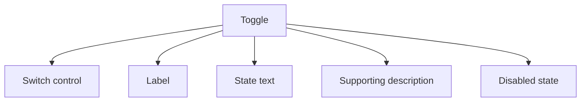

## Overview

A **Toggle** pattern helps teams create a reliable way to switch a binary setting on or off while making the current state obvious before and after interaction. It is most useful when teams need settings and preferences.

Compared with adjacent patterns, this pattern should reduce friction without hiding the state, rules, or recovery paths people need to keep moving.

<BuildEffort
  level="low"
  description="Primarily markup, state classes, and accessible labeling for switch between two states."
/>

## Use Cases

### When to use:

- Settings and preferences
- Feature enablement
- Notification or privacy controls

### When not to use:

- Prefer a native checkbox input for settings and forms when the value is simply on or off.
- Use a button with `aria-pressed` only when the control represents an action state such as play/pause or show/hide.
- Do not add extra formatting or validation if the product does not benefit from it.

### Common scenarios and examples

- Settings and preferences where users need a clear, repeatable interface model.
- Feature enablement where users need a clear, repeatable interface model.
- Notification or privacy controls where users need a clear, repeatable interface model.

<PatternComparison
  alternatives={[
    {
      name: "Checkbox",
      path: "/patterns/forms/checkbox",
      when: "persisted settings, preferences, and form-bound binary values",
      pros: [
        "Native checked semantics",
        "Simpler accessibility",
        "Built-in form integration"
      ],
      cons: [
        "Less appropriate for action toggles",
        "Requires custom styling for a switch look"
      ]
    },
    {
      name: "Button",
      path: "/patterns/forms/button",
      when: "pressed and unpressed actions like show or hide, play or pause, or mute or unmute",
      pros: [
        "Action-first mental model",
        "Good outside forms",
        "Easy event wiring"
      ],
      cons: [
        "Not a form control",
        "More manual state and label handling",
        "Easier to misuse for settings"
      ]
    }
  ]}
/>

## Benefits

- Clarifies how toggle should behave before implementation details begin to sprawl.
- Creates a reusable interaction model for teams who need to switch a binary setting on or off while making the current state obvious before and after interaction.
- Makes accessibility, edge cases, and recovery paths part of the design instead of post-launch cleanup.
- Gives product, design, and engineering a shared language for evaluating trade-offs.

## Drawbacks

- It introduces more states to design and test than a plain text field.
- Validation timing can feel noisy when the pattern reacts too early.
- Mobile input modes and autofill behavior often need explicit tuning.
- If labels, hints, and errors drift apart, completion rates drop quickly.

## Anatomy



### Component Structure

1. **Switch control**

- Represents the current binary state.

2. **Label**

- Explains what changes when the switch turns on or off.

3. **State text**

- Clarifies the meaning of each position.

4. **Supporting description**

- Explains any side effects or delayed consequences.

5. **Disabled state**

- Communicates when the switch is unavailable and why.

#### Summary of Components

| Component | Required? | Purpose |
| --- | --- | --- |
| Switch control | ✅ Yes | Represents the current binary state. |
| Label | ✅ Yes | Explains what changes when the switch turns on or off. |
| State text | ❌ No | Clarifies the meaning of each position. |
| Supporting description | ❌ No | Explains any side effects or delayed consequences. |
| Disabled state | ❌ No | Communicates when the switch is unavailable and why. |

## Variations

### Immediate settings toggle

Applies the change as soon as the user flips the switch.

**When to use:** Use for reversible preferences with low risk.

### Confirmed toggle

Requires an extra confirmation step before applying.

**When to use:** Use for sensitive or destructive state changes.

### Row toggle

Pairs the control with a short description in a settings list.

**When to use:** Use when several related toggles need to scan together.

## Examples

### Live Preview

<Playground patternType="forms" pattern="toggle" example="basic" presentation="hidden-code" />

### Basic Implementation

```html
<div class="demo-shell card toggle-card">
  <label class="switch-row">
    <span>Enable weekly digest</span>
    <span class="switch-control">
      <input type="checkbox" class="switch-input" id="toggle-switch" aria-describedby="toggle-status" />
      <span class="switch" aria-hidden="true"></span>
    </span>
  </label>
  <p id="toggle-status" class="muted" aria-live="polite">Digest is off.</p>
</div>
```

### What this example demonstrates

- A clear baseline implementation of toggle that can be reviewed without framework-specific noise.
- Visible state, spacing, and content hierarchy that mirror the implementation guidance above.
- A small enough surface to copy into a design review or prototype before scaling the pattern up.

### Implementation Notes

- Start with semantic HTML and default to native form controls when the toggle represents a stored setting.
- Keep styling tokens and spacing consistent with adjacent controls or layouts.
- Treat "toggle" here as the visual switch pattern; use `aria-pressed` only when the control is actually a toggle button.
- If the live implementation introduces async behavior, mirror those states in the code example rather than documenting them only in prose.

## Best Practices

### Content

**Do's ✅**

- Lead with a clear label that tells users exactly what belongs in the field.
- Keep helper text short and move edge-case guidance into secondary copy.
- Use examples only when they remove real ambiguity for the person typing.

**Don'ts ❌**

- Do not rely on placeholder text as the only instruction.
- Do not stack multiple competing messages above and below the control.
- Do not hide required constraints until after submission if they are easy to explain upfront.

### Accessibility

**Do's ✅**

- Verify that toggle can be completed using keyboard alone.
- Keep focus order logical when the pattern opens, updates, or reveals additional UI.
- Preserve a visible focus state that is still readable at high zoom.
- Use semantic elements first, then add ARIA only where semantics alone are not enough.
- Announce state changes such as errors, loading, or completion in the right place and with the right politeness.

**Don'ts ❌**

- Do not remove focus styles without a visible replacement.
- Do not depend on placeholder or helper text that disappears before the user can act on it.
- Do not assume pointer, touch, and assistive technologies will all interact with the pattern the same way.

### Visual Design

**Do's ✅**

- Keep spacing consistent between label, control, helper text, and validation.
- Reserve space for error states so the layout does not jump.
- Use state colors as reinforcement, not as the only cue.

**Don'ts ❌**

- Do not use tiny hit targets for touch devices.
- Do not depend on subtle borders that disappear in low-contrast environments.
- Do not overload the field chrome with too many icons or badges.

### Layout & Positioning

**Do's ✅**

- Align the control with the rest of the form so users can scan vertically.
- Support narrow mobile widths before adding side-by-side layouts.
- Keep primary actions close enough that users understand which field set they submit.

**Don'ts ❌**

- Do not move validation messages far from the field that caused them.
- Do not switch label position between breakpoints without a strong reason.
- Do not collapse key guidance into tooltips that are hard to revisit.

## Common Mistakes & Anti-Patterns 🚫

### **Using the wrong validation moment**

**The Problem:**
Immediate validation on partial input makes the pattern feel punitive and noisy.

**How to Fix It?**
Wait until the user has enough information in the field, then validate on blur, pause, or submit depending on the risk of the rule.

---

### **Separating labels, hints, and errors**

**The Problem:**
People cannot tell which message belongs to which control when the copy is visually detached.

**How to Fix It?**
Keep labels, helper text, and validation messages tightly grouped and connected with `aria-describedby` where appropriate.

---

### **Forgetting touch and autofill behavior**

**The Problem:**
Desktop-only styling hides the fact that mobile keyboards, autofill, and paste flows behave differently.

**How to Fix It?**
Test the control with autofill, paste, zoom, and on-screen keyboards before calling the pattern complete.

## Accessibility

### Keyboard Interaction

- [ ] Verify that toggle can be completed using keyboard alone.
- [ ] Keep focus order logical when the pattern opens, updates, or reveals additional UI.
- [ ] Preserve a visible focus state that is still readable at high zoom.

### Screen Reader Support

- [ ] Use semantic elements first, then add ARIA only where semantics alone are not enough.
- [ ] Announce state changes such as errors, loading, or completion in the right place and with the right politeness.
- [ ] Connect labels, hints, and status text with `aria-describedby` or structural headings when useful.

### Visual Accessibility

- [ ] Do not rely on color alone to convey severity, completion, or selection state.
- [ ] Test the pattern at 200% zoom and with reduced motion enabled.
- [ ] Ensure touch targets remain comfortable on mobile and coarse pointers.

## Validation Rules

### What to validate

- Validate the value against the rules users can act on inside toggle.
- Check required, format, and boundary constraints separately so messages stay specific.
- Run server-side validation again for any rule that affects security, billing, or data integrity.

### When to validate

- Prefer quiet validation while the user is still composing, then stronger validation on blur or submit.
- Avoid showing an error before the user has entered enough characters to satisfy the rule fairly.
- Keep successful states subtle so the field does not become visually noisy.

## Error Handling

- Preserve the entered value after an error so people can correct rather than retype.
- Explain the next step in the error copy instead of only naming the rule that failed.
- If a server-side rule fails after submit, return focus to the first affected control and summarize the issue near the action area.

## Testing Guidelines

### Functional Testing

- [ ] Verify the default, loading, error, and success states for toggle.
- [ ] Test the primary action and the obvious recovery action in the same run.
- [ ] Confirm that state survives refresh, navigation, or retry in the way users would expect.

### Accessibility Testing

- [ ] Run keyboard-only checks and at least one screen reader pass on the final implementation.
- [ ] Validate headings, labels, and announcement behavior with real content rather than lorem ipsum.
- [ ] Check color contrast and focus visibility in both default and stressed states.

### Edge Cases

- [ ] Test empty, long, duplicated, and unexpectedly formatted content.
- [ ] Check behavior on narrow screens, zoomed layouts, and slower networks.
- [ ] Verify that optimistic or asynchronous states reconcile correctly after a failure.

## Design Tokens

These [design tokens](/glossary/design-tokens) provide a starting point for implementing toggle in a systemized UI layer.

```json
{
  "$schema": "https://design-tokens.org/schema.json",
  "toggle": {
    "container": {
      "gap": {
        "value": "0.75rem",
        "type": "dimension"
      }
    },
    "label": {
      "color": {
        "value": "{color.gray.900}",
        "type": "color"
      },
      "fontWeight": {
        "value": "600",
        "type": "number"
      }
    },
    "control": {
      "borderRadius": {
        "value": "0.75rem",
        "type": "dimension"
      },
      "borderColor": {
        "value": "{color.gray.300}",
        "type": "color"
      },
      "paddingInline": {
        "value": "0.875rem",
        "type": "dimension"
      },
      "paddingBlock": {
        "value": "0.75rem",
        "type": "dimension"
      }
    },
    "helperText": {
      "color": {
        "value": "{color.gray.600}",
        "type": "color"
      },
      "fontSize": {
        "value": "0.875rem",
        "type": "dimension"
      }
    },
    "validation": {
      "successColor": {
        "value": "{color.green.700}",
        "type": "color"
      },
      "errorColor": {
        "value": "{color.red.700}",
        "type": "color"
      },
      "warningColor": {
        "value": "{color.amber.700}",
        "type": "color"
      }
    }
  }
}
```

## Frequently Asked Questions

<FaqStructuredData
  items={[
  {
    "question": "When should I choose Toggle instead of Checkbox?",
    "answer": "For settings-style toggles, start from a checkbox input styled as a switch so you keep native checked semantics and form behavior. Reserve toggle buttons for action states such as show or hide, play or pause, or mute or unmute."
  },
  {
    "question": "What is the biggest implementation risk with Toggle?",
    "answer": "The biggest risk is usually not the default visual state. It is the combination of state management, accessibility, and recovery behavior once loading, errors, or narrow screens enter the picture."
  },
  {
    "question": "How do I know whether toggle is working well?",
    "answer": "Watch whether users can complete the intended job without pausing to decode the interface, whether state changes feel trustworthy, and whether edge cases behave as intentionally as the happy path."
  }
]}
/>

## Related Patterns

<RelatedPatternsCard
  patterns={[
    {
      title: "Checkbox",
      path: "/patterns/forms/checkbox",
      description: "Enable single or multiple selections",
    },
    {
      title: "Button",
      path: "/patterns/forms/button",
      description: "Trigger actions and submit forms",
    },
    {
      title: "Radio",
      path: "/patterns/forms/radio",
      description: "Select a single option from a group",
    },
  ]}
/>

## Resources

### References

- [WCAG 2.2](https://www.w3.org/TR/WCAG22/) - Accessibility baseline for keyboard support, focus management, and readable state changes.
- [MDN checkbox input](https://developer.mozilla.org/en-US/docs/Web/HTML/Element/input/checkbox) - Native checkbox semantics, indeterminate state, and browser behavior.

### Guides

- [MDN WAI-ARIA basics](https://developer.mozilla.org/en-US/docs/Learn_web_development/Core/Accessibility/WAI-ARIA_basics) - Guidance on when to rely on native HTML and when to introduce ARIA roles and states.

### Articles

- [Nielsen Norman Group: Listbox vs. dropdown](https://www.nngroup.com/articles/listbox-dropdown/) - When to use each selection pattern and how they affect scanning speed.

### NPM Packages

- [`@radix-ui/react-switch`](https://www.npmjs.com/package/%40radix-ui%2Freact-switch) - Switch/toggle primitive for on-off states with good accessibility defaults.
- [`react-aria-components`](https://www.npmjs.com/package/react-aria-components) - Headless accessible components covering many form and overlay patterns.
- [`framer-motion`](https://www.npmjs.com/package/framer-motion) - Motion primitives for affordance, feedback, and progressive reveal.
