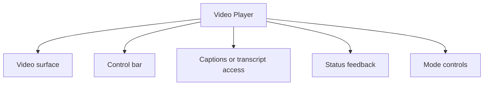

## Overview

A **Video Player** pattern helps teams create a reliable way to support video playback with understandable controls, resilient buffering states, and accessible alternate access paths. It is most useful when teams need course and tutorial playback.

Compared with adjacent patterns, this pattern should reduce friction without hiding the state, rules, or recovery paths people need to keep moving.

<BuildEffort
  level="high"
  description="Requires coordinated state, async data, and strong accessibility coverage across the full video player experience."
/>

## Use Cases

### When to use:

- Course and tutorial playback
- Marketing and explainer video
- Embedded product walkthroughs

### When not to use:

- Use a simpler image, link, or file input if full media handling is not actually needed.
- Avoid rich custom controls when browser-native behavior is enough for the task.
- Do not assume network-heavy media is appropriate for every audience or context.

### Common scenarios and examples

- Course and tutorial playback where users need a clear, repeatable interface model.
- Marketing and explainer video where users need a clear, repeatable interface model.
- Embedded product walkthroughs where users need a clear, repeatable interface model.

<PatternComparison
  alternatives={[
  {
    "name": "Loading Indicator",
    "path": "/patterns/user-feedback/loading-indicator",
    "when": "users need loading indicator instead of video player as the primary interaction",
    "pros": [
      "Clearer fit for its own job",
      "Lower ambiguity about the expected interaction"
    ],
    "cons": [
      "Less specialized for video player",
      "Different states and recovery paths to teach"
    ]
  },
  {
    "name": "Progress Indicator",
    "path": "/patterns/user-feedback/progress-indicator",
    "when": "users need progress indicator instead of video player as the primary interaction",
    "pros": [
      "Clearer fit for its own job",
      "Lower ambiguity about the expected interaction"
    ],
    "cons": [
      "Less specialized for video player",
      "Different states and recovery paths to teach"
    ]
  },
  {
    "name": "Image Gallery",
    "path": "/patterns/media/image-gallery",
    "when": "users need image gallery instead of video player as the primary interaction",
    "pros": [
      "Clearer fit for its own job",
      "Lower ambiguity about the expected interaction"
    ],
    "cons": [
      "Less specialized for video player",
      "Different states and recovery paths to teach"
    ]
  }
]}
/>

## Benefits

- Clarifies how video player should behave before implementation details begin to sprawl.
- Creates a reusable interaction model for teams who need to support video playback with understandable controls, resilient buffering states, and accessible alternate access paths.
- Makes accessibility, edge cases, and recovery paths part of the design instead of post-launch cleanup.
- Gives product, design, and engineering a shared language for evaluating trade-offs.

## Drawbacks

- Bandwidth, device capability, and screen size all change how the experience feels.
- Media-heavy layouts expose performance issues quickly.
- Accessibility gaps are especially visible when captions, transcripts, or alternate controls are missing.
- Different browsers implement advanced media features with subtle differences.

## Anatomy



### Component Structure

1. **Video surface**

- Displays the moving image and poster frame.

2. **Control bar**

- Holds play, pause, seek, volume, and playback options.

3. **Captions or transcript access**

- Supports alternate access to spoken content.

4. **Status feedback**

- Shows loading, buffering, or error conditions.

5. **Mode controls**

- Switch between fullscreen, picture-in-picture, or theater modes.

#### Summary of Components

| Component | Required? | Purpose |
| --- | --- | --- |
| Video surface | ✅ Yes | Displays the moving image and poster frame. |
| Control bar | ✅ Yes | Holds play, pause, seek, volume, and playback options. |
| Captions or transcript access | ✅ Yes | Supports alternate access to spoken content. |
| Status feedback | ❌ No | Shows loading, buffering, or error conditions. |
| Mode controls | ❌ No | Switch between fullscreen, picture-in-picture, or theater modes. |

## Variations

### Basic player

Leans on browser-native controls.

**When to use:** Use when reliability matters more than brand styling.

### Custom player

Adds branded controls and richer playback options.

**When to use:** Use when the media experience is a key product surface.

### Learning player

Pairs playback with chapters, notes, or transcripts.

**When to use:** Use when comprehension and review matter.

## Best Practices

### Content

**Do's ✅**

- Tell users what the media contains before they commit to viewing or uploading it.
- Keep captions, labels, and file requirements visible.
- Use metadata such as duration, size, and status to set expectations early.

**Don'ts ❌**

- Do not autoplay or auto-upload in a way that surprises people.
- Do not rely on thumbnails alone to explain the media.
- Do not hide file restrictions until after the action starts.

### Accessibility

**Do's ✅**

- Verify that video player can be completed using keyboard alone.
- Keep focus order logical when the pattern opens, updates, or reveals additional UI.
- Preserve a visible focus state that is still readable at high zoom.
- Use semantic elements first, then add ARIA only where semantics alone are not enough.
- Announce state changes such as errors, loading, or completion in the right place and with the right politeness.

**Don'ts ❌**

- Do not remove focus styles without a visible replacement.
- Do not depend on placeholder or helper text that disappears before the user can act on it.
- Do not assume pointer, touch, and assistive technologies will all interact with the pattern the same way.

### Visual Design

**Do's ✅**

- Reserve aspect-ratio space to avoid layout shift.
- Keep controls legible over bright or dark imagery.
- Show progress and completion states in the same visual language as the media frame.

**Don'ts ❌**

- Do not overlay controls on top of important content without contrast support.
- Do not let placeholders use completely different aspect ratios from the final media.
- Do not assume hover-only affordances are enough.

### Layout & Positioning

**Do's ✅**

- Adapt the controls and chrome to portrait and landscape contexts.
- Keep supporting metadata close to the media frame.
- Test zoom, orientation changes, and small-screen control spacing.

**Don'ts ❌**

- Do not make the media surface so dominant that supporting actions disappear.
- Do not move core controls into hidden menus by default on desktop.
- Do not ignore offline or poor-network scenarios.

## Platform-Specific Considerations

- [Touch targets](/glossary/touch-targets) need more room on mobile than on desktop, especially for scrubbers, thumbnails, and upload affordances.
- Test camera, gallery, fullscreen, and share behaviors on real mobile devices instead of assuming browser desktop emulation is enough.
- If the media pattern appears inside a native shell or hybrid app, confirm focus, keyboard, and permission prompts still work in the right order.
## Common Mistakes & Anti-Patterns 🚫

### **Treating media as decoration only**

**The Problem:**
Important uploads and playback flows break when the design assumes the media is just visual garnish.

**How to Fix It?**
Design state, metadata, and controls as first-class parts of the pattern, not as overlays added later.

---

### **Skipping fallback behavior**

**The Problem:**
Different devices support different codecs, capture flows, and bandwidth envelopes.

**How to Fix It?**
Plan graceful fallbacks for unsupported APIs, low data conditions, and failed loads.

---

### **Forgetting accessibility artifacts**

**The Problem:**
Media patterns become exclusionary quickly when captions, transcripts, alt text, or visible status are missing.

**How to Fix It?**
Treat alternate access paths as part of the core experience, not as post-launch polish.

## Examples

### Live Preview

<Playground patternType="media" pattern="video-player" example="basic" presentation="hidden-code" />

### Basic Implementation

```html
<div class="demo-shell card video-card">
  <div class="video-stage">Product walkthrough</div>
  <div class="controls">
    <button type="button" id="video-play">Play</button>
    <div class="progress-track"><div id="video-fill"></div></div>
    <button type="button">CC</button>
  </div>
</div>
```

### What this example demonstrates

- A clear baseline implementation of video player that can be reviewed without framework-specific noise.
- Visible state, spacing, and content hierarchy that mirror the implementation guidance above.
- A small enough surface to copy into a design review or prototype before scaling the pattern up.

### Implementation Notes

- Start with [semantic HTML](/glossary/semantic-html) and only add JavaScript where the interaction truly requires it.
- Keep styling tokens and spacing consistent with adjacent controls or layouts.
- If the live implementation introduces async behavior, mirror those states in the code example rather than documenting them only in prose.
## Accessibility

### Keyboard Interaction

- [ ] Verify that video player can be completed using keyboard alone.
- [ ] Keep focus order logical when the pattern opens, updates, or reveals additional UI.
- [ ] Preserve a visible focus state that is still readable at high zoom.

### Screen Reader Support

- [ ] Use semantic elements first, then add ARIA only where semantics alone are not enough.
- [ ] Announce state changes such as errors, loading, or completion in the right place and with the right politeness.
- [ ] Connect labels, hints, and status text with `aria-describedby` or structural headings when useful.

### Visual Accessibility

- [ ] Do not rely on color alone to convey severity, completion, or selection state.
- [ ] Test the pattern at 200% zoom and with reduced motion enabled.
- [ ] Ensure touch targets remain comfortable on mobile and coarse pointers.

## Testing Guidelines

### Functional Testing

- [ ] Verify the default, loading, error, and success states for video player.
- [ ] Test the primary action and the obvious recovery action in the same run.
- [ ] Confirm that state survives refresh, navigation, or retry in the way users would expect.

### Accessibility Testing

- [ ] Run keyboard-only checks and at least one [screen reader](/glossary/screen-reader) pass on the final implementation.
- [ ] Validate headings, labels, and announcement behavior with real content rather than lorem ipsum.
- [ ] Check color contrast and focus visibility in both default and stressed states.
### Edge Cases

- [ ] Test empty, long, duplicated, and unexpectedly formatted content.
- [ ] Check behavior on narrow screens, zoomed layouts, and slower networks.
- [ ] Verify that optimistic or asynchronous states reconcile correctly after a failure.

## Frequently Asked Questions

<FaqStructuredData
  items={[
  {
    "question": "When should I choose Video Player instead of Loading Indicator?",
    "answer": "Choose video player when the job depends on support video playback with understandable controls, resilient buffering states, and accessible alternate access paths. If the team only needs a lighter interaction with fewer states, Loading Indicator will usually be easier to ship and maintain."
  },
  {
    "question": "What is the biggest implementation risk with Video Player?",
    "answer": "The biggest risk is usually not the default visual state. It is the combination of state management, accessibility, and recovery behavior once loading, errors, or narrow screens enter the picture."
  },
  {
    "question": "How do I know whether video player is working well?",
    "answer": "Watch whether users can complete the intended job without pausing to decode the interface, whether state changes feel trustworthy, and whether edge cases behave as intentionally as the happy path."
  }
]}
/>

## Related Patterns

<RelatedPatternsCard
  patterns={[
    {
      title: "Loading Indicator",
      path: "/patterns/user-feedback/loading-indicator",
      description: "Show users that content is being loaded",
    },
    {
      title: "Progress Indicator",
      path: "/patterns/user-feedback/progress-indicator",
      description: "Show completion status of an operation",
    },
    {
      title: "Image Gallery",
      path: "/patterns/media/image-gallery",
      description: "Display and browse image collections",
    },
  ]}
/>

## Resources

### References

- [WCAG 2.2](https://www.w3.org/TR/WCAG22/) - Accessibility baseline for keyboard support, focus management, and readable state changes.
- [MDN video element](https://developer.mozilla.org/en-US/docs/Web/HTML/Element/video) - Playback controls, captions, media events, and progressive enhancement for video players.

### Guides

- [WAI Media Accessibility User Requirements](https://www.w3.org/WAI/media/av/) - Requirements for captions, transcripts, controls, and inclusive media playback.

### Articles

- [web.dev: Media Session API](https://web.dev/articles/media-session) - How to expose playback controls and metadata beyond the in-page media UI.

### NPM Packages

- [`video.js`](https://www.npmjs.com/package/video.js) - Customizable video player with plugin ecosystem and accessibility support.
- [`plyr`](https://www.npmjs.com/package/plyr) - Media player UI for video and audio with captions and consistent cross-provider controls.
- [`hls.js`](https://www.npmjs.com/package/hls.js) - HTTP Live Streaming playback for adaptive video delivery in the browser.
