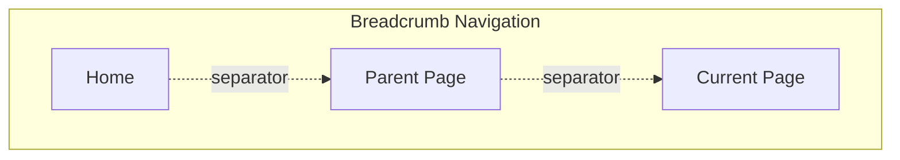

import { BrowserSupport } from "@app/_components/browser-support";
import { BuildEffort } from "@app/_components/build-effort";
import { FaqStructuredData } from "@app/_components/faq-structured-data";
import { PatternPreview } from "@app/_components/pattern-preview";
import { PatternStats } from "@app/_components/pattern-stats";
import { PatternComparison } from "@app/_components/pattern-comparison";
import { RelatedPatternsCard } from "@app/_components/related-patterns-card";

# Breadcrumb

<PatternStats
  popularity="medium"
/>

<PatternPreview />

## Overview

**Breadcrumbs** display as horizontal link lists separated by symbols, helping users understand their website location at a glance.

Breadcrumbs work as secondary navigation aids showing users their current location and providing easy navigation back through parent pages.

Websites with deep hierarchical structures or complex navigation paths benefit most from breadcrumbs.

<BuildEffort
  level="medium"
  description="Requires structured navigation, ARIA attributes (`aria-label`, `aria-current`), and responsive handling for long paths."
/>

## Use Cases

### When to use:

Use **Breadcrumbs** to **show users their location within a website's structure and help easy navigation**.

**Common scenarios include:**

- Websites have multiple hierarchical levels (categories, sub-categories)
- Large or complex sites where users land on deep pages from search engines
- Systems rely on nested file or document organization (file explorers, project management tools)
- E-commerce stores use layered product categories

### When not to use:

- Single-level websites have flat structure
- Landing pages or homepages don't need them
- Small websites use simple navigation
- Hierarchy already shows through other navigation elements
- Single-page applications use modal-based navigation

### Common scenarios and examples

- E-commerce: Home > Electronics > Smartphones > iPhone 15
- Content Management: Dashboard > Projects > Project A > Documents
- File Systems: My Drive > Work > 2024 > Reports

<PatternComparison
  current="Breadcrumb"
  alternatives={[
    {
      name: "Tabs",
      path: "/patterns/navigation/tabs",
      when: "content is organized in parallel sections at the same level",
      pros: ["Quick switching", "Clear organization", "No hierarchy needed"],
      cons: ["Not for deep navigation", "Limited to few items"]
    },
    {
      name: "Pagination",
      path: "/patterns/navigation/pagination",
      when: "navigating through sequential content pages",
      pros: ["Good for linear content", "Clear progress indicator"],
      cons: ["Not for hierarchical navigation", "Only works for ordered content"]
    },
    {
      name: "Back to Top",
      path: "/patterns/navigation/back-to-top",
      when: "users need quick return to page start",
      pros: ["Simple implementation", "Universal understanding"],
      cons: ["Only vertical navigation", "Not for complex hierarchies"]
    }
  ]}
/>

## Benefits

- Fewer actions needed to navigate up levels
- Users don't feel lost in complex hierarchies
- Better SEO through exposed site structure
- Lower bounce rates for deep-linked pages
- Clear contextual information about current location

## Drawbacks

- **Context may be redundant on very flat sites** – On single‑level or shallow sites, breadcrumbs add little value; they're most useful when users land deep from external links and need quick context and upward navigation
- **Takes up space** – Redundant on small screens or without hierarchical navigation needs
- **Responsive design complexity** – Long trails need truncation or horizontal scrolling
- **Structured data requirement** – Correct implementation needed for SEO benefits (schema markup)
- **Misuse in flat hierarchies** – No benefit without clear depth-based navigation

## Anatomy



### Component Structure

1. **Container (`nav`)**

- Wraps entire breadcrumb navigation
- Uses **semantic navigation elements** for accessibility
- Needs proper labeling for **screen readers**

2. **List (`ol`)**

- Holds **breadcrumb items** in sequential order
- Shows **hierarchical structure** of the page
- Usually an **ordered list** conveying structure

3. **Items (`li`)**

- **Home Link (Optional):** Starting point linking to homepage
- **Parent Pages:** Clickable links representing higher navigation levels
- **Current Page:** Final item that **shouldn't be a link** since it's the current view
- **Separators:** Visual dividers (`/`, `>`) showing clear navigation hierarchy

#### Summary of Components

| Component    | Required? | Purpose                                               |
| ------------ | --------- | ----------------------------------------------------- |
| Container    | ✅ Yes    | Wraps the entire breadcrumb navigation.               |
| List         | ✅ Yes    | Contains the breadcrumb items in order.               |
| Items        | ✅ Yes    | Represents individual breadcrumb links.               |
| Separators   | ✅ Yes    | Visually separates breadcrumb links.                  |
| Home Link    | ❌ No     | Provides an optional shortcut to the homepage.        |
| Current Page | ✅ Yes    | Represents the active page (should not be clickable). |

## Best Practices

### Content

**Do's ✅**

- Use clear, concise labels that match page titles
- Maintain consistent naming conventions
- Show the full hierarchy path

**Don'ts ❌**

- Don't use inconsistent terminology between breadcrumb items and page titles
- Don't truncate breadcrumb items without indicating there's more content

### Accessibility

**Do's ✅**

- Use `<nav>` with `aria-label="Breadcrumb"` for landmark navigation
- Mark current page with `aria-current="page"`
- Use ordered list `<ol>` to convey sequence
- Ensure keyboard navigation with visible focus indicators
- Provide skip links for lengthy breadcrumb trails
- Announce dynamic breadcrumb updates to screen readers

**Don'ts ❌**

- Don't make the current page title clickable
- Don't rely solely on visual separators (use CSS pseudo-elements)
- Don't remove focus indicators without alternatives
- Don't use color alone to indicate current page

### Visual Design

**Do's ✅**

- Make it obvious that the last item is not clickable (through color, cursor type, etc.)
- Use consistent visual styling across all pages
- Ensure sufficient contrast between text and background

**Don'ts ❌**

- Don't use distracting animations or transitions
- Don't make separators too prominent

### Layout & Positioning

**Do's ✅**

- Place the breadcrumb at the top of the page, below the global navigation and above the page title
- Keep the breadcrumb left-aligned
- Consider showing both icon and text on larger screens
- Consider showing a house icon instead of text "Home" on smaller screens

**Don'ts ❌**

- Do not show a breadcrumb if the navigation's hierarchy contains only one level (home page or landing pages for example)
- Do not use an HTML element for separators but prefer using CSS

## Breadcrumb Variations

### Location-Based Breadcrumbs
Shows the page's position within the site hierarchy, most common type.

```html
Home > Products > Electronics > Laptops > Gaming Laptops
```

**Use when:** Site has clear hierarchical structure with defined categories.

### Path-Based Breadcrumbs
Shows the actual path the user took to reach the current page.

```html
Home > Search Results > Product Details > Reviews
```

**Use when:** Users follow varied paths and need to retrace their journey.

### Attribute-Based Breadcrumbs
Displays attributes or filters applied to reach current view.

```html
Products > Brand: Apple > Price: $500-$1000 > In Stock
```

**Use when:** E-commerce sites with faceted search and filtering.

### Mobile Breadcrumbs
Collapsed or simplified versions for small screens.

```html
← Electronics / Laptops
```

**Use when:** Mobile interfaces need space-efficient navigation.

## Common Mistakes & Anti-Patterns 🚫

### Making Current Page a Link
**The Problem:**
The last breadcrumb item links to the current page, creating confusing circular navigation.

```html
<!-- Bad -->
<a href="/current">Current Page</a>

<!-- Good -->
<span aria-current="page">Current Page</span>
```

**How to Fix It:**
Use a non-clickable span with `aria-current="page"` for the current page instead of a link.

### Using Breadcrumbs as Primary Navigation
**The Problem:**
Relying on breadcrumbs instead of proper main navigation, leaving users without clear site structure.

**How to Fix It:**
Always provide a main navigation menu. Breadcrumbs should supplement, not replace primary navigation.

### Incorrect Hierarchy Representation
**The Problem:**
Breadcrumb trail doesn't match actual site structure, misleading users about their location.

```html
<!-- Bad: Skipping levels -->
Home > Product Details

<!-- Good: Full path -->
Home > Products > Electronics > Product Details
```

**How to Fix It:**
Show the complete hierarchical path from home to current page without skipping levels.

### Poor Mobile Handling
**The Problem:**
Full breadcrumb trail causes horizontal scroll on mobile, reducing usability.

```css
/* Bad */
.breadcrumb { white-space: nowrap; }

/* Good: Progressive disclosure */
@media (max-width: 768px) {
  .breadcrumb-item:not(:last-child):not(:first-child) {
    display: none;
  }
}
```

**How to Fix It:**
Use progressive disclosure or collapsed breadcrumbs on mobile to show only essential levels.

### Missing Semantic Markup
**The Problem:**
Using generic divs without proper ARIA labels breaks screen reader navigation.

```html
<!-- Bad -->
<div class="breadcrumb">...</div>

<!-- Good -->
<nav aria-label="Breadcrumb">
  <ol>...</ol>
</nav>
```

**How to Fix It:**
Use semantic HTML with `<nav>` and `<ol>` elements, plus proper ARIA labels for accessibility.

## Tracking

Tracking breadcrumb interactions helps measure how users navigate through a site, whether they rely on breadcrumbs for backtracking, and if they help reduce friction in multi-level navigation. By analyzing usage patterns, we can optimize the breadcrumb structure and placement.

### Key Tracking Points

Each breadcrumb interaction provides valuable insights into user behavior. Below are the key events that should be tracked:

| **Event Name**           | **Description**                                                    | **Why Track It?**                                                     |
| ------------------------ | ------------------------------------------------------------------ | --------------------------------------------------------------------- |
| `breadcrumb.view`        | When the breadcrumb component enters the viewport.                 | Determines visibility and whether breadcrumbs are available to users. |
| `breadcrumb.click`       | When a user clicks on any breadcrumb link.                         | Measures engagement and breadcrumb-driven navigation.                 |
| `breadcrumb.home_click`  | When a user clicks on the **home** link in the breadcrumb.         | Tracks how often users return to the homepage via breadcrumbs.        |
| `breadcrumb.level_click` | When a user clicks on an intermediate breadcrumb level.            | Helps assess whether users navigate back up the hierarchy.            |
| `breadcrumb.usage`       | Captures breadcrumb interaction data relative to total page views. | Helps measure how often breadcrumbs are used when available.          |

### Event Payload Structure

To ensure consistent tracking, here’s a recommended event format:

```json
{
  "event": "breadcrumb.click",
  "properties": {
    "breadcrumb_id": "product_category",
    "clicked_level": "Electronics",
    "breadcrumb_position": 2,
    "total_levels": 4
  }
}
```

### Key Metrics to Analyze

Once tracking is in place, the following metrics provide actionable insights:

- **Breadcrumb Usage Rate** → Percentage of page visits where breadcrumbs were interacted with.
- **Breadcrumb Click-Through Rate (CTR)** → Percentage of users who interact with breadcrumbs after seeing them.
- **Navigation Recovery Rate** → How often users navigate up using breadcrumbs instead of the browser back button.
- **Home Click Rate** → Measures how often users return to the homepage via breadcrumbs.
- **Intermediate Level Click Rate** → Tracks how often users use breadcrumbs to navigate back to higher levels.

### Insights & Optimization Based on Tracking

By analyzing tracking data, we can optimize breadcrumb usability:

- 🚨 **Low Breadcrumb Usage Rate?**
  → Users may not notice breadcrumbs or find them unnecessary.
  **Optimization:** Improve visibility, adjust styling for better contrast, or test a more prominent placement.

- ⏳ **Low Breadcrumb Click-Through Rate?**
  → Users see breadcrumbs but don’t interact with them.
  **Optimization:** Consider whether breadcrumbs are necessary in the current navigation structure. They may be redundant if other navigation methods are more intuitive.

- 🔄 **Frequent Home Clicks?**
  → Users might be struggling to find their way back.
  **Optimization:** Review site structure and ensure proper linking between categories.

- 🔁 **More Back Button Usage Than Breadcrumb Clicks?**
  → Users might prefer using browser navigation instead of breadcrumbs.
  **Optimization:** Make breadcrumbs more interactive and clearly indicate their functionality.

- 📉 **Low Intermediate Level Click Rate?**
  → Users are not navigating up through breadcrumbs.
  **Optimization:** Ensure breadcrumbs are relevant for deep hierarchies and not just duplicating the main navigation.

By continuously monitoring these metrics, we can refine breadcrumb effectiveness, ensuring they support seamless navigation and reduce friction in user journeys.

## Performance Metrics

Target performance metrics for breadcrumb navigation:

- **Initial render**: < 50ms for breadcrumb component
- **Interaction delay**: < 100ms for hover/focus states
- **Layout shift**: CLS score of 0 (no shift after initial render)
- **Bundle size**: < 5KB for breadcrumb component with styles
- **Memory usage**: < 1MB for complex breadcrumb trails

### Optimization Strategies

**Lazy Loading for Deep Hierarchies**
```javascript
// Load intermediate levels only when needed
const BreadcrumbTrail = ({ path }) => {
  const [expanded, setExpanded] = useState(false);

  if (path.length > 5 && !expanded) {
    return (
      <>
        {path[0]}
        <button onClick={() => setExpanded(true)}>...</button>
        {path[path.length - 1]}
      </>
    );
  }
  return path.map(item => <BreadcrumbItem {...item} />);
};
```

**CSS-Only Separators**
```css
/* Avoid DOM elements for separators */
.breadcrumb-item:not(:last-child)::after {
  content: "›";
  margin: 0 0.5rem;
}
```

## Usability Testing Insights

Research shows that users:
- Understand breadcrumb purpose immediately when properly styled (87% of users)
- Use breadcrumbs for upward navigation (52% of users)
- Click middle hierarchy levels more than home (68% of clicks)
- Have 23% lower engagement on mobile due to space constraints
- Prefer ">" separator over other symbols (72% preference)

### Testing Recommendations

**A/B Test Variables:**
- Separator symbols (>, /, →, |)
- Truncation methods (ellipsis, collapsing, scrolling)
- Current page inclusion/exclusion
- Mobile presentation styles

## Localization

### Text Expansion Considerations

Breadcrumb text can expand 30-200% when translated:

```css
/* Allow for text expansion */
.breadcrumb {
  min-width: 0;
  flex-wrap: wrap;
}

.breadcrumb-item {
  min-width: 0;
  overflow-wrap: break-word;
}
```

### RTL (Right-to-Left) Support

```css
/* Automatic RTL flipping */
.breadcrumb {
  display: flex;
  flex-direction: row;
}

/* Flip separator in RTL */
[dir="rtl"] .breadcrumb-item:not(:last-child)::after {
  content: "‹";
}
```

### Cultural Considerations

- **Home Label:** "Home" doesn't translate literally in all languages
- **Separator Symbols:** Avoid culturally specific symbols
- **Truncation:** Consider character-based vs word-based truncation
- **Reading Direction:** Some cultures read hierarchy differently

## Code Examples

### Basic Implementation

This example uses semantic HTML to provide a clear structure for the breadcrumb navigation.

```html
<nav aria-label="Breadcrumb">
  <ol>
    <li>
      <a href="https://example.com">
        <span>Home</span>
      </a>
    </li>
    <li>
      <a href="https://example.com/products">
        <span>Products</span>
      </a>
    </li>

    <li>
      <span aria-current="page">Current Page</span>
    </li>
  </ol>
</nav>
```

### JSON-LD Structured Data

This example demonstrates how to dynamically generate the breadcrumb JSON-LD structured Data using JavaScript.

```javascript
const breadcrumbs = [
  { title: "Home", url: "https://example.com" },
  { title: "Products", url: "https://example.com/products" },
  { title: "Current Page" },
];

function generateBreadcrumbSchema(breadcrumbs) {
  return {
    "@context": "https://schema.org",
    "@type": "BreadcrumbList",
    itemListElement: breadcrumbs.map((crumb, index) => {
      const isLastItem = index === breadcrumbs.length - 1;

      const baseItem = {
        "@type": "ListItem",
        position: index + 1,
        name: crumb.title,
      };

      // Only add the "item" property if it's not the last item and has a URL
      if (!isLastItem && crumb.url) {
        baseItem.item = crumb.url;
      }

      return baseItem;
    }),
  };
}
```

## SEO

### Structured Data

- Implement breadcrumb structured data using [Schema.org markup](https://schema.org/BreadcrumbList) to help search engines understand your site's hierarchy
- This improves the way your site appears in search results and helps search engines better understand your content structure
  Example JSON-LD structured data:

```json
{
  "@context": "https://schema.org",
  "@type": "BreadcrumbList",
  "itemListElement": [
    {
      "@type": "ListItem",
      "position": 1,
      "name": "Home",
      "item": "https://example.com"
    },
    {
      "@type": "ListItem",
      "position": 2,
      "name": "Products",
      "item": "https://example.com/products"
    },
    {
      "@type": "ListItem",
      "position": 3,
      "name": "Current Page"
    }
  ]
}
```

### Testing & Validation

- Use Google's [Rich Results Test](https://search.google.com/test/rich-results) to validate structured data
- Monitor breadcrumb appearance in search results through Google Search Console
- Check for proper indexing of breadcrumb pages in site architecture
- Verify mobile rendering of breadcrumbs for mobile-first indexing

## Testing Guidelines

### Functional Testing

**Should ✓**

- [ ] Navigate to the correct page when clicking each breadcrumb link
- [ ] Show the complete hierarchy path from home to current page
- [ ] Update breadcrumb trail when navigating through different levels
- [ ] Maintain state after page refresh
- [ ] Work with browser back/forward navigation

### Accessibility Testing

**Should ✓**

- [ ] Be navigable using keyboard (Tab and Enter keys)
- [ ] Have proper ARIA labels and roles
- [ ] Announce proper hierarchy to screen readers
- [ ] Maintain focus state visibility
- [ ] Have sufficient color contrast (WCAG 2.2 AA)

### Responsive Testing

**Should ✓**

- [ ] Adapt layout for different screen sizes
- [ ] Show/hide home icon appropriately
- [ ] Handle text overflow gracefully
- [ ] Maintain touch target sizes on mobile (minimum 44x44px)
- [ ] Preserve functionality across different devices

### SEO Testing

**Should ✓**

- [ ] Include proper Schema.org markup
- [ ] Have semantic HTML structure
- [ ] Maintain consistent URL structure
- [ ] Include relevant meta tags
- [ ] Follow proper link hierarchy

### Performance Testing

**Should ✓**

- [ ] Load without significant delay
- [ ] Not cause layout shifts
- [ ] Handle large numbers of items efficiently
- [ ] Work with dynamic content updates
- [ ] Function without JavaScript (progressive enhancement)

## Browser Support

<BrowserSupport features={["css.selectors.pseudo-elements.after", "css.properties.display.flex", "html.elements.nav"]} />

## Design Tokens (DTF)

These design tokens follow the [Design Tokens Format](https://design-tokens.github.io/community-group/format/) specification and can be used with various token transformation tools to generate platform-specific variables.

```json
{
  "breadcrumb": {
    "container": {
      "paddingY": "{spacing.3}",
      "paddingX": "{spacing.0}",
      "fontSize": "{fontSize.sm}",
      "background": "{colors.transparent}"
    },
    "item": {
      "color": "{colors.gray.600}",
      "colorHover": "{colors.gray.900}",
      "marginRight": "{spacing.2}",
      "fontSize": "{fontSize.sm}"
    },
    "separator": {
      "color": "{colors.gray.400}",
      "marginX": "{spacing.2}"
    },
    "current": {
      "color": "{colors.gray.900}",
      "fontWeight": "{fontWeight.medium}"
    },
    "link": {
      "color": "{colors.gray.600}",
      "colorHover": "{colors.gray.900}",
      "textDecoration": "{textDecoration.none}",
      "transition": "{transition.colors}",
      "focusOutline": "2px solid {colors.blue.500}"
    }
  }
}
```

## Frequently Asked Questions

<FaqStructuredData
  items={[
    {
      question: "What is breadcrumb navigation?",
      answer:
        "Breadcrumb navigation is a secondary navigation aid that helps users understand their location within a website's hierarchy. It provides a trail of links, typically starting from the homepage, that shows the path to the current page.",
    },
    {
      question: "When should I use breadcrumb navigation?",
      answer:
        "Breadcrumbs are beneficial for websites with complex structures or multiple levels of content. They are particularly useful when users may enter the site from search engines or deep links, as they provide context and easy access to higher-level pages.",
    },
    {
      question: "How can I design effective breadcrumbs?",
      answer:
        "Effective breadcrumbs should:\n\n" +
        "1. Start with the homepage and progress to the current page\n" +
        "2. Use clear separators between links, such as '>' or '/'\n" +
        "3. Ensure all items, except the current page, are clickable links\n" +
        "4. Be concise and not occupy excessive space\n" +
        "5. Be placed near the top of the page, below the main navigation",
    },
    {
      question: "What are the benefits of using breadcrumbs?",
      answer:
        "Breadcrumbs enhance user experience by:\n\n" +
        "1. Providing a clear path back to higher-level pages\n" +
        "2. Reducing the number of actions needed to navigate to previous pages\n" +
        "3. Offering context about the site's structure\n" +
        "4. Potentially improving SEO by providing internal links with relevant anchor text",
    },
    {
      question: "What are common mistakes to avoid with breadcrumb navigation?",
      answer:
        "Avoid these common mistakes:\n\n" +
        "1. Making the breadcrumb trail too prominent, overshadowing primary navigation\n" +
        "2. Omitting the current page from the breadcrumb trail\n" +
        "3. Using inconsistent or unclear separators\n" +
        "4. Not providing enough space between links, making them hard to click, especially on mobile devices",
    },
  ]}
/>

## Related Patterns

<RelatedPatternsCard category="navigation" />

## Resources

### Articles

- [Breadcrumbs: 11 Design Guidelines for Desktop and Mobile](https://www.nngroup.com/articles/breadcrumbs/) by Nielsen Norman Group
- [Designing Effective Breadcrumbs Navigation — Smashing Magazine](https://www.smashingmagazine.com/2022/04/breadcrumbs-ux-design/)
- [Breadcrumb Pattern](https://www.w3.org/WAI/ARIA/apg/patterns/breadcrumb/) by W3C
- [Breadcrumbs](https://a11y-style-guide.com/style-guide/section-navigation.html#kssref-navigation-breadcrumbs) - By A11y Style guide

### Libraries

- [Breadcrumb: shadcn/ui](https://ui.shadcn.com/docs/components/breadcrumb)
- [Breadcrumb - Origin UI](https://originui.com/breadcrumb)
