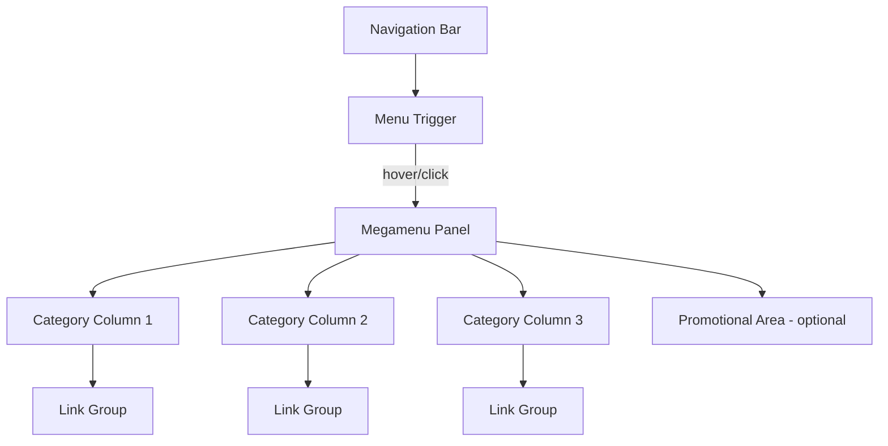

## Overview

**Megamenu** is a large, multi-column dropdown panel that expands from a navigation bar to reveal a structured collection of links, categories, and sometimes promotional content. Unlike standard dropdown menus, megamenus use the full or near-full width of the page to organize many navigation options at once.

Megamenus help users scan large navigation structures without repeated clicking, making them a staple on enterprise, e-commerce, and content-heavy websites.

<BuildEffort
  level="high"
  description="Requires complex multi-column layouts, hover intent detection to prevent accidental triggers, full keyboard navigation across rows and columns, responsive collapse into accordion or stacked layouts on mobile, and extensive ARIA role management."
/>

## Use Cases

### When to use:

Use **Megamenu** to **expose a large set of categorized navigation options in a single, scannable panel**.

**Common scenarios include:**

- E-commerce sites with dozens of product categories and subcategories
- Enterprise platforms with many features organized by domain
- University or government sites with extensive departmental navigation
- News portals with numerous editorial sections and subsections
- SaaS products with complex feature sets needing organized access

### When not to use:

- Sites with fewer than 10-15 total navigation links (a simple dropdown suffices)
- Mobile-only applications where screen width is insufficient
- Single-purpose landing pages with minimal navigation needs
- Sites where simplicity and speed-of-access are paramount over breadth
- When analytics show users prefer search over browsing categories

### Common scenarios and examples

- Amazon-style category navigation with multi-level product hierarchies
- University navigation showing colleges, departments, and programs
- Airline booking sites with destinations organized by region
- Software documentation with feature areas and sub-topics
- News sites organizing sections by topic, region, and format

<PatternComparison
  current="Megamenu"
  alternatives={[
    {
      name: "Navigation Menu",
      path: "/patterns/navigation/navigation-menu",
      when: "navigation items are few enough for simple dropdowns",
      pros: ["Simpler implementation", "Lower cognitive load", "Faster interaction"],
      cons: ["Limited to small item counts", "No multi-column layout"]
    },
    {
      name: "Sidebar",
      path: "/patterns/navigation/sidebar",
      when: "persistent vertical navigation is needed for deep structures",
      pros: ["Always visible", "Supports tree navigation", "Good for apps"],
      cons: ["Uses permanent horizontal space", "Not ideal for marketing sites"]
    },
    {
      name: "Hamburger Menu",
      path: "/patterns/navigation/hambuger-menu",
      when: "navigation needs to be hidden behind a toggle on all screen sizes",
      pros: ["Saves space", "Clean interface", "Works on mobile"],
      cons: ["Hidden discoverability", "Extra interaction step"]
    }
  ]}
/>

## Benefits

- Reveals the full navigation structure at a glance without multiple clicks
- Multi-column layout allows grouping by category with visual hierarchy
- Can include promotional content, images, or featured links alongside navigation
- Reduces time to navigate deep hierarchies compared to nested dropdown menus
- Provides a clear mental model of the site's information architecture

## Drawbacks

- **Implementation complexity** – Multi-column layouts, hover intent, and keyboard grid navigation require significant effort
- **Overwhelming for small sites** – Megamenus on sites with few links feel disproportionate and confusing
- **Hover intent challenges** – Accidental triggers from mouse movement frustrate users; requires careful delay tuning
- **Mobile adaptation** – Wide multi-column panels must collapse into a completely different pattern on small screens
- **Performance cost** – Large DOM structures with many links and images can impact rendering performance
- **Accessibility barrier** – Keyboard navigation across a 2D grid of links is complex to implement correctly

## Anatomy



### Component Structure

1. **Navigation Bar**

- The horizontal bar containing the top-level trigger items
- Uses `<nav>` element with proper ARIA labeling
- Provides the spatial reference for panel positioning

2. **Menu Trigger**

- A top-level navigation item that activates the megamenu panel
- Must indicate expandability with `aria-expanded` and `aria-haspopup="true"`
- Responds to both hover (with intent delay) and click/Enter

3. **Megamenu Panel**

- The expanded container showing all categorized navigation
- Positioned absolutely below the trigger, spanning the navigation width
- Contains grouped columns of links and optional promotional content

4. **Category Columns**

- Vertical groups of related links, each with a heading
- Organized by content domain, product category, or feature area
- Use heading elements for each group label

5. **Link Groups**

- Individual navigation links within a category column
- Use `<ul>/<li>` structure within each group
- May include descriptions or icons alongside link text

6. **Promotional Area (Optional)**

- Space for featured content, images, or calls to action
- Placed alongside or at the end of the category columns
- Enhances the megamenu with editorial or marketing content

#### Summary of Components

| Component        | Required? | Purpose                                                        |
| ---------------- | --------- | -------------------------------------------------------------- |
| Navigation Bar   | ✅ Yes    | Contains the top-level triggers for the megamenu.              |
| Menu Trigger     | ✅ Yes    | Activates and deactivates the megamenu panel.                  |
| Megamenu Panel   | ✅ Yes    | The expanded container with categorized navigation.            |
| Category Columns | ✅ Yes    | Groups related links into scannable vertical sections.         |
| Link Groups      | ✅ Yes    | Individual navigation links within each category.              |
| Promotional Area | ❌ No     | Optional space for featured content or imagery.                |

## Variations

### 1. Full-Width Megamenu
Spans the entire width of the viewport with multiple columns of equal width.

**When to use:** Sites with many categories that benefit from maximum horizontal space (e-commerce, news portals).

### 2. Flyout Megamenu
Opens at the width of its content rather than the full viewport, anchored below the trigger item.

**When to use:** Sites where only certain navigation items have rich content, and a full-width panel would feel excessive.

### 3. Tab-Based Megamenu
The panel includes vertical tabs on the left that switch between category groups on the right.

**When to use:** Very deep hierarchies where showing all categories simultaneously would overwhelm the user.

### 4. Megamenu with Media
Includes images, icons, or video thumbnails alongside navigation links for visual browsing.

**When to use:** E-commerce or media sites where visual previews help users identify categories.

### 5. Megamenu with Featured Content
Dedicates a column or row to promotional banners, new arrivals, or featured links.

**When to use:** Marketing-driven sites that want to highlight specific content within navigation.

## Examples

### Live Preview

<Playground patternType="navigation" pattern="megamenu" example="basic" presentation="hidden-code" />

### Basic HTML Implementation

```html
<nav aria-label="Main navigation">
  <ul class="nav-bar" role="menubar">
    <li role="none">
      <button
        type="button"
        role="menuitem"
        aria-haspopup="true"
        aria-expanded="false"
        aria-controls="mega-products"
        class="nav-trigger"
      >
        Products
        <span class="chevron" aria-hidden="true">▾</span>
      </button>

      <div id="mega-products" class="megamenu-panel" role="menu" hidden>
        <div class="megamenu-columns">
          <div class="megamenu-column">
            <h3 class="megamenu-heading">Electronics</h3>
            <ul role="none">
              <li role="none"><a role="menuitem" href="/phones">Phones</a></li>
              <li role="none"><a role="menuitem" href="/laptops">Laptops</a></li>
              <li role="none"><a role="menuitem" href="/tablets">Tablets</a></li>
            </ul>
          </div>
          <div class="megamenu-column">
            <h3 class="megamenu-heading">Clothing</h3>
            <ul role="none">
              <li role="none"><a role="menuitem" href="/men">Men</a></li>
              <li role="none"><a role="menuitem" href="/women">Women</a></li>
              <li role="none"><a role="menuitem" href="/kids">Kids</a></li>
            </ul>
          </div>
          <div class="megamenu-column">
            <h3 class="megamenu-heading">Home & Garden</h3>
            <ul role="none">
              <li role="none"><a role="menuitem" href="/furniture">Furniture</a></li>
              <li role="none"><a role="menuitem" href="/decor">Decor</a></li>
              <li role="none"><a role="menuitem" href="/garden">Garden</a></li>
            </ul>
          </div>
        </div>
      </div>
    </li>
  </ul>
</nav>

<script>
  const triggers = document.querySelectorAll('.nav-trigger');
  let hoverTimeout;

  triggers.forEach(trigger => {
    const panel = document.getElementById(trigger.getAttribute('aria-controls'));

    function open() {
      clearTimeout(hoverTimeout);
      trigger.setAttribute('aria-expanded', 'true');
      panel.removeAttribute('hidden');
    }

    function close() {
      trigger.setAttribute('aria-expanded', 'false');
      panel.setAttribute('hidden', '');
    }

    function delayedClose() {
      hoverTimeout = setTimeout(close, 300);
    }

    trigger.addEventListener('mouseenter', open);
    trigger.addEventListener('mouseleave', delayedClose);
    panel.addEventListener('mouseenter', () => clearTimeout(hoverTimeout));
    panel.addEventListener('mouseleave', delayedClose);

    trigger.addEventListener('click', () => {
      const isOpen = trigger.getAttribute('aria-expanded') === 'true';
      isOpen ? close() : open();
    });

    trigger.addEventListener('keydown', (e) => {
      if (e.key === 'Enter' || e.key === ' ') {
        e.preventDefault();
        open();
        panel.querySelector('a')?.focus();
      }
      if (e.key === 'Escape') {
        close();
        trigger.focus();
      }
    });
  });
</script>
```

### React Implementation

```jsx
import { useState, useRef, useCallback, useEffect } from 'react';

function Megamenu({ label, categories }) {
  const [isOpen, setIsOpen] = useState(false);
  const triggerRef = useRef(null);
  const panelRef = useRef(null);
  const timeoutRef = useRef(null);

  const open = useCallback(() => {
    clearTimeout(timeoutRef.current);
    setIsOpen(true);
  }, []);

  const close = useCallback(() => {
    setIsOpen(false);
    triggerRef.current?.focus();
  }, []);

  const delayedClose = useCallback(() => {
    timeoutRef.current = setTimeout(() => setIsOpen(false), 300);
  }, []);

  const cancelClose = useCallback(() => {
    clearTimeout(timeoutRef.current);
  }, []);

  useEffect(() => {
    if (!isOpen) return;

    const handleKeyDown = (e) => {
      if (e.key === 'Escape') close();
    };

    document.addEventListener('keydown', handleKeyDown);
    return () => document.removeEventListener('keydown', handleKeyDown);
  }, [isOpen, close]);

  return (
    <li
      role="none"
      onMouseEnter={open}
      onMouseLeave={delayedClose}
    >
      <button
        ref={triggerRef}
        type="button"
        role="menuitem"
        aria-haspopup="true"
        aria-expanded={isOpen}
        className="nav-trigger"
        onClick={() => (isOpen ? close() : open())}
      >
        {label}
        <span className="chevron" aria-hidden="true">▾</span>
      </button>

      {isOpen && (
        <div
          ref={panelRef}
          className="megamenu-panel"
          role="menu"
          onMouseEnter={cancelClose}
          onMouseLeave={delayedClose}
        >
          <div className="megamenu-columns">
            {categories.map((category) => (
              <div key={category.heading} className="megamenu-column">
                <h3 className="megamenu-heading">{category.heading}</h3>
                <ul role="none">
                  {category.links.map((link) => (
                    <li key={link.href} role="none">
                      <a role="menuitem" href={link.href}>
                        {link.label}
                      </a>
                    </li>
                  ))}
                </ul>
              </div>
            ))}
          </div>
        </div>
      )}
    </li>
  );
}
```

### CSS Styling

```css
.nav-bar {
  display: flex;
  list-style: none;
  margin: 0;
  padding: 0;
  gap: 0.25rem;
  position: relative;
}

.nav-trigger {
  display: flex;
  align-items: center;
  gap: 0.25rem;
  padding: 0.75rem 1rem;
  border: none;
  background: transparent;
  font-size: 1rem;
  cursor: pointer;
  white-space: nowrap;
}

.nav-trigger:hover,
.nav-trigger[aria-expanded="true"] {
  background-color: #f3f4f6;
  border-radius: 0.375rem;
}

.nav-trigger:focus-visible {
  outline: 2px solid #2563eb;
  outline-offset: 2px;
  border-radius: 0.375rem;
}

.chevron {
  font-size: 0.75rem;
  transition: transform 200ms ease;
}

.nav-trigger[aria-expanded="true"] .chevron {
  transform: rotate(180deg);
}

.megamenu-panel {
  position: absolute;
  top: 100%;
  left: 0;
  right: 0;
  background: #fff;
  border: 1px solid #e5e7eb;
  border-radius: 0 0 0.5rem 0.5rem;
  box-shadow: 0 10px 25px rgba(0, 0, 0, 0.1);
  padding: 1.5rem 2rem;
  z-index: 100;
  animation: megamenu-enter 200ms ease;
}

@keyframes megamenu-enter {
  from {
    opacity: 0;
    transform: translateY(-0.5rem);
  }
  to {
    opacity: 1;
    transform: translateY(0);
  }
}

.megamenu-columns {
  display: grid;
  grid-template-columns: repeat(auto-fit, minmax(12rem, 1fr));
  gap: 2rem;
}

.megamenu-heading {
  font-size: 0.875rem;
  font-weight: 600;
  text-transform: uppercase;
  letter-spacing: 0.05em;
  color: #6b7280;
  margin: 0 0 0.75rem;
  padding-bottom: 0.5rem;
  border-bottom: 1px solid #e5e7eb;
}

.megamenu-column ul {
  list-style: none;
  margin: 0;
  padding: 0;
}

.megamenu-column li + li {
  margin-top: 0.25rem;
}

.megamenu-column a {
  display: block;
  padding: 0.375rem 0.5rem;
  border-radius: 0.25rem;
  text-decoration: none;
  color: #1f2937;
  font-size: 0.9375rem;
}

.megamenu-column a:hover {
  background-color: #f3f4f6;
  color: #111827;
}

.megamenu-column a:focus-visible {
  outline: 2px solid #2563eb;
  outline-offset: 1px;
}

@media (max-width: 768px) {
  .megamenu-panel {
    position: static;
    border: none;
    box-shadow: none;
    padding: 0 1rem;
  }

  .megamenu-columns {
    grid-template-columns: 1fr;
    gap: 1rem;
  }
}

@media (prefers-reduced-motion: reduce) {
  .megamenu-panel {
    animation: none;
  }
  .chevron {
    transition: none;
  }
}
```

## Best Practices

### Content

**Do's ✅**

- Organize links into logical categories with clear headings
- Limit the panel to 3-5 columns to prevent information overload
- Use concise, descriptive labels that match destination page titles
- Highlight featured or popular items with visual emphasis

**Don'ts ❌**

- Don't dump all links into a single unsorted list
- Don't use inconsistent category naming between the megamenu and the destination pages
- Don't include more than 7-10 links per category column
- Don't fill the promotional area with intrusive ads that distract from navigation

### Accessibility

**Do's ✅**

- Use `aria-haspopup="true"` and `aria-expanded` on trigger buttons
- Support keyboard navigation: Enter/Space to open, Escape to close, Arrow keys to move between items
- Include category headings as non-interactive labels (`role="presentation"` or heading elements)
- Ensure all links are reachable via Tab key within the open panel
- Close the panel when focus leaves the megamenu entirely

**Don'ts ❌**

- Don't open the megamenu only on hover without a click/keyboard alternative
- Don't trap focus inside the panel permanently — allow Tab to leave and close the menu
- Don't use custom roles incorrectly (avoid `role="menu"` unless implementing full menu keyboard pattern)
- Don't make category headings focusable if they don't perform an action

### Visual Design

**Do's ✅**

- Use clear visual hierarchy: prominent headings, comfortable spacing, and subtle separators
- Add a drop shadow or border to distinguish the panel from page content
- Animate the panel entrance with a subtle fade or slide for smooth appearance
- Maintain consistent column widths for visual alignment

**Don'ts ❌**

- Don't make the panel too tall — keep it within the viewport without scrolling
- Don't use tiny text that's hard to scan quickly
- Don't let the panel appear with no visual connection to its trigger

### Mobile & Touch Considerations

**Do's ✅**

- Collapse the megamenu into an accordion or stacked list on mobile viewports
- Use tap-to-expand (not hover) for mobile triggers
- Ensure touch targets are at least 44×44px for all links
- Provide a clear back or close mechanism in the mobile view

**Don'ts ❌**

- Don't attempt to render multi-column layouts on narrow screens
- Don't rely on hover interaction for mobile devices
- Don't hide the mobile collapsed menu behind complex gestures

### Layout & Positioning

**Do's ✅**

- Position the panel directly below the navigation bar with no gap
- Use `position: absolute` or `position: fixed` relative to the nav container
- Align the panel edges with the navigation bar for visual cohesion
- Add a seamless mouse path from trigger to panel to prevent accidental close

**Don'ts ❌**

- Don't allow the panel to extend beyond the viewport edges without scrolling
- Don't leave a gap between the trigger and the panel that could cause premature close on hover

## Common Mistakes & Anti-Patterns 🚫

### No Hover Intent Delay
**The Problem:**
The megamenu opens instantly on mouse enter, causing accidental triggers as users move across the navigation bar.

**How to Fix It:**
Add a 200-300ms hover intent delay before opening. Use a timer that cancels if the mouse leaves the trigger before the delay completes.

---

### Panel Closes When Moving Mouse to It
**The Problem:**
A gap between the trigger and the panel causes `mouseleave` to fire on the trigger before `mouseenter` fires on the panel, closing the menu.

**How to Fix It:**
Use a shared close delay (300ms) that is cancelled when the mouse enters the panel. Alternatively, create an invisible "bridge" element connecting the trigger to the panel.

---

### No Keyboard Navigation
**The Problem:**
Users can only access the megamenu with a mouse. Keyboard users cannot open, navigate, or close the panel.

**How to Fix It:**
Support Enter/Space to toggle, Escape to close, and Arrow keys or Tab to navigate between links. Return focus to the trigger on close.

---

### Forcing Users to Use Hover on Mobile
**The Problem:**
The megamenu relies entirely on hover, which does not exist on touch devices, making navigation impossible.

**How to Fix It:**
On touch devices, use click/tap to toggle the panel. Better yet, collapse the megamenu into an accordion layout on mobile breakpoints.

---

### Overloading with Too Many Items
**The Problem:**
Cramming hundreds of links into a single panel overwhelms users and makes scanning impossible.

**How to Fix It:**
Limit each category to 7-10 items. Use "View all" links for categories with more items. Consider a tab-based megamenu for very deep hierarchies.

---

### Missing Close Mechanism
**The Problem:**
Users cannot close the panel without moving the mouse away, and keyboard users have no Escape key support.

**How to Fix It:**
Close on Escape, on click outside, and on overlay click (if present). Provide an explicit close button for touch interfaces.

## Micro-Interactions & Animations

### Panel Entry Animation
- **Effect:** Panel fades in and slides down from the navigation bar
- **Timing:** 200ms ease
- **Trigger:** Hover intent or click on trigger
- **Implementation:** CSS keyframe animation on opacity and transform translateY

### Chevron Rotation
- **Effect:** Chevron icon rotates 180° when the panel is open
- **Timing:** 200ms ease
- **Trigger:** Panel open/close state change
- **Implementation:** CSS transform rotate on the chevron element

### Link Hover Highlight
- **Effect:** Background color fills behind the hovered link
- **Timing:** 100ms ease-in-out
- **Trigger:** Mouse hover or keyboard focus
- **Implementation:** CSS background-color transition on link elements

### Panel Exit Animation
- **Effect:** Panel fades out and slides up slightly before hiding
- **Timing:** 150ms ease-in
- **Trigger:** Mouse leaves panel area or Escape key
- **Implementation:** CSS animation with `animation-fill-mode: forwards` before removing from DOM

## Tracking

### Key Events to Track

| **Event Name** | **Description** | **Why Track It?** |
| --- | --- | --- |
| `megamenu.opened` | User opens a megamenu panel | Measure which top-level categories get explored |
| `megamenu.closed` | User closes the megamenu without clicking a link | Track abandonment before navigation |
| `megamenu.link_clicked` | User clicks a link within the megamenu | Identify most popular navigation paths |
| `megamenu.category_viewed` | User's mouse hovers over a category column | Understand scanning behavior within the panel |
| `megamenu.promo_clicked` | User clicks a promotional element in the panel | Measure marketing content effectiveness |

### Event Payload Structure

```json
{
  "event": "megamenu.link_clicked",
  "properties": {
    "trigger_label": "Products",
    "category": "Electronics",
    "link_label": "Laptops",
    "column_position": 1,
    "link_position": 2,
    "total_columns": 3,
    "time_panel_open_ms": 1800,
    "device_type": "desktop"
  }
}
```

### Key Metrics to Analyze

- **Panel Open Rate:** How often each top-level trigger is activated
- **Navigation Success Rate:** Percentage of opens that result in a link click
- **Category Distribution:** Which category columns get the most interaction
- **Time to Click:** Average time between panel open and link selection
- **Abandonment Rate:** How often users open but close without navigating

### Insights & Optimization Based on Tracking

- 📉 **High Abandonment Rate?**
  → Users open the menu but don't find what they need. Reorganize categories or add a search within the panel.

- ⏱️ **Long Time to Click?**
  → Too many options or poor organization. Reduce link count per column or improve category labels.

- 📊 **Uneven Category Distribution?**
  → Some categories get far more traffic. Reorder columns to put popular categories first (top-left).

- 🎯 **Low Promo Click Rate?**
  → Promotional content is being ignored. Test different placements, visuals, or relevancy.

- 📱 **Low Open Rate on Mobile?**
  → The mobile adaptation may be difficult to discover. Test the mobile accordion pattern for clarity.

## Localization

```json
{
  "megamenu": {
    "trigger": {
      "aria_label_open": "Open {category} menu",
      "aria_label_close": "Close {category} menu"
    },
    "panel": {
      "aria_label": "{category} navigation"
    },
    "actions": {
      "view_all": "View all {category}",
      "close": "Close menu"
    },
    "announcements": {
      "menu_opened": "{category} menu expanded with {count} categories",
      "menu_closed": "{category} menu collapsed"
    }
  }
}
```

### RTL (Right-to-Left) Considerations

- Reverse column order so the first category appears on the right
- Flip chevron icon direction if it implies directionality
- Position promotional content on the left side of the panel
- Mirror any arrow or directional navigation icons

### Cultural Considerations

- **Column count:** Markets with longer translated labels may need fewer columns
- **Category naming:** Product categories vary significantly by region
- **Promotional content:** Featured items should be region-specific
- **Reading patterns:** F-pattern scanning applies to LTR; mirror for RTL users

## Performance

### Target Metrics

- **Panel render:** < 100ms from trigger activation to visible panel
- **Hover intent delay:** 200-300ms to prevent accidental triggers
- **Animation:** 200ms at 60fps for open/close transitions
- **DOM nodes:** Minimize — lazy render panel content only on first open
- **Bundle size:** < 5KB for megamenu component logic

### Optimization Strategies

**Lazy Render Panel Content**
```javascript
const [hasOpened, setHasOpened] = useState(false);
const open = () => { setHasOpened(true); setIsOpen(true); };
// Only render panel DOM after first open
{hasOpened && <MegamenuPanel ... />}
```

**CSS Containment**
```css
.megamenu-panel {
  contain: layout style paint;
}
```

**Defer Image Loading**
```html

```

## Testing Guidelines

### Functional Testing

**Should ✓**

- [ ] Open the panel on hover after intent delay
- [ ] Open the panel on click or Enter/Space key
- [ ] Close the panel on Escape key
- [ ] Close the panel when focus moves outside the megamenu
- [ ] Navigate to the correct page when a link is clicked
- [ ] Show all categories with correct links
- [ ] Maintain hover state when moving from trigger to panel

### Accessibility Testing

**Should ✓**

- [ ] Trigger has `aria-haspopup` and `aria-expanded` attributes
- [ ] Panel links are reachable via Tab key
- [ ] Escape key closes the panel and returns focus to trigger
- [ ] Category headings provide structure for screen readers
- [ ] Screen readers announce the expanded/collapsed state
- [ ] All links meet 4.5:1 contrast ratio

### Visual Testing

**Should ✓**

- [ ] Panel aligns correctly below the navigation bar
- [ ] Columns are evenly distributed without overflow
- [ ] Hover states are visible on links and trigger
- [ ] Animation is smooth at 60fps
- [ ] Panel does not extend beyond viewport edges

### Performance Testing

**Should ✓**

- [ ] Panel renders within 100ms of trigger activation
- [ ] No layout shifts when panel opens or closes
- [ ] Lazy-loaded images don't block panel appearance
- [ ] Component does not cause main thread blocking

## Browser Support

<BrowserSupport features={["css.properties.grid", "css.properties.position.absolute", "api.Element.focus"]} />

## SEO Considerations

- **Crawlable links:** Ensure all megamenu links use proper `<a>` tags with `href` so search engines can discover linked pages
- **Internal linking value:** Megamenus provide strong internal linking signals for category pages
- **Render in HTML:** Avoid JavaScript-only rendering — megamenu links should be in the static HTML for crawler access
- **Avoid duplicate links:** If the same page is linked in both the megamenu and the page body, search engines handle it well, but keep it intentional
- **Heading structure:** Category headings within the megamenu should not use `<h1>` — use `<h3>` or lower to maintain page heading hierarchy

## Design Tokens

```json
{
  "$schema": "https://design-tokens.org/schema.json",
  "megamenu": {
    "panel": {
      "background": { "value": "{color.white}", "type": "color" },
      "borderColor": { "value": "{color.gray.200}", "type": "color" },
      "borderRadius": { "value": "0 0 0.5rem 0.5rem", "type": "dimension" },
      "shadow": { "value": "0 10px 25px rgba(0, 0, 0, 0.1)", "type": "shadow" },
      "paddingY": { "value": "1.5rem", "type": "dimension" },
      "paddingX": { "value": "2rem", "type": "dimension" },
      "zIndex": { "value": "100", "type": "number" }
    },
    "columns": {
      "gap": { "value": "2rem", "type": "dimension" },
      "minWidth": { "value": "12rem", "type": "dimension" }
    },
    "heading": {
      "fontSize": { "value": "0.875rem", "type": "fontSizes" },
      "fontWeight": { "value": "600", "type": "fontWeights" },
      "color": { "value": "{color.gray.500}", "type": "color" },
      "letterSpacing": { "value": "0.05em", "type": "dimension" },
      "marginBottom": { "value": "0.75rem", "type": "dimension" }
    },
    "link": {
      "fontSize": { "value": "0.9375rem", "type": "fontSizes" },
      "color": { "value": "{color.gray.800}", "type": "color" },
      "hoverBackground": { "value": "{color.gray.100}", "type": "color" },
      "paddingY": { "value": "0.375rem", "type": "dimension" },
      "paddingX": { "value": "0.5rem", "type": "dimension" },
      "borderRadius": { "value": "{radius.sm}", "type": "dimension" }
    },
    "animation": {
      "duration": { "value": "200ms", "type": "duration" },
      "easing": { "value": "ease", "type": "cubicBezier" },
      "hoverIntentDelay": { "value": "250ms", "type": "duration" }
    }
  }
}
```

## FAQ

<FaqStructuredData
  items={[
    {
      question: "What is a megamenu?",
      answer:
        "A megamenu is a large, multi-column dropdown panel that expands from a navigation bar to display a structured collection of links organized by category. Unlike simple dropdown menus, megamenus use the full or near-full width of the page to present many navigation options at once.",
    },
    {
      question: "When should I use a megamenu instead of a regular dropdown?",
      answer:
        "Use a megamenu when your site has more than 10-15 navigation links that benefit from being categorized and displayed simultaneously. If a simple dropdown with fewer items is sufficient, it provides a simpler user experience with less implementation complexity.",
    },
    {
      question: "How do I handle megamenus on mobile devices?",
      answer:
        "On mobile devices, collapse the megamenu into an accordion or stacked list pattern. Replace hover triggers with tap-to-expand interactions and ensure all links have adequate touch target sizes (minimum 44x44px). The mobile pattern should feel native to touch interaction.",
    },
    {
      question: "How do I prevent accidental megamenu triggers on hover?",
      answer:
        "Implement hover intent detection by adding a 200-300ms delay before opening the panel. Cancel the timer if the mouse leaves the trigger before the delay completes. This prevents accidental activations as users move the mouse across the navigation bar.",
    },
    {
      question: "How do I make a megamenu keyboard accessible?",
      answer:
        "Support Enter and Space to toggle the panel open and closed. Use Escape to close and return focus to the trigger. Tab moves between links within the panel. Ensure aria-expanded, aria-haspopup, and proper heading structure are present for screen reader support.",
    },
  ]}
/>

## Related Patterns

<RelatedPatternsCard category="navigation" />

## Resources

### Libraries & Frameworks

#### React Components
- [Radix Navigation Menu](https://www.radix-ui.com/primitives/docs/components/navigation-menu) – Accessible navigation menu primitives
- [Headless UI Popover](https://headlessui.com/react/popover) – Unstyled popover components usable for megamenus
- [React Mega Menu](https://github.com/jamhall/react-mega-menu) – Configurable megamenu component

#### Vanilla JavaScript
- [Accessible Mega Menu](https://adobe-accessibility.github.io/Accessible-Mega-Menu/) – Adobe's accessible megamenu implementation
- [focus-trap](https://github.com/focus-trap/focus-trap) – Focus management for accessible panels

### Articles

- [Mega Menus Work Well for Site Navigation](https://www.nngroup.com/articles/mega-menus-work-well/) by Nielsen Norman Group
- [Building Accessible Mega Menus](https://www.w3.org/WAI/tutorials/menus/flyout/) by W3C WAI
- [Mega Menu Design](https://www.smashingmagazine.com/2021/03/mega-menu-design/) by Smashing Magazine

### Design Systems

- [Shopify Polaris Navigation](https://polaris.shopify.com/components/navigation) – E-commerce navigation patterns
- [GOV.UK Mega Menu](https://design-system.service.gov.uk/) – Government design system navigation
