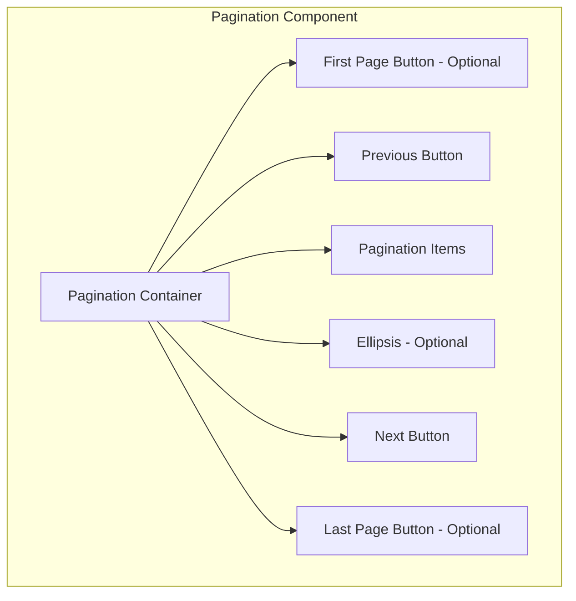

import { Playground } from "@/components/playground";
import { StepsPagination } from "@/components/seo/steps-pagination.tsx";

<StepsPagination />

<PatternStats
  popularity="high"
/>

<PatternPreview />

## Overview

**[Pagination](/glossary/pagination)** divides large content collections into manageable chunks or pages.
Users navigate through data sets, search results, or product listings without getting overwhelmed by too much information at once.

Pagination works well, but consider alternatives like [infinite scroll](/patterns/navigation/infinite-scroll) or ["Load More"](/patterns/navigation/load-more) buttons for certain content types. Your choice between pagination and infinite scroll depends on content nature, user behavior, and interface goals.

<BuildEffort
  level="medium"
  description="Requires page navigation logic, active state management, keyboard accessibility, and ARIA attributes (`aria-current`, `aria-label`)."
/>

## Use Cases

### When to use:

Use pagination when content needs structured, progressive loading for smoother user experience and better performance.

Pagination helps users navigate large information sets without getting overwhelmed.

**Common scenarios include:**

- **Content lists** need browsing (search results, blog archives, product listings)
- **Page performance** improves by loading smaller content segments
- **User clarity** increases when large data sets become easier to navigate
- **Sequential content** requires navigation (multi-page tutorials or articles)

### When not to use:

- All content fits better on a single page (short lists or summaries)
- [Infinite scroll](/patterns/navigation/infinite-scroll) or ["load more"](/patterns/navigation/load-more) patterns suit the experience better
- Users need continuous comparison between items on different pages

<PatternComparison
  current="Pagination"
  alternatives={[
    {
      name: "Load More",
      path: "/patterns/navigation/load-more",
      when: "users prefer continuous browsing without page reloads",
      pros: ["Keeps context", "Smoother experience"],
      cons: ["No jump to specific content", "Can't bookmark position"]
    },
    {
      name: "Infinite Scroll",
      path: "/patterns/navigation/infinite-scroll",
      when: "content consumption should be seamless and addictive",
      pros: ["No user action needed", "Engagement focused"],
      cons: ["Footer inaccessible", "Performance issues with long lists"]
    },
    {
      name: "Tabs",
      path: "/patterns/navigation/tabs",
      when: "content has distinct categories that users switch between",
      pros: ["Clear organization", "Quick switching"],
      cons: ["Limited to few categories", "Not for large datasets"]
    }
  ]}
/>

## Benefits

- Page loads faster by limiting content loaded at once
- Users stay oriented within large datasets
- Clear navigation cues guide through content
- Performance improves and server load drops
- Bookmarking and sharing specific pages becomes easier
- Users understand content scope (total pages/items)
- Goal-oriented tasks work better than with infinite scroll

## Drawbacks

- **Interrupts user flow** – Users must click to navigate instead of scrolling continuously
- **Complex navigation** – Must handle "Previous," "Next," first, and last page controls
- **Mobile challenges** – Small pagination buttons are hard to tap on touchscreens
- **SEO risks** – Poor implementation creates duplicate content issues
- **Reload delays** – Full-page reloads slow the experience without dynamic updates

## Anatomy



### Component Structure

1. **Container**

- Wraps all pagination controls
- Manages layout and spacing
- Handles ARIA labeling and keyboard navigation

2. **Previous Button**

- Navigates to the preceding page
- Disabled on first page to show no previous content exists

3. **Pagination Items**

- Numbered buttons or links for each page
- Current page shows clearly (visual cues and ARIA attributes)
- Ellipsis ("…") appears for large page ranges

4. **Next Button**

- Navigates to the next page
- Disabled on last page to prevent further navigation

5. **First & Last Page Buttons (Optional)**

- Quick jumps to **first** and **last** pages
- Helpful for **long pagination ranges**

6. **Ellipsis (Optional)**

- Shows missing page numbers in large paginations
- Reduces clutter, keeps navigation clear

7. **Visual States**

- **Default:** Normal state with clear labels and clickable elements.
- **Hover and Focus:** Provides visual cues (underline, background change, or border) for interactive elements.
- **Active:** Indicates the currently selected page.
- **Disabled:** Non-interactive controls (e.g., previous on page 1, next on last page).
- **Keyboard Focus:** Ensures proper highlight states for accessibility.
- **ARIA Live Updates:** Announces page changes for screen readers.
- **Loading Indicators (Optional):** Shows progress when paginated content is being fetched asynchronously.

#### Summary of Components

| Component               | Required? | Purpose                                          |
| ----------------------- | --------- | ------------------------------------------------ |
| Container               | ✅ Yes    | Wraps the pagination controls.                   |
| Next/Previous Buttons   | ✅ Yes    | Allows users to navigate between pages.          |
| Page List               | ✅ Yes    | Contains the list of page numbers.               |
| Page Item               | ✅ Yes    | Represents each individual page link.            |
| First/Last Page Buttons | ❌ No     | Enables quick navigation to the first/last page. |
| Ellipsis                | ❌ No     | Represents omitted pages in large paginations.   |
| Loading Indicator       | ❌ No     | Displays when fetching new paginated content.    |

## Variations

### 1. Standard Pagination
The classic numbered page navigation with Previous/Next buttons.

**When to use:** General content lists, search results, tables

### 2. Infinite Pagination
Combines pagination with infinite scroll - loads new pages automatically but maintains page boundaries.

**When to use:** Social feeds, image galleries where users want continuous browsing

### 3. Load More Pagination
Shows a "Load More" button instead of page numbers, appending content to the current view.

**When to use:** Mobile interfaces, casual browsing experiences

### 4. Simple Previous/Next
Only shows Previous and Next buttons without page numbers.

**When to use:** Linear content like tutorials, wizards, or articles

### 5. Alphabetical/Range Pagination
Groups content by alphabetical ranges (A-C, D-F) or other categories.

**When to use:** Directories, glossaries, large catalogs

### 6. Mini Pagination
Compact version showing limited page numbers (e.g., 1...5, 6, 7...20).

**When to use:** Limited space, mobile views, secondary navigation

### 7. Hybrid Pagination
Combines page numbers with a dropdown to jump to any page.

**When to use:** Large datasets where users need both sequential and random access

## Examples

### Basic Pagination

<Playground patternType="navigation" pattern="pagination" example="basic" height="400px" />

This example demonstrates:
- Page number navigation with Previous/Next buttons
- Current page highlighting
- Disabled states for first/last pages
- Keyboard navigation support
- ARIA labels for accessibility
- Responsive design for mobile
- Smooth transitions between pages

### Basic Implementation

```html
<!-- Pagination Container -->
<nav class="pagination" aria-label="Pagination Navigation">
  <!-- Previous Button -->
  <button
    type="button"
    class="pagination-prev"
    aria-label="Previous page"
    disabled
  >
    Previous
  </button>

  <!-- Pagination Items -->
  <ul class="pagination-list">
    <li>
      <button
        type="button"
        class="pagination-item"
        aria-label="Page 1"
        aria-current="page"
      >
        1
      </button>
    </li>
    <li>
      <button type="button" class="pagination-item" aria-label="Page 2">
        2
      </button>
    </li>
    <li>
      <button type="button" class="pagination-item" aria-label="Page 3">
        3
      </button>
    </li>
    <!-- Ellipsis for additional pages, if needed -->
    <li><span class="pagination-ellipsis">…</span></li>
    <li>
      <button type="button" class="pagination-item" aria-label="Page 10">
        10
      </button>
    </li>
  </ul>

  <!-- Next Button -->
  <button type="button" class="pagination-next" aria-label="Next page">
    Next
  </button>
</nav>
```

## Best Practices

### Content

**Do's ✅**

- Pick clear, concise labels for navigation controls
- Give context ("Page 5 of 20")
- Use ellipsis (...) for large page ranges
- Check if pagination or infinite scroll fits your use case and content type better
- Display loading indicators when fetching new content
- Update URLs to reflect current page numbers

**Don'ts ❌**

- Skip cluttering the interface with excessive pagination controls
- Never paginate short lists that fit on one page
- Avoid ambiguous labels that confuse users
- Stop loading unnecessary data or assets irrelevant to the current page

### Accessibility

**Do's ✅**

- Wrap pagination controls with semantic `<nav>` element
- Add `aria-label="Pagination"` or similar for screen readers
- Make each page link focusable with clear labels
- Set logical keyboard navigation order (Tab, Enter, Arrow keys)
- Mark current page with `aria-current="page"`
- Auto-scroll to top of content area when loading new pages (use smooth scrolling to avoid jarring jumps)
- Move focus to main content or first item after loading
- Announce loading status and page changes with ARIA [live regions](/glossary/live-regions) (e.g., <div role="status" aria-live="polite">Loading page 3…</div>) for screen readers
- Include "Skip to content" link that shows on focus for keyboard users

**Don'ts ❌**

- Never rely only on color for current page; add text or icons too
- Skip complex pagination structures that confuse keyboard and assistive tech users
- Always change scroll position when loading new page content
- Don't set focus to pagination controls after page load – it disorients users

### Visual Design

**Do's ✅**

- Keep spacing, typography, and colors consistent for clarity
- Separate pagination items visually
- Make active state stand out
- Add subtle hover animations to signal interactivity
- Design for scale with many pages (abbreviate: 1k, 2k for 1000, 2000)
- Build efficient server-side pagination to cut load times
- Apply smooth scrolling when auto-moving to new content top

**Don'ts ❌**

- Never make interactive elements too small for mobile tapping
- Skip decorative styles that hurt content readability
- Avoid blocking entire page interaction during loading unless necessary
- Don't add separator elements to the DOM; render separators with CSS pseudo-elements instead

### Layout & Positioning

**Do's ✅**

- Place pagination controls logically (usually bottom of content listings)
- Maintain strong contrast between pagination controls and background
- Apply responsive design for usability across devices
- Try progressive loading for images and media
- Keep scroll position when updating only part of the page (single-page apps)

**Don'ts ❌**

- Keep pagination close to content to avoid excessive scrolling
- Skip fixed positioning that blocks content on small screens
- Preserve browser history functionality with custom pagination

## Common Mistakes & Anti-Patterns 🚫

### **No Indication of Total Pages**
**The Problem:**
Users can't gauge content size or their progress.

**How to Fix It:**
Show total page count or items ("Page 3 of 12" or "Showing 21-30 of 120 items").

### **Missing Current Page Highlight**
**The Problem:**
Users lose track of their current page, especially after scrolling.

**How to Fix It:**
Distinguish the active page with contrasting colors, borders, or size.

### **Tiny Click Targets**
**The Problem:**
Page numbers and controls are too small for easy clicking, especially on mobile.

**How to Fix It:**
Use minimum 44x44px touch targets with adequate spacing between elements.

### **No Keyboard Navigation**
**The Problem:**
Pagination works only with mouse/touch, locking out keyboard users.

**How to Fix It:**
Add full keyboard support with Tab navigation and Enter/Space activation.

### **Jumping to Top Without Warning**
**The Problem:**
Page changes trigger unexpected scroll to top, disorienting users.

**How to Fix It:**
Keep scroll position or smoothly animate to top with clear indication. Use `scroll-behavior: smooth` or JavaScript smooth scrolling, and announce page changes via ARIA live regions to inform users of the navigation change.

### **Poor Mobile Adaptation**
**The Problem:**
Desktop pagination with many page numbers fails on mobile.

**How to Fix It:**
Apply responsive design showing fewer page numbers on smaller screens.

## Micro-Interactions & Animations

Pagination needs these specific, purpose-driven animations:

- **Button Hover Animation:**

  - **Effect:** Scale button to 1.05× on hover and smoothly transition background color
  - **Timing:** 200ms ease transition for responsive feel without delay

- **Focus State Animation:**

  - **Effect:** Button focus (keyboard or pointer) animates clear visual indicator—crisp outline or subtle drop-shadow for active state
  - **Timing:** 200ms effect creates smooth visual cue

- **Active (Click) Animation:**

  - **Effect:** Clicking triggers brief confirmation animation (quick pulse or scale to 1.1×) signaling selection
  - **Timing:** 150–200ms completion gives immediate feedback without interrupting flow

- **Content Transition (When Applicable):**

  - **Effect:** Pagination triggering content updates (common in SPAs) uses fade transition—outgoing fades out, incoming fades in
  - **Timing:** 250ms opacity transition ensures smooth change without distraction

- **Reduced Motion Consideration:**
  - **Implementation:** Check user motion preferences (`prefers-reduced-motion` media query) and disable or minimize animations for accessibility

These animations give just enough feedback to guide interactions and enhance pagination feel without overwhelming the interface.

## Tracking

Pagination tracking measures how users navigate content, their preference for sequential clicking versus skipping ahead, and whether they reach deeper pages. Analyzing pagination behavior optimizes user experience and improves content discoverability.

### Key Tracking Points

Pagination interactions provide valuable user behavior insights. Key events to track:

| **Event Name**            | **Description**                                                                                            | **Why Track It?**                                                   |
| ------------------------- | ---------------------------------------------------------------------------------------------------------- | ------------------------------------------------------------------- |
| `pagination.view`         | When the pagination component enters the [viewport](/glossary/viewport).                                                         | Determines visibility and whether pagination is available to users. |
| `pagination.next_click`   | When a user clicks the **next page** button.                                                               | Measures sequential navigation behavior.                            |
| `pagination.prev_click`   | When a user clicks the **previous page** button.                                                           | Tracks backward navigation trends.                                  |
| `pagination.page_click`   | When a user clicks a specific numbered page.                                                               | Helps assess whether users jump ahead instead of clicking next.     |
| `pagination.first_click`  | When a user clicks the first page button (if available).                                                   | Measures how often users return to the beginning.                   |
| `pagination.last_click`   | When a user clicks the last page button (if available).                                                    | Indicates if users want to skip directly to the end.                |
| `pagination.page_load`    | When a new paginated page loads (via user interaction or auto-pagination).                                 | Helps measure engagement depth.                                     |
| `pagination.scroll_trigger` | If infinite scrolling is enabled, tracks when users reach a pagination trigger (e.g., "Load More" button). | Helps compare pagination click interactions vs. scrolling behavior. |

### Common Payload Contract

All pagination events should include these core properties for consistent analysis:

```json
{
  "component_id": "search_results",
  "current_page": 3,
  "total_pages": 10
}
```

### Event Payload Structure

For consistent tracking, use this event format:

```json
{
  "event": "pagination.page_click",
  "properties": {
    "pagination_id": "search_results",
    "clicked_page": 4,
    "total_pages": 10,
    "interaction_type": "click"
  }
}
```

### Key Metrics to Analyze

After setting up tracking, these metrics provide actionable insights:

- **Next Page Click Rate** → Percentage of users who click the "Next" button.
- **Page Jump Rate** → Percentage of users who select a specific page instead of clicking "Next."
- **Backward Navigation Rate** → Percentage of users who click "Previous" or navigate back to earlier pages.
- **Deep Pagination Engagement** → How far users go into paginated content (e.g., do they go past page 3?).
- **First vs. Last Page Access Rate** → How often users jump to the first or last page.
- **Infinite Scroll vs. Pagination Click Rate** → If both options exist, measures preference for clicking pagination vs. scrolling to load more.

### Insights & Optimization Based on Tracking

Tracking data analysis optimizes the pagination experience:

- 🚨 **Low Next Page Click Rate?**
  → Users don't find pagination useful or engaging.
  **Fix:** Improve results per page, strengthen visual cues, or test infinite scrolling.

- ⏳ **High Page Jump Rate?**
  → Users prefer skipping ahead over sequential navigation.
  **Fix:** Add better filtering options or let users select results per page.

- 🔄 **Frequent Backward Navigation?**
  → Users miss important content on previous pages.
  **Fix:** Improve sorting and relevance on earlier pages.

- 🔁 **Low Deep Pagination Engagement?**
  → Users rarely go past the first few pages.
  **Fix:** Don't bury important content deep or test loading more items per page.

- ⚙️ **High Infinite Scroll Usage vs. Clicks?**
  → Users prefer scrolling over clicking pagination.
  **Fix:** Test infinite scrolling as default but check performance and usability impact.

Continuous monitoring of these metrics refines pagination usability, helping users navigate content without frustration.

## Localization

```json
{
  "pagination": {
    "next_page": {
      "label": "Next",
      "aria_label": "Go to the next page"
    },
    "previous_page": {
      "label": "Previous",
      "aria_label": "Go to the previous page"
    },
    "page_number": {
      "aria_label": "Page {page_number}"
    },
    "first_page": {
      "label": "First",
      "aria_label": "Go to the first page"
    },
    "last_page": {
      "label": "Last",
      "aria_label": "Go to the last page"
    }
  }
}
```

## Accessibility

### ARIA Attributes

**Required [ARIA Attributes](/glossary/aria-attributes):**

- The container should use role="navigation" with an appropriate aria-label (e.g., "Pagination Navigation").
- Each pagination item should include aria-labels indicating the respective page number.
- Indicate the current page using aria-current="page".

### Keyboard Interaction Pattern

The following table outlines the standard keyboard interactions for pagination components:

| Key         | Action                                                   |
| ----------- | -------------------------------------------------------- |
| Tab         | Navigate among pagination controls and page buttons      |
| Enter/Space | Activate the focused pagination button                   |
| Arrow Keys  | Optionally, navigate between page items (if implemented) |

## Testing Guidelines

### Functional Testing

**Should ✓**

- [ ] Verify that the pagination controls render correctly.
- [ ] Ensure clicking the Previous and Next buttons navigates to the correct pages.
- [ ] Test that the active state updates when navigating through pages.
- [ ] Confirm that disabled states (on the first or last page) are correctly implemented.

### Accessibility Testing

**Should ✓**

- [ ] Validate that the pagination container has role="navigation" and an appropriate aria-label.
- [ ] Confirm each pagination item is focusable and properly labeled.
- [ ] Ensure keyboard navigation works seamlessly with the pagination controls.
- [ ] Test that screen readers correctly announce the current page.

### Visual Testing

**Should ✓**

- [ ] Confirm that pagination controls adapt gracefully to different screen sizes.
- [ ] Verify that active and hover states are visually distinct.
- [ ] Check that pagination does not overlap or interfere with other page elements.

### Performance Testing

**Should ✓**

- [ ] Ensure that pagination does not cause significant loading delays.
- [ ] Validate that new page content loads efficiently when navigating.

## Browser Support

<BrowserSupport features={["css.flexbox", "window.api.history.pushstate"]} />

## Performance Metrics

### Target Metrics

**Response Times:**
- **Page change initiation:** < 100ms after click
- **Content load start:** < 200ms
- **Full page render:** < 1000ms (ideal), < 2000ms (acceptable)
- **Animation duration:** 200-300ms for transitions

**Data Loading:**
- **Prefetch strategy:** Load adjacent pages in background
- **Cache duration:** 5 minutes for recently viewed pages
- **Request size:** < 50KB per page of data
- **Concurrent requests:** Maximum 2 prefetch requests

**Rendering Performance:**
- **First Contentful Paint:** < 500ms
- **Cumulative Layout Shift (CLS):** [CLS](/glossary/cls-cumulative-layout-shift) < 0.1
- **Time to Interactive:** < 1500ms
- **Frame rate:** 60fps during animations

**Mobile Optimization:**
- **Touch response:** < 100ms feedback
- **Bandwidth usage:** Minimize with compression
- **Battery impact:** Avoid continuous animations
- **Memory footprint:** < 10MB for pagination component

## SEO Considerations

- Use [semantic HTML](/glossary/semantic-html) (e.g., `<nav>` and lists) to help search engines understand your site structure.
- Ensure that pagination links are crawlable, improving site indexing.
- Consider implementing [progressive loading](/glossary/progressive-loading) for better performance and user experience.
- Use unique URL parameters for each page (e.g., `/products?page=2`)
- Implement rel="prev" and rel="next" link tags for search engines
- Avoid duplicate content issues with proper [canonical tags](/glossary/canonical-tags)

## Design Tokens

These design tokens follow the [Design Tokens Format](https://design-tokens.github.io/community-group/format/) specification and can be used with various token transformation tools to generate platform-specific variables.

### Pagination Tokens in DTF Format

```json
{
  "$schema": "https://design-tokens.org/schema.json",
  "pagination": {
    "container": {
      "padding": { "value": "1rem", "type": "dimension" },
      "background": { "value": "{color.white}", "type": "color" }
    },
    "item": {
      "size": { "value": "2rem", "type": "dimension" },
      "fontSize": { "value": "1rem", "type": "fontSize" },
      "color": { "value": "{color.text}", "type": "color" },
      "activeColor": { "value": "{color.primary}", "type": "color" }
    },
    "button": {
      "padding": { "value": "0.5rem 1rem", "type": "dimension" },
      "borderRadius": { "value": "0.25rem", "type": "dimension" }
    }
  }
}
```

## FAQ

<FaqStructuredData
  items={[
    {
      question: "What is pagination in web design?",
      answer:
        "Pagination is a UI pattern that divides content into discrete pages, allowing users to navigate through large datasets in manageable chunks. It provides controls like page numbers and Previous/Next buttons.",
    },
    {
      question: "When should I use pagination vs infinite scroll?",
      answer:
        "Use pagination when users need to reference specific locations, for SEO-critical content, or when users expect to find specific items. Use infinite scroll for casual browsing experiences like social feeds.",
    },
    {
      question: "How many items should I show per page?",
      answer:
        "Typically 10-50 items per page, depending on content type. Consider 10 for detailed items, 25 for medium detail, and 50 for simple lists. Always provide options for users to adjust.",
    },
    {
      question: "How can I make pagination SEO-friendly?",
      answer:
        "Use unique URLs for each page, implement rel='prev' and rel='next' links, ensure all pages are crawlable, and avoid duplicate content issues with proper canonical tags.",
    },
    {
      question: "What's the best pagination pattern for mobile?",
      answer:
        "For mobile, show fewer page numbers (e.g., < 1 2 3 ... 10 >), ensure touch targets are at least 44x44px, and consider 'Load More' as an alternative for better mobile experience.",
    },
  ]}
/>

## Related Patterns

<RelatedPatternsCard category="navigation" />

## Resources

### Libraries & Frameworks

#### React Components
- [React Paginate](https://github.com/AdeleD/react-paginate) – A ReactJS component to render a pagination
- [RC Pagination](https://github.com/react-component/pagination) – React pagination component
- [Ant Design Pagination](https://ant.design/components/pagination) – Enterprise-class pagination component

#### Vue Components
- [Vue Pagination 2](https://github.com/matfish2/vue-pagination-2) – Vue.js 2 pagination component
- [Vuetify Pagination](https://vuetifyjs.com/en/components/paginations/) – Material Design pagination component

#### Vanilla JavaScript
- [Pagination.js](http://pagination.js.org/) – A jQuery plugin for pagination
- [SimplePagination.js](https://flaviusmatis.github.io/simplePagination.js) – Simple and lightweight pagination plugin

### Articles

- [Pagination Design Pattern](https://www.nngroup.com/articles/pagination/)

### Implementation Guides

- [React Pagination Tutorial](https://www.digitalocean.com/community/tutorials/how-to-build-custom-pagination-with-react)
- [Vue.js Pagination Component](https://vuejs.org/examples/#grid-component)
- [Accessible Pagination with ARIA](https://a11y-style-guide.com/style-guide/section-navigation.html#kssref-navigation-pagination)
