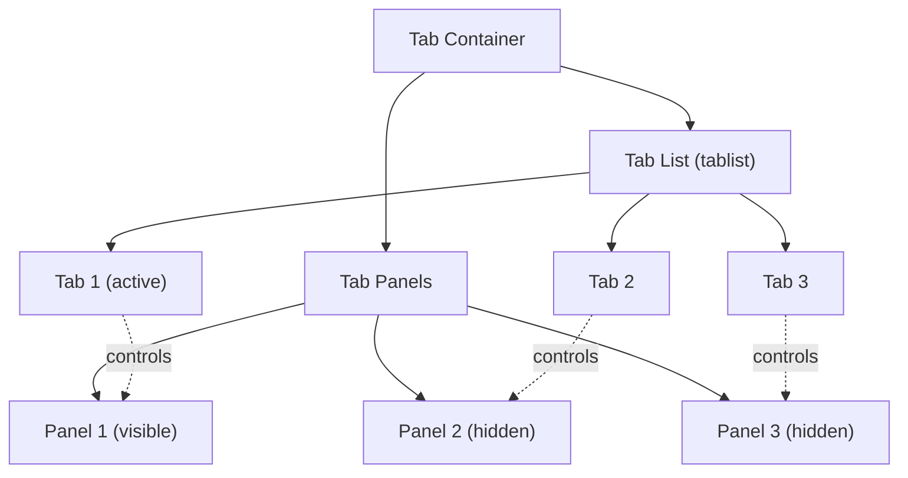

<PatternStats
  popularity="high"
/>

## Overview

**Tabs** organize content into multiple panels that share the same space, allowing users to switch between views without leaving the page. Only one tab panel is visible at a time, while the tab list provides persistent indicators of all available sections.

Tabs reduce information overload by letting users focus on one content section at a time while keeping the full set of options visible and reachable with a single click or keyboard press.

<BuildEffort
  level="medium"
  description="Requires proper ARIA roles (tablist, tab, tabpanel), keyboard arrow-key navigation between tabs, controlled active state management, and responsive handling for overflow tabs. Optional features like URL synchronization and lazy loading add complexity."
/>

## Use Cases

### When to use:

Use **Tabs** to **organize related content into parallel sections at the same hierarchy level where users benefit from switching between views**.

**Common scenarios include:**

- Product pages with Description, Specifications, and Reviews sections
- Settings pages with General, Security, Notifications, and Billing tabs
- Dashboard widgets with different data views (Chart, Table, Summary)
- Code editors showing different files or language previews (HTML, CSS, JS)
- User profiles with Activity, Projects, and Settings sections

### When not to use:

- Content that users need to see simultaneously for comparison (use side-by-side layout)
- Sequential steps that must be completed in order (use a [wizard](/patterns/advanced/wizard) or stepper)
- Navigation between entirely different pages (use a [navigation menu](/patterns/navigation/navigation-menu))
- When there are only 2 options (consider a toggle or segmented control instead)
- When there are more than 7-8 tabs (consider a sidebar or vertical navigation)

### Common scenarios and examples

- Product detail pages separating description, specifications, reviews, and Q&A
- API documentation with code samples in multiple languages
- Email interface tabs for Inbox, Sent, Drafts, and Archive
- Settings panels organizing preferences into logical groups
- Analytics dashboards toggling between chart types or time ranges

<PatternComparison
  current="Tabs"
  alternatives={[
    {
      name: "Accordion",
      path: "/patterns/content-management/accordion",
      when: "content sections vary significantly in length or users may want multiple sections open",
      pros: ["Multiple sections visible", "Variable content height", "Mobile-friendly"],
      cons: ["Less compact for few items", "No persistent overview of all sections"]
    },
    {
      name: "Navigation Menu",
      path: "/patterns/navigation/navigation-menu",
      when: "switching between entirely different pages rather than in-page content",
      pros: ["Full page navigation", "URL-based routing", "SEO-friendly"],
      cons: ["Full page reload", "Loses in-page context"]
    },
    {
      name: "Sidebar",
      path: "/patterns/navigation/sidebar",
      when: "many sections need persistent vertical navigation with hierarchy",
      pros: ["Supports many items", "Nested structure", "Always visible"],
      cons: ["Takes horizontal space", "Overkill for 3-5 sections"]
    }
  ]}
/>

## Benefits

- Organizes content without overwhelming the user with everything at once
- The tab list provides a persistent overview of all available sections
- Switching is instant — no page load or network request required
- Clear active state indicates which content is currently displayed
- Saves vertical space compared to showing all content stacked

## Drawbacks

- **Hidden content risk** – Users may miss content in non-active tabs if they don't realize more exists
- **Limited scalability** – More than 7-8 tabs become difficult to scan and fit horizontally
- **Print unfriendly** – Only the active tab panel prints by default; hidden panels are lost
- **Mobile overflow** – Horizontal tab lists overflow on narrow screens without scrollable or wrap strategies
- **SEO limitations** – Content in non-active panels may be deprioritized by search engines if not in the initial HTML
- **Keyboard pattern complexity** – Arrow key navigation between tabs requires careful ARIA implementation

## Anatomy



### Component Structure

1. **Tab Container**

- The root wrapper holding both the tab list and tab panels
- Provides structural grouping without specific ARIA role
- Handles layout and positioning of the tab interface

2. **Tab List (`role="tablist"`)**

- The horizontal (or vertical) bar containing all tab triggers
- Uses `role="tablist"` and an `aria-label` describing the tab group
- Supports `aria-orientation` for horizontal or vertical variants

3. **Tab (`role="tab"`)**

- Individual clickable elements that activate their associated panel
- The active tab has `aria-selected="true"` and `tabindex="0"`
- Inactive tabs have `aria-selected="false"` and `tabindex="-1"`
- Connected to its panel via `aria-controls`

4. **Tab Panel (`role="tabpanel"`)**

- The content area associated with a specific tab
- Only the active panel is visible; others are hidden
- Uses `aria-labelledby` pointing to its associated tab
- Receives `tabindex="0"` so it can be focused after tab activation

#### Summary of Components

| Component     | Required? | Purpose                                                      |
| ------------- | --------- | ------------------------------------------------------------ |
| Tab Container | ✅ Yes    | Root wrapper for the tab interface.                          |
| Tab List      | ✅ Yes    | Contains all tab triggers with `role="tablist"`.             |
| Tab           | ✅ Yes    | Individual triggers with `role="tab"` and ARIA attributes.   |
| Tab Panel     | ✅ Yes    | Content areas with `role="tabpanel"` linked to their tab.    |

## Variations

### 1. Horizontal Tabs
The standard horizontal tab list positioned above the content panels.

**When to use:** Most use cases — this is the default and most expected tab layout.

### 2. Vertical Tabs
Tab triggers stacked vertically on the left or right side with panels adjacent.

**When to use:** Settings pages, forms with many sections, or when tab labels are long.

### 3. Scrollable Tabs
A horizontal tab list that scrolls when there are more tabs than the container can display.

**When to use:** When the number of tabs is dynamic or may exceed available width (e.g., browser tabs, code editor files).

### 4. Icon Tabs
Tabs using icons instead of or alongside text labels for a compact presentation.

**When to use:** Toolbar-like interfaces, mobile apps, or when tab categories are well represented by icons.

### 5. Pill / Segmented Tabs
Tabs styled as a segmented control with pill-shaped backgrounds and no visible panel border.

**When to use:** Toggling between 2-4 views in a compact, button-like presentation (e.g., Map vs. List view).

### 6. URL-Synced Tabs
Tabs that synchronize the active tab with a URL hash or query parameter for deep linking and back-button support.

**When to use:** When users should be able to share or bookmark a specific tab state (e.g., documentation, product pages).

## Examples

### Basic HTML Implementation

```html
<div class="tabs">
  <div role="tablist" aria-label="Product information">
    <button
      role="tab"
      id="tab-description"
      aria-selected="true"
      aria-controls="panel-description"
      tabindex="0"
    >
      Description
    </button>
    <button
      role="tab"
      id="tab-specs"
      aria-selected="false"
      aria-controls="panel-specs"
      tabindex="-1"
    >
      Specifications
    </button>
    <button
      role="tab"
      id="tab-reviews"
      aria-selected="false"
      aria-controls="panel-reviews"
      tabindex="-1"
    >
      Reviews
    </button>
  </div>

  <div
    role="tabpanel"
    id="panel-description"
    aria-labelledby="tab-description"
    tabindex="0"
  >
    <p>Product description content goes here.</p>
  </div>

  <div
    role="tabpanel"
    id="panel-specs"
    aria-labelledby="tab-specs"
    tabindex="0"
    hidden
  >
    <p>Technical specifications go here.</p>
  </div>

  <div
    role="tabpanel"
    id="panel-reviews"
    aria-labelledby="tab-reviews"
    tabindex="0"
    hidden
  >
    <p>Customer reviews go here.</p>
  </div>
</div>

<script>
  const tablist = document.querySelector('[role="tablist"]');
  const tabs = tablist.querySelectorAll('[role="tab"]');
  const panels = document.querySelectorAll('[role="tabpanel"]');

  function activateTab(tab) {
    tabs.forEach(t => {
      t.setAttribute('aria-selected', 'false');
      t.setAttribute('tabindex', '-1');
    });

    panels.forEach(p => p.setAttribute('hidden', ''));

    tab.setAttribute('aria-selected', 'true');
    tab.setAttribute('tabindex', '0');
    tab.focus();

    const panel = document.getElementById(tab.getAttribute('aria-controls'));
    panel.removeAttribute('hidden');
  }

  tabs.forEach(tab => {
    tab.addEventListener('click', () => activateTab(tab));

    tab.addEventListener('keydown', (e) => {
      const index = Array.from(tabs).indexOf(tab);
      let newIndex;

      if (e.key === 'ArrowRight') {
        newIndex = (index + 1) % tabs.length;
      } else if (e.key === 'ArrowLeft') {
        newIndex = (index - 1 + tabs.length) % tabs.length;
      } else if (e.key === 'Home') {
        newIndex = 0;
      } else if (e.key === 'End') {
        newIndex = tabs.length - 1;
      } else {
        return;
      }

      e.preventDefault();
      activateTab(tabs[newIndex]);
    });
  });
</script>
```

### React Implementation

```jsx
import { useState, useRef, useCallback } from 'react';

function Tabs({ tabs, defaultTab, ariaLabel }) {
  const [activeTab, setActiveTab] = useState(defaultTab || tabs[0].id);
  const tabRefs = useRef([]);

  const handleKeyDown = useCallback((e, index) => {
    let newIndex;

    if (e.key === 'ArrowRight') {
      newIndex = (index + 1) % tabs.length;
    } else if (e.key === 'ArrowLeft') {
      newIndex = (index - 1 + tabs.length) % tabs.length;
    } else if (e.key === 'Home') {
      newIndex = 0;
    } else if (e.key === 'End') {
      newIndex = tabs.length - 1;
    } else {
      return;
    }

    e.preventDefault();
    setActiveTab(tabs[newIndex].id);
    tabRefs.current[newIndex]?.focus();
  }, [tabs]);

  return (
    <div className="tabs">
      <div role="tablist" aria-label={ariaLabel}>
        {tabs.map((tab, index) => (
          <button
            key={tab.id}
            ref={(el) => { tabRefs.current[index] = el; }}
            role="tab"
            id={`tab-${tab.id}`}
            aria-selected={activeTab === tab.id}
            aria-controls={`panel-${tab.id}`}
            tabIndex={activeTab === tab.id ? 0 : -1}
            onClick={() => setActiveTab(tab.id)}
            onKeyDown={(e) => handleKeyDown(e, index)}
          >
            {tab.label}
          </button>
        ))}
      </div>

      {tabs.map((tab) => (
        <div
          key={tab.id}
          role="tabpanel"
          id={`panel-${tab.id}`}
          aria-labelledby={`tab-${tab.id}`}
          tabIndex={0}
          hidden={activeTab !== tab.id}
        >
          {tab.content}
        </div>
      ))}
    </div>
  );
}
```

### CSS Styling

```css
.tabs {
  width: 100%;
}

[role="tablist"] {
  display: flex;
  gap: 0;
  border-bottom: 1px solid #e5e7eb;
  overflow-x: auto;
  -webkit-overflow-scrolling: touch;
  scrollbar-width: none;
}

[role="tablist"]::-webkit-scrollbar {
  display: none;
}

[role="tab"] {
  flex-shrink: 0;
  padding: 0.75rem 1.25rem;
  border: none;
  border-bottom: 2px solid transparent;
  background: transparent;
  color: #6b7280;
  font-size: 0.9375rem;
  font-weight: 500;
  cursor: pointer;
  white-space: nowrap;
  transition: color 150ms ease, border-color 150ms ease;
}

[role="tab"]:hover {
  color: #374151;
  border-bottom-color: #d1d5db;
}

[role="tab"][aria-selected="true"] {
  color: #2563eb;
  border-bottom-color: #2563eb;
}

[role="tab"]:focus-visible {
  outline: 2px solid #2563eb;
  outline-offset: -2px;
  border-radius: 0.25rem 0.25rem 0 0;
}

[role="tabpanel"] {
  padding: 1.5rem 0;
}

[role="tabpanel"]:focus-visible {
  outline: 2px solid #2563eb;
  outline-offset: 2px;
  border-radius: 0.25rem;
}

/* Vertical tabs variant */
.tabs-vertical {
  display: flex;
  gap: 1.5rem;
}

.tabs-vertical [role="tablist"] {
  flex-direction: column;
  border-bottom: none;
  border-right: 1px solid #e5e7eb;
  gap: 0.25rem;
  padding-right: 0;
  overflow: visible;
}

.tabs-vertical [role="tab"] {
  border-bottom: none;
  border-right: 2px solid transparent;
  text-align: left;
}

.tabs-vertical [role="tab"][aria-selected="true"] {
  border-right-color: #2563eb;
}

/* Pill / segmented variant */
.tabs-pill [role="tablist"] {
  display: inline-flex;
  gap: 0.25rem;
  padding: 0.25rem;
  background: #f3f4f6;
  border: none;
  border-radius: 0.5rem;
}

.tabs-pill [role="tab"] {
  border: none;
  border-radius: 0.375rem;
  padding: 0.5rem 1rem;
}

.tabs-pill [role="tab"][aria-selected="true"] {
  background: #fff;
  color: #111827;
  box-shadow: 0 1px 3px rgba(0, 0, 0, 0.1);
}

@media (max-width: 640px) {
  [role="tab"] {
    padding: 0.625rem 1rem;
    font-size: 0.875rem;
  }
}

@media (prefers-reduced-motion: reduce) {
  [role="tab"] {
    transition: none;
  }
}
```

## Best Practices

### Content

**Do's ✅**

- Use short, descriptive tab labels (1-3 words)
- Keep tab count between 2 and 7 for scannability
- Order tabs by importance or expected user workflow
- Make the default (first) tab the most commonly needed content

**Don'ts ❌**

- Don't use tabs to hide critical information the user must see
- Don't make tab labels so short they become ambiguous (e.g., "Info" vs. "Product Info")
- Don't change the number or order of tabs dynamically without clear reason
- Don't nest tabs inside tabs — use a different pattern for the inner level

### Accessibility

**Do's ✅**

- Use `role="tablist"` on the tab container, `role="tab"` on each tab, and `role="tabpanel"` on each panel
- Set `aria-selected="true"` on the active tab and `aria-selected="false"` on inactive tabs
- Connect tabs to panels with `aria-controls` (on tab) and `aria-labelledby` (on panel)
- Manage focus with `tabindex`: active tab gets `0`, inactive tabs get `-1`
- Support Arrow Left/Right to move between tabs, Home/End to jump to first/last
- Add `tabindex="0"` to the active panel so users can Tab into the content

**Don'ts ❌**

- Don't use Tab key to navigate between tabs — Arrow keys are the correct pattern per WAI-ARIA
- Don't use links (`<a>`) for tabs unless they navigate to a different URL
- Don't remove the panel from the DOM when hidden — use `hidden` attribute instead
- Don't forget `aria-label` on the tablist to describe the tab group's purpose

### Visual Design

**Do's ✅**

- Clearly distinguish the active tab from inactive tabs with color, weight, and an underline or background
- Position the tab list directly adjacent to the panel with no visual gap
- Use a border or background to associate the tab list with the panel below it
- Keep visual indicators consistent (don't mix underline style with pill style in the same interface)

**Don'ts ❌**

- Don't style inactive tabs so subtly that they appear disabled or non-interactive
- Don't use tabs that look like links or buttons — they should look like tabs
- Don't animate panel content transitions so heavily they feel slow

### Mobile & Touch Considerations

**Do's ✅**

- Make tab list horizontally scrollable when tabs overflow on mobile
- Ensure touch targets are at least 44×44px
- Show a subtle scroll indicator (gradient fade or arrow) to signal more tabs
- Consider converting to an accordion on very narrow screens

**Don'ts ❌**

- Don't allow tab list to wrap to multiple lines — it breaks the tab metaphor
- Don't shrink tab labels to fit; scroll instead
- Don't rely on swipe gestures as the only way to switch tabs

### Layout & Positioning

**Do's ✅**

- Place tabs directly above (horizontal) or beside (vertical) the content panel
- Ensure the tab list and active panel feel visually connected
- Use a consistent panel height or allow natural content height

**Don'ts ❌**

- Don't separate the tab list from the panel with unrelated content
- Don't make the panel a fixed height that requires internal scrolling for short content
- Don't place tabs at the bottom of the content — users expect them at the top

## Common Mistakes & Anti-Patterns 🚫

### Using Tab Key to Navigate Between Tabs
**The Problem:**
Making each tab focusable with `tabindex="0"` forces keyboard users to Tab through every tab before reaching the content.

**How to Fix It:**
Use `tabindex="-1"` on inactive tabs and `tabindex="0"` only on the active tab. Navigate between tabs with Arrow Left/Right keys.

---

### Missing ARIA Roles
**The Problem:**
Using `<div>` or `<button>` without `role="tab"`, `role="tablist"`, or `role="tabpanel"` makes the tab interface invisible to screen readers.

**How to Fix It:**
Apply the full ARIA tab pattern: `role="tablist"` on the container, `role="tab"` on each trigger, `role="tabpanel"` on each content area, with `aria-controls` and `aria-labelledby` connections.

---

### Tabs That Navigate to Different URLs
**The Problem:**
Using tabs for page-level navigation causes full page reloads, breaking the instant-switch expectation of tab interfaces.

**How to Fix It:**
Use a [navigation menu](/patterns/navigation/navigation-menu) for page-level navigation. Tabs should switch in-page content without a page load. If URL sync is needed, use hash fragments.

---

### Too Many Tabs Overflowing Without Scroll
**The Problem:**
More tabs than the container can hold cause wrapping to multiple lines or hidden overflow, making some tabs inaccessible.

**How to Fix It:**
Make the tab list horizontally scrollable with `overflow-x: auto`. Add scroll indicators (arrows or gradient fades) to signal more content.

---

### No Default Active Tab
**The Problem:**
The component renders with no tab selected, showing an empty panel on load.

**How to Fix It:**
Always set a default active tab — typically the first one. Initialize `aria-selected="true"` and show the corresponding panel.

---

### Hidden Panel Content Not in DOM
**The Problem:**
Removing inactive panels from the DOM loses user state (form inputs, scroll position) when switching tabs.

**How to Fix It:**
Use `hidden` attribute or `display: none` to hide panels instead of removing them. This preserves content state and improves performance.

## Micro-Interactions & Animations

### Active Indicator Slide
- **Effect:** An underline or background pill slides from the previously active tab to the newly selected one
- **Timing:** 200ms ease-in-out
- **Trigger:** Tab selection change
- **Implementation:** CSS transition on a pseudo-element's `left` and `width`, or use `transform: translateX`

### Panel Content Fade
- **Effect:** The outgoing panel fades out while the incoming panel fades in
- **Timing:** 150ms crossfade
- **Trigger:** Tab switch
- **Implementation:** CSS opacity transition with brief overlap or sequential animation

### Tab Hover State
- **Effect:** A subtle underline or background appears on hover
- **Timing:** 100ms ease
- **Trigger:** Mouse hover
- **Implementation:** CSS border-bottom-color or background-color transition

### Focus Ring
- **Effect:** A visible focus ring appears on the focused tab
- **Timing:** Immediate (< 16ms)
- **Trigger:** Keyboard focus
- **Implementation:** CSS `:focus-visible` with outline

### Scrollable Tab Indicators
- **Effect:** Gradient fades or small arrows appear at the edges when tabs overflow
- **Timing:** 200ms fade based on scroll position
- **Trigger:** Tab list scroll position changes
- **Implementation:** CSS gradient overlays controlled by JavaScript scroll listener

## Tracking

### Key Events to Track

| **Event Name** | **Description** | **Why Track It?** |
| --- | --- | --- |
| `tabs.selected` | User selects a tab | Measure content section engagement |
| `tabs.keyboard_navigation` | User navigates tabs with arrow keys | Track accessibility feature usage |
| `tabs.scrolled` | User scrolls the tab list to find more tabs | Identify if overflow is causing discovery issues |
| `tabs.panel_time` | Time spent viewing a specific tab panel | Understand content engagement depth |
| `tabs.default_stayed` | User never switches from the default tab | Measure if other tabs are discovered |

### Event Payload Structure

```json
{
  "event": "tabs.selected",
  "properties": {
    "tab_label": "Specifications",
    "tab_index": 1,
    "total_tabs": 3,
    "previous_tab": "Description",
    "selection_method": "click",
    "time_on_previous_ms": 8500,
    "page_path": "/products/laptop-pro"
  }
}
```

### Key Metrics to Analyze

- **Tab Selection Distribution:** How often each tab is activated
- **Default Tab Retention:** Percentage of users who never switch tabs
- **Time Per Panel:** Average viewing time for each tab's content
- **Keyboard Usage Rate:** How often tabs are navigated with arrow keys
- **Scroll Discovery Rate:** How often users scroll to find additional tabs

### Insights & Optimization Based on Tracking

- 📉 **Second Tab Has Low Engagement?**
  → Users may not notice additional tabs. Make the tab list more visually prominent or reorder tabs.

- ⏱️ **Very Short Time on Certain Panels?**
  → Content may not match the tab label expectation. Review and improve the content or rename the tab.

- 🔄 **High Default Tab Retention?**
  → Most users only see the first tab. Ensure the most important content is there, or add visual hints about other tabs.

- ♿ **Low Keyboard Navigation Rate?**
  → Arrow key navigation may not be implemented. Verify the ARIA tab pattern is correctly applied.

- 📜 **High Scroll Discovery Rate?**
  → Too many tabs overflow the container. Consider grouping, using fewer tabs, or switching to a different pattern.

## Localization

```json
{
  "tabs": {
    "tablist": {
      "aria_label": "{context} tabs"
    },
    "scroll_indicators": {
      "scroll_left": "Scroll tabs left",
      "scroll_right": "Scroll tabs right"
    },
    "announcements": {
      "tab_selected": "Selected {tab_label} tab, {index} of {total}",
      "panel_loaded": "{tab_label} content loaded"
    }
  }
}
```

### RTL (Right-to-Left) Considerations

- Reverse tab order visually (first tab on the right)
- Swap Arrow Left/Right key behavior for RTL navigation
- Mirror scroll indicators and overflow gradients
- Right-align vertical tab variants

### Cultural Considerations

- **Tab labels:** Keep labels short; translations can be longer — test with longest expected strings
- **Reading order:** F-pattern scanning maps to LTR tab order; mirror for RTL
- **Tab count:** Some cultures prefer more options visible; test whether overflow scrolling is acceptable

## Performance

### Target Metrics

- **Tab switch:** < 50ms from click to visible panel
- **Initial render:** < 100ms for the full tab interface
- **Keyboard response:** < 16ms focus change on Arrow key press
- **Panel content:** Lazy load heavy content only when the tab is first activated
- **Bundle size:** < 3KB for tab component logic with styles

### Optimization Strategies

**Keep All Panels in DOM (Hidden)**
```html
<!-- Better than removing from DOM — preserves state -->
<div role="tabpanel" hidden>...</div>
```

**Lazy Load Panel Content**
```jsx
function LazyTabPanel({ isActive, children }) {
  const [hasActivated, setHasActivated] = useState(false);

  if (isActive && !hasActivated) setHasActivated(true);

  if (!hasActivated) return <div role="tabpanel" hidden />;

  return (
    <div role="tabpanel" hidden={!isActive}>
      {children}
    </div>
  );
}
```

**Avoid Forced Reflows on Switch**
```css
[role="tabpanel"] {
  contain: layout style;
}
```

## Testing Guidelines

### Functional Testing

**Should ✓**

- [ ] Display the correct panel when a tab is clicked
- [ ] Show only one panel at a time
- [ ] Default to the first tab on initial load
- [ ] Preserve panel content state when switching tabs
- [ ] Handle dynamic tab additions/removals gracefully
- [ ] Sync with URL hash when URL-synced tabs are implemented

### Accessibility Testing

**Should ✓**

- [ ] Tab list has `role="tablist"` with `aria-label`
- [ ] Each tab has `role="tab"` with `aria-selected` and `aria-controls`
- [ ] Each panel has `role="tabpanel"` with `aria-labelledby`
- [ ] Arrow Left/Right navigates between tabs (not Tab key)
- [ ] Home/End jumps to first/last tab
- [ ] Active tab has `tabindex="0"`, inactive tabs have `tabindex="-1"`
- [ ] Panel has `tabindex="0"` for focus management
- [ ] Focus indicator is visible on all focusable elements

### Visual Testing

**Should ✓**

- [ ] Active tab is clearly distinguished from inactive tabs
- [ ] Hover state is visible on inactive tabs
- [ ] Tab list and panel appear visually connected
- [ ] Scrollable tabs show overflow indicators
- [ ] Tab interface renders correctly across viewport sizes

### Performance Testing

**Should ✓**

- [ ] Tab switch happens without perceptible delay
- [ ] No layout shifts when switching panels
- [ ] Lazy-loaded content doesn't block the tab switch
- [ ] Scrollable tab list scrolls smoothly at 60fps

## Browser Support

<BrowserSupport features={["css.properties.display.flex", "css.properties.overflow", "html.elements.button"]} />

## SEO Considerations

- **Hidden content is indexed:** Search engines can read content in hidden tab panels if it's in the HTML DOM
- **Server-side render all panels:** Ensure all tab content is in the initial HTML, not loaded via JavaScript on activation
- **Avoid lazy loading for SEO-critical content:** If tab content is important for search rankings, render it server-side
- **URL hash support:** Linking to a specific tab via hash fragment (e.g., `#reviews`) helps search engines and users reach specific content
- **Structured data compatibility:** Tab content like FAQs or product specs can still include structured data markup

## Design Tokens

```json
{
  "$schema": "https://design-tokens.org/schema.json",
  "tabs": {
    "tablist": {
      "borderColor": { "value": "{color.gray.200}", "type": "color" },
      "gap": { "value": "0", "type": "dimension" }
    },
    "tab": {
      "paddingY": { "value": "0.75rem", "type": "dimension" },
      "paddingX": { "value": "1.25rem", "type": "dimension" },
      "fontSize": { "value": "0.9375rem", "type": "fontSizes" },
      "fontWeight": { "value": "500", "type": "fontWeights" },
      "color": {
        "default": { "value": "{color.gray.500}", "type": "color" },
        "hover": { "value": "{color.gray.700}", "type": "color" },
        "active": { "value": "{color.blue.600}", "type": "color" }
      },
      "borderWidth": { "value": "2px", "type": "dimension" },
      "borderColor": {
        "default": { "value": "transparent", "type": "color" },
        "hover": { "value": "{color.gray.300}", "type": "color" },
        "active": { "value": "{color.blue.600}", "type": "color" }
      }
    },
    "panel": {
      "paddingY": { "value": "1.5rem", "type": "dimension" },
      "paddingX": { "value": "0", "type": "dimension" }
    },
    "focus": {
      "outlineWidth": { "value": "2px", "type": "dimension" },
      "outlineOffset": { "value": "-2px", "type": "dimension" },
      "outlineColor": { "value": "{color.blue.600}", "type": "color" }
    },
    "pill": {
      "background": { "value": "{color.gray.100}", "type": "color" },
      "activeBackground": { "value": "{color.white}", "type": "color" },
      "activeShadow": { "value": "0 1px 3px rgba(0, 0, 0, 0.1)", "type": "shadow" },
      "borderRadius": { "value": "{radius.lg}", "type": "dimension" },
      "padding": { "value": "0.25rem", "type": "dimension" }
    }
  }
}
```

## FAQ

<FaqStructuredData
  items={[
    {
      question: "What are tabs in web design?",
      answer:
        "Tabs are a UI pattern that organizes content into multiple panels, displaying one panel at a time. Users switch between panels by clicking or pressing tab triggers in a tab list. Tabs save space by showing only the active content while keeping all sections accessible.",
    },
    {
      question: "How do I make tabs accessible?",
      answer:
        "Use the WAI-ARIA tabs pattern: role='tablist' on the container, role='tab' on each trigger, and role='tabpanel' on each content area. Connect them with aria-controls and aria-labelledby. Navigate between tabs with Arrow keys, not Tab. Set aria-selected and manage tabindex correctly.",
    },
    {
      question: "Should I use Arrow keys or Tab key to navigate between tabs?",
      answer:
        "Use Arrow Left and Arrow Right keys to navigate between tabs. The Tab key should move focus from the active tab to the tab panel content. This follows the WAI-ARIA Authoring Practices for tab interfaces and is the expected behavior for screen reader users.",
    },
    {
      question: "How do I handle tabs on mobile?",
      answer:
        "Make the tab list horizontally scrollable with overflow-x: auto and hide the scrollbar. Add visual indicators (gradient fades or arrows) to signal more tabs. Ensure touch targets are at least 44x44px. For very narrow screens, consider converting to an accordion pattern.",
    },
    {
      question: "Can search engines see content in hidden tab panels?",
      answer:
        "Yes, if the content is in the DOM (using the hidden attribute or display: none), search engines can read it. Avoid loading tab content only via JavaScript on activation if SEO visibility is important. Server-side render all panels for best crawlability.",
    },
  ]}
/>

## Related Patterns

<RelatedPatternsCard category="navigation" />

## Resources

### Libraries & Frameworks

#### React Components
- [Radix Tabs](https://www.radix-ui.com/primitives/docs/components/tabs) – Accessible tab primitives for React
- [Headless UI Tabs](https://headlessui.com/react/tabs) – Unstyled accessible tab components
- [React Aria useTabs](https://react-spectrum.adobe.com/react-aria/useTabList.html) – Adobe's accessible tab hooks
- [shadcn/ui Tabs](https://ui.shadcn.com/docs/components/tabs) – Styled tab component

#### Vue Components
- [Headless UI Vue Tabs](https://headlessui.com/vue/tabs) – Accessible tabs for Vue

#### Vanilla JavaScript
- [Tabby](https://github.com/cferdinandi/tabby) – Lightweight vanilla JS tabs

### Articles

- [Tabs, Used Right](https://www.nngroup.com/articles/tabs-used-right/) by Nielsen Norman Group
- [ARIA Authoring Practices: Tabs](https://www.w3.org/WAI/ARIA/apg/patterns/tabs/) by W3C
- [Inclusive Components: Tabbed Interfaces](https://inclusive-components.design/tabbed-interfaces/) by Heydon Pickering
- [Tabs: Design Patterns](https://www.smashingmagazine.com/2022/05/designing-better-tabs/) by Smashing Magazine
