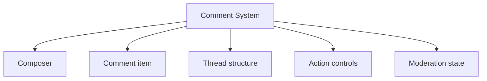

## Overview

A **Comment System** pattern helps teams create a reliable way to support threaded discussion around content while keeping moderation, authorship, and recovery visible. It is most useful when teams need article and discussion comments.

Compared with adjacent patterns, this pattern should reduce friction without hiding the state, rules, or recovery paths people need to keep moving.

<BuildEffort
  level="high"
  description="Requires coordinated state, async data, and strong accessibility coverage across the full comment system experience."
/>

## Use Cases

### When to use:

- Article and discussion comments
- Team review threads
- Support and community conversations

### When not to use:

- Avoid social or engagement mechanics when they do not create real user value.
- Do not add public counts or visibility states without understanding the trust implications.
- Do not ship the surface without moderation, abuse, or reversal planning.

### Common scenarios and examples

- Article and discussion comments where users need a clear, repeatable interface model.
- Team review threads where users need a clear, repeatable interface model.
- Support and community conversations where users need a clear, repeatable interface model.

<PatternComparison
  alternatives={[
  {
    "name": "Textarea",
    "path": "/patterns/forms/textarea",
    "when": "users need textarea instead of comment system as the primary interaction",
    "pros": [
      "Clearer fit for its own job",
      "Lower ambiguity about the expected interaction"
    ],
    "cons": [
      "Less specialized for comment system",
      "Different states and recovery paths to teach"
    ]
  },
  {
    "name": "Activity Feed",
    "path": "/patterns/social/activity-feed",
    "when": "users need activity feed instead of comment system as the primary interaction",
    "pros": [
      "Clearer fit for its own job",
      "Lower ambiguity about the expected interaction"
    ],
    "cons": [
      "Less specialized for comment system",
      "Different states and recovery paths to teach"
    ]
  },
  {
    "name": "Notification",
    "path": "/patterns/user-feedback/notification",
    "when": "users need notification instead of comment system as the primary interaction",
    "pros": [
      "Clearer fit for its own job",
      "Lower ambiguity about the expected interaction"
    ],
    "cons": [
      "Less specialized for comment system",
      "Different states and recovery paths to teach"
    ]
  }
]}
/>

## Benefits

- Clarifies how comment system should behave before implementation details begin to sprawl.
- Creates a reusable interaction model for teams who need to support threaded discussion around content while keeping moderation, authorship, and recovery visible.
- Makes accessibility, edge cases, and recovery paths part of the design instead of post-launch cleanup.
- Gives product, design, and engineering a shared language for evaluating trade-offs.

## Drawbacks

- State needs to stay consistent across sessions, devices, and sometimes anonymous users.
- Metrics can distort the experience if every surface is optimized only for engagement or conversion.
- Abuse, fraud, or misuse pressure must be planned for early.
- Trust drops quickly when counts, totals, or status badges feel inaccurate.

## Anatomy



### Component Structure

1. **Composer**

- Collects the new comment or reply.

2. **Comment item**

- Shows author, timestamp, body, and status.

3. **Thread structure**

- Connects replies to the comment they reference.

4. **Action controls**

- Support reply, edit, report, and moderation work.

5. **Moderation state**

- Communicates hidden, deleted, or locked comments.

#### Summary of Components

| Component | Required? | Purpose |
| --- | --- | --- |
| Composer | ✅ Yes | Collects the new comment or reply. |
| Comment item | ✅ Yes | Shows author, timestamp, body, and status. |
| Thread structure | ✅ Yes | Connects replies to the comment they reference. |
| Action controls | ❌ No | Support reply, edit, report, and moderation work. |
| Moderation state | ❌ No | Communicates hidden, deleted, or locked comments. |

## Variations

### Flat comments

Shows all replies in a single linear stream.

**When to use:** Use when discussions are short or lightly interactive.

### Threaded comments

Supports nested replies and local context.

**When to use:** Use when conversations branch regularly.

### Moderated discussion

Adds reporting, approvals, or locked states.

**When to use:** Use when the surface is public or high risk.

## Best Practices

### Content

**Do's ✅**

- Explain the outcome of the action in language users understand immediately.
- Surface the next useful action without burying key details.
- Keep counts, prices, and status indicators synchronized with visible state.

**Don'ts ❌**

- Do not gamify high-stakes actions through unclear labels or manipulative copy.
- Do not hide moderation, pricing, or policy details users need before acting.
- Do not assume optimistic updates will always succeed.

### Accessibility

**Do's ✅**

- Verify that comment system can be completed using keyboard alone.
- Keep focus order logical when the pattern opens, updates, or reveals additional UI.
- Preserve a visible focus state that is still readable at high zoom.
- Use semantic elements first, then add ARIA only where semantics alone are not enough.
- Announce state changes such as errors, loading, or completion in the right place and with the right politeness.

**Don'ts ❌**

- Do not remove focus styles without a visible replacement.
- Do not depend on placeholder or helper text that disappears before the user can act on it.
- Do not assume pointer, touch, and assistive technologies will all interact with the pattern the same way.

### Visual Design

**Do's ✅**

- Show trust-building signals such as state, identity, or pricing close to the action.
- Reserve strong color and badges for meaningful status changes.
- Design reversible actions differently from permanent ones.

**Don'ts ❌**

- Do not make primary and destructive actions look interchangeable.
- Do not use motion that implies completion before the system has confirmed it.
- Do not let promotional content overpower core task information.

### Layout & Positioning

**Do's ✅**

- Keep identity, object details, and actions close enough to scan together.
- Test the pattern in crowded feeds, lists, and summary views.
- Preserve space for moderation, legal, or transactional details where needed.

**Don'ts ❌**

- Do not hide critical next steps below large promotional modules.
- Do not split state changes across too many disconnected panels.
- Do not assume a desktop purchase or engagement flow will translate directly to mobile.

## Security Considerations

- Protect state-changing actions with real authorization checks rather than relying on hidden controls alone.
- Plan for optimistic updates to fail and make rollback or reconciliation visible.
- Store audit-relevant events such as checkout attempts, moderation actions, or abuse reports in a way the product team can actually inspect later.

## Tracking

- Track impressions, primary actions, reversals, and error states for comment system separately so the team can see where the pattern succeeds or fails.
- Measure completed outcomes, not just taps or opens, especially when the pattern can be reversed or abandoned later.
- Annotate experiments and rollout changes so spikes in engagement or conversion are interpretable.

## Common Mistakes & Anti-Patterns 🚫

### **Treating trust as secondary UI**

**The Problem:**
Counts, totals, identities, and policies are often the main thing users are checking before acting.

**How to Fix It?**
Design trust signals into the main hierarchy instead of leaving them as tiny secondary text.

---

### **Over-optimizing for the first click**

**The Problem:**
Aggressive prompts can increase taps while harming completion quality or long-term trust.

**How to Fix It?**
Measure the full journey, including reversals, refunds, reports, and hidden dissatisfaction.

---

### **Ignoring abuse and fraud paths**

**The Problem:**
Social and commerce surfaces invite misuse as soon as they create visible value.

**How to Fix It?**
Plan rate limits, authorization checks, moderation, and audit trails as part of the pattern itself.

## Examples

### Live Preview

<Playground patternType="social" pattern="comment-system" example="basic" presentation="hidden-code" />

### Basic Implementation

```html
<div class="demo-shell card comment-card">
  <label for="comment-box">Add a comment</label>
  <textarea id="comment-box" rows="4" placeholder="Share context or ask a follow-up question."></textarea>
  <button type="button">Post comment</button>
  <article class="thread-item">
    <strong>Jordan</strong>
    <p class="muted">We should show the error summary only after submit, not on every keypress.</p>
  </article>
</div>
```

### What this example demonstrates

- A clear baseline implementation of comment system that can be reviewed without framework-specific noise.
- Visible state, spacing, and content hierarchy that mirror the implementation guidance above.
- A small enough surface to copy into a design review or prototype before scaling the pattern up.

### Implementation Notes

- Start with semantic HTML and only add JavaScript where the interaction truly requires it.
- Keep styling tokens and spacing consistent with adjacent controls or layouts.
- If the live implementation introduces async behavior, mirror those states in the code example rather than documenting them only in prose.

## Accessibility

### Keyboard Interaction

- [ ] Verify that comment system can be completed using keyboard alone.
- [ ] Keep focus order logical when the pattern opens, updates, or reveals additional UI.
- [ ] Preserve a visible focus state that is still readable at high zoom.

### Screen Reader Support

- [ ] Use semantic elements first, then add ARIA only where semantics alone are not enough.
- [ ] Announce state changes such as errors, loading, or completion in the right place and with the right politeness.
- [ ] Connect labels, hints, and status text with `aria-describedby` or structural headings when useful.

### Visual Accessibility

- [ ] Do not rely on color alone to convey severity, completion, or selection state.
- [ ] Test the pattern at 200% zoom and with reduced motion enabled.
- [ ] Ensure touch targets remain comfortable on mobile and coarse pointers.

## Testing Guidelines

### Functional Testing

- [ ] Verify the default, loading, error, and success states for comment system.
- [ ] Test the primary action and the obvious recovery action in the same run.
- [ ] Confirm that state survives refresh, navigation, or retry in the way users would expect.

### Accessibility Testing

- [ ] Run keyboard-only checks and at least one screen reader pass on the final implementation.
- [ ] Validate headings, labels, and announcement behavior with real content rather than lorem ipsum.
- [ ] Check color contrast and focus visibility in both default and stressed states.

### Edge Cases

- [ ] Test empty, long, duplicated, and unexpectedly formatted content.
- [ ] Check behavior on narrow screens, zoomed layouts, and slower networks.
- [ ] Verify that optimistic or asynchronous states reconcile correctly after a failure.

## Frequently Asked Questions

<FaqStructuredData
  items={[
  {
    "question": "When should I choose Comment System instead of Textarea?",
    "answer": "Choose comment system when the job depends on support threaded discussion around content while keeping moderation, authorship, and recovery visible. If the team only needs a lighter interaction with fewer states, Textarea will usually be easier to ship and maintain."
  },
  {
    "question": "What is the biggest implementation risk with Comment System?",
    "answer": "The biggest risk is usually not the default visual state. It is the combination of state management, accessibility, and recovery behavior once loading, errors, or narrow screens enter the picture."
  },
  {
    "question": "How do I know whether comment system is working well?",
    "answer": "Watch whether users can complete the intended job without pausing to decode the interface, whether state changes feel trustworthy, and whether edge cases behave as intentionally as the happy path."
  }
]}
/>

## Related Patterns

<RelatedPatternsCard
  patterns={[
    {
      title: "Textarea",
      path: "/patterns/forms/textarea",
      description: "Multi-line text input for longer content",
    },
    {
      title: "Activity Feed",
      path: "/patterns/social/activity-feed",
      description: "Social activity and updates stream",
    },
    {
      title: "Notification",
      path: "/patterns/user-feedback/notification",
      description: "Inform users about important updates",
    },
  ]}
/>

## Resources

### References

- [WCAG 2.2](https://www.w3.org/TR/WCAG22/) - Accessibility baseline for keyboard support, focus management, and readable state changes.
- [MDN ARIA live regions](https://developer.mozilla.org/docs/Web/Accessibility/ARIA/Guides/Live_regions) - How to announce streaming text, status updates, and non-modal feedback to screen readers.

### Guides

- [MDN WAI-ARIA basics](https://developer.mozilla.org/en-US/docs/Learn_web_development/Core/Accessibility/WAI-ARIA_basics) - Guidance on when to rely on native HTML and when to introduce ARIA roles and states.

### Articles

- [web.dev: Rendering on the Web](https://web.dev/articles/rendering-on-the-web) - Rendering tradeoffs for data-rich pages, dashboards, and result-heavy views.

### NPM Packages

- [`giscus`](https://www.npmjs.com/package/giscus) - GitHub Discussions-powered comments for documentation and community threads.
- [`@giscus/react`](https://www.npmjs.com/package/%40giscus%2Freact) - React wrapper for Giscus embeds in article and documentation comment threads.
- [`react-markdown`](https://www.npmjs.com/package/react-markdown) - Render markdown-rich responses, citations, and structured assistant output.
