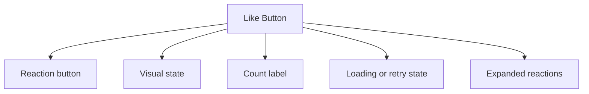

## Overview

A **Like Button** pattern helps teams create a reliable way to capture a fast lightweight reaction while still making the current state, count, and undo path clear. It is most useful when teams need social or content reactions.

Compared with adjacent patterns, this pattern should reduce friction without hiding the state, rules, or recovery paths people need to keep moving.

<BuildEffort
  level="low"
  description="Primarily markup, state classes, and accessible labeling for like and reaction buttons."
/>

## Use Cases

### When to use:

- Social or content reactions
- Lightweight endorsement signals
- Bookmark-like appreciation moments

### When not to use:

- Avoid social or engagement mechanics when they do not create real user value.
- Do not add public counts or visibility states without understanding the trust implications.
- Do not ship the surface without moderation, abuse, or reversal planning.

### Common scenarios and examples

- Social or content reactions where users need a clear, repeatable interface model.
- Lightweight endorsement signals where users need a clear, repeatable interface model.
- Bookmark-like appreciation moments where users need a clear, repeatable interface model.

<PatternComparison
  alternatives={[
  {
    "name": "Response Feedback",
    "path": "/patterns/ai-intelligence/response-feedback",
    "when": "users need response feedback instead of like button as the primary interaction",
    "pros": [
      "Clearer fit for its own job",
      "Lower ambiguity about the expected interaction"
    ],
    "cons": [
      "Less specialized for like button",
      "Different states and recovery paths to teach"
    ]
  },
  {
    "name": "Rating Input",
    "path": "/patterns/forms/rating-input",
    "when": "users need rating input instead of like button as the primary interaction",
    "pros": [
      "Clearer fit for its own job",
      "Lower ambiguity about the expected interaction"
    ],
    "cons": [
      "Less specialized for like button",
      "Different states and recovery paths to teach"
    ]
  },
  {
    "name": "Notification",
    "path": "/patterns/user-feedback/notification",
    "when": "users need notification instead of like button as the primary interaction",
    "pros": [
      "Clearer fit for its own job",
      "Lower ambiguity about the expected interaction"
    ],
    "cons": [
      "Less specialized for like button",
      "Different states and recovery paths to teach"
    ]
  }
]}
/>

## Benefits

- Clarifies how like button should behave before implementation details begin to sprawl.
- Creates a reusable interaction model for teams who need to capture a fast lightweight reaction while still making the current state, count, and undo path clear.
- Makes accessibility, edge cases, and recovery paths part of the design instead of post-launch cleanup.
- Gives product, design, and engineering a shared language for evaluating trade-offs.

## Drawbacks

- State needs to stay consistent across sessions, devices, and sometimes anonymous users.
- Metrics can distort the experience if every surface is optimized only for engagement or conversion.
- Abuse, fraud, or misuse pressure must be planned for early.
- Trust drops quickly when counts, totals, or status badges feel inaccurate.

## Anatomy



### Component Structure

1. **Reaction button**

- Triggers the like or unlike action.

2. **Visual state**

- Shows whether the current user has liked the item.

3. **Count label**

- Displays aggregate engagement when that metric matters.

4. **Loading or retry state**

- Handles optimistic updates safely.

5. **Expanded reactions**

- Offer richer sentiment choices than a single like.

#### Summary of Components

| Component | Required? | Purpose |
| --- | --- | --- |
| Reaction button | ✅ Yes | Triggers the like or unlike action. |
| Visual state | ✅ Yes | Shows whether the current user has liked the item. |
| Count label | ❌ No | Displays aggregate engagement when that metric matters. |
| Loading or retry state | ❌ No | Handles optimistic updates safely. |
| Expanded reactions | ❌ No | Offer richer sentiment choices than a single like. |

## Variations

### Binary like

Uses one button with active and inactive states.

**When to use:** Use when lightweight feedback is enough.

### Reaction picker

Adds several emotional or categorical reactions.

**When to use:** Use when nuance improves the signal.

### Private save or like

Records the action without broadcasting a count.

**When to use:** Use when the signal is more personal than social.

## Best Practices

### Content

**Do's ✅**

- Explain the outcome of the action in language users understand immediately.
- Surface the next useful action without burying key details.
- Keep counts, prices, and status indicators synchronized with visible state.

**Don'ts ❌**

- Do not gamify high-stakes actions through unclear labels or manipulative copy.
- Do not hide moderation, pricing, or policy details users need before acting.
- Do not assume optimistic updates will always succeed.

### Accessibility

**Do's ✅**

- Verify that like button can be completed using keyboard alone.
- Keep focus order logical when the pattern opens, updates, or reveals additional UI.
- Preserve a visible focus state that is still readable at high zoom.
- Use semantic elements first, then add ARIA only where semantics alone are not enough.
- Announce state changes such as errors, loading, or completion in the right place and with the right politeness.

**Don'ts ❌**

- Do not remove focus styles without a visible replacement.
- Do not depend on placeholder or helper text that disappears before the user can act on it.
- Do not assume pointer, touch, and assistive technologies will all interact with the pattern the same way.

### Visual Design

**Do's ✅**

- Show trust-building signals such as state, identity, or pricing close to the action.
- Reserve strong color and badges for meaningful status changes.
- Design reversible actions differently from permanent ones.

**Don'ts ❌**

- Do not make primary and destructive actions look interchangeable.
- Do not use motion that implies completion before the system has confirmed it.
- Do not let promotional content overpower core task information.

### Layout & Positioning

**Do's ✅**

- Keep identity, object details, and actions close enough to scan together.
- Test the pattern in crowded feeds, lists, and summary views.
- Preserve space for moderation, legal, or transactional details where needed.

**Don'ts ❌**

- Do not hide critical next steps below large promotional modules.
- Do not split state changes across too many disconnected panels.
- Do not assume a desktop purchase or engagement flow will translate directly to mobile.

## Security Considerations

- Protect state-changing actions with real authorization checks rather than relying on hidden controls alone.
- Plan for optimistic updates to fail and make rollback or reconciliation visible.
- Store audit-relevant events such as checkout attempts, moderation actions, or abuse reports in a way the product team can actually inspect later.

## Tracking

- Track impressions, primary actions, reversals, and error states for like button separately so the team can see where the pattern succeeds or fails.
- Measure completed outcomes, not just taps or opens, especially when the pattern can be reversed or abandoned later.
- Annotate experiments and rollout changes so spikes in engagement or conversion are interpretable.

## Common Mistakes & Anti-Patterns 🚫

### **Treating trust as secondary UI**

**The Problem:**
Counts, totals, identities, and policies are often the main thing users are checking before acting.

**How to Fix It?**
Design trust signals into the main hierarchy instead of leaving them as tiny secondary text.

---

### **Over-optimizing for the first click**

**The Problem:**
Aggressive prompts can increase taps while harming completion quality or long-term trust.

**How to Fix It?**
Measure the full journey, including reversals, refunds, reports, and hidden dissatisfaction.

---

### **Ignoring abuse and fraud paths**

**The Problem:**
Social and commerce surfaces invite misuse as soon as they create visible value.

**How to Fix It?**
Plan rate limits, authorization checks, moderation, and audit trails as part of the pattern itself.

## Examples

### Live Preview

<Playground patternType="social" pattern="like-button" example="basic" presentation="hidden-code" />

### Basic Implementation

```html
<div class="demo-shell card like-card">
  <button type="button" id="like-button" aria-pressed="false">♡ <span id="like-count">128</span></button>
  <p class="muted">Tap to like this pattern.</p>
</div>
```

### What this example demonstrates

- A clear baseline implementation of like button that can be reviewed without framework-specific noise.
- Visible state, spacing, and content hierarchy that mirror the implementation guidance above.
- A small enough surface to copy into a design review or prototype before scaling the pattern up.

### Implementation Notes

- Start with semantic HTML and only add JavaScript where the interaction truly requires it.
- Keep styling tokens and spacing consistent with adjacent controls or layouts.
- If the live implementation introduces async behavior, mirror those states in the code example rather than documenting them only in prose.

## Accessibility

### Keyboard Interaction

- [ ] Verify that like button can be completed using keyboard alone.
- [ ] Keep focus order logical when the pattern opens, updates, or reveals additional UI.
- [ ] Preserve a visible focus state that is still readable at high zoom.

### Screen Reader Support

- [ ] Use semantic elements first, then add ARIA only where semantics alone are not enough.
- [ ] Announce state changes such as errors, loading, or completion in the right place and with the right politeness.
- [ ] Connect labels, hints, and status text with `aria-describedby` or structural headings when useful.

### Visual Accessibility

- [ ] Do not rely on color alone to convey severity, completion, or selection state.
- [ ] Test the pattern at 200% zoom and with reduced motion enabled.
- [ ] Ensure touch targets remain comfortable on mobile and coarse pointers.

## Testing Guidelines

### Functional Testing

- [ ] Verify the default, loading, error, and success states for like button.
- [ ] Test the primary action and the obvious recovery action in the same run.
- [ ] Confirm that state survives refresh, navigation, or retry in the way users would expect.

### Accessibility Testing

- [ ] Run keyboard-only checks and at least one screen reader pass on the final implementation.
- [ ] Validate headings, labels, and announcement behavior with real content rather than lorem ipsum.
- [ ] Check color contrast and focus visibility in both default and stressed states.

### Edge Cases

- [ ] Test empty, long, duplicated, and unexpectedly formatted content.
- [ ] Check behavior on narrow screens, zoomed layouts, and slower networks.
- [ ] Verify that optimistic or asynchronous states reconcile correctly after a failure.

## Frequently Asked Questions

<FaqStructuredData
  items={[
  {
    "question": "When should I choose Like Button instead of Response Feedback?",
    "answer": "Choose like button when the job depends on capture a fast lightweight reaction while still making the current state, count, and undo path clear. If the team only needs a lighter interaction with fewer states, Response Feedback will usually be easier to ship and maintain."
  },
  {
    "question": "What is the biggest implementation risk with Like Button?",
    "answer": "The biggest risk is usually not the default visual state. It is the combination of state management, accessibility, and recovery behavior once loading, errors, or narrow screens enter the picture."
  },
  {
    "question": "How do I know whether like button is working well?",
    "answer": "Watch whether users can complete the intended job without pausing to decode the interface, whether state changes feel trustworthy, and whether edge cases behave as intentionally as the happy path."
  }
]}
/>

## Related Patterns

<RelatedPatternsCard
  patterns={[
    {
      title: "Response Feedback",
      path: "/patterns/ai-intelligence/response-feedback",
      description: "Feedback mechanisms for AI responses",
    },
    {
      title: "Rating Input",
      path: "/patterns/forms/rating-input",
      description: "Rate something with a number of stars",
    },
    {
      title: "Notification",
      path: "/patterns/user-feedback/notification",
      description: "Inform users about important updates",
    },
  ]}
/>

## Resources

### References

- [WCAG 2.2](https://www.w3.org/TR/WCAG22/) - Accessibility baseline for keyboard support, focus management, and readable state changes.
- [MDN ARIA live regions](https://developer.mozilla.org/docs/Web/Accessibility/ARIA/Guides/Live_regions) - How to announce streaming text, status updates, and non-modal feedback to screen readers.

### Guides

- [MDN WAI-ARIA basics](https://developer.mozilla.org/en-US/docs/Learn_web_development/Core/Accessibility/WAI-ARIA_basics) - Guidance on when to rely on native HTML and when to introduce ARIA roles and states.

### Articles

- [web.dev: Rendering on the Web](https://web.dev/articles/rendering-on-the-web) - Rendering tradeoffs for data-rich pages, dashboards, and result-heavy views.

### NPM Packages

- [`framer-motion`](https://www.npmjs.com/package/framer-motion) - Motion primitives for affordance, feedback, and progressive reveal.
- [`react-use`](https://www.npmjs.com/package/react-use) - Interaction helpers and micro-state hooks useful in optimistic and feedback-heavy UIs.
- [`swr`](https://www.npmjs.com/package/swr) - Lightweight remote-state hooks for optimistic feedback and periodic updates.
