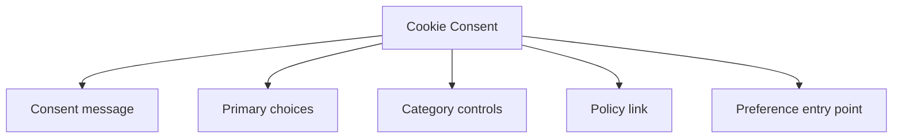

## Overview

A **Cookie Consent** pattern helps teams create a reliable way to explain optional tracking clearly, capture a meaningful choice, and let users revise that choice later. It is most useful when teams need websites using analytics or marketing cookies.

Compared with adjacent patterns, this pattern should reduce friction without hiding the state, rules, or recovery paths people need to keep moving.

<BuildEffort
  level="medium"
  description="Requires structured state, keyboard handling, and resilient feedback for inform users about the use of cookies."
/>

## Use Cases

### When to use:

- Websites using analytics or marketing cookies
- Regional consent requirements
- Privacy preference updates after the first visit

### When not to use:

- Use a quieter state when the event is too minor to interrupt the task.
- Avoid transient feedback for events users must be able to revisit later.
- Do not duplicate the same message in several channels without a hierarchy rule.

### Common scenarios and examples

- Websites using analytics or marketing cookies where users need a clear, repeatable interface model.
- Regional consent requirements where users need a clear, repeatable interface model.
- Privacy preference updates after the first visit where users need a clear, repeatable interface model.

<PatternComparison
  alternatives={[
  {
    "name": "Notification",
    "path": "/patterns/user-feedback/notification",
    "when": "users need notification instead of cookie consent as the primary interaction",
    "pros": [
      "Clearer fit for its own job",
      "Lower ambiguity about the expected interaction"
    ],
    "cons": [
      "Less specialized for cookie consent",
      "Different states and recovery paths to teach"
    ]
  },
  {
    "name": "Modal",
    "path": "/patterns/content-management/modal",
    "when": "users need modal instead of cookie consent as the primary interaction",
    "pros": [
      "Clearer fit for its own job",
      "Lower ambiguity about the expected interaction"
    ],
    "cons": [
      "Less specialized for cookie consent",
      "Different states and recovery paths to teach"
    ]
  },
  {
    "name": "Toggle",
    "path": "/patterns/forms/toggle",
    "when": "users need toggle instead of cookie consent as the primary interaction",
    "pros": [
      "Clearer fit for its own job",
      "Lower ambiguity about the expected interaction"
    ],
    "cons": [
      "Less specialized for cookie consent",
      "Different states and recovery paths to teach"
    ]
  }
]}
/>

## Benefits

- Clarifies how cookie consent should behave before implementation details begin to sprawl.
- Creates a reusable interaction model for teams who need to explain optional tracking clearly, capture a meaningful choice, and let users revise that choice later.
- Makes accessibility, edge cases, and recovery paths part of the design instead of post-launch cleanup.
- Gives product, design, and engineering a shared language for evaluating trade-offs.

## Drawbacks

- Feedback becomes noise if every event gets the same visual weight.
- Timing mistakes can create anxiety, impatience, or missed announcements.
- Motion and sound need careful accessibility handling.
- Transient states are easy to implement badly because they feel small during development.

## Anatomy



### Component Structure

1. **Consent message**

- Explains what categories of cookies or tracking are involved.

2. **Primary choices**

- Let users accept, reject, or customize non-essential tracking.

3. **Category controls**

- Handle analytics, marketing, personalization, or similar groupings.

4. **Policy link**

- Provides the deeper privacy explanation and legal detail.

5. **Preference entry point**

- Lets users revisit the decision later.

#### Summary of Components

| Component | Required? | Purpose |
| --- | --- | --- |
| Consent message | ✅ Yes | Explains what categories of cookies or tracking are involved. |
| Primary choices | ✅ Yes | Let users accept, reject, or customize non-essential tracking. |
| Category controls | ❌ No | Handle analytics, marketing, personalization, or similar groupings. |
| Policy link | ✅ Yes | Provides the deeper privacy explanation and legal detail. |
| Preference entry point | ❌ No | Lets users revisit the decision later. |

## Variations

### Banner consent

Uses a compact bar or banner for a small choice set.

**When to use:** Use when the preference model is simple.

### Modal consent

Uses a larger blocking surface for more complex settings.

**When to use:** Use when categories and disclosures need more space.

### Preference center

Separates the initial notice from a deeper settings interface.

**When to use:** Use when users need ongoing control over several tracking categories.

## Best Practices

### Content

**Do's ✅**

- Describe what happened in direct language before adding decoration.
- Match the urgency of the message to the urgency of the event.
- Tell users what they can do next whenever recovery matters.

**Don'ts ❌**

- Do not use the same tone for success, warning, and failure states.
- Do not auto-dismiss critical feedback before it can be read.
- Do not use animation as the only sign that state has changed.

### Accessibility

**Do's ✅**

- Verify that cookie consent can be completed using keyboard alone.
- Keep focus order logical when the pattern opens, updates, or reveals additional UI.
- Preserve a visible focus state that is still readable at high zoom.
- Use semantic elements first, then add ARIA only where semantics alone are not enough.
- Announce state changes such as errors, loading, or completion in the right place and with the right politeness.

**Don'ts ❌**

- Do not remove focus styles without a visible replacement.
- Do not depend on placeholder or helper text that disappears before the user can act on it.
- Do not assume pointer, touch, and assistive technologies will all interact with the pattern the same way.

### Visual Design

**Do's ✅**

- Reserve visual intensity for the highest-priority moments.
- Keep transitions smooth and short enough to avoid slowing the task.
- Design idle, loading, success, and failure states as a family.

**Don'ts ❌**

- Do not stack multiple competing banners, toasts, and spinners in the same area.
- Do not rely on color-only severity mapping.
- Do not let placeholders and live content use completely different geometry.

### Layout & Positioning

**Do's ✅**

- Keep local feedback near the part of the UI that changed.
- Use consistent placement so users learn where to look.
- Plan how the feedback behaves on small screens and zoomed layouts.

**Don'ts ❌**

- Do not cover key controls unless blocking interaction is intentional.
- Do not move the viewport unexpectedly to reveal transient feedback.
- Do not mix persistent and transient messages without a hierarchy rule.

## Micro-Interactions & Animations

- Use motion to reinforce state change, not to create novelty for its own sake.
- Keep entrance and exit animations short enough that they never delay the actual state users care about.
- Respect `prefers-reduced-motion` by simplifying shimmer, pulse, or slide effects rather than removing the pattern entirely.

## Timing & Announcement Guidance

| Situation | Recommended behavior | Notes |
| --- | --- | --- |
| Short local action | Use a light busy or success state | Avoid full-screen interruption for small waits. |
| Unknown-duration task | Use a loading indicator with honest status text | Escalate to a stronger state if the wait becomes long. |
| Critical warning or failure | Use a persistent alert or banner | Keep it visible until the user can acknowledge or recover. |

## Common Mistakes & Anti-Patterns 🚫

### **Over-signaling everything**

**The Problem:**
When every state uses strong color, motion, and sound, people stop paying attention.

**How to Fix It?**
Create a severity ladder and reserve the strongest treatment for the states that truly need interruption.

---

### **Mismatching timing to the job**

**The Problem:**
Short tasks feel sluggish with heavy loading UI, while long tasks feel abandoned with no progress guidance.

**How to Fix It?**
Pick the lightest possible feedback for the wait length and keep the pattern honest about how much is known.

---

### **Skipping announcement strategy**

**The Problem:**
Screen reader users miss transient changes when live-region behavior is inconsistent or absent.

**How to Fix It?**
Define how each state is announced and test polite versus assertive updates with real assistive technology.

## Examples

### Live Preview

<Playground patternType="user-feedback" pattern="cookie-consent" example="basic" presentation="hidden-code" />

### Basic Implementation

```html
<div class="demo-shell">
  <section class="card consent-banner">
    <p><strong>We use cookies</strong> to measure usage and remember preferences. You can accept all cookies or manage optional categories.</p>
    <div class="actions">
      <button type="button">Accept all</button>
      <button type="button">Reject non-essential</button>
      <button type="button" class="secondary">Customize</button>
    </div>
  </section>
</div>
```

### What this example demonstrates

- A clear baseline implementation of cookie consent that can be reviewed without framework-specific noise.
- Visible state, spacing, and content hierarchy that mirror the implementation guidance above.
- A small enough surface to copy into a design review or prototype before scaling the pattern up.

### Implementation Notes

- Start with semantic HTML and only add JavaScript where the interaction truly requires it.
- Keep styling tokens and spacing consistent with adjacent controls or layouts.
- If the live implementation introduces async behavior, mirror those states in the code example rather than documenting them only in prose.

## Accessibility

### Keyboard Interaction

- [ ] Verify that cookie consent can be completed using keyboard alone.
- [ ] Keep focus order logical when the pattern opens, updates, or reveals additional UI.
- [ ] Preserve a visible focus state that is still readable at high zoom.

### Screen Reader Support

- [ ] Use semantic elements first, then add ARIA only where semantics alone are not enough.
- [ ] Announce state changes such as errors, loading, or completion in the right place and with the right politeness.
- [ ] Connect labels, hints, and status text with `aria-describedby` or structural headings when useful.

### Visual Accessibility

- [ ] Do not rely on color alone to convey severity, completion, or selection state.
- [ ] Test the pattern at 200% zoom and with reduced motion enabled.
- [ ] Ensure touch targets remain comfortable on mobile and coarse pointers.

## Testing Guidelines

### Functional Testing

- [ ] Verify the default, loading, error, and success states for cookie consent.
- [ ] Test the primary action and the obvious recovery action in the same run.
- [ ] Confirm that state survives refresh, navigation, or retry in the way users would expect.

### Accessibility Testing

- [ ] Run keyboard-only checks and at least one screen reader pass on the final implementation.
- [ ] Validate headings, labels, and announcement behavior with real content rather than lorem ipsum.
- [ ] Check color contrast and focus visibility in both default and stressed states.

### Edge Cases

- [ ] Test empty, long, duplicated, and unexpectedly formatted content.
- [ ] Check behavior on narrow screens, zoomed layouts, and slower networks.
- [ ] Verify that optimistic or asynchronous states reconcile correctly after a failure.

## Frequently Asked Questions

<FaqStructuredData
  items={[
  {
    "question": "When should I choose Cookie Consent instead of Notification?",
    "answer": "Choose cookie consent when the job depends on explain optional tracking clearly, capture a meaningful choice, and let users revise that choice later. If the team only needs a lighter interaction with fewer states, Notification will usually be easier to ship and maintain."
  },
  {
    "question": "What is the biggest implementation risk with Cookie Consent?",
    "answer": "The biggest risk is usually not the default visual state. It is the combination of state management, accessibility, and recovery behavior once loading, errors, or narrow screens enter the picture."
  },
  {
    "question": "How do I know whether cookie consent is working well?",
    "answer": "Watch whether users can complete the intended job without pausing to decode the interface, whether state changes feel trustworthy, and whether edge cases behave as intentionally as the happy path."
  }
]}
/>

## Related Patterns

<RelatedPatternsCard
  patterns={[
    {
      title: "Notification",
      path: "/patterns/user-feedback/notification",
      description: "Inform users about important updates",
    },
    {
      title: "Modal",
      path: "/patterns/content-management/modal",
      description: "Display focused content or actions",
    },
    {
      title: "Toggle",
      path: "/patterns/forms/toggle",
      description: "Switch between two states",
    },
  ]}
/>

## Resources

### References

- [WCAG 2.2](https://www.w3.org/TR/WCAG22/) - Accessibility baseline for keyboard support, focus management, and readable state changes.
- [MDN HTTP cookies](https://developer.mozilla.org/en-US/docs/Web/HTTP/Cookies) - Cookie fundamentals, storage behavior, and privacy-related implementation details.

### Guides

- [WAI Forms Tips and Tricks](https://www.w3.org/WAI/tutorials/forms/tips/) - Practical guidance for formatting, grouping, timing, and forgiving user input rules.

### Articles

- [Deceptive Design: Cookie banners](https://www.deceptive.design/) - Examples of dark-pattern pitfalls to avoid in consent and preference interfaces.

### NPM Packages

- [`vanilla-cookieconsent`](https://www.npmjs.com/package/vanilla-cookieconsent) - Consent banner and preference-center primitives without framework lock-in.
- [`js-cookie`](https://www.npmjs.com/package/js-cookie) - Cookie read/write helpers for preference persistence and consent gates.
- [`@radix-ui/react-dialog`](https://www.npmjs.com/package/%40radix-ui%2Freact-dialog) - Dialog primitive for modals, sheet-style overlays, and focus management.
