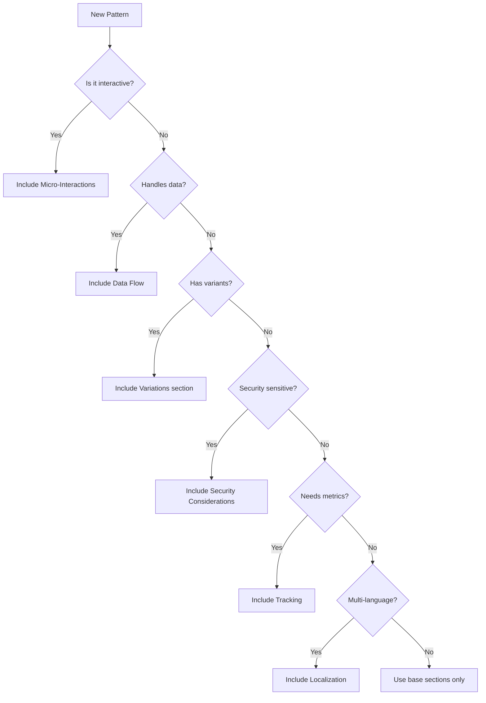

# Pattern Sections Guide

This guide documents all possible sections for pattern documentation, helping you choose which sections to include based on your pattern's needs.

## Section Categories

### 🔴 Required Sections
These sections must be included in every pattern.

| Section | Purpose | Notes |
|---------|---------|-------|
| **Overview** | Problem statement and solution | Clear description of what the pattern solves |
| **Use Cases** | When to use/not use | Specific scenarios with examples |
| **Anatomy** | Visual/structural breakdown | Diagrams or component structure |
| **Best Practices** | Implementation guidelines | Do's and don'ts for all aspects |
| **Interactive Example** | Live code playground | At least one basic example |
| **Accessibility** | WCAG compliance | ARIA, keyboard navigation, screen readers |
| **Testing Guidelines** | How to test the pattern | Functional, unit, and E2E test examples |

### 🟡 Recommended Sections
Include these sections for most patterns unless they're not applicable.

| Section | Purpose | When to Include |
|---------|---------|-----------------|
| **Benefits** | Key advantages | When advantages aren't obvious |
| **Drawbacks** | Limitations and trade-offs | When there are important caveats |
| **Performance** | Metrics and optimization | For patterns affecting page speed |
| **Related Patterns** | Links to similar/complementary patterns | When connections help understanding |
| **Frequently Asked Questions** | Common questions and answers | For complex or often misunderstood patterns |

### 🟢 Optional Sections
Include these based on pattern complexity and category.

| Section | Purpose | When to Include |
|---------|---------|-----------------|
| **[Pattern] Variations** | Different types/modes | For patterns with multiple variants (e.g., Button types) |
| **Tracking** | Analytics implementation | For patterns requiring usage metrics |
| **Localization** | i18n considerations | For text-heavy or culture-specific patterns |
| **SEO** | Search optimization | For patterns affecting crawlability |
| **Browser Support** | Compatibility notes | When using newer web features |
| **Design Tokens** | Design system integration | For organizations with token systems |
| **Resources** | External references | When additional learning materials exist |

### 🔵 Situational Sections
Add these sections only for specific pattern types.

| Section | Purpose | Use For |
|---------|---------|---------|
| **Security Considerations** | Security best practices | Authentication, payment, data handling patterns |
| **Micro-Interactions & Animations** | Animation details | Highly interactive patterns (carousel, accordion) |
| **State Management** | State handling strategies | Complex stateful patterns |
| **Error Handling** | Error scenarios and recovery | Forms, API-connected patterns |
| **Validation Rules** | Input validation logic | Form and input patterns |
| **API Integration** | Backend connection details | Data-fetching patterns |
| **Data Flow** | How data moves through the pattern | Complex data patterns |
| **Migration Guide** | Upgrading from older approaches | When replacing legacy patterns |
| **Platform-Specific Considerations** | iOS/Android/Desktop differences | Cross-platform patterns |
| **Performance Optimization** | Detailed performance section | Heavy patterns (infinite scroll, virtualization) |
| **Comparison Table** | Comparing implementation approaches | When multiple valid approaches exist |
| **Implementation Checklist** | Quick reference checklist | Complex multi-step patterns |
| **Code Architecture** | Architectural decisions | Patterns requiring specific architecture |
| **Event Handling** | Event management strategies | Event-heavy patterns |
| **Deployment Considerations** | Production deployment notes | Patterns with deployment complexity |

## Decision Tree for Section Selection

## Examples by Pattern Category

### Forms & Input Patterns
**Required:** All base sections  
**Recommended:** Validation Rules, Error Handling  
**Consider:** Security (for passwords), API Integration (for autocomplete)

### Navigation Patterns
**Required:** All base sections  
**Recommended:** SEO, Performance  
**Consider:** Micro-Interactions (for animated menus)

### Content Management Patterns
**Required:** All base sections  
**Recommended:** Localization  
**Consider:** Performance Optimization (for carousels, accordions)

### Data Display Patterns
**Required:** All base sections  
**Recommended:** Performance, Data Flow  
**Consider:** API Integration, State Management

### User Feedback Patterns
**Required:** All base sections  
**Recommended:** Micro-Interactions  
**Consider:** Tracking (for notifications)

### Authentication Patterns
**Required:** All base sections + Security Considerations  
**Recommended:** Error Handling, API Integration  
**Consider:** Migration Guide (for legacy auth)

### AI & Intelligence Patterns
**Required:** All base sections  
**Recommended:** Error Handling, State Management, Performance  
**Consider:** API Integration, Token Management, Security

### E-commerce Patterns
**Required:** All base sections  
**Recommended:** Security, Tracking, API Integration  
**Consider:** Localization (for currency/tax)

### Media Patterns
**Required:** All base sections  
**Recommended:** Performance Optimization  
**Consider:** Platform-Specific (for video players)

### Social Patterns
**Required:** All base sections  
**Recommended:** API Integration, Tracking  
**Consider:** Security (for user-generated content)

### Advanced Patterns
**Required:** All base sections  
**Recommended:** Performance, State Management  
**Consider:** Code Architecture, Implementation Checklist

## Section Writing Guidelines

### Overview Section
- Start with the problem the pattern solves
- Keep it to 2-3 sentences
- Include the primary use case

### Use Cases Section
- Provide 3-5 specific scenarios for "when to use"
- Include 2-3 anti-patterns for "when not to use"
- Suggest alternatives when appropriate

### Best Practices Section
Always organize into these subsections:
1. **Content** - Text, labels, messaging
2. **Accessibility** - WCAG compliance
3. **Visual Design** - Styling, themes
4. **Layout & Positioning** - Responsive behavior
5. **Common Mistakes** - Anti-patterns with fixes

### Interactive Examples
- Start with a basic example
- Add advanced examples for complex patterns
- Ensure examples work in the Playground component

### Performance Section
Include when the pattern:
- Loads significant JavaScript (>10KB)
- Handles large datasets
- Uses animations
- Makes API calls
- Affects Core Web Vitals

### Security Considerations
Must include for patterns involving:
- User authentication
- Payment processing
- File uploads
- User-generated content
- Sensitive data display
- API keys or tokens

## Maintenance Notes

### Adding New Sections
When you identify a new section type:
1. Add it to the appropriate category above
2. Document when it should be used
3. Update the template if it becomes common
4. Add an example from an existing pattern

### Reviewing Patterns
When reviewing pattern documentation:
1. Check all required sections are present
2. Verify recommended sections are included or explicitly omitted
3. Ensure situational sections match the pattern type
4. Validate examples work in the playground

## Quick Reference Checklist

For every new pattern, ask:

- [ ] Does it handle user input? → Add Validation Rules
- [ ] Does it connect to APIs? → Add API Integration  
- [ ] Does it have animations? → Add Micro-Interactions
- [ ] Is it replacing something? → Add Migration Guide
- [ ] Does it handle errors? → Add Error Handling
- [ ] Is it security-sensitive? → Add Security Considerations
- [ ] Does it have multiple modes? → Add Variations
- [ ] Is performance critical? → Add Performance Optimization
- [ ] Does it work differently per platform? → Add Platform-Specific
- [ ] Is the implementation complex? → Add Implementation Checklist

## Related Files

- **Template:** `/templates/patterns/component.mdx.hbs`
- **Examples:** `/content/patterns/` (all pattern files)
- **Components:** `/app/_components/` (Playground, BrowserSupport, etc.)