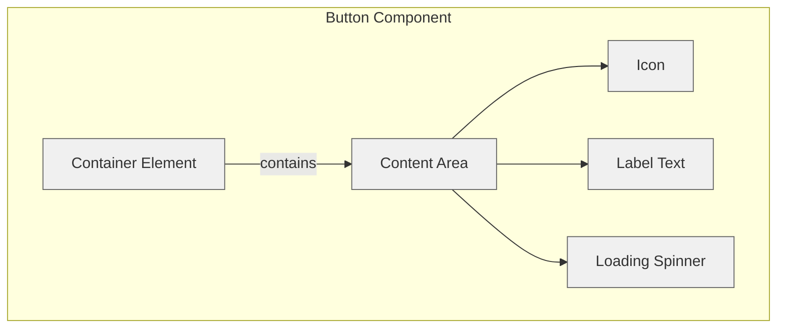

import { BrowserSupport } from "@app/_components/browser-support";
import { Tabs } from "nextra/components";

# Button

## Overview

**Buttons** are interactive elements that trigger actions or events when clicked or interacted with.

## Use Cases

### When to use buttons:

- To trigger an immediate action or event (e.g., "Save", "Delete", "Send")
- To submit a form
- To open or close interactive elements (modals, dialogs, menus)
- To toggle between states (e.g., play/pause, show/hide)
- To download files or content
- To navigate between steps in a multi-step process

### When not to use buttons:

- For navigation between pages (use links instead)
- When the action isn't immediately clear to users
- For text-only content that doesn't trigger an action
- When the interaction would be better served by a different component (e.g., checkbox, toggle switch)
- When multiple conflicting actions are grouped together
- When the action requires additional context that isn't immediately available

### Common scenarios and examples

- Primary actions: "Submit", "Save", "Continue"
- Secondary actions: "Cancel", "Back", "Reset"
- Destructive actions: "Delete", "Remove", "Clear All"
- Toggle actions: "Show More", "Expand/Collapse", "Play/Pause"
- Process actions: "Upload", "Download", "Export"
- Social actions: "Share", "Follow", "Like"

## Benefits

- Provides clear, actionable interactions for users to accomplish tasks
- Maintains consistency in user interface interactions across the application
- Offers visual feedback and states (hover, focus, active, disabled) to enhance usability
- Supports accessibility through keyboard navigation and screen reader compatibility
- Reduces cognitive load by making actions immediately recognizable

## Anatomy



### Component Structure

1. **Container**

- The root button element that wraps all other components
- Handles click events and keyboard interactions
- Manages focus states and accessibility attributes
- Contains variants for different button styles (default, destructive, outline, etc.)

2. **Label Text**

- The button label communicates the action that will occur
- Should be clear, concise, and action-oriented
- Must maintain proper contrast ratio with the background

3. **Icon (Optional)**

- Icons can be added to clarify an action
- Should be the same color as the text
- Placed on the left side of the label by default
- Size should be proportional to text (default 16x16px)
- Should include proper ARIA labels when used alone

4. **Loading State (Optional)**

- Visual indicator for async operations
- Replaces or overlays the button content
- Should maintain the button's original width
- Prevents multiple clicks during loading
- Typically uses a spinner or progress indicator

5. **Visual States**

- Default: Normal state
- Hover: Visual feedback on mouse over
- Focus: Keyboard navigation indicator
- Active: Pressed state
- Disabled: Indicates non-interactive state
- Loading: Shows processing state

## Guidelines and Examples

<Tabs items={['Best Practices', 'Code Examples', 'Browser Support', 'Testing', 'Design Tokens', 'Resources']}>
  <Tabs.Tab>
    ### Best Practices

    #### Content
    ##### Do's ✅
    - Use action verbs that describe what the button does (eg: "Save" instead of "Submit")
    - Keep button labels concise and clear
    - Be consistent with button labeling across the application
    - Include loading text when appropriate ("Saving..." vs "Save")
    - Use sentence case for button labels (e.g., "Save Changes")

    ##### Don'ts ❌
    - Don't use vague labels like "Click Here" or "Submit"
    - Don't use inconsistent terminology
    - Don't write overly long button labels
    - Don't use technical jargon in button labels
    - Don't mix different cases in button labels

    #### Accessibility & UX
    ##### Do's ✅
    - Use descriptive labels that clearly communicate the action
    - Provide visual feedback for all interactive states
    - Ensure keyboard navigation works properly
    - Include loading states for asynchronous actions
    - Maintain ARIA labels and roles

    ##### Don'ts ❌
    - Don't rely solely on color to communicate button states
    - Don't disable browser focus indicators without providing alternatives
    - Don't use button elements for navigation (use links instead)
    - Don't auto-focus destructive actions
    - Don't remove focus styles

    #### Visual Design

    ##### Do's ✅
    - Use the same button style for the same action throughout the application
    - Make buttons finger-friendly for mobile users (minimum 44x44px touch target)
    - Use appropriate visual hierarchy (primary, secondary, tertiary buttons)
    - Maintain consistent spacing between button groups
    - Use appropriate color contrast ratios (WCAG 2.1 AA compliance)
    - Include hover and focus states for interactive feedback
    - Keep icon and text alignment consistent
    - Maintain consistent padding and height across similar buttons
    - Scale button size appropriately for different viewport sizes

    ##### Don'ts ❌
    - Don't have more than one primary action button on the screen at a time
    - Don't use a [dark pattern](https://www.deceptive.design/) when you don't want users to take a certain action
    - Don't mix different button styles for the same action type
    - Don't use colors that conflict with your application's color scheme
    - Don't make disabled buttons look interactive
    - Don't use inconsistent corner radius within button groups
    - Avoid having buttons looking like links or vice versa

    #### Layout & Positioning
    ##### Do's ✅
    - Place primary action buttons in prominent, easily accessible locations
    - Align buttons consistently within forms and dialogs
    - Group related buttons together
    - Consider mobile touch targets (minimum 44x44px)

    ##### Don'ts ❌
    - Don't position buttons where they might be accidentally clicked
    - Don't hide important actions behind dropdown menus
    - Don't place buttons in unexpected locations (e.g., footer)

  </Tabs.Tab>
  <Tabs.Tab>
    ### Code Examples

    #### Basic Implementation
    ```html
    <!-- Small Button -->
    <button type="button" class="button-sm">Small</button>

    <!-- Default Size Button -->
    <button type="button">Default</button>

    <!-- Large Button -->
    <button type="button" class="button-lg">Large</button>

    <!-- Icon-only Button -->
    <button type="button" class="button-icon" aria-label="Settings">
      <svg class="icon" aria-hidden="true">
        <use href="#icon-settings" />
      </svg>
    </button>
    ```

    #### Form Submit Button
    ```html
    <form>
      <!-- Form fields here -->
      <button type="submit" class="button button-primary" data-loading="false">
        <span class="button-text">Submit Form</span>
        <svg class="icon spinner hidden" aria-hidden="true">
          <use href="#icon-loading"/>
        </svg>
      </button>
    </form>
    ```

  </Tabs.Tab>
  <Tabs.Tab>
    ### Browser Support

    <BrowserSupport features={['html.elements.button', 'api.HTMLButtonElement']} />

  </Tabs.Tab>
  <Tabs.Tab>
    ### Testing Guidelines

    #### Functional Testing
    ##### Should ✓
    - Show a loader when the button is submitting a form
    - Disable the button during form submission to prevent double submissions
    - Handle click events and trigger the appropriate action
    - Maintain proper visual states (hover, focus, active, disabled)
    - Support keyboard interaction (Enter and Space keys)
    - Preserve button width when switching between normal and loading states
    - Reset to initial state after operation completion

    #### Accessibility Testing
    ##### Should ✓
    - Be focusable and have visible focus indicators
    - Have proper ARIA labels, especially for icon-only buttons
    - Maintain sufficient color contrast ratios (WCAG 2.1 AA)
    - Support screen reader announcements of button state changes
    - Be operable with keyboard navigation
    - Communicate loading states to assistive technologies
    - Have appropriate touch target sizes (minimum 44x44px)

    #### Visual Testing
    ##### Should ✓
    - Maintain consistent styling across different variants (primary, secondary, destructive)
    - Display icons with correct alignment and spacing
    - Show proper visual feedback for all interactive states
    - Render correctly across different viewport sizes
    - Handle text overflow appropriately
    - Display loading spinners centered within the button
    - Maintain proper padding and margins in all states

    #### Performance Testing
    ##### Should ✓
    - Render without layout shifts
    - Handle rapid click events appropriately
    - Maintain smooth transitions between states
    - Load icons and spinners efficiently
    - Function without JavaScript (progressive enhancement)

    ### Testing Tools
    - Accessibility: [WAVE](https://wave.webaim.org/), [aXe](https://www.deque.com/axe/browser-extensions/), or [Lighthouse](https://developer.chrome.com/docs/lighthouse/overview)
    - SEO: [Google's Rich Results Test](https://developers.google.com/search/docs/appearance/structured-data)
    - Performance: [Chrome DevTools Performance panel](https://developer.chrome.com/docs/devtools/performance/overview)
    - Visual Regression: [Percy](https://percy.io/) or [Chromatic](https://www.chromatic.com/)
    - Cross-browser: [BrowserStack](https://www.browserstack.com/) or [Sauce Labs](https://saucelabs.com/)

  </Tabs.Tab>
    <Tabs.Tab>
    ### Design Tokens

    These design tokens follow the [Design Tokens Format](https://design-tokens.github.io/community-group/format/) specification and can be used with various token transformation tools to generate platform-specific variables.

    #### Button Tokens in DTF Format
    ```json:button.json
    {
      "$schema": "https://design-tokens.org/schema.json",
      "button": {
        "sizing": {
          "height": {
            "sm": { "value": "2.25rem", "type": "dimension" },
            "md": { "value": "2.5rem", "type": "dimension" },
            "lg": { "value": "2.75rem", "type": "dimension" }
          },
          "paddingX": {
            "sm": { "value": "0.75rem", "type": "dimension" },
            "md": { "value": "1rem", "type": "dimension" },
            "lg": { "value": "2rem", "type": "dimension" }
          },
          "iconSize": { "value": "1rem", "type": "dimension" },
          "iconGap": { "value": "0.5rem", "type": "dimension" },
          "touchTarget": {
            "value": "2.75rem",
            "type": "dimension",
            "description": "44px minimum touch target"
          }
        },
        "typography": {
          "fontFamily": { "value": "{font.family.sans}", "type": "fontFamily" },
          "fontWeight": { "value": "600", "type": "fontWeight" },
          "fontSize": {
            "sm": { "value": "0.875rem", "type": "dimension" },
            "md": { "value": "1rem", "type": "dimension" },
            "lg": { "value": "1.125rem", "type": "dimension" }
          }
        },
        "border": {
          "radius": {
            "sm": { "value": "0.375rem", "type": "dimension" },
            "md": { "value": "0.5rem", "type": "dimension" },
            "lg": { "value": "0.75rem", "type": "dimension" },
            "pill": { "value": "999px", "type": "dimension" }
          },
          "width": { "value": "1px", "type": "dimension" }
        },
        "variants": {
          "primary": {
            "background": {
              "default": { "value": "{color.primary.600}", "type": "color" },
              "hover": { "value": "{color.primary.700}", "type": "color" },
              "active": { "value": "{color.primary.800}", "type": "color" },
              "disabled": { "value": "{color.primary.200}", "type": "color" }
            },
            "text": {
              "default": { "value": "{color.white}", "type": "color" },
              "disabled": { "value": "{color.primary.100}", "type": "color" }
            }
          },
          "secondary": {
            "background": {
              "default": { "value": "{color.gray.100}", "type": "color" },
              "hover": { "value": "{color.gray.200}", "type": "color" },
              "active": { "value": "{color.gray.300}", "type": "color" },
              "disabled": { "value": "{color.gray.50}", "type": "color" }
            },
            "text": {
              "default": { "value": "{color.gray.900}", "type": "color" },
              "disabled": { "value": "{color.gray.400}", "type": "color" }
            }
          },
          "destructive": {
            "background": {
              "default": { "value": "{color.red.600}", "type": "color" },
              "hover": { "value": "{color.red.700}", "type": "color" },
              "active": { "value": "{color.red.800}", "type": "color" },
              "disabled": { "value": "{color.red.200}", "type": "color" }
            },
            "text": {
              "default": { "value": "{color.white}", "type": "color" },
              "disabled": { "value": "{color.red.100}", "type": "color" }
            }
          },
          "outline": {
            "border": {
              "default": { "value": "{color.gray.300}", "type": "color" },
              "hover": { "value": "{color.gray.400}", "type": "color" },
              "active": { "value": "{color.gray.500}", "type": "color" },
              "disabled": { "value": "{color.gray.200}", "type": "color" }
            },
            "text": {
              "default": { "value": "{color.gray.900}", "type": "color" },
              "disabled": { "value": "{color.gray.400}", "type": "color" }
            }
          }
        },
        "states": {
          "focusRing": {
            "width": { "value": "2px", "type": "dimension" },
            "offset": { "value": "2px", "type": "dimension" },
            "color": { "value": "{color.primary.200}", "type": "color" }
          },
          "loadingSpinner": {
            "size": { "value": "1rem", "type": "dimension" },
            "borderWidth": { "value": "2px", "type": "dimension" }
          }
        }
      }
    }
    ```

    ### Zod Schema for Button Tokens

    Basic schema that could be used for button tokens in a design system. Ideally, color, base tokens would be coming from a centralized source.

    ```ts
    import { z } from "zod";

    // Define the schema for individual token
    const tokenSchema = z.object({
      value: z.string(),
      type: z.enum([
        "color",
        "dimension",
        "fontFamily",
        "fontWeight",
        "number",
        "string",
      ]),
      description: z.string().optional(),
    });

    // Define the schema for nested objects
    const nestedTokensSchema = z.record(z.string(), tokenSchema);

    // Define the schema for the button object
    const buttonSchema = z.object({
      sizing: z.object({
        height: nestedTokensSchema,
        paddingX: nestedTokensSchema,
        iconSize: tokenSchema,
        iconGap: tokenSchema,
        touchTarget: tokenSchema,
      }),
      typography: z.object({
        fontFamily: tokenSchema,
        fontWeight: tokenSchema,
        fontSize: nestedTokensSchema,
      }),
      border: z.object({
        radius: nestedTokensSchema,
        width: tokenSchema,
      }),
      variants: z.object({
        primary: z.object({
          background: nestedTokensSchema,
          text: nestedTokensSchema,
        }),
        secondary: z.object({
          background: nestedTokensSchema,
          text: nestedTokensSchema,
        }),
        destructive: z.object({
          background: nestedTokensSchema,
          text: nestedTokensSchema,
        }),
        outline: z.object({
          border: nestedTokensSchema,
          text: nestedTokensSchema,
        }),
      }),
      states: z.object({
        focusRing: z.object({
          width: tokenSchema,
          offset: tokenSchema,
          color: tokenSchema,
        }),
        loadingSpinner: z.object({
          size: tokenSchema,
          borderWidth: tokenSchema,
        }),
      }),
    });

    export { buttonSchema };
    ```

  </Tabs.Tab>
  <Tabs.Tab>
    ### Resources

    #### Articles

    - [button: The Button element](https://developer.mozilla.org/en-US/docs/Web/HTML/Element/button)
    - [Buttons should look like buttons](https://www.nngroup.com/articles/buttons-should-look-like-buttons/) by Jakob Nielsen
    - [I’ve been doing buttons wrong! Have you?](https://uxplanet.org/ive-been-doing-buttons-wrong-have-you-2117c0066613) by Adham Dannaway
    - [Buttons vs links](https://www.nngroup.com/articles/buttons-vs-links/) by Jakob Nielsen
    - [Buttons](https://www.nngroup.com/articles/buttons/) by Jakob Nielsen
    - [Buttons: A Primer](https://alistapart.com/article/buttons-a-primer/) by Eric Meyer
    - [A comprehensive guide to buttons](https://uxplanet.org/a-comprehensive-guide-to-buttons-8f3b8a1c6f0d) by UX Planet
    - [A comprehensive guide to designing UX buttons](https://www.invisionapp.com/inside-design/comprehensive-guide-designing-ux-buttons/?ref=checklist.design) by InVision

    - [Building Accessible Buttons with ARIA: A11y Support Series](https://www.deque.com/blog/accessible-aria-buttons/) by Deque
    - [Buttons A11y Styleguide](https://a11y-style-guide.com/style-guide/section-general.html#kssref-general-buttons)

    #### Design systems

    - [Style Dictionary](https://styledictionary.com/)
    - [Button (Carbon Design System)](https://carbondesignsystem.com/components/button/usage/)
    - [Button (Material Design)](https://m3.material.io/components/all-buttons)

  </Tabs.Tab>
</Tabs>
