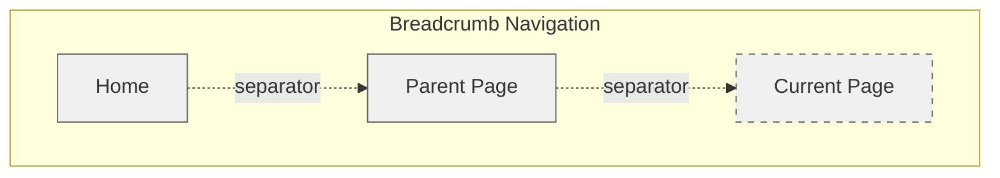

import { Tabs } from "nextra/components";

# Breadcrumb

## Overview

**Breadcrumbs**, often displayed as a horizontal list of links separated by symbols, help users understand their location in a website’s hierarchy at a glance.

They are secondary navigation aids that help users understand their current location within a website's hierarchy and provide an easy way to navigate back through parent pages.

They are particularly useful for websites with deep hierarchical structures or complex navigation paths.

## Use Cases

### When to use breadcrumbs:

- Websites with multiple hierarchical levels (e.g., categories, sub-categories)
- Large or complex sites where users often land on deep pages from search engines
- Systems that rely on nested file or document organization (e.g., file explorers, project management tools)
- E-commerce stores with layered product categories

### When not to use breadcrumbs:

- Single-level websites with flat structure
- Landing pages or homepages
- Small websites with simple navigation
- When the hierarchy is already evident through other navigation elements
- For single-page applications with modal-based navigation

### Common scenarios and examples

- E-commerce: Home > Electronics > Smartphones > iPhone 15
- Content Management: Dashboard > Projects > Project A > Documents
- File Systems: My Drive > Work > 2024 > Reports

## Benefits

- Reduces the number of actions users need to take to navigate up levels
- Prevents users from feeling lost in complex hierarchies
- Improves SEO by exposing site structure
- Reduces bounce rates for deep-linked pages
- Provides contextual information about current location

## Anatomy



### Component Structure

1. **Container (`nav`)**

- Wraps the entire breadcrumb navigation
- Uses semantic HTML for accessibility

2. **List (`ol`)**

- Contains the breadcrumb items in order
- Represents the hierarchical structure

3. **Items**

- Home Icon: Optional starting point
- Parent Pages: Clickable links to higher levels
- Current Page: Non-interactive current location
- Separators: Visual dividers between items.

## Guidelines and Examples

<Tabs items={['Best Practices', 'Code Examples', 'SEO', 'Testing', 'Resources']}>
  <Tabs.Tab>
    ### Best Practices

    #### Layout & Positioning
    ##### Do's ✅
    - Place the breadcrumb at the top of the page, below the global navigation and above the page title
    - Keep the breadcrumb left-aligned
    - Consider showing both icon and text on larger screens
    - Consider showing a house icon instead of text "Home" on smaller screens

    ##### Don'ts ❌
    - Do not show a breadcrumb if the navigation's hierarchy contains only one level (home page or landing pages for example)
    - Do not use an HTML element for separators but prefer using CSS

    #### Visual Design
    ##### Do's ✅
    - Make it obvious that the last item is not clickable (through color, cursor type, etc.)
    - Use consistent visual styling across all pages
    - Ensure sufficient contrast between text and background

    ##### Don'ts ❌
    - Don't use distracting animations or transitions
    - Don't make separators too prominent

    #### Accessibility & UX
    ##### Do's ✅
    - Maintain the icon's accessibility by including proper aria-label
    - Give users quick confirmation of where they are in the hierarchy
    - Use semantic HTML elements

    ##### Don'ts ❌
    - Don't make the current page title clickable
    - Don't use a breadcrumb if the user is already at the top level of the hierarchy

    #### Content
    ##### Do's ✅
    - Use clear, concise labels that match page titles
    - Maintain consistent naming conventions
    - Show the full hierarchy path

    ##### Don'ts ❌
    - Don't use inconsistent terminology between breadcrumb items and page titles
    - Don't truncate breadcrumb items without indicating there's more content

  </Tabs.Tab>
  <Tabs.Tab>
    ### Code Examples

    #### Basic Implementation of the Breadcrumb Navigation
    This example uses semantic HTML to provide a clear structure for the breadcrumb navigation.

    ```html
    <nav aria-label="Breadcrumb">
      <ol>
        <li>
          <a href="https://example.com">
            <span>Home</span>
          </a>
        </li>
        <li>
          <a href="https://example.com/products">
            <span>Products</span>
          </a>
        <li>
          <span aria-current="page">Current Page</span>
        </li>
      </ol>
    </nav>
    ```
    ### Dynamic Generation of the JSON-LD Structured Data
    This example demonstrates how to dynamically generate the breadcrumb JSON-LD structured Data using JavaScript.

    ```javascript
    const breadcrumbs = [
      { title: "Home", url: "https://example.com" },
      { title: "Products", url: "https://example.com/products" },
      { title: "Current Page" }
    ];

    function generateBreadcrumbSchema(breadcrumbs) {
      return {
        "@context": "https://schema.org",
        "@type": "BreadcrumbList",
        "itemListElement": breadcrumbs.map((crumb, index) => {
          const isLastItem = index === breadcrumbs.length - 1;

          const baseItem = {
            "@type": "ListItem",
            "position": index + 1,
            "name": crumb.title
          };

          // Only add the "item" property if it's not the last item and has a URL
          if (!isLastItem && crumb.url) {
            baseItem.item = crumb.url;
          }

          return baseItem;
        })
      };
    }
    ```

  </Tabs.Tab>
  <Tabs.Tab>
    ### SEO
    #### Structured Data
    - Implement breadcrumb structured data using [Schema.org markup](https://schema.org/BreadcrumbList) to help search engines understand your site's hierarchy
    - This improves the way your site appears in search results and helps search engines better understand your content structure
    Example JSON-LD structured data:
    ```json
    {
      "@context": "https://schema.org",
      "@type": "BreadcrumbList",
      "itemListElement": [{
        "@type": "ListItem",
        "position": 1,
        "name": "Home",
        "item": "https://example.com"
      },{
      "@type": "ListItem",
        "position": 2,
        "name": "Products",
        "item": "https://example.com/products"
      },
      {
      "@type": "ListItem",
        "position": 3,
        "name": "Current Page"
      }]
    }
    ```

    ### Testing & Validation
    - Use Google's [Rich Results Test](https://search.google.com/test/rich-results) to validate structured data
    - Monitor breadcrumb appearance in search results through Google Search Console
    - Check for proper indexing of breadcrumb pages in site architecture
    - Verify mobile rendering of breadcrumbs for mobile-first indexing

  </Tabs.Tab>

  <Tabs.Tab>
    ### Testing Guidelines

    #### Functional Testing
    ##### Should ✓
    - Navigate to the correct page when clicking each breadcrumb link
    - Show the complete hierarchy path from home to current page
    - Update breadcrumb trail when navigating through different levels
    - Maintain state after page refresh
    - Work with browser back/forward navigation

    #### Accessibility Testing
    ##### Should ✓
    - Be navigable using keyboard (Tab and Enter keys)
    - Have proper ARIA labels and roles
    - Announce proper hierarchy to screen readers
    - Maintain focus state visibility
    - Have sufficient color contrast (WCAG 2.1 AA)

    #### Responsive Testing
    ##### Should ✓
    - Adapt layout for different screen sizes
    - Show/hide home icon appropriately
    - Handle text overflow gracefully
    - Maintain touch target sizes on mobile (minimum 44x44px)
    - Preserve functionality across different devices

    #### SEO Testing
    ##### Should ✓
    - Include proper Schema.org markup
    - Have semantic HTML structure
    - Maintain consistent URL structure
    - Include relevant meta tags
    - Follow proper link hierarchy

    #### Performance Testing
    ##### Should ✓
    - Load without significant delay
    - Not cause layout shifts
    - Handle large numbers of items efficiently
    - Work with dynamic content updates
    - Function without JavaScript (progressive enhancement)

    ### Testing Tools
    - Accessibility: [WAVE](https://wave.webaim.org/), aXe, or Lighthouse
    - SEO: [Google's Rich Results Test](https://developers.google.com/search/docs/appearance/structured-data)
    - Performance: [Chrome DevTools Performance panel](https://developer.chrome.com/docs/devtools/performance/overview)
    - Visual Regression: Percy or Chromatic
    - Cross-browser: BrowserStack or Sauce Labs

  </Tabs.Tab>

  <Tabs.Tab>
    ### Resources

    ### Articles
    - [Breadcrumbs: 11 Design Guidelines for Desktop and Mobile](https://www.nngroup.com/articles/breadcrumbs/) by Nielsen Norman Group
    - [Designing Effective Breadcrumbs Navigation — Smashing Magazine](https://www.smashingmagazine.com/2022/04/breadcrumbs-ux-design/)
    - [Breadcrumb Pattern](https://www.w3.org/WAI/ARIA/apg/patterns/breadcrumb/) by W3C
    - [Breadcrumbs](https://a11y-style-guide.com/style-guide/section-navigation.html#kssref-navigation-breadcrumbs) - By A11y Style guide

    ### Libraries
    - [Breadcrumb: shadcn/ui](https://ui.shadcn.com/docs/components/breadcrumb)

  </Tabs.Tab>
</Tabs>
