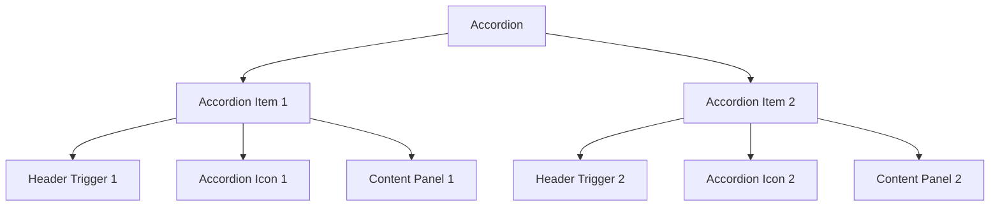
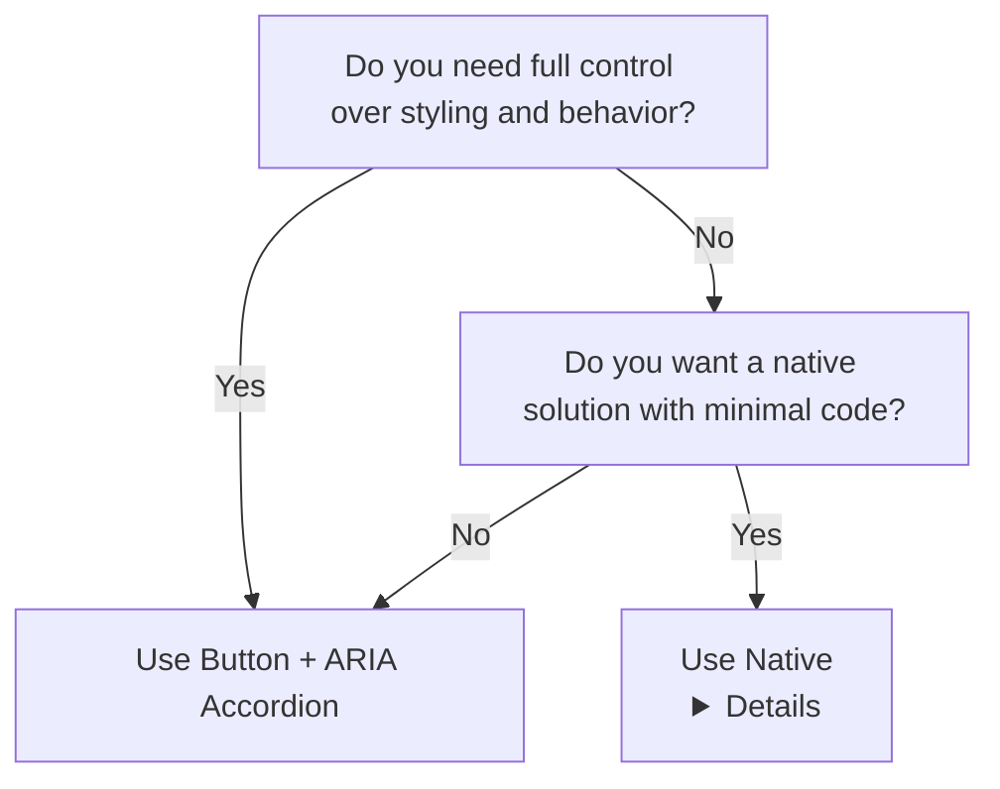

import { BrowserSupport } from "@app/_components/browser-support";
import { BuildEffort } from "@app/_components/build-effort";

# Accordion

**_(Also called collapsible panels)_**

## Overview

An **accordion** is a UI component that consists of a vertically stacked list of headers that can be expanded or collapsed to reveal or hide related content. It helps conserve screen space by displaying content in a structured and interactive way.

Accordions are commonly used for **FAQs, settings panels, and structured content** where users need to access multiple sections without scrolling through all the information at once.

<BuildEffort
  level="medium"
  description="Requires expand/collapse logic, proper ARIA attributes (`aria-expanded`), and smooth content visibility toggling."
/>

## Use Cases

### When to use:

Use an accordion when you need to present **structured content that benefits from progressive disclosure**.

**Common use cases include:**

- **FAQs (Frequently Asked Questions)** – Helps users find answers quickly.
- **Settings and Preferences** – Organizes options into collapsible categories.
- **Product Details or Features** – Allows users to expand sections they are interested in.
- **Documentation or Guides** – Presents step-by-step content in an organized way.
- **Navigation and Filtering** – Used in sidebars for hierarchical content.

### When not to use:

- If **all content needs to be visible at once** (e.g., comparison tables).
- When **content is too short**—collapsing small amounts of text may reduce usability.
- If frequent **switching between sections is necessary**—a tabbed interface might be better.
- When users need to **view multiple sections at the same time** (e.g., Terms and Conditions) —consider popovers, modals, or side panels instead.
- If content requires **deep nesting of multiple levels**, a structured outline or table of contents may work better.

## Benefits

- **Saves space** by showing only relevant content when needed.
- **Improves readability** by reducing visual clutter.
- **Enhances usability** by grouping related content.
- **Optimizes mobile experiences** by minimizing scroll length.

## Drawbacks

- **Hides content by default**, requiring extra interaction to access information.
- **Can make scanning content harder**, especially if multiple sections are collapsed.
- **May not work well for all content types**, particularly if users need to see multiple sections at once.
- **Can have accessibility issues** if not correctly implemented with ARIA roles.
- **Excessive nesting** of accordions can create a poor user experience.

## Anatomy



### Component Structure

1. **Accordion Container**

- Wraps all the accordion items.
- Handles state management (e.g., open/close behavior).
- Should provide appropriate aria-label for screen reader users.

2. **Accordion Item**

- A single collapsible section consisting of a header (trigger) and a content panel.

3. **Accordion Header (Trigger)**

- The clickable element that expands/collapses the associated content.
- Should be a button element for accessibility.
- Must contain aria-expanded="true|false" to indicate state.

4. **Accordion Icon**

- Provides a visual cue of the accordion state (collapsed or expanded).
- Common examples: chevron icons (▼/▲), plus/minus (+/−).
- Should rotate or change appearance when toggled.
- Must be visually distinguishable and large enough for touch interaction.

5. **Accordion Content Panel**

- The collapsible section that appears when triggered.
- Should be associated with its header via aria-controls and aria-labelledby.
- Must use aria-hidden="true|false" to indicate visibility to screen readers.

#### **Summary of Components**

| Component         | Required? | Purpose                                          |
| ----------------- | --------- | ------------------------------------------------ |
| **Container**     | ✅ Yes    | Wraps all accordion items together.              |
| **Item**          | ✅ Yes    | Represents an individual expandable section.     |
| **Trigger**       | ✅ Yes    | Toggles the visibility of the accordion content. |
| **Icon**          | ✅ Yes    | Indicates open/closed state (e.g., chevron).     |
| **Content Panel** | ✅ Yes    | Holds the content that expands/collapses.        |

## Best Practices

### Content & Usability

**Do's ✅**

- **Keep headers clear and concise**—they should describe the content inside.
- **Use progressive disclosure**—prioritize showing only essential information first.
- **Ensure logical grouping**—group related items under the same accordion.
- **Maintain consistent styling**—avoid varying sizes or colors for different headers.

**Don'ts ❌**

- **Don't overload sections**—too much content defeats the purpose of an accordion.
- **Avoid unnecessary animations**—fast, smooth transitions improve usability.
- **Don't use accordions for essential content**—ensure users can still access key information easily.

### Default Open Behavior

**Do's ✅**

- **Decide based on user expectations**—if the first section contains critical information, it may be beneficial to start expanded.
- **Keep the first accordion open** in **FAQs, tutorials, or onboarding flows** where users need immediate guidance.
- **Ensure consistency**—if one accordion is open by default, follow the same pattern across the UI.
- **Provide a clear visual indicator** when an accordion is expanded to avoid confusion.

**Don'ts ❌**

- **Don't force the first section open if the content is non-essential**—let users decide what they need.
- **Avoid inconsistent behavior**—mixing some open and some closed sections can be confusing.
- **Don't prevent users from collapsing the first accordion**—they should be able to close it if they want.

### Icon Placement & Behavior

#### **Placement**

**Do's ✅**

- **Place the icon at the beginning of the header** for better usability, especially for users relying on screen magnification.
- **Ensure the icon remains visually distinguishable**—it should not blend into the text.
- **Make sure the icon is keyboard accessible** and updates its state (`aria-expanded`).
- **Test different placements** in usability studies to determine what works best for your audience.

**Don'ts ❌**

- **Avoid placing the icon too far from the trigger text**—users may not associate them.
- **Don't rely solely on the icon** to indicate expansion—ensure there is a visual or textual cue as well.
- **Avoid animations that make the icon movement too subtle**—it should clearly show state changes.

#### **Behavior**

**Do's ✅**

- **Use an intuitive icon** (e.g., `+` → `−`, or chevron pointing up/down).
- **Ensure the icon changes state** when the accordion is expanded or collapsed.
- **Animate icon transitions smoothly** (e.g., rotate chevron instead of abruptly changing it).
- **Make the icon large enough** to be tappable on mobile devices.

**Don'ts ❌**

- **Don't rely only on the icon** to indicate expansion—also update `aria-expanded` and visually differentiate expanded sections.
- **Avoid using icons that do not clearly indicate** expansion and collapse states.
- **Don't use overly complex animations** that slow down interactions.

### Accessibility

**Do's ✅**

- **Use semantic HTML**—accordion triggers should be `button` elements.
- **Implement `aria-expanded`** to indicate open/closed states.
- **Ensure focus management**—moving between sections should be intuitive.
- **Support keyboard navigation**—allow arrow keys for cycling and `Enter` or `Space` to toggle.

**Don'ts ❌**

- **Don't trap focus** inside an expanded panel.
- **Avoid using `display: none;` on content**—instead, use `visibility` or `aria-hidden` for screen readers.

### Layout & Design

**Do's ✅**

- **Ensure clear distinctions** between expanded and collapsed states.
- **Provide smooth animations** (e.g., height transitions) to improve the user experience.
- **Use appropriate spacing** between items to avoid visual clutter.
- **Align icons and headers consistently** to maintain a structured appearance.

**Don'ts ❌**

- **Don't make accordions too small or too large**—users should easily scan headers.
- **Avoid inconsistent alignment**—headers, icons, and content should be visually aligned.
- **Don't place icons too far from the header text**, making it difficult to associate them with the toggle action.

## Code Example

### **Method 1: Using `<button>` and aria-expanded (ARIA Approach and Recommended)**

```html
<section class="accordion">
  <h2 class="accordion-title">Frequently Asked Questions</h2>

  <div class="accordion-item">
    <h3 id="accordion1-heading">What is an accordion?</h3>
    <button
      class="accordion-trigger"
      aria-expanded="false"
      aria-controls="panel1"
      aria-labelledby="accordion1-heading"
    >
      <span class="accordion-icon" aria-hidden="true">▼</span>
    </button>
    <section
      id="panel1"
      role="region"
      aria-labelledby="accordion1-heading"
      class="accordion-content"
      hidden
    >
      <p>
        An accordion is a UI pattern that expands and collapses content
        sections.
      </p>
    </section>
  </div>

  <div class="accordion-item">
    <h3 id="accordion2heading">When should I use an accordion?</h3>
    <button
      class="accordion-trigger"
      aria-expanded="false"
      aria-controls="panel2"
      aria-labelledby="accordion2-heading"
    >
      <span class="accordion-icon" aria-hidden="true">▼</span>
    </button>
    <section
      id="panel2"
      role="region"
      aria-labelledby="accordion2-heading"
      class="accordion-content"
      hidden
    >
      <p>
        Use an accordion when you want to organize content into collapsible
        sections.
      </p>
    </section>
  </div>
</section>

<script>
  document.querySelectorAll(".accordion-trigger").forEach((button) => {
    button.addEventListener("click", function () {
      const expanded = this.getAttribute("aria-expanded") === "true";
      this.setAttribute("aria-expanded", !expanded);
      this.nextElementSibling.hidden = expanded;

      // Toggle icon direction
      const icon = this.querySelector(".accordion-icon");
      icon.textContent = expanded ? "▼" : "▲";
    });
  });
</script>

<style>
  .accordion {
    border: 1px solid #ccc;
    border-radius: 5px;
    max-width: 600px;
  }

  .accordion-item {
    border-bottom: 1px solid #ddd;
  }

  .accordion-trigger {
    width: 100%;
    background: none;
    border: none;
    text-align: left;
    font-size: 1rem;
    padding: 1rem;
    display: flex;
    justify-content: space-between;
    align-items: center;
    cursor: pointer;
  }

  .accordion-content {
    padding: 1rem;
    display: none;
  }

  .accordion-trigger[aria-expanded="true"] + .accordion-content {
    display: block;
  }

  .accordion-icon {
    transition: transform 0.2s ease-in-out;
  }

  .accordion-trigger[aria-expanded="true"] .accordion-icon {
    transform: rotate(180deg);
  }
</style>
```

**Pros ✅**

- Full styling flexibility—no browser-imposed limitations.
- Explicit aria-expanded handling—better screen reader support.
- More customization options—e.g., "only one section open at a time" behavior.

**Cons ❌**

- Requires JavaScript to toggle states.
- More implementation complexity compared to `<details>`.

### **Method 2: Using `<details>` and `<summary>` (Native Approach)**

This approach leverages **native browser behavior** without requiring JavaScript.

```html
<section class="accordion">
  <h2>Frequently Asked Questions</h2>

  <details>
    <summary id="accordion1">What is an accordion?</summary>
    <div id="panel1">
      <p>
        An accordion is a UI component that allows users to expand and collapse
        sections of content.
      </p>
    </div>
  </details>

  <details>
    <summary id="accordion2">How does it improve user experience?</summary>
    <div id="panel2">
      <p>
        Accordions help reduce clutter and make information easier to digest,
        enhancing the overall user experience.
      </p>
    </div>
  </details>
</section>

<style>
  details {
    border: 1px solid #ddd;
    padding: 0.75rem;
    margin-bottom: 0.5rem;
    border-radius: 5px;
  }

  summary {
    font-weight: bold;
    cursor: pointer;
  }

  details[open] summary {
    color: #007acc;
  }
</style>
```

**Pros ✅**

- No JavaScript required—fully functional with just HTML & CSS.
- Keyboard accessible by default—users can navigate with Tab and toggle with Enter.
- Simpler implementation with native support.

**Cons ❌**

- Limited styling control—some browsers restrict `<summary>` styling.
- No aria-expanded state by default—some screen readers may not properly announce expansion.
- All items can be expanded at once—doesn't support "only one section open" behavior.

### When to use a tabbed carousel vs grouped carousel?

Use the **decision tree** below to determine the right method:



For a detailed breakdown of feature differences, refer to the table below:

| Feature                                     | `<details>` Accordion                          | `<button>` + ARIA Accordion                                  |
| ------------------------------------------- | ---------------------------------------------- | ------------------------------------------------------------ |
| **Requires JavaScript?**                    | ❌ No                                          | ✅ Yes (for toggling state and enforcing behavior)           |
| **Supports full styling?**                  | ❌ Limited (some browser-imposed restrictions) | ✅ Yes (full control over appearance)                        |
| **Explicit screen reader support?**         | ❌ No (`aria-expanded` missing by default)     | ✅ Yes (`aria-expanded`, `aria-controls`, `aria-labelledby`) |
| **Supports keeping only one section open?** | ❌ No                                          | ✅ Yes (requires JavaScript)                                 |
| **Keyboard accessibility?**                 | ✅ Built-in (natively accessible)              | ✅ Requires explicit keyboard handling                       |
| **Best for**                                | Simple FAQs or basic collapsible sections      | Custom-designed accordions with more control over behavior   |

## Accessibility

### Keyboard Interaction Pattern

The following table outlines the standard keyboard interactions for accordion components. These interactions ensure that users can navigate and operate accordions effectively using only a keyboard.

| Key                   | Action                                                                                                  |
| --------------------- | ------------------------------------------------------------------------------------------------------- |
| Enter or Space        | • Expand a collapsed panel; collapse all others<br/>• Collapse an expanded panel                        |
| Tab                   | Move focus to the next focusable item in the tab sequence. Focus will progress into an accordion panel. |
| Shift + Tab           | Move focus to the previous focusable item in the tab sequence                                           |
| Down Arrow (Optional) | Move focus to the next accordion header                                                                 |
| Up Arrow (Optional)   | Move focus to the previous accordion header                                                             |
| Home (Optional)       | Move focus to the first accordion header                                                                |
| End (Optional)        | Move focus to the last accordion header                                                                 |

> **Note**: Keys marked as optional may be omitted in some accordion implementations. The example in this documentation implements all optional keys for enhanced accessibility.

## Testing Guidelines

### Functional Testing

**Should ✓**

- [ ] Ensure each accordion section **expands and collapses correctly** when clicked.
- [ ] Verify that only **one section opens at a time**, if the accordion is set to single expansion mode.
- [ ] Confirm that the **content remains readable** and does not overlap when expanded.
- [ ] Ensure that **expanded sections persist when navigating back** (if applicable).
- [ ] Validate that accordion headers **do not shift layout unexpectedly** when toggled.

### Icon Behavior Testing

**Should ✓**

- [ ] Verify that the **accordion icon changes state** when toggling (`+` → `−` or chevron direction flips).
- [ ] Ensure the **icon animation is smooth** and not visually jarring.
- [ ] Confirm that **screen readers announce the icon state correctly** (`aria-expanded` updates accordingly).
- [ ] Ensure the icon is **visually clear and distinguishable** at different sizes and contrast levels.

### Accessibility Testing

**Should ✓**

- [ ] Verify that **screen readers announce expanded and collapsed states** correctly (`aria-expanded` updates).
- [ ] Ensure **keyboard accessibility**—users can navigate with `Tab`, toggle with `Enter`/`Space`, and move between headers using `Arrow Keys`.
- [ ] Check that the **accordion content remains accessible** even when collapsed (`aria-hidden` is handled properly).
- [ ] Test with **reduced motion preferences** to ensure animations do not interfere with usability.
- [ ] Confirm that **accordion icons are not the only indicator** of expansion state—there should be text changes or ARIA attributes as well.

### Visual Testing

**Should ✓**

- [ ] Validate that the **accordion headers are visually distinct** in both collapsed and expanded states.
- [ ] Ensure smooth and **non-jarring animations** when expanding or collapsing.
- [ ] Verify that **content does not clip or overlap** when expanded on different screen sizes.
- [ ] Check **responsive behavior** to ensure the accordion adapts well across breakpoints.
- [ ] Ensure **icon alignment is consistent** across all accordion headers.

### Performance Testing

**Should ✓**

- [ ] Ensure that **accordion interactions are smooth** and do not introduce lag.
- [ ] Confirm that excessive DOM updates **do not slow down rendering**.
- [ ] Verify that accordions **do not cause unnecessary reflows** when toggled.
- [ ] Test large datasets inside the accordion to ensure **acceptable performance**.

## Design Tokens

These design tokens follow the [Design Tokens Format](https://design-tokens.github.io/community-group/format/) specification and can be used with various token transformation tools to generate platform-specific variables.

### Accordion Tokens in DTF Format

```json
{
  "$schema": "https://design-tokens.org/schema.json",
  "accordion": {
    "header": {
      "fontWeight": { "value": "bold", "type": "fontWeight" },
      "fontSize": { "value": "1rem", "type": "dimension" },
      "padding": { "value": "1rem", "type": "dimension" },
      "background": { "value": "{color.gray.100}", "type": "color" },
      "textColor": { "value": "{color.gray.900}", "type": "color" }
    },
    "icon": {
      "size": { "value": "1.2rem", "type": "dimension" },
      "color": { "value": "{color.gray.600}", "type": "color" },
      "transition": {
        "duration": { "value": "250ms", "type": "duration" },
        "timingFunction": { "value": "ease-in-out", "type": "cubicBezier" }
      }
    },
    "content": {
      "padding": { "value": "1rem", "type": "dimension" },
      "background": { "value": "{color.white}", "type": "color" },
      "textColor": { "value": "{color.gray.800}", "type": "color" },
      "lineHeight": { "value": "1.6", "type": "dimension" }
    },
    "border": {
      "width": { "value": "1px", "type": "dimension" },
      "color": { "value": "{color.gray.300}", "type": "color" },
      "radius": { "value": "6px", "type": "borderRadius" }
    },
    "transition": {
      "duration": { "value": "300ms", "type": "duration" },
      "timingFunction": { "value": "ease-in-out", "type": "cubicBezier" }
    }
  }
}
```

## Resources

### Articles

- [Accordions on Desktop: When and How to Use - Nielsen Norman Group](https://www.nngroup.com/articles/accordions-on-desktop/)
- [Accordion Icons: Which Signifiers Work Best? - Nielsen Norman Group](https://www.nngroup.com/articles/accordion-icons/)

### Documentation

-[Accordion Pattern | WAI](https://www.w3.org/WAI/ARIA/apg/patterns/accordion/)

### Libraries

- [Accordion - Origin UI](https://originui.com/accordion)
