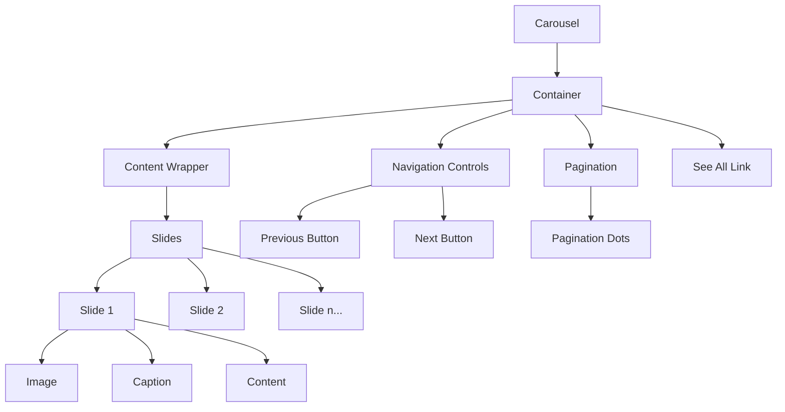
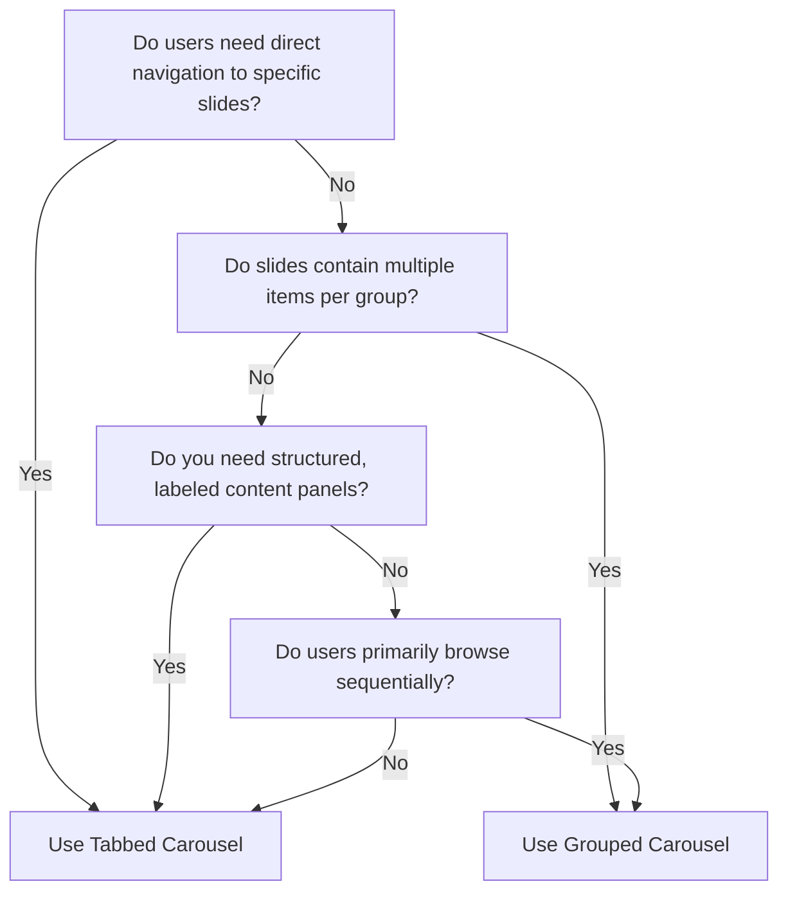

import { BrowserSupport } from "@app/_components/browser-support";
import { BuildEffort } from "@app/_components/build-effort";

# Carousel

**_(Also called slider, slideshow, image rotator)_**

## Overview

A **carousel** is a UI component that displays a set of content or images in a rotating or sliding manner. Users can navigate through the content using arrows, dots, or swipe gestures on touch devices.

Carousels are often used to showcase featured content, promotions, or image galleries in a limited space.

<BuildEffort
  level="high"
  description="Requires touch/swipe support, keyboard navigation, lazy loading, auto-play controls, and proper focus management to ensure accessibility."
/>

## Use Cases

### When to use:

Use a carousel when you need to display a **series of related content or images in a limited space** while keeping users engaged.

**Common use cases include:**

- Showcasing featured products or services (e.g., homepage promotions)
- Highlighting key messages or storytelling (e.g., step-by-step guides)
- Displaying a portfolio of work or case studies
- Presenting testimonials or customer reviews
- Guiding users through a multi-step process or tutorial
- Featuring news updates or event announcements

### When not to use:

- When the content is critical for users to see or interact with immediately
- If the content doesn't have a clear relationship or narrative flow
- When users need to compare items side-by-side or view all options at once
- If the carousel contains too many items, making navigation cumbersome
- When the content is complex or requires significant reading time

## Benefits

- Maximizes the use of limited screen space for featuring content
- Helps guide users through a series of related items or messages
- Can increase engagement and time spent on a page
- Allows for visual storytelling and brand expression
- Provides an interactive element for users to explore

## Drawbacks

- **Low engagement rates**, as users often ignore or miss slides.
- **Performance-heavy**, especially with large images or auto-rotation.
- **Accessibility issues**, particularly for keyboard and screen reader users.
- **Not ideal for displaying critical content**, as users may not interact with all slides.
- **Auto-rotation can be frustrating**, especially if there is no pause control.

## Anatomy



### Component Structure

1. **Container**

- Wraps the carousel content and controls
- Defines the visible area and overall dimensions of the carousel
- Can have a border, background color, or shadow to visually separate it from other content

2. **Content Wrapper**

- Contains the individual carousel slides or items
- Allows for smooth transitioning between slides
- Often uses CSS transforms or absolute positioning for slide placement

3. **Slides**

- The individual content items displayed within the carousel
- Can contain images, text, videos, or other interactive elements
- Should have consistent dimensions and styling for a cohesive appearance

4. **Navigation Arrows**

- Allow users to manually advance or go back through the carousel slides
- Typically placed on the left and right sides of the carousel
- Should have clear hover and focus states for accessibility

5. **Pagination Dots**

- Indicate the total number of slides and the current active slide
- Allow users to quickly jump to a specific slide
- Often placed below the carousel content for easy access

6. **"See All" Link (Optional)**

- Recommended when the carousel displays a subset of a larger collection (e.g., latest articles, featured products).
- Provides a way for users to access more related content beyond what's shown in the carousel
- Typically placed near the carousel, often below the slides or next to the pagination dots
- Should have a clear and descriptive label indicating where it will take the user (e.g., "See All Products", "View More Cases")
- Should be styled as a text link rather than a button to indicate navigation rather than an action.

7. **Captions (Optional)**

- Provide additional context or information about each slide
- Can be overlaid on the slide image or placed below the slide
- Should be concise and not obstruct the main slide content

#### **📌 Summary of Components**

| Component                 | Required? | Purpose                                                 |
| ------------------------- | --------- | ------------------------------------------------------- |
| **Container**             | ✅ Yes    | Wraps the entire carousel component.                    |
| **Slides Wrapper**        | ✅ Yes    | Contains all slide elements.                            |
| **Slide**                 | ✅ Yes    | Represents each individual content item.                |
| **Navigation Arrows**     | ✅ Yes    | Allows users to move between slides.                    |
| **Pagination Indicators** | ❌ No     | Shows the current position within the carousel.         |
| **Autoplay Controls**     | ❌ No     | Allows users to start/stop automatic slide transitions. |

## Best Practices

### Content

**Do's ✅**

- **Keep slide content focused and concise** for easy scanning.
- Use **high-quality, visually compelling images** that support the content message.
- Ensure **slide content is mobile-friendly** and legible on smaller screens.
- Provide **meaningful alt text** for slide images.
- **Keep the number of slides manageable** to avoid carousel fatigue.
- **Include a "See All" link** to direct users to a dedicated page with more related content (e.g., "See All Case Studies").

**Don'ts ❌**

- **Don't rely solely on the carousel** to convey critical information.
- Avoid **using too much text** or overly complex layouts within slides.
- **Don't make the carousel autoplay** without also providing pause/stop controls.
- **Don't use the carousel as a primary navigation mechanism** for your site.

---

### Accessibility

**Do's ✅**

- **Ensure all slide content and controls are keyboard accessible**.
- **Provide ARIA labels** for navigation elements and slide content.
- **Allow users to pause or stop auto-rotating carousels**.
- **Give users sufficient time** to read and interact with each slide.
- **Make navigation controls large enough** for easy clicking or tapping.
- **Ensure the "See All" link is keyboard accessible** and has a clear focus state.
- **Provide a meaningful ARIA label** for the "See All" link that describes its purpose.
- **Add `prefers-reduced-motion` to disable animations** for users with motion sensitivity.
- Optionally, **provide a "Reduce Motion" toggle** for users who prefer less movement.

**Don'ts ❌**

- **Don't autoplay content** that contains animation or video without user consent.
- Avoid **carousel designs that trap keyboard focus** within the component.
- **Don't hide navigation controls** or make them difficult to find.
- **Don't change slide content or position** while the user is interacting with it.

---

### Visual Design

**Do's ✅**

- **Use consistent design patterns** and styling for all carousel elements.
- **Provide ample visual contrast** for text and interactive components.
- **Ensure slide transitions are smooth** and not visually jarring.
- **Use navigation indicators** that clearly convey the current slide position.
- **Optimize slide images for fast loading** and performance.

**Don'ts ❌**

- **Don't use overly distracting transition effects** that detract from the content.
- Avoid **low contrast or hard-to-read text** over busy background images.
- **Don't make the carousel unnecessarily large** or overwhelming on the page.

---

### Layout & Positioning

**Do's ✅**

- **Position the carousel in a prominent location** that supports its content purpose.
- **Ensure the carousel scales and adapts responsively** to different screen sizes.
- **Provide ample spacing** between the carousel and surrounding page elements.
- **Left-align slide content** for easier reading and scanning.
- **Place navigation controls in intuitive** and easy-to-reach locations.

**Don'ts ❌**

- **Don't place the carousel too low** on the page where users might miss it.
- Avoid **positioning the carousel in a way that obstructs other important content**.
- **Don't force users to scroll unnecessarily** to view the full carousel on smaller screens.
- **Don't overcrowd the carousel area** with too many competing elements or CTAs.

---

### Performance Optimization

**Do's ✅**

- Use **lazy loading** (`loading="lazy"`) for images to reduce initial page load time.
- Optimize **carousel animations** using GPU-accelerated properties (e.g., `transform` instead of `margin`).
- Minimize **reflows and repaints** by ensuring smooth transitions and avoiding layout shifts.
- Reduce **event listener impact** by throttling or debouncing resize and scroll events.
- Ensure efficient **resource management** to prevent memory leaks and excessive CPU usage.
- Optimize **JavaScript execution** by deferring non-critical scripts and avoiding blocking tasks.

**Don'ts ❌**

- Don't load **off-screen images immediately**—defer loading until they are about to be displayed.
- Avoid **complex animations** that trigger layout recalculations (e.g., changing `width` or `height` dynamically).
- Don't overuse **box shadows and filters**, as they can slow down rendering performance.
- Avoid **large DOM structures**—if the carousel contains many slides, use virtualized rendering.
- Don't use **excessive animations** that could impact performance on lower-powered devices.

## Code Examples

### Basic Implementation

#### Tabbed Carousel

```html
<!-- Carousel -->
<section aria-roledescription="carousel" aria-label="Featured content">
  <!-- Visually hidden heading for screen readers -->
  <h2 class="sr-only">Featured Content Carousel</h2>

  <!-- See All link with descriptive label -->
  <a
    href="/all-products"
    class="carousel-see-all"
    aria-label="View all featured products"
  >
    See All Products
  </a>

  <!-- Controls Group -->
  <div role="group" aria-label="Carousel controls">
    <!-- Pause/Play button -->
    <button
      type="button"
      class="carousel-pause"
      aria-label="Pause auto-rotation"
      aria-pressed="false"
    >
      <span aria-hidden="true">⏸</span>
    </button>
    <!-- Navigation controls -->
    <button type="button" class="carousel-prev" aria-label="Previous slide">
      <span aria-hidden="true">&lt;</span>
    </button>
    <button type="button" class="carousel-next" aria-label="Next slide">
      <span aria-hidden="true">&gt;</span>
    </button>

    <!-- Pagination with proper ARIA roles -->
    <div class="carousel-pagination" role="tablist" aria-label="Slide controls">
      <button
        type="button"
        id="tab1"
        role="tab"
        aria-selected="true"
        aria-controls="slide1"
      >
        <span class="sr-only">Slide 1</span>
      </button>
      <button
        type="button"
        id="tab2"
        role="tab"
        aria-selected="false"
        aria-controls="slide2"
      >
        <span class="sr-only">Slide 2</span>
      </button>
      <!-- More pagination buttons... -->
    </div>
  </div>

  <!-- Slides -->
  <div class="carousel-content">
    <div id="slide1" role="tabpanel" aria-labelledby="tab1" aria-hidden="false">
      
      <div class="carousel-caption">Caption for slide 1</div>
    </div>
    <div id="slide2" role="tabpanel" aria-labelledby="tab2" aria-hidden="true">
      
      <div class="carousel-caption">Caption for slide 2</div>
    </div>
    <div id="slide3" role="tabpanel" aria-labelledby="tab3" aria-hidden="true">
      
      <div class="carousel-caption">Caption for slide 3</div>
    </div>
  </div>
</section>
```

#### Grouped Carousel

```html
<!-- Carousel -->
<section aria-roledescription="carousel" aria-label="Grouped content carousel">
  <!-- Visually hidden heading for screen readers -->
  <h2 class="sr-only">Grouped Content Carousel</h2>

  <!-- See All link with descriptive label -->
  <a
    href="/all-products"
    class="carousel-see-all"
    aria-label="View all featured groups"
  >
    See All Products
  </a>

  <!-- Controls Group -->
  <div role="group" aria-label="Carousel controls">
    <!-- Pause/Play button -->
    <button
      type="button"
      class="carousel-pause"
      aria-label="Pause auto-rotation"
      aria-pressed="false"
    >
      <span aria-hidden="true">⏸</span>
    </button>
    <!-- Navigation controls -->
    <button type="button" class="carousel-prev" aria-label="Previous group">
      <span aria-hidden="true">&lt;</span>
    </button>
    <button type="button" class="carousel-next" aria-label="Next group">
      <span aria-hidden="true">&gt;</span>
    </button>

    <!-- Pagination with proper ARIA roles -->
    <div class="carousel-pagination" role="group" aria-label="Group controls">
      <button
        type="button"
        aria-label="Show group 1 of 3"
        aria-current="true"
        aria-controls="group1"
      >
        <span class="sr-only">Group 1</span>
      </button>
      <button
        type="button"
        aria-label="Show group 2 of 3"
        aria-controls="group2"
      >
        <span class="sr-only">Group 2</span>
      </button>
      <!-- More pagination buttons... -->
    </div>
  </div>

  <!-- Grouped Slides -->
  <ul
    class="carousel-content"
    role="list"
    aria-live="polite"
    aria-atomic="true"
  >
    <li id="group1" role="group" aria-label="1 of 3">
      <div class="carousel-group">
        
        
        
      </div>
      <div class="carousel-caption">Caption for group 1</div>
    </li>
    <li id="group2" role="group" aria-label="2 of 3">
      <div class="carousel-group">
        
        
        
      </div>
      <div class="carousel-caption">Caption for group 2</div>
    </li>
    <li id="group3" role="group" aria-label="3 of 3">
      <div class="carousel-group">
        
        
        
      </div>
      <div class="carousel-caption">Caption for group 3</div>
    </li>
    <!-- More groups... -->
  </ul>
</section>
```

## Accessibility

When to use a tabbed carousel vs grouped carousel?

**Use a Tabbed Carousel When:**

- ✅ **You have a small number of slides** – Since each slide has a dedicated tab, a large number of slides can clutter the UI.
- ✅ **Users should be able to jump between slides easily** – Tabs allow direct navigation to any slide without needing to cycle through sequentially.
- ✅ **Your slides contain detailed, structured content** – If each slide functions as a self-contained panel (like feature descriptions, product highlights, or news sections), a tabbed interface enhances accessibility.
- ✅ **Users rely on assistive technologies** – Tabs follow a clear WAI-ARIA Tabs Pattern, making them easier to navigate via screen readers and keyboard interactions.
- ✅ **You want a more structured navigation experience** – Since users can visually scan and select a tab, they get a better sense of available content without guessing.

Example Use Cases for Tabbed Carousels:

- Showcasing key product features (e.g., “Performance,” “Design,” “Battery Life”)
- Tabbed tutorials with each step being its own slide
- Multi-category content previews where users need to jump between different sections

**Use a Grouped Carousel When:**

- ✅ **Each “slide” contains multiple grouped items** – This is ideal when slides are made up of sets of images or content blocks rather than a single element.
- ✅ **The focus is on scanning a collection, not individual elements** – A grouped layout is better when users should browse multiple options at once.
- ✅ **You want minimal interaction but more content visible per slide** – Instead of making users navigate one-by-one, grouped carousels allow them to view several options at a glance.
- ✅ **Direct navigation to specific slides isn’t a priority** – Unlike tabs, grouped carousels usually rely on “previous” and “next” controls, making them better for sequential browsing.
- ✅ **Keyboard navigation and focus management should be simpler** – Since each button represents a group rather than an individual tab, there are fewer interactive elements in the keyboard tab sequence, reducing accessibility complexity.

Example Use Cases for Grouped Carousels:

- Product galleries displaying multiple related items per slide
- Portfolio showcases with sets of images per section
- Multi-product promotions where multiple items appear in a single frame
- News or blog carousels where grouped articles rotate

Use the **decision tree** below to determine the right carousel type:



For a **detailed breakdown** of feature differences, refer to the table below:

| Feature                   | Tabbed Carousel                                                                      | Grouped Carousel                                             |
| ------------------------- | ------------------------------------------------------------------------------------ | ------------------------------------------------------------ |
| **Direct Navigation**     | Users can pick any slide directly via tabs                                           | Users must cycle through sequentially                        |
| **Content Density**       | Displays one item per slide                                                          | Displays multiple items per slide                            |
| **Keyboard-Friendly**     | Implements full **Tabs Pattern** (`role="tablist"`, `role="tab"`, `role="tabpanel"`) | Simpler button interactions, with fewer interactive elements |
| **Screen Reader Support** | Uses **role="tablist"** for tab navigation and **role="tabpanel"** for content       | Uses **role="group"** for logical grouping of multiple items |
| **Best for**              | Interactive, information-heavy content                                               | Browsing collections of items                                |

### ARIA Attributes

This section outlines the **required ARIA attributes** for carousels, covering both **Tabbed Carousels** (where slides are controlled via tabs) and **Grouped Carousels** (where slides contain multiple items and are controlled by buttons).

---

### **General ARIA Attributes (Applicable to All Carousels)**

- **Carousel container**:

  - Use a `<section>` or `role="region"`\*
  - `aria-label` for a descriptive name\*
  - `aria-roledescription="carousel"`

  \* Alternatively, use `<section>` with `aria-labelledby` to link to the carousel title.

- **Controls group**:

  - `role="group"`
  - `aria-label="Carousel controls"`

- **Individual slides**:

  - `role="group"`
  - `aria-roledescription="slide"`
  - `aria-label` for position information (e.g., `"Slide 2 of 5"`)

- **Pause button**:

  - `aria-pressed="true/false"` to indicate state
  - `aria-label="Pause slide rotation"` (or `"Play slide rotation"` when stopped)

- **Navigation controls (Next/Previous buttons)**:
  - `aria-label="Next slide"` and `aria-label="Previous slide"`
  - Avoid using only icons without labels.

---

### **ARIA Attributes for Tabbed Carousels**

- **Tabs container**:

  - `role="tablist"`
  - `aria-label="Slide controls"`

- **Individual tab buttons**:

  - `role="tab"`
  - `aria-selected="true/false"`
  - `aria-controls="tabpanel-id"`

- **Slide panels (content)**:
  - `role="tabpanel"`
  - `aria-labelledby="tab-id"`
  - `aria-hidden="true/false"` (Hidden when inactive)

---

### **ARIA Attributes for Grouped Carousels**

- **Slide picker controls**:

  - `role="group"` to wrap slide selector buttons
  - `aria-label="Choose slide to display"`

- **Slide selector buttons**:

  - `role="button"`
  - `aria-labelledby="slide-id"` (Associates button with the slide)
  - `aria-disabled="true"` (For currently active slide)

- **Grouped slides**:
  - `role="group"`
  - `aria-label="Slide X of Y"`
  - Each contained item should have appropriate semantic tags (e.g., `<article>`, `<figure>`).

### Focus Management

1. **Focus Order**

The focus order should follow this sequence:

- Pause/Play button
- Slide controls (pagination) - can be visually placed below but should be placed in the DOM before changing the slides
- See All link
- Previous button
- Slides content
- Next button

This order ensures that users can control the carousel's behavior before interacting with its content, with primary navigation controls (Previous/Next) taking precedence over secondary navigation (pagination).

2. **Auto-rotation Behavior**

In most cases, auto-rotation is discourage as it makes more difficult for users to have a complete control over the carousel.

But if you need to support auto-rotation, here's the expected behavior:

- Auto-rotation must pause when:
  - Any element receives focus
  - User hovers over the carousel
  - User interacts with any control
  - Screen reader is actively reading content
- The pause state must persist until user explicitly resumes
- Provide clear visual indication of pause/play state

3. **Focus States**

- All interactive elements must have visible focus indicators with sufficient contrast (3:1 minimum)
- Focus must not move automatically with slide transitions
- Focus should remain on the control that triggered a slide change
- Ensure focus is not trapped within the carousel

## Keyboard Navigation

The carousel must be fully operable with a keyboard. Here's the expected keyboard behavior:

- **Left Arrow**: Move to previous slide
- **Right Arrow**: Move to next slide
- **Tab**: Navigate through interactive elements (navigation arrows, pagination dots, "See All" link)
- **Enter/Space**: Activate buttons, select slides via pagination
- **Escape**: Stop autoplay if enabled
- **Page Up/Down**: Optional - can be used for previous/next slide

## Testing Guidelines

### Functional Testing

**Should ✓**

- [ ] Navigate correctly between slides using arrow buttons
- [ ] Show/hide navigation arrows appropriately at first/last slides
- [ ] Update pagination indicators when slides change
- [ ] Handle touch swipe gestures on mobile devices
- [ ] Pause autoplay on hover/focus if enabled
- [ ] Maintain slide position during window resize
- [ ] Reset autoplay timer after manual navigation
- [ ] Handle edge cases (single slide, empty carousel)

### Accessibility Testing

**Should ✓**

- [ ] Support all keyboard interactions listed in Keyboard Navigation
- [ ] Announce slide changes to screen readers
- [ ] Include proper ARIA labels for all controls
- [ ] Maintain focus management during slide transitions
- [ ] Pause autoplay when screen reader is active
- [ ] Provide sufficient color contrast for controls
- [ ] Include alternative text for slide images
- [ ] Support reduced motion preferences

### Visual Testing

**Should ✓**

- [ ] Display smooth transitions between slides
- [ ] Show correct active state for pagination indicators
- [ ] Maintain aspect ratio of slide content
- [ ] Handle different image sizes appropriately
- [ ] Adapt layout responsively across breakpoints
- [ ] Display loading states for lazy-loaded images
- [ ] Show proper hover/focus states for controls
- [ ] Maintain consistent heights during transitions

### Performance Testing

**Should ✓**

- [ ] Lazy load off-screen slides
- [ ] Optimize image loading and caching
- [ ] Maintain smooth animations (60fps)
- [ ] Handle rapid interactions without breaking
- [ ] Manage memory usage with many slides
- [ ] Cleanup event listeners when destroyed
- [ ] Function without JavaScript (graceful degradation)
- [ ] Handle slow network conditions gracefully

## Browser Support

<BrowserSupport
  features={[
    "css.properties.scroll-snap-align",
    "css.properties.scroll-snap-stop",
    "css.properties.overscroll-behavior",
  ]}
/>

## Design Tokens

These design tokens follow the [Design Tokens Format](https://design-tokens.github.io/community-group/format/) specification and can be used with various token transformation tools to generate platform-specific variables.

### Carousel Tokens in DTF Format

```json
{
  "$schema": "https://design-tokens.org/schema.json",
  "carousel": {
    "container": {
      "minHeight": { "value": "400px", "type": "dimension" },
      "padding": { "value": "2rem", "type": "dimension" }
    },
    "slide": {
      "gap": { "value": "1rem", "type": "dimension" },
      "background": { "value": "{color.gray.100}", "type": "color" }
    },
    "seeAllLink": {
      "fontWeight": { "value": "600", "type": "fontWeight" },
      "fontSize": { "value": "1rem", "type": "dimension" },
      "color": {
        "default": { "value": "{color.primary.600}", "type": "color" },
        "hover": { "value": "{color.primary.700}", "type": "color" }
      },
      "marginTop": { "value": "1rem", "type": "dimension" },
      "marginBottom": { "value": "1.5rem", "type": "dimension" },
      "display": { "value": "inline-block", "type": "display" },
      "position": { "value": "relative", "type": "position" },
      "zIndex": { "value": "1", "type": "number" }
    },
    "navigation": {
      "arrow": {
        "color": { "value": "{color.gray.700}", "type": "color" },
        "background": {
          "default": { "value": "{color.white}", "type": "color" },
          "hover": { "value": "{color.gray.200}", "type": "color" }
        },
        "border": { "value": "none", "type": "borderStyle" },
        "size": { "value": "3rem", "type": "dimension" },
        "icon": {
          "previous": { "value": "{icon.chevronLeft}", "type": "icon" },
          "next": { "value": "{icon.chevronRight}", "type": "icon" }
        },
        "focus": {
          "outline": {
            "value": "2px solid {color.primary.600}",
            "type": "outline"
          },
          "outlineOffset": { "value": "2px", "type": "dimension" }
        }
      },
      "pause": {
        "color": { "value": "{color.gray.700}", "type": "color" },
        "background": {
          "default": { "value": "{color.white}", "type": "color" },
          "hover": { "value": "{color.gray.200}", "type": "color" },
          "pressed": { "value": "{color.primary.100}", "type": "color" }
        },
        "border": { "value": "none", "type": "borderStyle" },
        "size": { "value": "2.5rem", "type": "dimension" },
        "icon": {
          "pause": { "value": "{icon.pause}", "type": "icon" },
          "play": { "value": "{icon.play}", "type": "icon" }
        },
        "focus": {
          "outline": {
            "value": "2px solid {color.primary.600}",
            "type": "outline"
          },
          "outlineOffset": { "value": "2px", "type": "dimension" }
        }
      },
      "dot": {
        "spacing": { "value": "0.75rem", "type": "dimension" },
        "size": {
          "default": { "value": "0.75rem", "type": "dimension" },
          "active": { "value": "1rem", "type": "dimension" }
        },
        "color": {
          "default": { "value": "{color.gray.300}", "type": "color" },
          "active": { "value": "{color.primary.500}", "type": "color" },
          "hover": { "value": "{color.primary.600}", "type": "color" }
        },
        "border": {
          "radius": { "value": "50%", "type": "borderRadius" }
        },
        "focus": {
          "outline": {
            "value": "2px solid {color.primary.600}",
            "type": "outline"
          },
          "outlineOffset": { "value": "2px", "type": "dimension" }
        }
      }
    },
    "caption": {
      "padding": { "value": "1rem", "type": "dimension" },
      "fontSize": { "value": "1rem", "type": "dimension" },
      "color": { "value": "{color.gray.700}", "type": "color" },
      "background": { "value": "{color.white}", "type": "color" }
    },
    "transition": {
      "duration": { "value": "600ms", "type": "duration" },
      "timing": {
        "function": { "value": "ease-in-out", "type": "cubicBezier" }
      }
    }
  }
}
```

## Resources

### Articles

- [A Step-By-Step Guide To Building Accessible Carousels](https://www.smashingmagazine.com/2023/02/guide-building-accessible-carousels/)
- [More Alternatives to Using a Carousel on Your Website - Mightybytes](https://www.mightybytes.com/blog/more-alternatives-to-carousels-on-website/)
- [How to build a more accessible carousel or slider - DEV Community](https://dev.to/jasonwebb/how-to-build-a-more-accessible-carousel-or-slider-35lp)
- [The Unbearable Inaccessibility of Slideshows — SitePointSitePoint](https://www.sitepoint.com/unbearable-accessible-slideshow/)
- [Usability Guidelines For Better Carousels UX — Smashing Magazine](https://www.smashingmagazine.com/2022/04/designing-better-carousel-ux/)
- [How to Test and Improve Carousel Accessibility: A Complete Guide - The A11Y Collective](https://www.a11y-collective.com/blog/accessible-carousel/)

### Documentation

- [Carousels Tutorial - WAI](https://www.w3.org/WAI/tutorials/carousels/)
- [Auto-Rotating Image Carousel Example with Buttons for Slide Control](https://www.w3.org/WAI/ARIA/apg/patterns/carousel/examples/carousel-1-prev-next/)
- [Auto-Rotating Image Carousel with Tabs for Slide Control Example](https://www.w3.org/WAI/ARIA/apg/patterns/carousel/examples/carousel-2-tablist/)
