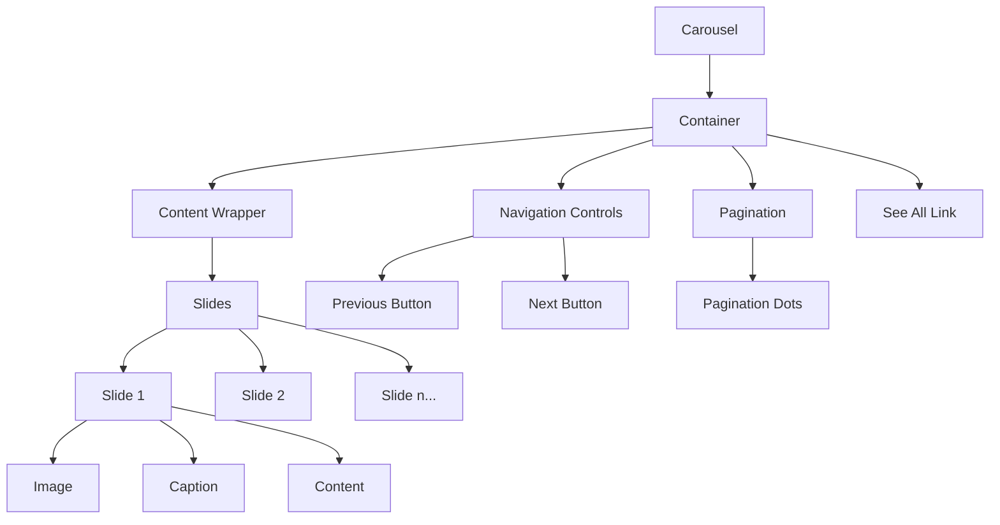

import { BrowserSupport } from "@app/_components/browser-support";
import { Callout } from "nextra/components";

# Carousel

**_(Also called slider, slideshow, image rotator)_**

## Overview

A **carousel** is a UI component that displays a set of content or images in a rotating or sliding manner. Users can navigate through the content using arrows, dots, or swipe gestures on touch devices.

Carousels are often used to showcase featured content, promotions, or image galleries in a limited space.

## Use Cases

### When to use:

- When you have a series of related content or images to display in a limited space
- To highlight featured content, promotions, or key messages
- For storytelling or step-by-step guides that benefit from a linear progression
- When you want to add visual interest and engagement to a page

### When not to use:

- When the content is critical for users to see or interact with immediately
- If the content doesn't have a clear relationship or narrative flow
- When users need to compare items side-by-side or view all options at once
- If the carousel contains too many items, making navigation cumbersome
- When the content is complex or requires significant reading time

### Common scenarios and examples

- Showcasing featured products or services on a homepage
- Displaying a portfolio of work or case studies
- Presenting customer testimonials or reviews
- Guiding users through a multi-step process or tutorial
- Highlighting event announcements or news updates

## Benefits

- Maximizes the use of limited screen space for featuring content
- Helps guide users through a series of related items or messages
- Can increase engagement and time spent on a page
- Allows for visual storytelling and brand expression
- Provides an interactive element for users to explore

## Anatomy

### Component Structure



1. **Container**

- Wraps the carousel content and controls
- Defines the visible area and overall dimensions of the carousel
- Can have a border, background color, or shadow to visually separate it from other content

2. **Content Wrapper**

- Contains the individual carousel slides or items
- Allows for smooth transitioning between slides
- Often uses CSS transforms or absolute positioning for slide placement

3. **Slides**

- The individual content items displayed within the carousel
- Can contain images, text, videos, or other interactive elements
- Should have consistent dimensions and styling for a cohesive appearance

4. **Navigation Arrows**

- Allow users to manually advance or go back through the carousel slides
- Typically placed on the left and right sides of the carousel
- Should have clear hover and focus states for accessibility

5. **Pagination Dots**

- Indicate the total number of slides and the current active slide
- Allow users to quickly jump to a specific slide
- Often placed below the carousel content for easy access

6. **"See All" Link**

- Provides a way for users to access more related content beyond what's shown in the carousel
- Typically placed near the carousel, often below the slides or next to the pagination dots
- Should have a clear and descriptive label indicating where it will take the user (e.g., "See All Products", "View More Cases")

7. **Captions (Optional)**

- Provide additional context or information about each slide
- Can be overlaid on the slide image or placed below the slide
- Should be concise and not obstruct the main slide content

## Best Practices

### Content

**Do's ✅**

- Keep slide content focused and concise for easy scanning
- Use high-quality, visually compelling images that support the content message
- Ensure slide content is mobile-friendly and legible on smaller screens
- Provide meaningful alt text for slide images
- Keep the number of slides manageable to avoid carousel fatigue
- Include a "See All" link to direct users to a dedicated page with more related content (e.g., "See All Case Studies")

**Don'ts ❌**

- Don't rely solely on the carousel to convey critical information
- Avoid using too much text or overly complex layouts within slides
- Don't make the carousel autoplay without also providing pause/stop controls
- Don't use the carousel as a primary navigation mechanism for your site

### Accessibility & UX

**Do's ✅**

- Ensure all slide content and controls are keyboard accessible
- Provide ARIA labels for navigation elements and slide content
- Allow users to pause or stop auto-rotating carousels
- Give users sufficient time to read and interact with each slide
- Make navigation controls large enough for easy clicking or tapping
- Ensure the "See All" link is keyboard accessible and has a clear focus state
- Provide a meaningful ARIA label for the "See All" link that describes its purpose

**Don'ts ❌**

- Don't autoplay content that contains animation or video without user consent
- Avoid using carousel designs that trap keyboard focus within the component
- Don't hide navigation controls or make them difficult to find
- Don't change slide content or position while the user is interacting with it

### Visual Design

**Do's ✅**

- Use consistent design patterns and styling for all carousel elements
- Provide ample visual contrast for text and interactive components
- Ensure slide transitions are smooth and not visually jarring
- Use navigation indicators that clearly convey the current slide position
- Optimize slide images for fast loading and performance

**Don'ts ❌**

- Don't use overly distracting transition effects that detract from the content
- Avoid using low contrast or hard-to-read text over busy background images
- Don't make the carousel unnecessarily large or overwhelming on the page

### Layout & Positioning

**Do's ✅**

- Position the carousel in a prominent location that supports its content purpose
- Ensure the carousel scales and adapts responsively to different screen sizes
- Provide ample spacing between the carousel and surrounding page elements
- Left-align slide content for easier reading and scanning
- Place navigation controls in intuitive and easy-to-reach locations

**Don'ts ❌**

- Don't place the carousel too low on the page where users might miss it
- Avoid positioning the carousel in a way that obstructs other important content
- Don't force users to scroll unnecessarily to view the full carousel on smaller screens
- Don't overcrowd the carousel area with too many competing elements or CTAs

## Code Examples

### Basic Implementation

```html
<!-- Carousel -->
<div class="carousel">
  <div class="carousel-content">
    <!-- Slides -->
    <div class="carousel-slide">
      
      <div class="carousel-caption">Caption for slide 1</div>
    </div>
    <div class="carousel-slide">
      
      <div class="carousel-caption">Caption for slide 2</div>
    </div>
    <!-- More slides... -->
  </div>

  <!-- Controls -->
  <button class="carousel-prev" aria-label="Previous slide">&lt;</button>
  <button class="carousel-next" aria-label="Next slide">&gt;</button>

  <!-- Pagination -->
  <div class="carousel-pagination">
    <button class="carousel-dot active" aria-current="true"></button>
    <button class="carousel-dot"></button>
    <!-- More dots... -->
  </div>

  <!-- "See All" Link -->
  <a href="/all-slides" class="carousel-see-all">See All</a>
</div>
```

## Browser Support

<BrowserSupport
  features={[
    "css.properties.scroll-snap-align",
    "css.properties.scroll-snap-stop",
    "css.properties.overscroll-behavior",
  ]}
/>

## Design Tokens

These design tokens follow the [Design Tokens Format](https://design-tokens.github.io/community-group/format/) specification and can be used with various token transformation tools to generate platform-specific variables.

### Carousel Tokens in DTF Format

```json
{
  "$schema": "https://design-tokens.org/schema.json",
  "carousel": {
    "container": {
      "minHeight": { "value": "400px", "type": "dimension" },
      "padding": { "value": "2rem", "type": "dimension" }
    },
    "slide": {
      "gap": { "value": "1rem", "type": "dimension" },
      "background": { "value": "{color.gray.100}", "type": "color" }
    },
    "seeAllLink": {
      "fontWeight": { "value": "600", "type": "fontWeight" },
      "fontSize": { "value": "1rem", "type": "dimension" },
      "color": {
        "default": { "value": "{color.primary.600}", "type": "color" },
        "hover": { "value": "{color.primary.700}", "type": "color" }
      },
      "marginTop": { "value": "1rem", "type": "dimension" }
    },
    "navigation": {
      "arrow": {
        "color": { "value": "{color.gray.700}", "type": "color" },
        "background": {
          "default": { "value": "{color.white}", "type": "color" },
          "hover": { "value": "{color.gray.200}", "type": "color" }
        },
        "border": { "value": "none", "type": "borderStyle" },
        "size": { "value": "3rem", "type": "dimension" },
        "icon": {
          "previous": { "value": "{icon.chevronLeft}", "type": "icon" },
          "next": { "value": "{icon.chevronRight}", "type": "icon" }
        }
      },
      "dot": {
        "spacing": { "value": "0.75rem", "type": "dimension" },
        "size": {
          "default": { "value": "0.75rem", "type": "dimension" },
          "active": { "value": "1rem", "type": "dimension" }
        },
        "color": {
          "default": { "value": "{color.gray.300}", "type": "color" },
          "active": { "value": "{color.primary.500}", "type": "color" }
        },
        "border": {
          "radius": { "value": "50%", "type": "borderRadius" }
        }
      }
    },
    "caption": {
      "padding": { "value": "1rem", "type": "dimension" },
      "fontSize": { "value": "1rem", "type": "dimension" },
      "color": { "value": "{color.gray.700}", "type": "color" },
      "background": { "value": "{color.white}", "type": "color" }
    },
    "transition": {
      "duration": { "value": "600ms", "type": "duration" },
      "timing": {
        "function": { "value": "ease-in-out", "type": "cubicBezier" }
      }
    }
  }
}
```

## Resources

### Articles

- [Carousel/Slider Design Best Practices](https://xd.adobe.com/ideas/process/ui-design/best-practices-for-carousels-sliders/) by Adobe
- [Designing a User-Friendly Homepage Carousel](https://www.nngroup.com/articles/designing-homepage-carousel/) by Nielsen Norman Group
- [How to Create a Responsive Carousel Component](https://css-tricks.com/how-to-create-a-responsive-carousel-component/) by CSS-Tricks
