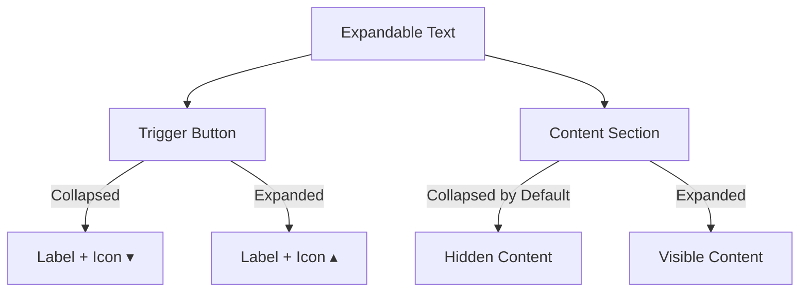

# Expandable Text

**_(Also called collapsible text, Read More/Read Less)_**

## Overview

**Expandable Text** is a content management pattern that allows users to expand and collapse sections of text. This pattern improves readability by initially hiding non-essential content while keeping it accessible on demand.

Expandable Text is commonly used to manage lengthy descriptions, article summaries, or additional details that are helpful but not immediately necessary. It helps users scan content efficiently while maintaining a clean and minimal interface.

## Use Cases

### When to use:

- **Summarizing content** – Showing a short preview of a longer article, product description, or FAQ answer.
- **Reducing page clutter** – Keeping the interface clean by hiding secondary details.
- **Improving mobile usability** – Managing screen space efficiently on smaller devices.
- **Progressive disclosure** – Revealing additional information only when needed.
- **Enhancing readability** – Preventing information overload while keeping details accessible.

### When not to use:

- **For critical information** – Users should not need to expand content to access essential details, such as pricing, terms, or important warnings.
- **For frequently accessed content** – If most users expand the content, it may be better to display it by default.
- **When full content is needed upfront** – Avoid hiding information that helps users make informed decisions quickly.

## Benefits

- **Improves readability** – Helps users scan and navigate content more efficiently.
- **Enhances user control** – Users can choose to expand or collapse information as needed.
- **Saves space** – Keeps interfaces clean and reduces clutter, especially on mobile.
- **Supports progressive disclosure** – Prioritizes important content while making additional details available.
- **Improves accessibility when properly implemented** – Ensures all users can interact with hidden content.

## Drawbacks

- **Hides important information** that users may need upfront.
- **Requires an extra action** from the user, adding friction to content discovery.
- **Can reduce searchability** since hidden text might not be indexed or easily findable.
- If not implemented properly, it **may not be accessible** to screen readers.
- **Unexpected layout shifts** may occur when expanding content, affecting user experience.

## Anatomy



### Component Structure

1. **Trigger Button**

- Used to expand or collapse the text.
- Should be clearly labeled (e.g., "Read More" / "Read Less").
- Includes an icon (▾ for collapsed, ▴ for expanded) to reinforce expand/collapse state.
- Should indicate the expanded state using `aria-expanded`.

2. **Content Section**

- Contains the expandable/collapsible text.
- Hidden by default but fully visible when expanded.

3. **Hidden Content**

- The part of the text that is initially collapsed.
- Should remain in the DOM to ensure accessibility.
- Use `hidden` or `aria-hidden="true"` to prevent screen readers from announcing it prematurely.
- When expanded, remove `hidden` and update `aria-expanded="true"` on the trigger button.
- Consider using `max-height` with `overflow: hidden` instead of `display: none` to allow screen readers to detect changes.

## Best Practices

### Content

**Do's ✅**

- Use clear and concise labels for the expand/collapse button (e.g., "Read More" / "Read Less").
- Keep the collapsed preview meaningful and informative.
- Ensure expanded content is relevant and enhances the user experience.

**Don'ts ❌**

- Don't hide essential information that users need to make decisions.
- Don't use vague labels like "Click Here" without context.
- Don't force users to expand content just to understand the main point.

### Accessibility

**Do's ✅**

- Use a `<button>` element for the trigger to ensure keyboard accessibility.
- Add `aria-expanded="false"` to the button and update it dynamically.
- Use `aria-controls` to associate the button with the expandable content.
- Maintain logical focus order, ensuring the expanded content follows naturally.

**Don'ts ❌**

- Don't rely on color alone to indicate the expanded state.
- Don't remove focus styles on the trigger button.
- Don't make expandable content difficult to navigate for screen reader users.

### Visual Design

**Do's ✅**

- Use **clear expand/collapse icons** (`▸` / `▾`, `+` / `-`, `►` / `▼`) and ensure they change state when toggled.
- **Pair icons with text labels** (e.g., `Read More ▾` / `Read Less ▴`) for clarity.
- **Place icons consistently**:
  - **Inline text expansion**: Position the icon on the **right** (`Read More ▾`).
  - **List-based or block sections**: Position the icon on the **left** (`▸ Section Title`).
- Provide **smooth animations** for expanding/collapsing content.
- Ensure **text contrast** remains high for readability.

**Don'ts ❌**

- **Don't use unclear icons** (e.g., dots `...` or generic arrows that don't rotate).
- **Don't rely on icons alone**—ensure a text label is present.
- **Don't mix left/right placements** inconsistently within the same interface.
- **Don't make the trigger button too small** or difficult to tap on mobile.
- **Don't create unexpected layout shifts** when expanding content.

### Layout & Positioning

**Do's ✅**

- Place expandable content near the primary text to maintain context.
- Ensure the collapsed content remains visually connected to its trigger.
- Make sure expanded content does not overlap or obscure other UI elements.

**Don'ts ❌**

- Don't place the trigger button far from the expandable content.
- Don't create an inconsistent layout by having some sections expand and others not.

## Code Examples

### Basic Implementation

```html
<div>
  <p id="expandable-text">
    This is the visible content...
    <span id="hidden-text" hidden>
      This is the additional content that is initially hidden.
    </span>
  </p>
  <button id="expand-button" aria-expanded="false" aria-controls="hidden-text">
    Read More <span aria-hidden="true">▾</span>
  </button>
</div>

<script>
  const button = document.getElementById("expand-button");
  const text = document.getElementById("hidden-text");
  const icon = button.querySelector("span");

  button.addEventListener("click", () => {
    const isExpanded = button.getAttribute("aria-expanded") === "true";

    button.setAttribute("aria-expanded", !isExpanded);
    text.hidden = isExpanded;

    button.textContent = isExpanded ? "Read More" : "Read Less";
    button.appendChild(icon);
    icon.textContent = isExpanded ? "▾" : "▴";
  });
</script>
```

## Accessibility

### ARIA Attributes

**Required ARIA attributes:**

- `aria-expanded="false"` on the button (updated dynamically).
- `aria-controls="id-of-content"` to link the button to the expandable content.
- `hidden` attribute on the expandable content when collapsed.

### Screen Reader Support

- Ensure that the expanded content is properly announced by screen readers.
- Use `aria-live="polite"` if the content update needs to be announced.

## SEO

- Ensure that expandable text is still **present in the DOM** so search engines can index it.
- Avoid hiding critical content that users or crawlers need upfront.

## Testing Guidelines

### Functional Testing

**Should ✓**

- [ ] Verify that clicking the trigger expands and collapses the content.
- [ ] Ensure the `aria-expanded` attribute updates correctly.
- [ ] Confirm that expanded content is focusable and navigable.
- [ ] Ensure the trigger works when activated via keyboard (`Enter` and `Space` keys).
- [ ] Check that clicking outside the expanded content does not cause unintended collapse (unless designed to do so).
- [ ] Ensure content remains in the DOM when collapsed, and it reappears correctly when expanded.

### Accessibility Testing

**Should ✓**

- [ ] Validate that the trigger button is **focusable** and properly labeled.
- [ ] Test with screen readers to **ensure correct announcement** of expanded content.
- [ ] Verify `aria-controls` properly links the trigger to the expandable content.
- [ ] Ensure `aria-expanded` updates dynamically and is announced correctly.
- [ ] Check that **expanded content is navigable via keyboard** and follows logical tab order.
- [ ] Validate that expandable content does **not rely solely on color** for visual cues.
- [ ] Confirm that **touch targets** meet WCAG guidelines (minimum 44x44px).

### Visual Testing

**Should ✓**

- [ ] Ensure smooth animations and transitions.
- [ ] Verify that expanded content does not break the layout.
- [ ] Ensure that icons properly change direction (`▾` to `▴` or `+` to `-`).
- [ ] Check that expand/collapse actions **do not create layout shifts** affecting surrounding content.
- [ ] Ensure that the transition effect does not make content unreadable.

### Performance Testing

**Should ✓**

- [ ] Test that expansion does not introduce layout shifts (Cumulative Layout Shift - CLS).
- [ ] Verify that expandable content does not trigger **excessive reflows** or repaints.
- [ ] Ensure that animations run at **60 FPS** without jank.
- [ ] Confirm that expanding/collapsing does not introduce memory leaks or excessive DOM updates.

### SEO Testing

**Should ✓**

- [ ] Ensure that **collapsed content is still in the DOM** and indexable by search engines.
- [ ] Verify that search engines **can crawl and access** the hidden content.
- [ ] Check that expandable content is **not blocked by JavaScript** for crawlers.
- [ ] Test using **Google's Mobile-Friendly Test** and **Lighthouse** to ensure SEO impact is minimal.

## Related Patterns

- [Accordion](/patterns/content-management/accordion) – Best for **multi-section collapsible content**, where multiple expandable panels are grouped together (e.g., FAQs or settings menus).
- [Tooltip](/patterns/content-management/tooltip) – Useful for **brief inline explanations**, where additional information is needed on hover or focus, rather than expanding a large content section.
- [Modal](/patterns/content-management/modal) – Ideal when **expanded content requires full attention**, such as confirmations, forms, or important details that should block interaction with the rest of the page.

## Resources

### Articles
