import { BuildEffort } from "@app/_components/build-effort";
import { FaqStructuredData } from "@app/_components/faq-structured-data";
import { Playground } from "@app/_components/playground";

# Expandable Text

**_(Also called collapsible text, Read More/Read Less)_**

## Overview

**Expandable Text** is a content management pattern that allows users to expand and collapse sections of text. This pattern improves readability by initially hiding non-essential content while keeping it accessible on demand.

Expandable Text is commonly used to manage lengthy descriptions, article summaries, or additional details that are helpful but not immediately necessary. It helps users scan content efficiently while maintaining a clean and minimal interface.

<BuildEffort
  level="low"
  description="Toggles visibility of extra text. Requires `aria-expanded` but minimal JavaScript and no major accessibility challenges."
/>

## Use Cases

### When to use:

Use **Expandable Text** when you need to **manage lengthy content while keeping essential information visible**.

**Common scenarios include:**

- **Summarizing content** – Showing a short preview of a longer article, product description, or FAQ answer.
- **Reducing page clutter** – Keeping the interface clean by hiding secondary details.
- **Improving mobile usability** – Managing screen space efficiently on smaller devices.
- **Progressive disclosure** – Revealing additional information only when needed.
- **Enhancing readability** – Preventing information overload while keeping details accessible.

### When not to use:

- **For critical information** – Users should not need to expand content to access essential details, such as pricing, terms, or important warnings.
- **For frequently accessed content** – If most users expand the content, it may be better to display it by default.
- **When full content is needed upfront** – Avoid hiding information that helps users make informed decisions quickly.

## Benefits

- **Improves readability** – Helps users scan and navigate content more efficiently.
- **Enhances user control** – Users can choose to expand or collapse information as needed.
- **Saves space** – Keeps interfaces clean and reduces clutter, especially on mobile.
- **Supports progressive disclosure** – Prioritizes important content while making additional details available.
- **Improves accessibility when properly implemented** – Ensures all users can interact with hidden content.

## Drawbacks

- **Hides important information** that users may need upfront.
- **Requires an extra action** from the user, adding friction to content discovery.
- **Can reduce searchability** since hidden text might not be indexed or easily findable.
- If not implemented properly, it **may not be accessible** to screen readers.
- **Unexpected layout shifts** may occur when expanding content, affecting user experience.

## Anatomy

```mermaid
flowchart TB
    subgraph ExpandableText[Expandable Text Component]
        A[Trigger Button] -->|Collapsed| B[Label + Icon ▾]
        A -->|Expanded| C[Label + Icon ▴]
        A -.->|Toggles State| D[Updates aria-expanded]

        subgraph ContentSection[Content Section]
            E[Hidden Content] -->|Expands| F[Visible Content]
        end
    end
```



### **Component Structure**

1. **Trigger Button**

- Used to **expand or collapse** the text.
- Should be **clearly labeled** (e.g., "Read More" / "Read Less").
- Includes an **icon** (▾ for collapsed, ▴ for expanded) to reinforce expand/collapse state.
- Should indicate the expanded state using **`aria-expanded="true|false"`** for accessibility.
- Must be **keyboard navigable** (activated via `Enter` or `Space` key).

2. **Content Section**

- Contains the **expandable/collapsible** text.
- Remains in the **DOM at all times** to maintain accessibility.
- Should be **visually styled** to clearly indicate expandable behavior.

3. **Hidden Content**

- The part of the text that is **initially collapsed**.
- Should remain in the DOM but hidden using **`aria-hidden="true"`**.
- When expanded:
  - Remove `aria-hidden`.
  - Set `aria-expanded="true"` on the **Trigger Button**.
- Consider using **`max-height` with `overflow: hidden`** instead of `display: none` to ensure screen readers detect changes.

4. **Visual States**

- **Collapsed:** Only a preview of the text is visible, with a "Read More" button.
- **Expanded:** The full content is shown, and the button updates to "Read Less".
- **Hover & Focus:** The button should have a **clear focus indicator** for accessibility.

### **Summary of Components**

| Component            | Required? | Purpose                                           |
| -------------------- | --------- | ------------------------------------------------- |
| Trigger Button       | ✅ Yes    | Expands or collapses the text.                    |
| Content Section      | ✅ Yes    | Contains the expandable/collapsible text.         |
| Hidden Content       | ✅ Yes    | Represents the initially collapsed text.          |
| Expand/Collapse Icon | ❌ No     | Provides a visual cue for expand/collapse states. |
| Hover & Focus States | ✅ Yes    | Ensures proper accessibility and interaction.     |

## Best Practices

### Content

**Do's ✅**

- Use clear and concise labels for the expand/collapse button (e.g., "Read More" / "Read Less").
- Keep the collapsed preview meaningful and informative.
- Ensure expanded content is relevant and enhances the user experience.

**Don'ts ❌**

- Don't hide essential information that users need to make decisions.
- Don't use vague labels like "Click Here" without context.
- Don't force users to expand content just to understand the main point.

### Accessibility

**Do's ✅**

- Use a `<button>` element for the trigger to ensure keyboard accessibility.
- Add `aria-expanded="false"` to the button and update it dynamically.
- Use `aria-controls` to associate the button with the expandable content.
- Maintain logical focus order, ensuring the expanded content follows naturally.

**Don'ts ❌**

- Don't rely on color alone to indicate the expanded state.
- Don't remove focus styles on the trigger button.
- Don't make expandable content difficult to navigate for screen reader users.

### Visual Design

**Do's ✅**

- Use **clear expand/collapse icons** (`▸` / `▾`, `+` / `-`, `►` / `▼`) and ensure they change state when toggled.
- **Pair icons with text labels** (e.g., `Read More ▾` / `Read Less ▴`) for clarity.
- **Place icons consistently**:
  - **Inline text expansion**: Position the icon on the **right** (`Read More ▾`).
  - **List-based or block sections**: Position the icon on the **left** (`▸ Section Title`).
- Provide **smooth animations** for expanding/collapsing content.
- Ensure **text contrast** remains high for readability.

**Don'ts ❌**

- **Don't use unclear icons** (e.g., dots `...` or generic arrows that don't rotate).
- **Don't rely on icons alone**—ensure a text label is present.
- **Don't mix left/right placements** inconsistently within the same interface.
- **Don't make the trigger button too small** or difficult to tap on mobile.
- **Don't create unexpected layout shifts** when expanding content.

### Layout & Positioning

**Do's ✅**

- Place expandable content near the primary text to maintain context.
- Ensure the collapsed content remains visually connected to its trigger.
- Make sure expanded content does not overlap or obscure other UI elements.

**Don'ts ❌**

- Don't place the trigger button far from the expandable content.
- Don't create an inconsistent layout by having some sections expand and others not.

## Tracking

Tracking expandable text interactions helps measure content engagement, assess whether users need additional details, and determine if content should be visible by default. By analyzing user behavior, we can optimize when and how expandable text is used.

### Key Tracking Points

Each expandable text interaction provides valuable insights into user behavior. Below are the key events that should be tracked:

| **Event Name**                | **Description**                                                    | **Why Track It?**                                          |
| ----------------------------- | ------------------------------------------------------------------ | ---------------------------------------------------------- |
| `expandable_text.view`        | When the expandable text component appears in the viewport.        | Determines visibility and content discovery.               |
| `expandable_text.expand`      | When a user expands the content.                                   | Measures engagement and demand for additional information. |
| `expandable_text.collapse`    | When a user collapses the content.                                 | Helps analyze whether users return to a condensed view.    |
| `expandable_text.auto_expand` | When content expands automatically (e.g., based on user behavior). | Determines if automatic expansion improves engagement.     |
| `expandable_text.read_time`   | The time a user spends with the expanded content visible.          | Helps measure content consumption.                         |

### Event Payload Structure

To ensure consistent tracking, here’s a recommended event format:

```json
{
  "event": "expandable_text.expand",
  "properties": {
    "expandable_text_id": "faq_section",
    "interaction_type": "click", // or "keyboard"
    "read_time": 6.4 // in seconds (only tracked on collapse)
  }
}
```

### Key Metrics to Analyze

Once tracking is in place, the following metrics provide actionable insights:

- **Expand Rate** → Percentage of users who expand the content.
- **Collapse Rate** → Percentage of users who collapse the content after expanding it.
- **Average Read Time** → How long users keep the expanded content visible.
- **Auto-Expand vs. Manual Expand Rate** → Helps assess whether users prefer content pre-expanded or if manual interaction is better.
- **Re-Expand Rate** → Percentage of users who collapse and then re-expand the content.

### Insights & Optimization Based on Tracking

By analyzing tracking data, we can optimize the expandable text experience:

- 🚨 **Low Expand Rate?**
  → Users may not notice or feel the need to expand content.
  **Optimization:** Adjust design cues (e.g., larger icons, clearer labels like “Read More”), or test making the content visible by default.

- ⏳ **Short Read Time After Expand?**
  → Users might not be engaging with the expanded content.
  **Optimization:** Ensure content is concise and well-structured, and test whether breaking it into sections improves readability.

- 🔄 **High Collapse Rate?**
  → Users may find expanded content overwhelming or unnecessary.
  **Optimization:** Test progressive disclosure (expanding only parts of the content) or improve the summary text.

- 🔁 **High Re-Expand Rate?**
  → Users may be struggling to retain information after collapsing the text.
  **Optimization:** Consider keeping key details visible at all times or providing a “sticky” summary.

- ⚙️ **Auto-Expand Not Leading to Higher Engagement?**
  → Automatically expanded content may be ignored.
  **Optimization:** A/B test auto-expanded vs. manually triggered content to determine user preference.

By continuously monitoring these metrics, we can refine expandable text usability, ensuring users access necessary information without unnecessary friction.

## Code Examples

### Basic Implementation

<Playground
  patternType="content-management"
  pattern="expandable-text"
  example="basic"
/>

## Accessibility

### ARIA Attributes

**Required ARIA attributes:**

- `aria-expanded="false"` on the button (updated dynamically).
- `aria-controls="id-of-content"` to link the button to the expandable content.
- `hidden` attribute on the expandable content when collapsed.

### Screen Reader Support

- Ensure that the expanded content is properly announced by screen readers.
- Use `aria-live="polite"` if the content update needs to be announced.

## SEO

- Ensure that expandable text is still **present in the DOM** so search engines can index it.
- Avoid hiding critical content that users or crawlers need upfront.

## Testing Guidelines

### Functional Testing

**Should ✓**

- [ ] Verify that clicking the trigger expands and collapses the content.
- [ ] Ensure the `aria-expanded` attribute updates correctly.
- [ ] Confirm that expanded content is focusable and navigable.
- [ ] Ensure the trigger works when activated via keyboard (`Enter` and `Space` keys).
- [ ] Check that clicking outside the expanded content does not cause unintended collapse (unless designed to do so).
- [ ] Ensure content remains in the DOM when collapsed, and it reappears correctly when expanded.

### Accessibility Testing

**Should ✓**

- [ ] Validate that the trigger button is **focusable** and properly labeled.
- [ ] Test with screen readers to **ensure correct announcement** of expanded content.
- [ ] Verify `aria-controls` properly links the trigger to the expandable content.
- [ ] Ensure `aria-expanded` updates dynamically and is announced correctly.
- [ ] Check that **expanded content is navigable via keyboard** and follows logical tab order.
- [ ] Validate that expandable content does **not rely solely on color** for visual cues.
- [ ] Confirm that **touch targets** meet WCAG guidelines (minimum 44x44px).

### Visual Testing

**Should ✓**

- [ ] Ensure smooth animations and transitions.
- [ ] Verify that expanded content does not break the layout.
- [ ] Ensure that icons properly change direction (`▾` to `▴` or `+` to `-`).
- [ ] Check that expand/collapse actions **do not create layout shifts** affecting surrounding content.
- [ ] Ensure that the transition effect does not make content unreadable.

### Performance Testing

**Should ✓**

- [ ] Test that expansion does not introduce layout shifts (Cumulative Layout Shift - CLS).
- [ ] Verify that expandable content does not trigger **excessive reflows** or repaints.
- [ ] Ensure that animations run at **60 FPS** without jank.
- [ ] Confirm that expanding/collapsing does not introduce memory leaks or excessive DOM updates.

### SEO Testing

**Should ✓**

- [ ] Ensure that **collapsed content is still in the DOM** and indexable by search engines.
- [ ] Verify that search engines **can crawl and access** the hidden content.
- [ ] Check that expandable content is **not blocked by JavaScript** for crawlers.
- [ ] Test using **Google's Mobile-Friendly Test** and **Lighthouse** to ensure SEO impact is minimal.

## Related Patterns

- [Accordion](/patterns/content-management/accordion) – Best for **multi-section collapsible content**, where multiple expandable panels are grouped together (e.g., FAQs or settings menus).
- [Tooltip](/patterns/content-management/tooltip) – Useful for **brief inline explanations**, where additional information is needed on hover or focus, rather than expanding a large content section.
- [Modal](/patterns/content-management/modal) – Ideal when **expanded content requires full attention**, such as confirmations, forms, or important details that should block interaction with the rest of the page.

## Frequently Asked Questions

<FaqStructuredData
  items={[
    {
      question: "What is expandable text in web design?",
      answer:
        "Expandable text is a UI pattern that allows users to reveal or hide additional content on demand, enhancing readability and reducing visual clutter by initially displaying only essential information.",
    },
    {
      question: "When should I use expandable text?",
      answer:
        "Use expandable text when you have supplementary information that enhances the user experience but isn't critical for the initial understanding, such as detailed explanations, extended descriptions, or optional content.",
    },
    {
      question: "How can I make expandable text accessible?",
      answer:
        "Ensure that the trigger for expanding text is a focusable element, like a button, and manage ARIA attributes such as 'aria-expanded' to indicate the state. Support keyboard navigation and provide clear visual indicators for focus and state changes.",
    },
    {
      question: "What are the benefits of using expandable text?",
      answer:
        "Expandable text improves readability by reducing visual clutter, allows users to control the amount of information they see, and enhances the overall user experience by organizing content efficiently.",
    },
    {
      question:
        "What are common mistakes to avoid when implementing expandable text?",
      answer:
        "Avoid hiding essential information by default, requiring excessive user actions to access important content, and neglecting accessibility considerations like proper ARIA roles and keyboard support.",
    },
  ]}
/>

## Resources

### Articles
