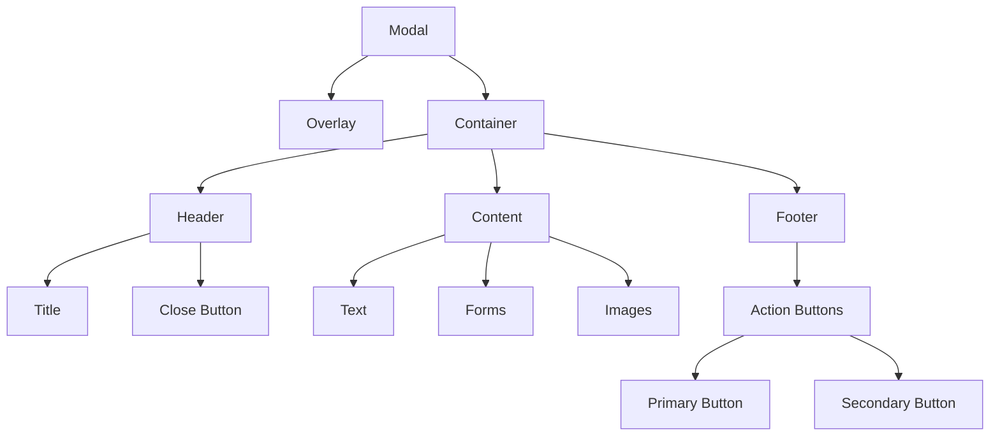
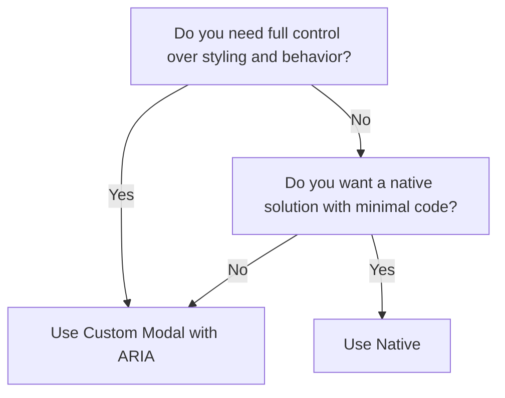

import { BrowserSupport } from "@app/_components/browser-support";
import { BuildEffort } from "@app/_components/build-effort";
import { FaqStructuredData } from "@app/_components/faq-structured-data";

# Modal

**_(Also called dialog, dialog box, overlay, popup)_**

## Overview

A **modal** is an interface element that appears on top of the main application screen, blocking interaction with the rest of the page until the modal is closed.

Modals are used to display important information, request user input, or confirm actions in a focused way.

<BuildEffort
  level="medium"
  description="Requires focus trapping, keyboard accessibility (`Escape` key to close), and handling of background page interactions. Proper ARIA roles are needed to ensure accessibility."
/>

## Use Cases

### When to use:

Use a modal when you need to **interrupt the user flow** to display important information or require user input before proceeding.

**Common scenarios include:**

- **Confirmation dialogs** – e.g., "Are you sure you want to delete this item?"
- **Critical system messages** – e.g., session expiration warnings, important alerts.
- **Forms requiring user input** – e.g., login, payment, or signup flows.
- **Media previews** – e.g., displaying images or videos in a lightbox overlay.
- **Multi-step processes** – e.g., checkout steps or onboarding flows.
- **Displaying terms and conditions** – e.g., requiring user agreement before proceeding.

### When not to use:

- For non-essential information that doesn't require immediate attention
- When the content or interaction can be displayed inline on the page
- If the same information needs to be accessed frequently
- For large amounts of content that require significant scrolling - use a dedicated page for better user experience and accessibility
- When users need to interact with the main page while the modal is open

## Benefits

- Focuses user attention on important information or actions
- Allows gathering necessary input without losing page context
- Can simplify complex workflows by breaking them into focused steps
- Prevents interaction with the main page until a specific task is completed

## Drawbacks

- **Disrupts user flow**, forcing interaction before continuing with the main content.
- **Can be difficult to dismiss**, especially if there's no clear close button.
- **Accessibility challenges** if focus trapping and keyboard navigation are not well managed.
- **Not ideal for mobile users**, as modals may not fit well on small screens.
- **Overuse can lead to frustration**, particularly if used for non-essential content.

## Anatomy



### Component Structure

1. **Overlay**

- A semi-transparent layer that covers the main page content
- Helps focus attention on the modal content
- Usually fades in/out during modal transitions

2. **Container**

- Wraps the modal content, buttons, and close control
- Often has a visible border or shadow to visually separate it from the page
- Can be centered on the screen or aligned to another element

3. **Header**

- Contains the modal title
- Can include a close button and/or icon
- Helps users understand the modal's purpose, fundamental for accessibility

4. **Content**

- The main content area of the modal
- Can contain text, images, forms, or other interactive elements
- Should be focused and concise

5. **Footer (Optional)**

- Contains action buttons (e.g., "OK", "Cancel")
- Provides confirmation and dismissal options
- Can be omitted for simple, informational modals

6. **Close Button (`button`)**

- Allows users to dismiss the modal without taking an action
- Often an "X" icon in the corner of the modal
- Should be included unless the modal requires a specific action to proceed

#### **Summary of Components**

| Component        | Required? | Purpose                                     |
| ---------------- | --------- | ------------------------------------------- |
| **Overlay**      | ✅ Yes    | Blocks background interactions.             |
| **Container**    | ✅ Yes    | The main content container of the modal.    |
| **Header**       | ✅ Yes    | Provides the modal heading.                 |
| **Content**      | ✅ Yes    | Holds the primary information of the modal. |
| **Footer**       | ❌ No     | Contains actions (e.g., "Save", "Cancel").  |
| **Close Button** | ✅ Yes    | Allows users to dismiss the modal.          |

## Best Practices

### Content

**Do's ✅**

- Keep modal content focused and concise
- Use clear, actionable titles that explain the modal's purpose
- Provide obvious confirmation and dismissal options
- Allow users to close the modal by clicking outside the content area
- Ensure the modal content is accessible and responds properly to viewport changes
- Ensure the text is straightforward and free of jargon, avoid technical terms

**Don'ts ❌**

- Don't use modals for frequently accessed or non-essential information
- Avoid long, scrollable content that would be better served by a separate page
- Don't nest modals, as this can be disorienting for users
- Don't overuse modals in your application as it can disrupt user flow
- Avoid ambiguity using vague terms like "Submit" or "Click here"

### Accessibility

**Do's ✅**

- Set `aria-modal="true"` and `role="dialog"` on the modal container
- Focus to the modal container when opening the modal
- Trap focus within the modal container so that tabbing doesn't escape back to the page
- Properly label action buttons and close controls
- Manage keyboard focus and provide intuitive keyboard navigation
- Use an `h2` heading for the modal title
- Ensure the modal can be closed with the Escape key
- Restore focus to the triggering element when the modal is closed
- Use either `aria-labelledby` property to point to the modal title or `aria-label` to provide a label for the modal

**Don'ts ❌**

- Don't make it difficult to find the close button
- Avoid auto-focusing elements like text inputs unless absolutely necessary
- Don't block screen readers from accessing the modal content
- Don't forget to freeze scrolling on the main content while the modal is open

### Visual Design

**Do's ✅**

- Use consistent design patterns for modals throughout your website or web application
- Ensure the modal content contrasts well with the overlay background
- Provide sufficient whitespace and padding within the modal container
- Use a responsive design that adapts well to different screen sizes
- Consider using subtle transitions or animations to help guide user focus
- Provide visual feedback on buttons when an action is processed (e.g. [loading indicator](/patterns/user-feedback/loading-indicator))

**Don'ts ❌**

- Don't make the modal so large that it overwhelms the main page content
- Avoid visually jarring or distracting styles that detract from the content
- Don't use low-contrast text or elements that blend into the overlay background

### Layout & Positioning

**Do's ✅**

- Center modals vertically and horizontally for a balanced layout
- Align modal content to the left for better readability
- Ensure modals have a minimum margin from screen edges on smaller viewports
- Consider placing action buttons in the footer for clear separation

**Don'ts ❌**

- Don't position modals in hard-to-reach areas like the extreme top or bottom of the page
- Avoid modal heights that extend beyond the viewport if possible
- Don't make modals so narrow that the content becomes unnecessarily constrained

## Tracking

Tracking modal interactions helps measure engagement, detect usability issues, and optimize how modals contribute to user workflows. By capturing key actions, we can determine whether modals improve the user experience or create friction.

### Key Tracking Points

Each modal interaction provides valuable insights into user behavior. Below are the key events that should be tracked:

| **Event Name**                 | **Description**                                                                          | **Why Track It?**                                                      |
| ------------------------------ | ---------------------------------------------------------------------------------------- | ---------------------------------------------------------------------- |
| `modal.view`                   | When the modal first appears on the screen.                                              | Helps measure how often users encounter the modal.                     |
| `modal.open`                   | When a user manually opens the modal (e.g., by clicking a button).                       | Measures user-initiated engagement.                                    |
| `modal.auto_open`              | When the modal opens automatically (e.g., a pop-up triggered by page behavior).          | Helps track modal effectiveness vs. annoyance.                         |
| `modal.close`                  | When a user closes the modal (by clicking an "X", pressing Escape, or clicking outside). | Identifies how users dismiss the modal.                                |
| `modal.dismiss_without_action` | When a user closes the modal without interacting with any content inside it.             | Indicates if the modal is irrelevant or intrusive.                     |
| `modal.primary_action`         | When a user clicks the **primary CTA** (e.g., "Submit", "Confirm", "Continue").          | Tracks conversion and engagement with modal content.                   |
| `modal.secondary_action`       | When a user clicks a **secondary action** (e.g., "Cancel", "Learn More", "Skip").        | Measures alternative user behaviors.                                   |
| `modal.interaction_time`       | The time a user spends interacting with the modal before closing.                        | Helps determine if users are engaging with the content or ignoring it. |

### Event Payload Structure

To ensure consistent tracking, here’s a recommended event format:

```json
{
  "event": "modal.primary_action",
  "properties": {
    "modal_id": "newsletter_signup",
    "action_label": "Subscribe",
    "interaction_time": 5.2 // in seconds
  }
}
```

### Key Metrics to Analyze

Once tracking is in place, the following metrics provide actionable insights:

- Open Rate → Percentage of users who see the modal (manual vs. auto-open).
- Engagement Rate → Percentage of users who interact with the modal before closing.
- Dismissal Rate → Percentage of users who close the modal without taking any action.
- Completion Rate → Percentage of users who complete the modal’s primary action.
- Time in Modal → Average time users spend inside the modal.

### Insights & Optimization Based on Tracking

By analyzing tracking data, we can optimize the modal experience:

- 🚨 **High Dismissal Rate?**
  → Users may find the modal intrusive or irrelevant.
  **Optimization:** Adjust the timing, trigger conditions, or placement to make it feel more contextual.

- ⏳ **Low Interaction Time?**
  → Users may not be reading the content or may be overwhelmed.
  **Optimization:** Simplify the message, use bullet points, or reduce the amount of required input.

- 📉 **Low Completion Rate?**
  → The primary action may not be compelling enough.
  **Optimization:** Improve CTA wording, adjust positioning, or offer better incentives.

- ⚡ **High "Escape Key" or Click Outside Dismissals?**
  → Users may instinctively close the modal without engaging.
  **Optimization:** Ensure the modal provides clear value upfront and isn't disrupting the user's flow.

- 🔄 **High Auto-Open Close Rate?**
  → If most users dismiss auto-open modals immediately, they may be perceived as annoying.
  **Optimization:** Make them **manual-triggered only**, delay their appearance, or ensure they are only shown when truly relevant.

By continuously monitoring these metrics, we can refine the modal’s effectiveness and ensure it enhances, rather than disrupts, the user experience.

## Code Examples

### Method 1: Basic Implementation

```html
<!-- Trigger Button -->
<button type="button" data-modal-target="basicModal">Open Modal</button>

<!-- Modal -->
<div id="basicModal" class="modal" role="dialog" aria-modal="true">
  <div class="modal-overlay"></div>
  <div class="modal-content">
    <button type="button" class="modal-close" aria-label="Close modal">
      &times;
    </button>

    <h2>Modal Title</h2>
    <p>Modal content goes here...</p>

    <div class="modal-actions">
      <button type="button" class="button-secondary modal-cancel">
        Cancel
      </button>
      <button type="button" class="button-primary modal-submit">Confirm</button>
    </div>
  </div>
</div>
```

**Pros ✅**

- **Full styling control**—can be completely customized with CSS.
- **Supports advanced animations and transitions**.
- **Can include additional behaviors** (e.g., stacking multiple modals, custom scroll locking).
- **Compatible with all browsers**, including older versions.

**Cons ❌**

- **Requires JavaScript**—needs scripting for open/close behavior.
- **Manual focus management needed**—must ensure focus stays within the modal.
- **Must handle accessibility manually**—requires ARIA attributes (`role="dialog"`, `aria-modal="true"`, `aria-labelledby`).
- **Backdrop needs to be implemented separately**.

### Method 2: Native Modal

```html
<!-- Trigger Button -->
<button
  type="button"
  onclick="document.getElementById('nativeModal').showModal()"
>
  Open Modal
</button>

<!-- Native HTML Modal -->
<dialog id="nativeModal">
  <h2>Modal Title</h2>
  <p>Modal content goes here...</p>

  <div class="modal-actions">
    <button
      type="button"
      class="button-secondary"
      onclick="document.getElementById('nativeModal').close()"
    >
      Cancel
    </button>
    <button type="button" class="button-primary">Confirm</button>
  </div>
</dialog>
```

**Pros ✅**

- **Built-in modal behavior**—prevents interaction with background content.
- **Automatic focus management**—traps focus within the modal when open.
- **Native backdrop support**—automatically applies an overlay.
- **Keyboard accessible by default**—supports `Escape` key to close.
- **Simpler implementation**—requires less JavaScript for basic use.

**Cons ❌**

- **Limited styling control**—some browsers restrict modifications to the native backdrop.
- **Less flexible animations**—difficult to create smooth transitions.
- **Browser inconsistencies**—not fully supported in older browsers.
- **Difficult to integrate with custom UI frameworks**.

### When to use a Native Modal (`<dialog>`) and a Custom Modal?



For a detailed breakdown of feature differences, refer to the table below:

| Feature                           | `<dialog>` (Native Modal)                    | Custom Modal with ARIA                                   |
| --------------------------------- | -------------------------------------------- | -------------------------------------------------------- |
| **Requires JavaScript?**          | ❌ No (for basic behavior)                   | ✅ Yes (to manage accessibility and interactions)        |
| **Supports full styling?**        | ❌ Limited (some browser restrictions)       | ✅ Yes (complete control over appearance and animations) |
| **Built-in focus management?**    | ✅ Yes (automatically traps focus)           | ❌ No (must be implemented manually)                     |
| **Screen reader support?**        | ✅ Yes (automatically announces modal state) | ✅ Yes (if correctly implemented with ARIA roles)        |
| **Backdrop and overlay support?** | ✅ Yes (native `<dialog>` styling)           | ✅ Yes (requires manual implementation)                  |
| **Closing behavior?**             | ✅ Supports ESC key, `.close()` method       | ✅ Requires explicit event handling                      |
| **Best for**                      | Simple, native modals with default behavior  | Fully custom modals with advanced interactions           |

## Accessibility

### Keyboard Interaction Pattern

The following table outlines the standard keyboard interactions for modal components. These interactions ensure that users can navigate and operate modals effectively using only a keyboard.

| Key         | Action                                                                                               |
| ----------- | ---------------------------------------------------------------------------------------------------- |
| Escape      | Closes the modal                                                                                     |
| Tab         | Moves focus to the next focusable element within the modal. Focus should be trapped within the modal |
| Shift + Tab | Moves focus to the previous focusable element within the modal                                       |
| Enter/Space | Activates the focused button or control                                                              |

> **Note**: When the modal opens, focus should automatically move to the first focusable element within the modal (usually the close button or the first form field). When the modal closes, focus should return to the element that triggered the modal.

## Testing Guidelines

### Functional Testing

**Should ✓**

- [ ] Ensure the modal **opens and closes correctly** when triggered.
- [ ] Verify that **clicking the close button** dismisses the modal.
- [ ] Check that clicking **outside the modal (on the overlay)** closes it, if applicable.
- [ ] Ensure the modal **does not close** when interacting with form fields or selecting text inside.
- [ ] Test modal behavior **when resizing the viewport**—it should remain correctly positioned.
- [ ] Validate that **nested modals** (if supported) do not break functionality.

### Accessibility Testing

**Should ✓**

- [ ] Ensure the modal has **`role="dialog"`** and **`aria-modal="true"`**.
- [ ] Verify that the modal title is **announced by screen readers** using `aria-labelledby` or `aria-label`.
- [ ] Ensure **keyboard navigation is functional**—users can tab through elements inside the modal.
- [ ] Test that focus is **trapped inside the modal** while it is open.
- [ ] Ensure that pressing the **Escape key closes the modal**.
- [ ] Confirm that **focus returns to the triggering element** when the modal closes.
- [ ] Verify that **modals do not interfere with screen reader navigation**.

### Icon & Close Button Testing

**Should ✓**

- [ ] Ensure the **close button is visible and accessible**.
- [ ] Verify that the **icon changes state** if an interactive toggle icon is used.
- [ ] Confirm that **keyboard users can activate the close button**.

### Visual Testing

**Should ✓**

- [ ] Validate that the **modal is positioned correctly** (centered or anchored as intended).
- [ ] Ensure the modal has **sufficient contrast** against the overlay.
- [ ] Check that **action buttons are clearly visible and styled appropriately**.
- [ ] Verify that modal **animations/transitions** (if any) are smooth and non-jarring.
- [ ] Test modal layout across **various screen sizes** to ensure responsiveness.

### Performance Testing

**Should ✓**

- [ ] Verify that modal animations **do not cause lag**.
- [ ] Ensure modals **load efficiently** and do not block page rendering.
- [ ] Test modal performance when **multiple modals are triggered in succession**.
- [ ] Confirm that **closing the modal correctly removes it from the DOM** (if dynamically inserted).

## Browser Support

<BrowserSupport
  features={["api.HTMLDialogElement", "css.properties.backdrop-filter"]}
/>

## Design Tokens

These design tokens follow the [Design Tokens Format](https://design-tokens.github.io/community-group/format/) specification and can be used with various token transformation tools to generate platform-specific variables.

### Modal Tokens in DTF Format

```json
{
  "$schema": "https://design-tokens.org/schema.json",
  "modal": {
    "animation": {
      "duration": { "value": "300ms", "type": "duration" },
      "easing": { "value": "ease-out", "type": "cubicBezier" }
    },
    "overlay": {
      "background": { "value": "rgba(0, 0, 0, 0.8)", "type": "color" }
    },
    "container": {
      "padding": { "value": "2rem", "type": "dimension" },
      "background": { "value": "{color.white}", "type": "color" },
      "border": {
        "radius": { "value": "0.5rem", "type": "dimension" },
        "shadow": {
          "value": "0px 4px 16px rgba(0, 0, 0, 0.2)",
          "type": "boxShadow"
        }
      },
      "width": {
        "mobile": { "value": "90%", "type": "dimension" },
        "desktop": { "value": "600px", "type": "dimension" }
      }
    },
    "heading": {
      "margin": { "value": "0 0 1rem", "type": "dimension" },
      "fontWeight": { "value": "600", "type": "fontWeight" }
    },
    "actions": {
      "gap": { "value": "1rem", "type": "dimension" },
      "marginTop": { "value": "2rem", "type": "dimension" }
    },
    "close": {
      "size": { "value": "2rem", "type": "dimension" },
      "background": { "value": "transparent", "type": "color" },
      "border": { "value": "none", "type": "borderStyle" },
      "icon": { "value": "{icon.close}", "type": "icon" },
      "top": { "value": "1.5rem", "type": "dimension" },
      "right": { "value": "1.5rem", "type": "dimension" }
    }
  }
}
```

## Frequently Asked Questions

<FaqStructuredData
  items={[
    {
      question: "What is a modal dialog in web design?",
      answer:
        "A modal dialog is a user interface element that appears on top of the main content, requiring users to interact with it before returning to the underlying page. It is commonly used to capture user input, display critical information, or prompt for decisions.",
    },
    {
      question: "When should I use a modal dialog?",
      answer:
        "Modal dialogs are appropriate when you need to direct the user's attention to important information or require an immediate response. Common scenarios include confirming actions, displaying forms, or presenting critical alerts.",
    },
    {
      question: "How can I make a modal dialog accessible?",
      answer:
        "To ensure accessibility, use semantic HTML elements like `<dialog>` or `<div>` with appropriate ARIA roles. Manage focus by moving it to the modal when it opens and returning it to the triggering element upon closure. Provide keyboard support for navigation and actions within the modal.",
    },
    {
      question: "What are the benefits of using modal dialogs?",
      answer:
        "Modal dialogs effectively capture user attention, facilitate focused interactions, and can streamline workflows by prompting users to complete specific tasks without navigating away from the current page.",
    },
    {
      question:
        "What are common mistakes to avoid when implementing modal dialogs?",
      answer:
        "Avoid overusing modal dialogs, as they can become intrusive. Ensure they are not used for non-critical information. Always implement proper focus management and keyboard accessibility to prevent trapping users within the modal.",
    },
  ]}
/>

## Resources

### Articles

- [A11y Dialog by Kitty Giraudel](https://a11y-dialog.netlify.app/)
- [Which heading level should dialog modals have](https://medium.com/@web-accessibility-education/which-heading-level-should-dialog-modals-have-7b3df89437f0)

### Documentation

- [Dialog (Modal) Pattern](https://www.w3.org/WAI/ARIA/apg/patterns/dialog-modal/)
- [Using the Popover API](https://developer.mozilla.org/en-US/docs/Web/API/Popover_API/Using#dismissing_popovers_automatically_via_a_timer)

### Libraries

- [Dialog - shadcn/ui](https://ui.shadcn.com/docs/components/dialog)
- [Diaglo - OriginUI](https://originui.com/dialogs)
- [React Aria - Modal](https://react-spectrum.adobe.com/react-aria/Modal.html)
