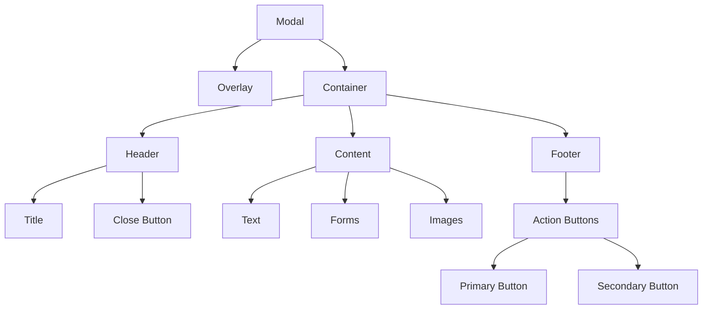

import { BrowserSupport } from "@app/_components/browser-support";
import { Callout } from "nextra/components";

# Modal

**_(Also called dialog, dialog box, overlay, popup)_**

## Overview

A **modal** is an interface element that appears on top of the main application screen, blocking interaction with the rest of the page until the modal is closed.

Modals are used to display important information, request user input, or confirm actions in a focused way.

## Use Cases

### When to use:

- When you need to grab the user's attention for important information or actions
- For critical confirmation messages (e.g., "Are you sure you want to delete?")
- To gather necessary information before proceeding (e.g., login forms, payment details)
- When the user needs to perform a separate, focused task without losing the context of the main page

### When not to use:

- For non-essential information that doesn't require immediate attention
- When the content or interaction can be displayed inline on the page
- If the same information needs to be accessed frequently
- For large amounts of content that require significant scrolling - use a dedicated page for better user experience and accessibility
- When users need to interact with the main page while the modal is open

### Common scenarios and examples

- Displaying terms and conditions before allowing a user to sign up
- Confirming deletion of an important resource
- Gathering payment details during a checkout process
- Showing a login form when accessing protected content
- Displaying images or videos in a lightbox overlay

## Benefits

- Focuses user attention on important information or actions
- Allows gathering necessary input without losing page context
- Can simplify complex workflows by breaking them into focused steps
- Prevents interaction with the main page until a specific task is completed

## Anatomy

### Component Structure



1. **Overlay**

- A semi-transparent layer that covers the main page content
- Helps focus attention on the modal content
- Usually fades in/out during modal transitions

2. **Container**

- Wraps the modal content, buttons, and close control
- Often has a visible border or shadow to visually separate it from the page
- Can be centered on the screen or aligned to another element

3. **Header**

- Contains the modal title
- Can include a close button and/or icon
- Helps users understand the modal's purpose, fundamental for accessibility

4. **Content**

- The main content area of the modal
- Can contain text, images, forms, or other interactive elements
- Should be focused and concise

5. **Footer (Optional)**

- Contains action buttons (e.g., "OK", "Cancel")
- Provides confirmation and dismissal options
- Can be omitted for simple, informational modals

6. **Close Button**

- Allows users to dismiss the modal without taking an action
- Often an "X" icon in the corner of the modal
- Should be included unless the modal requires a specific action to proceed

## Best Practices

### Content

**Do's ✅**

- Keep modal content focused and concise
- Use clear, actionable titles that explain the modal's purpose
- Provide obvious confirmation and dismissal options
- Allow users to close the modal by clicking outside the content area
- Ensure the modal content is accessible and responds properly to viewport changes
- Ensure the text is straightforward and free of jargon, avoid technical terms

**Don'ts ❌**

- Don't use modals for frequently accessed or non-essential information
- Avoid long, scrollable content that would be better served by a separate page
- Don't nest modals, as this can be disorienting for users
- Don't overuse modals in your application as it can disrupt user flow
- Avoid ambiguity using vague terms like "Submit" or "Click here"

### Accessibility & UX

**Do's ✅**

- Set `aria-modal="true"` and `role="dialog"` on the modal container
- Focus to the modal container when opening the modal
- Trap focus within the modal container so that tabbing doesn't escape back to the page
- Properly label action buttons and close controls
- Manage keyboard focus and provide intuitive keyboard navigation
- Use an `h2` heading for the modal title
- Ensure the modal can be closed with the Escape key
- Restore focus to the triggering element when the modal is closed
- Use either `aria-labelledby` property to point to the modal title or `aria-label` to provide a label for the modal

**Don'ts ❌**

- Don't make it difficult to find the close button
- Avoid auto-focusing elements like text inputs unless absolutely necessary
- Don't block screen readers from accessing the modal content
- Don't forget to freeze scrolling on the main content while the modal is open

### Visual Design

**Do's ✅**

- Use consistent design patterns for modals throughout your webiste or web application
- Ensure the modal content contrasts well with the overlay background
- Provide sufficient whitespace and padding within the modal container
- Use a responsive design that adapts well to different screen sizes
- Consider using subtle transitions or animations to help guide user focus
- Provide visual feedback on buttons when an action is processed (e.g. [loading indicator](/patterns/user-feedback/loading-indicator))

**Don'ts ❌**

- Don't make the modal so large that it overwhelms the main page content
- Avoid visually jarring or distracting styles that detract from the content
- Don't use low-contrast text or elements that blend into the overlay background

### Layout & Positioning

**Do's ✅**

- Center modals vertically and horizontally for a balanced layout
- Align modal content to the left for better readability
- Ensure modals have a minimum margin from screen edges on smaller viewports
- Consider placing action buttons in the footer for clear separation

**Don'ts ❌**

- Don't position modals in hard-to-reach areas like the extreme top or bottom of the page
- Avoid modal heights that extend beyond the viewport if possible
- Don't make modals so narrow that the content becomes unnecessarily constrained

## Code Examples

### Basic Implementation

```html
<!-- Trigger -->
<button type="button" data-modal-target="basicModal">Open Modal</button>

<!-- Modal -->
<div id="basicModal" class="modal" role="dialog" aria-modal="true">
  <div class="modal-overlay"></div>
  <div class="modal-content">
    <button type="button" class="modal-close" aria-label="Close modal">
      &times;
    </button>

    <h2>Modal Title</h2>
    <p>Modal content goes here...</p>

    <div class="modal-actions">
      <button type="button" class="button-secondary modal-cancel">
        Cancel
      </button>
      <button type="button" class="button-primary modal-submit">Confirm</button>
    </div>
  </div>
</div>
```

## Browser Support

<BrowserSupport
  features={["api.HTMLDialogElement", "css.properties.backdrop-filter"]}
/>

## Design Tokens

These design tokens follow the [Design Tokens Format](https://design-tokens.github.io/community-group/format/) specification and can be used with various token transformation tools to generate platform-specific variables.

### Modal Tokens in DTF Format

```json
{
  "$schema": "https://design-tokens.org/schema.json",
  "modal": {
    "animation": {
      "duration": { "value": "300ms", "type": "duration" },
      "easing": { "value": "ease-out", "type": "cubicBezier" }
    },
    "overlay": {
      "background": { "value": "rgba(0, 0, 0, 0.8)", "type": "color" }
    },
    "container": {
      "padding": { "value": "2rem", "type": "dimension" },
      "background": { "value": "{color.white}", "type": "color" },
      "border": {
        "radius": { "value": "0.5rem", "type": "dimension" },
        "shadow": {
          "value": "0px 4px 16px rgba(0, 0, 0, 0.2)",
          "type": "boxShadow"
        }
      },
      "width": {
        "mobile": { "value": "90%", "type": "dimension" },
        "desktop": { "value": "600px", "type": "dimension" }
      }
    },
    "heading": {
      "margin": { "value": "0 0 1rem", "type": "dimension" },
      "fontWeight": { "value": "600", "type": "fontWeight" }
    },
    "actions": {
      "gap": { "value": "1rem", "type": "dimension" },
      "marginTop": { "value": "2rem", "type": "dimension" }
    },
    "close": {
      "size": { "value": "2rem", "type": "dimension" },
      "background": { "value": "transparent", "type": "color" },
      "border": { "value": "none", "type": "borderStyle" },
      "icon": { "value": "{icon.close}", "type": "icon" },
      "top": { "value": "1.5rem", "type": "dimension" },
      "right": { "value": "1.5rem", "type": "dimension" }
    }
  }
}
```

## Resources

### Articles

- [A11y Dialog by Kitty Giraudel](https://a11y-dialog.netlify.app/)
- [Which heading level should dialog modals have](https://medium.com/@web-accessibility-education/which-heading-level-should-dialog-modals-have-7b3df89437f0)

### Documentation

- [Dialog (Modal) Pattern](https://www.w3.org/WAI/ARIA/apg/patterns/dialog-modal/)
- [Using the Popover API](https://developer.mozilla.org/en-US/docs/Web/API/Popover_API/Using#dismissing_popovers_automatically_via_a_timer)

### Libraries

- [Dialog - shadcn/ui](https://ui.shadcn.com/docs/components/dialog)
- [Diaglo - OriginUI](https://originui.com/dialogs)
- [React Aria - Modal](https://react-spectrum.adobe.com/react-aria/Modal.html)
