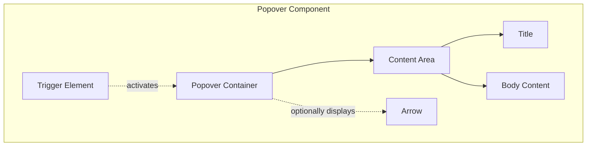
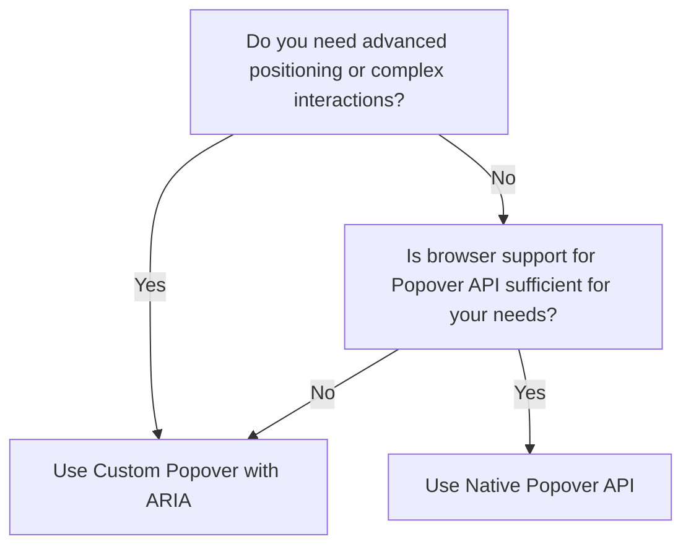

import { BrowserSupport } from "@app/_components/browser-support";
import { BuildEffort } from "@app/_components/build-effort";

# Popover

## Overview

**Popovers** are overlay components that appear on top of the main content to provide users with additional information or actions.

They are used to display contextual content while keeping the surrounding page visible.

Unlike modals that block interaction with the rest of the page, popovers provide contextual help or shortcuts while keeping the main interface visible and interactive.

<BuildEffort
  level="medium"
  description="Requires positioning logic, dismissal handling, focus management, and ARIA attributes (`aria-haspopup`, `aria-expanded`)."
/>

## Use Cases

### When to use:

Use a popover when you need to provide context-specific information or quick actions that complement the main view without requiring full user focus.

**Common scenarios include:**

- Contextual help – e.g., additional details about a data field.
- Quick actions or shortcuts – e.g., editing options or additional buttons.
- Compact toolbars or menus – e.g., filters or settings that appear on demand.
- Preview or supplementary information – e.g., image or text previews on hover/focus.

### When not to use:

- When the information is critical and must be persistently visible.
- For large forms or complex interactions better suited to modals.
- When the context requires a full-page takeover for clarity.

## Benefits

- Enhances user focus by offering context-specific content.
- Keeps the main interface uncluttered.
- Improves discoverability of secondary actions without navigating away.

## Drawbacks

- **Requires precise user interaction**, which may be difficult for some users.
- **Can obstruct other content**, making it harder to interact with the page.
- **Often inaccessible** if not implemented with correct keyboard navigation and focus management.
- **Positioning challenges**, especially if the popover appears off-screen.
- **Risk of accidental dismissal**, leading to frustration if users need the information again.

## Anatomy



### Component Structure

1. **Trigger Element**

- The interactive element (e.g., button, icon, text) that activates the popover.
- Manages **accessibility attributes** like `aria-haspopup` and `aria-expanded`.
- Should be **focusable** and work with keyboard navigation.

2. **Popover Container**

- The root element that wraps the popover content.
- Manages **positioning relative to the trigger element**.
- Handles **visibility and accessibility considerations**.

3. **Arrow (Optional)**

- A **visual indicator** pointing to the trigger element.
- Helps users understand the relationship between **popover and trigger**.
- Should adjust **based on positioning** (e.g., top, bottom, left, right).

4. **Content Area**

- Contains all the **popover content**.
- Typically includes a **title, body content, and interactive elements**.

5. **Title (Optional)**

- A **brief heading or label** for the popover content.
- Helps users understand **context at a glance**.

6. **Body Content**

- The **main content** of the popover.
- Can include **text, links, or simple interactive elements**.

7. **Close Button (Optional)**

- Allows users to **dismiss the popover manually**.
- Should be **keyboard accessible** and labeled appropriately.
- Helps users who **prefer to close the popover without clicking outside**.

8. **Dismiss Behavior**

- The popover should close when the user:
  - Clicks **outside** of the popover.
  - Presses **Esc** on the keyboard.
  - Navigates away using the **Tab key** (if focus moves outside the popover).
- Ensures **smooth UX and proper accessibility handling**.

#### **📌 Summary of Components**

| Component             | Required? | Purpose                                                    |
| --------------------- | --------- | ---------------------------------------------------------- |
| **Trigger Element**   | ✅ Yes    | The element that activates the popover.                    |
| **Popover Container** | ✅ Yes    | Contains the content of the popover.                       |
| **Arrow**             | ❌ No     | Visually connects the popover to the trigger.              |
| **Title**             | ❌ No     | Provides a heading for the popover content.                |
| **Body Content**      | ✅ Yes    | The main content of the popover.                           |
| **Close Button**      | ❌ No     | Allows users to manually dismiss the popover.              |
| **Dismiss Behavior**  | ✅ Yes    | Defines how the popover closes (Esc, click outside, etc.). |

## Best Practices

### Content

**Do's ✅**

- Keep content concise and focused.
- Ensure critical actions are easily accessible.
- Use clear labels for any interactive elements.

**Don'ts ❌**

- Avoid overloading with too much information.
- Don't include critical navigation or forms better suited for a modal.
- Do not expect users to scroll through extensive content.

### Accessibility

**Do's ✅**

- Ensure the popover is keyboard navigable (e.g., support Tab and Esc keys).
- Use appropriate ARIA attributes like `aria-haspopup` and `aria-expanded`.
- Manage focus: move focus into the popover when opened and return it when closed.

**Don'ts ❌**

- Rely solely on hover for activation, as it may be inaccessible on touch devices.
- Omit a clear focus indication for interactive elements within the popover.

### Visual Design

**Do's ✅**

- Clearly differentiate the popover from the background with contrasting colors.
- Use subtle shadows and transitions for a smooth appearance.
- Provide a clear pointer or arrow to associate with the trigger element.

**Don'ts ❌**

- Use excessive animations that can distract or slow down the interaction.
- Create styling that blends too closely with the underlying page.

### Layout & Positioning

**Do's ✅**

- Position the popover close to its trigger for clear visual association.
- Ensure the popover does not obscure important page content.
- Consider responsive adjustments to maintain usability on all devices.

**Don'ts ❌**

- Allow the popover to display off-screen; always adjust its placement.
- Fix its position in a way that it overlaps essential navigation elements.

Certainly! Here's a similar section for the popover pattern:

## Code Examples

### Method 1: Custom Popover Implementation

```html
<!-- Trigger Button -->
<button id="popoverTrigger" aria-haspopup="true" aria-expanded="false">
  Open Popover
</button>

<!-- Popover -->
<div
  id="customPopover"
  class="popover"
  role="dialog"
  aria-labelledby="popoverTitle"
  hidden
>
  <div class="popover-content">
    <button type="button" class="popover-close" aria-label="Close popover">
      &times;
    </button>

    <h3 id="popoverTitle">Popover Title</h3>
    <p>Popover content goes here...</p>

    <div class="popover-actions">
      <button type="button" class="button-primary">Action</button>
    </div>
  </div>
</div>

<script>
  const trigger = document.getElementById("popoverTrigger");
  const popover = document.getElementById("customPopover");

  trigger.addEventListener("click", () => {
    const expanded = trigger.getAttribute("aria-expanded") === "true";
    trigger.setAttribute("aria-expanded", !expanded);
    popover.hidden = expanded;
  });
</script>
```

**Pros ✅**

- **Full styling control**—can be completely customized with CSS.
- **Supports advanced positioning and animations**.
- **Can include complex interactions and behaviors**.
- **Compatible with all browsers**, including older versions.

**Cons ❌**

- **Requires JavaScript**—needs scripting for open/close behavior and positioning.
- **Manual accessibility management**—requires careful implementation of ARIA attributes and keyboard interactions.
- **Positioning challenges**—may require additional libraries or complex logic for proper placement.
- **No built-in light dismiss**—must be implemented manually.

### Method 2: Native Popover API

```html
<!-- Trigger Button -->
<button popovertarget="nativePopover">Open Popover</button>

<!-- Native Popover -->
<div id="nativePopover" popover>
  <h3>Popover Title</h3>
  <p>Popover content goes here...</p>
  <button popovertarget="nativePopover" popovertargetaction="hide">
    Close
  </button>
</div>
```

**Pros ✅**

- **Built-in popover behavior**—handles showing/hiding automatically.
- **Light dismiss support**—closes when clicking outside by default.
- **Keyboard accessible by default**—supports `Escape` key to close.
- **Simpler implementation**—requires minimal JavaScript.
- **Stacking context management**—handles z-index automatically.

**Cons ❌**

- **Limited browser support**—not available in all browsers yet.
- **Less control over positioning**—limited options for custom placement.
- **Styling restrictions**—some default styles may be harder to override.
- **Less flexibility for complex behaviors**—may require additional scripting for advanced use cases.

### When to use Native Popover API vs Custom Popover?



For a detailed breakdown of feature differences, refer to the table below:

| Feature                   | Native Popover API                          | Custom Popover with ARIA                            |
| ------------------------- | ------------------------------------------- | --------------------------------------------------- |
| **Requires JavaScript?**  | ❌ No (for basic behavior)                  | ✅ Yes (for positioning and interactions)           |
| **Full styling control?** | ❌ Limited (some default styles)            | ✅ Yes (complete control over appearance)           |
| **Positioning options?**  | ❌ Limited (uses default positioning)       | ✅ Flexible (can use custom positioning logic)      |
| **Light dismiss?**        | ✅ Built-in                                 | ❌ Must be implemented manually                     |
| **Browser support?**      | ❌ Limited (newer browsers only)            | ✅ Works in all browsers with JS support            |
| **Accessibility?**        | ✅ Good (but may need enhancements)         | ✅ Can be fully accessible (requires careful impl.) |
| **Complex interactions?** | ❌ Limited (may need additional JS)         | ✅ Supports complex custom behaviors                |
| **Best for**              | Simple popovers with modern browser support | Custom popovers with specific design requirements   |

## Accessibility

### ARIA Attributes

**Required ARIA attributes:**

- `aria-haspopup="true"` on the trigger element.
- `aria-expanded` on the trigger element to reflect open/closed state.
- `role="dialog"` (or `role="menu"` if used as a menu) on the popover container.
- Ensure focus management so that keyboard users receive context.

### Keyboard Interaction Pattern

The following table outlines the standard keyboard interactions for popover components.

| Key | Action                                                    |
| --- | --------------------------------------------------------- |
| Tab | Navigate between focusable items within the popover       |
| Esc | Close the popover and return focus to the trigger element |

## SEO

- Ensure the popover content is not critical for SEO or provide alternate ways for search engines to access the content.
- Use descriptive hidden text if necessary so screen readers can still announce key information.

## Testing Guidelines

### Functional Testing

**Should ✓**

- [ ] Verify that clicking the trigger displays the popover.
- [ ] Ensure that keyboard navigation (Tab, Esc) behaves as expected.
- [ ] Confirm ARIA attributes update correctly when toggling the popover.
- [ ] Ensure focus handling moves into and out of the popover appropriately.

### Accessibility Testing

**Should ✓**

- [ ] Validate that screen reader users are notified when the popover is opened.
- [ ] Test that focus is not lost when navigating through popover content.
- [ ] Ensure the popover closes with the Esc key and returns focus to the trigger.

### Visual Testing

**Should ✓**

- [ ] Confirm that the popover appears near the trigger and does not obscure other critical information.
- [ ] Validate that styling and animations are smooth and non-distracting.
- [ ] Check that the popover remains fully visible on different screen sizes.

### Performance Testing

**Should ✓**

- [ ] Ensure that opening and closing the popover does not induce performance lags.
- [ ] Verify that the dynamic positioning adapts swiftly as the viewport changes.

## Design Tokens

These design tokens follow the [Design Tokens Format](https://design-tokens.github.io/community-group/format/) specification and can be used with various token transformation tools to generate platform-specific variables.

### Popover Tokens in DTF Format

```json:popover.json
{
  "$schema": "https://design-tokens.org/schema.json",
  "popover": {
    "container": {
      "background": { "value": "{color.white}", "type": "color" },
      "border": { "value": "1px solid {color.gray.300}", "type": "border" },
      "shadow": { "value": "0px 4px 16px rgba(0, 0, 0, 0.1)", "type": "boxShadow" },
      "padding": { "value": "1rem", "type": "dimension" }
    },
    "arrow": {
      "size": { "value": "0.5rem", "type": "dimension" },
      "color": { "value": "{color.white}", "type": "color" }
    },
    "transition": {
      "duration": { "value": "200ms", "type": "duration" },
      "timingFunction": { "value": "ease-in-out", "type": "cubicBezier" }
    }
  }
}
```

## Related Patterns

Consider these related patterns when implementing popovers:

- [Modal](/patterns/content-management/modal) - Used for critical interactions requiring full focus.
- [Tooltip](/patterns/content-management/tooltip) - Similar in providing contextual information but less interactive.
- [Selection Input / Dropdown](/patterns/forms/selection-input) - Best for more complex navigation menus.

## Resources

### Articles

### Documentation

[popover | MDN](https://developer.mozilla.org/en-US/docs/Web/HTML/Global_attributes/popover)

### Libraries

- [Popover - shadcn/ui](https://ui.shadcn.com/docs/components/popover)
- [Popover - OriginUI](https://originui.com/popover)
