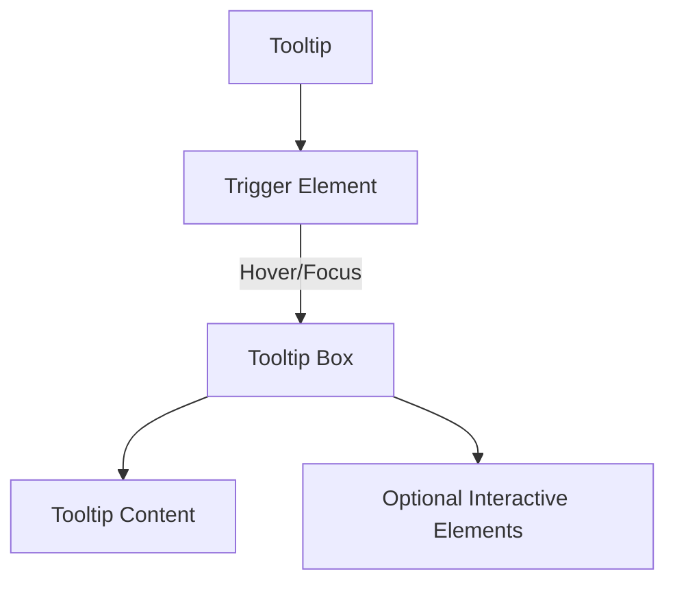

import { BuildEffort } from "@app/_components/build-effort";
import { FaqStructuredData } from "@app/_components/faq-structured-data";

# Tooltip

**_(Also called hover hint, info bubble)_**

## Overview

A **tooltip** is a small popup that provides additional contextual information when a user hovers over, focuses on, or interacts with an element. It helps clarify elements with **icons, buttons, or text snippets** that may not be self-explanatory.

There are **two types of tooltips**:

- **Simple Tooltips** – Short text descriptions that appear on hover or focus, providing a brief explanation.
- **Rich Tooltips** – Enhanced tooltips that may contain **formatted text, icons, images, or interactive elements**.

Tooltips should be used to enhance understanding without overwhelming the user interface.

<BuildEffort
  level="low"
  description="Simple hover/focus effect. Requires ARIA attributes (`aria-describedby`) for accessibility but no complex state management."
/>

## Use Cases

### When to use:

Use a tooltip when you need to provide **additional context or explanations** without taking up extra space in the UI.

**Common use cases include:**

**Simple Tooltips**

- **Clarifying icons or abbreviations** (e.g., a settings cog, currency symbols).
- **Providing additional information** about form fields or table headers.
- **Showing helper text** for complex actions (e.g., "This action is permanent").
- **Explaining disabled elements** when a user cannot interact with them.
- **Providing keyboard shortcuts** when hovering over action buttons.

**Rich Tooltips**

- **Providing in-depth explanations** beyond a brief description.
- **Displaying small images, formatted text, or interactive content**.
- **Presenting additional details about data points in charts**.
- **Showing user profile previews in social apps**.

### When not to use:

- **For critical information** users must read, such as error messages.
- **For content that should remain visible**, like persistent hints or descriptions.
- **When users need to interact** with the tooltip itself.
- **If the tooltip is the only means** of conveying information (accessibility issue).
- **For mobile-first interactions** where hover-based behavior isn't intuitive.

## Benefits

- **Reduces clutter** by providing contextual information without crowding the UI.
- **Improves user understanding** of complex actions or terminology.
- **Enhances accessibility** when used correctly with keyboard and screen reader support.
- **Provides instant feedback** without disrupting the user's flow.

## Drawbacks

- Can be **difficult to trigger** on mobile devices due to the lack of hover interactions.
- Often **overlooked by users**, especially if they don't expect additional information.
- May **interfere with content visibility**, particularly if not positioned well.
- Can cause **accessibility issues** if not properly implemented for keyboard and screen readers.
- If tooltips **disappear too quickly**, users may struggle to read the content.

## Anatomy

## Anatomy



### Component Structure

1. **Trigger Element**

- The interactive element (e.g., button, icon, text) that activates the tooltip.
- Should have **`aria-describedby`** linking to the tooltip content for accessibility.
- Can be activated by **hover (mouse), focus (keyboard), or tap (touch devices)**.
- Should have a **clear focus indicator** when navigated via keyboard.

2. **Tooltip Box**

- The container that appears when the tooltip is activated.
- Should be **positioned near the trigger element** for contextual relevance.
- Should have **`role="tooltip"`** for proper screen reader support.

3. **Tooltip Content**

- Contains the **explanatory text or information**.
- Should be **short and concise** to avoid overwhelming users.
- Should **not contain interactive elements** like links or buttons in simple tooltips.

4. **Arrow (Optional)**

- A **visual pointer** indicating the tooltip's source.
- Adjusts dynamically **based on the tooltip's position** (e.g., top, bottom, left, right).

5. **Optional Interactive Elements (For Rich Tooltips)**

- Some tooltips allow **links, buttons, or other interactive elements**.
- Requires **`aria-haspopup="true"` and `aria-expanded="true|false"`** for accessibility.
- Should **remain open while interacting** and dismiss only when clicking outside or pressing `Esc`.

6. **Dismiss Behavior**

- Simple tooltips **should disappear on mouse-out, focus loss, or tap elsewhere**.
- Rich tooltips **should remain open until dismissed manually**.

#### **Summary of Components**

| Component                | Required? | Purpose                                        |
| ------------------------ | --------- | ---------------------------------------------- |
| **Trigger Element**      | ✅ Yes    | The element that triggers the tooltip.         |
| **Tooltip Box**          | ✅ Yes    | Contains the tooltip message.                  |
| **Tooltip Content**      | ✅ Yes    | Displays a short explanatory message.          |
| **Arrow**                | ❌ No     | Visually connects the tooltip to the trigger.  |
| **Interactive Elements** | ❌ No     | Enables links or buttons inside rich tooltips. |
| **Dismiss Behavior**     | ✅ Yes    | Defines how and when the tooltip should close. |

## Best Practices

### Content

**Do's for Simple Tooltips ✅**

- **Keep concise**—**1-2 sentences max** to provide quick context.
- **Trigger on hover and focus** for accessibility.
- **Position strategically** to **avoid covering nearby elements**.

**Do's for Rich Tooltips ✅**

- **Use when additional context is needed** (e.g., explanations, formatted text).
- **Ensure it remains visible until dismissed**, if interactive.
- **Allow keyboard navigation** if containing buttons or links.

**Don'ts ❌**

- **Avoid tooltips for critical information**—users might miss them.
- **Don't overuse long tooltips**—consider using a popover or [modal](/patterns/content-management/modal).
- **Avoid adding interactive elements** (buttons, links) inside tooltips unless using an accessible popover.

### Accessibility

**Do's for Simple Tooltips ✅**

- **Ensure they appear on `focus` as well as hover**.
- **Use `aria-describedby`** on the trigger element to associate it with the tooltip.
- **Provide `role="tooltip"`** for proper screen reader support.

**Do's for Rich Tooltips ✅**

- **If interactive, use `aria-haspopup="true"`** and **`aria-expanded="true|false"`**.
- **Allow users to dismiss using Escape key**.
- **Ensure users can tab into and out of the tooltip seamlessly**.

**Don'ts ❌**

- **Don't rely only on hover-based activation**—ensure focus also triggers tooltips.
- **Avoid auto-closing tooltips too quickly**, which may frustrate users.
- **Don't position tooltips in a way that obstructs other content**.

### Visual Design

**Do's ✅**

- **Use subtle animations** (fade-in, fade-out) for smooth appearance.
- **Ensure tooltips have readable font sizes** (at least `14px`).
- **Maintain sufficient padding and spacing** for easy readability.
- **Use arrows or indicators** to clearly point to the related element.

**Don'ts ❌**

- **Avoid excessive delays in showing tooltips**—users should see them instantly.
- **Don't use tooltips that disappear too quickly** before users can read them.
- **Avoid distracting animations** that hinder usability.

### Performance Optimization

**Do's ✅**

- **Lazy-load tooltips** to reduce initial page load impact.
- **Use CSS for animations** (`opacity`, `transform`) instead of JavaScript.
- **Minimize reflows and repaints** when tooltips appear or disappear.

**Don'ts ❌**

- **Avoid excessive event listeners** that degrade performance.
- **Don't trigger tooltips on every mouse movement**—use `mouseenter` instead of `mousemove`.

## Tracking

Tracking tooltip interactions helps measure their effectiveness, determine whether users find them useful, and identify potential usability issues. By analyzing tooltip engagement, we can assess whether tooltips enhance comprehension or if users ignore them.

### Key Tracking Points

Each tooltip interaction provides valuable insights into user behavior. Below are the key events that should be tracked:

| **Event Name**             | **Description**                                                       | **Why Track It?**                                   |
| -------------------------- | --------------------------------------------------------------------- | --------------------------------------------------- |
| `tooltip.view`             | When the tooltip first appears (hover, focus, or auto-triggered).     | Determines how often users see tooltips.            |
| `tooltip.auto_open`        | When a tooltip appears automatically without user action.             | Helps assess if tooltips are too intrusive.         |
| `tooltip.hover_open`       | When a user opens a tooltip by hovering over a trigger element.       | Tracks hover-based interactions.                    |
| `tooltip.focus_open`       | When a tooltip opens via keyboard focus.                              | Ensures accessibility engagement is measured.       |
| `tooltip.click_open`       | When a tooltip opens via a user click (if applicable).                | Measures intentional user engagement.               |
| `tooltip.close`            | When a tooltip is dismissed (moving cursor away, pressing Esc, etc.). | Tracks how users exit tooltips.                     |
| `tooltip.interaction_time` | The time a user spends viewing the tooltip before closing it.         | Helps determine if tooltips are helpful or ignored. |

### Event Payload Structure

To ensure consistent tracking, here’s a recommended event format:

```json
{
  "event": "tooltip.view",
  "properties": {
    "tooltip_id": "form_help_email",
    "trigger_method": "hover", // or "focus", "click", "auto"
    "interaction_time": 2.8 // in seconds
  }
}
```

### Key Metrics to Analyze

Once tracking is in place, the following metrics provide actionable insights:

- Tooltip View Rate → Percentage of users who trigger a tooltip.
- Hover vs. Focus Activation Rate → Compares how users open tooltips (mouse vs. keyboard).
- Dismissal Rate → Percentage of users who close the tooltip quickly.
- Average Interaction Time → How long users keep the tooltip open.
- Repeated Views Per User → Indicates if users need repeated clarification.

### Insights & Optimization Based on Tracking

By analyzing tracking data, we can optimize tooltip behavior:

- 🚨 **Low Tooltip View Rate?**
  → Users might not notice tooltips or may not need them.
  **Optimization:** Ensure triggers are visually clear, adjust placement, or test if an inline explanation is more effective.

- ⏳ **Short Interaction Time?**
  → Users might be dismissing tooltips too quickly without reading them.
  **Optimization:** Simplify content, increase font size, or extend the display duration before auto-hiding.

- 📉 **High Dismissal Rate?**
  → Tooltips may be appearing at the wrong time, covering important content, or distracting users.
  **Optimization:** Adjust positioning, delay appearance, or use persistent inline text instead of a tooltip.

- 🎯 **Low Focus Activation Rate?**
  → Keyboard users may struggle to access tooltips, indicating accessibility issues.
  **Optimization:** Ensure proper **ARIA attributes** (`aria-describedby`), focus management, and keyboard navigation support.

- 🔄 **Frequent Repeated Views?**
  → Users may not fully understand the tooltip content.
  **Optimization:** Improve clarity, rewrite text concisely, or add supporting visuals like icons or links to more detailed help content.

By continuously monitoring these metrics, we can refine tooltip usability and ensure they provide **real value** rather than unnecessary friction.

## Code Examples

### Basic Implementation

```html
<!-- Tooltip Trigger -->
<button aria-describedby="tooltip-example" class="tooltip-trigger">?</button>

<!-- Tooltip -->
<div id="tooltip-example" role="tooltip" class="tooltip-content">
  This is additional information about the element.
</div>
```

## Accessibility

### Keyboard Interaction Pattern

The following table outlines the standard keyboard interactions for tooltip components. These interactions ensure that users can access and dismiss tooltips effectively using only a keyboard.

| Key         | Action                                                                                           |
| ----------- | ------------------------------------------------------------------------------------------------ |
| Tab         | Moves focus to the element that triggers the tooltip. The tooltip should appear on focus.        |
| Shift + Tab | Moves focus to the previous interactive element. The tooltip should close when focus moves away. |
| Escape      | Dismisses the tooltip manually (if dismissible).                                                 |
| Enter/Space | Activates the tooltip (for tooltips that require explicit activation).                           |

> **Note**: Tooltips should appear when an element **receives focus** (for keyboard users) and **disappear when focus moves away**. If a tooltip is **interactive** (contains links or buttons), it must be dismissible via the `Escape` key.

## Testing Guidelines

### Functional Testing

**Should ✓**

- [ ] Ensure the tooltip **appears on hover, focus, and touch activation**.
- [ ] Verify the tooltip **disappears when focus is removed** or the user moves the cursor away.
- [ ] Test that tooltips **do not obstruct important content** when displayed.
- [ ] Confirm that tooltips **adapt properly on different screen sizes**.
- [ ] Validate that tooltips **do not break layout or cause visual glitches**.

### Accessibility Testing

**Should ✓**

- [ ] Ensure tooltips are **keyboard accessible** (triggered via `Tab` key).
- [ ] Verify that tooltips are **announced by screen readers** when triggered.
- [ ] Confirm `aria-describedby` **correctly links tooltips to their respective elements**.
- [ ] Check that tooltips **persist long enough** for screen reader users to read.
- [ ] Ensure **sufficient color contrast** between tooltip text and background.
- [ ] Test with `prefers-reduced-motion` enabled to ensure animations are minimized.

### Visual Testing

**Should ✓**

- [ ] Confirm tooltip text is **legible across all screen sizes**.
- [ ] Validate **proper spacing and positioning** of tooltips.
- [ ] Test tooltip animations for **smooth appearance and disappearance**.
- [ ] Ensure tooltips **do not overlap critical UI elements**.
- [ ] Verify tooltips **align properly with their trigger elements**.

### Performance Testing

**Should ✓**

- [ ] Measure tooltip render performance to **avoid jank or slow animations**.
- [ ] Ensure tooltips **lazy-load when necessary** to prevent excessive memory usage.
- [ ] Optimize tooltip animations to **use `opacity` and `transform` for smooth rendering**.
- [ ] Test for **efficient event handling** to avoid performance degradation on repeated interactions.

## Design Tokens

These design tokens follow the [Design Tokens Format](https://design-tokens.github.io/community-group/format/) specification and can be used with various token transformation tools to generate platform-specific variables.

### Tooltip Tokens in DTF Format

```json
{
  "$schema": "https://design-tokens.org/schema.json",
  "tooltip": {
    "background": { "value": "{color.gray.900}", "type": "color" },
    "textColor": { "value": "{color.white}", "type": "color" },
    "padding": { "value": "0.5rem", "type": "dimension" },
    "borderRadius": { "value": "4px", "type": "borderRadius" },
    "animationDuration": { "value": "150ms", "type": "duration" },
    "maxWidth": { "value": "200px", "type": "dimension" },
    "arrowSize": { "value": "6px", "type": "dimension" },
    "offset": { "value": "8px", "type": "dimension" },
    "shadow": { "value": "{shadow.md}", "type": "shadow" }
  }
}
```

## Related Patterns

Consider these related patterns when implementing tooltips:

- [Modal](/patterns/content-management/modal) - Used for critical interactions requiring full focus.
- [Popover](/patterns/content-management/popover) - Used when the additional content that requires user interaction, such as buttons or form elements, rather than just providing passive information.
- [Selection Input / Dropdown](/patterns/forms/selection-input) - Best for more complex navigation menus.

## Frequently Asked Questions

<FaqStructuredData
  items={[
    {
      question: "What is a tooltip in web design?",
      answer:
        "A tooltip is a small, interactive element that displays additional information when a user hovers over or focuses on a specific UI component, such as an icon or button.",
    },
    {
      question: "When should tooltips be used?",
      answer:
        "Tooltips should be used to provide supplementary information or clarification for UI elements that may not be immediately clear to users. They should not contain essential information required for task completion.",
    },
    {
      question: "How can I make tooltips accessible?",
      answer:
        "Ensure tooltips are accessible by supporting both mouse and keyboard interactions, providing clear and concise content, and avoiding reliance on hover alone for displaying important information.",
    },
    {
      question: "What are common mistakes to avoid with tooltips?",
      answer:
        "Common mistakes include using tooltips for essential information, providing redundant or unhelpful content, and failing to support keyboard navigation.",
    },
    {
      question: "How should tooltip content be written?",
      answer:
        "Tooltip content should be brief, relevant, and helpful, providing users with additional context or clarification without overwhelming them with excessive information.",
    },
  ]}
/>

## Resources

### Articles

- [Tooltip - Nielsen Norman Group](https://www.nngroup.com/articles/tooltip-guidelines/)
- [Designing better tooltips for improved UX - LogRocket Blog](https://blog.logrocket.com/ux-design/designing-better-tooltips-improved-ux/)

### Documentation

- [Tooltip Pattern](https://www.w3.org/WAI/ARIA/apg/patterns/tooltip/)

### Libraries

- [Tooltip - shadcn/ui](https://ui.shadcn.com/docs/components/tooltip)
- [Tooltip - Origin UI](https://originui.com/tooltip)
