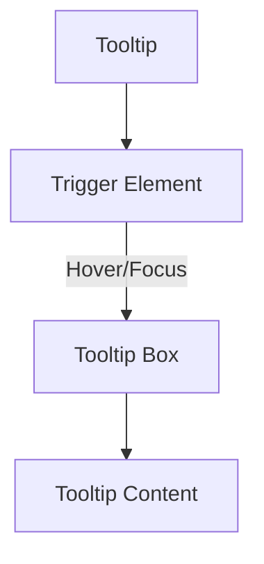

# Tooltip

**_(Also called hover hint, info bubble)_**

## Overview

A **tooltip** is a small popup that provides additional contextual information when a user hovers over, focuses on, or interacts with an element. It helps clarify elements with **icons, buttons, or text snippets** that may not be self-explanatory.

Tooltips should be used to enhance understanding without overwhelming the user interface.

## Use Cases

### When to use:

Use a tooltip when you need to provide **additional context or explanations** without taking up extra space in the UI.

Common use cases include:

- **Clarifying icons or abbreviations** (e.g., a settings cog or currency symbols).
- **Providing additional information** about form fields or table headers.
- **Showing helper text** for complex actions (e.g., "This action is permanent").
- **Explaining disabled elements** when a user cannot interact with them.
- **Providing keyboard shortcuts** when hovering over action buttons.

### When not to use:

- **For critical information** users must read, such as error messages.
- **For content that should remain visible**, like persistent hints or descriptions.
- **When users need to interact** with the tooltip itself.
- **If the tooltip is the only means** of conveying information (accessibility issue).
- **For mobile-first interactions** where hover-based behavior isn’t intuitive.

## Benefits

- **Reduces clutter** by providing contextual information without crowding the UI.
- **Improves user understanding** of complex actions or terminology.
- **Enhances accessibility** when used correctly with keyboard and screen reader support.
- **Provides instant feedback** without disrupting the user’s flow.

## Anatomy



### Component Structure

1. **Trigger Element**

- The interactive element (e.g., button, icon, text) that activates the tooltip.
- Should have aria-describedby linking to the tooltip content.
- Can be activated on hover (mouse), focus (keyboard), or tap (touch devices).

2. **Tooltip Box**

- The container that appears when the tooltip is activated.
- Should be positioned near the trigger element using CSS.
- Should have role="tooltip" for proper accessibility.

3. **Tooltip Content**

- Contains the explanatory text or information.
- Should be short and to the point.
- Should not contain interactive elements (no links or buttons).

## Best Practices

### Content

**Do's ✅**

- **Keep standard tooltips concise**—aim for **one or two sentences** to provide quick, useful context.
- **Use rich tooltips for additional details**—if the tooltip is replacing an extra click (e.g., profile previews, definitions), a longer format may be appropriate.
- **Ensure the tooltip enhances usability** rather than being redundant.
- **Provide useful context** without duplicating label text.
- **Test tooltip placement** to prevent obstruction of key UI elements.

**Don'ts ❌**

- **Avoid tooltips for critical information**—users might miss them.
- **Don’t overuse long tooltips**—if the information is too complex, consider using a popover or [modal](/patterns/content-management/modal) instead.
- **Avoid adding interactive elements** (buttons, links) inside tooltips unless using an accessible popover.
- **Don't rely on tooltips as the only way** to understand an element.

### Accessibility

**Do's ✅**

- **Ensure keyboard accessibility**—tooltips should appear on `focus`.
- **Use `aria-describedby`** on the trigger element to associate it with the tooltip.
- **Provide `role="tooltip"`** for proper screen reader support.
- **Ensure proper contrast** for tooltip text and background.
- **Allow tooltips to remain visible** if users hover over them.

**Don'ts ❌**

- **Don't rely only on hover-based activation**—ensure focus also triggers tooltips.
- **Avoid auto-closing tooltips too quickly**, which may frustrate users.
- **Don't position tooltips in a way that obstructs other content**.

### Visual Design

**Do's ✅**

- **Use subtle animations** (fade-in, fade-out) for smooth appearance.
- **Ensure tooltips have readable font sizes** (at least `14px`).
- **Maintain sufficient padding and spacing** for easy readability.
- **Use arrows or indicators** to clearly point to the related element.

**Don'ts ❌**

- **Avoid excessive delays in showing tooltips**—users should see them instantly.
- **Don't use tooltips that disappear too quickly** before users can read them.
- **Avoid distracting animations** that hinder usability.

### Performance Optimization

**Do's ✅**

- **Lazy-load tooltips** to reduce initial page load impact.
- **Use CSS for animations** (`opacity`, `transform`) instead of JavaScript.
- **Minimize reflows and repaints** when tooltips appear or disappear.

**Don'ts ❌**

- **Avoid excessive event listeners** that degrade performance.
- **Don't trigger tooltips on every mouse movement**—use `mouseenter` instead of `mousemove`.

## Code Examples

### Basic Implementation

```html
<!-- Tooltip Trigger -->
<button aria-describedby="tooltip-example" class="tooltip-trigger">?</button>

<!-- Tooltip -->
<div id="tooltip-example" role="tooltip" class="tooltip-content">
  This is additional information about the element.
</div>
```

## Testing Guidelines

### Functional Testing

**Should ✓**

- [ ] Ensure the tooltip **appears on hover, focus, and touch activation**.
- [ ] Verify the tooltip **disappears when focus is removed** or the user moves the cursor away.
- [ ] Test that tooltips **do not obstruct important content** when displayed.
- [ ] Confirm that tooltips **adapt properly on different screen sizes**.
- [ ] Validate that tooltips **do not break layout or cause visual glitches**.

### Accessibility Testing

**Should ✓**

- [ ] Ensure tooltips are **keyboard accessible** (triggered via `Tab` key).
- [ ] Verify that tooltips are **announced by screen readers** when triggered.
- [ ] Confirm `aria-describedby` **correctly links tooltips to their respective elements**.
- [ ] Check that tooltips **persist long enough** for screen reader users to read.
- [ ] Ensure **sufficient color contrast** between tooltip text and background.
- [ ] Test with `prefers-reduced-motion` enabled to ensure animations are minimized.

### Visual Testing

**Should ✓**

- [ ] Confirm tooltip text is **legible across all screen sizes**.
- [ ] Validate **proper spacing and positioning** of tooltips.
- [ ] Test tooltip animations for **smooth appearance and disappearance**.
- [ ] Ensure tooltips **do not overlap critical UI elements**.
- [ ] Verify tooltips **align properly with their trigger elements**.

### Performance Testing

**Should ✓**

- [ ] Measure tooltip render performance to **avoid jank or slow animations**.
- [ ] Ensure tooltips **lazy-load when necessary** to prevent excessive memory usage.
- [ ] Optimize tooltip animations to **use `opacity` and `transform` for smooth rendering**.
- [ ] Test for **efficient event handling** to avoid performance degradation on repeated interactions.

## Design Tokens

These design tokens follow the [Design Tokens Format](https://design-tokens.github.io/community-group/format/) specification and can be used with various token transformation tools to generate platform-specific variables.

### Tooltip Tokens in DTF Format

```json
{
  "$schema": "https://design-tokens.org/schema.json",
  "tooltip": {
    "background": { "value": "{color.gray.900}", "type": "color" },
    "textColor": { "value": "{color.white}", "type": "color" },
    "padding": { "value": "0.5rem", "type": "dimension" },
    "borderRadius": { "value": "4px", "type": "borderRadius" },
    "animationDuration": { "value": "150ms", "type": "duration" },
    "maxWidth": { "value": "200px", "type": "dimension" },
    "arrowSize": { "value": "6px", "type": "dimension" },
    "offset": { "value": "8px", "type": "dimension" },
    "shadow": { "value": "{shadow.md}", "type": "shadow" }
  }
}
```

## Resources

### Articles

- [Tooltip - Nielsen Norman Group](https://www.nngroup.com/articles/tooltip-guidelines/)
- [Designing better tooltips for improved UX - LogRocket Blog](https://blog.logrocket.com/ux-design/designing-better-tooltips-improved-ux/)

### Documentation

- [Tooltip Pattern](https://www.w3.org/WAI/ARIA/apg/patterns/tooltip/)

### Libraries

- [Tooltip - shadcn/ui](https://ui.shadcn.com/docs/components/tooltip)
- [Tooltip - Origin UI](https://originui.com/tooltip)
