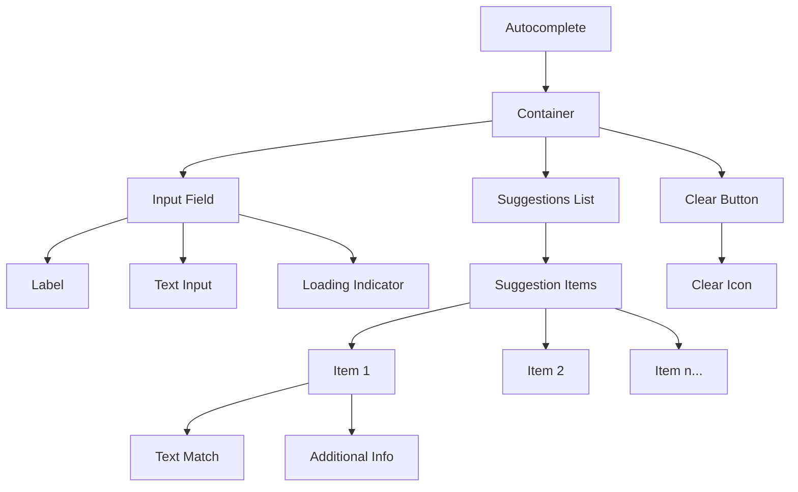

import { BrowserSupport } from "@app/_components/browser-support";

# Autocomplete

**_(Also called Autosuggest)_**

## Overview

The **autocomplete** is an interactive input component that helps users quickly find and select values from a predefined list of options as they type.

They combine the flexibility of [text input](/patterns/forms/text-field) with dropdown-style selection, providing suggestions that match the user's input in real-time. This pattern reduces errors, speeds up data entry, and improves the overall form completion experience.

## Use Cases

### When to use:

- When users need to select from a large set of predefined options (e.g., country selection, airport codes)
- When you want to help users find and select options more quickly than scrolling through a long dropdown
- When you want to reduce errors by guiding users to valid input options
- When the input has a finite set of valid responses that are known in advance
- When you want to combine free text input with suggestion functionality

### When not to use:

- When there are fewer than 10 options (use a standard dropdown/select instead)
- When users need to enter completely free-form text without restrictions
- When all options need to be visible at once for comparison
- When network latency could significantly delay suggestion results
- When the input field requires exact, verbatim text entry (like passwords)

### Common scenarios and examples

- **Searching for products** in an e-commerce catalog
- **Entering city names** for travel or weather applications
- **Looking up user or contact names** in a messaging or collaboration tool

## Benefits

- **Speeds up data entry** by narrowing down possible options in real-time
- **Reduces user frustration** and guesswork by guiding them to valid options
- **Minimizes mistakes** and typos, as suggestions can be confirmed or chosen from a list

## Anatomy

### Component Structure



1. **Container**

- Wraps the entire autocomplete area, including the input and dropdown
- Handles positioning, sizing, and possible floating layers for the suggestions

2. **Input**

- The text field where users type their query
- Provides real-time updates and triggers suggestion fetching

3. **Label**

- Optional text label describing the input’s purpose
- Provides clarity for screen readers and visible context for users

4. **Clear Button**

- Allows users to quickly clear the input field
- Often represented by an “X” or “✕” icon

## Best Practices

### Content

**Do's ✅**

- Provide a descriptive label that indicates the purpose of the Autocomplete field
- Use placeholder text to show example input (e.g., "Start typing a country...")

**Don'ts ❌**

- Don’t rely on placeholder text as a replacement for a label
- Don’t make your suggestions so vague that it’s unclear what the user is selecting

### Accessibility

**Do's ✅**

- Use `aria-controls`, `aria-autocomplete`, and other relevant ARIA attributes to help screen readers
- Include a visually hidden label or descriptive text if you rely on an icon-only clear button
- Add a debounce delay to the input field to avoid triggering a fetch request too often

**Don'ts ❌**

- Don’t remove focus outlines without providing alternative focus indicators
- Don’t assume all users can use a mouse; ensure keyboard navigation works properly

### Visual Design

**Do's ✅**

- Keep the suggestion list clearly delineated, with sufficient contrast and spacing
- Highlight hovered or focused suggestion items with a distinct visual state

**Don'ts ❌**

- Don’t display an overly large list of suggestions (limit it to a reasonable number), use a scroll bar to allow users to scroll through the list.
- Don’t create a cluttered or confusing interface by mixing too many design elements

### Layout & Positioning

**Do's ✅**

- Position the dropdown list immediately below the input field
- Ensure suggestions list appears in front of other page elements when open

**Don'ts ❌**

- Don’t hide the list behind overlays or modals
- Don’t move the dropdown to a completely different area away from the input

## Code Examples

### Basic Implementation

```html
<!-- Basic Autocomplete Markup -->
<div>
  <label for="autocompleteInput">Search for an option</label>
  <input
    type="text"
    id="autocompleteInput"
    name="autocompleteInput"
    aria-autocomplete="list"
    aria-controls="suggestions-list"
    autocomplete="off"
    placeholder="Type to search..."
  />
  <button type="button" aria-label="Clear input">✕</button>
  <ul id="suggestions-list" role="listbox">
    <!-- Dynamically generated suggestions go here -->
  </ul>
</div>
```

## Design Tokens

These design tokens follow the [Design Tokens Format](https://design-tokens.github.io/community-group/format/) specification and can be used with various token transformation tools to generate platform-specific variables.

### Autocomplete Tokens in DTF Format

```json
{
  "$schema": "https://design-tokens.org/schema.json",
  "Autocomplete": {
    "container": {
      "borderRadius": {
        "value": "0.25rem",
        "type": "dimension"
      },
      "background": {
        "value": "{color.white}",
        "type": "color"
      }
    },
    "input": {
      "fontSize": {
        "value": "1rem",
        "type": "dimension"
      },
      "padding": {
        "value": "0.5rem",
        "type": "dimension"
      }
    },
    "suggestionsList": {
      "maxHeight": {
        "value": "200px",
        "type": "dimension"
      },
      "background": {
        "value": "{color.gray.50}",
        "type": "color"
      },
      "itemHoverBg": {
        "value": "{color.gray.100}",
        "type": "color"
      }
    }
  }
}
```

## Resources

### Articles

- [9 UX Best Practice Design Patterns for Autocomplete Suggestions](https://baymard.com/blog/autocomplete-design) by Baymard Institute
- [Best Practices: Designing autosuggest experiences](https://uxmag.com/articles/best-practices-designing-autosuggest-experiences)

## Documentation

- [WAI-ARIA: Combobox Pattern](https://www.w3.org/WAI/ARIA/apg/patterns/combobox/)
