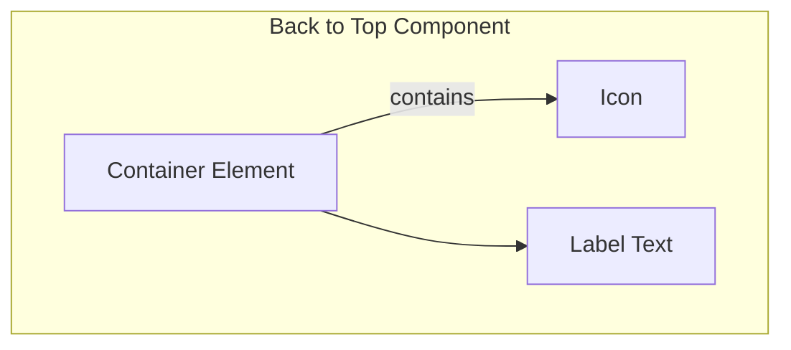

import { BrowserSupport } from "@app/_components/browser-support";
import { BuildEffort } from "@app/_components/build-effort";
import { FaqStructuredData } from "@app/_components/faq-structured-data";

# Back to Top

## Overview

**Back to Top** provides users a quick way to return to the top of the page, especially when they have scrolled through lengthy or [infinite content](/patterns/navigation/infinite-scroll).

Commonly seen as a floating button or link at the bottom-right corner, it improves navigation and overall user experience.

<BuildEffort
  level="low"
  description="Uses a simple anchor link or JavaScript scroll function. Requires smooth scrolling and proper visibility toggling."
/>

## Use Cases

### When to use:

Use **Back to Top** when you need to **help users quickly return to the top of a long page without excessive scrolling**.

**Common scenarios include:**

- On long or content-heavy pages where the user is likely to scroll far down
- When quick navigation back to the header or navigation menu is essential
- In blogs, documentation pages, or e-commerce category listings with extensive scroll

### When not to use:

- On very short pages where scrolling is minimal or unnecessary
- If your layout or design already provides persistent navigation at the bottom (navigation at the bottom) or top (sticky menus)
- When infinite scrolling is not used (or scrolling is minimal and not an issue)

### Common scenarios and examples

- Long editorial content (articles, guides, and blog posts)
- Content hubs or portals with extensive listings
- FAQ pages with collapsible or expanded sections
- Dashboards or analytics pages containing large data tables
- Infinite scrolling experiences (e.g., social feeds) to let users quickly jump to the top

## Benefits

- Enhances user navigation and usability on long pages
- Improves overall site accessibility by giving a direct route to main navigation
- Reduces scrolling fatigue for mobile users
- Helps maintain a clean UI by hiding controls when not needed, then showing them once the user scrolls down

## Drawbacks

- **Not always necessary** – If pages are short, the button may be redundant.
- **Can be disruptive** – Sudden jumps to the top may disorient users.
- **Visibility control** – Requires logic to appear only after a certain scroll depth.
- **Potential for hidden functionality** – Users may not notice it or understand its purpose.
- **Inconsistent placement** – Can interfere with floating UI elements if not positioned carefully.

## Anatomy



### Component Structure

1. **Container**

- A clickable element (usually a button) that triggers scrolling to the top
- Often positioned as a floating element on desktop and mobile
- Manages focus states and accessibility attributes

2. **Icon (Optional)**

- Conveys the action of going to the top (e.g., an up arrow)
- Should be clear and universally recognized
- Must be sized for good readability (16×16px or 24×24px are common)
- Color should contrast with the background

3. **Label Text (Optional)**

- Helps clarify the action for screen readers or when the icon alone isn't sufficient
- Typically hidden for visually oriented users, but available to assistive technology
- Could be visible if design requires additional clarity

4. **Visual States**

- **Default**: Visible when the user scrolls past a certain threshold
- **Hover**: Provides a visual cue (e.g. change in background color)
- **Active**: Pressed or clicked state
- **Focus**: Outline or highlight for keyboard navigation
- **Hidden**: Button is invisible or removed when the user is near the top of the page

#### **Summary of Components**

| Component     | Required? | Purpose                                                     |
| ------------- | --------- | ----------------------------------------------------------- |
| Container     | ✅ Yes    | Clickable element that triggers scrolling to the top.       |
| Icon          | ❌ No     | Visual indicator (e.g., an up arrow) for quick recognition. |
| Label Text    | ❌ No     | Provides additional clarity, especially for screen readers. |
| Visual States | ✅ Yes    | Defines interaction states (hover, active, focus, hidden).  |

## Best Practices

### Content

**Do's ✅**

- Show a clear visual indicator (usually an up arrow icon)
- Display the button only after the user scrolls a predetermined distance
- Hide it when the user is near the top of the page
- Use an accessible label (e.g., `aria-label="Back to top"`) if the text is omitted

**Don'ts ❌**

- Don't make it permanently visible for short pages—it can be distracting
- Don't use vague icons or labels (e.g., a random symbol without context)
- Don't crowd the button with other floating elements
- Don't rely solely on color for states—use shape or text changes if possible

### Accessibility

**Do's ✅**

- Ensure the button is keyboard-focusable and can be activated via Enter or Space
- Provide sufficient color contrast between the button and its background
- Use an appropriate aria-label or descriptive text for screen readers
- Manage focus: after scrolling up, keep the user informed or maintain logical focus

**Don'ts ❌**

- Don't hide it behind complex interactions or animations
- Don't place it in a position that overlaps other important UI elements
- Don't disable focus outlines without providing an alternative focus style

### Visual Design

**Do's ✅**

- Use a large enough icon or label for quick recognition (minimum 16×16px icon)
- Maintain consistent styling with the rest of your UI (color, shape, corners)
- Incorporate hover/focus states that match your design system guidelines
- Place it in a fixed position (often bottom-right) for easy access

**Don'ts ❌**

- Don't block important content with a floating button
- Don't make the button so small that it's hard to tap on mobile
- Don't use misleading icons (ensure the arrow is pointing up)

### Mobile & Touch Considerations

**Do's ✅**

- Use a minimum touch target of 44×44px
- Keep it within thumb-friendly zones at the bottom of the screen
- Make sure it doesn't overlap interactive elements (navigation drawers, chat bubbles)
- Add any necessary spacing from device edges to avoid accidental swipes

**Don'ts ❌**

- Don't place it in corners difficult to reach on large screens
- Don't rely on hover states for mobile users—visual changes should appear on tap/press
- Don't crowd the bottom area with too many floating icons

### Layout & Positioning

**Do's ✅**

- Fix its position to the viewport so it remains visible during scrolling
- Use consistent margin or spacing from edges for aesthetic alignment
- Keep in mind other fixed UI elements such as sticky footers or chat widgets

**Don'ts ❌**

- Don't move it around the page as the user scrolls
- Don't tie it to an element that scrolls out of view

## Code Examples

### Basic Implementation (HTML + minimal JS)

```html
<button type="button" class="js-back-to-top" aria-label="Back to top" hidden>
  ↑
</button>

<script>
  // Basic scroll logic
  const backToTopBtn = document.querySelector(".js-back-to-top");
  const scrollThreshold = 300; // in px

  function backToTop() {
    if (window.scrollY > scrollThreshold) {
      backToTopBtn.removeAttribute("hidden");
    } else {
      backToTopBtn.setAttribute("hidden", "");
    }
  }

  function scrollToTop() {
    window.scrollTo({ top: 0, behavior: "smooth" });
  }

  document.addEventListener("scroll", toggleBackToTop);
  backToTopBtn.addEventListener("click", scrollToTop);
</script>
```

## Accessibility

### ARIA Attributes

**Required ARIA attributes:**

- Use `aria-label="Back to top"` if using icon-only buttons
- Use `aria-hidden="true"` on the icon if text is included for screen readers
- Use `hidden` or `aria-hidden="true"` to hide the button when not needed

### Screen Reader Support

```html
<!-- Icon-only button with ARIA label -->
<button type="button" aria-label="Back to top" hidden>
  <svg aria-hidden="true">
    <use href="#icon-arrow-up" />
  </svg>
</button>
```

### Keyboard Navigation

- Must be focusable and activated with both Enter and Space keys
- The user should be able to tab to it if it's visible
- Focus outlines should remain intact for accessibility
- Maintaining focus after click is optional; the scroll event is generally the key feedback

## Testing Guidelines

### Functional Testing

**Should ✓**

- [ ] Show the button after scrolling a set distance
- [ ] Smoothly scroll to top when clicked
- [ ] Hide the button when the user is near the top
- [ ] Maintain correct visible/hidden states on page load and resize
- [ ] Prevent overlapping interactions with other floating components

Accessibility Testing

**Should ✓**

- [ ] Have proper ARIA labels for icon-only implementations
- [ ] Be operable with keyboard (Enter, Space)
- [ ] Maintain a visible focus state when tabbed to
- [ ] Provide enough contrast between button and background
- [ ] Respect user motion preferences (reduce motion if system preferences are set)

Visual Testing

**Should ✓**

- [ ] Float consistently at the chosen position across different viewport sizes
- [ ] Show correct hover, focus, and active states
- [ ] Remain unobtrusive yet visible
- [ ] Align with other design elements and not overlap key UI components

Performance Testing

**Should ✓**

- [ ] Not introduce layout shifts when appearing or disappearing
- [ ] Handle rapid scrolling up/down events effectively
- [ ] Support smooth animations without jank
- [ ] Remain performant on mobile devices

## Browser Support

<BrowserSupport features={["css.position.fixed", "window.api.scrollto"]} />

## Design Tokens

These design tokens follow the [Design Tokens Format](https://design-tokens.github.io/community-group/format/) specification and can be used with various token transformation tools to generate platform-specific variables.

### Button Tokens in DTF Format

```json
{
  "$schema": "https://design-tokens.org/schema.json",
  "backToTop": {
    "position": {
      "right": { "value": "1rem", "type": "dimension" },
      "bottom": { "value": "1rem", "type": "dimension" }
    },
    "sizing": {
      "width": { "value": "2.5rem", "type": "dimension" },
      "height": { "value": "2.5rem", "type": "dimension" },
      "touchTarget": {
        "value": "2.75rem",
        "type": "dimension",
        "description": "44px minimum touch target"
      }
    },
    "icon": {
      "size": { "value": "1.25rem", "type": "dimension" }
    },
    "border": {
      "radius": { "value": "50%", "type": "dimension" },
      "width": { "value": "0px", "type": "dimension" }
    },
    "colors": {
      "background": {
        "default": { "value": "{color.gray.200}", "type": "color" },
        "hover": { "value": "{color.gray.300}", "type": "color" },
        "active": { "value": "{color.gray.400}", "type": "color" }
      },
      "icon": {
        "default": { "value": "{color.gray.900}", "type": "color" }
      }
    },
    "states": {
      "focusRing": {
        "width": { "value": "2px", "type": "dimension" },
        "offset": { "value": "2px", "type": "dimension" },
        "color": { "value": "{color.primary.200}", "type": "color" }
      }
    }
  }
}
```

## Frequently Asked Questions

<FaqStructuredData
  items={[
    {
      question: "What is a 'Back to Top' button?",
      answer:
        "A 'Back to Top' button is a user interface element that allows users to quickly return to the top of a webpage without manually scrolling, enhancing navigation on long pages.",
    },
    {
      question: "When should I use a 'Back to Top' button?",
      answer:
        "Implement a 'Back to Top' button on pages that require significant scrolling, typically more than two screens of content. This feature is especially beneficial for mobile users and those with accessibility needs.",
    },
    {
      question: "Where should the 'Back to Top' button be placed?",
      answer:
        "The button is typically positioned in the bottom right corner of the page, where users expect to find it. This placement keeps it accessible yet unobtrusive.",
    },
    {
      question: "How can I make a 'Back to Top' button accessible?",
      answer:
        "Ensure the button is keyboard navigable by using a standard `<button>` element, provide a descriptive label like 'Back to Top', and implement visible focus indicators for users navigating via keyboard.",
    },
    {
      question:
        "What are the best practices for designing a 'Back to Top' button?",
      answer:
        "Use clear labeling, maintain a consistent position, ensure the button is appropriately sized for both desktop and mobile devices, and avoid covering important content. The button should appear after users have scrolled down a significant portion of the page.",
    },
  ]}
/>

## Resources

### Articles

- [Back-to-Top Button Design Guidelines](https://www.nngroup.com/articles/back-to-top/)
- [Scroll to Top: Does it Need to be Accessible?](https://www.digitala11y.com/scroll-to-top-does-it-need-to-be-accessible/)
