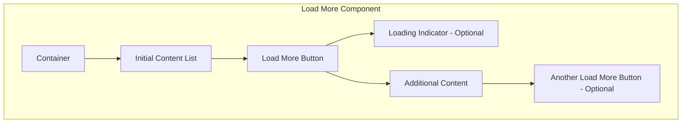

import { BuildEffort } from "@app/_components/build-effort";
import { FaqStructuredData } from "@app/_components/faq-structured-data";

# Load More

## Overview

The **Load More** pattern allows users to request additional content dynamically rather than loading everything upfront. It enhances performance and user experience by reducing initial page load times while providing seamless access to more content when needed.

<BuildEffort
  level="medium"
  description="Requires dynamic content loading, state management, accessibility considerations (keyboard navigation, `aria-live` updates), and performance optimizations. The button should be removed when all content is loaded."
/>

## Use Cases

### When to use:

Use this pattern when you want users to progressively explore content at their own pace without overwhelming them with too many options at once. Unlike infinite scrolling, "Load More" provides clear control over content retrieval and allows users to consciously decide when to view more items.

To improve usability, ensure that the "Load More" button is **removed when all content is loaded** or updated to indicate that no additional items are available (e.g., **"No More Results"**).

**Common scenarios include:**

- When displaying large lists of content (e.g., news feeds, product listings)
- To improve page performance by loading only a subset of data initially
- When users are likely to browse progressively rather than needing all content at once
- To provide an alternative to infinite scrolling, offering more control over content loading

### When not to use:

- When the full content list is small enough to load upfront without performance concerns
- If users need to compare multiple items at once ([pagination](/patterns/navigation/pagination) may be a better alternative)
- When real-time updates or continuous data streaming is required

### Common scenarios and examples

- **E-commerce**: Loading additional products in a grid or list
- **News or blog feeds**: Expanding more articles dynamically
- **Social media feeds**: Loading additional posts without overwhelming users
- **Search results**: Fetching more results upon user request

## Benefits

- **Improves page performance** by reducing initial data load
- **Gives users control** over content consumption, reducing cognitive overload
- **Enhances accessibility** compared to infinite scrolling, ensuring users don't lose track of their position
- **Works well with various devices** by enabling controlled data retrieval
- **Enables footer access** by allowing users to reach the page's footer and access secondary links like return policies, shipping information, and contact details
- **Prevents unnecessary interactions** by **removing the "Load More" button once all content has been loaded** or replacing it with a message like **"No More Results"**.
- **Minimizes layout shifts** by ensuring that newly loaded content seamlessly appears without affecting user position.

## Drawbacks

- **User Effort** – Requires users to take action to reveal more content instead of a seamless experience.
- **Potentially Hidden Content** – Users may not realize more content is available if the button isn't clearly visible.
- **Disrupted Flow** – Clicking **Load More** can break user immersion compared to continuous scrolling.
- **Inconsistent Navigation** – Can make it harder for users to return to previously loaded sections if not implemented correctly.
- **SEO Challenges** – Search engines may not always index dynamically loaded content unless handled properly.
- **Accessibility Concerns** – Requires careful ARIA implementation to ensure screen readers announce newly loaded content.
- **Performance Overhead** – Multiple content fetch requests can impact performance if not optimized properly.

## Anatomy



### Component Structure

1. **Container**

   - Wraps the entire load more component.
   - Ensures content is properly structured and styled.

2. **Initial Content List**

   - Displays a **limited number of items** to prevent overwhelming users.
   - Defines the default **starting state** before additional content is loaded.

3. **Load More Button**

   - The primary trigger for **loading additional content**.
   - Should provide **clear affordance** that more content is available.
   - May include **ARIA attributes** to indicate loading state.

4. **Loading Indicator (Optional)**

   - Provides **visual feedback** that new content is being fetched.
   - Can be a **spinner, progress bar, or skeleton loader**.

5. **Additional Content**

   - The **newly loaded items** that appear after clicking "Load More".
   - Should integrate **seamlessly** with the initial content list.

6. **Another Load More Button (Optional)**
   - Appears **if more content is available after the first load**.
   - Helps users **incrementally explore content** without scrolling endlessly.

#### **Summary of Components**

| Component                    | Required? | Purpose                                                      |
| ---------------------------- | --------- | ------------------------------------------------------------ |
| **Container**                | ✅ Yes    | Wraps the content that will load more items.                 |
| **Initial Content List**     | ✅ Yes    | Displays a limited set of items to avoid overwhelming users. |
| **Load More Button**         | ✅ Yes    | Allows users to manually fetch more content.                 |
| **Loading Indicator**        | ❌ No     | Shows progress while loading more items.                     |
| **Additional Content**       | ✅ Yes    | The dynamically inserted content after clicking "Load More." |
| **Another Load More Button** | ❌ No     | Appears if further content can still be loaded.              |

## Best Practices

### Content

**Do's ✅**

- Clearly indicate that more content is available and can be loaded.
- Use concise and meaningful labels like **"Load More"**, **"Show More"**, or **"See More Results"**.
- Ensure a smooth transition when new content loads.

**Don'ts ❌**

- Avoid vague labels like **"Click Here"**.
- Don't load excessive content at once; keep it manageable.
- Don't disrupt the existing layout when inserting new content.

### Accessibility & UX

**Do's ✅**

- Ensure the **Load More** button is keyboard accessible (`tab` and `enter` keys).
- Announce new content to screen readers (`aria-live="polite"`).
- Provide feedback (e.g., loading indicators) to inform users of content retrieval.
- **Maintain keyboard focus** – After clicking "Load More," focus should shift **to the newly loaded content** rather than returning to the button. This ensures a logical navigation flow.
- **Announce new content to assistive technologies** – Use `aria-live="polite"` to notify screen reader users that additional items have been loaded.

**Don'ts ❌**

- Don't remove focus from the **Load More** button after clicking it (don't use `disabled`)
- Avoid infinite scrolling without a **Load More** option as a fallback.
- Don't rely solely on color for action buttons (ensure contrast and readable text).

### Visual Design

**Do's ✅**

- Place the **Load More** button prominently below existing content.
- Ensure clear visual feedback when new content loads (e.g., animations, progress indicators).
- Maintain consistent spacing and alignment with existing content.

**Don'ts ❌**

- Don't make the button too small or difficult to tap on mobile devices.
- Avoid sudden layout shifts when loading new content.

### Layout & Positioning

**Do's ✅**

- Place the **Load More** button at logical breakpoints in the content.
- Ensure loaded content appears immediately following the existing items.
- Retain the user's position in the list after loading more content.

**Don'ts ❌**

- Don't insert new content above the user's current view unless explicitly requested.
- Avoid loading content off-screen without visual confirmation.

### Common Mistakes & Anti-Patterns

#### No Visual Feedback After Clicking "Load More"

**❌ What’s Wrong?**

Users may think the button is broken if there’s no immediate sign of progress after they click.

**How to Fix It?**
Show a **spinner or loading animation** and possibly disable the button until the new content is fully loaded.

---

#### Loading Too Many Items at Once

**❌ What’s Wrong?**

Fetching a large batch of content can slow performance, cause layout shifts, and overwhelm users.

**How to Fix It?**
Load **smaller chunks** (e.g., 10–20 items per click). Provide incremental updates rather than a single large data fetch.

---

#### Forcing Users to Click "Load More" Too Often

**❌ What’s Wrong?**

Having users repeatedly click “Load More” leads to frustration and makes the page feel unresponsive.

**How to Fix It?**
Use **auto-loading on scroll** after a few manual loads, or at least increase the batch size once you detect high engagement.

---

#### No Clear End of Content Indicator

**❌ What’s Wrong?**

Users can’t tell when they’ve reached the final items, potentially clicking “Load More” with no result.

**How to Fix It?**
Display a **“You’ve reached the end”** message or hide the button entirely once there’s no more data.

---

#### Not Accessible via Keyboard (Accessibility)

**❌ What’s Wrong?**

If the “Load More” button isn’t focusable or doesn’t respond to keyboard events, users relying on keyboard navigation can’t load new content.

**How to Fix It?**
Ensure the button is a proper, focusable element (e.g., `<button>`). Confirm you can press `Tab` to focus and `Enter/Space` to trigger loading.

---

#### No ARIA Updates for New Content (Accessibility)

**❌ What’s Wrong?**

Screen reader users may not realize new items appeared if there’s no announcement that content was added to the page.

**How to Fix It?**
Wrap your list in a container with `role="region"` or use an `aria-live="polite"` area. Update the live region or add a brief “New content loaded” announcement after each batch is rendered.

---

#### Insufficient Visual Contrast or Feedback (Accessibility)

**❌ What’s Wrong?**

If the “Load More” button is low contrast or the loading indicator is hard to see (e.g., small spinner on a cluttered background), low-vision users may struggle to notice it.

**How to Fix It?**
Provide a **high-contrast** button style and a **clear, visible** loading indicator (spinner or progress bar) that stands out from surrounding content.

## Tracking

Tracking "Load More" interactions helps measure how users navigate through content, whether they prefer incremental loading over pagination, and how deep they engage with the content. By analyzing user behavior, we can optimize when and how "Load More" is implemented.

### Key Tracking Points

Each "Load More" interaction provides valuable insights into user behavior. Below are the key events that should be tracked:

| **Event Name**           | **Description**                                                                           | **Why Track It?**                                                            |
| ------------------------ | ----------------------------------------------------------------------------------------- | ---------------------------------------------------------------------------- |
| `load_more.view`         | When the "Load More" button enters the viewport.                                          | Determines visibility and whether users see the option to load more content. |
| `load_more.click`        | When a user clicks the "Load More" button.                                                | Measures engagement and intent to see additional content.                    |
| `load_more.auto_trigger` | When more content loads automatically without user action (e.g., lazy loading on scroll). | Helps compare manual clicks vs. auto-triggered loads.                        |
| `load_more.depth`        | The number of times a user loads more content in one session.                             | Indicates how deep users are willing to explore.                             |
| `load_more.scroll_usage` | If infinite scrolling is enabled, tracks when users reach the "Load More" trigger area.   | Helps compare scrolling behavior vs. button clicks.                          |

### Event Payload Structure

To ensure consistent tracking, here’s a recommended event format:

```json
{
  "event": "load_more.click",
  "properties": {
    "load_more_id": "search_results",
    "current_page": 1,
    "next_page": 2,
    "total_pages": 5
  }
}
```

### Key Metrics to Analyze

Once tracking is in place, the following metrics provide actionable insights:

- **Load More Click Rate** → Percentage of users who click the "Load More" button.
- **Auto-Trigger Rate** → Percentage of users who load more content automatically via scrolling (if enabled).
- **Average Load More Depth** → Number of times users load more content in a session.
- **Completion Rate** → Percentage of users who reach the final batch of content.
- **Scroll vs. Click Engagement** → If both options exist, measures user preference for scrolling vs. manually clicking "Load More."

### Insights & Optimization Based on Tracking

By analyzing tracking data, we can optimize the "Load More" experience:

- 🚨 **Low Load More Click Rate?**
  → Users may not notice or find the "Load More" button unnecessary.
  **Optimization:** Improve visibility, adjust styling, or test auto-loading on scroll.

- ⏳ **High Auto-Trigger Rate?**
  → Users rely more on automatic loading rather than clicking.
  **Optimization:** Consider fully replacing "Load More" with infinite scrolling or adding a "Show More" summary before triggering more content.

- 🔄 **Low Average Load More Depth?**
  → Users stop after one or two loads.
  **Optimization:** Ensure the first few results are engaging enough to encourage further exploration.

- 🔁 **Low Completion Rate?**
  → Users rarely reach the final batch of content.
  **Optimization:** Test reducing content chunk sizes per load or adding preview indicators (e.g., "Showing 20 of 100 results").

- ⚙️ **High Scroll vs. Click Engagement?**
  → Users prefer scrolling over clicking the button.
  **Optimization:** Consider transitioning to infinite scrolling but ensure good performance and usability.

By continuously monitoring these metrics, we can refine the "Load More" pattern, ensuring users efficiently navigate through content without unnecessary friction.

## Accessibility

### ARIA Attributes

**Required ARIA attributes:**

- Use `aria-controls` to associate the **Load More** button with the content being updated.
- Announce loading states with `aria-live="polite"`.
- If the button is removed after loading all content, update its `aria-label` to indicate that no more content is available.

### Screen Reader Support

**Implementation considerations:**

- Users should be informed when new content is added.
- Ensure proper tab focus order when new items appear.
- Use accessible button elements (`<button>` instead of `<div>` or `<span>`).

## SEO

- Ensure content loaded via **Load More** is indexable by search engines.
- Use progressive enhancement to allow content visibility even if JavaScript is disabled.
- Provide a paginated alternative if necessary for deep content navigation.
- Ensure that dynamically loaded content is **crawlable by search engines** by using progressive enhancement techniques or **server-side rendering**.
- If SEO visibility is a priority, consider **implementing paginated URLs** as a fallback to allow search engines to index all content properly.

## Testing Guidelines

### Functional Testing

**Should ✓**

- Verify that the **Load More** button successfully loads additional content when clicked.
- Ensure **smooth transitions** and that new content is **visually distinct** without disrupting the layout.
- Test **multiple clicks on the button** to confirm continuous content retrieval works as expected.
- Ensure the button **disables or disappears** when all content has been loaded.
- Validate that clicking **Load More** does not cause a page refresh or unexpected navigation.
- Confirm that the **user remains in the same scroll position** after loading more content.
- Ensure newly loaded content appears **sequentially** in the correct order.
- Check for **error handling**—simulate network failures to confirm users receive an appropriate message.

---

### Accessibility Testing

**Should ✓**

- Verify that the **Load More** button is fully keyboard accessible\*\* (`Tab` to navigate, `Enter` to activate).
- Ensure that new content is **announced to screen readers** using `aria-live="polite"`.
- Validate that **focus moves to the newly loaded content** rather than back to the button.
- Check that the button has **proper contrast** and is easily readable.
- Confirm that screen readers announce when **no more content is available** after the last load.
- Ensure that `aria-controls` links the button to the dynamically updated content.
- Verify that users can **navigate through the loaded content** using standard keyboard interactions.

---

### Performance Testing

**Should ✓**

- Ensure that **each content load request is optimized** to avoid unnecessary data retrieval.
- Check that **lazy-loading techniques** prevent excessive memory usage.
- Test with **large datasets** to confirm that performance remains smooth.
- Validate that **content loading does not block interactions** with other page elements.
- Measure **network requests and response times** to ensure efficient API calls.
- Check that **animations and transitions** remain smooth without jank.
- Verify that **multiple Load More interactions do not degrade performance** over time.

---

### SEO Testing

**Should ✓**

- Confirm that dynamically loaded content is **indexable by search engines** (e.g., using server-side rendering or progressive enhancement).
- Check that search engines can **crawl and discover** all content, even if JavaScript is disabled.
- Ensure that **important content is not hidden behind JavaScript-only interactions**.
- Run Lighthouse or Google's Mobile-Friendly Test to ensure SEO best practices are met.
- Test the page with JavaScript disabled to confirm that at least some content remains visible.

---

### User Experience Testing

**Should ✓**

- Observe user behavior to determine if the **Load More button is easily discoverable**.
- Ensure that the button **clearly communicates** its function (e.g., "Load More" vs. "Show More Results").
- Test on **mobile devices** to verify tap targets are large enough.
- Confirm that **loading indicators** provide clear feedback during content retrieval.
- Ensure that **content loads fast enough** to avoid user frustration.
- Validate that **users do not get lost** when additional content is inserted.

---

### Edge Case Testing

**Should ✓**

- Simulate a **slow network connection** to test how loading delays affect usability.
- Check behavior when **no more content is available**—the button should be removed or updated.
- Verify how the component behaves if the **API fails** or returns an error.
- Test **rapid multiple clicks** on the button to ensure proper request handling.
- Ensure **back navigation retains loaded content**, preventing users from losing progress.
- Confirm the **component adapts to different screen sizes and orientations**.

## Related Patterns

Consider these related patterns when implementing **Load More**:

- [Infinite Scroll](/patterns/navigation/infinite-scroll) - Automatically loads content as users scroll.
- [Pagination](/patterns/navigation/pagination) - A structured way to navigate large sets of content.
- [Loading Indicator](/patterns/user-feedback/loading-indicator) - Displays feedback when content is loading.

## Frequently Asked Questions

<FaqStructuredData
  items={[
    {
      question: "What is the 'Load More' pattern in web design?",
      answer:
        "The 'Load More' pattern is a UI component that allows users to load additional content on demand, reducing initial page load times and improving content discoverability. It is often compared with [Infinite Scroll](/patterns/navigation/infinite-scroll), where content loads automatically, and [Pagination](/patterns/navigation/pagination), where users navigate between predefined pages.",
    },
    {
      question: "When should I use the 'Load More' pattern?",
      answer:
        "Use the 'Load More' pattern when users need control over content loading without being overwhelmed by an excessive amount of data at once. It is ideal for media galleries, search results, and feeds where users prefer manual control rather than automatic loading like in [Infinite Scroll](/patterns/navigation/infinite-scroll).",
    },
    {
      question:
        "How does 'Load More' compare to infinite scrolling and pagination?",
      answer:
        "'Load More' provides a middle ground between [Infinite Scroll](/patterns/navigation/infinite-scroll), which continuously loads content as users scroll, and [Pagination](/patterns/navigation/pagination), which separates content into discrete pages. 'Load More' allows users to explore additional content without navigating away from their current view.",
    },
    {
      question: "What are the benefits of using the 'Load More' pattern?",
      answer:
        "Benefits include improved user control, better accessibility, and reduced initial page load times. Unlike [Infinite Scroll](/patterns/navigation/infinite-scroll), it allows users to reach the footer and navigate more easily.",
    },
    {
      question: "What are the drawbacks of the 'Load More' pattern?",
      answer:
        "One downside is that search engines may struggle to index content hidden behind a 'Load More' button. A hybrid approach that combines 'Load More' with [Pagination](/patterns/navigation/pagination) can sometimes be a better alternative for SEO purposes.",
    },
    {
      question: "How can I implement the 'Load More' pattern accessibly?",
      answer:
        "Ensure the button is keyboard accessible and labeled correctly. Similar to [Accordion](/patterns/content-management/accordion), you should use ARIA attributes such as `aria-expanded` to indicate state changes when content loads.",
    },
    {
      question:
        "What are some best practices for designing a 'Load More' button?",
      answer:
        "Use a clear, descriptive label such as 'Load More' or 'Show More'. Ensure the button provides immediate feedback when clicked, similar to [Button](/patterns/forms/button) components.",
    },
  ]}
/>
