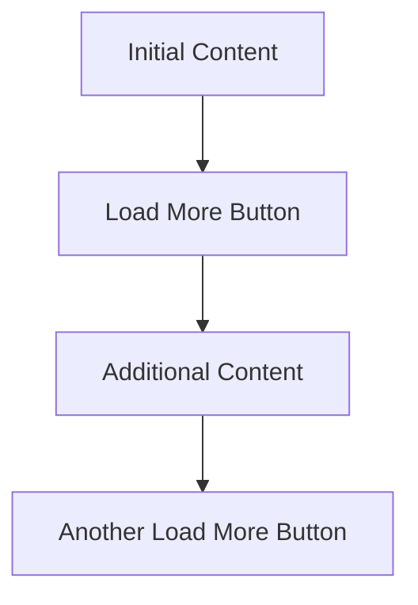

import { BuildEffort } from "@app/_components/build-effort";

# Load More

## Overview

The **Load More** pattern allows users to request additional content dynamically rather than loading everything upfront. It enhances performance and user experience by reducing initial page load times while providing seamless access to more content when needed.

<BuildEffort
  level="medium"
  description="Requires dynamic content loading, state management, accessibility considerations (keyboard navigation, `aria-live` updates), and performance optimizations. The button should be removed when all content is loaded."
/>

## Use Cases

### When to use:

Use this pattern when you want users to progressively explore content at their own pace without overwhelming them with too many options at once. Unlike infinite scrolling, "Load More" provides clear control over content retrieval and allows users to consciously decide when to view more items.

To improve usability, ensure that the "Load More" button is **removed when all content is loaded** or updated to indicate that no additional items are available (e.g., **"No More Results"**).

Common use cases include:

- When displaying large lists of content (e.g., news feeds, product listings)
- To improve page performance by loading only a subset of data initially
- When users are likely to browse progressively rather than needing all content at once
- To provide an alternative to infinite scrolling, offering more control over content loading

### When not to use:

- When the full content list is small enough to load upfront without performance concerns
- If users need to compare multiple items at once (pagination may be a better alternative)
- When real-time updates or continuous data streaming is required

### Common scenarios and examples

- **E-commerce**: Loading additional products in a grid or list
- **News or blog feeds**: Expanding more articles dynamically
- **Social media feeds**: Loading additional posts without overwhelming users
- **Search results**: Fetching more results upon user request

## Benefits

- **Improves page performance** by reducing initial data load
- **Gives users control** over content consumption, reducing cognitive overload
- **Enhances accessibility** compared to infinite scrolling, ensuring users don’t lose track of their position
- **Works well with various devices** by enabling controlled data retrieval
- **Enables footer access** by allowing users to reach the page's footer and access secondary links like return policies, shipping information, and contact details
- **Prevents unnecessary interactions** by **removing the "Load More" button once all content has been loaded** or replacing it with a message like **"No More Results"**.
- **Minimizes layout shifts** by ensuring that newly loaded content seamlessly appears without affecting user position.

## Drawbacks

- **User Effort** – Requires users to take action to reveal more content instead of a seamless experience.
- **Potentially Hidden Content** – Users may not realize more content is available if the button isn’t clearly visible.
- **Disrupted Flow** – Clicking **Load More** can break user immersion compared to continuous scrolling.
- **Inconsistent Navigation** – Can make it harder for users to return to previously loaded sections if not implemented correctly.
- **SEO Challenges** – Search engines may not always index dynamically loaded content unless handled properly.
- **Accessibility Concerns** – Requires careful ARIA implementation to ensure screen readers announce newly loaded content.
- **Performance Overhead** – Multiple content fetch requests can impact performance if not optimized properly.

## Anatomy

### Component Structure

A standard **Load More** implementation typically includes:

1. **Initial Content List** – Displays a limited set of items to avoid overwhelming users.
2. **Load More Button or Trigger** – A visible action element that allows users to request additional content.
3. **Dynamic Loading Indicator** – A feedback mechanism (e.g., spinner or progress bar) to indicate content retrieval.
4. **New Content Section** – The additional items loaded dynamically when triggered.

## Best Practices

### Content

**Do's ✅**

- Clearly indicate that more content is available and can be loaded.
- Use concise and meaningful labels like **"Load More"**, **"Show More"**, or **"See More Results"**.
- Ensure a smooth transition when new content loads.

**Don'ts ❌**

- Avoid vague labels like **"Click Here"**.
- Don’t load excessive content at once; keep it manageable.
- Don’t disrupt the existing layout when inserting new content.

### Accessibility & UX

**Do's ✅**

- Ensure the **Load More** button is keyboard accessible (`tab` and `enter` keys).
- Announce new content to screen readers (`aria-live="polite"`).
- Provide feedback (e.g., loading indicators) to inform users of content retrieval.
- **Maintain keyboard focus** – After clicking "Load More," focus should shift **to the newly loaded content** rather than returning to the button. This ensures a logical navigation flow.
- **Announce new content to assistive technologies** – Use `aria-live="polite"` to notify screen reader users that additional items have been loaded.

**Don'ts ❌**

- Don’t remove focus from the **Load More** button after clicking it (don't use `disabled`)
- Avoid infinite scrolling without a **Load More** option as a fallback.
- Don’t rely solely on color for action buttons (ensure contrast and readable text).

### Visual Design

**Do's ✅**

- Place the **Load More** button prominently below existing content.
- Ensure clear visual feedback when new content loads (e.g., animations, progress indicators).
- Maintain consistent spacing and alignment with existing content.

**Don'ts ❌**

- Don’t make the button too small or difficult to tap on mobile devices.
- Avoid sudden layout shifts when loading new content.

### Layout & Positioning

**Do's ✅**

- Place the **Load More** button at logical breakpoints in the content.
- Ensure loaded content appears immediately following the existing items.
- Retain the user's position in the list after loading more content.

**Don'ts ❌**

- Don’t insert new content above the user’s current view unless explicitly requested.
- Avoid loading content off-screen without visual confirmation.

## Accessibility

### ARIA Attributes

**Required ARIA attributes:**

- Use `aria-controls` to associate the **Load More** button with the content being updated.
- Announce loading states with `aria-live="polite"`.
- If the button is removed after loading all content, update its `aria-label` to indicate that no more content is available.

### Screen Reader Support

**Implementation considerations:**

- Users should be informed when new content is added.
- Ensure proper tab focus order when new items appear.
- Use accessible button elements (`<button>` instead of `
` or ``).

## SEO

- Ensure content loaded via **Load More** is indexable by search engines.
- Use progressive enhancement to allow content visibility even if JavaScript is disabled.
- Provide a paginated alternative if necessary for deep content navigation.
- Ensure that dynamically loaded content is **crawlable by search engines** by using progressive enhancement techniques or **server-side rendering**.
- If SEO visibility is a priority, consider **implementing paginated URLs** as a fallback to allow search engines to index all content properly.

## Testing Guidelines

### Functional Testing

**Should ✓**

- Verify that the **Load More** button successfully loads additional content when clicked.
- Ensure **smooth transitions** and that new content is **visually distinct** without disrupting the layout.
- Test **multiple clicks on the button** to confirm continuous content retrieval works as expected.
- Ensure the button **disables or disappears** when all content has been loaded.
- Validate that clicking **Load More** does not cause a page refresh or unexpected navigation.
- Confirm that the **user remains in the same scroll position** after loading more content.
- Ensure newly loaded content appears **sequentially** in the correct order.
- Check for **error handling**—simulate network failures to confirm users receive an appropriate message.

---

### Accessibility Testing

**Should ✓**

- Verify that the **Load More** button is fully keyboard accessible\*\* (`Tab` to navigate, `Enter` to activate).
- Ensure that new content is **announced to screen readers** using `aria-live="polite"`.
- Validate that **focus moves to the newly loaded content** rather than back to the button.
- Check that the button has **proper contrast** and is easily readable.
- Confirm that screen readers announce when **no more content is available** after the last load.
- Ensure that `aria-controls` links the button to the dynamically updated content.
- Verify that users can **navigate through the loaded content** using standard keyboard interactions.

---

### Performance Testing

**Should ✓**

- Ensure that **each content load request is optimized** to avoid unnecessary data retrieval.
- Check that **lazy-loading techniques** prevent excessive memory usage.
- Test with **large datasets** to confirm that performance remains smooth.
- Validate that **content loading does not block interactions** with other page elements.
- Measure **network requests and response times** to ensure efficient API calls.
- Check that **animations and transitions** remain smooth without jank.
- Verify that **multiple Load More interactions do not degrade performance** over time.

---

### SEO Testing

**Should ✓**

- Confirm that dynamically loaded content is **indexable by search engines** (e.g., using server-side rendering or progressive enhancement).
- Check that search engines can **crawl and discover** all content, even if JavaScript is disabled.
- Ensure that **important content is not hidden behind JavaScript-only interactions**.
- Verify that `rel="next"` and `rel="prev"` attributes are used properly if a paginated alternative exists.
- Run Lighthouse or Google's Mobile-Friendly Test to ensure SEO best practices are met.
- Test the page with JavaScript disabled to confirm that at least some content remains visible.

---

### User Experience Testing

**Should ✓**

- Observe user behavior to determine if the **Load More button is easily discoverable**.
- Ensure that the button **clearly communicates** its function (e.g., "Load More" vs. "Show More Results").
- Test on **mobile devices** to verify tap targets are large enough.
- Confirm that **loading indicators** provide clear feedback during content retrieval.
- Ensure that **content loads fast enough** to avoid user frustration.
- Validate that **users do not get lost** when additional content is inserted.

---

### Edge Case Testing

**Should ✓**

- Simulate a **slow network connection** to test how loading delays affect usability.
- Check behavior when **no more content is available**—the button should be removed or updated.
- Verify how the component behaves if the **API fails** or returns an error.
- Test **rapid multiple clicks** on the button to ensure proper request handling.
- Ensure **back navigation retains loaded content**, preventing users from losing progress.
- Confirm the **component adapts to different screen sizes and orientations**.

## Related Patterns

Consider these related patterns when implementing **Load More**:

- [Infinite Scroll](/patterns/navigation/infinite-scroll) - Automatically loads content as users scroll.
- [Pagination](/patterns/navigation/pagination) - A structured way to navigate large sets of content.
- [Loading Indicator](/patterns/user-feedback/loading-indicator) - Displays feedback when content is loading.
