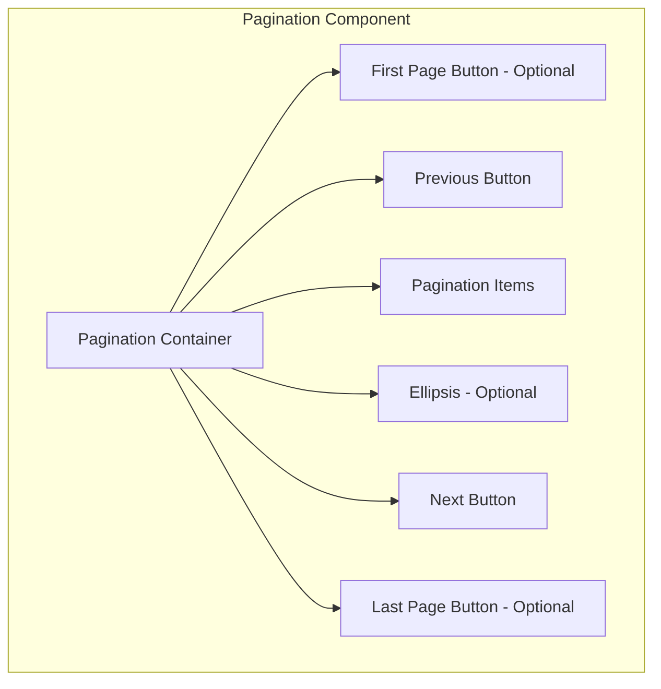

import { BrowserSupport } from "@app/_components/browser-support";
import { BuildEffort } from "@app/_components/build-effort";
import { FaqStructuredData } from "@app/_components/faq-structured-data";

# Pagination

## Overview

**Pagination** is a navigation pattern used to divide large collections of content into manageable chunks or pages.
This helps users to navigate through data sets, search results, or product listings without overwhelming the page with too much information at once.

While pagination is a common and effective pattern, it's important to consider alternatives like [infinite scroll](/patterns/navigation/infinite-scroll) or ["Load More"](/patterns/navigation/load-more) buttons for certain types of content. The choice between pagination and infinite scroll depends on factors such as the nature of the content, user behavior, and the goals of the interface.

<BuildEffort
  level="medium"
  description="Requires page navigation logic, active state management, keyboard accessibility, and ARIA attributes (`aria-current`, `aria-label`)."
/>

## Use Cases

### When to use:

Use this pattern when content needs to be progressively revealed or loaded in a structured manner, ensuring a smoother user experience and improved performance.

It helps users navigate large sets of information without overwhelming them.

**Common scenarios include:**

- **Browsing content lists** – e.g., search results, blog archives, or product listings.
- **Improving page performance** – by loading content in smaller, more manageable segments.
- **Enhancing user clarity** – making large data sets easier to understand and navigate.
- **Navigating sequential content** – e.g., multi-page tutorials or articles.

### When not to use:

- When all content is better presented on a single page (e.g., short lists or summaries).
- If [infinite scroll](/patterns/navigation/infinite-scroll) or a ["load more"](/patterns/navigation/load-more) pattern better suits the user experience.
- In scenarios where users need continuous comparison between items on different pages.

## Benefits

- Improves page load times by limiting the amount of content loaded at once
- Enhances user orientation within large datasets
- Provides clear navigation cues for moving through content
- Supports better performance and reduced server load
- Allows for easier bookmarking and sharing of specific pages
- Gives users a sense of the content's scope (total number of pages/items)
- Better suited for goal-oriented tasks compared to infinite scroll

## Drawbacks

- **Can interrupt user flow** – Users must manually click to navigate instead of continuous scrolling.
- **Navigation complexity** – Requires handling of "Previous," "Next," first, and last page navigation.
- **Harder for mobile users** – Small pagination buttons can be difficult to tap on touchscreens.
- **SEO considerations** – Improper implementation can lead to duplicate content issues
- **Page reload delays** – If not dynamically updated, full-page reloads can slow down user experience.

## Anatomy



### Component Structure

1. **Container**

- The wrapper element that encompasses all pagination controls.
- Manages layout and spacing.
- Ensures proper ARIA labeling and keyboard navigation.

2. **Previous Button**

- Allows users to navigate to the preceding page.
- Typically disabled on the first page to indicate there is no previous content.

3. **Pagination Items**

- Numbered buttons or links for each page.
- Clearly indicate the current page (using visual cues and ARIA attributes).
- May include an ellipsis ("…") for large ranges of pages.

4. **Next Button**

- Allows users to navigate to the next page.
- Disabled on the last page to prevent further navigation.

5. **First & Last Page Buttons (Optional)**

- Provide quick navigation to the **first** and **last** pages.
- Useful when dealing with **long pagination ranges**.

6. **Ellipsis (Optional)**

- Indicates missing page numbers in large paginations.
- Reduces clutter while maintaining navigation clarity.

7. **Visual States**

- **Default:** Normal state with clear labels and clickable elements.
- **Hover and Focus:** Provides visual cues (underline, background change, or border) for interactive elements.
- **Active:** Indicates the currently selected page.
- **Disabled:** Non-interactive controls (e.g., previous on page 1, next on last page).
- **Keyboard Focus:** Ensures proper highlight states for accessibility.
- **ARIA Live Updates:** Announces page changes for screen readers.
- **Loading Indicators (Optional):** Shows progress when paginated content is being fetched asynchronously.

#### **Summary of Components**

| Component                   | Required? | Purpose                                          |
| --------------------------- | --------- | ------------------------------------------------ |
| **Container**               | ✅ Yes    | Wraps the pagination controls.                   |
| **Next/Previous Buttons**   | ✅ Yes    | Allows users to navigate between pages.          |
| **Page List**               | ✅ Yes    | Contains the list of page numbers.               |
| **Page Item**               | ✅ Yes    | Represents each individual page link.            |
| **First/Last Page Buttons** | ❌ No     | Enables quick navigation to the first/last page. |
| **Ellipsis**                | ❌ No     | Represents omitted pages in large paginations.   |
| **Loading Indicator**       | ❌ No     | Displays when fetching new paginated content.    |

## Best Practices

### Content

**Do's ✅**

- Use clear, concise labels for navigation controls
- Provide context (e.g., "Page 5 of 20")
- Consider using ellipsis (...) for large page ranges
- Evaluate whether pagination or infinite scroll is more appropriate for your specific use case and content type
- Show a loading indicator when fetching new content
- Update the URL to reflect the current page number

**Don'ts ❌**

- Don't clutter the interface with too many pagination controls
- Avoid using pagination for very short lists that can be displayed on a single page
- Don't use ambiguous labels that could confuse the user
- Avoid loading unnecessary data or assets that aren't relevant to the current page

### Accessibility

**Do's ✅**

- Use the semantic `<nav>` element to wrap pagination controls
- Label the `<nav>` element with `aria-label="Pagination"` or similar for screen readers
- Ensure each page link is a focusable element and includes clear labels
- Provide a logical keyboard navigation order (e.g., Tab, Enter, Arrow keys)
- Use `aria-current="page"` to indicate the current page
- Automatically scroll to the top of the content area when loading a new page
- Set focus to the main content area or the first item in the new page after loading
- Use ARIA live regions to announce loading status to screen reader users
- Provide a "Skip to content" link that becomes visible on focus for keyboard users

**Don'ts ❌**

- Don't rely solely on color to indicate the current page; also include text or icons
- Avoid complex pagination structures that could confuse keyboard and assistive technology users
- Don't leave the user's scroll position unchanged when loading an entirely new page of content
- Avoid setting focus to the pagination controls after page load, as this can be disorienting

### Visual Design

**Do's ✅**

- Use consistent spacing, typography, and colors to maintain clarity
- Provide clear visual separation between individual pagination items
- Ensure the active state stands out visually
- Consider using subtle hover animations to signal interactivity
- Design for scalability with large numbers of pages (e.g., use abbreviated formats like 1k, 2k for 1000, 2000)
- Implement efficient server-side pagination to minimize load times
- Use smooth scrolling when automatically moving to the top of new content

**Don'ts ❌**

- Don't make interactive elements too small or difficult to tap on mobile devices
- Avoid overly decorative styles that detract from content readability
- Don't block user interaction with the entire page during loading unless absolutely necessary

### Layout & Positioning

**Do's ✅**

- Position the pagination control in a logical location (typically at the bottom of content listings)
- Ensure sufficient contrast between pagination controls and the background
- Use responsive design techniques to maintain usability on various devices
- Consider using progressive loading techniques for images and other media
- Maintain scroll position if only part of the page is being updated (e.g., in a single-page application)

**Don'ts ❌**

- Don't position pagination too far from the actual content, which may force excessive scrolling
- Avoid fixed positioning that could interfere with content readability on small screens
- Don't break the browser's history functionality with custom pagination implementations

### Common Mistakes & Anti-Patterns

#### Too Many Pages (No Page Limiting)

**❌ What’s Wrong?**

Users get overwhelmed if there are **dozens of pages** to click through, making it hard to find relevant content.

**How to Fix It?**
Consider using **“Load More”** or **infinite scroll** if the content is suited to continuous exploration. If pagination is necessary, cap the total pages or provide filters to reduce results.

---

#### Hiding Pagination Controls on Mobile

**❌ What’s Wrong?**

Some designs remove pagination on smaller screens, forcing mobile users to scroll endlessly or guess how to navigate deeper pages.

**How to Fix It?**
Use a **compact pagination menu** (e.g., next/previous buttons or a limited set of page links) so users can still control navigation on mobile devices.

---

#### Not Remembering the Last Page

**❌ What’s Wrong?**

When users navigate away and come back, they lose track of which page they were on, leading to frustration and repetitive browsing.

**How to Fix It?**
Store pagination state in the **URL (e.g., `?page=2`)** or in session/local storage. When users return, restore them to the same page.

---

#### Inconsistent Page Numbers (Jumping Pages)

**❌ What’s Wrong?**

Some pagination systems remove or rearrange pages based on dynamic data, confusing users who rely on consistent numbering.

**How to Fix It?**
Maintain a **stable page structure**—if new items appear, consider adding them at the end or updating page counts without shifting existing page numbers unexpectedly.

---

#### No Keyboard Accessibility (Accessibility)

**❌ What’s Wrong?**

If pagination links or buttons aren’t keyboard-focusable, users relying on the keyboard can’t move between pages effectively.

**How to Fix It?**
Use proper interactive elements (`<button>`, `<a href>`). Confirm `Tab` navigation works for each link or control, and that pressing `Enter` or `Space` actually triggers page changes.

---

#### Poorly Labeled Page Links (Accessibility)

**❌ What’s Wrong?**

Screen readers can’t convey page numbers or next/previous actions if the links have generic text like “...” or “Page.”

**How to Fix It?**
Add `aria-label` attributes (e.g., `aria-label="Go to page 2"`) or text that clearly states each page’s purpose. For “Next” and “Previous,” label them explicitly (e.g., `aria-label="Go to next page"`).

---

#### No Visible Focus Indicator (Accessibility)

**❌ What’s Wrong?**

Users can’t see where their keyboard focus is if the pagination links have no visible outline or highlight.

**How to Fix It?**
Include a **high-contrast focus style** (outline, underline, etc.) so it’s obvious which page or button is selected or about to be selected.

---

#### Unclear Feedback After Page Selection (Accessibility)

**❌ What’s Wrong?**

When users click a pagination link, especially if the new page loads asynchronously, they might not realize the content has updated.

**How to Fix It?**
Use an **ARIA live region** or a brief status announcement (e.g., “Page 2 loaded”) so screen reader users (and everyone else) know new content has appeared.

## Micro-Interactions & Animations

When building pagination, consider these specific, purpose-driven animations:

- **Button Hover Animation:**

  - **Effect:** On hover, scale the button up to 1.05× its original size and smoothly transition the background color.
  - **Timing:** Use a 200ms ease transition to ensure responsiveness without delay.

- **Focus State Animation:**

  - **Effect:** When a button receives focus (via keyboard or pointer), animate a clear visual indicator—such as a crisp outline or subtle drop-shadow—to emphasize its active state.
  - **Timing:** Apply the effect over 200ms to create a smooth visual cue.

- **Active (Click) Animation:**

  - **Effect:** Upon clicking a pagination button, trigger a brief confirmation animation (for example, a quick pulse or a slight scale up to 1.1×) to signal the selection.
  - **Timing:** The animation should complete within 150–200ms to provide immediate feedback without interrupting the user flow.

- **Content Transition (When Applicable):**

  - **Effect:** If the pagination action triggers a content update (common in SPAs), apply a fade transition where the outgoing content fades out and the incoming content fades in.
  - **Timing:** Transition the content opacity over approximately 250ms to ensure a smooth change without distracting from the overall experience.

- **Reduced Motion Consideration:**
  - **Implementation:** Always check for the user’s motion preferences (e.g., via the `prefers-reduced-motion` media query) and disable or minimize animations accordingly to ensure accessibility.

These precise animations provide just enough feedback to guide user interactions and enhance the overall feel of your pagination component without overwhelming the interface.

## Tracking

Tracking pagination interactions helps measure how users navigate through paginated content, whether they prefer clicking through pages sequentially or skipping ahead, and if they reach deeper pages. By analyzing pagination behavior, we can optimize the user experience and improve content discoverability.

### Key Tracking Points

Each pagination interaction provides valuable insights into user behavior. Below are the key events that should be tracked:

| **Event Name**            | **Description**                                                                                            | **Why Track It?**                                                   |
| ------------------------- | ---------------------------------------------------------------------------------------------------------- | ------------------------------------------------------------------- |
| `pagination.view`         | When the pagination component enters the viewport.                                                         | Determines visibility and whether pagination is available to users. |
| `pagination.next_click`   | When a user clicks the **next page** button.                                                               | Measures sequential navigation behavior.                            |
| `pagination.prev_click`   | When a user clicks the **previous page** button.                                                           | Tracks backward navigation trends.                                  |
| `pagination.page_click`   | When a user clicks a specific numbered page.                                                               | Helps assess whether users jump ahead instead of clicking next.     |
| `pagination.first_click`  | When a user clicks the first page button (if available).                                                   | Measures how often users return to the beginning.                   |
| `pagination.last_click`   | When a user clicks the last page button (if available).                                                    | Indicates if users want to skip directly to the end.                |
| `pagination.page_load`    | When a new paginated page loads (via user interaction or auto-pagination).                                 | Helps measure engagement depth.                                     |
| `pagination.scroll_usage` | If infinite scrolling is enabled, tracks when users reach a pagination trigger (e.g., “Load More” button). | Helps compare pagination click interactions vs. scrolling behavior. |

### Event Payload Structure

To ensure consistent tracking, here’s a recommended event format:

```json
{
  "event": "pagination.page_click",
  "properties": {
    "pagination_id": "search_results",
    "clicked_page": 4,
    "total_pages": 10,
    "interaction_type": "click"
  }
}
```

### Key Metrics to Analyze

Once tracking is in place, the following metrics provide actionable insights:

- **Next Page Click Rate** → Percentage of users who click the "Next" button.
- **Page Jump Rate** → Percentage of users who select a specific page instead of clicking "Next."
- **Backward Navigation Rate** → Percentage of users who click "Previous" or navigate back to earlier pages.
- **Deep Pagination Engagement** → How far users go into paginated content (e.g., do they go past page 3?).
- **First vs. Last Page Access Rate** → How often users jump to the first or last page.
- **Infinite Scroll vs. Pagination Click Rate** → If both options exist, measures preference for clicking pagination vs. scrolling to load more.

### Insights & Optimization Based on Tracking

By analyzing tracking data, we can optimize the pagination experience:

- 🚨 **Low Next Page Click Rate?**
  → Users may not be finding pagination useful or engaging.
  **Optimization:** Improve results per page, add stronger visual cues, or test infinite scrolling.

- ⏳ **High Page Jump Rate?**
  → Users may prefer skipping ahead rather than navigating sequentially.
  **Optimization:** Provide better filtering options or allow users to select results per page.

- 🔄 **Frequent Backward Navigation?**
  → Users might be missing important content on previous pages.
  **Optimization:** Improve sorting and relevance of content on earlier pages.

- 🔁 **Low Deep Pagination Engagement?**
  → Users rarely go beyond the first few pages.
  **Optimization:** Ensure important content isn't buried too deep or test loading more items per page.

- ⚙️ **High Infinite Scroll Usage vs. Clicks?**
  → If users prefer scrolling over clicking pagination, consider testing infinite scrolling as the default option.
  **Optimization:** Ensure infinite scroll doesn't negatively impact performance or usability.

By continuously monitoring these metrics, we can refine pagination usability, ensuring users efficiently navigate through content without frustration.

## Localization

```json
{
  "pagination": {
    "next_page": {
      "label": "Next",
      "aria_label": "Go to the next page"
    },
    "previous_page": {
      "label": "Previous",
      "aria_label": "Go to the previous page"
    },
    "page_number": {
      "aria_label": "Page {page_number}"
    },
    "first_page": {
      "label": "First",
      "aria_label": "Go to the first page"
    },
    "last_page": {
      "label": "Last",
      "aria_label": "Go to the last page"
    }
  }
}
```

## Code Examples

### Basic Implementation

```html
<!-- Pagination Container -->
<nav class="pagination" aria-label="Pagination Navigation">
  <!-- Previous Button -->
  <button
    type="button"
    class="pagination-prev"
    aria-label="Previous page"
    disabled
  >
    Previous
  </button>

  <!-- Pagination Items -->
  <ul class="pagination-list">
    <li>
      <button
        type="button"
        class="pagination-item"
        aria-label="Page 1"
        aria-current="true"
      >
        1
      </button>
    </li>
    <li>
      <button type="button" class="pagination-item" aria-label="Page 2">
        2
      </button>
    </li>
    <li>
      <button type="button" class="pagination-item" aria-label="Page 3">
        3
      </button>
    </li>
    <!-- Ellipsis for additional pages, if needed -->
    <li><span class="pagination-ellipsis">…</span></li>
    <li>
      <button type="button" class="pagination-item" aria-label="Page 10">
        10
      </button>
    </li>
  </ul>

  <!-- Next Button -->
  <button type="button" class="pagination-next" aria-label="Next page">
    Next
  </button>
</nav>
```

## Accessibility

### ARIA Attributes

**Required ARIA attributes:**

- The container should use role="navigation" with an appropriate aria-label (e.g., "Pagination Navigation").
- Each pagination item should include aria-labels indicating the respective page number.
- Indicate the current page using aria-current="true".

### Keyboard Interaction Pattern

The following table outlines the standard keyboard interactions for pagination components:

| Key         | Action                                                   |
| ----------- | -------------------------------------------------------- |
| Tab         | Navigate among pagination controls and page buttons      |
| Enter/Space | Activate the focused pagination button                   |
| Arrow Keys  | Optionally, navigate between page items (if implemented) |

## SEO

- Use semantic HTML (e.g., `<nav>` and lists) to help search engines understand your site structure.
- Ensure that pagination links are crawlable, improving site indexing.

## Testing Guidelines

### Functional Testing

**Should ✓**

- [ ] Verify that the pagination controls render correctly.
- [ ] Ensure clicking the Previous and Next buttons navigates to the correct pages.
- [ ] Test that the active state updates when navigating through pages.
- [ ] Confirm that disabled states (on the first or last page) are correctly implemented.

### Accessibility Testing

**Should ✓**

- [ ] Validate that the pagination container has role="navigation" and an appropriate aria-label.
- [ ] Confirm each pagination item is focusable and properly labeled.
- [ ] Ensure keyboard navigation works seamlessly with the pagination controls.
- [ ] Test that screen readers correctly announce the current page.

### Visual Testing

**Should ✓**

- [ ] Confirm that pagination controls adapt gracefully to different screen sizes.
- [ ] Verify that active and hover states are visually distinct.
- [ ] Check that pagination does not overlap or interfere with other page elements.

### Performance Testing

**Should ✓**

- [ ] Ensure that pagination does not cause significant loading delays.
- [ ] Validate that new page content loads efficiently when navigating.

## Design Tokens

These design tokens follow the [Design Tokens Format](https://design-tokens.github.io/community-group/format/) specification and can be used with various token transformation tools to generate platform-specific variables.

### Pagination Tokens in DTF Format

```json:pagination.json
{
  "$schema": "https://design-tokens.org/schema.json",
  "pagination": {
    "container": {
      "padding": { "value": "1rem", "type": "dimension" },
      "background": { "value": "{color.white}", "type": "color" }
    },
    "item": {
      "size": { "value": "2rem", "type": "dimension" },
      "fontSize": { "value": "1rem", "type": "fontSize" },
      "color": { "value": "{color.text}", "type": "color" },
      "activeColor": { "value": "{color.primary}", "type": "color" }
    },
    "button": {
      "padding": { "value": "0.5rem 1rem", "type": "dimension" },
      "borderRadius": { "value": "0.25rem", "type": "dimension" }
    }
  }
}
```

## Related Patterns

- [Infinite Scroll](/patterns/navigation/infinite-scroll) - An alternative to pagination for certain types of content, particularly suited for content streams or social media feeds
- [Load More](/patterns/navigation/load-more) - A simpler alternative to pagination that gives users manual control over loading additional content

## Frequently Asked Questions

<FaqStructuredData
  items={[
    {
      question: "What is pagination in web design?",
      answer:
        "Pagination is a UI design pattern that divides content into discrete pages, allowing users to navigate through large datasets efficiently. It prevents information overload and improves performance. Compared to [Infinite Scroll](/patterns/navigation/infinite-scroll), pagination gives users more control over navigation and reduces performance issues.",
    },
    {
      question: "When should I use pagination?",
      answer:
        "Use pagination when dealing with large content collections, such as search results, product listings, or blog archives. It is particularly useful when users need to revisit specific pages, unlike [Infinite Scroll](/patterns/navigation/infinite-scroll), which makes it harder to return to previous items.",
    },
    {
      question: "How can I make pagination accessible?",
      answer:
        "Ensure pagination controls are keyboard-navigable and screen reader-friendly. Use semantic HTML elements like `<nav>` to denote navigation regions and provide ARIA attributes such as `aria-current` for the active page. Additionally, consider using a 'Load More' button as an alternative in certain cases—see the [Load More](/patterns/navigation/load-more) pattern for best practices.",
    },
    {
      question: "What are the benefits of using pagination?",
      answer:
        "Pagination improves usability by organizing content into structured pages, making it easier to navigate. Unlike [Infinite Scroll](/patterns/navigation/infinite-scroll), it ensures users can access the footer and navigate efficiently without performance concerns. Additionally, pagination creates unique URLs, benefiting SEO by allowing search engines to index content properly.",
    },
    {
      question:
        "What are common mistakes to avoid when implementing pagination?",
      answer:
        "Avoid using vague labels like 'Previous' and 'Next' without clear context—use explicit page numbers where possible. Ensure pagination controls are not too small or closely spaced, as they must be easily tappable, especially on mobile. If the dataset is large, consider implementing both pagination and a [Back to Top](/patterns/navigation/back-to-top) button to improve usability.",
    },
    {
      question: "How does pagination compare to infinite scroll and load more?",
      answer:
        "Pagination allows structured navigation and works well for large datasets, whereas [Infinite Scroll](/patterns/navigation/infinite-scroll) offers a seamless browsing experience but can make revisiting content difficult. [Load More](/patterns/navigation/load-more) provides a middle ground, allowing users to request additional content manually while still keeping the page uncluttered.",
    },
  ]}
/>
## Resources

### Libraries

- [Pagination - shadcn/ui](https://ui.shadcn.com/docs/components/pagination)
- [Pagination - Origin UI](https://originui.com/pagination)
