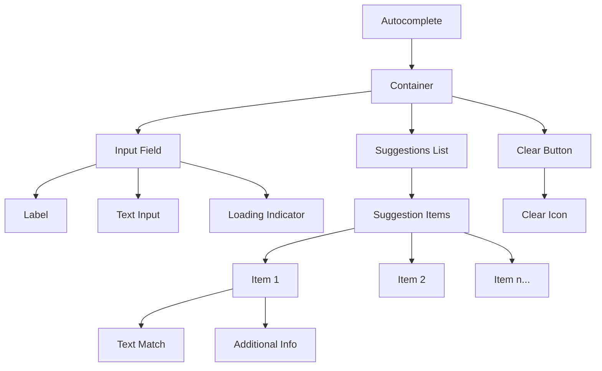

import { BrowserSupport } from "@app/_components/browser-support";
import { BuildEffort } from "@app/_components/build-effort";
import { FaqStructuredData } from "@app/_components/faq-structured-data";
import { PatternPreview } from "@app/_components/pattern-preview";
import { Playground } from "@app/_components/playground";

# Autocomplete

**_(Also called Autosuggest)_**

<PatternPreview />

## Overview

**Autocomplete** helps users quickly find and select values from predefined options as they type.

Autocomplete combines [text input](/patterns/forms/text-field) flexibility with dropdown-style selection, providing real-time suggestions matching user input. This pattern reduces errors, speeds data entry, and improves form completion.

<BuildEffort
  level="medium"
  description="Requires live filtering, real-time suggestion updates, keyboard navigation, and screen reader compatibility using ARIA attributes."
/>

## Use Cases

### When to use:

- Users select from large sets of predefined options (country selection, airport codes)
- Users need faster option selection than scrolling through long dropdowns
- Reducing errors by guiding users to valid input options
- Input has finite, known valid responses
- Combining free text input with suggestion functionality

### When not to use:

- Fewer than 10 options exist (use standard dropdown/select instead)
- Users enter completely free-form text without restrictions
- All options need simultaneous visibility for comparison
- Network latency significantly delays suggestion results
- Input field requires exact, verbatim text entry (passwords)

### Common scenarios and examples

- **Product search** in e-commerce catalogs
- **City name entry** for travel or weather applications
- **User or contact lookup** in messaging or collaboration tools

## Benefits

- **Faster data entry** through real-time option narrowing
- **Less user frustration** with guided valid options
- **Fewer mistakes** and typos using confirmed suggestions from lists

## Drawbacks

- **Accessibility challenges** – Needs proper ARIA attributes (`aria-expanded`, `aria-controls`, `aria-activedescendant`) for screen readers
- **Keyboard navigation complexity** – Users navigate suggestions with arrow keys and select with Enter
- **Performance issues** – Dynamic suggestion fetching introduces lag without debouncing and caching
- **User overwhelm** – Too many suggestions or unclear results create cognitive overload
- **Implementation effort** – Must handle filtering logic and suggestion visibility management

## Anatomy

### Component Structure



1. **Container**

- Wraps entire autocomplete area including input and dropdown
- Handles positioning, sizing, and floating layers for suggestions

2. **Input**

- Text field for user queries
- Gives real-time updates and triggers suggestion fetching

3. **Label**

- Optional label describing input purpose
- Clarifies for screen readers and provides visible context

4. **Clear Button**

- Quick input field clearing
- Usually shows as "X" or "✕" icon

#### Summary of Components

| Component       | Required? | Purpose                         | Notes                |
| --------------- | --------- | ------------------------------- | -------------------- |
| Container       | ✅ Yes    | Wrapper for autocomplete        | Manages positioning  |
| Input Field     | ✅ Yes    | Text entry for user queries     | Triggers suggestions |
| Label           | ✅ Yes    | Describes input purpose         | Accessibility required |
| Suggestions List| ✅ Yes    | Displays filtered options       | Role="listbox"       |
| Clear Button    | ❌ No     | Clears input and suggestions    | Improves UX          |
| Loading State   | ❌ No     | Shows fetching in progress      | For async data       |

## Best Practices

### Content

**Do's ✅**

- Provide a descriptive label that indicates the purpose of the Autocomplete field
- Use placeholder text to show example input (e.g., "Start typing a country...")

**Don'ts ❌**

- Don't rely on placeholder text as a replacement for a label
- Don't make your suggestions so vague that it's unclear what the user is selecting

### Accessibility

**Do's ✅**

- Use `aria-controls`, `aria-autocomplete`, and other relevant ARIA attributes to help screen readers
- Include a visually hidden label or descriptive text if you rely on an icon-only clear button
- Add a debounce delay to the input field to avoid triggering a fetch request too often

**Don'ts ❌**

- Don't remove focus outlines without providing alternative focus indicators
- Don't assume all users can use a mouse; ensure keyboard navigation works properly

### Visual Design

**Do's ✅**

- Keep the suggestion list clearly delineated, with sufficient contrast and spacing
- Highlight hovered or focused suggestion items with a distinct visual state

**Don'ts ❌**

- Don't display an overly large list of suggestions (limit it to a reasonable number), use a scroll bar to allow users to scroll through the list.
- Don't create a cluttered or confusing interface by mixing too many design elements

### Layout & Positioning

**Do's ✅**

- Position the dropdown list immediately below the input field
- Ensure suggestions list appears in front of other page elements when open

**Don'ts ❌**

- Don't hide the list behind overlays or modals
- Don't move the dropdown to a completely different area away from the input

## Autocomplete Variations

### Search Autocomplete
Provides search suggestions and query completions for search interfaces.

### User/Contact Lookup
Helps users find and select specific people, contacts, or user accounts.

### Location Autocomplete
Assists with address, city, or geographic location selection.

### Product/Catalog Autocomplete
Enables quick product discovery in e-commerce or inventory systems.

### Tag/Category Autocomplete
Allows selection from predefined tags, categories, or classification systems.

## Examples

### Interactive Demo

<Playground
  patternType="forms"
  pattern="autocomplete"
  example="basic"
/>

### Basic Implementation

```html
<!-- Basic Autocomplete Markup -->
<div>
  <label for="autocompleteInput">Search for an option</label>
  <input
    type="text"
    id="autocompleteInput"
    name="autocompleteInput"
    aria-autocomplete="list"
    aria-controls="suggestions-list"
    autocomplete="off"
    placeholder="Type to search..."
  />
  <button type="button" aria-label="Clear input">✕</button>
  <ul id="suggestions-list" role="listbox">
    <!-- Dynamically generated suggestions go here -->
  </ul>
</div>
```

## Common Mistakes & Anti-Patterns

### 🚫 **No Loading State**
**The Problem:**
Users think the system is broken when autocomplete doesn't provide immediate feedback during search operations.

**How to Fix It:**
Show a loading indicator or skeleton state while fetching suggestions, especially for network-based lookups.

### 🚫 **Too Many Suggestions**
**The Problem:**
Overwhelming users with 50+ suggestions creates cognitive overload and makes selection difficult.

**How to Fix It:**
Limit suggestions to 5-10 items and provide filtering options or "view more" functionality.

### 🚫 **Poor Keyboard Navigation**
**The Problem:**
Users can't navigate suggestions with arrow keys or can't easily escape the dropdown.

**How to Fix It:**
Implement proper keyboard navigation with Arrow Up/Down, Enter to select, and Escape to close.

### 🚫 **No Clear Button**
**The Problem:**
Users struggle to clear their input and start over, especially on mobile devices.

**How to Fix It:**
Include a clear button (X icon) that appears when input has content and clears both field and suggestions.

### 🚫 **Ignoring Accessibility**
**The Problem:**
Screen readers can't understand the autocomplete relationship or navigate suggestions properly.

**How to Fix It:**
Use proper ARIA attributes: `aria-autocomplete="list"`, `aria-controls`, `aria-activedescendant`, and `role="listbox"`.

## Performance

### Performance Metrics

**Target Metrics:**

- **First Contentful Paint**: < 100ms for autocomplete initialization
- **Search Response Time**: < 200ms for local data, < 500ms for remote
- **Bundle Size**: < 8KB minified and gzipped for basic implementation
- **Memory Usage**: Monitor for memory leaks with large suggestion datasets
- **Keystroke to Result**: < 300ms total time from keypress to suggestions display

**Optimization Strategies:**

- **Debouncing**: Delay API calls until user stops typing (300ms recommended)
- **Caching**: Store recent search results to avoid redundant network requests
- **Virtual Scrolling**: For large suggestion lists to maintain performance
- **Request Cancellation**: Cancel previous requests when new ones are made
- **Lazy Loading**: Load autocomplete functionality only when field is focused

**Mobile Performance:**

- **Touch Optimization**: Ensure suggestions are easily tappable (44px minimum)
- **Reduced Network Usage**: Cache common searches and use compression
- **Battery Efficiency**: Minimize background processing and animations
- **Progressive Enhancement**: Provide basic functionality without JavaScript
- **Offline Capability**: Cache frequent searches for offline use

## Usability Testing Insights

Research shows that users:

- **Expect immediate feedback (92% of users)** - Any delay over 200ms feels broken
- **Scan the first 3-5 suggestions primarily** - Later items are rarely selected
- **Prefer visual highlighting of matching text** - Bold or colored matches improve scannability
- **Get frustrated with poor spelling tolerance** - Fuzzy matching increases success rates by 34%
- **Abandon forms with broken autocomplete** - 67% of users leave if suggestions don't work

**Testing Recommendations:**

- Test with users who have varying typing speeds and accuracy
- Include users with motor impairments for keyboard navigation testing
- Test on actual mobile devices with different screen sizes
- Conduct both moderated sessions and unmoderated A/B tests
- Measure task completion rates and time-to-selection metrics

## Tracking

### Event Tracking

Track key user interactions:

```javascript
// Example tracking implementation
trackEvent('autocomplete_interaction', {
  action: 'suggestion_selected',
  position: 2,
  query_length: 5,
  total_suggestions: 8,
  selection_method: 'click' // or 'keyboard'
});

trackEvent('autocomplete_search', {
  query: 'redacted_query_length',
  results_count: 12,
  response_time: 150,
  data_source: 'api' // or 'cache'
});
```

### Metrics to Monitor

- **Search success rate**: Percentage of searches resulting in selection
- **Average selection position**: Which suggestion users typically choose
- **Query abandonment rate**: Users who type but don't select anything
- **Error frequency**: Failed API calls or empty result sets
- **Performance metrics**: Response times and loading states

### Insights & Optimization Based on Tracking

- A/B test different suggestion limits (5 vs 8 vs 10 items)
- Optimize suggestion ranking based on selection patterns
- Identify common failed searches to improve data coverage
- Monitor mobile vs desktop usage patterns for responsive improvements

## Localization

```json
{
  "autocomplete": {
    "placeholder": "Start typing to search...",
    "loading": "Loading suggestions...",
    "no_results": "No results found",
    "clear_button": "Clear search",
    "selected": "Selected: {item}",
    "suggestions_available": "{count} suggestions available"
  }
}
```

**Considerations:**
- **Text expansion**: Allow 30% more space for languages like German
- **RTL language support**: Adjust dropdown positioning and text alignment
- **Cultural search patterns**: Different cultures have varying search behaviors
- **Input method support**: Consider IME composition for Asian languages
- **Numeric formatting**: Respect local number and date formats in suggestions

## Accessibility

### ARIA Attributes

**Required ARIA attributes:**
- `aria-autocomplete="list"`: Indicates autocomplete behavior
- `aria-controls="suggestions-list"`: Links input to suggestions container
- `aria-activedescendant`: Points to currently highlighted suggestion
- `aria-expanded`: Shows if suggestions are visible
- `role="listbox"`: Defines suggestions container role
- `role="option"`: Individual suggestion items

### Keyboard Interaction Pattern

The following table outlines the standard keyboard interactions for Autocomplete components.

| Key           | Action                                                                |
| ------------- | --------------------------------------------------------------------- |
| Tab           | Move focus to next interactive element                               |
| Shift + Tab   | Move focus to previous interactive element                           |
| Enter         | Select the currently highlighted suggestion                          |
| Escape        | Close suggestions list and clear highlight                           |
| Arrow Down    | Move highlight to next suggestion                                    |
| Arrow Up      | Move highlight to previous suggestion                                |
| Home          | Highlight first suggestion                                           |
| End           | Highlight last suggestion                                            |

### Screen Reader Support

- Announce suggestion count when list opens: "5 suggestions available"
- Read highlighted option as user navigates: "Option 2 of 5, New York"
- Confirm selection: "Selected: New York, NY"
- Announce when no results found: "No suggestions available"

## SEO Considerations

- Use semantic `<input>` elements with proper `name` attributes for form submission
- Include descriptive labels that search engines can understand
- Implement proper form validation for better user experience signals
- Consider server-side rendering for critical autocomplete data
- Use structured data markup for location-based autocomplete
- Ensure autocomplete works without JavaScript for crawler accessibility
- Implement proper heading hierarchy around autocomplete sections
- Include alt text or labels for any icons used in the interface

**Structured Data Example:**
```json
{
  "@context": "https://schema.org",
  "@type": "SearchAction",
  "target": {
    "@type": "EntryPoint",
    "urlTemplate": "https://example.com/search?q={search_term_string}"
  },
  "query-input": "required name=search_term_string"
}
```

## Testing Guidelines

### Functional Testing

**Should ✓**

- [ ] Autocomplete initializes without errors
- [ ] Suggestions appear after minimum character threshold
- [ ] Keyboard navigation works through all suggestions
- [ ] Enter key selects highlighted suggestion
- [ ] Escape key closes suggestions and clears highlight
- [ ] Clear button removes input and closes suggestions
- [ ] Loading states display during async operations
- [ ] Error states show when no results or API fails
- [ ] Touch interactions work on mobile devices
- [ ] Screen readers announce suggestions correctly

## Browser Support

<BrowserSupport
  features={[
    "CSS Flexbox",
    "ARIA Support",
    "Fetch API"
  ]}
/>

**Polyfills Required:**
- Fetch API for older browsers
- IntersectionObserver for virtual scrolling
- Progressive enhancement for core functionality

## Design Tokens

These design tokens follow the [Design Tokens Format](https://design-tokens.github.io/community-group/format/) specification and can be used with various token transformation tools to generate platform-specific variables.

### Autocomplete Tokens in DTF Format

```json
{
  "$schema": "https://design-tokens.org/schema.json",
  "Autocomplete": {
    "container": {
      "borderRadius": {
        "value": "0.25rem",
        "type": "dimension"
      },
      "background": {
        "value": "{color.white}",
        "type": "color"
      }
    },
    "input": {
      "fontSize": {
        "value": "1rem",
        "type": "dimension"
      },
      "padding": {
        "value": "0.5rem",
        "type": "dimension"
      }
    },
    "suggestionsList": {
      "maxHeight": {
        "value": "200px",
        "type": "dimension"
      },
      "background": {
        "value": "{color.gray.50}",
        "type": "color"
      },
      "itemHoverBg": {
        "value": "{color.gray.100}",
        "type": "color"
      }
    }
  }
}
```

## Frequently Asked Questions

<FaqStructuredData
  items={[
    {
      question: "What is autocomplete in web design?",
      answer:
        "Autocomplete is a user interface feature that predicts and displays suggestions as a user types into an input field, helping them complete their input more efficiently.",
    },
    {
      question: "When should I use autocomplete?",
      answer:
        "Autocomplete is beneficial when users need to input data that can be predicted or matched from a known set of options, such as search queries, addresses, or product names.",
    },
    {
      question: "How can I make an autocomplete feature accessible?",
      answer:
        "Ensure the input field is focusable and supports keyboard navigation. Use ARIA roles and properties like `aria-autocomplete` and `aria-expanded` to convey the state to assistive technologies.",
    },
    {
      question: "What are the benefits of using autocomplete?",
      answer:
        "Autocomplete enhances user experience by reducing typing effort, minimizing errors, and providing faster access to relevant information.",
    },
    {
      question:
        "What are common mistakes to avoid when implementing autocomplete?",
      answer:
        "Avoid overwhelming users with too many suggestions, neglecting accessibility considerations, and providing irrelevant or poorly ranked suggestions.",
    },
  ]}
/>

## Related Patterns

Consider these related patterns when implementing Autocomplete:

- [Text Field](/patterns/forms/text-field) - Foundation input component for autocomplete
- [Dropdown](/patterns/forms/dropdown) - Alternative for predefined option selection
- [Search](/patterns/navigation/search) - Full search interface implementation
- [Combobox](/patterns/forms/combobox) - Hybrid input/select component
- [Tags Input](/patterns/forms/tags-input) - Multi-selection with autocomplete

## Resources

### Articles

- [9 UX Best Practice Design Patterns for Autocomplete Suggestions](https://baymard.com/blog/autocomplete-design) by Baymard Institute
- [Best Practices: Designing autosuggest experiences](https://uxmag.com/articles/best-practices-designing-autosuggest-experiences)

## Documentation

- [WAI-ARIA: Combobox Pattern](https://www.w3.org/WAI/ARIA/apg/patterns/combobox/)
